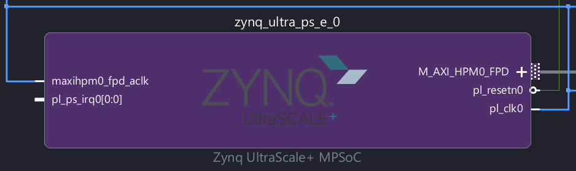
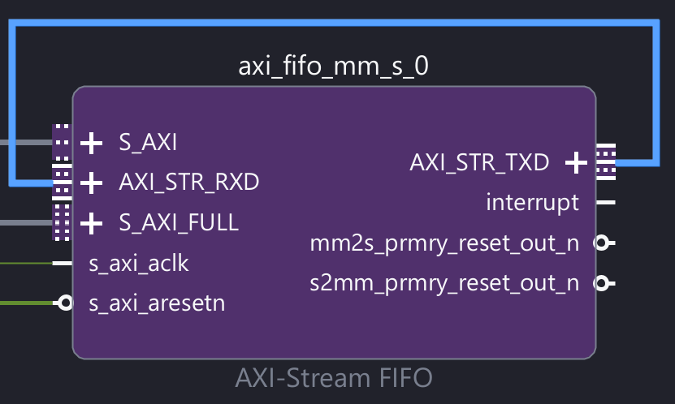
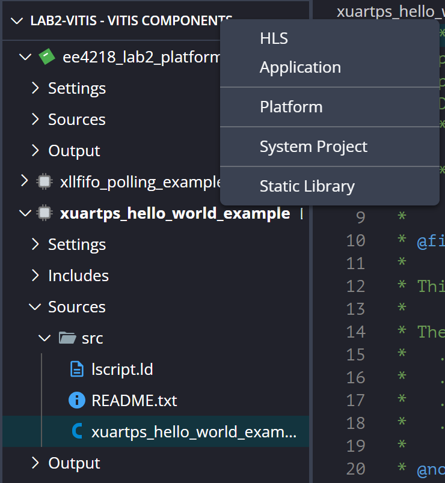
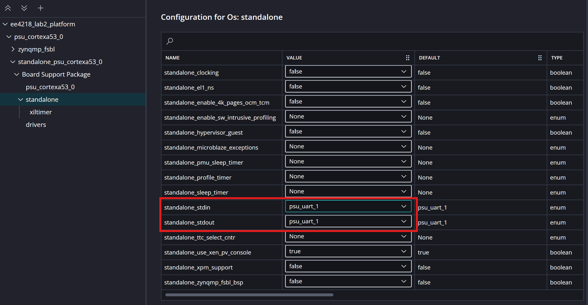
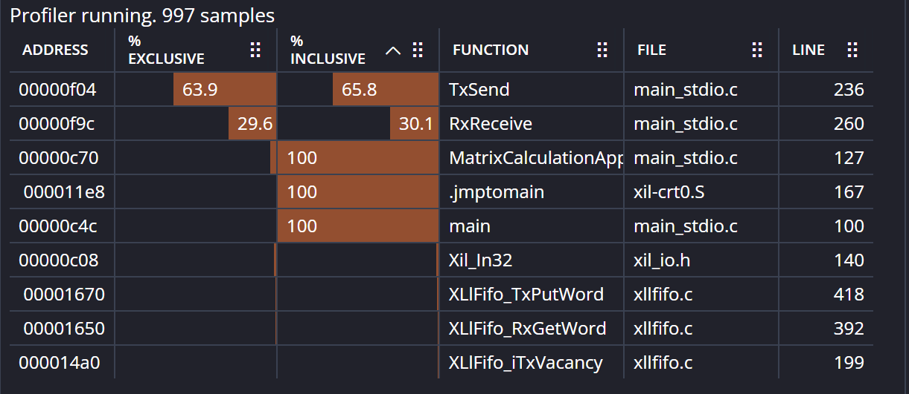

---
metaLinks:
  alternates:
    - /broken/spaces/W45nwClYZdzz9MQG1dUb/pages/7Ig1N2n4ueVEfjrgInqP
---

# Lab 02 - Introduction to Hardware/Software Co-Design

In Lab 02, we are going to configure our FPGA and write a C program to enable the feature of sending data and receiving data to and from the coprocessor via UART. The sending and receiving process is shown in the following diagram.

<figure><figcaption></figcaption></figure>


The orange line in the coprocessor module indicates that in this lab, we will just do the "loopback", which means that the coprocessor won't do any calculation and this matrix multiplication job is done **on the ARM A53 processor** on the PS instead. In the future lab, we will open this loop.


## Create the Hardware Platform

The diagram for the hardware platform that we are going to create is shown as follows:

<figure><figcaption></figcaption></figure>

The newly added blocks will be discussed in detail in this section

### Pins

To access the I/O modules in a processor system, such as UART, SPI, and I²C, we must manipulate the interface signals provided by these modules. For example, a UART module typically uses the signals

1. **TXD (Transmit Data)** and
2. **RXD (Receive Data)**.

These signals are connected to the external world through the **physical pins** on the board.

However, assigning a dedicated pin to every interface signal of every I/O module would require a very large number of pins, which is impractical due to physical, cost, and packaging constraints. To address this problem, modern processor systems use **multiplexers** to allow multiple internal I/O signals to share the same physical pins.

With multiplexing, each physical pin can be connected to different internal I/O modules, but only one function is active at a time. The selection of which module is connected to a given pin is controlled by specific **configuration registers**, often called **I/O multiplexing registers** or **pin control registers**. By writing to these registers in software, the processor can dynamically select which I/O module (e.g., UART, SPI, or I²C) is routed to the pins.

A short example will be when our laptop is sending data to the UART, the data goes from a certain **pin** -> the multiplexer routed it to the RXD on the UART -> UART stores the data in its small FIFO -> the data is waited to be collected by the PS by using `scanf()` or equivalent.


In this lab, we configure the our `UART1` to use pin number 36 and 37 on the board.


<details>

<summary>What is the maximum baud rate for the UART?</summary>

First thing first, UART is **asynchronous** and thus it doesn't need a clock to transmit data. In other words, when our laptop sends the `.csv` files to the PS, it doesn't need a clock signal. However, on the PS side, it has a clock to **sample** the data.

Assume that the clock on the PS samples data only on its **rising clock edge**, when 8 bits of data come in, we need at least $$8\times2=16$$ cycles to sample the 8 bits data (This is by the [**Nyquist Sampling Theorem**](https://wenbo-notes.gitbook.io/cg2111a-notes/studio/studio-8-adc-module#nyquist-sampling-theorem) we have learned in CG2111A). This will give us the **theoretical maximum baud rate** that our UART can have given that we already know the frequency of the PS clock.

For example, if our PS clock runs at 100MHz, then the maximum baud rate for the UART will be 50Mbps ideally.

</details>

### Clock

Each module in the Programmable Logic (PL) requires a clock signal to operate. This clock is generated by the Processing System (PS), which contains Phase-Locked Loops (PLLs) capable of producing multiple clock frequencies from a reference clock. These clocks are routed from the PS to the PL.

The clock configuration, such as frequency and enable settings, is controlled through specific registers in the PS.


In this lab, we will be using one clock whose frequency is 100MHz. This clock should be connected to every other module in the PL, like the AXI-Stream FIFO, AXI-Timer, etc.


#### Clock in the PS

So far, what we are talking about is the clock **generated clock signal** from the PLL in the PS. Within the PS, it has its own AXI bus connected to multiple peripherals like UART, DDR controller, etc. This AXI Bus is clocked by another PLL inside the PS and its clock frequency is usually **higher than 100MHz**. For example, the clock frequency can be around **300MHz**.

<details>

<summary>How does these two clocks work together?</summary>

For all the blocks at the PL, they operate at the clock frequency of 100MHz while all the peripherals inside the PS operates at the clock frequency of 300MHz. So, the problem is that for those AXI Bus between the PS and PL, what clock frequency do they operate under?

The answer is simple, we first need to separate the AXI bus in between the PS and PL to three parts:

1. **AXI Bus** from within the PS to the port on the PS.
2. The port on the PS.
3. **AXI Bus** from the port on the PS to the PL.

And for the two AXI Buses, we have the clock frequency to be

1. 300MHz, as this AXI Bus is totally in the PS.
2. 100MHz, as this AXI Bus is in the PL.

And the intermediate port is called **High-Performance (HP) AXI ports**. They serve as a converter and has a special **asynchronous FIFOs** to wrtie data at a clock frequency (e.g., 100MHz) and push data out at another clock frequency (e.g., 300MHz).

</details>

#### Clock for the ARM processor

The ARM A53 microprocessor is clocked at another clock and its clock frequency is **1.33 GHz**. As the AXI bus within the PS only runs under 300MHz, it kind of explains that in nowaday's computer, the bottleneck is **usually** with the memory. As the microprocessor needs to wait for the memory to give it data to process and this will take a few clock cycles depending on the type of memory.

For example, the processor takes around 2-3 cycles to get the data from the L1 cache and more cycles for higher level cache and the DDR memory.

### PS - PL Interface

In this lab, we configure the system so that the PS acts as the AXI master and the PL acts as the AXI slave. Since we only need a single AXI connection from PS to PL, we enable `AXI_HPM0_FPD` under the master interface. The data width is set to 32 bits because each transaction transfers 32-bit data.

<figure><figcaption></figcaption></figure>


If we want to change the data to be 64-bit in the future lab, don't forget to change the data bit width here!


After this configuration, the AXI interface from the PS to the PL, shown as the AXI arrow in the diagram, will be created. However, this AXI bus also requires a clock signal to operate. Therefore, we connect the system clock to the AXI interface so that all data transfers on this bus are synchronized to the 100 MHz clock.

<figure><figcaption><p>Connect <code>pl_clk0</code> to <code>maxihpm0_fpd_aclk</code></p></figcaption></figure>

### AXI-Stream FIFO

As shown in the diagram, the AXI-Stream FIFO contains two FIFO memories:

* **Transmit FIFO:** transfers data from AXI (PS) to AXI-Stream (PL)
* **Receive FIFO:** transfers data from AXI-Stream (PL) to AXI (PS)

Make sure the memory-mapped interface used is **AXI4**, not AXI4-Lite, and set the data width to **32 bits**, since all data transfers are 32-bit.


In the block diagram of the AXI-Stream FIFO, the AXI-Lite port **cannot** be omitted.


For the FIFO depth, consider the data required for the matrix multiplication. A ($$64 \times 8$$) matrix and an ($$8 \times 1$$) matrix contain ($$64 \times 8 + 8 \times 1 = 520$$) elements in total. Since 520 exceeds 512, a FIFO depth of 512 is insufficient. Therefore, the FIFO size should be set to **1024** to allow all data to be sent in a single transfer.

<figure><figcaption></figcaption></figure>

As in the lab, we are basically looping back, so we should connect `AXI_STR_TXD` to `AXI_STR_RXD` directly.

<figure><figcaption></figcaption></figure>


In Lab 02, we don't really need to optimize the hardware usage by changing 1024 back to 512 and make some corresponding changes at the software.


#### AXI SmartConnect

After clicking **Run Block Automation**, a new block called **AXI SmartConnect** will be created. This block acts as an interconnect **hub**, allowing the AXI bus from the PS to connect to **multiple** AXI interfaces in the PL.

For example, it connects the PS AXI bus to:

* the **AXI4-Full** port on the AXI-Stream FIFO (for data transfer),
* the **AXI4-Lite** port on the AXI-Stream FIFO (for configuration and control), and
* the **AXI-Lite** port on the AXI Timer (will see later).

In this way, AXI SmartConnect enables one master interface from the PS to communicate with multiple slave modules in the PL.

<figure><figcaption></figcaption></figure>

### AXI-Timer

The AXI-timer will be used to **measure the performance**.


The AXI intreface used in the AXI-timer is **AXI-Lite**.


### MMIO Address

As mentioned earlier, each block is configured by writing to its memory-mapped registers. Each register is located at a specific **offset** from the block’s **base address**. After completing the block diagram, we can open the **Address Editor** tab to view the MMIO base addresses assigned to each block. For example:

* **S\_AXI (AXI-FIFO control, AXI4-Lite):** base address 0xA000\_0000
* **S\_AXI\_FULL (AXI-FIFO data, AXI4):** base address 0xA000\_1000
* **S\_AXI (AXI Timer):** base address 0xA000\_2000

To access a specific register, we use:

$$
\text{Register address = Base address + Offset}
$$

By writing to these addresses, we can configure the blocks, and by reading from them, we can obtain their status or data.

<details>

<summary>The trick of the address range</summary>

Assigning large address blocks (64KB in this case) to small peripherals serves two main purposes: Simplified Decoding and Future Expansion.

1. **Simplified Decoding**: Large, power-of-two address blocks allow the interconnect to decode the target destination by examining fewer high-order address bits (e.g., checking only the top 16 bits for a 64KB block). This reduces the complexity and latency of the address decoding logic compared to resolving fine-grained, byte-exact ranges.
   1. For example, if the decoder sees `0xA000_....`, then it can immediately say, "I don't care what the bottom 16 bits are. If the top starts with `A000`, send it to the AXI-FIFO."
2. **Future Expansion**: Allocating excess address space acts as a "guard band," allowing the hardware IP to add new registers or features in future revisions without overlapping with neighboring peripherals. This ensures that the system's memory map remains stable and backward-compatible with existing software drivers.

</details>


In this lab, we only have 3 addresses because we have one AXI-Stream FIFO, which has

* AXI-Lite, and
* AXI-Full

and an AXI-Timer, which has only AXI-Lite. Thus, for each one of these three AXI interfaces, we have a dedicated address for it.


## Software Development using Vitis

After we create the hardware platform on Vivado, we should be very aware that

1. PS is **not configured** by using **bitstream**, but by **writing to registers**
2. PL is **configured** by using **bistream**

The hierarchy of this Vitis project can be summarized into three parts

1. The Workspace
2. The BSP configuration inside the platform settings
3. The software applications written in C

### Setup Workspace

What essentially happens here is that the Vitis will read the hardware configuration from the `.xsa` file and creates a workspace which contains the everything, like

1. The platform
2. The applications

### Board Support Package

The **Board Support Package (BSP)** is located in the "Settings" of the platform within a Vitis workspace. The BSP acts as the abstraction layer ("translator") between high-level application software and the physical hardware.

* **Software Layer**: Application code (e.g., `printf`, `main()`).
* **BSP Layer**: Low-level drivers, initialization code, memory maps, and vector tables.
* **Hardware Layer**: Physical silicon (IPs likeAXI-FIFOs, AXI-Timers).

The BSP does not create hardware; it configures the **software interface** for hardware defined in Vivado (`.xsa`).

* **Driver Matching**: Automatically assigns software drivers (e.g., `uartps`) to hardware IPs (e.g., `psu_uart_1`).
* **I/O Configuration**: Defines which peripherals handle standard input/output (stdin/stdout).
* **Common Setup**: Both `stdin` and `stdout` directed to `psu_uart_1` for serial console communication.
* **Library Management**: Used to import middleware libraries (e.g., `lwIP` for networking, `xilffs` for file systems).


**One Platform/BSP**: We configure the board (Hardware + Drivers) once. This acts as the foundation.


### Create Software Applications

These are the programs we write. We can create multiple independent applications in our workspace that use this **same Platform**. Usually, there are **two** ways to create applications:


While we can keep many applications in our project folder, the processor can usually only run one application at a time. We choose which one to "Run" or "Debug."


#### Import from the Examples

Under the `driver` tab in the BSP, there are a lot of examples for different IP instances provided by AMD. Thus, one easier way to create create applications on the board is by importing these examples.


In Lab 02, we will just study how the example works and copy & paste the useful code snippets into our own application.


#### Create your own Application

This can be done easily by just clicking the "+" button in the navigator.

<figure><figcaption></figcaption></figure>


While we can keep many applications in our project folder, the processor can usually only run one application at a time. We choose which one to "Run" or "Debug."


### UART Example

This program initializes the UART driver using the device's configuration, sets the baud rate to 115200, and transmits the string "Hello World" from the processor to the laptop (RealTerm) via the UART TX line.


This example will be useful to implement the [low-level](https://nus-ee4218.github.io/labs/Lab_2/6_Tips_Suggestions/) part of sending and receiving the matrices in Lab 02.


#### The Core Method

The following code is the heart of the program. It sends the string one byte at a time inside a `while` loop.


```c
SentCount += XUartPs_Send(&Uart_Ps, &HelloWorld[SentCount], 1);
```


The meaning of the three parameters in this method are:

* `&Uart_Ps` (Instance Pointer): This is the "Handle" to your specific UART hardware. The Kria board has two UARTs (UART0 and UART1). This pointer tells the function _which_ one to use.
* `&HelloWorld[SentCount]` (Data Pointer): This is the memory address of the specific character we want to send right now.
* `1` (Number of Bytes): This is the size of the chunk we are sending. In this specific example, AMD chose to send 1 byte at a time.

The return value of `XUartPs_Send` is the **number of bytes** sent.


The value in the address that the pointer `Uart_Ps` points to is **known** after the initialize function:

```c
XUartPs_CfgInitialize(&Uart_Ps, Config, Config->BaseAddress);
```


A similar variation is `XUartPs_Recv`. In this method, we create a **software buffer** to store the bytes received from the UART peripheral. The UART peripheral contains a small internal FIFO, and the PS reads data from the UART peripheral address using the `lw` instruction.

So the flow is like: A bunch of bytes of data ready in the UART FIFO -> `XUartPs_Recv()` receives byte by byte and put the received bytes into the **software buffer**.


The total number of bytes received may not exactly match the size of the software buffer. Therefore, the buffer may be only partially filled, depending on how many bytes are available in the UART FIFO at the time of reception.


#### Preprocessor Directives

These are instructions for the compiler to follow **before** it actually compiles our code. They control which parts of the code get included in the final program based on certain conditions.


```c
#ifdef SYMBOL_NAME
    // 1. This code runs if "SYMBOL_NAME" IS defined.
    // Use this for: "If feature X is enabled, do this."

#else
    // 2. This code runs if "SYMBOL_NAME" is NOT defined.
    // Use this for: "Otherwise, do the default thing."

#endif
```


There are some common variations:

* `#ifndef` (If Not Defined): The opposite of `#ifdef`.
  * _Example:_ "If `SDT` is NOT defined (meaning we are on the old version), use `DeviceID`."
* `#elif` (Else If): Adds another condition.
  * _Example:_ `#elif defined(OTHER_SYMBOL)`
* `#undef` (Un Define): Removes a previously defined macro so that it is no longer considered defined by the preprocessor.
  * _Example_: `#undef DEBUG`


**The MMIO Address of UART**

In the our board, hard-wired PS peripherals like UART reside at fixed addresses (e.g., `0xFF...`) while custom PL peripherals like AXI FIFO rely on flexible addresses assigned by Vivado (e.g., `0xA0...`), explaining the distinct memory ranges.


### AXI-Stream FIFO Example


This example can serve as a **start point** for the main application in Lab 02.


This example program implements the loopback which is required in Lab 02. The overal workflow is that

1. **Data generation:** The CPU generates the data via declaring arrays and stores it in a memory in the PS.
2. **Data transmission:** The CPU writes the data into the AXI-Stream FIFO transmit buffer first. Once the transmission length is set, the FIFO hardware sends the buffered data to the coprocessor via the AXI-Stream interface.
3. **Data reception:** The data from the coprocessor is first received and stored in the AXI-Stream FIFO receive buffer. The CPU then reads the data from the FIFO and writes it into the destination array in the PS memory.



**PS Creates the data to be transferred and received**

The PS will define two arrays for the data to be transferred to the FIFO and received from the FIFO and they will be in the PS's memory.


```c
u32 SourceBuffer[MAX_DATA_BUFFER_SIZE * WORD_SIZE];
u32 DestinationBuffer[MAX_DATA_BUFFER_SIZE * WORD_SIZE];
```



Currently, the size for these two arrays are 256 x 4 = 1024. In Lab 02, we might need to change it to 1024 \* 4 as our buffer size is 1024.




**Configure and Setup**

Before the actual transmit starts, several configuration and setup methods are executed.



**Transmit**

The main transmit feature is encapsulated in a simple `TxSend()` method where the `InstancePtr` points to the AXI-Stream FIFO IP in the PL.


```c
/* Transmit the Data Stream */
Status = TxSend(InstancePtr, SourceBuffer);
if (Status != XST_SUCCESS) {
  xil_printf("Transmission of Data failed\n\r");
  return XST_FAILURE;
}
```


Inside `TxSend`, the function prepares and transmits data from the processor to the coprocessor through the AXI-Stream FIFO.

1. First, the transmit buffer (`SourceAddr`) is initialized with an incremental test pattern. Then, the data is written word-by-word into the FIFO transmit buffer using `XLlFifo_TxPutWord()`, while checking available space with `XLlFifo_iTxVacancy()`. At this point, the data is only stored in the FIFO and has not yet been transmitted.
2. After all data is written, `XLlFifo_iTxSetLen()` sets the transmission length in the Transmit Length Register, which triggers the FIFO hardware to send the data to the coprocessor via AXI-Stream. Finally, the function polls `XLlFifo_IsTxDone()` until the transmission is complete, ensuring all data has been successfully transferred.



**Receive**

In the receive feature, the similar thing is done. This time, we read the data from the read buffer in the AXI-Stream FIFO and writes them into our predefined `DestinationBuffer`.


```c
/* Receive the Data Stream */
Status = RxReceive(InstancePtr, DestinationBuffer);
if (Status != XST_SUCCESS) {
  xil_printf("Receiving data failed");
  return XST_FAILURE;
}
```


Inside `RxReceive`, the function receives data from the coprocessor through the AXI-Stream FIFO into the processor memory.

1. First, it checks whether data is available in the FIFO using `XLlFifo_iRxOccupancy()`. If data is present, it reads the received packet length using `XLlFifo_iRxGetLen()`, which tells how many words were transmitted.
2. Then, the function reads each word from the FIFO receive buffer using `XLlFifo_RxGetWord()` and stores it into the destination buffer (`DestinationAddr`). This transfers the data from the FIFO into processor memory.
3. Finally, the function checks `XLlFifo_IsRxDone()` to ensure the receive operation is complete before returning success.



**Validate**

This final step is to check whether the data we received and sent is coherent.


```c
/* Compare the data send with the data received */
xil_printf(" Comparing data ...\n\r");
for (i = 0; i < MAX_DATA_BUFFER_SIZE; i++) {
  if (*(SourceBuffer + i) != *(DestinationBuffer + i)) {
    Error = 1;
    break;
  }
}

if (Error != 0) {
  return XST_FAILURE;
}
```




## The Main Application

In Lab 02, our main job is to create an application that is able to receive the Matrix A and B sent from the RealTerm and then send them back (direct loopback). After that, the PS will handle the matrix muliplication and then send the result back to the RealTerm. In summary, the flow is:

Regarding the data flow from **RealTerm** to the UART:

1. The CSV data sent from RealTerm is transmitted as high and low electrical signals through the USB-to-Serial connection to the FPGA.
2. The corresponding FPGA pin is configured to route this signal to the **RXD** line of the UART peripheral in the Processing System (PS).
3. The received data is first stored in the UART peripheral’s internal FIFO buffer.
4. PS reads the data (matrices A and B) from the UART FIFO using `scanf()` and stores them into a local array/arrays
5. PS passes the array through the AXI Stream FIFO on the PL configured in **loopback** mode — no processing done in hardware/PL, for now;
6. **PS computes** the result matrix, **RES** = **A**\***B**/**256**;
7. **PS sends RES back** from the board to the RealTerm and the realterm will capture the result into a `csv` file.

The steps above are the backbone, and another part is to **measure the performance**.


To make your life easier, I strongly recommend to use the [#axi-stream-fifo-example](lab-02-introduction-to-hardware-software-co-design.md#axi-stream-fifo-example "mention") as a starting point. Besides, regarding the full picture of the flow, it will be presented in Lab 03.


<details>

<summary>Behind the hood from Realterm to the UART</summary>

The UART base address is **not** a storage location for the entire dataset, but rather a small, temporary hardware buffer (FIFO) that receives data as a stream. Our software loop continuously polls this address to "grab" incoming bytes before the buffer overflows, converting and moving them into the larger `SourceBuffer` in system RAM.

</details>

### UART Receive and Send

As the workflow is already described very clearly in above, I won't repeat the code in detail again. Instead, there are some points worth noting.

#### The use of `stdin`/`stdout`

In this application, the `scanf()` and `xil_printf()` can be used to read the data sent from the Realterm and sent the data back to the RealTerm. This can be seen from the example below:


```c
// Receive Matrix A
xil_printf("Waiting for Matrix A (%d elements)...\r\n", ARRAY_A_SIZE);
for (i = 0; i < ARRAY_A_SIZE; i++) {
  scanf("%u%c", &SourceBuffer[i], &dummy);
}
xil_printf("Matrix A Received.\r\n");

/* Send Result to UART (CSV Format) */
xil_printf("Sending RES.csv...\n\r");
for (i = 0; i < RES_SIZE; i++) {
  xil_printf("%lu\r\n", (unsigned long)ResArray[i]);
}
```


This is because the `stdin` and `stdout` are directed to the console (RealTerm). This can be seen from our BSP:

<figure><figcaption></figcaption></figure>


To capture the data sent to RealTerm into a CSV, we can go to the "Capture" tab. Before we run our C program, we should click "start overwriting" so that we can always capture the correct result.



The spirit of Lab 02 is to get things to work, so we don't need to **compare** the implementation of sending or receiving data via uart implemented either in baremetal uart or stdio.


### Performance Measurement

In the performance measurement section, we will use two approaches, each serving a different purpose:

* **AXI Timer** is used to measure the total execution time of the application.
* **TCF Profiling** is used to identify which methods consume the majority of the application’s runtime.

Together, these two methods provide both a high-level view of the overall execution time and a detailed breakdown of where the time is spent within the application.

#### AXI-Timer

In Lab 02, we should only time three things

1. the time taken for the PS to send the data to the AXI-Stream FIFO
2. the time taken for the PS to receive the data from the AXI-Stream FIFO
3. the time taken for the PS to do the **matrix multiplication**.


Actually, we can combine the timer value of the first two into one. It's not a big deal here.


In our application, we use the preprocessor `PERFORMANCE_MEASUREMENT` for the AXI-Timer mode. Under this mode, we can have `xil_printf()` and `scanf()`, but we just shouldn't let them exist in between the `XTmrCtr_GetValue()` function!


The AXI Timer value is in the unit of **clock cycles**. To compare the performance, we must use it to **time** the cycle time (in this case, it is 10ns as the clock frequency is 100MHz) to get the real time it takes.


#### TCF Profiling

The main goal of profiling is to identify which **methods** take the majority time to execute in the whole application execution. In other words, the bottlenecks in the program. Once these bottlenecks are identified, we can focus on optimizing those specific methods to improve overall performance.


When we are doing the profiling, we should "comment out" all the `xil_printf()` and `scanf()` in our application. So, our data will be **hardcoded** instead of received from the RealTerm.


Below is a TCF Profiling running on the `main_stdio.c`.

<figure><figcaption><p>TCF Profiling running on the <code>main_stdio.c</code></p></figcaption></figure>

From the table, we can see that the method `TxSend()` and `RxReceive()` takes 65 + 30 = 95% of time during the application execution. These two methods are sending the data from the PS to the AXI-Stream FIFO and receive the data back from the AXI-Stream FIFO. Thus, we can see that the real matrix multiply only takes less than 5% of time running!


To run the TCF profiling on Vitis 2025.2, AMD has provided a very detailed instruction in their [Vitis document](https://docs.amd.com/r/en-US/ug1400-vitis-embedded/TCF-Profiling)!

