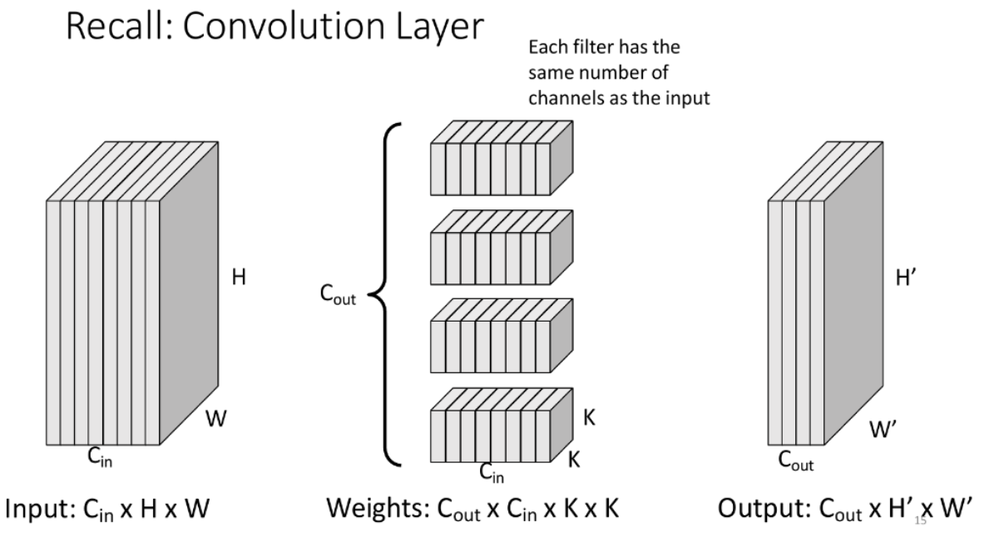
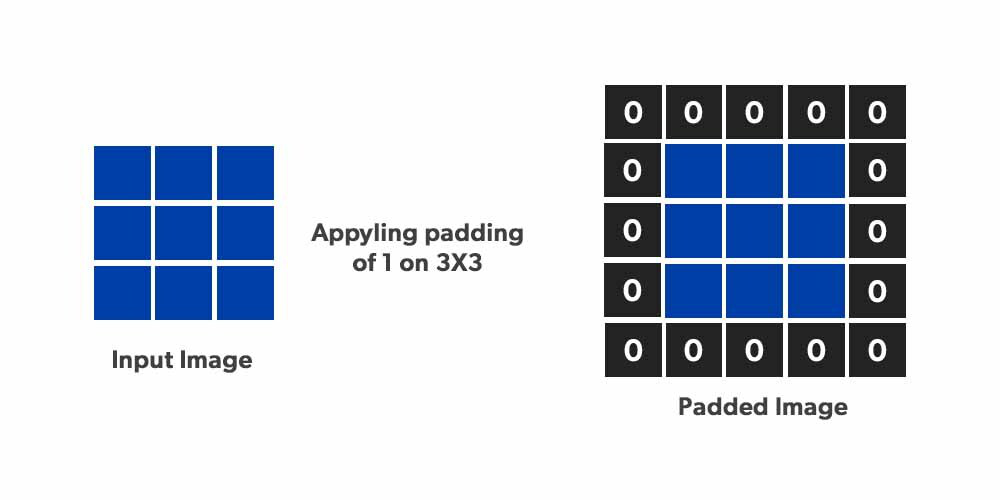

---
metaLinks:
  alternates:
    - /broken/spaces/W45nwClYZdzz9MQG1dUb/pages/TS5k9E05feWuJM6gRUZJ
---

# Project - AI Accelerator

The purpose of this project is to explore the trade-off between

1. hardware design (HDL)
2. hardware/software co-design

For a more elegant demo, it is recommended to use a single hardware platform, and a host program written such that the selection between pure software, HDL hardware, or HLS hardware to do the prediction can be done easily. However, regarding the complexity of the hardware of our coprocessor, we are going to use **two** hardware platforms, so that we can switch and demo:

1. Software + HDL hardware
2. Software + HLS hardware


We are using the OpenCL convention here so that the **host** is our PS and **device** is the PL (our coprocessor).


The recommend flow of doing this project is:

1. Draw the layer diagram of our chosen neural network. Be clear about what the inputs, features, outputs are.
2. Train the weights using PCs/GPUs.
3. Create the C/Python host program to interact with the hardware (Pure software first).
4. Write the HLS to replace the pure software.
5. Write the HDL to replace the HLS.

The whole project can be divided into three parts:

1. AI
2. HLS
3. HDL

## AI

This part includes training the model to do the image classification and then exports the weights from the trained model into the file that can be read by the HLS tools.


It is highly recommended to go through the [Broken link](/broken/pages/APbqsDQrqDDhSUfaKLjG "mention") section before looking at this part!


### Neural Network Architecture

The neural network architecture is shown below.

<figure><figcaption></figcaption></figure>

The main layers can be classified into five categories

1. Convolution Layer
2. Activation Layer
3. Maxpooling Layer
4. Global Average Pooling Layer
5. Fully Connected Layer

The whole idea of the CNN is that we filter out the features using the convolution layer, strengthened it using the activation layer, compressed it using the max pooling layer and fed into another bunch of convolution, activation and max pooling layer to get more features. Lastly, it is fed into the average pooling layer to get the final 64 features (instead of a huge 3-dimension cuboid) and these 64 features are passed through the fully connected layer to get 10 outputs indicating which category the input image belongs.

Qunatisation

You might have noticed that between each layer, the data being passed needs to be stored in the memory and the bit width for each element might not be the same. For example, after the convolution layer, the multiply will double the bit width.

What **quantisation** means here is that, we choose **one format** (for example Q6.10) to represent all the data that is transferred between the layers. When the data is coming out from the convolution layer, we use a **more bits** to store the intermediate result first and then truncate it back to the smaller data bit format.


Indeed, we might lost precision here, but this precision is not a big deal when our data is transmitting forward in this neural network. This is also why we care more about the throughput instead of the precision in AI.


However, in the **training process**, we might need to use the full data to do the back propagation.

#### Convolution Layer

The convolution layer uses th kernel/filter to search for one specific **feature** or **pattern**. Basically, what it does is

> Takes in an input cuboid, do the [**convolution**](../neural-network/convolution-neural-network.md#convolution-1) and then output the output feature maps organized in another cuboid.

Its architecture can be shown as below.

<figure><figcaption></figcaption></figure>

The variable $$C_{\text{out}}$$ represents the number of output channels as well as the number of **features** we want to stack.

Padding

When we do the [convolution](../neural-network/convolution-neural-network.md#image-processing) on the input cuboid, we might need to do the **padding** shown as below. Otherwise, the $$H'$$ and $$W'$$ that we get might be different.

<figure><figcaption></figcaption></figure>

In our application, we always pad our input cuboid is the padding of 1 and use stride = 1. Thus, the output cuboid's $$H'$$ and $$W'$$ won't change.

#### Activation Layer

The activation layer will just apply the **activate function** on each element of the input cuboid so that the features in the output cuboid, which is nothing but another feature maps, is **strengthened**.

### Training

The process of training is done in Python but the output of this step is just a `best_model.pth` file.

### Exporting

The exporting process will take in the `best_model.pth` and then output two constant header files in C++ which will then used by the HLS. In this part, we export two things



#### Weights

Weights are stored in the `weights.h` file. This file is just a massive list of hardcoded, fixed-point numbers. It contains all the weights and biases for our Convolutional (Conv) and Fully Connected (FC) layers after they have been mathematically combined with the Batch Normalization layers.



#### Look Up Table for the Sigmoid Function

The look up table values are stored in the `lut_sigmoid.h`. This file contains exactly one array: `static const lut_t LUT_SIGMOID[256]`. Instead of forcing our hardware to calculate complex exponential math for the sigmoid [activation function](../neural-network/multilayer-perceptron.md#activation-function), this file acts as a pre-calculated cheat sheet. The hardware just looks up the answer.



## HLS

Both the HLS and the HDL will do the forward propagation part of the neural network.

## HDL

### Matrix Multiplication

In Lab 01, our `matrix_multiply` is not that easy to be understood. In the project time, I redesign the `matrix_multiply` unit to have a clear microarchitecture shown as follow

<figure><figcaption>
4-stage redesigned matrix multiplier
</figcaption></figure>

Using the idea behind microprocessor design, in our application, we can treat each data read(s) as an “instruction.” Each read operation carries signals that determine whether the result should be written back to memory, analogous to the `MemWrite` signal generated by a decoder.

In this `matrix_multiply` unit, each pair of reads from A and B is considered an “instruction,” and the corresponding `MemWrite` and other control signals are generated by a FSM. In this sense, the counter functions similarly to a program counter in a microprocessor. However, instead of relying on a decoder to produce control signals, we use an FSM to generate a simplified version of the control logic for each instruction.

By utilising this approach, the total number of cycles taken will be the number of instructions plus the pipeline overhead (3 cycles).
