---
metaLinks:
  alternates:
    - /broken/spaces/W45nwClYZdzz9MQG1dUb/pages/TS5k9E05feWuJM6gRUZJ
---

# Project

The purpose of this project is to explore the trade-off between

1. hardware design (HDL)
2. hardware/software co-design

For a more elegant demo, it is recommended to use a single hardware platform, and a host program written such that the selection between pure software, HDL hardware, or HLS hardware to do the prediction can be done easily. However, regarding the complexity of the hardware of our coprocessor, we are going to use **two** hardware platforms, so that we can switch and demo:

1. Software + HDL hardware
2. Software + HLS hardware


We are using the OpenCL convention here so that the **host** is our PS and **device** is the PL (our coprocessor).


The recommend flow of doing this project is:

1. Draw the layer diagram of our chosen neural network. Be clear about what the inputs, features, outputs are.
2. Train the weights using PCs/GPUs.
3. Create the C/Python host program to interact with the hardware (Pure software first).
4. Write the HLS to replace the pure software.
5. Write the HDL to replace the HLS.

## Neural Network

A **neural network** consists of connected units or nodes called **artificial neurons**, which loosely model the neurons in the brain. These neurons are connected by _edges_, which model the synapses in the brain. The flow of a neural network can be summarized as follows:

1. Each artificial neuron receives **signals** from connected neurons, then processes them and sends a signal to other connected neurons. The "signal" is a real number.
2. The output of each neuron is computed by some **non-linear function** of the totality of its inputs, called the **activation function**.
3. The strength of the signal at each connection is determined by a **weight**, which adjusts during the learning process.

Typically, neurons are aggregated into **layers**. Different layers may perform different transformations on their inputs. Signals travel from the first layer (the _input layer_) to the last layer (the _output layer_), possibly passing through multiple intermediate layers (_hidden layers_). A network is typically called a **deep neural network** if it has at least two hidden layers.

<figure><figcaption></figcaption></figure>

We can think of the neural network as a **function**. For example, let's say we want to build a neural network to recognize the image given an $$28\times28$$ pixel image where each pixel is a value between 0 and 1 representing the gray scale of that pixel. Then our neural network will be a function as below.

$$
f(a_0, \ldots, a_{783}) =
\begin{bmatrix}
y_0 \\
\vdots \\
y_9
\end{bmatrix}
$$

where function inputs at the L.H.S are the $$28\times28=784$$ pixels and function output at the R.H.S is a **possibility matrix** denoting which number the figure likely to be (from 0 to 9). e.g., $$[0.98, 0, \dots, 0]^T$$ denotes that the output is likely to be a 0.

Having said that, the neural network can not only be used to recognize the number in an image. Depending its usage, the neural network can have different flavours:

1. **Multilayer Perceptron (MLP)**: This is the basic version.
2. **Convolutional Neural Network (CNN)**: This is good for image recognition.

### Multilayer Perceptron

> In this section, we will see the "Hello World" application — the digit recognition — in neural network. And we will also see how the **inference** is done in a neural network. This is also what the base project is aimed at.

The MLP is the **plain vanilla** form of the neural network with no added frills. But it is the basics to understand other neural networks! Sometimes, it is also called as the **fully-connected neural network**.


We will use the image recognition MLP as an example is the following section about MLP.

* **Input**: An image is a $$28\times28$$ pixel image where each pixel is a value between 0 and 1 representing the gray scale of that pixel.
* **Output**: The possibilities for the figure to be one of the number between 0 and 9. Thus, we have 10 possibilities to exist in our output.

Thus, the whole network can be thought of as a function which takes in 784 inputs and spits out 10 numbers at the output.


#### Neurons

As its name suggested, a neural network has a lot of neurons. For now, we can think of a neuron as a container to hold a number between 0 and 1.

<figure>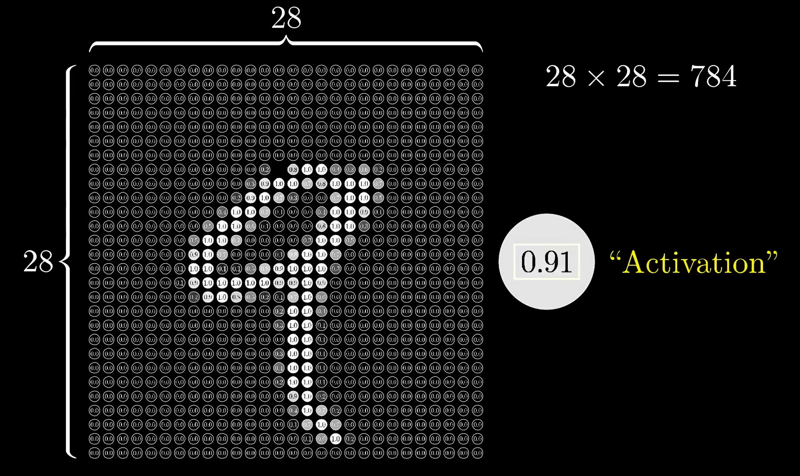<figcaption></figcaption></figure>

In our application, as our input image has 784 pixels, we treat each pixel as a neuron.


**Activation**

The value held in the neuron is called its **activation**. You may notice that when the neuron's value/activation is closer to 1, it will be activated/lit up and vice versa.


#### Layer

Each of the neuron/pixel from the input forms the **input layer** containing 784 neurons with some activation. This is called the **input layer**. Similarly, in our application, the **output layer** consists of 10 neurons, the activaion of [each neuron](#user-content-fn-1)[^1] represents how much possibility the system thinks the given image corresponds to that digit.

<figure>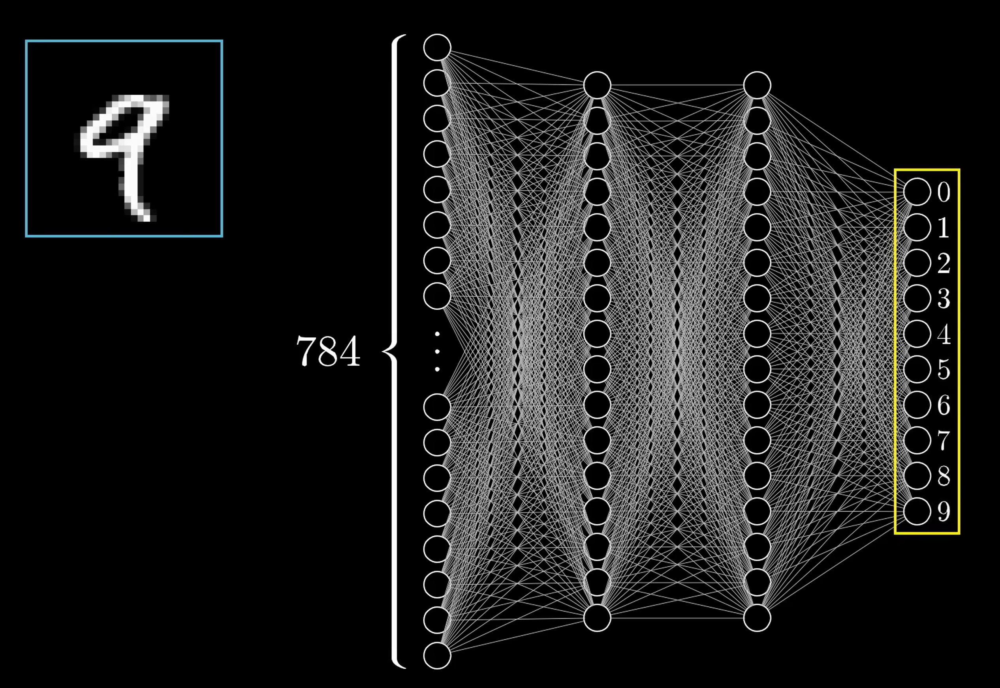<figcaption></figcaption></figure>

As you might notice in the figure above, there are also some layers in between. These are called the **hidden layers**. In our application, we will see later that they can represent certain **patterns**.


The number of neurons in the **hidden layer** is determined arbitrarily. In this case, we set both of the them to 16.


The **activations** in one layer determines the activation in the next layer.


The sentence above is perhaps the most important takeaway from this "Layers" section!


<figure>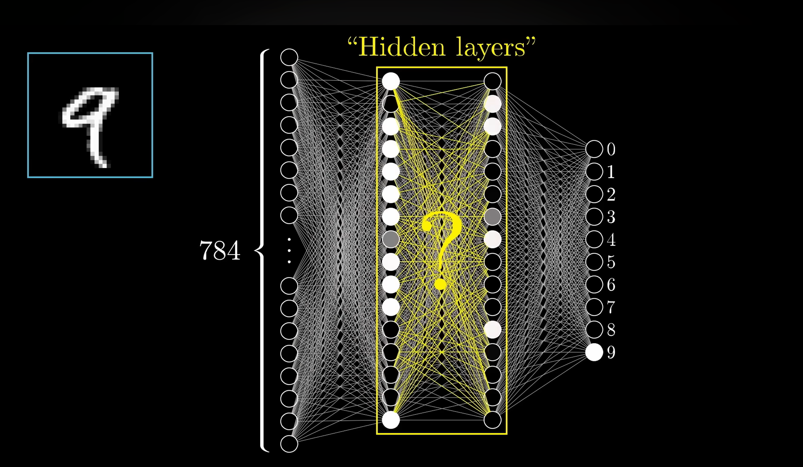<figcaption></figcaption></figure>

So, what exactly happens in this system is that

1. We feed an image in the required size, lighting up all 784 neurons of the input layer according to the brightness/grey scale of each pixel in the image.
2. This patterns of activations causes some very specific pattern in the next layer, which causes some patterns in the layer after it, which finally causes some pattern in the output layer.
3. And the brightest neuron of the output layer is the network's choice, so to speak, for what digit this image represents.

<figure>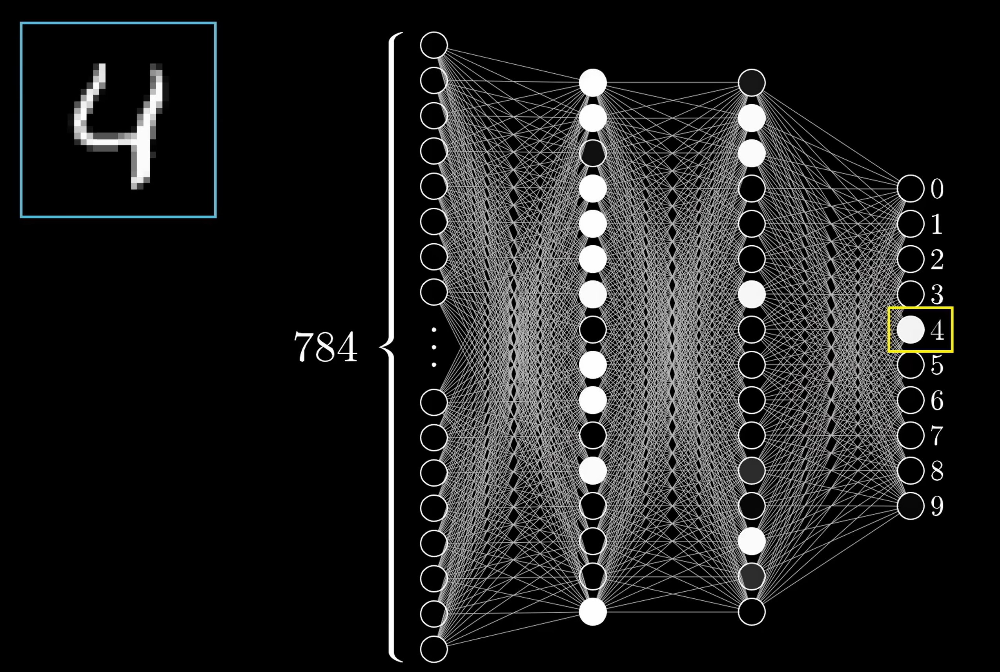<figcaption></figcaption></figure>


**Forward Propagation**

The process described above is officially named as **forward propagation**, which is the fundamental process in neural networks where input data passes through hidden layers to the output layer, generating predictions.


<details>

<summary>Why order neurons into layers</summary>

This is based on the instinction when we recognize the digit, which is that we try to break the digit into the so-called **patterns**.

<figure>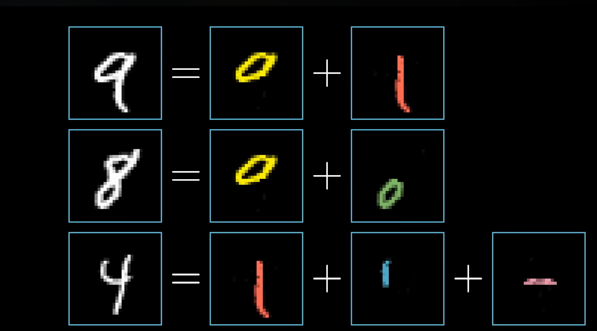<figcaption></figcaption></figure>

Similarly, in this neural network, we can think of each neuron in the 2 hidden layer as representing a specific pattern. More specifically

* In the first hidden layer: each neuron represents an **edge pattern**
* In the second hidden layer: each neuron represents a **bigger pattern**, like a loop, etc.

<figure>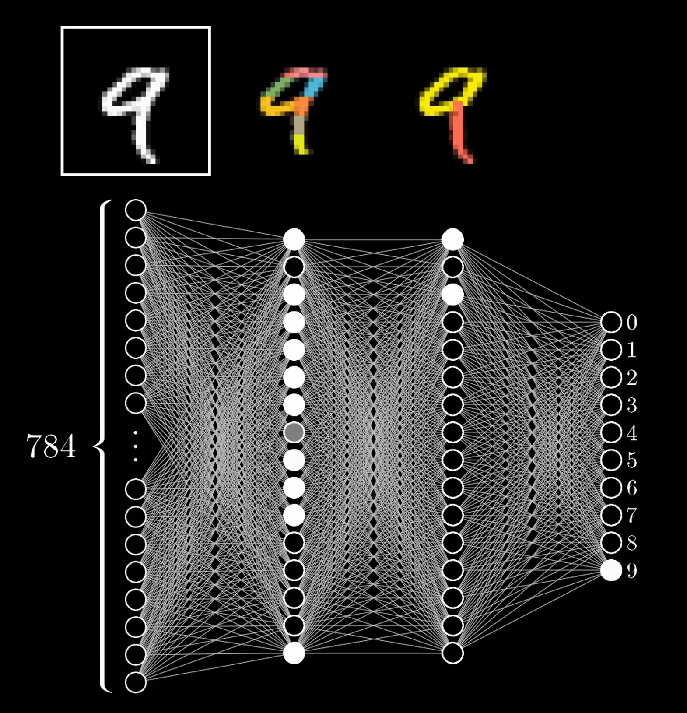<figcaption></figcaption></figure>

</details>

#### Weights

> In this part, we will talk about how the activations in one layer determines the activations in the next layer in more detail.

We start from one neuron in the first hidden layer. From the previous section, we know that this neuron should represent an edge pattern. So, how do we know that this neuron can capture a certain **edge pattern** given all the neurons from the previous layer as inputs? What we will do is to assign a **weight** to each one of the connections between our neuron and neurons from the first layer.

<figure>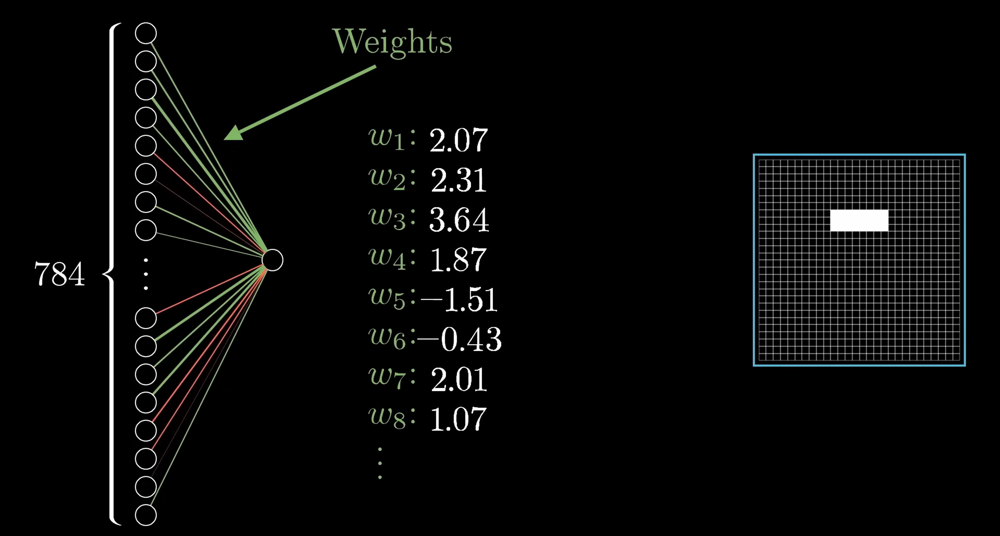<figcaption></figcaption></figure>

These weights are just **numbers**. Then we take all the activations from the input layer and compute their weighted sum according to these weights.

$$
w_1 a_1 + w_2 a_2 + w_3 a_3 + w_4 a_4 + \cdots + w_n a_n
$$

#### Activation Function

As the weights can be any real number, the weighted sum we get can thus be any real number. However, we want the **activation** of our neuron to be between 0 and 1.

<figure>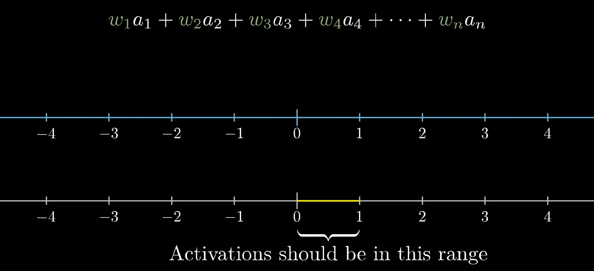<figcaption></figcaption></figure>

An intuition will be to pass this weighted sum as an input into another **function** that squishes the real number line into the range between 0 and 1. A function serving such purpose is called an **activation function**. One activation function is called the **sigmoid function** shown as below.

<figure>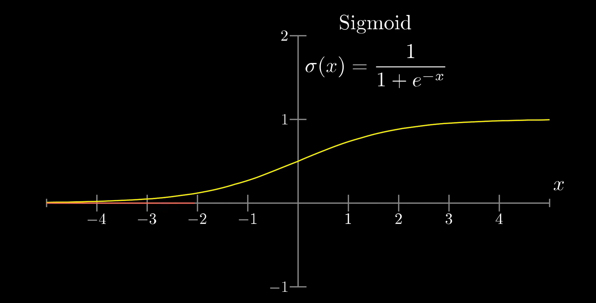<figcaption></figcaption></figure>

Basically, in the sigmoid function

* Very negative inputs ends up to close to 0
* Very positive inputs end up to close to 1
* The output just increases steadily when the inputs are around 0


A neuron is **active/lit up** in a network when its calculated activation/output value is close to 1 or non-zero, meaning that it effectively passes the signal to the next layer.


So, the **activation** of the neuron here is basically a measure of how **positive** the relavent weighted sum is.

$$
\sigma(w_1 a_1 + w_2 a_2 + w_3 a_3 + w_4 a_4 + \cdots + w_n a_n)
$$


**Bias**

But maybe we don't want the neuron to light up when the weighted sum is bigger than 0. Maybe we only want it to be active[^2] when the weighted sum is bigger than 10. That is to say, we want some **bias** for the neuron to be inactive. What will do then is to add some number to the weighted sum before we plug it through the sigmoid function. That additional number is called the **bias**.

<p align="center"><span class="math">\sigma(w_1 a_1 + w_2 a_2 + w_3 a_3 + w_4 a_4 + \cdots + w_n a_n-10)</span></p>

In this case, let's say our bias is 10.


In summary,

* The **weights** tell us what pixel pattern this neuron in the second layer (the first hidden layer) is picking up on.
* The **bias** tells us how high the weighted sum needs to be before the neuron starts getting meaningfully active.

And yeah! That's just one neuron in thie first hidden layer! Every other neuron in the first hidden layer will be connected to all 784 pixel neurons from the input layer. And each one of those 784 connections has its own **weights** and **bias** associated with it.


If you calculate that, you might find out that in our neural network, we have

* $$784\times16+16\times16+10\times16$$ weights
* $$16+16+10$$ biases


So, when we talk about **learning**, what's that referring to is getting the computer to find a valid setting for all of these many many numbers so that it actually solve the problem at hand.

#### Matrix Notation

Let's show a notation compact way on how these connections are represented.

1. Organize all the activations from one layer into a column as a vector $$[a_0^{(0)}, a_1^{(0)}, \dots, a_n^{(0)}]^T$$
2. Organize all the the weights as a matrix, where each row of that matrix corresponds to the connections between one layer and a particular neuron in the next layer. What that means is that taking the weighted sum of the activations in the first layer according to these weights corresponds to one of the terms in the matrix product of the L.H.S.
3. Organize all the biases into a vector and add the vector to the previous matrix vector product.

<figure>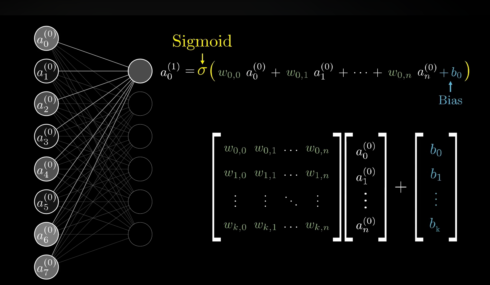<figcaption></figcaption></figure>

And then we wrap the sigmoid around the outside of the whole thing. This represents that we are applying the sigmoid function to each specific component of the resulting vector inside.


The sigmoid function can be replaced by any other activation function! The resulting vector is a vector of the number of neurons is the second layer elements


<figure><figcaption></figcaption></figure>

So, the neat formula we have to calculate the activations of the second layer using the activations from the first layer is

$$
a^{(1)}=\sigma(Wa^{(0)}+b)
$$


**Recap on the understanding of** [#neurons](project.md#neurons "mention")

Up till this point, we might find out that it is more accurate to think of each neuron as a **function** that takes in the **ouputs** of all the neurons in the previous layer and spits out the number between 0 and 1.


### CNN

A convolutional neural network (CNN) is a type of feedforward neural network that learns **features** via filter (or kernel) optimization. Here, we will use the image classification as an example. Assume that our input is an image, to recognize or classify that image, the flow/layers of CNN can be:

1. Convolution
2. Pooling
3. Activation

#### Convolution

In the convolution, the process is similar as what we have mentioned in [#image-processing](project.md#image-processing "mention"). The only difference is that to recognize an image accurately, we might use severl kernels, each kernel will be responsible for filtering our one feature from the input image, which is nothing but a matrix.

<figure>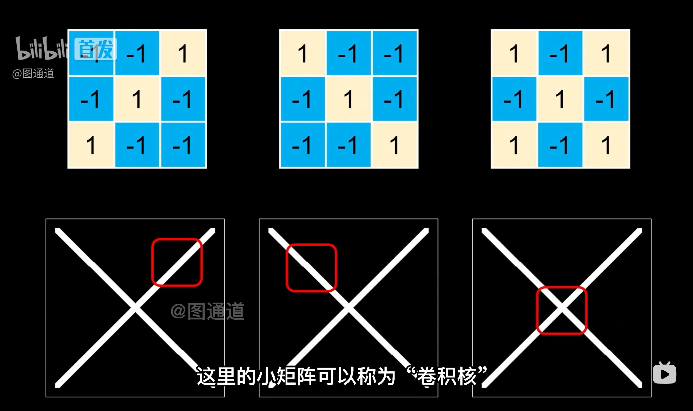<figcaption></figcaption></figure>

The result after convolution using each kernel is also a very big matrix or maybe we might filter out some **weak** features/patterns. Thus, we need to compress the matrix.


**CNN vs. Plain Vanilla Neural Network**

In the CNN, the kernel operations replace the weights operation in the plain vanilla neural network.


#### Pooling

The procedure of compressing the convoluted image is called **pooling**. Pooling can be as easy as getting the **mean** or **max** value of a **region**.

<figure>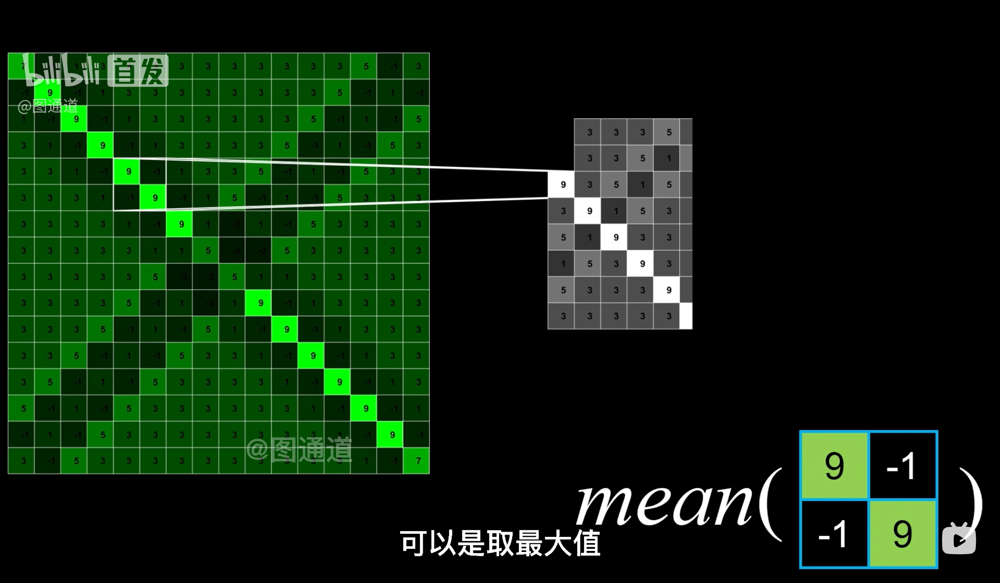<figcaption></figcaption></figure>

After the pooling, the size of the matrix/image will be lowered to a large extent.

<details>

<summary>Why is pooling valid?</summary>

In the input image, the neighboring pixels tend to have **similar** values. Thus, after convolution, the neighboring pixels in the convoluted image/matrix also tend to have **similar** values. This will cause the **information redundancy**. And pooling is used to lower this **information redundancy**.

</details>

#### Activation

After the pooling, the **non-linear mapping** is applied to each element of the image/matrix after the pooling layer. This **non-linear mapping** is called the **activation function**. The intuition for doing so is to **reinforce** the features after the pooling layer.

#### Training

We can expand the 2-dimension images into one-dimension and input them into a fully-connected neural network, or [Multi-Layer Perceptron](project.md#multilayer-perceptron) (MLP) to get the value for the **kernel matrix** used in the convolution.

<figure>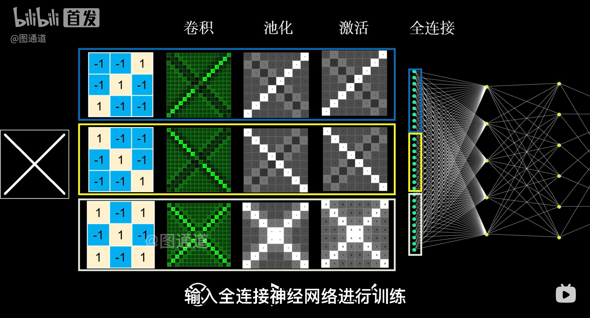<figcaption></figcaption></figure>

## Convolution

Convolution is inherently a maths topic, however, it can be used with the neural network to enpower us to do something interesting on image processing. In this section, we will talk about the basics of convolution and how this idea of convolution can be used in image processing.

### Convolution Basics

The motivation of convolution starts from a single problem

> How do we combine two lists to get a third list, which is also equivalent to how do we combine two functions to get a third function.

Intuitively, we can add/multiply each element in the two lists and use the result as the elements in the third list. For example,


```c
// Two list a and b, we want to get the third list c
a = [1, 2, 3]
b = [4, 5, 6]

// Addition
c = [5, 7, 9]

// Multiplication
c = [4, 10, 18]
```


Now, we want to introduce another way which is called **convolution** to combine these two lists/functions to get the third list/function. Intuitively, what convolution does is to **flip** the second list and uses it as a sliding window.

<figure>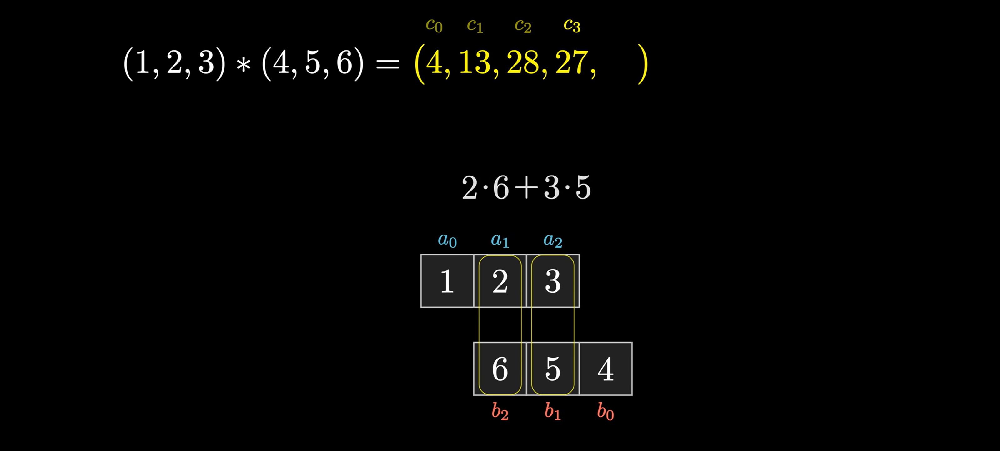<figcaption></figcaption></figure>

Now, we can give the simpler definition of a convolution. The convolution of a list $$a_i$$ and another list $$b_i$$, denoted with the symbol $$*$$, is a **new list** and its $$n$$-th element is a sum shown below.

$$
(a*b)_n=\sum_{i,j,~i+j=n}a_i\cdot b_j
$$

<details>

<summary>Convolution and average sum</summary>

If the sum of the values in our sliding window (List B) is equal to 1, we can treat the value after convolution as an **average sum** of the values in List A.

<figure>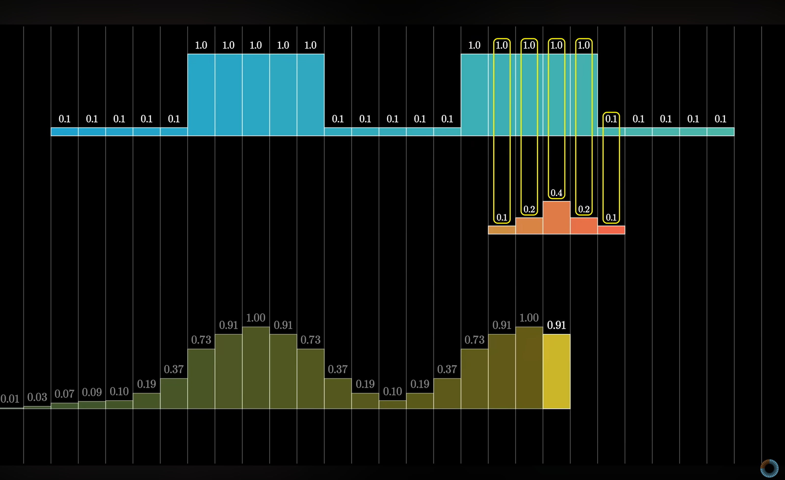<figcaption></figcaption></figure>

The figure above is not a strictly average some but assigned a higher weight to the data in the central.

</details>

### Image Processing

One worth noting example of using the idea of convolution is to do the image processing like:

1. Blur the image
2. Filter out the shape of the image

This is done by using a special sliding window called **kernel**. In this example, we assume that the kernel is a $$3\times3$$ matrix with each element to be $$\frac{1}{9}$$.

<figure>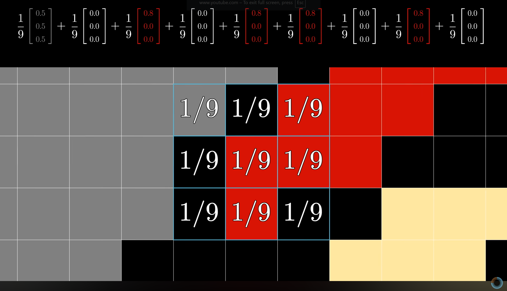<figcaption></figcaption></figure>


**Pixel's RGB notation**

In each pixel of a normal image, we have three values, namly a number between 0 to 1 denoteing the pecentage of Red, Green and Blue of that pixel. That's why each element in the kernel is multiplied with a $$3\times1$$ vector.


Technically, when do the computation, we should flip the kernal matrix by 180 degree because of the pure math definition of the convolution. This aligns with the intuition that we flip the List B before using it as a sliding window. So, for a $$3\times3$$ matrix,

$$
A = \begin{pmatrix}
a & b & c \\
d & e & f \\
g & h & i
\end{pmatrix}
$$

Its 180 degree rotated version is

$$
A_{180} = \begin{pmatrix}
i & h & g \\
f & e & d \\
c & b & a
\end{pmatrix}
$$

But in our example, we assume that we are using the rotated kernel.


It's the training/learning of CNN's job to get this kernel.


As we put the **centre element** of the kernel at the first pixel and start moving/sliding the kernel through all pixels of the image, the weighted sum will the be RGB value of the pixel at that centre position in the **convoluted image**.


It is definitely to change the size of the kernel matrix and the value inside it. By doing so will give us different image processing, like blurring or filtering out the shape of the figure, etc.


The purpose of the kernel can be understood as **finding the features/pattern** in the image. Usually we use one kernel for one pattern.

<details>

<summary>The size of the convolution</summary>

Smart readers might have found out that the size of the convolution (third list/image) might have a size bigger than the size of our input lists/images. Yes, this is valid! If our list A has a dimention of $$m$$ and our sliding window (list B) has a dimension of $$n$$, the size of the convolution will be $$n+m-1$$.

To deal with this problem, what we usually do is to trauncate the not used values. This can be shown as below.

<figure>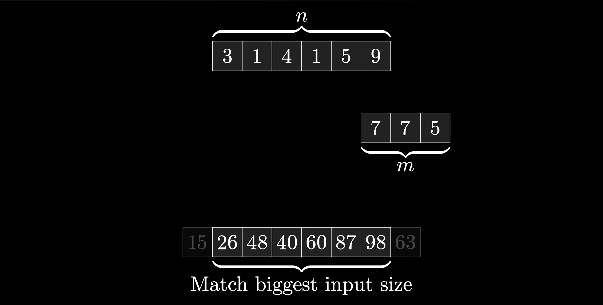<figcaption></figcaption></figure>

</details>

## References

At the point I am taking this course, I haven't taken any AI course at NUS. However, I found that the following resources are very useful when I get on board with the Neural Network.

1. [3Blue1Brown — What is a neural network](https://youtu.be/aircAruvnKk?si=TnZzNrhEZmoWnMvB).
2. [3Blue1Brown — What is a convolution](https://youtu.be/KuXjwB4LzSA?si=QBq3t7uadoE2KqXe).

[^1]: In the output layer, each neuron has a one-to-one mapping relationship with the digit from 0 to 9.

[^2]: Here, the neuron being active is the same thing as the neuron being lit up.
