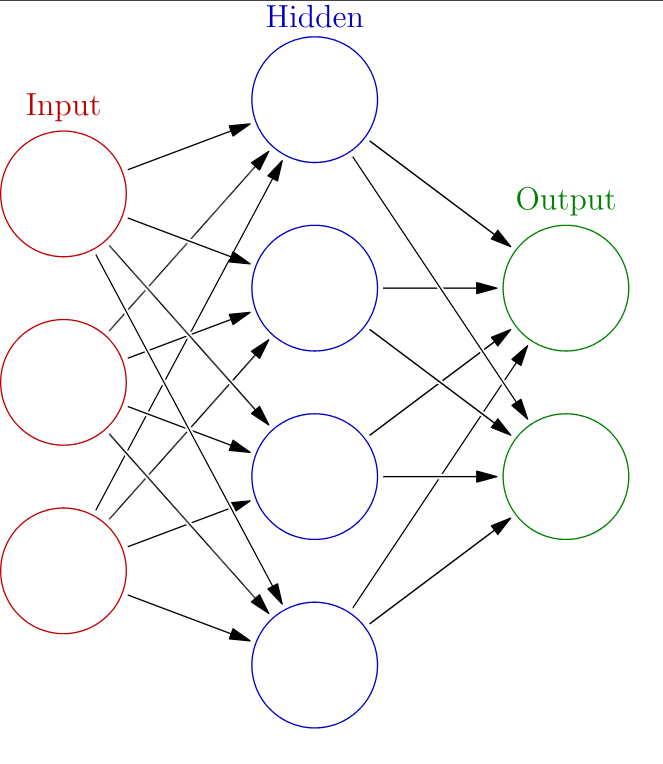

# Project

The purpose of this project is to explore the trade-off between

1. hardware design (HDL)
2. hardware/software co-design

For a more elegant demo, it is recommended to use a single hardware platform, and a host program written such that the selection between pure software, HDL hardware, or HLS hardware to do the prediction can be done easily. However, regarding the complexity of the hardware of our coprocessor, we are going to use **two** hardware platforms, so that we can switch and demo:

1. Software + HDL hardware
2. Software + HLS hardware


We are using the OpenCL convention here so that the **host** is our PS and **device** is the PL (our coprocessor).


The recommend flow of doing this project is:

1. Draw the layer diagram of our chosen neural network. Be clear about what the inputs, features, outputs are.
2. Train the weights using PCs/GPUs.
3. Create the C/Python host program to interact with the hardware (Pure software first).
4. Write the HLS to replace the pure software.
5. Write the HDL to replace the HLS.

## Neural Network

A **neural network** consists of connected units or nodes called **artificial neurons**, which loosely model the neurons in the brain. These neurons are connected by _edges_, which model the synapses in the brain. The flow of a neural network can be summarized as follows:

1. Each artificial neuron receives **signals** from connected neurons, then processes them and sends a signal to other connected neurons. The "signal" is a real number.
2. The output of each neuron is computed by some **non-linear function** of the totality of its inputs, called the **activation function**.
3. The strength of the signal at each connection is determined by a **weight**, which adjusts during the learning process.

Typically, neurons are aggregated into **layers**. Different layers may perform different transformations on their inputs. Signals travel from the first layer (the _input layer_) to the last layer (the _output layer_), possibly passing through multiple intermediate layers (_hidden layers_). A network is typically called a **deep neural network** if it has at least two hidden layers.

<figure><figcaption></figcaption></figure>

### Multilayer Perceptron

The MLP is a kind of modern feedforward neural network consisting of three or more layers (an input and an output layer with one or more _hidden layers_) of nonlinearly-activating nodes.
