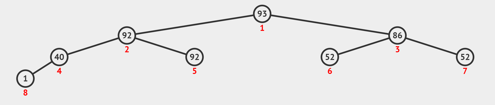
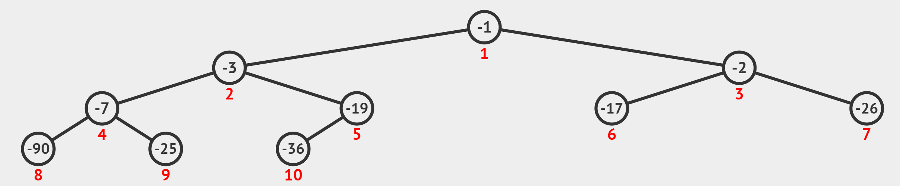
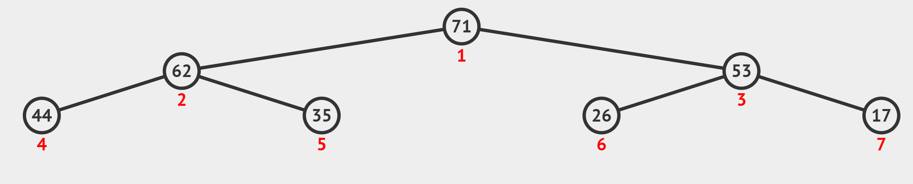

# Lec 05 - Priority Queue

## Definition

In a priority queue, each element has a "priority" and an element with higher priority is served before an element with lower priority.


In the later implementation using binary max heap, we may notice that this "priority" is related to the magnitude of the number, but not exactly everywhere, but **on the same level**.


A Binary (Max) Heap is a [complete binary tree](https://en.wikipedia.org/wiki/Binary_tree#Types_of_binary_trees) that maintains the [Max Heap property](https://en.wikipedia.org/wiki/Binary_heap).

* **Complete Binary Tree**: Every level in the binary tree, except possibly the last/lowest level, is completely filled, and all vertices in the last level are as far left as possible
* **Binary Heap property**: It has two versions, max and min.
  * **Binary Max Heap Property**: The value of a vertex — except the leaf/leaves — must be greater than (or equal to) $$\geq$$ the value of its one (or two) child(ren).
  * **Binary Min Heap Property**: Just the opposite of the above. The value of a vertex — except the leaf/leaves — must be less than (or equal to) $$\leq$$ the value of its one (or two) child(ren).

Below is an example of a binary max heap from **visualgo**. And remember this general shape of a complete binary tree as it will be useful when we analyze the basic operation inside ths binary max heap.

<figure><figcaption></figcaption></figure>


#### Additional Information

1. **Height**: the height of a tree is the **number** of edges from the top-most node to the farthest node in a subtree. For example, in the figure above, the height of this complete binary tree is 3.


Conversion between Binary Max Heap and Binary Min Heap

As we will see later, in Java, the implementation of priority queue uses the **binary min heap**. So, to do the conversion, if we only deal with numbers (including this visualization that is restricted to integers only), it is easy. Why?

We can re-create a Binary Heap with the negation of every integer in the original Binary Heap. If we start with a Binary Max Heap, the resulting Binary Heap is a Binary Min Heap (if we ignore the negative symbols — see the picture above), and vice versa.

<figure><figcaption></figcaption></figure>

## Basic Manipulation

A complete binary tree can be stored efficiently as a compact array A as there is no gap between vertices of a complete binary tree/elements of a compact array. (Go back to [visualgo](https://visualgo.net/en/heap?slide=2-2) to visualize this process).

This way, we can implement basic binary tree traversal operations with simple index manipulations (with help of [bit shift manipulation](https://visualgo.net/en/bitmask)):

1. `parent(i) = i>>1`, index `i` divided by 2 (integer division),
2. `left(i) = i<<1`, index `i` multiplied by 2,
3. `right(i) = (i<<1)+1`, index `i` multiplied by 2 and added by 1.

### Insert

Insertion of a new item `v` into a Binary Max Heap can only be done at the _last index N plus 1_ to maintain the compact array. Why?

> This is to maintain the **complete binary tree** property.

However, the **Max Heap property** _may_ still be violated. This operation then fixes Max Heap property from the insertion point upwards (if necessary) and stop when there is no more Max Heap property violation. (See the visualization on [visualgo](https://visualgo.net/en/heap?slide=4) to understand it better)

### ExtractMax

The method returns and deletes the **root** vertex, then replace the root with the _last index_ **N**. This is also to maintain the **complete binary tree** property.

But after the replacement, it will very likely violates the **Max Heap property**. This operation then fixes Binary Max Heap property from the root downwards by comparing the current value with the its child/the larger of its two children (if necessary). (Again, see the visualization on [visualgo](https://visualgo.net/en/heap?slide=5) to understand it better)

### Create

To create a binary max heap, one trivial way is to call the [#insert](lec-05-priority-queue.md#insert "mention") N times. Thus, its time complexity will be $$O(n\log n)$$. However, to make it faster, there is the second way to create a binary max heap,

1. insert each vertex sequentially, don't care about the max heap property
2. ignore all the bottom leaves, and start fixing the max heap property (by calling `shiftDown()`) from the second-last level of vertices, one-by-one and do this all the way until the root vertex.

#### Analysis of $$O(n)$$ Create

1. The height of a full binary tree of size $$N$$ is $$\log_2N$$.
2. The cost to run `shiftDown(i)` operation is not the gross upper bound $$O(\log N)$$, but $$O(h)$$ where $$h$$ is the height of the subtree rooted at $$i$$. And thus, we can write $$O(h)=c\times h$$, where $$c$$ is a constant.
3. There are $$\lceil\frac{N}{2^{h+1}}\rceil$$ vertices at height $$h$$ in a [full binary tree](https://en.wikipedia.org/wiki/Binary_tree#Types_of_binary_trees).

On the example full binary tree above with $$N=7$$ and $$h=2$$,

<figure><figcaption></figcaption></figure>

There are, $$\lceil\frac{7}{2^{(0+1)}}\rceil=4$$ vertices at height $$h=0$$ (the bottom level).

***

After knowing the above three points and using the idea to start from $$h=1$$ all the way to the root, we can derive the formula to calculate the analysis as follows,

$$
\begin{align*}
\sum_{h=0}^{\lfloor \lg n \rfloor} \frac{n}{2^{h+1}} \cdot O(h)  &= \sum_{h=0}^{\lfloor \lg n \rfloor} \frac{n}{2^{h+1}} \cdot (c\cdot h) \\
&= O \left( n \sum_{h=0}^{\lfloor \lg n \rfloor} \frac{h}{2^h} \right) \\
&= O \left( n \sum_{h=0}^{\infty} \frac{h}{2^h} \right) \\
&= O(2n) \\
&= O(n) \\
\end{align*}
$$


#### Equation Explanation

1. From formula 2 to 3, it suffices to calculate $$h\to\infty$$.
2. From formula 3 to 4, it uses the formula that $$\sum_0^\infty kx^k\to2$$, and here we just let $$x=\frac{1}{2}$$.


#### Take away from two creates

So, the take away from these two different creates is that,

> If our **starting point** is different, we may get different results.

In this case, if we start fixing the binary max heap property from the root and down until the height = 1 level of vertices, we get $$O(n\log n)$$ complexity. But if we start fixing the binary max heap property from the height = 1 level of vertices and up until the root, we get $$O(n)$$ complexity. Thus, **try changing start point** when solving some problems☺️.

### Update

To update the priority of an existing value that is already inserted into a Binary (Max) Heap, if the index `i` of the value is known, we can do the following simple strategy:

1. Simply update `A[i] = newv` and then
2. call both `shiftUp(i)` **and** `shiftDown(i)`.


Only at most one of this Max Heap property restoration operation will be successful, i.e., `shiftUp(i)`/`shiftDown(i)` will be triggered if `newv` > or < old value of `A[parent(i)]`/`A[larger of the two children of i]`, respectively.


### Delete

To delete an existing value that is already inserted into a Binary Max Heap and we already know the index of the value to be deleted, we can just

1. update `A[i]=A[1]+1` (a larger number greater than the current root),
2. call `shiftUp(i)` (technically, `UpdateKey(i, A[1]+1))`)
3. then call `ExtractMax()` once to remove it.

But what if we don't know the index of the value to be updated / deleted?

Wait for the Hash Table next week!

### HeapSort

HeapSort is just simply calling the [#extractmax](lec-05-priority-queue.md#extractmax "mention") operation **N** times. Thus, its time complexity is obviously $$O(n\log n)$$. (See the visualization on [visualgo](https://visualgo.net/en/heap?slide=8)!)

One advantage of Heapsort is that we can use it to achieve **partial sort**! (Its real world application includes the searching result you get from Google). And below is an application from LeetCode 😂



For the explanation, please see from [here](../practical/leetcode/week-5.md#solution)!
