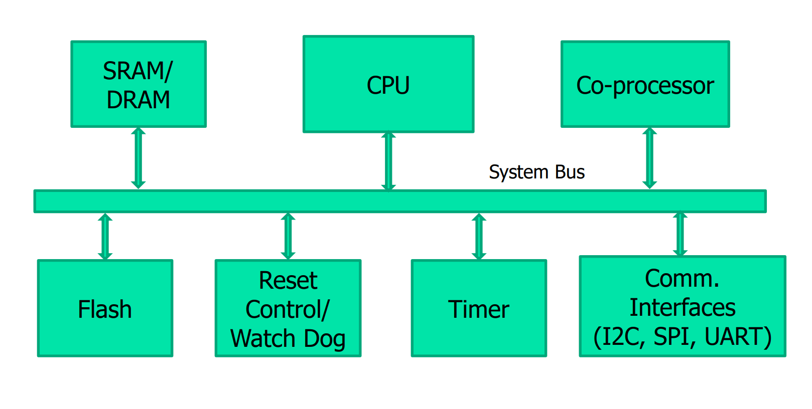
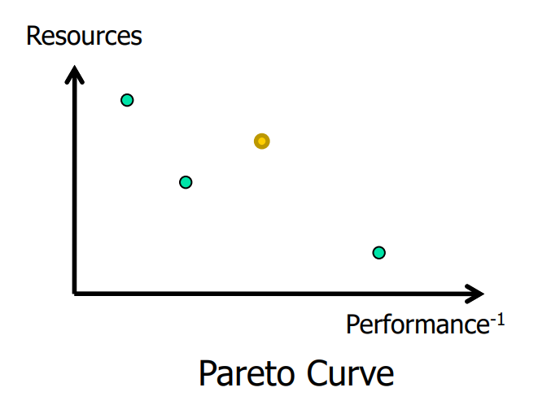
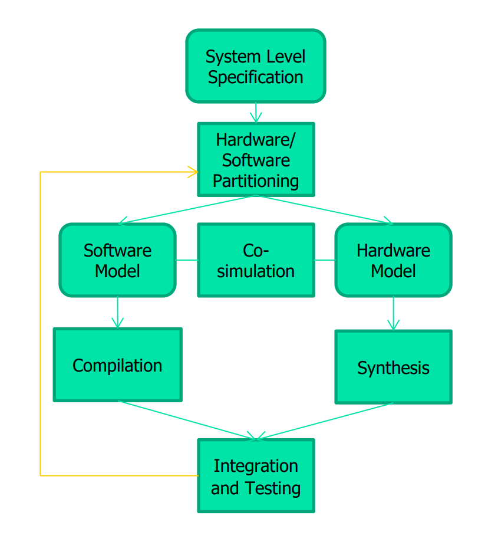
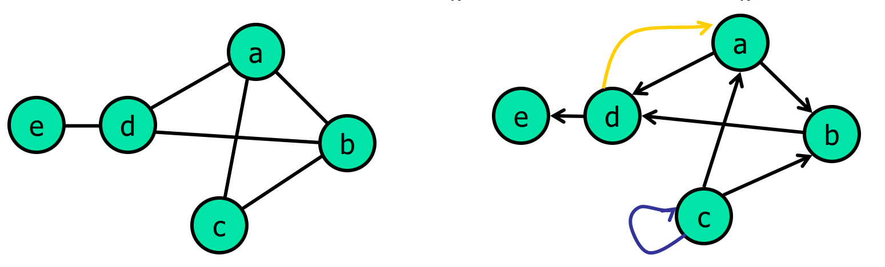
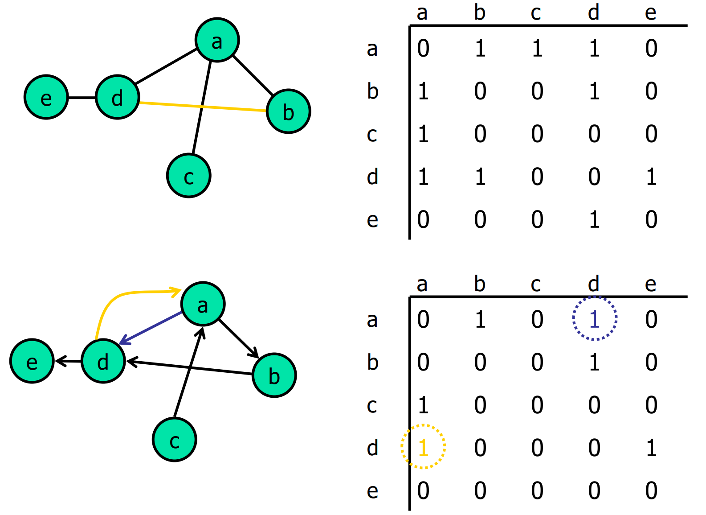
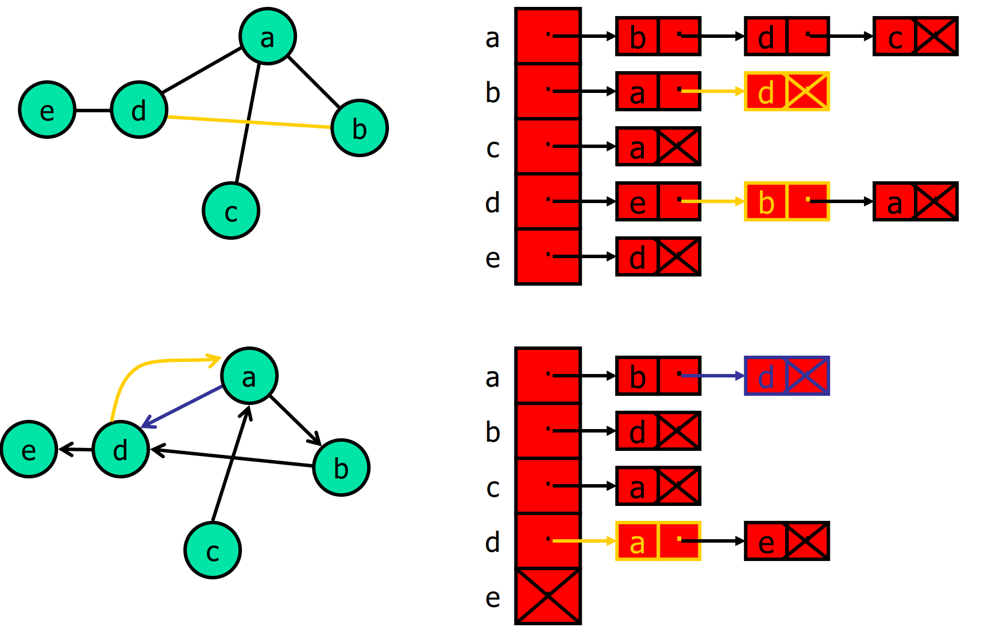
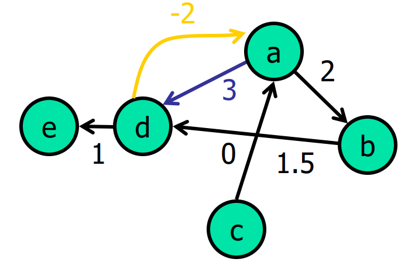
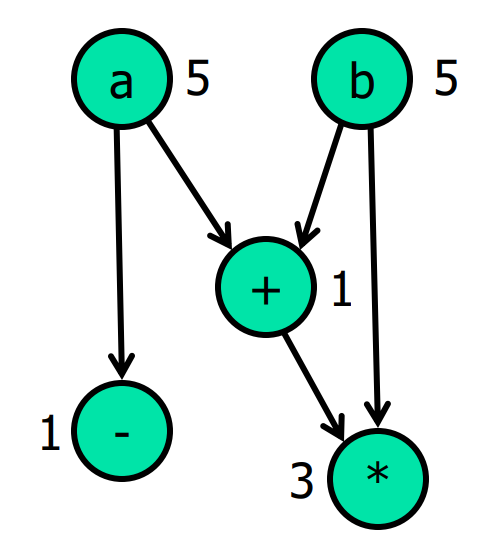
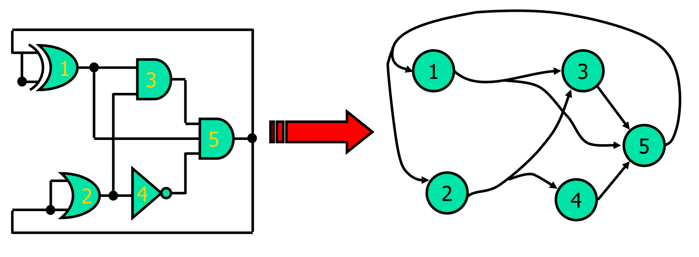

# Lec 01 - Introduction to Hardware and Embedded Systems

## Embedded Systems Overview

Unlike general-purpose computers (desktops/laptops), an **Embedded System** is a computer system embedded within a larger device, typically dedicated to a specific task.


A better definition for **Embedded System** and also the one that is favored by Prof Rajesh is: "Any system where the user doesn't want to know that it includes a processor".


* **Ubiquity**: There are approximately 50+ devices per household (e.g., washing machines, routers), vastly outnumbering general-purpose computers.
* **Examples**: Rocket engine controls, telecom switches, ABS in cars, set-top boxes, and smart devices .

### Characteristics

Embedded systems have the following characteristics:

* **Dedicated Task**: Usually performs a single function or a specific set of functions.
* **Real-Time Response**: Must monitor the environment and react within a specified time frame (hard or soft real-time constraints).
  * **Predictability** is fundamental to real-time systems, meaning they must consistently meet strict timing requirements and deadlines, even under heavy loads, to ensure deterministic behavior and reliable outcomes.
  * Being predictable <i class="fa-not-equal">:not-equal:</i> Being fast.
* **Continuous Operation**: Often requires 24x7 operation with high reliability.
* **Constraints**: heavily constrained by power (battery life), cost, size (form factor), and legacy support.
* **HW/SW Integration**: Tight integration between Software and Hardware.
  * Software is flexible and sequential, but the **performance suffers**.
  * Hardware is rigid[^1] and concurrent, but the flexibility suffers.
    * Typically, more **specialized hardware** indicates more **efficiency**.
    * If someone says his system is both flexible and efficient, likely he is a liar :joy:.

### Architecture

An embedded system usually consists of a CPU, memory (SRAM/DRAM/Flash), timers, and communication interfaces (I2C, SPI, UART) connected via a system bus as shown below.

<figure><figcaption></figcaption></figure>

* **Co-processor**: These are the processors that are used for some **specialized stuff**.
* **Reset Control / Watchdog Timer:** The system must be able to automatically reset itself if it fails to respond or becomes unresponsive for a specified period.

## Design Considerations & Trends

### System Design Considerations

When designing an embedded system (sensor -> processor -> actuator[^2]), we must balance conflicting requirements:

* **Time-to-market**: How fast can we ship?
* **Technology & Cost**: Availability of IP cores, CAD tools, and chip area.
* **Performance vs. Power**: High performance usually dictates higher power, but embedded devices are often battery-operated.

### Current Trends


**Note:** The history of hardware (Moore's Law, Power trends, and the move towards heterogeneous systems) is covered in detail in the [CG3207 Lec 01](https://app.gitbook.com/s/jTJFBPtKk6NwweAooH53/lec/lec-01-history-technology-performance#history). (From [History](https://app.gitbook.com/s/jTJFBPtKk6NwweAooH53/lec/lec-01-history-technology-performance#history) to [FYI](https://app.gitbook.com/s/jTJFBPtKk6NwweAooH53/lec/lec-01-history-technology-performance#todos))&#x20;


## Hardware Design Flow


**Note:** The abstraction levels (Gate, Circuit, Layout) and the general concept of RTL are discussed in [CG3207 Lec 02 Notes on Digital System Design](https://app.gitbook.com/s/jTJFBPtKk6NwweAooH53/lec/lec-02-digital-system-design-and-verilog#digital-system-design). However, EE4218 adds the Hardware/Software codesign part.


### HW/SW Co-design

> HW/SW Co-design is about designing the hardware specifically for a type of software to make it efficient.

The goal is to find the optimal point (a.k.a, [Pareto Point](../textbook-micheli/introduction/computer-aided-synthesis-and-optimization.md#pareto-point)) on the Pareto Curve (trading off Resources vs. Performance)

<figure><figcaption></figcaption></figure>

In this Pareto Curve, the y-axis is "resouces", higher means using more resources while the x-axis is "performance-1", and closer to the origin point means tha the performance is higher. Thus, it is obvious that the <mark style="color:$warning;">orange</mark> point is the **worst design** among the four designs as it uses more resources then the middle <mark style="color:$success;">green</mark> point but brings even less performance than it.

* **Partitioning**: Deciding which parts of the system is better to be implemented software and which part is better to be implemented on hardware (ASIC/FPGA).
  * The if/else structure like "if some button is pressed, then do something" is better to be implemented in **software**.
  * Some certain computation-needed operations, like "Multiply and Accumulate", are better to be implemented in **hardware** for better efficiency.
* **Co-simulation**: Verifying both HW and SW together. (Tools that are doing this are quite advanced nowadays)

<figure><figcaption></figcaption></figure>


The spirit of EE4218 is to **create custom hardware** for some **specific software**!


## FPGA


**Note**: The working principles of FPGA is covered in [Harris & Harris DDCA](https://app.gitbook.com/s/jTJFBPtKk6NwweAooH53/textbook/digital-building-blocks/logic-arrays#field-programmable-gate-array)!


## Algorithms and Graphs

An **algorithm** defines a procedure for solving a computational problem. For example, the quick sort, bubble sort, insertion sort, etc.

### Combinatorial Optimization

In **classical optimization**, we aim to find the minimum (or maximum) of a function $$f(x)$$ where $$x$$ is **continuous**. Since $$f(x)$$ is differentiable, we can use **gradients** and **second-derivative tests**. The key idea is to make **small local changes** and see whether the objective improves.

In many **real-world problems**, however, variables are **discrete**, so derivatives do not exist and classical optimization methods no longer apply. This leads to **combinatorial optimization**, where the solution space is finite or countable.

A canonical example is the **0-1 Knapsack Problem**: we want to maximize the value

$$
\max_{x_1, \dots, x_n} \sum_{i=1}^{n} v_i x_i
$$

subject to the size constraint

$$
\sum_{i=1}^{n} w_i x_i \leq W, \quad x_i \in \{0, 1\}
$$

Here, each decision is binary, making the problem inherently discrete. The knapsack problem is **NP-hard** (decision version NP-complete), meaning that **no polynomial-time exact algorithm is known**. As a result, solutions often rely on **dynamic programming, approximations, or heuristics** rather than calculus-based methods.

### Complexity

**Complexity** is defined as the run time on deterministic, sequential machine. We measure algorithms using [**Big-O notation**](https://app.gitbook.com/o/MnEKr5A4lYXtOfhoXGj5/s/KipySCGxC8NC1UpA24DS/) ($$O(f(n))$$), which ignores constants and describes the trend as input size $$n$$ grows.

* **P (Polynomial)**: Solvable in polynomial time (Tractable).
* **NP (Non-deterministic Polynomial)**: Exact solution requires exponential time. We usually settle for "heuristics" to find a "good enough" solution rather than the optimal one.


In this course (EE4218), we focus on the algorithms _inside_ the CAD tools. Most CAD problems (like placement and routing) are **NP-hard**.


### Graphs


CAD tools represent circuits as graphs. More on Data Flow Graph (DFG) is on [EE4415](https://app.gitbook.com/s/Sp0XaarBjbEX3JIMrRaR/lecture/lec-02/lec-02b-rtl-transformations#data-flow-graphs).


Graph $$G=(V, E)$$ is composed of two parts:

1. A set of vertices (nodes) denoted as $$V$$ and
2. edges (links) denoted as $$E$$.

Graphs can be directed or undirected

* **Directed**: $$e_k = (v_i, v_j)$$ (Ordered pair).
* **Undirected**: $$e_k = \{v_i, v_j\}$$ (Unordered pair).

<figure><figcaption></figcaption></figure>

#### Graph Representation

We can use the following two methods to represent a graph:



#### Adjacency Matrix

A 2D array where $$A[i][j] = 1$$ if an edge exists. Good for dense graphs, but uses $$O(|V|^2)$$ memory.

<figure><figcaption></figcaption></figure>



#### Adjacency List

An array of linked lists. More memory efficient for sparse graphs (like circuits).

<figure><figcaption></figcaption></figure>



#### Edge/Vertex Weights in Graphs

Both edge and vertex can have **weights**



#### Edge weight

This usually represents the **cost** of an edge. For example, distance between two cities and width of a data bus.

<figure><figcaption></figcaption></figure>

The corresponding changes needed in the graph representations are

* **Adjacency matrix**: Instead of 0/1, keep the weight.
* **Adjacency list**: Keep the weight in the linked list item.



#### Node weight

This is usually used to enforce some capacity constraint on the nodes. For example, the size of gates in a circuit and the delay of operations in a "data dependency graph".

<figure><figcaption></figcaption></figure>


Node weight can be put inside **adjacency list** easily, but cannot be put inside the **adjacency matrix**.




#### Hypergraphs

Similar to the definition of normal graphs, in **hypergraphs**, an edge can connect _more_ than two vertices. A,k.a, edges not between **pairs** of vertices, but between a **set** of vertices.

* Hypergraphs can be directed/undirected.
* A node can be the source (or be connected to) multiple hyperedges.

<figure><figcaption></figcaption></figure>

#### Common Algorithms in EDA

* **Depth-First Search (DFS)**: Visits nodes by going as deep as possible before backtracking. Used for connectivity checks.
* **Dijkstra**: Shortest path (used in Routing).
* **Graph Coloring**: Used for Register Allocation.
* **Min-Cut**: Used for Partitioning logic into different blocks.

[^1]: This means that hardware can do some things that the software cannot do.

[^2]: A component that converts an electrical control signal into physical motion or force.
