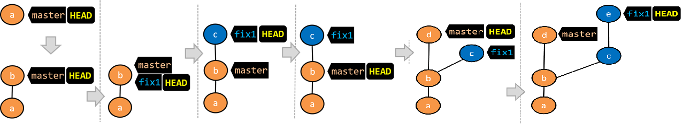
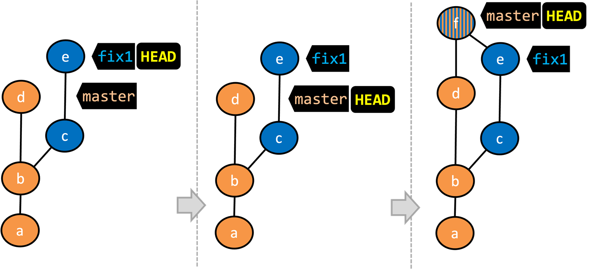
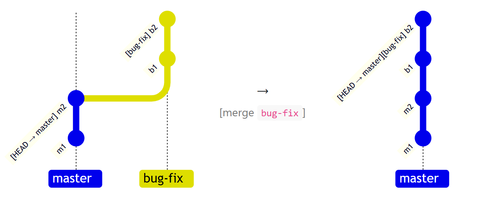

# Topics

## Important Points

### Java Casting

> Regarding the casting, [CS2030S](https://wenbo-notes.gitbook.io/cs2030s-notes/lec-rec-lab-exes/lecture/lec-04-exception-and-wrapper-classes/diagnostic-quiz#id-02.-type-casting-and-compile-time-error) has introduced two very useful rules on deciding the Run Time Error and Compile Time Error. The [tricky problem in CS2113](https://wenbo-notes.gitbook.io/cs2113-notes/lec/lec-04#a-tricky-problem) also gives you a glimpse of how to apply the rules.

From the topics, there are some important rules



#### **RunTime Behavior**

Due to polymorphism, the behavior of the object will reflect the actual type of the object irrespective of the type of the variable holding a reference to it. For example,


```java
// Some codeAnimal a = new DomesticCat(); //implicit upcast
a.speak();
Cat c = (Cat)a; //downcast
c.speak();
DomesticCat dc = (DomesticCat)a; //downcast
dc.speak();

// Output
// I'm a DomesticCat
// I'm a DomesticCat
// I'm a DomesticCat
```



#### Code Explanation

The call to the `speak()` method in the code below always executes the `speak()` method of the `DomesticCat` class because the actual type of the object remains `DomesticCat` although the reference to it is being downcast/upcast to various other types.




#### Casting error only in run-time

> As we have seen in [CS2030S](https://wenbo-notes.gitbook.io/cs2030s-notes/lec-rec-lab-exes/lecture/lec-04-exception-and-wrapper-classes#exceptions-are-always-triggered-at-run-time), exceptions are always triggered at run-time!

Casting to an incompatible type can result in a `ClassCastException` at **runtime**.



#### The use of `instanceof`

We can use the `instanceof` operator to check if a **cast** is safe to perform. For example,


```java
Cat c;
if (a instanceof Cat){
    c = (Cat)a;
}
```



#### Code Explanation

This code checks if the object `a` is an instance of the `Cat` class before casting it to a `Cat`.




### Java Abstract Classes

> In CS2030S, I have provided a quite solid [motivation for Java Abstract Class](https://wenbo-notes.gitbook.io/cs2030s-notes/lec-rec-lab-exes/lecture/lec-03-polymorphism#abstract-class), feel free to go back and take a look.

Here, there are some importants points regarding Java Abstract Class,



#### A class that has an **abstract method** becomes an **abstract class**.

This is because the class definition is incomplete (due to the missing method body) and it is not possible to create objects using an incomplete class definition.



#### An abstract class can have 0 abstract method

In Java, even a class that **does not** have any abstract methods _can_ be declared as an abstract class.



#### Subclass of an abstract class

There are two possibilities for the subclasse of an abstract class, it can be

1. another abstract class
2. a [concrete class](https://wenbo-notes.gitbook.io/cs2030s-notes/lec-rec-lab-exes/lecture/lec-03-polymorphism#concrete-class)

For example,


```java
public abstract class Feline extends Animal {
    public Feline(String name) {
        super(name);
    }

}

public class DomesticCat extends Feline {
    public DomesticCat(String name) {
        super(name);
    }

    @Override
    public String speak() {
        return "Meow";
    }
}
```



#### Code Explanation

1. The `Feline` class below inherits from the abstract class `Animal` but it does not provide an implementation for the abstract method `speak`. As a result, the `Feline` class needs to be abstract too.
2. The `DomesticCat` class inherits the abstract `Feline` class and provides the implementation for the abstract method `speak`. As a result, it need not be (but _can_ be) declared as abstract.
3. Thus, `Animal a = new Feline("Mittens");` will generate a **compile-error** while `Animal a = new DomesticCat("Mittens");` is okay!




### Java Interfaces

> Again, the [motivation for Java Intefaces](https://wenbo-notes.gitbook.io/cs2030s-notes/lec-rec-lab-exes/lecture/lec-03-polymorphism#interface) has been given in CS2030S in detail! Strongly advised to go visit them again!

Here, only some extra points are noted,



#### Interface inherits from other interfaces

**Interfaces can inherit from other interfaces** using the `extends` keyword, similar to a class inheriting another. For example,


```java
public interface SelfDrivableVehicle extends DrivableVehicle {
   void goToAutoPilotMode();
}
```



#### Code Explanation

Note that the method signatures have no braces and are terminated with a semicolon.




**Multiple inheritance among interfaces**

A Java interface can inherit multiple other interfaces. **A Java class can&#x20;**_**implement**_**&#x20;multiple interfaces** (and inherit from one class).


An interface **cannot** extend from another class!




**Interfaces can also contain constants and static methods**.

All the fields in the interface are implicitly declared to be `public static final` (constants). For example,


```java
public interface DrivableVehicle {

    int MAX_SPEED = 150; // A constant

    static boolean isSpeedAllowed(int speed){
        return speed <= MAX_SPEED;
    }

    void turn(Direction direction);
    void changeLanes(Direction direction);
    void signalTurn(Direction direction, boolean signalOn);
    // more method signatures
}
```




### Java Packages

You can organize your _types_ (i.e., classes, interfaces, enumerations, etc.) into _packages_ for easier management. However, the package of a type should match the folder path of the source file. For example,


```java
package seedu.tojava.util;

public class Formatter {
    public static final String PREFIX = ">>";

    public static String format(String s){
        return PREFIX + s;
    }
}
```



#### Code Explanation

The `Formatter` class below (in `<source folder>/seedu/tojava/util/Formatter.java` file) is in the package `seedu.tojava.util`. When it is compiled, the `Formatter.class` file will be in the location `<compiler output folder>/seedu/tojava/util`:


### Java Access Modifiers

Access level modifiers determine whether other classes can use a particular field or invoke a particular method. And there are two levels of access control:

1. **At the class level**:
   * **`public`**: the class is visible to all classes everywhere
   * **no modifier (the default, also known as&#x20;**_**package-private**_**)**: it is visible only within its own package
2. **At the member level**:
   * **`public`** or **no modifier (**_**package-private**_**)**: same meaning as when used with top-level classes
   * **`private`**: the member can only be accessed in its own class
   * **`protected`**: the member can only be accessed within its own package (as with package-private) and, in addition, by a subclass of its class in another package

The following table shows the access to members permitted by each modifier.

| Modifier    | Class | Package | Subclass | World  |
| ----------- | ----- | ------- | -------- | ------ |
| `public`    | ✅     | ✅       | ✅        | ✅      |
| `protected` | ✅     | ✅       | ✅        | :wrong |
| no modifier | ✅     | ✅       | ❌        | ❌      |
| `private`   | ✅     | ❌       | ❌        | ❌      |

### Java Exceptions

Java, like most languages, allows code that encountered an "exceptional" situation to encapsulate details of the situation in an _Exception_ object and _throw_/_raise_ that object so that another piece of code can _catch_ it and deal with it.

Below is a very clear extract from Oracle explaining how exceptions are typically handled.

1. **When an error occurs at some point in the execution, the code being executed creates an&#x20;**_**exception object**_**&#x20;and hands it off to the runtime system.** The exception object contains information about the error, including its type and the state of the program when the error occurred. Creating an exception object and handing it to the runtime system is called _throwing_ an exception.
   1. This aligns with our knowledge in CS2030S that [exceptions only happen at **run-time**](https://wenbo-notes.gitbook.io/cs2030s-notes/lec-rec-lab-exes/lecture/lec-04-exception-and-wrapper-classes#exceptions-are-always-triggered-at-run-time)!
2. **After a method throws an exception, the runtime system attempts to find something to handle it in the&#x20;**_**call stack**_**.** The runtime system searches the call stack for a method that contains a block of code that can handle the exception. This block of code is called an _exception handler_. The search begins with the method in which the error occurred and proceeds through the call stack in the reverse order in which the methods were called. When an appropriate handler is found, the runtime system passes the exception to the handler. An exception handler is considered appropriate if the type of the exception object thrown matches the type that can be handled by the handler.
3. **The exception handler chosen is said to&#x20;**_**catch**_**&#x20;the exception.** If the runtime system exhaustively searches all the methods on the call stack without finding an appropriate exception handler, the program terminates.

Advantages of exception handling in this way:

* The ability to propagate error information through the call stack.
* The separation of code that deals with 'unusual' situations from the code that does the 'usual' work.

#### Types of Exceptions

In Java, there are two types of exceptions:

1. Checked Exceptions
2. Uncheckted Exceptions

The [definitions](https://wenbo-notes.gitbook.io/cs2030s-notes/lec-rec-lab-exes/lecture/lec-04-exception-and-wrapper-classes#checked-vs.-unchecked-exceptions) are introduced in CS2030S! Also pay attention to the [exception hierarchy](https://wenbo-notes.gitbook.io/cs2030s-notes/lec-rec-lab-exes/lecture/lec-04-exception-and-wrapper-classes/diagnostic-quiz#id-14.-exception-hierarchy) appeared in the CS2030S Diagnostic Quiz too!

#### Handle Exceptions

Again, this part has appeared in [CS2030S](https://wenbo-notes.gitbook.io/cs2030s-notes/lec-rec-lab-exes/lecture/lec-04-exception-and-wrapper-classes#try-catch-finally-block)! But, here is a very useful requirement called _Catch or Specify Requirement_ for handling exceptions in Java!

* A `try` statement that catches the exception. The `try` must provide a handler for the exception.
* A method that specifies that it can throw the exception. The method must provide a `throws` clause that lists the exception immediately after the method declaration.


This requirement must be followed for **checkted exceptions**. But **unchecked exceptions** can apply this requirement also!


### SWE User Story

The format for writing user story is:

> As a {user type/role} I can {function} so that {benefit}

### RCS Branching

**Target Usage**: To make use of multiple timelines of work in a local repository.

**Motivation**: At times, you need to do multiple parallel changes to files (e.g., to try two alternative implementations of the same feature).

The working flow will be summarised as follows:

1. To work in parallel timelines, you can use Git _branches_.
2. Most work done in **branches eventually gets&#x20;**_**merged**_ together.
3. When merging branches, **you need to guide Git on how to resolve conflicting changes** in different branches.
4. **Branches can be renamed**, for example, to fix a mistake in the branch name.
5. **Branches can be deleted** to get rid of them when they are no longer needed.

#### Creating Branches

**Git branches let you develop multiple versions of your work in parallel — effectively creating diverged timelines of your repository’s history.** For example, one team member can create a new branch to experiment with a change, while the rest of the team continues working on another branch. Branches can have meaningful names, such as `master`, `release`, or `draft`.

**A Git branch is simply a ref (a named label) that points to a commit and automatically moves forward as you add new commits to that branch.** As you’ve seen before, the `HEAD` ref indicates which branch you’re currently working on, by pointing to the corresponding branch ref. **When you add a commit, it goes into the branch you are currently on**, and the branch ref (together with the `HEAD` ref) moves to the new commit.


**Git creates a branch named** `master` **by default** (Git can be configured to use a different name e.g., `main`).


Given below is an illustration of how branch refs move as branches evolve.

<figure><figcaption></figcaption></figure>


#### Imgae Explanation

1. As you can see, the `fix1` and `master` are just two labels that points to the two branches named `fix1` and `master`.
2. `Head` always points to the commit you are currently working on.


Below are some hands-on practice on Git CLI



#### Create and switch to a branch

For example, if we want to create a branch named `feature1` and checkout/swithc to that branch, we can use the following command,

```bash
git checkout -b feature1
```



#### Switch to a specifc branch

This can be done using the command as follows,

```bash
git checkout branchName
```



#### Create a branch on earlier commit


Always remember to switch back to the `master` branch before creating a new branch! If not, your new branch will be created on top of the current branch.


**You can also start a branch from an earlier commit**, instead of the latest commit in the current branch. For that, simply check out the commit you wish to start from. The steps are:

1. Switch to the `master` branch.
2. Checkout the commit that is at which the `feature1` branch diverged from the `master` branch (e.g. `git checkout HEAD~1`). This will create a detached `HEAD`.
3. Create a new branch called `feature1-alt`. The `HEAD` will now point to this new branch (i.e., no longer 'detached').
4. Add a commit on the new branch.



#### Merging Branches **Merging combines the changes from one branch into another**, bringing their diverged timelines back together.

When you merge, Git looks at the two branches and figures out how their histories have diverged since their merge base (i.e., the most recent common ancestor commit of two branches). It then applies the changes from the other branch onto your current branch, creating a new commit. **The new commit created when merging is called a merge commit — it records the result of combining both sets of changes.**

Given below is an illustration of how such a merge looks like in the revision graph:

<figure><figcaption></figcaption></figure>

Below are some hands-on practice on Git CLI



#### Merge branches

There are two steps to merge branches

1. switch to the source branch
2. merge the target branch into the source branch


```bash
git checkout sourceBranch
git merge targetBranch
```


In this way, the target branch will be merged into the source branch and also Git will create a _merge commit_.



#### Fast-forward merge

**When the branch you're merging into hasn't diverged** — meaning it hasn't had any new commits since the merge base — **Git simply moves the branch pointer forward to include all the new commits**, keeping the history clean and linear. This is **called a fast-forward merge** because Git simply "fast-forwards" the branch pointer to the tip of the other branch. The result looks as if all the changes had been made directly on one branch, without any branching at all.

<figure><figcaption></figcaption></figure>


#### Image Explanation

In the example above, the `master` branch has not changed since the merge base (i.e., `m2`). Hence, merging the branch `bug-fix` onto `master` can be done by fast-forwarding the `master` branch ref to the tip of the `bug-fix` branch (i.e., `b2`).


To do so in Git CLI, it follows the exactly same method as merge branches. Except that, if you force Git to create a merge commit even if fast forwarding is possible, you can use

```bash
git merge --no-ff targetBranch
```



**Squash merge**

**A squash merge combines all the changes from a branch into a single commit on the receiving branch**, without preserving the full commit history of the branch being merged.

To do it in Git CLI, you can sue `--squash` flag.

```bash
git merge --squash targetBranch
```

Then, you will see the following messages printed by the Git CLI

```bash
Squash commit -- not updating HEAD
Automatic merge went well; stopped before committing as requested
```

After that, you must make the commit yourself, for example,

```bash
git commit -m "Add targetBranch in a single squashed commit"
```

Now your `sourceBranch` history will show only **one commit** for all the work done in `targetBranch`, instead of 5, 10, or however many commits it had.



#### Resolving Merge Conflicts

The conflicts may happen when you merge your `targetBranch` into your `sourceBranch`. To understand the conflict notation, we will go through the following examples,



**Try to merge the `fix1` branch onto the `master` branch.**

Now, suppose you get a merge conflict shown as follows,


```bash
COLORS
------
blue
<<<<<< HEAD
black
=======
green
>>>>>> fix1
red
white
```




**Notation to mark the conflict parts**

**Observe how the conflicted part is marked** between a line starting with `<<<<<<` and a line starting with `>>>>>>`, separated by another line starting with `=======`.

Highlighted below is the conflicting part that is coming from the `master` branch:

<pre class="language-bash" data-line-numbers><code class="lang-bash">blue
&#x3C;&#x3C;&#x3C;&#x3C;&#x3C;&#x3C; HEAD
<strong>black
</strong>=======
green
>>>>>> fix1
red
</code></pre>

This is the conflicting part that is coming from the `fix1` branch:

<pre class="language-bash" data-line-numbers><code class="lang-bash">blue
&#x3C;&#x3C;&#x3C;&#x3C;&#x3C;&#x3C; HEAD
black
=======
<strong>green
</strong>>>>>>> fix1
red
</code></pre>



**Resolve the conflict by editing the file**

> This is usually done in the vim if you don't use an IDE.

Let us assume you want to keep both lines in the merged version. You can modify the file to be like this:

<pre class="language-bash" data-line-numbers><code class="lang-bash">COLORS
------
blue
<strong>black
</strong><strong>green
</strong>red
white
</code></pre>



**Stage the changes, and commit.**

Use `git add` and then `git commit`. You have now successfully resolved the merge conflict.



#### Renaming Branches

To rename a local branch can be easily done by using the following Git CLI command,

```bash
git branch -m <current-name> <new-name>
```

#### Deleting Branches

Deleting branches will merely delete the branch `ref`. This can be done using the following Git CLI command,

```bash
git branch -d branchName
```

#### Keep Branches in Sync

While working on one branch, you might want to have access to changes introduced in another branch (e.g., to synchronize the newly-made changes from the master branch while developing the new features).

To do so, there are three wasy to keep your developing branches in sync,



#### Merging

This is simply to merge the `master` branch to your `feature` branch (develop branch).



#### Rebasing

As we know, merging will create _merge commits_, so if you want to keep the commit history cleaner and more linear, you can use _rebasing_. This basically **moves the base of your branch to the tip of the other branch** (e.g., it 're-bases' it — hence the name), as if you had started your work from there in the first place.


Rebasing will change the entire commit history in your developer branch (in our example, it's the `feature1` branch)




## Classic Questions



#### Exceptions

Which are the benefits of exceptions?

* [x] &#x20;a. Exceptions allow us to separate normal code from error handling code.
* [ ] &#x20;b. Exceptions can prevent problems that happen in the environment.
* [x] &#x20;c. Exceptions allow us to handle in one location an error raised in another location.

***

**Explanation**: Exceptions cannot _prevent_ problems in the environment. They can only be used to handle and recover from such problems. Thus, only (a) and (c) are correct.



#### User Story

Which of these are true about user stories?

* [ ] &#x20;a. They are based on stories users tell about similar systems
* [x] &#x20;b. They are written from the user/customer perspective
* [ ] &#x20;c. They are always written in some physical medium such as index cards or sticky note

​**Explanation**:

* a. Wrong, the reason: Despite the name, user stories are not related to 'stories' about the software.
* ​b. Correct.
* ​c. Wrong, the reason: It is possible to use software to record user stories. When the team members are not co-located this may be the only option.

***

Choose the correct statements

* [ ] &#x20;a. User stories are short and written in a formal notation.
* [ ] &#x20;b. User stories is another name for use cases.
* [ ] &#x20;c. User stories describes past experiences users had with similar systems. These are helpful in developing the new system.
* [x] &#x20;d. User stories are not detailed enough to tell us exact details of the produc

​**Explanation**: Only d is correct. User stories are short and written in natural language, NOT in a formal language. They are used for estimation and scheduling purposes but do not contain enough details to form a complete system specification.


