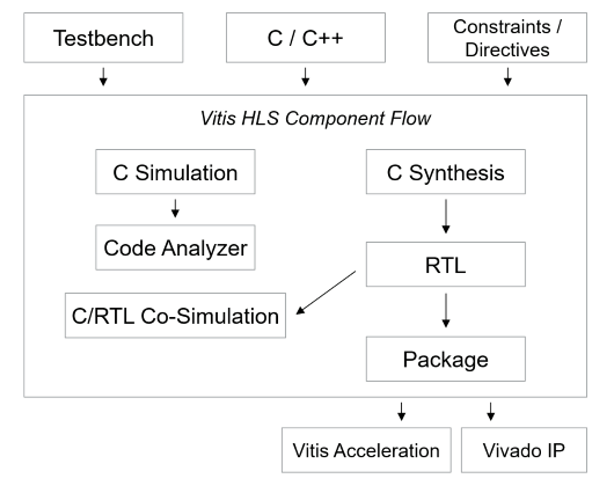
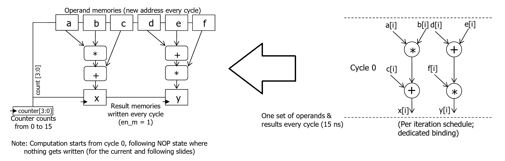
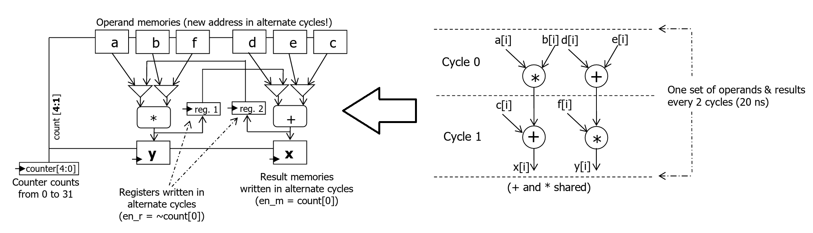
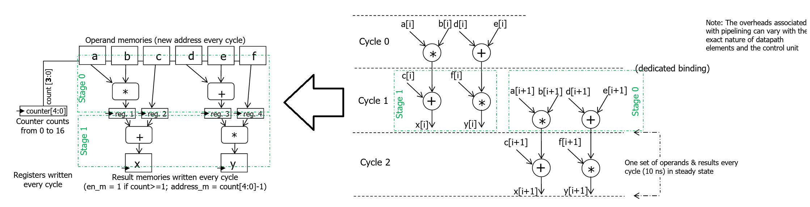

# Lec 06 - High-Level Synthesis

## HLS Introduction

High-Level Synthesis (HLS) is an automated design process that takes an **abstract behavioral specification** of a digital system and generates a **register-transfer level (RTL)** structure that realizes the given behavior.

### Motivation

> High-Level Synthesis (HLS) raises the level of design abstraction, making hardware design more accessible and less "hard".

HLS can enable the path of creating **high-quality RTL** rather quickly compared to manually writing error-free RTL. The designer needs to create the **macro-architecture** of the algorithm in C/C++ at a high level, meaning that the design intent and how this design interacts with the outside world should be carefully thought through. The HLS tool also requires **design constraints** like clock period and performance constraints. Micro-architecture decisions such as creating the state machine, datapath, and register pipelines are not needed at a high level, as these details can be handled and optimized by the HLS tool.

Using the defined macro-architecture of the C/C++ algorithm, designers can vary constraints to generate **multiple RTL solutions** and explore trade-offs between **performance and area**. As a result, a single algorithm can lead to multiple implementations, allowing designers to choose the implementation that best meets the needs of the overall application.

#### Improve Productivity

With HLS, the designer works at a **high level of abstraction**, meaning **fewer lines of code** need to be written as input to HLS. Due to **less time spent on writing the C++ code** and **quicker turnaround**, **user errors may be significantly reduced**, thus increasing overall **design productivity**. The designers can focus on creating **efficient designs at a higher level of abstraction** rather than worrying about **mechanical RTL implementation details**.

HLS not only enables high **design productivity** but also **verification productivity**. With HLS, the **test bench is also generated or created at a high level**, meaning the **original design intent can be verified very quickly**. The designer can explore **quick turnarounds of verified algorithms** as the flow is still within the **C/C++ domain**. Once the algorithm is verified in C/C++, the **same test bench can be used for generated RTL** by the HLS tool. Nevertheless, the **generated RTL can be integrated with the existing RTL verification flow** for more **comprehensive verification coverage**.

The design and verification benefits of using HLS are summarized here:

* Developing and validating algorithms at the C-level for the purpose of designing at an abstract level from the hardware implementation details.
* Using C-simulation to validate the design, and iterate more quickly than with traditional RTL design.
* Creating multiple design solutions from the C source code and pragmas to explore the design space, and find an optimal solution.

#### Enable Re-Use

The designs created for **High-Level Synthesis (HLS)** are **generic** and **implementation-independent**. These sources are not tied to any **technology node** or specific **clock period**, unlike a given **RTL design**. With just a few updates to **input constraints** and **without any source code changes**, multiple **architectures** can be explored. A similar practice with **RTL** is **impractical**, because designers create RTL for a specific **clock period**, and any change for a **derivative product**, however small, leads to a **new, complex project**.

By working at a **higher level** with **HLS**, designers do not need to worry about the **micro-architecture** and can rely on the **HLS tool** to automatically **regenerate new RTL**.

### History and Present

Earlier HLS tools still used HDLs such as VHDL and Verilog as input, but allowed more behavioral (partially timed) descriptions instead of fully timed RTL required by logic synthesis. Examples include _Behavioral Compiler_ from Synopsys (1994), which used VHDL/Verilog, and _Cynthesizer_ from Forte Design Systems (1998), which used SystemC.

Most modern HLS tools were introduced more recently and support higher-level languages such as C/C++ and SystemC. These include _Stratus HLS_ from Cadence (2015), _Intel High Level Synthesis Compiler_ from Intel (2017), and _Vivado HLS_ from AMD (2012/13). Other tools such as _MATLAB HDL Coder_ from MathWorks (2003) further expanded high-level hardware design support. In addition, HLS tools are now integrated into heterogeneous computing frameworks (e.g., OpenCL), such as the Intel FPGA SDK for OpenCL and AMD Vitis, enabling easier hardware acceleration and hardware/software co-design.

### Design Flow

A typical flow using HLS has the following steps:

1. Write the algorithm at a high abstraction level using C/C++ with a target architecture in mind
2. Verify the functionality at the behavioral level
3. Use the HLS tool to generate the RTL for a given clock speed and design constraints
4. Verify the functionality of the generated RTL
5. Explore different architectures using the same input source code

#### Design Steps

An **HLS component** is synthesized from a **C** or **C++ function** into **RTL code** for implementation in the **programmable logic (PL) region** of an **AMD Versal™ Adaptive SoC**, **AMD Zynq™ MPSoC**, or **AMD FPGA** device. The **HLS component** is tightly integrated with both the **Vivado Design Suite** for **synthesis, placement, and routing**, and the **Vitis core development kit** for **heterogeneous system-level design** and **application acceleration**.

The **HLS component** can be used to develop and export:

* **Vivado IP** – to be integrated into **hardware designs** using the **Vivado Design Suite**, and used with provided **software drivers** for **application development** in **embedded systems**.
* **Vitis kernels** – for use in the **Vitis application acceleration development flow**, either with **AI Engine graph applications** in **heterogeneous compute systems** or for **data center acceleration**.

Here are the steps for developing an **HLS component** from a **C++ function**:

1. **Architect** the algorithm based on the **design principles**. This is called **design entry**.
2. **C-Simulation**: Verify the **functionality** of the **C/C++ code** using the **C/C++ test bench**.
3. **Code Analyzer**: Analyze the **performance**, **parallelism**, and **legality** of the **C/C++ code**.
4. **C-Synthesis**: Generate the **RTL** using the **v++ compiler**.
5. **C/RTL Co-Simulation**: Verify the **RTL code** generated using the **C/C++ test bench**. The same testbench used in C-Simulation can be used on the RTL generated here.
6. **Package**: Review the **HLS synthesis reports** and **implementation timing reports**.
7. **Iterate**: Re-run the previous steps until the **performance goals** are met.

<figure><picture><source srcset="../.gitbook/assets/hls-component-flow-dark.png" media="(prefers-color-scheme: dark)"></picture><figcaption><p>HLS Component Development Flow</p></figcaption></figure>

The **tool** implements the **HLS component** based on the **target flow**, **default tool configuration**, **design constraints**, and any **optimization pragmas or directives** you specify. You can use **optimization directives** to **modify** and **control** the implementation of the **internal logic** and **I/O ports**, overriding the **default behaviors** of the tool.


The pragmas can be done in C code by using `#pragmas DIRECTIVE`, and the example directives can be `UNROLL`, `PIPELINE`, `ARRAY_PARTITION`, `DATAFLOW`, etc.


In addition, HLS tools support **arbitrary-precision and fixed-point data types**, which help reduce hardware area and improve efficiency compared to standard data types.

<details>

<summary>How well does HLS work?</summary>

Using an inherently **sequential high-level language** to produce inherently **parallel hardware** is challenging. Sometimes the expected results are achieved, while other times small, seemingly irrelevant changes in code can produce **substantially different hardware**. HLS works fairly well for **inner blocks** with **data-oriented, resource-dominated functionality** and relatively simple control flow, such as **digital signal processing** and **machine learning inference**.

It does **not work well** for **control-oriented blocks** or **custom I/O interfaces**. HLS is typically used for **inner blocks**, though it is becoming more popular for **full-system design**. **Static allocation** (arrays of finite sizes) works, but constructs that depend on runtime behavior, like **dynamically allocated arrays**, and **recursion** generally do not work. The goal of HLS is **not** to describe something that runs on a processor but to **describe the processor itself**!

</details>

## HLS Tutorial

In this part, we will see how several examples on how the HLS tools sythesize the high-level code into a macro-scopic structure which can then be easily implemented by the RTL code. The workflow is summarized as follows:

1. HLS tools generate an **scheduled and bound** sequencing graph from the high-level code.
2. HLS tools do the data-path and contrl-unit synthesis based on that sequencing graph automatically. RTL is then generated based on this macro-scopic picture.


Some HLS tools like Vitis may go one step further, which is to generate a netlist rather than the HDL code.


Suppose the high-level code we write is shown as follows:


```c
#include <stdio.h>

int main() {
    int a[16], b[16], c[16], d[16], e[16], f[16];
    int x[16], y[16];

    // Computation
    for(int i = 0; i < 16; i++) {
        x[i] = a[i] * b[i] + c[i];
        y[i] = (d[i] + e[i]) * f[i];
    }

    return 0;
}
```


We assume that `a[i]` to `f[i]` are **separate memories** that can be read **asynchronously**, and `x[i]` and `y[i]` are separate memories that can be **written synchronously**. Besides, we assume that adders have a delay of 5ns and multipliers have 10ns delay. The circuit is **resource-dominated**.

### Single-Cycle

The easiest and most trivial design is the single-cycle design, in which we finsih everything in one cycle and use the dedicated binding.

<figure><figcaption></figcaption></figure>

This design will give us:

* **Schedule**: all computations **combinational**,
* **Binding**: no sharing (2 adders, 2 multipliers)
* **Timing**: period = 15 ns, latency = 1 cycle
* **Trip count**: 16 iterations
* **Resource usage**: inefficient
* **Total latency**: 16 cycles (240 ns)

### Multi-Cycle

Suppose now we use the multi-cycle design, which is default to the **older version** of Vitis. This time, we scheduled our design and use resource-sharing binding.

<figure><figcaption></figcaption></figure>

This design will give us:

* **Binding**: resource-sharing (1 adder, 1 multiplier)
* **Timing**: period = 10ns, latency = 2 cycles
* **Trip count**: 16
* **Total latency**: 32 \[320ns]

### Pipelined

Now, we can play around with the pipelined design, which is default in the newer version of Vitis. This time, we will use **dedicated binding**.

<figure><figcaption></figcaption></figure>

In this pipelined design, we will have:

1. [**Initial Inverval**](#user-content-fn-1)[^1] (II) to be 1.
2. **Binding**: no sharing (2 adders, 2 multipliers)
3. **Timing**: period = 10ns, latency = 2, Trip count = 16
4. **Total latency**: 17 \[170ns] (II \* Trip Count + 1 cycle overhead to "fill" the pipeline)

## References

1. [Vitis HLS Synthesis Guide (2025.2) by AMD](https://docs.amd.com/r/en-US/ug1399-vitis-hls).

[^1]: This is a formal term for the CPI we have learned in CG3207. It is a measure of throughput and it represents the **data processed per unit time**.
