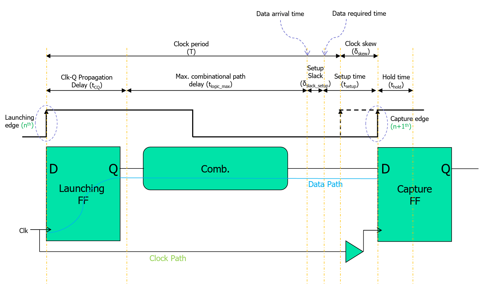
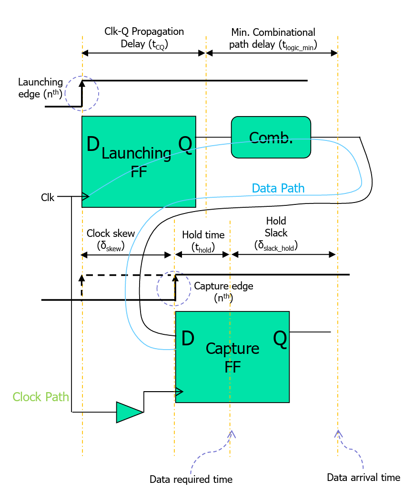
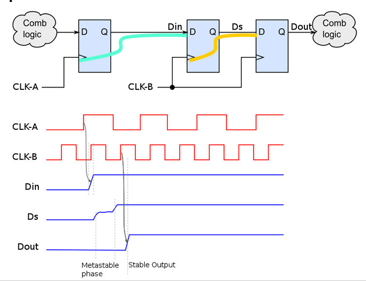
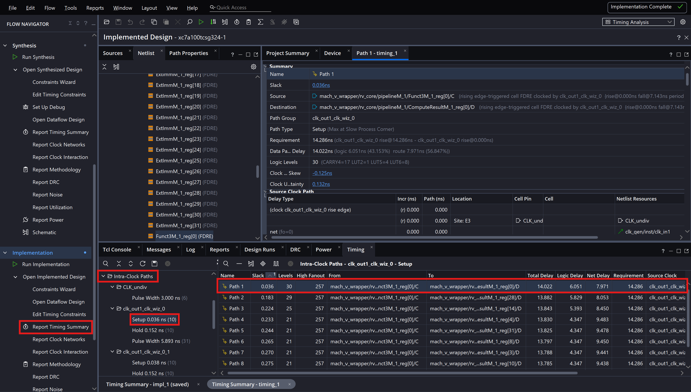
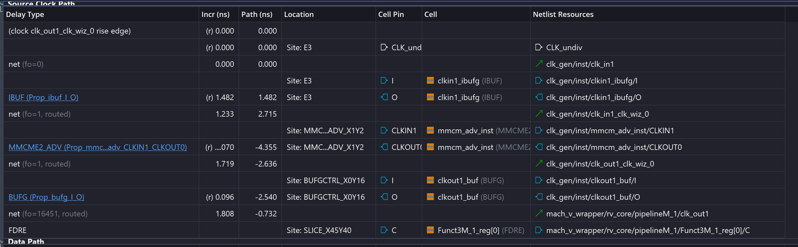
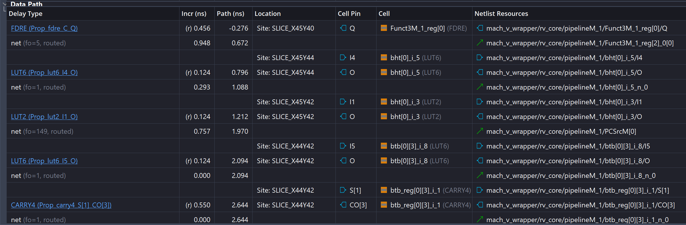
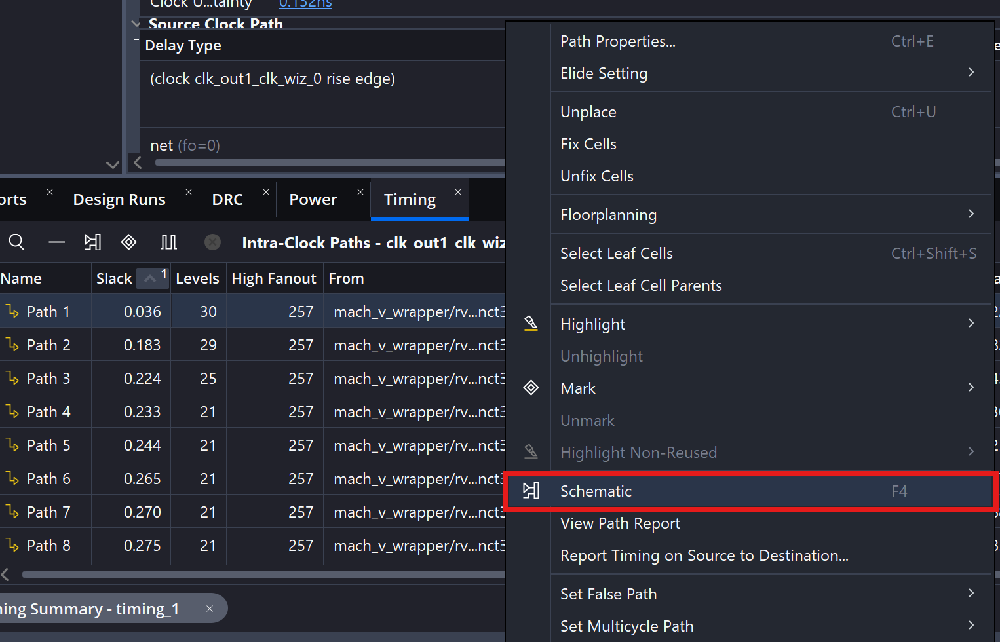
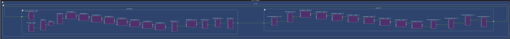
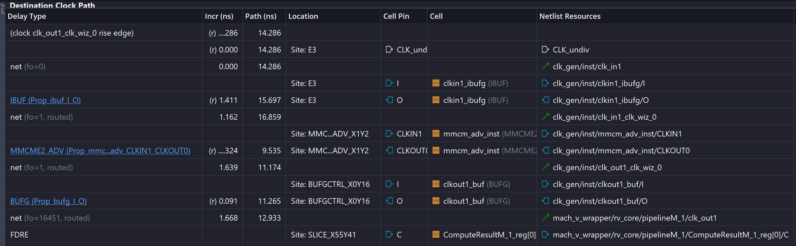

# Lec 07 - Timing


Most of this part is covered in EE4415, but for the final, just print out the lecture slides as cheatsheet!


## Setup Time

In the setup time analysis, we are more interested in analyzing the n-th rising clock edge and the (n+1)-th rising clock edge.

<figure><picture><source srcset="../.gitbook/assets/setup-time-dark.png" media="(prefers-color-scheme: dark)"></picture><figcaption></figcaption></figure>

What is really amazing about this timing diagram is that it incorporates the idea of **data arrival time** and **data required time** to understand the setup time constraint as well as the hold time constraint we will see later.

* The data arrival time is just $$t_{\text{CQ}}+t_{\text{logic\_max}}$$
* The data required time is just $$T-t_{\text{setup}}+t_{\text{skew}}$$

In setup time constraint, the data arrival time must be **smaller than** the data required time.


If jitter is considered, this should be substracted from the data required time as we can use the worst-case analysis on $$t_{\text{logic\_max}}$$.


## Hold Time

In the hold time analysis, we are more interested in anlyzing the **same** rising clock edge on the capturing register.

<figure><picture><source srcset="../.gitbook/assets/hold-time-dark.png" media="(prefers-color-scheme: dark)"></picture><figcaption></figcaption></figure>

* The data arrival time is: $$t_{\text{CQ}}+t_{\text{logic\_min}}$$
* The data required time is: $$t_{\text{skew}}+t_{\text{hold}}$$

In the hold time constraint, the data arrival time must be **bigger** than the data required time.

## Timing Constraints

The timing constraints is provided to the synthesis tool so that it knows what to optimize. More specifically, the timing constraints we provide are in the unit of **nanoseconds**. In particular, we will be talking about the constraints file used in Vivado.


The timing constraints provided to the synthesis tool is different from the constraint used in scheduling. The latter is usually in the unit of clock cycles.


### `set_max/min_delay`

Similar to the [`set_max/min_delay`](https://app.gitbook.com/s/Sp0XaarBjbEX3JIMrRaR/textbook-2-synopsys/constraining-designs/environment-and-constraints#set_max_delay) command we have seen in Synopsys, in Vivado, this command is to set maximum/minimum delays between any two points.

#### CDC Issue

The most interesting and important usage of the `set_max/min_delay` mentioned in this lecture is on the [CDC](https://en.wikipedia.org/wiki/Clock_domain_crossing) issue of metastability. Basically, CDC exists when two parts of our system uses [**totally different**](#user-content-fn-1)[^1] clocks but they are still communicating the data with each other. To understand this issue better, we will use the follwing timing diagram.

<figure><picture><source srcset="../.gitbook/assets/cdc-issue-dark.png" media="(prefers-color-scheme: dark)"></picture><figcaption></figcaption></figure>

Before we dive into the timing diagram, let's make some assumptions:

1. Clock A and Clock B are generated by two clock sources, thus they are totally different.
2. The setup and hold time for the register are both 1ns.
3. The clock period of clock B is 10ns and the clock period of clock A is more than 20ns.
4. The metastable phase is 8ns.
5. The three registers from left to right are defined to be: Launching, Capturing, Sampling register.

After making these assumptions, we can step through this timing diagram.

1. At the first rising clock edge of clock A, after the clock-to-Q delay, `Din` becomes stable.
2. As clock A and clock B are **totally different**, let's say `Din` arrives within the **aperture time** of the capturing register. This will trigger the metastability phase at the output of the capturing register and according to our assumption, this **metastable phase** lasts for 8ns. In other words, `Ds` is **unstable** for 8ns.
3. Now the interesting thing happens:
   1. Let's say there is some other combinational path together with `Ds` and assume it takes 2ns to finish. Now, the data arriving at the **sampling** register will happen to fall within its **aperture time** again. So on and so forth, we will have a bunch of register being in **metastability state**.
   2. But, let's say the combinational path with `Ds` takes 0.5ns to finish. Now, the data won't arrive within the aperture time of the sampling register. Thus, the data is safe to propagate!
4. This indicates that we should limit the **combinational path** delay so that we can sample the data coming from another clock domain safely. In our case, the **maximum delay** for the combinational path together with the `Ds` is 1ns. This can be done by using the `set_max_delay` command we have introduced just now.

In short, to solve the CDC issue, using `set_max_delay` is one way! FYI, the other way is to use the **asynchronous FIFO**.

### Vivado Timing Report Analysis

In this section, we are going to interpret the Vivado timing report. This is very useful as it can give us some hints on where is our critical path and how we find it in our microarchitecture diagram so that we can have a rough idea on improving the performance!


Here, I will be using the superscalar processor I designed — [Mach-V](https://mendax1234.github.io/Mach-V/)!


In Vivado, there are two timing reports avaiable:

1. **Synthesis Timing Report**: The timing report is estimated but indicative, but not the final timing information.
2. **Implementation Timing Report**: This is the final timing report, if it passes, likely the design will work well. Otherwise, there is a "real" timing violation.

To open the timing report (let's take Implementation timing report as an example), we can click the as the following figure shows.

<figure><figcaption></figcaption></figure>

In each path, we will have three parts:



#### Source Clock Path

This is the clock path from the clock source to the clock pin of the **launching register**. It starts with 0

<figure><figcaption></figcaption></figure>


"FDRE" means D flip-flop with reset and enable.




#### Data Path

This is the combinational data path between the launching and capturing registers. It starts with 0 and will add the delay of each combinational part so the final value represents the total combinational of that path.

<figure><figcaption></figcaption></figure>


This part and the schemetic of the data path is probably the **most important** as this guides us what to optimize in our design.


Show the schemetic of the critical path

To show the schematic of the path, we can right click that path and then choose "Schematic" as follows.

<figure><figcaption></figcaption></figure>

This will give you the schemetic of the critical path in your system, like below.

<figure><figcaption></figcaption></figure>




#### Destination Clock Path

This is the clock path from the clock source to the clock pin of the **capturing register**. It starst with the value of **one clock period** because the capturing register will capture the data coming from the data path at the next clock period.

<figure><figcaption></figcaption></figure>


The clock uncertainty is added to the destination clock path.




[^1]: Here, "totally different" means that the two clocks **shouldn't** come from one clock source (PLL). Note that only differ in clock frequency but coming from the same clock source cannot be regarded as "totally different".
