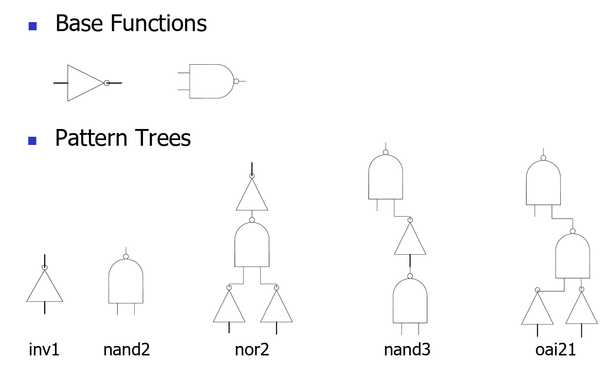
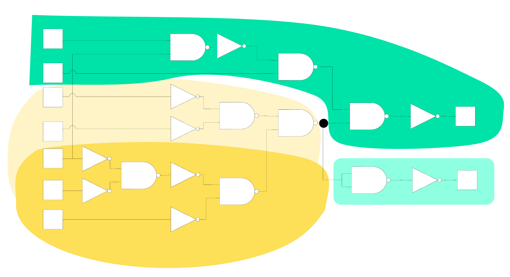
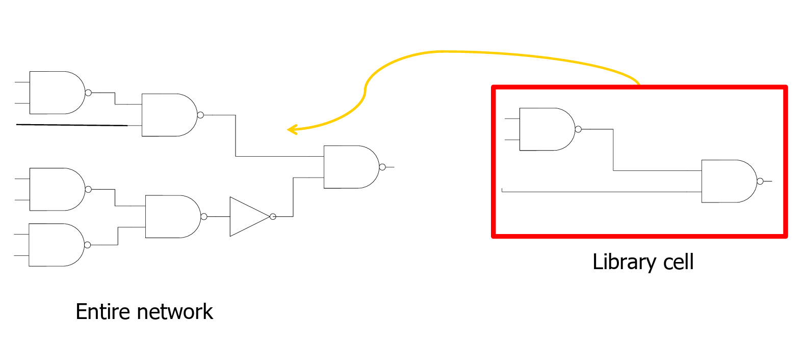

# Lec 08 - Technology Mapping

As we have seen in the previous lectures, technology mapping is done in the [**logic synthesis**](https://wenbo-notes.gitbook.io/ddca-notes/lec/lec-02-digital-system-design-and-verilog#substeps) step of the ASIC/FPGA Design Flow. **Technology mapping** converts the [**technology independent network**](#user-content-fn-1)[^1] resulting from [logic optimization](#user-content-fn-2)[^2] by matching pieces of the network with the **logic cells** that are available in a t**echnology-dependent cell library**.


In other words, technology mapping can be thought of as the process of [**binding**](#user-content-fn-3)[^3] nodes in the network to cells in the library.


Usually, technology mapping can be divided into two categories:

1. **Library Base** technology mapping: Standard-cell based.
2. **FPGA** Technology Mapping: Look-up Table/Multiplexer based.

## Library Based Technology Mapping

The library based technology mapping uses the **standard cells** available from the standard cell library.


In EE4415, we have seen this kind of standard cell library (called [Technology library](https://app.gitbook.com/s/Sp0XaarBjbEX3JIMrRaR/textbook-2-synopsys/synopsys-technology-library/technology-libraries) by Synopsys).&#x20;


For example, the following figure gives an example of available standard cells in the IBM standard-cell library used for the POWER4.

<figure><picture><source srcset="../.gitbook/assets/cell-library-example-dark.png" media="(prefers-color-scheme: dark)"></picture><figcaption></figcaption></figure>


#### Basic gates and Patterns

Inside a technology library, we can have both basic gates and patterns.

* **Basic gates**: `INV`, `NAND2`, `NAND3`, `NOR2` are the basic gates.
* **Patterns**: `AOI21`, `AOI22`, `OAI21`, `OAI22` are the patterns.


As we have seen at the very first beginning, the spirit of technology mapping is to translate logic equations into a **network** of **technology**/**standard cells**. This translation usually incorporates the following four steps:

1. **Decomposition**: Restructure the boolean function using the one or several basic functions only.
2. **Partitioning**: Partition the big network into sub-networks.
3. **Matching**: Find matches between patterns and regions of cells in the subject graph.
4. **Covering**: Use patterns to cover the subject graph and minimize the cost function


The third and fourth step might be combined together.


### Logic Decomposition

In the logic decomposition step, we must decompose the whole network using the basic gates or a.k.a primitives. Most common choices for the primitives are `NAND2` and `INV`.


The library cells must be decomposed into primitives as well!


<details>

<summary>Basic Functions vs. Pattern Trees</summary>

Inside a technology library, we can have both basic functions and pattern trees. For example,

<figure><picture><source srcset="../.gitbook/assets/base-function-pattern-dark.png" media="(prefers-color-scheme: dark)"></picture><figcaption></figcaption></figure>

</details>

For example, we can decompose a `NAND4` gate using the primitives `NAND2` and `INV` as follows.

<figure><picture><source srcset="../.gitbook/assets/decompose-nand4-dark.png" media="(prefers-color-scheme: dark)"></picture><figcaption></figcaption></figure>


Note that we might have more than 1 decompositions for one function!


### Partitioning

In the partitioning step, the goal is to divide the big netowrk into smaller sub-networks which are defined as **subject boolean graph**.


The restriction for the subject boolean graph is that it should be a **multiple-input, single-output** graph. Given that, when doing the partitioning, we usually separate the **high fanout** interconnection point.


For example, the following is a valid partitioning.

<figure><picture><source srcset="../.gitbook/assets/partitioning-dark.png" media="(prefers-color-scheme: dark)"></picture><figcaption></figcaption></figure>

In this partitioning, we call each one of the four partitions a **subject boolean network**.


Note that we partition based on the <i class="fa-circle-notch">:circle-notch:</i> which represents a high fanout interconnection in the network.


### Pattern Matching

Pattern matching is one of the crucial tasks for technology mapping as it determines which cells in the library may be used to implement a set of notes in the subject boolean network.


We can think of **patterns** as what we have while **subject boolean networks** are what we want to achieve using the what we have — patterns.


There are two main types of matching:

1. Structural matching
2. Boolean matching

#### Structural Matching

In the structural matching, we match the netowrk with library cells **recursively** until the entire network is matched.

<figure><picture><source srcset="../.gitbook/assets/structural-mapping-example-dark.png" media="(prefers-color-scheme: dark)"></picture><figcaption></figcaption></figure>

In the structural matching algorithm, we assume and require that

* Logic decomposition is done using **only one** basic function. Assume it is the `NAND2` in our case.
* The **degree** of a node is used to indicate the number of **children** of that node.
* $$u$$ is the **root** of a **pattern graph** while $$v$$ is a vertex of the **subject graph**.

The pseudocode for the structural matching algorithm is shown below.


```c
Match (u,v){                        // Matches isomorphic graphs too
    if (u is a leaf)                // Leaf of pattern graph
        return (true);
    else {
        if (v is a leaf)            // Leaf of subject graph
            return (false);
        if (degree(v)≠degree(u))    // Different gate
            return (False);
        if (degree(v)==1) {
            uc = child of u;
            vc = child of v;
            return (Match(uc, vc)); // Recursive call
        }
        else {
            ul = left child of u;
            ur = right child of u;
            vl = left child of v;
            vr = right child of v;
            // The Pattern can be flipped
            return (Match(ul, vl) AND Match(ur,vr) + Match(ur,vl) AND Match(ul,vr));
        }
    }
}
```


The whole spirit of this algorithm is that if the root of the pattern is a leaf, it is okay. If the root of the pattern is **not** a leaf, but the vertex is a leaf, that is **not okay**. Below is an example of the structural pattern matching:

<figure><figcaption></figcaption></figure>

However, one of the biggest problems with structural pattern matching is that while structural matching definitely indicates that functional matching, functional matching doesn't necessarily indicate strucutral matching. For example, the following two expressions are functionally matched but they are not structurally matched.

<figure><picture><source srcset="../.gitbook/assets/problem-structural-matching-dark.png" media="(prefers-color-scheme: dark)"></picture><figcaption></figcaption></figure>

This inspires us to look at the second matching algorithm, which is boolean matching.

#### Boolean Matching

Instead of relying on matching structurally, boolean matching relies on matching the pattern **logically**.


Boolean matching is **decomposition independent**.

* Structurally matched pattern are also logically equivalent.
* Two logically equivalent patterns may have different structures.


In boolean matching, let's consider a **cluster function** $$f$$ (our subject graph) within $$n$$ input variables and a **pattern function** $$g$$ with $$m$$ cell inputs.

<figure><picture><source srcset="../.gitbook/assets/cluster-vs-pattern-cell-dark.png" media="(prefers-color-scheme: dark)"></picture><figcaption></figcaption></figure>

Matching of two functions $$f$$ and $$g$$ involves **comparing two functions for equivalence** and **finding an assignment** of the cluster variables to pattern inputs. When doing the function equivalence check, we can have three methods:

1. Permutation of the input variables
2. Negation of Input Variables
3. Negation of Output

> TODO: Add example for each of the above method.

Thus, the functions in booleam matching can be equivalent in three ways:

1. NPN-equivalent: equivalent under input negation, input permutation, and output negation.
2. PN-equivalent: equivalent under input permutation and negation.
3. P-equivalent: equivalent under input permutation.


If we do the NPN-equivalent, we will have to check $$2^n\times n!\times2$$ possible checks.


[^1]: This is the **combinational logic** between the registers.

[^2]: This represents the **combinational logic optimization** and it won't be covered in EE4218. FYI, the classic textbook from Giovanni covers this in much greater detail.

[^3]: Not the binding we have seen in the architectural synthesis step.
