# Topics

## Important Points

### SWE Testing

#### Developer testing

_**Developer testing**_**&#x20;is the testing done by the developers themselves** as opposed to dedicated testers or end-users.

#### Testing Automation

**A test driver is the code that ‘drives’ the** [**SUT**](#user-content-fn-1)[^1] **for the purpose of testing** e.g., invoking the SUT with test inputs and verifying if the behavior is as expected.

Usually, we have a tool to do this test automation. In Java, we use JUnit.

### Java JUnit

When writing JUnit tests for a class `Foo`, the common practice is to create a `FooTest` class, which will contain various test methods for testing methods of the `Foo` class.



Suppose we want to write tests for the `IntPair` class below.


```java
public class IntPair {
    int first;
    int second;

    public IntPair(int first, int second) {
        this.first = first;
        this.second = second;
    }

    /**
     * Returns The result of applying integer division first/second.
     * @throws Exception if second is 0.
     */
    public int intDivision() throws Exception {
        if (second == 0){
            throw new Exception("Divisor is zero");
        }
        return first/second;
    }

    @Override
    public String toString() {
        return first + "," + second;
    }
}
```




Here's a `IntPairTest` class to match (using JUnit 5).


```java
import org.junit.jupiter.api.Test;

import static org.junit.jupiter.api.Assertions.assertEquals;
import static org.junit.jupiter.api.Assertions.fail;

public class IntPairTest {

    @Test
    public void intDivision_nonZeroDivisor_success() throws Exception {
        // normal division results in an integer answer 2
        assertEquals(2, new IntPair(4, 2).intDivision());

        // normal division results in a decimal answer 1.9
        assertEquals(1, new IntPair(19, 10).intDivision());

        // dividend is zero but divisor is not
        assertEquals(0, new IntPair(0, 5).intDivision());
    }

    @Test
    public void intDivision_zeroDivisor_exceptionThrown() {
        try {
            assertEquals(0, new IntPair(1, 0).intDivision());
            fail(); // the test should not reach this line
        } catch (Exception e) {
            assertEquals("Divisor is zero", e.getMessage());
        }
    }

    @Test
    public void testStringConversion() {
        assertEquals("4,7", new IntPair(4, 7).toString());
    }
}
```



#### Code Explanation

1. Each test method is marked with a `@Test` annotation.
2. Tests use `assertEquals(expected, actual)` methods (provided by JUnit) to compare the expected output with the actual output. If they do not match, the test will fail.
3. There are [several ways to verify the code throws the correct exception](https://howtodoinjava.com/junit5/expected-exception-example/). The second test method in the example above shows one of the simpler methods. If the exception is thrown, it will be caught and further verified inside the `catch` block. But if it is not thrown as expected, the test will reach `fail()` line and will fail as a result.




**What to test for when writing test cases**? This should be another module at NUS LOL. But for now, we can take it as the goal of these tests is to **catch bugs in the code**.

### SWE Documentation

**Developer-to-developer documentation** can be in one of two forms:

1. **Documentation for&#x20;**_**developer-as-user**_: This is to document how software componenets are to be used. Some examples are
   1. API documentation
   2. Tutorial-style instructional documentation
2. **Documentation for&#x20;**_**developer-as-maintainer**_**:** This is to document how a system or a component is designed so that other developers can maintain and evolve that part of code.

### SWE Design Models

**Design** is the creative process of transforming the problem into a solution; the solution is also called design. While **modelling** represents something else.

> For example, a class diagram shown as follows is a **model** that represents a software design.

<figure>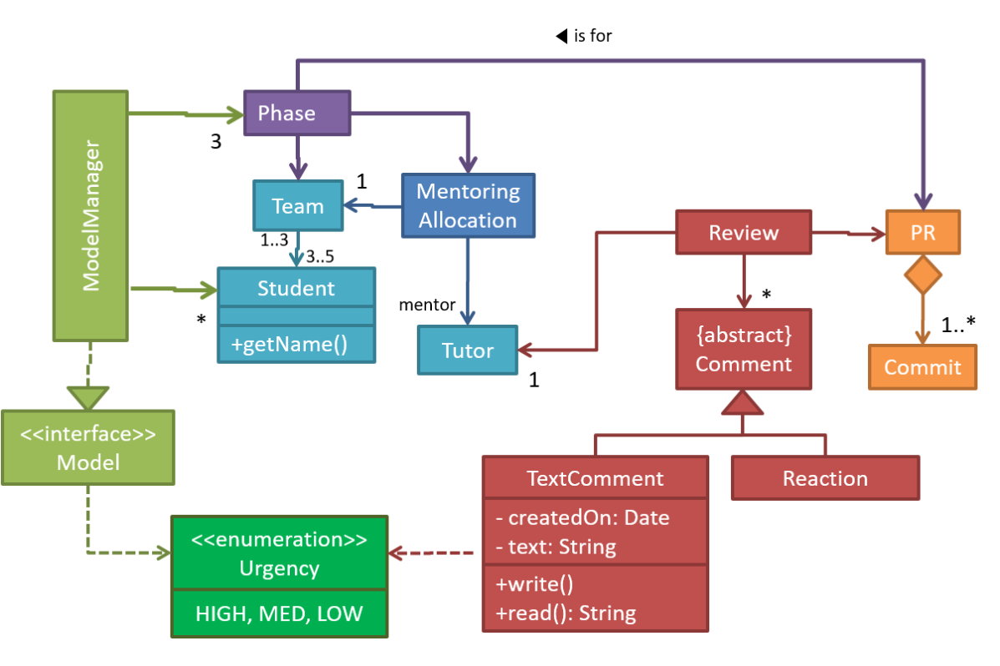<figcaption><p>An example class diagram</p></figcaption></figure>

A **model** provides a **simpler** view of a complex entity because a model captures only a selected aspect.

> For example, a class diagram captures the **structure** of the software design but **not the behavio**r.

**Multiple** models of the same entity may be needed to capture it fully.

> For example, in addition to a **class diagram** (or even multiple class diagrams), a number of other diagrams may be needed to capture various interesting aspects of the software.

### SWE Class & Object Diagrams Basics

**UML&#x20;**_**Object Diagrams**_ model object structures. **UML&#x20;**_**Class Diagrams**_ model class structures. Those rules that object structures need to follow can be illustrated as a _class structure_.

#### Class Diagrams

**UML&#x20;**_**class diagrams**_ describe the structure (but not the behavior) of an OOP solution. (You have already seen a class diagram from above)



#### Basic Structure

The basic UML notations used to represent a _class_ is shown as follows:

<figure><figcaption></figcaption></figure>

The **methods** compartment and/or the **attributes** compartment may be omitted if such details are not important for the task at hand.

<figure>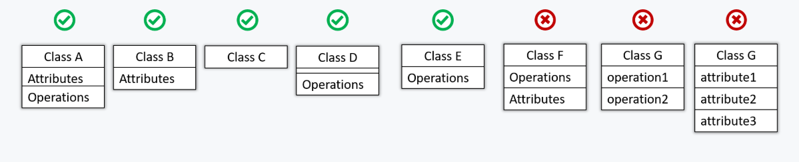<figcaption></figcaption></figure>



#### Visibility

`+` for public, `-` for private, `#` for protected and `~` for package private


**There is no&#x20;**_**default**_**&#x20;visibility** in UML. If a class diagram does not show the visibility of a member, it simply means the _visibility is unspecified_ (for reasons such as the visibility not being decided yet or it being not important to the purpose of the diagram).




#### Generic Class Notation

Generic classes can be shown as given below.

<figure>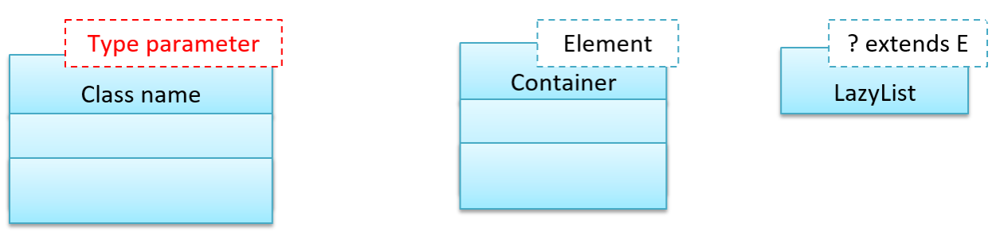<figcaption></figcaption></figure>



#### Class Level members and methods notation

In UML class diagrams, **underlines** denote **class-level attributes** and **methods.** For example, we have the following `Student` class with class-level member `totalStudents` and class-level method `getTotalStudents()`.

<figure>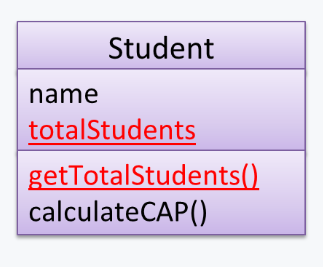<figcaption></figcaption></figure>



***

> _**Associations**_ are the main connections among the classes in a class diagram.

1. Objects in an OO solution need to be connected to each other to form a network so that they can interact with each other. Such **connections between objects are called&#x20;**_**associations**_**.**
2. **Associations** in an **object structure** can change over time.
3. **Associations** among objects can be **generalized** as **associations between the corresponding classes** too.

To implement associations, we use instance level variables. For example, the `Course` class can have a `students` variable to keep track of students associated with a particular course.



#### Association notation in UML

You should use a solid line to show an association between two classes.

<figure>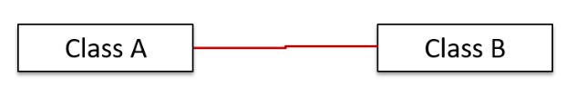<figcaption></figcaption></figure>



#### Associations as attributes

An association can be shown as an attribute instead of a line, and **vice versa**! The notation by default is as follows,

```
name: type [multiplicity] = default value
```

For example, the association that a `Board` has 100 `Square`s can be shown in either of these two ways:

<figure>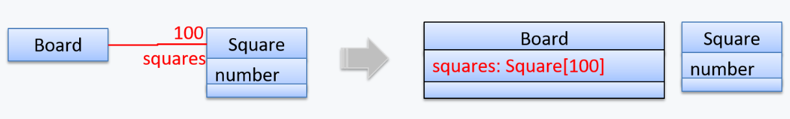<figcaption></figcaption></figure>

Both is optional, which means we can use **either one** of them, but **not both together**!



In some cases, associations are better than attributes because they can show **additional decorations** such as _**association labels**_**,&#x20;**_**association roles**_**,&#x20;**_**multiplicity**_**&#x20;and&#x20;**_**navigability**_ to add more information to a class diagram.



#### Association Labels

_**Association labels**_ describe the meaning of the association. The arrow head indicates the direction in which the label is to be read.

For example, the same association is described using two different labels.

<figure>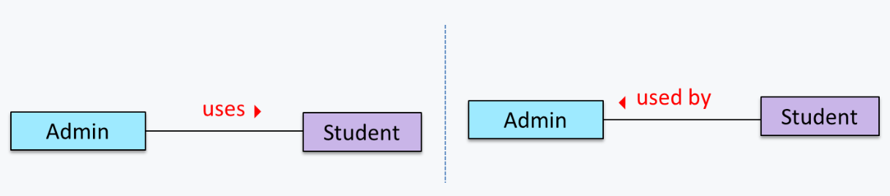<figcaption></figcaption></figure>

Here, an `Admin` uses a `Student` while a `Student` is used by an `Admin`.



#### Association Roles

_**Association Role**_ are used to indicate the **role played by the classes** in the association. We have two classes involved in an association, thus there are two **roles**.

<figure>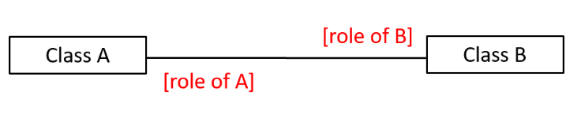<figcaption></figcaption></figure>



***

When two classes are linked by an association, it does not necessarily mean both objects taking part in an instance of the association _knows about_ (e.g., has a reference to) each other. **The concept of&#x20;**_**navigability**_**&#x20;tells us if an object taking part in association knows about the other.** In other words, it tells us if we can 'navigate' from the one object to the other in a given direction — because if the object 'knows' about the other, it has a reference to the other object, and we can use that reference to 'navigate to' (e.g., access) that other object.

Navigability can be _unidirectional_ or _bidirectional_:

* **Unidirectional**: If the navigability is from `A` to `B`, we say `a` will have a reference to `b` but `b` will not have a reference to `a`.
* **Bidirectional:** `b` will have a reference to `a` and `a` will have a reference to `b`.


Two unidirectional associations in opposite directions do not add up to a single bidirectional association.


For example, the following code has two unidirectional associations between the `Person` class and the `Cat` class (in opposite directions). Because the breeder is not necessarily the same person keeping the cat as a pet, they are **two separate associations**, not a **bidirectional association**.


```java
class Person {
    Cat pet;
    //...
}

class Cat{
    Person breeder;
    //...
}
```


We use **arrowheads** to indicate the navigability of an association.

<figure>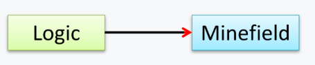<figcaption></figcaption></figure>

***

_**Multiplicity**_ is the aspect of an OOP solution that dictates **how many objects take part in each association**.

To implement the multiplicty, we have the following four types



#### Optional associations

**A normal instance-level variable gives us a `0..1` multiplicity** because a variable can hold a reference to a single object or `null`.

For example, in the code below, the `Logic` class has a variable that can hold `0..1` i.e., zero or one `Minefield` objects.


```java
class Logic {
    Minefield minefield;
    // ...
}

class Minefield {
    //...
}
```




#### Compulsory associations

When we call the instantiate method `new()`, the multiplicity will be 1.


```java
class Logic {
    ConfigGenerator cg = new ConfigGenerator();
    ...
}
```




We use the following notation to draw **multiplicty** in the class diagram

<figure>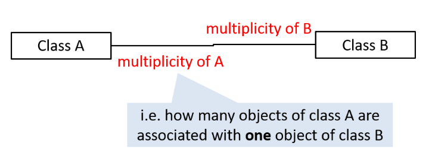<figcaption></figcaption></figure>

Below are some commonly used multiplicities:

* `0..1` : _optional_, can be linked to 0 or 1 objects.
* `1` : _compulsory_, must be linked to one object at all times.
* `*` : can be linked to 0 or more objects.
* `n..m` : the number of linked objects must be within `n` to `m` inclusive e.g., `2..5`, `1..*` (one or more), `*..5` (up to five)


**There is no&#x20;**_**default**_**&#x20;multiplicity** in UML. If a class diagram does not show the multiplicity of an association, it simply means the _multiplicity is unspecified_.


## Classic Questions



#### API Documentation

Choose correct statements about API documentation.

* [x] &#x20;a. They are useful for both developers who use the API and developers who maintain the API implementation.
* [x] &#x20;b. There are tools that can generate API documents from code comments.
* [x] &#x20;c. API documentation may contain code examples.

***

The answer is **All**.



#### Models

Choose the correct statements about models.

* [x] &#x20;a. Models are abstractions.
* [x] &#x20;b. Models can be used for communication.
* [x] &#x20;c. Models can be used for analysis of a problem.
* [ ] &#x20;d. Generating models from code is useless.
* [x] &#x20;e. Models can be used as blueprints for generating code.

***

Answer is a, b, c, and e.



#### UML Class Diagram

Which of these follow the correct UML notation?

<figure>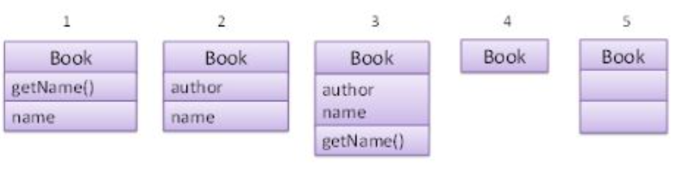<figcaption></figcaption></figure>

***

**3, 4** and **5** are correct.

* 4: Both _Attributes_ and _Methods_ compartments can be omitted.
* 5: The _Attributes_ and _Methods_ compartments can be empty.



[^1]: Software Under Test
