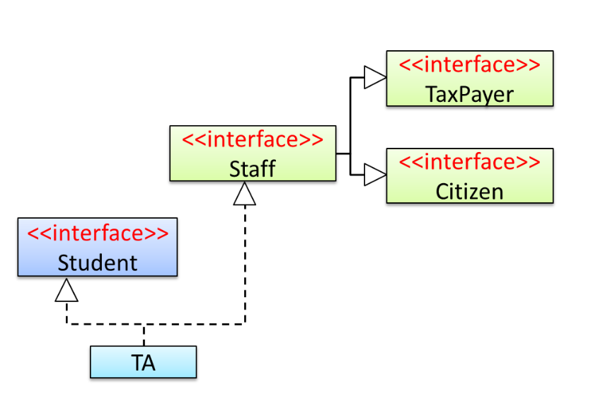

# Diagnostic Quiz

## Problems

### 07. Interface Inheritance

> Interface **inherits** another interface. A class **implements** an interface.

<figure><figcaption></figcaption></figure>

Staff interface _implements_ the TaxPayer interface. TA _implements_ the Staff interface.

* [ ] True
* [x] False

***

False. Staff **inherits**, not **implements**, the `TaxPayer` interface.

### 13. Java Logging

> Java has a default logging facility.

Java programmers need to use third-party logging libraries as Java does not have a default logging mechanism.

* [ ] True
* [x] False

***

False. Java has a default logging facility.

### 18. SoC Principle

The principle of SoC states that the code which we are more concerned about should be separated out.

* [ ] True
* [x] False

***

**False**. This is not the definition of [SoC](https://wenbo-notes.gitbook.io/cs2113-notes/lec/lec-09/topics#separation-of-concerns-principle-soc).

## Tips

1. Interface **inherits** another interface. A class **implements** an interface.
2. Java has a default logging facility.
3. Java assertions **cannot** be used for exception handling.
4. In coupling, if X is coupled to Y if a change to Y can **potentially** require a change in X. It doesn't mean a change to Y **must** require a change in X.
5. [SRP](https://wenbo-notes.gitbook.io/cs2113-notes/lec/lec-09/topics#single-responsibility-principle-srp) is about **classes**, not **methods.**
