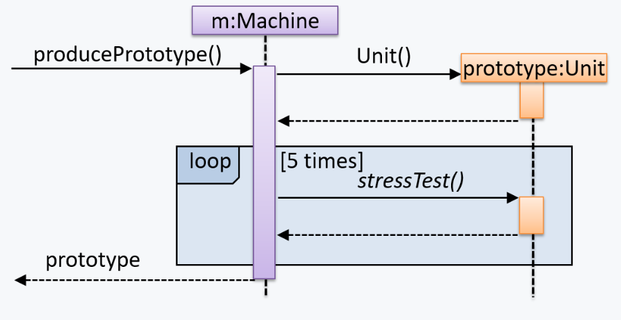
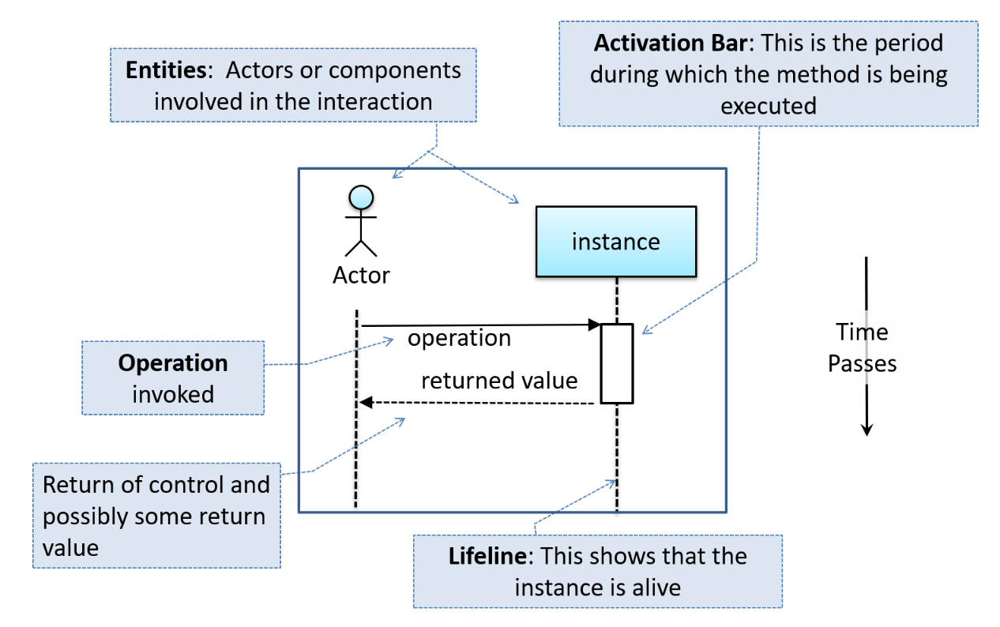
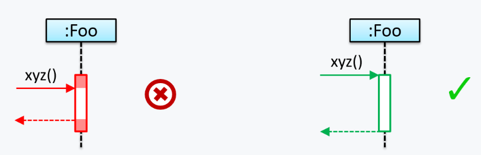
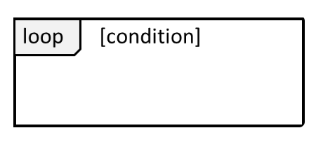
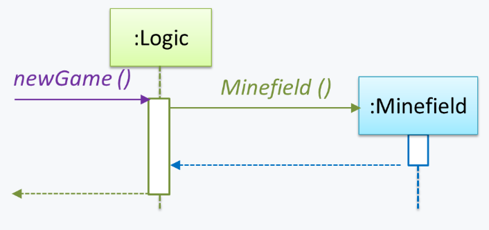
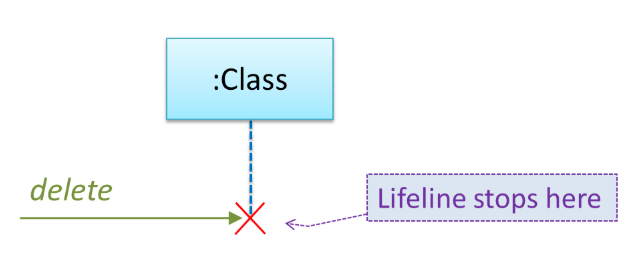
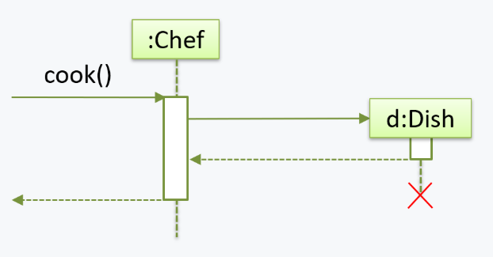
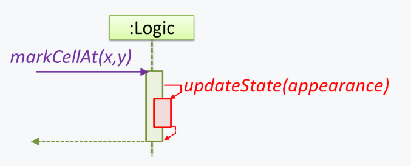
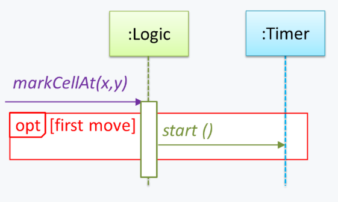
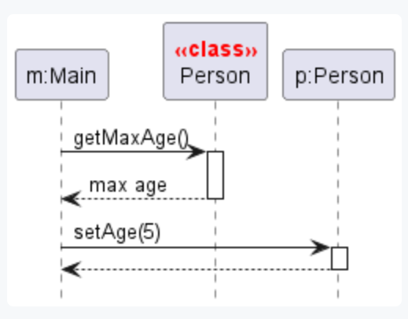

# Topics

## Important Points

### SWE Sequence Diagrams Basics

**Sequence diagrams** model the interactions between **various entities in a system**, in a specific scenario. Some examples that we can use sequence diagrams:

* To model how components of a system interact with each other to respond to a user action.
* To model how objects inside a component interact with each other to respond to a method call it received from another component.

A **UML sequence diagram** _captures the interactions between multiple entities for a given scenario._ For example,


```java
class Machine {

    Unit producePrototype() {
        Unit prototype = new Unit();
        for (int i = 0; i < 5; i++) {
            prototype.stressTest();
        }
        return prototype;
    }
}

class Unit {

    public void stressTest() {

    }
}
```


This code can be converted to the following UML sequence diagram

<figure><figcaption></figcaption></figure>

#### UML Notation

<figure><figcaption></figcaption></figure>


### Notes

1. The class/object name is **not underlined** in sequence diagrams.
2. The arrowhead styles depends on the type of method call.
   1. Synchronous method call will use **filled** arrowheads. (In CS2113, we **always** use the **filled** arrowheads, as shown in the example above)
   2. Asynchronous method call will use **lined** arrowheads. (Out of the scope of CS2113, but you must have learned it in CS2030S)
3. Some common notation errors
   1.  Activation bar too long:\


       <figure><figcaption></figcaption></figure>
   2.  Broken activation bar: When calling the **nested** methods, the outer method shouldn't be **broken**!\


       <figure><figcaption></figcaption></figure>




Now, we sill introduced some detailed notations that will be used when we construct the sequence diagram



#### Loops

<figure><figcaption></figcaption></figure>

For example, the `Player` calls the `mark x,y` command or `clear x y` command repeatedly until the game is won or lost.

<figure><figcaption></figcaption></figure>



#### Object Creation

<figure><figcaption></figcaption></figure>

* The arrow that represents the constructor arrives at the side of the box representing the instance.
* The activation bar represents the period the constructor is active.

For example, the `Logic` object creates a `Minefield` object.

<figure><figcaption></figcaption></figure>



#### Minimal Notation

To reduce clutter, **optional elements (e.g, activation bars, return arrows) may be omitted** if the omission does not result in ambiguities or loss of [relevant information](#user-content-fn-1)[^1].



### SWE Sequence Diagrams Intermediate

#### Object Deletion

UML uses an `X` at the end of the lifeline of an object to show its deletion.

<figure><figcaption></figcaption></figure>

Although Java doesn't support `delete` operation, we can use the object deletion notation to indicate the point at which the object becomes **ready to be garbage-collected** (e.g., the point at which it ceases to be referenced).

For example, note how `d` lifeline ends with an `X` to show that it is 'deleted' (e.g., ready to be garbage collected) after the `cook()` method returns.


```java
class Chef {
    void cook() {
        Dish d = new Dish();
    }
}
```


<figure><figcaption></figcaption></figure>

#### Self Invocation

UML can show a method of an object calling another of its own methods.

<figure><figcaption></figcaption></figure>

For example, the `markCellAt(...)` method of a `Logic` object is calling its own `updateState(...)` method.

<figure><figcaption></figcaption></figure>

<details>

<summary><strong>A small tip</strong>: 'Unroll' chained/compound method calls before drawing sequence diagram</summary>

Consider the Java statement `new Book().add(new Chapter());`. How do we show it as a sequence diagram?

First, "unroll" it into a simpler series of statements, which can then be drawn as a sequence diagram easily. For example, that statement is equivalent to the following:


```java
Book b = new Book();
Chapter c = new Chapter();
b.add(c);
```


And its sequence diagram will look like as follows:

> TODO:

</details>

#### Alternative Paths

UML uses `alt` frames to indicate alternative paths. This can be viewed as the `if/else` branch in the high-level Java code.

<figure><figcaption></figcaption></figure>

For example, the `Minefield` calls the `Cell#setMine` method if the cell is supposed to be a mined cell, and calls the `Cell:setMineCount(...)` method otherwise.

<figure><figcaption></figcaption></figure>


**No more than one** alternative partitions be executed in an `alt` frame.


#### Optional Paths

UML uses `opt` frames to indicate optional paths.

<figure><figcaption></figcaption></figure>

For example, `Logic#markCellAt(...)` calls `Timer#start()` only if it is the first move of the player.

<figure><figcaption></figcaption></figure>

#### Calls to Static Methods

Method calls to `static` (i.e., class-level) methods are received by the class itself, not an instance of that class. You can use `<<class>>` to show that a participant is the class itself.

For example, `m` calls the static method `Person.getMaxAge()` and also the `setAge()` method of a `Person` object `p`.

<figure><figcaption></figcaption></figure>

#### Parallel Paths

UML uses `par` frames to indicate parallel paths.

<figure><figcaption></figcaption></figure>

For example, `Logic` is calling methods `CloudServer#poll()` and `LocalData#poll()` in parallel.

<figure><figcaption></figcaption></figure>


If you show parallel paths in a sequence diagram, the corresponding Java implementation is likely to be _multi-threaded_ because a normal Java program cannot do multiple things at the same time.



[^1]: e.g., information relevant to the purpose of the diagram
