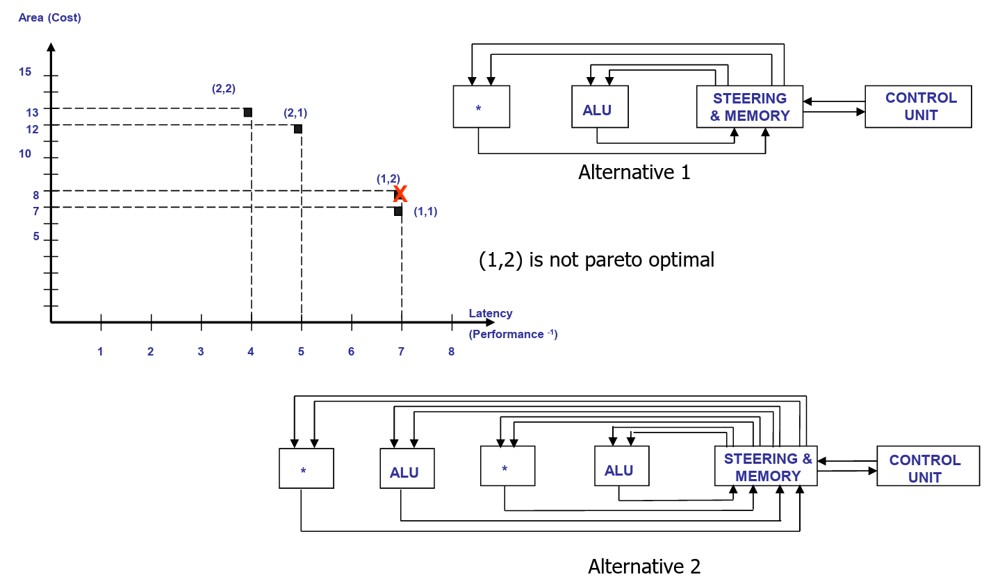

# Strategies for Architectural Optimization

**Architectural optimization** comprises **scheduling** and **binding**. Complete architectural optimization is applicable to circuits that can be modeled by **sequencing graphs** (or equivalent representations) without a **start time** or **binding annotation**. Thus, the goal of architectural optimization is to determine a **scheduled sequencing graph** with a complete **resource binding** that satisfies the given **constraints** and optimizes some figure of merit. In other words, finding the pareto point in the design space.

Architectural Synthesis vs. Architectural Optimization

While **Architectural Synthesis** is the overarching process of mapping behavioral descriptions to structure so that we can write RTL code, **Scheduling** and **Binding** are the specific mechanisms that perform **Architectural Optimization** by navigating the design space to determine the best trade-offs (Pareto points) between area and latency.


Think of the architectural optimization as a **subset** of architectural synthesis.



It is obvious that any circuit model described in terms of a **scheduled** and **bound sequencing graph** does not require any optimization, because the desired design point in the design space is already prescribed.


**Architectural optimization** consists of determining a **schedule** $$\phi$$ and a **binding** $$\beta$$ that optimize the objectives (**area**, **latency**, and **cycle time**). The optimization of these multiple objectives reduces to the computation of the [**Pareto points**](../introduction/computer-aided-synthesis-and-optimization.md#pareto-point) in the [**design space**](../introduction/computer-aided-synthesis-and-optimization.md#design-space) and to the evaluation (or estimation) of the corresponding **objective functions**.

**Architectural exploration** is often performed by the following three approaches

1. examining the **(area, latency) trade-off** for a given **cycle time**.
   1. Example is **scheduling**
2. searching for the **(cycle time, latency) trade-off** for a given **binding** (fixed area)
   1. Example is **chaining**
3. searching for the **(area, cycle time) trade-off** for a given **schedule** (fixed latency).
   1. Example is **retiming**


Unfortunately, the **(cycle time, latency) trade-off** for some values of **area**, as well as the **(area, cycle time) trade-off** for some values of **latency**, are complex problems to solve, because several **bindings** may correspond to a given **area**, and several **schedules** may correspond to a given **latency value**. So, in EE4218, we will mainly focus on the Area/Latency Optimization.


## Area/Latency Optimization

Let us consider **resource-dominated circuits** first. Given the **cycle time**, the execution delays can be determined. Since the **area** depends on the **resource usage** (and not on any particular **binding**), **scheduling problems** provide the framework for determining the **(area, latency) trade-off points**.

Indeed, solutions to the **minimum-latency scheduling problem** and the **minimum-resource scheduling problem** provide the **extreme points** of the **design space**. **Intermediate solutions** can be found by solving:

* **Resource-constrained minimum-latency scheduling problems**, or
* **Latency-constrained minimum-resource scheduling problems**,

for different values of the **constraints**. For example, the following figure shows a design space exploration with area/latency optimization.

<figure><picture><source srcset="../../.gitbook/assets/area-latency-opt-dark.png" media="(prefers-color-scheme: dark)"></picture><figcaption></figcaption></figure>


Not that the coordinates of the **pareto points** are (number of resource type 1, number of resource type 2) instead of the area or latency in this case!

