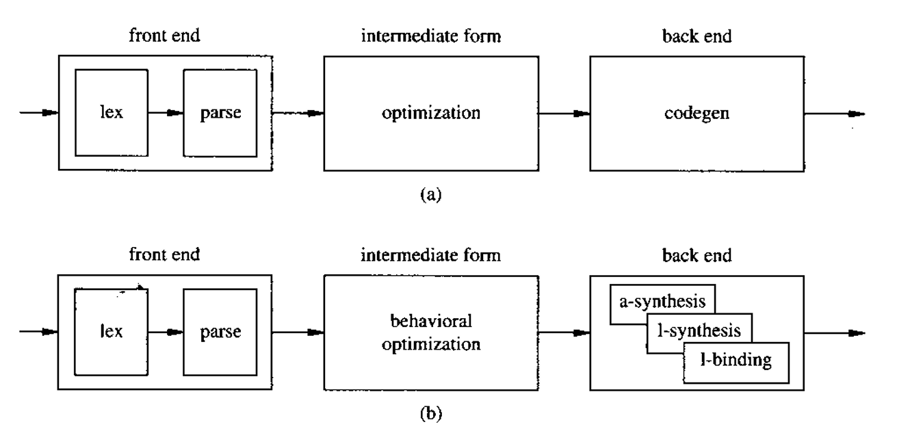
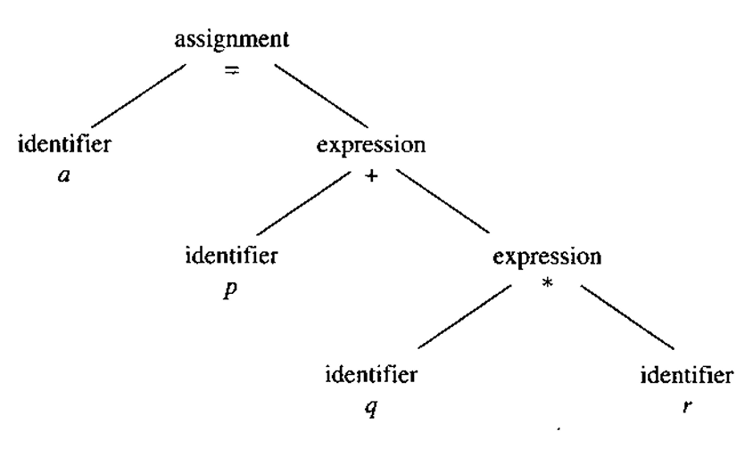
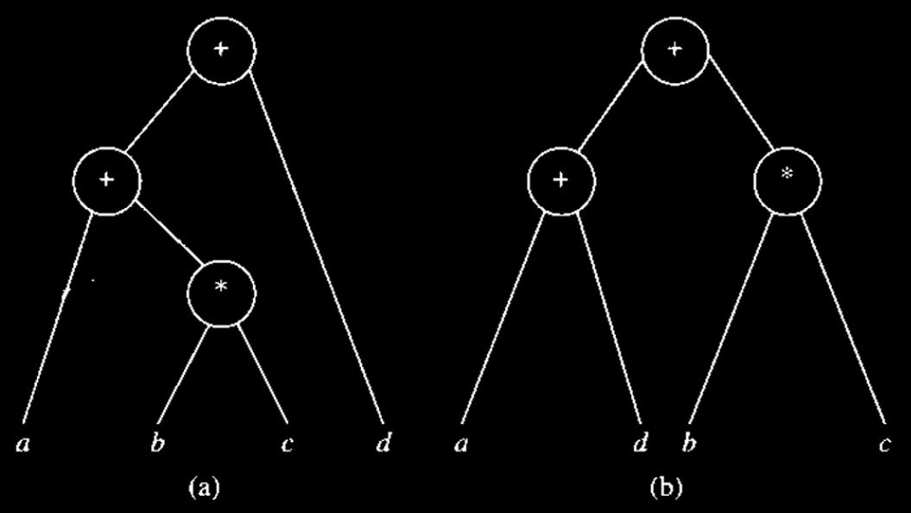

# Compilation and Behavioral Optimization

We explain in this section how **circuit models**, described by **HDL programs**, can be transformed into the **abstract models** that will be used as a starting point for **synthesis** in the following chapters.

Most **hardware compilation techniques** have analogues in **software compilation**. Since **hardware synthesis** followed the development of **software compilers**, many techniques were borrowed and adapted from the rich field of **compiler design**. Nevertheless, some **behavioral optimization techniques** are applicable only to **hardware synthesis**. We shall briefly survey general issues on **compilation**, where the interested reader can find a wealth of literature, and we shall concentrate on the specific **hardware issues**.

A **software compiler** consists of

1. a **front end** that transforms a program into an **intermediate form** and
2. a **back end** that translates the intermediate form into the **machine code** for a given **architecture**.

The **front end** is **language dependent**, and the **back end** varies according to the **target machine**. Most modern **optimizing compilers** improve the **intermediate form**, so that the **optimization** is neither **language dependent** nor **machine dependent**.

Similarly, a **hardware compiler** can be seen as consisting of a **front end**, an **optimizer**, and a **back end** (Figure 3.16).

<figure><picture><source srcset="../../.gitbook/assets/sw-hw-compiler-dark.png" media="(prefers-color-scheme: dark)"></picture><figcaption><p>Figure 3.16 Anatomies of software and hardware compilers.</p></figcaption></figure>

The **back end** of a hardware compiler is much more complex than a **software compiler** because of the requirements on **timing** and **interface** of the internal operations. The **back end** exploits several techniques that go under the generic names of:

* **architectural synthesis**,
* **logic synthesis**, and
* **library binding**.

We describe the **front end** and the **optimization techniques** in this section. The **back end** is described in the different parts in this note. Overall, the usage of these three stages in the context of software compilation, high-level synthesis, and RTL/HDL synthesis will be:



#### Software Compilation

* **Front end:** Compile program into intermediate representation (IR).
* **Optimisation**: Optimise IR.
* **Back-end**: Generate target code for an architecture (ISA).



#### High-level Synthesis

* **Front end**: Compile High-Level model into **sequencing graph.**
* **Optimisation**: Optimise the sequencing graph.
* **Back end**: Generate the RTL or gate-level interconnection for a technology library.



#### RTL/HDL Synthesis

* **Front end**: Parse RTL description into a **synchronous logic network**.
* **Optimisation**: Optimise combinational and sequential logic.
* **Back-end**: Generate gate-level netlist for a technology library.




The **optimizations** are similar across these three compiling techniques, but their **back-ends** differ significantly.


## Compilation Techniques

The **front end** of a compiler is responsible for **lexical analysis**, **syntax analysis**, **parsing**, and creation of the **intermediate form**.

### Lexical Analyzer

A **lexical analyzer** is a component of a compiler that reads the **source model** and produces as output a set of **tokens** that the **parser** then uses for **syntax analysis**. A **lexical analyzer** may also perform ancillary tasks, such as **stripping comments** and **expanding macros**. **Metavariables** can be resolved at this point.

### Parser

A **parser** receives a set of **tokens**. Its first task is to verify that they satisfy the syntax rules of the language. The parser has knowledge of the grammar of the language and generates a set of **parse trees**, which are tree-like representations of the syntactic structure of a language (an example is shown in Figure 3.17).

<figure><picture><source srcset="../../.gitbook/assets/parse-tree-example-dark.png" media="(prefers-color-scheme: dark)"></picture><figcaption><p>Figure 3.17 Example of a parse tree for the statement a = p + q * r.</p></figcaption></figure>

**Syntactic errors**, as well as some **semantic errors** (such as an operator applied to an incompatible operand), are detected at this stage. The **error recovery policy** depends on the compiler and on the gravity of the erro**r**. Software tools can be used to create **lexical analyzers** and **parsers**, such as lex and yacc, commonly provided with the UNIX operating system.


Whereas the **front ends** of a compiler for **software** and **hardware** are very similar, the subsequent steps may be fairly different. In particular, for **hardware languages**, diverse **strategies** are used according to their **semantics** and **intent**.


The **semantic analysis** of the parse trees leads to the creation of the intermediate form, which represents the implementation of the original HDL program on an **abstract machine**. Such a machine is identified by a set of operations and dependencies, and it can be represented graphically by a **sequencing graph**. The **hardware model** in terms of an **abstract machine** is virtual, in the sense that it does not distinguish the **area** and **delay costs** of the operations. Therefore, **behavioral optimization** can be performed on such a model while abstracting the underlying circuit technological parameters.

## Optimization Techniques

**Behavioral optimization** is a set of semantic-preserving transformations that minimize the amount of information needed to specify the partial order of tasks. No knowledge about the circuit implementation style is required at this stage. The latitude of applying such optimization depends on the freedom to rearrange the intermediate code. Therefore, models that are highly constrained to adhere to a **time schedule** or to an **operator binding** may benefit very little from these techniques.


We consider these transformations here as the transformations which are applied to sequences of statements, e.g., **program-level** transformations.


### Data-Flow-Based Transformations

These transformations are dealt with in detail in most books on software compiler design.

#### Tree Heigh Reduction

This **transformation** applies to **arithmetic expression trees** and strives to split expressions into **two-operand expressions**, so that the **parallelism** available in **hardware** can be exploited optimally. It can be seen as

1. a **local transformation**, applied to each **compound arithmetic statement**, or
2. as a **global transformation**, applied to all compound arithmetic statements in a **basic block**.

Enough **hardware resources** are postulated to exploit all **parallelism**; if this is not the case, the **gain** of applying the transformation is obviously reduced.

<details>

<summary>Example of optimization to fully utilise parallelism</summary>

Consider the following **arithmetic assignment**:

```
x = a + b + c + d;
```

This can be trivially split as:

```
x = a + b;
x = x + c;
x = x + d;
```

which requires **three additions in series**. Alternatively, the split:

```
p = a + b;
q = c + d;
x = p + q;
```

allows the first two additions to be performed in **parallel** if enough **hardware resources** (in this case, **two adders**) are available. The **second choice** is better than the first because its **implementation cannot be inferior** for any possible **resource availability**.

</details>

**Tree-height reduction** was studied in depth as an **optimization scheme** for **software compilers**. It is used in **hardware compilers** mainly as a **local transformation**, due to the limited **parallelism** in **basic blocks**. **Tree-height reduction** exploits properties of **arithmetic operations** to **balance the expression tree** as much as possible. In the best case, the **tree height** is  $$O(\log n_{ops})$$) for ($$n_{ops}$$) operations, and the height is proportional to a **lower bound** on the overall **computation time**.



#### Commutativity and Associativity

The simplest **reduction algorithm** uses the **commutativity** and **associativity** of **addition** and **multiplication**. It **permutes the operands** to form subexpressions with the same **operator**, which can then be **reduced** using the **associative property**.

<details>

<summary>Example of using commutativity and associativity</summary>

Consider the following **arithmetic assignment**:

```
x = a + b * c + d;
```

By using the **commutativity of addition**, we get:

```
r = a + d + b * c;
```

and by **associativity**:

```
x = (a + d) + b * c;
```

This **transformation** is illustrated in **Figure 3.18**. A further **refinement** can be achieved by exploiting the **distributive property**.

<figure><figcaption><p>Figure 3.18 Example of tree-height reduction using commutavity and distributivity.</p></figcaption></figure>

</details>



#### Distributivity

A further refrinement can be achieved by exploring the distributive propery, possibly at the expense of adding an operation.

<details>

<summary>Example of using distributivity</summary>

Consider the following **arithmetic assignment**:

```
x = a * (b * c * d + e);
```

Using the **commutativity of addition**, no **reduction in tree height** is possible. By using the **distributive property**, we can write:

```
x = a * b * c * d + a * e;
```

which has a **tree height of 3** and **one additional operation**. This **transformation** is shown in **Figure 3.19**. Note that **two multipliers** are necessary to reduce the **computation time** with this transformation.

<figure><figcaption><p>Figure 3.19 Example of tree-height reduction using distributive property.</p></figcaption></figure>

</details>



#### Constant and Variable Propagation



#### Constant Propagation

**Constant propagation**, also called **constant folding**, consists of detecting **constant operands** and **pre-computing** the value of the operation involving those operands. Since the result may itself be a **constant**, it can be **propagated** to subsequent **operations** that use it as an **input**.

<details>

<summary>Example of Constant Propagation</summary>

Consider the following **code fragment**:

```
a = 0;
b = a + 1;
c = 2 * b;
```

It can be replaced by:

```
a = 0;
b = 1;
c = 2;
```

through **constant propagation**, where **constant values** are **pre-computed** and **propagated** to subsequent **operations**.

</details>



#### Variable Propagation

**Variable propagation**, also called **copy propagation**, consists of detecting **copies of variables**, i.e., assignments such as:

```
x = y;
```

and using the **right-hand side variable** in subsequent **references**, replacing the **left-hand side variable**.

<details>

<summary>Example of Variable Propagation</summary>

Consider the following **code fragment**:

```
a = x;
b = a + 1;
c = 2 * a;
```

It can be replaced by:

```
a = x;
b = x + 1;
c = 2 * x;
```

through **variable propagation**, where the **copied variable** is replaced by its **original source**. The statement:

```
a = x;
```

may then be removed by **dead code elimination**, if there are no further **references** to **a**.


The vairable propagation is better because instead of waiting for `a = x` to finish, now all the three statements can be executed **concurrently**.


</details>


The **propagation** of **y** cannot be performed after a different **reassignment** to **x.** For example,

```
1.  x = 5;
2.  y = x;      // Copy statement: We establish that y is a copy of x.
3.  x = 10;     // Reassignment: x is modified here ("killed").
4.  z = y + 2;  // Usage: We use y here.
```

If a compiler replaces the `y` in Line 4 with `x`, then there will be a problem!




#### Constant Subexpression Elimination

The search for **common arithmetic subexpressions** relies on finding [**isomorphic patterns**](#user-content-fn-1)[^1] in the **parse trees**. This step is simplified when **arithmetic expressions** are reduced to **two-input expressions**. The transformation consists of selecting a **target arithmetic operation** and searching for a preceding operation of the same **type** with the same **operands**. **Operator commutativity** can be exploited during this process. When a matching expression is found, the **target expression** is replaced by a **copy of the variable** that stores the **result** of the preceding expression.

<details>

<summary>Example of Constant Subexpression Elimination</summary>

Consider the following **code fragment**:

```
a = x + y;
b = a + 1;
c = x + y;
```

It can be replaced by:

```
a = x + y;
b = a + 1;
c = a;
```

through **common subexpression elimination**, where the repeated **arithmetic expression** is replaced by a **copy** of the previously computed **result**. The introduced **variable copy** can then be further optimized using **variable propagation** in the subsequent **code**.

</details>

#### Dead Code Elimination

**Dead code** consists of operations that cannot be **reached** or whose **results** are never **referenced** elsewhere. Such operations are detected by **data-flow analysis** and **removed**.

* Obvious cases include statements following a **procedure return statement**.
* Less obvious cases involve operations that precede a **return statement** but whose **results** are neither **procedure parameters** nor affect any of its **parameters**.

<details>

<summary>Exampld of Dead Code Elimination</summary>

Consider the following **code fragment**:

```
a = x;
b = x + 1;
c = 2 * x;
```

If the **variable a** is not **referenced** in the subsequent **code**, the assignment:

```
a = x;
```

can be removed by **dead code elimination**.

</details>

#### Operator Strength Reduction

**Operator strength reduction** consists of reducing the **implementation cost** of an **operator** by replacing it with a **simpler operator**. Although some knowledge of the **hardware implementation** may be required, general principles often apply. For example, a **multiplication by 2** (or by a **power of 2**) can be replaced by a **shift operation**. **Shifters** are typically **faster** and **smaller** than **multipliers** in many **hardware implementations**.


In this course, we assume that the order of complexity of operators are:

```
Exponent > Divide > Multiply > Add/Subtract > Shift > Logical
```


<details>

<summary>Example of Operator Strength Reduction</summary>

Consider the following **code fragment**:

```
a = x * 2;
b = 3 * x;
```

It can be replaced by:

```
a = x + x;
b = x + x + x;
```

through **operator strength reduction**, where **multiplications** are replaced by **simpler addition operations** to reduce **hardware cost**.

</details>

#### Code Motion

**Code motion** often applies to **loop invariants**, i.e., quantities computed inside a **loop** whose **values** do not change from **iteration to iteration**. The goal is to **avoid repetitive evaluation** of the same **expression**.

<details>

<summary>Example of Code Motion</summary>

Consider the following **iteration construct**:

```
for (i = 1; i <= 5; i++)
    a * b
```

where the variables **a** and **b** are **not updated** inside the loop. It can be transformed using **code motion** into:

```
t = a * b;
for (i = 1; i <= 5; i++)
    t
```

so that the **loop-invariant computation** `a * b` is evaluated **once** before the loop, avoiding **repetitive computation**.

</details>

### Control-Flow-Based Transformations

The following **transformations** are typical of **hardware compilers**. In some cases, these transformations are **automated**, while in others they are **user-driven**.

#### Model Expansion

**Model expansion** consists of **flattening** the **model call hierarchy** locally. Therefore, the **called model** disappears, being **absorbed** into the **calling model**.

<details>

<summary>Example of Model Expansion</summary>

Consider the following **code fragment**:

```
x = a + b;
y = a * b;
z = foo(x, y);
```

where:

```
foo(p, q) {
    t = q - p;
    return(t);
}
```

By **model expansion**, the function call is **flattened**, and we obtain:

```
x = a + b;
y = a * b;
z = y - x;
```

so that the **called model** is **absorbed** into the **calling model**, eliminating the **function call hierarchy**.

</details>

#### Conditional Expansion

A **conditional construct** can always be transformed into a **parallel construct** with a **test** performed at the **end**.

<details>

<summary>Exampld of Conditional Expansion</summary>

Consider the following **code fragment**:

```
y = a * b;
if (a) {
    x = b + d;
} else {
    x = b * d;
}
```

The **conditional statement** can be **flattened** into a **parallel expression**:

```
x = a * (b + d) + a' * (b * d);
```

and, through **logic manipulation**, the fragment can be rewritten as:

```
y = a * b;
x = y + d * (a + b);
```

thus eliminating the **conditional construct** by transforming it into an equivalent **parallel form**.


Here, we use the extension of the absorption law in **discrete maths**, which is

<p align="center"><span class="math">A+A'B=A+B</span></p>


</details>

#### Loop Expansion

**Loop expansion**, or [**loop unrolling**](https://app.gitbook.com/s/jTJFBPtKk6NwweAooH53/lec/lec-06-advanced-processor#loop-unrolling), applies to an **iterative construct** with **data-independent exit conditions**. The **loop** is replaced by multiple instances of its **body**, equal to the number of **iterations**. The main benefit is expanding the **scope** for further **optimizations** and **transformations**. However, when the number of **iterations** is large, **loop unrolling** may significantly increase the **code size**.


Shorter code doesn't mean **faster**!


<details>

<summary>Example of Loop Expansion</summary>

Consider the following **code fragment**:

```
x = 0;
for (i = 1; i <= 3; i++)
    x = x + a[i];
```

The **loop** can be **flattened** through **loop unrolling** into:

```
x = 0;
x = x + a[1];
x = x + a[2];
x = x + a[3];
```

and then further transformed by **propagation** into:

```
x = a[1] + a[2] + a[3];
```

thus eliminating the **iterative construct** and exposing opportunities for additional **optimization**.

</details>


After loop unrolling, if the unrolled statements are independent of each other, the unrolled statements will execute in **parallel**.


[^1]: This means "same shape".
