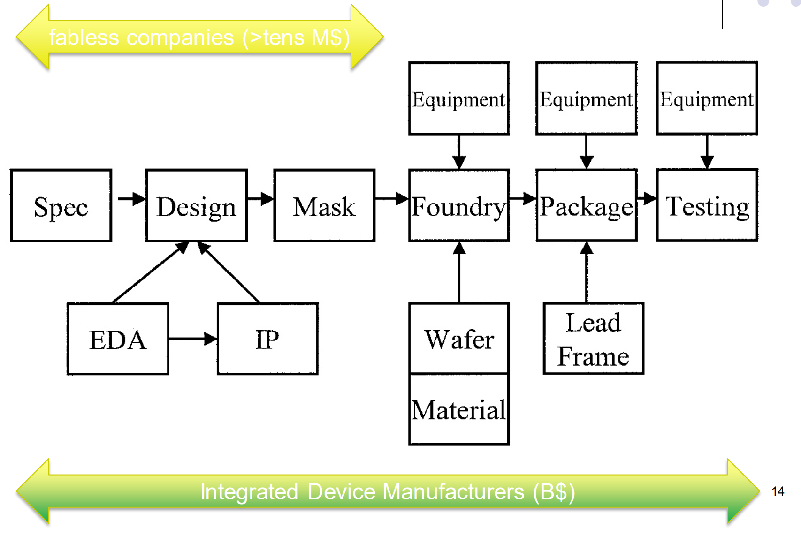
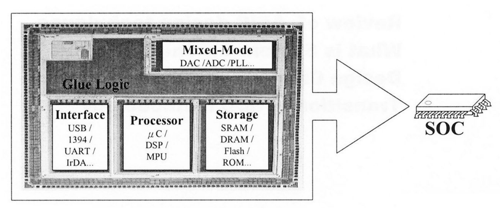
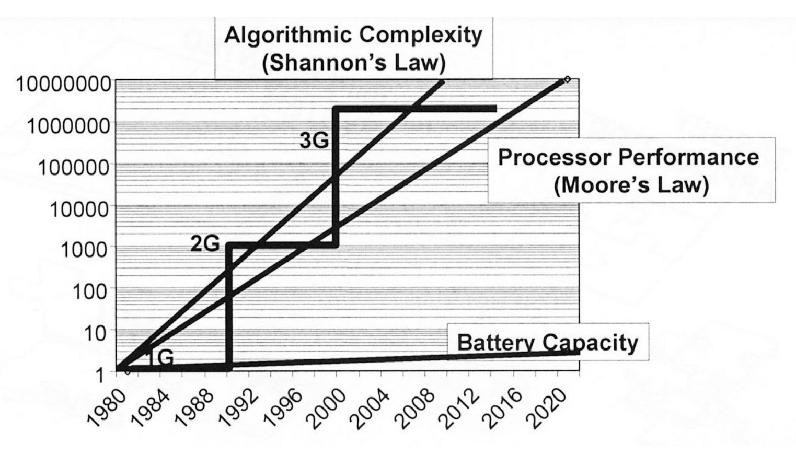
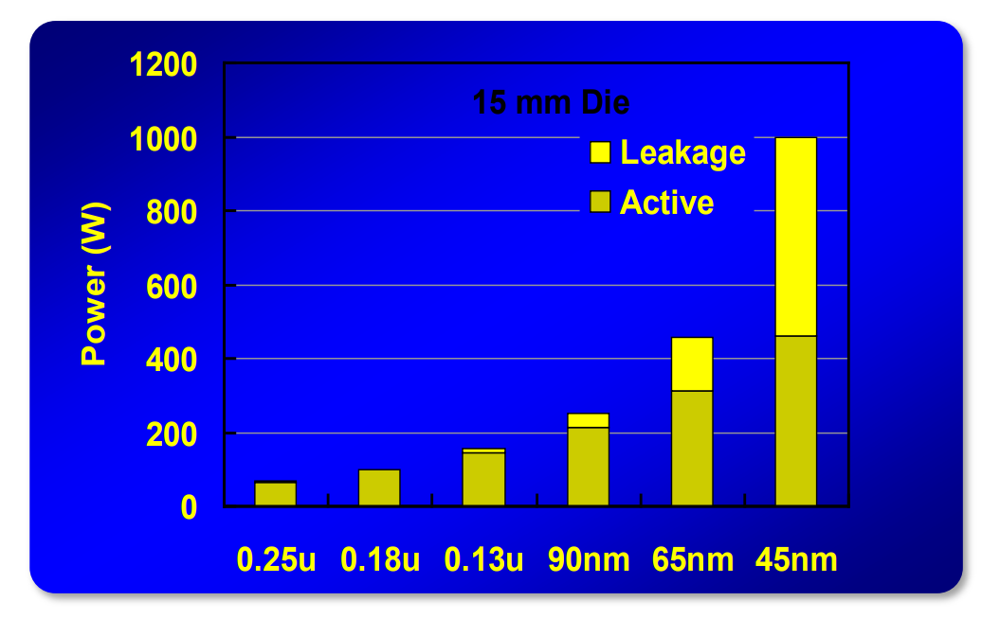

# Lec 01a - Intro

## IC Design

### Design Classification

IC Design can be classified into the following three categories:

1. Analog design
2. Mixed-Signal design
3. Digital design

The semiconductor industry can be summarized as follows:

<figure><figcaption></figcaption></figure>

Inside this image, there are some terms that are important and good to know



#### Spec

"Spec" stands for **Specification**. Before any engineering or coding happens, the team must define _what_ they are building. This document outlines the chip's requirements, such as its architecture (e.g., RISC-V or ARM), target power consumption, processing speed (frequency), and the physical area it is allowed to occupy.



#### Mask

Short for **Photomask**. Think of this as a high-precision "stencil" or "negative." It is usually a quartz plate containing the circuit patterns designed by the engineers. During the manufacturing process (photolithography), light shines through this mask to print the circuit patterns onto the silicon wafer.



#### Foundry

A **Foundry** (often called a "Fab") is a factory dedicated to the physical manufacturing of semiconductor wafers. Pure-play foundries (like TSMC or GlobalFoundries) usually do not design their own chips; they act as a service provider, fabricating chips based on designs sent to them by other companies (Fabless companies).



#### Lead Frame

The **Lead Frame** is a metal structure inside the chip's final black plastic casing. It serves two purposes: it mechanically supports the tiny silicon die inside, and it acts as an electrical bridge, connecting the microscopic pads on the chip to the larger external legs (pins) that you solder onto a motherboard.



### Trend in IC Design

The trend in IC Design is the shift from **Board-level integration** to **Chip-level integration**.

* In the past (Board-level): We needed a large motherboard (PCB) with separate chips for the processor, memory, and input/output controllers, all connected by wires on the board.
* Now (SoC): All those separate components are shrunk down and printed onto a single piece of silicon. This is a System-on-Chip (SoC).

<figure><figcaption></figcaption></figure>

The large box represents the single silicon die containing everything that used to be on a motherboard:

* **Processor**: The "brain" (e.g., Microcontroller, DSP).
* **Storage**: Built-in memory (RAM, Flash) so it doesn't always need external memory chips.
* **Interface**: Built-in controllers for USB, UART, etc., to talk to the outside world.
* **Mixed-Mode**: Analog circuits like ADC/DAC (to convert real-world signals like sound or temperature) and PLL (clocks).
* **Glue Logic**: The custom wiring and logic that connects all these blocks together.

SoCs are smaller, faster, cheaper to manufacture, and use much less power (crucial for mobile phones).

## The Challenges

From a general perspective, we have experienced a widening gap between what we _want_ devices to do and the power available to do it.

<figure><figcaption></figcaption></figure>

&#x20;The above image shows three different rates of growth from 1980 to 2020:

* **Algorithmic Complexity** **(The steepest line)**: The complexity of the software and standards we use (like moving from 1G to 2G to 3G mobile networks) is exploding. This demand for computation is growing faster than anything else.
* **Processor Performance (The middle line)**: Hardware speed is improving rapidly (Moore's Law), but it is barely keeping up with the insane growth in complexity.
* **Battery Capacity (The flat line)**: This is the bottleneck. Battery technology improves very slowly.

So, the challenge is that we need to run increasingly complex algorithms (top line) on mobile devices powered by batteries that aren't getting much better (bottom line). This forces engineers to design highly efficient chips (like the SoCs from the previous slide) to bridge the gap, rather than just relying on raw power.



#### Moore's Law

In 1965, Gordon Moore noted that the number of transistors on a chip/die doubled every 18 to 24 months. He then made a prediction that semiconductor technology will double number of transistors every 18 months (cost per transistor).



#### Die

A **die** is a single, small square of silicon that contains one complete copy of the integrated circuit.

In manufacturing, we start with a large round **wafer**. We print hundreds of identical circuits onto it. Then, we cut (or "dice") the wafer into individual rectangular pieces. Each individual piece is called a **die**.


Think of the wafer as a whole pizza, and the **die** as a single slice. The "chip" usually refers to the die _after_ it has been put inside the black protective package with metal legs.




#### Minimum Feature Size

The **Minimum Feature Size** refers to the smallest physical element that can be successfully printed or manufactured on a semiconductor chip. Historically, this almost always referred to the **gate length** of the transistor (the switch part that controls current flow).

Today, the minimum feature size is measured in **nanometers** (modern chips are now 3nm or 5nm).



### The Power Crisis

We are designing in a power limited regime.

#### The Leakage Problem

The follwoing chart tracks power consumption across different generations of chip technology (from old 0.25um to modern 45nm).

<figure><figcaption></figcaption></figure>

Notice how the <mark style="color:yellow;">yellow portion</mark> grows massively on the right side. In older chips, [**Leakage Power**](#user-content-fn-1)[^1] was tiny. In newer, smaller chips (45nm and below), leakage consumes nearly half the total power. So the trend is, as we make transistors smaller to make chips faster, they become "leaky," wasting electricity and generating heat even when doing nothing.

#### The Power Wall

The formula we use to calculate the power is

$$
\text{Power} = P_{\text{dynamic}} + P_{\text{static}} = E_{\text{op}} \times \text{Throughput} + P_{\text{static}}
$$

* For the $$\text{Power}$$ term, we have a hard limit on total power (e.g., a battery's limit or the point where the chip melts). We **cannot** increase this.
* For the $$\text{Throughput}$$ term, it is set in the **spec**. Throughput is the speed of the chip. Users and software always demand _higher_ speeds. This number **must** go up.
* For the $$E_{\text{op}}$$ term, this means **energy per operation**, which needs to be constantly improved
  * If **Power** is stuck at a limit, but **Throughput** must go up, the only way to balance the equation is to drastically _lower_ the energy used for every single calculation ($$E_{\text{op}}$$).
  * If engineers cannot lower $$E_{\text{op}}$$ fast enough, they cannot make the chip faster without exceeding the power limit. This is often called the "**Power Wall.**"

### The Productivity Gap

Thanks to Moore's Law, we can double the number of functions (transistors) on a chip every generation. However, **the number of engineers** available to design these chips does _not_ double every two years. Humans cannot work twice as fast or become twice as numerous overnight.

Thus, the result will be that we have the technology to build incredibly complex chips, but we don't have enough manpower to design them using old methods. This creates a "**Productivity Gap**" — we can manufacture more than we can easily design.

To close this gap, engineers must stop designing every single transistor by hand. Instead, they must use more efficient design methods, such as:

* **Abstraction**: Designing at a high level (like writing code) rather than drawing physical wires.
* **Design Reuse**: Using pre-made blocks (IP cores) instead of reinventing the wheel.
* **Regularity**: Creating standard patterns that can be easily repeated.

[^1]: power wasted when the chip is idle.
