# Lec 01b - Timing Synchronous

## Synchronous Sequencing Models

### System Abstraction

A digital system consists of communicating blocks shown as follows,

<figure>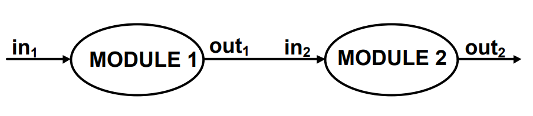<figcaption></figcaption></figure>

We assume that each combinational module evaluates its output in

$$
\tau_{\text{comb}} \in [\tau_{\text{comb},\text{min}},\tau_{\text{comb},\text{max}}]\;(\text{input-dependent})
$$

For example, the module 2 needs to "know" when in2 / out1 is correct (has settled). This can be illustrated using the following figure,

<figure>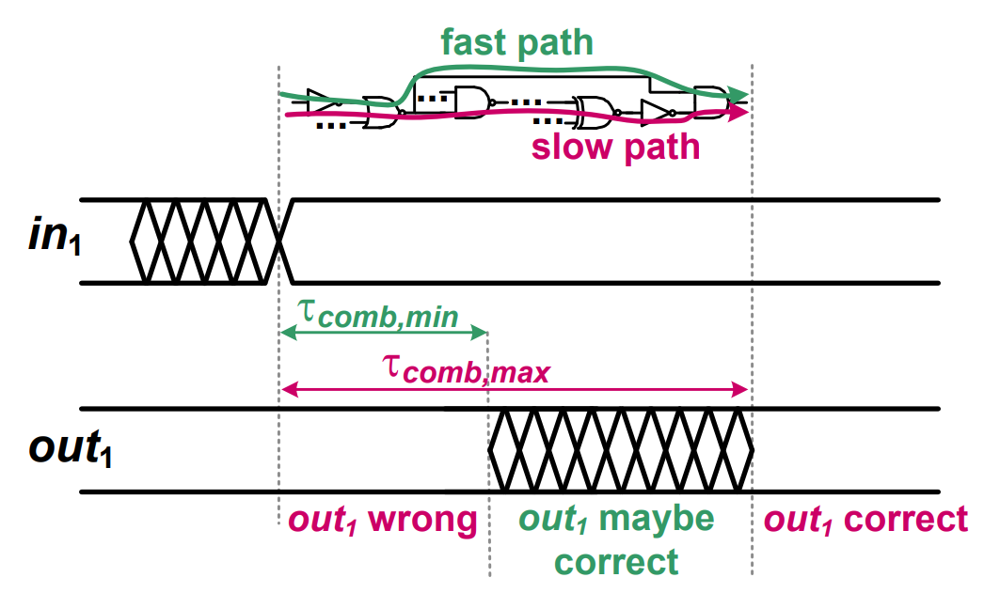<figcaption></figcaption></figure>

In module 1, the <mark style="color:green;">fast path</mark> gives earliest possible correct output ($$\tau_{\text{comb},\text{min}}$$), while the <mark style="color:red;">slow path</mark> gives the latest settling output ($$\tau_{\text{comb},\text{max}}$$). The correct out1 settles between $$\tau_{\text{comb},\text{min}}$$ and $$\tau_{\text{comb},\text{max}}$$. So, to ensure out1 is correct, we wait until after $$\tau_{\text{comb},\text{max}}$$. This again highlights the importance of [**critical path**](https://wenbo-notes.gitbook.io/ddca-notes/textbook/combinational-logic-design/timing#critical-path)!


#### Some Notations

Some notations used in timing diagrams:

1. **Cross-hatched (zig-zag) region**: This means that the signal is **unstable**. So, in1 is stable only after the first dashed line.
2. **Flat solid line:** This means that the signal is **stable**, it can be high or low, but it doesn't matter that much.

These two notations ($$\tau_{\text{comb},\text{min}}$$ and $$\tau_{\text{comb},\text{max}}$$) have appeared in [Harris and Harris's DDCA](https://wenbo-notes.gitbook.io/ddca-notes/textbook/combinational-logic-design/timing#propagation-and-contamination-delay)! Thus we can also say that

1. $$\tau_{\text{comb},\text{min}}$$ is called the **contamination delay**.
2. $$\tau_{\text{comb},\text{max}}$$ is called the **propagation delay**.


#### Synchronous vs. Asynchronous

As shown above, if changes in **out****1** propagate immediately, the second module may observe incorrect or unstable inputs. To prevent this, we introduce two approaches that ensure the second module always receives stable and correct inputs from the first module.



#### Asynchronous

In asynchronous mode, additional circuitry generates "completion signal" and this completion signal enables the computation of next block when its output is valid.

<figure>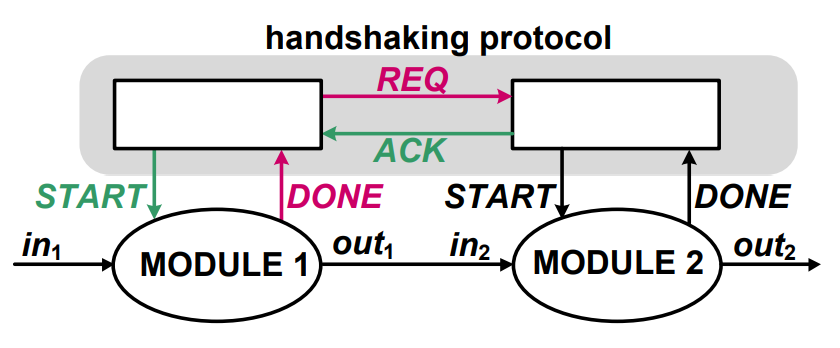<figcaption></figcaption></figure>


This approached is **less favored** by the industry. The reason is **not** because this approach is less-efficient. In fact, the asynchronous approach is **more efficient** then the synchronous approach. The reason is that the automation tools don't support asynchronous systems well, but they support synchronous systems well.




#### Synchronous

In synchronous mode, all input and output signals are synchronized to the clock **clk**. The clock periodically triggers the next computation cycle and provides a global timing reference for all modules in the system.

All I/O signals are only allowed to be _used_ at **clock events**. And all the computation is done during the **clock period**.

* **Clock Event**: At the clock event
  * Registers sample their inputs, and then
  * Registers update their outputs
  * The _next computation cycle begins_


Think of the above steps as: “Everyone stop, look at your inputs, remember them, then start computing again.”


* **Clock Period**: During the clock period
  * Registers hold stable values at their outputs
  * Combinational logic computes new values
  * Results must be ready **before the next clock event**. If not, will cause timing violation!


To understand **sychronize** better, you can go to the [DICADP](../../textbook-1-dicadp/timing-issues-in-digital-circuits/classification-of-digital-systems.md#synchronous-interconnect). Basically, **synchronization** turns "random arrival" into "scheduled arrival" so that the data/input can be sampled directly without any uncertainty. This will create stable input for the following combinational logic to process it during the entire upcoming clock cycle (We have seen this uncertainty from [above](lec-01b-timing-synchronous.md#system-abstraction)).


In the following timing diagram, the first time shift represents the **Setup Time** (tsetup), which is the required window where input signal `x` must be stable before the clock edge to be sampled correctly. The second time shift represents the **Clock-to-Output Delay** (tCK-Q), which is the time it takes for the register to react to the clock edge and update the output signal `y` before it propagates to the subsequent combinational logic.

<figure>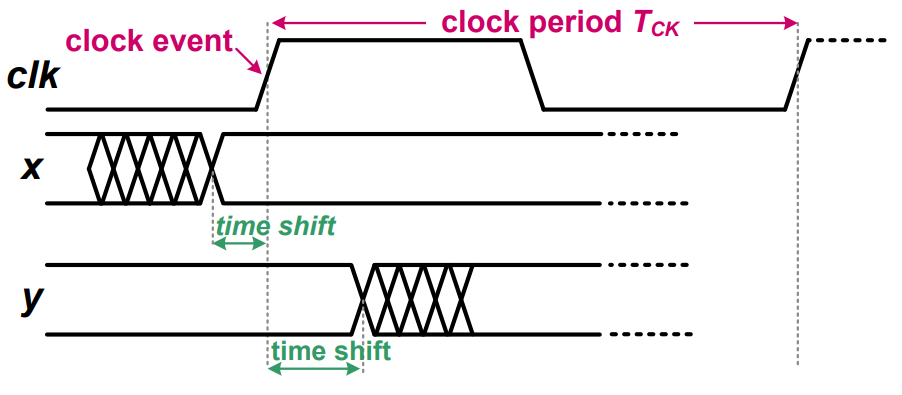<figcaption></figcaption></figure>

And if we draw a register diagram, it will be similar to the following

<figure><picture><source srcset="../../.gitbook/assets/lec01-synchronous-example-dark.png" media="(prefers-color-scheme: dark)">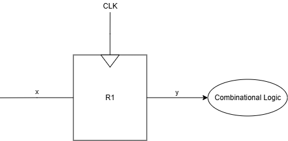</picture><figcaption></figcaption></figure>


In both cases of synchronous and asynchronous design, energy/timing/area overhead is paid for.




### The Clock Discipline

#### Sequencing in Synchronous Systems

In digital logic, the order of data flow is critical. Usually, we want to achieve the **Deterministic Sequencing**. Thus we require a strict First-In, First-Out (FIFO) behavior, where the nth input produces the nth output in the exact same sequence. Ideally, this is easy to achieve if the delay through a module is data independent (e.g., every calculation takes the exact same amount of time).

<figure>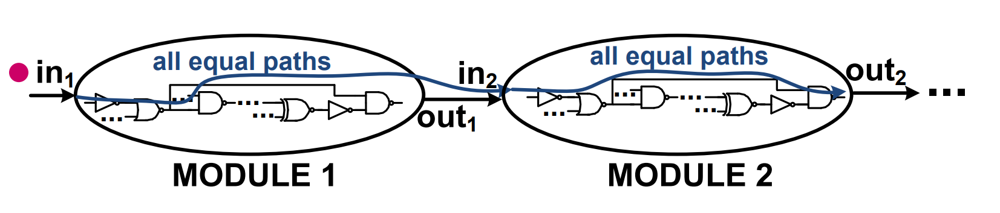<figcaption></figcaption></figure>

However, in reality, the time it takes for a signal to propagate through a combinational block depends on the specific input values. As we have seen [above](lec-01b-timing-synchronous.md#system-abstraction) or in [Harris & Harris DDCA](https://wenbo-notes.gitbook.io/ddca-notes/textbook/combinational-logic-design/timing#propagation-and-contamination-delay):

* Propagation Delay (tpd): The time taken by the _slowest_ path (critical path).
* Contamination Delay (tcd): The time taken by the _fastest_ path (short path).

<figure>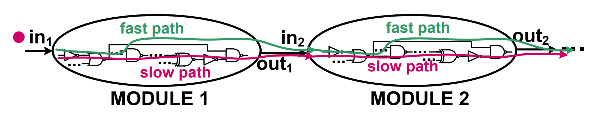<figcaption></figcaption></figure>

If we connect modules directly without synchronization (asynchronous design without handshaking mechanism), "Fast" data can overtake "Slow" data. For example,

1. **Input A (Complex):** We send a Division instruction (Slow Path). It begins processing.
2. **Input B (Simple)**: Immediately after, we send an Add instruction (Fast Path).

Because the Adder logic is much faster (shorter contamination delay) than the Divider logic, the result of the **Add** races through the circuit and appears at the output _before_ the Division is finished. So, the system reads the wrong result order (`Result B` -> `Result A`). This is a **Race Condition**, leading to data corruption and system failure.

To prevent the "race conditions" described previously, we enforce a strict rule:

> Data must move by exactly one stage per clock cycle.

This is also called the **lockedstep movement**.

* This movement is controlled by a global **Clock Event** (usually the rising or falling edge of a signal).
* In a synchronous system, we ignore the transient "noise" or glitches that happen between clock edges.
  * We define the signal's value at the i-th cycle as the _single_ stable value present right[^1] before the sampling edge.
  * Any changes happening _between_ cycle i and i+1 are considered "work in progress" and are ignored until the next clock edge arrives.

<figure>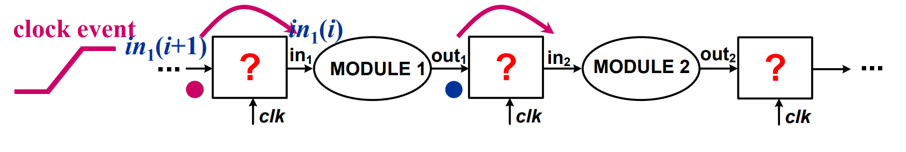<figcaption></figcaption></figure>

In the diagram above, "**in****1****(i)**" denotes a signal using a common notation that will be used throughout this module.

* **"in****1****"** is the signal name, indicating which signal is being referenced, while
* **"(i)"** represents the value of that signal (High or Low) at clock cycle **i**. For example, **in****1****(i+1)** denotes the value of **in****1** in the next clock cycle relative to **in****1****(i)**. So, on the L.H.S of in1(i) are the future inputs while on the R.H.S of in1(i) are the past inputs.

So how do we implement the box labeled “?” so that it holds the output of the first module until the next clock cycle, allowing it to be processed by the second module in the next clock cycle?

The solution is to use flip-flops or latches, which have alreday been introduced in EE2026 and [_Harris & Harris DDCA_](https://wenbo-notes.gitbook.io/ddca-notes/textbook/sequential-logic-design/latches-and-flip-flops)_**.**_

> A D flip-flop **copies D to Q on the rising edge of the clock, and remembers its state at all other times until the next rising edge comes, then it will update its state**.
>
> 
— Harris &#x26; Harris DDCA

For example, by using flip-flops to implement the box labeled “?”, at clock cycle **i**, it holds the value **in****1****(i)** constant for the entire cycle (that is, the flip-flop has already sampled **in****1****(i)** from **D** and is driving it on **Q**). This allows Module 1 to process a stable input. Meanwhile, the next value **in****1****(i+1)** may arrive at the input **D** at any time during cycle **i**, but it is not visible at **Q** and will only be captured and presented at the rising edge of clock cycle **i+1**.


In the industry, latches are **rarely** used because the **timing constraint** for latches is hard to analyze. In this course, we focus on **positive edge-triggered** FFs and we will use registers and FFs interchangeably.


## Clock Network Imperfections

### Distribution Challenges

Ideally, the clock signal is

1. instantaneously distributed to all flip-flops (FFs)
2. periodic

However, as clock is distributed throughout the chip with wires + repeaters:

1. delays in clock distribution network maybe different
2. different **arrival time** ti of clock signal clki (same clcok signal but arrives at different FFs at different time)

Repeater and Interconnect Wire

<figure>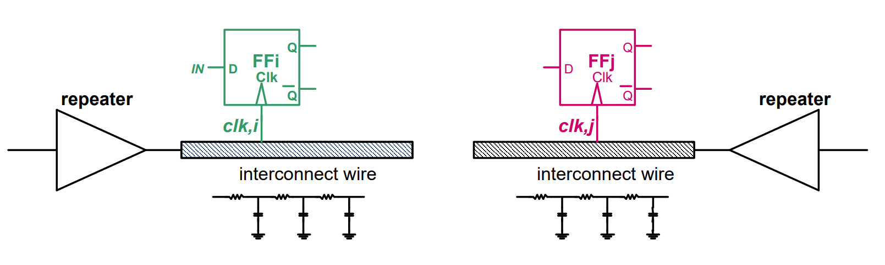<figcaption></figcaption></figure>

First, let's look at the symbols in the diagram above,

* **The Repeater (Triangle)**: This is a buffer or amplifier. Clock signals have to travel long distances across a chip. Repeaters are placed at intervals to "boost" the signal back up so it stays strong.
* **The Interconnect Wire (The shaded bar)**: This is the physical metal wire connecting the clock source to the Flip-Flops (FFi and FFj).
* **The "Squiggly" and "Parallel lines" below the wire**: This is an electrical circuit model (**RC Model**) of the wire.
  * Real wires are not perfect conductors. They have **Resistance**. And real wires interact with the ground/substrate. They have **Capacitance**.
  * **The Result**: To get the voltage from the Repeater to the Flip-Flop, the current has to "fill up" those capacitors through those resistors. This takes physical time (called RC Delay).

The wire leading to FFi might be slightly longer, or have slightly different resistance/capacitance than the wire leading to FFj. Therefore, it takes a different amount of time for the clock signal to charge up the wire and trigger FFi compared to FFj.


In digital circuits, all information — including the clock signal — travels in the form of **Voltage**.


### Clock Skew

We define the DC time shift of clki w.r.t. clkj, which is also the clock skew seen by FFi w.r.t. FFj, to be

$$
t_{\text{skew, ij}}=t_i-t_j
$$


In synchronous circuit design, while we originate from a **single global clock source** (CLK),

* clki refers to the local clock signal branch connected to FFi.&#x20;
* The variable ti denotes the specific time instant when the clock edge actually arrives at FFi.


When distributing clk in the **same direction** as data flow, the skew tskew, ij is positive. If **opposite direction**, the skew is **negative**. For example, the following diagram shows a **positive clock skew** by assuming that the data and clock distribution flows from register R1 to register R2.

<figure>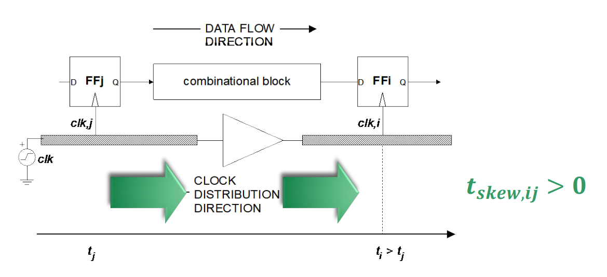<figcaption></figcaption></figure>


An analogy is to think of the clock skew as a **vector** and the two points are ti and tj. Thus,

t_{\text{skew, ij}}=t_i-t_j=-t_{\text{skew, ji}}



Another example will be the timing diagram we have seen in [Harris & Harris DDCA](https://app.gitbook.com/s/jTJFBPtKk6NwweAooH53/textbook/sequential-logic-design/timing-of-sequential-logic#clock-skew). The following diagram will indicate a **negative skew** seen by R1 (t1 - t2 < 0, assuming the data flows from R1 to R2).

<figure>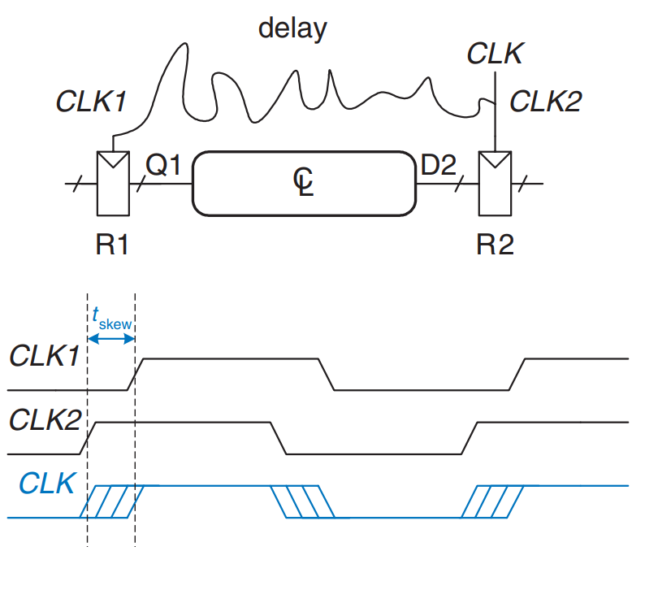<figcaption></figcaption></figure>


The clock skew is relative. But we usually calculate the clock skew **following the direction of the data path**.

* If data flows from register 1 to register 2, we calculate skew as t2- t1. During the calculation, treat t2 and t1 as two **algebric values** and the result will be either negative or positive!
* **Seen by** which register, use that register as the first term. For example, the clock skew seen by register R1 w.r.t. R2 is t1-t2.


#### Clock Skew Calculation

The clock skew can randomly vary due to delay variations, but it can be calculated using the following formula (in EE4415),

$$
t_{\text{skew}} = t_{\text{skew,DET}} \pm \left| t_{\text{skew,RAND}} \right|
$$

From this formula, we can see that the clock skew has two components

1. **Deterministic skew**: Predictable delay caused by the fixed physical layout of wires and repeaters. Since its sign and magnitude are known, it can be intentionally engineered to optimize timing paths (useful skew). This value can be either **positive** or **negative**.
2. **Random skew**: Unpredictable variation arising from manufacturing mismatches or environmental factors like temperature. It creates a bounded uncertainty range ($$\pm$$) with an unknown sign that designers must account for as noise.

### Clock Jitter

In reality, the clock period TCK is not perfectly constant due to jitter. Specifically, we define **cycle-to-cycle jitter** (tjitter) as the random, time-varying deviation between two successive clock events (such as two rising clock edges). This means the actual clock period is not fixed; instead, it fluctuates around a nominal period (Tnom), strictly bounded within the range of $$T_{\text{nom}} - |t_{\text{jitter}}|$$ to $$T_{\text{nom}} + |t_{\text{jitter}}|$$.

<figure>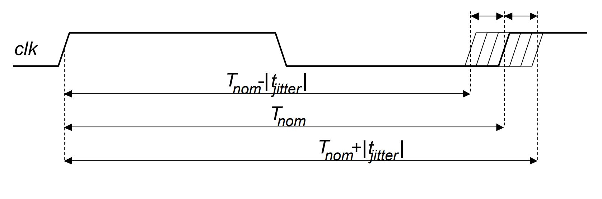<figcaption></figcaption></figure>

#### The Reason of Clock Jitter

The two main reasons for clock jitter are:

1. **clock generator**'s intrinsic jitter
2. **clock distribution network**: due to time-varying delay of repeaters (supply noise)

<figure>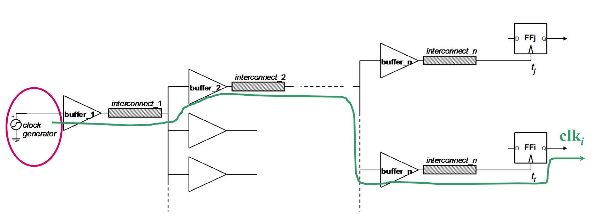<figcaption>
Clock Distribution Network
</figcaption></figure>

Based on the above diagram, we have the formula for calculating the tjitter,i to be

$$
t_{\text{jitter},i} = t_{\text{jitter,clock\_gen}} + \sum_{j=1}^{n} \left| \Delta \tau_{\text{PD,buffer},j} \right|\tag{5}
$$

Clock Jitter Difference

In a clock distribution network, the clock paths to two registers (FFi and FFj) share a **common path** and then split into **separate local branches**.


As we have seen in Eq.5, jitter is introduced by buffers, wires, and supply noise along these paths.


In EE4415, we assume that the **common path dominates**. This means that most of the jitter is added **before the clock splits**, so both FFi and FFj see **almost the same clock shift** in the same given clock cycle. In the waveform below, this is represented by the jitter occurring at the **green circle** for both clocks.

<figure>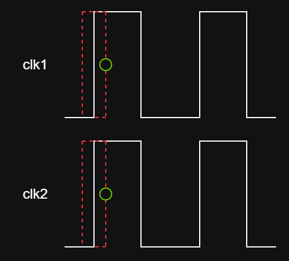<figcaption></figcaption></figure>


In different clock cycles, the jitter can shift in either direction and does not have to be the same as in the previous cycle.


In reality (but not considered in EE4415), the local branches also add jitter because they have different buffers and power supply noise. This causes **small differences** between clk1 and clk2, so jitter does not occur at exactly the same instant on both clocks and it can happen that jitter will appear at **differnet** direction.

## Timing Analysis

### Flip-Flop Timing Characteristics

> This section has a lot of similarities with the [Timing of Sequential circuits](https://app.gitbook.com/o/MnEKr5A4lYXtOfhoXGj5/s/jTJFBPtKk6NwweAooH53/) in Harris & Harris DDCA!

In positive-edge triggered (PET) flip flops, input is **sampled** at rising clock edge. And the **timing parameters** for D Flip Flops are:

1. input (usually the old input, will see why it's "old" in [DICADP](../../textbook-1-dicadp/timing-issues-in-digital-circuits/synchronous-design-an-in-depth-perspective.md#synchronous-timing-basic)) must be kept stable from **t****SETUP****&#x20;before** the active edge to **t****HOLD****&#x20;after** this edge. Otherwise, we will have **metastability**.
2. CK-Q delay: output is updated at tCK-Q after clock edge.

<figure>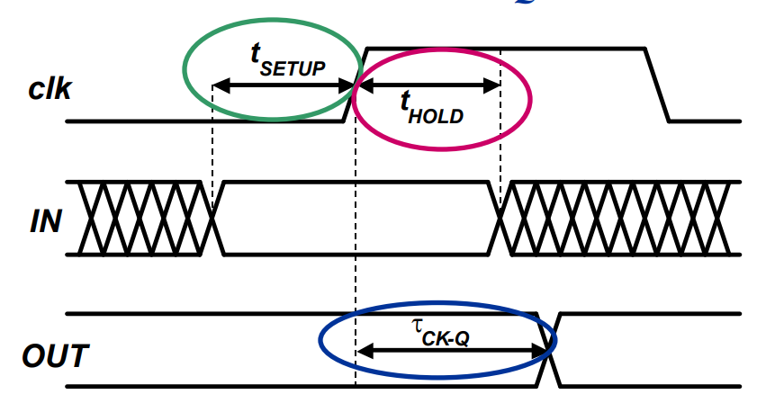<figcaption></figcaption></figure>

#### Asynchronous Resettable Filp Flops

> This section is partly discussed in the [resettable flip flops](https://app.gitbook.com/s/jTJFBPtKk6NwweAooH53/textbook/sequential-logic-design/latches-and-flip-flops#resettable-flip-flop) in Harris & Harris DDCA!

In asynchronous resettable flip flops, the RESET signal has **higher** priority than the CLK signal. So sometimes the RESET can be used to "mask" (hide or block) the CLK signal causing the fact that the Flip-Flop didn't "see" the clock rise because the RESET was blinding it. Simiarly, its timing parameters are:

1. For normal clock event, reset must be kept stable from **t****RECOVERY****&#x20;before** clock edge to **t****REMOVAL****&#x20;after** this edge.

For example, the following diagram shows an active-low asynchronous reset

<figure>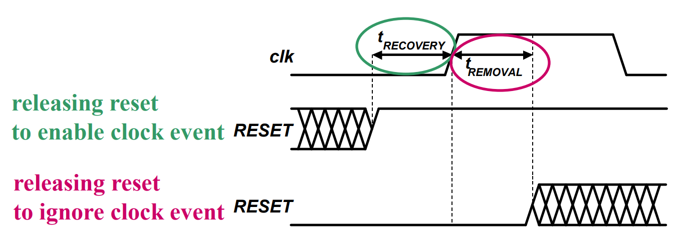<figcaption></figcaption></figure>

* If we want to enable the clock event, release the RESET button at least tRECOVERY before the rising clock edge.
* If we want to ignore the clock event, press and hold (small typo in the figure above) the RESET and don't release until tREMOVAL after the rising clock edge.


Even if this is an active-low asynchronous resettable FF, pressing the RESET button will reset the FF, meaning that pressing the RESET button is equivalent to set RESET signal to be 0.


### System Timing Constraints

#### Timing Constraints in Synchronous Circuits

> Again, this part is almost the same as [Timing of Sequential Circuits](https://app.gitbook.com/s/jTJFBPtKk6NwweAooH53/textbook/sequential-logic-design/timing-of-sequential-logic) covered in Harris & Harris DDCA. But with some more info added on the **timing overhead** caused by clock skew and clock jitter.

The FF timing constraints imply the system timing constraints. The FF timing constraints have

* Setup Time Constraint
* Hold Time Constraint

While the system timing constraint is more about the global CLK signal speed. So, what [the first sentence](#user-content-fn-2)[^2] says is that the FF timing constraint will affect the speed of the system clock, which is an indispensible part of the system timing constraint. So, when designing a system, we should prevent setup/hold violations.

System timing constraints are affected by

* FF time constraints
* combinational logic timing parameters
* clock non-idealities (skew and jitter)

To start, let's first see an intuitive understanding of FF timing constraints.

<figure>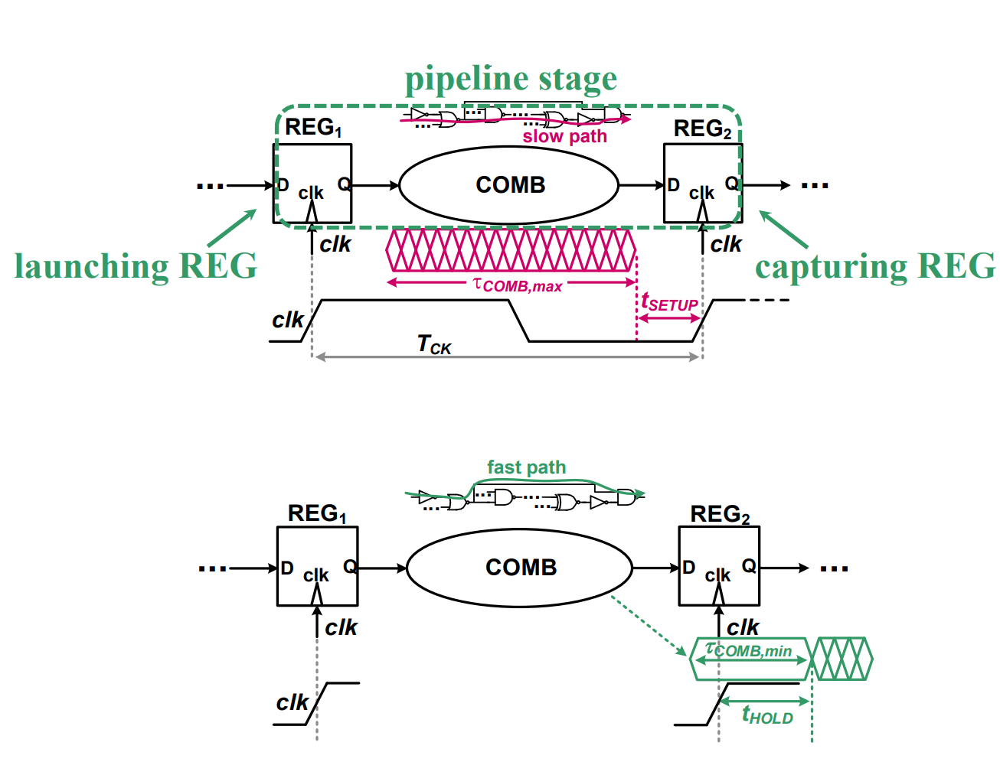<figcaption></figcaption></figure>

* To meet the setup time constraint, we can think of it as "the computation should be completed before next edge in REG2" -> This gives us the **max-delay constraint** for the combinational logic
* To meet the hold time constraint, we can think of it as "the computation must affect REG2 only after a certain time" -> This gives us the **min-delay constraint** for the combinational logic


In this part, as TCK is fixed in the specification, tsetup and tck-q are constant, we focus on tcomb!


#### Terminology Mapping

As the following parts are mostly covered in [DICADP](../../textbook-1-dicadp/timing-issues-in-digital-circuits/#synchronous-design-an-in-depth-perspective), here is the table summarizing the difference between some terminologies used:

| DICADP (Textbook1)      | EE4415                                                           | Description                                                                                                                                             |
| ----------------------- | ---------------------------------------------------------------- | ------------------------------------------------------------------------------------------------------------------------------------------------------- |
| $$T_{CLK}$$ or $$T$$    | $$T_{CK}$$                                                       | Nominal clock period                                                                                                                                    |
| $$t_{logic}$$           | $$\tau_{\text{COMB,max}}$$                                       | Maximum propagation delay through combinational logic                                                                                                   |
| $$t_{logic,cd}$$        | $$\tau_{\text{COMB,min}}$$                                       | Minimum contamination delay through combinational logic                                                                                                 |
| $$t_{c-q}$$             | $$\tau_{\text{CK-Q},\text{REG1}}$$                               | Register clock-to-Q propagation delay                                                                                                                   |
| $$t_{c-q, cd}$$         | $$\tau_{\text{CK-Q},\text{REG1}}$$                               | Register clock-to-Q contamination delay (Prof. Massimo says that for registers, the contamination delay and the propagation delay are almost the same.) |
| $$t_{su}$$              | $$t_{\text{SETUP},\text{REG2}}$$                                 | Setup time of the destination register                                                                                                                  |
| $$t_{hold}$$            | $$t_{\text{HOLD},\text{REG2}}$$                                  | Hold time of the destination register                                                                                                                   |
| $$\delta$$ (Clock Skew) | $$t_{\text{skew,DET}} \pm \left|t_{\text{skew,RAND,21}}\right|$$ | Clock skew (deterministic ± random in EE4415 but only deterministic in DICADP)                                                                          |
| $$t_{\text{jitter}}$$   | $$t_{\text{jitter}}$$                                            | Clock jitter                                                                                                                                            |
| /                       | $$\tau_{\text{comb}}$$                                           | Timing of the combinational logic between registers                                                                                                     |
| /                       | $$\tau_{\text{comb,max/min}}$$                                   | Maximum and minimum allowed combinational delay                                                                                                         |


In EE4415, the definition of clock jitter is a bit different from DICADP. So, we must follow EE4415's logic: **Jitter cancels out for Hold Time** because it is a "common mode" noise source in the same clock domain. However, in EE4415 we introduces Random Skew ($$|t_{skew,RAND}|$$) to account for the variation that _does_ differ between the two registers (like thermal noise in the wires), which the DICADP textbook might have just lumped into "jitter." This is further discussed in [#clock-jitter-difference](lec-01b-timing-synchronous.md#clock-jitter-difference "mention").


#### Max-Delay Constraint



In the textbook, if we take both clock skew and clock jitter into account, the formula we get is

$$
T_{\text{CLK}} + \delta - t_{\text{jitter}1} - t_{\text{jitter}2} \geq t_{\text{c-q}} + t_{\text{logic}} + t_{\text{su}} 
\\ \text{or} \\ T \geq t_{\text{c-q}} + t_{\text{logic}} + t_{\text{su}} - \delta + t_{\text{jitter}1} + t_{\text{jitter}2} \tag{1}
$$


The tjitter1 and tjitter2 can be treated as the same.




Use the table above to map the formula into EE4415, we will get

$$
T_{\text{CK}} \ge \tau_{\text{COMB,pd}} + t_{\text{SETUP, REG2}} + \tau_{\text{CK-Q, REG1}} - t_{\text{skew,DET}} + |t_{\text{skew,RAND,21}}| + 2|t_{\text{jitter}}| \\ 
\text{or} \\ 
\tau_{\text{COMB,pd}} \le T_{\text{CK}} - t_{\text{SETUP, REG2}} - \tau_{\text{CK-Q, REG1}} + t_{\text{skew,DET}} - |t_{\text{skew,RAND,21}}| - 2|t_{\text{jitter}}| \tag{2}
$$

<figure>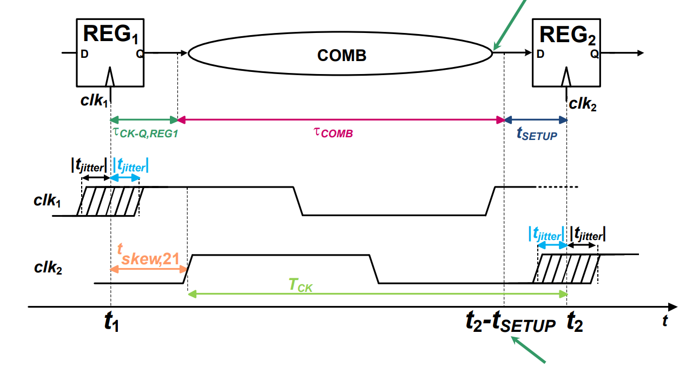<figcaption></figcaption></figure>


As the spirit is to make R.H.S as big as possible (worst-case scenario), we will map the clock skew $$\delta$$ to $$t_{\text{skew,DET}} - |t_{\text{skew,RAND}}|$$.


To simplify it, we group some terms and get the following

$$
\tau_{COMB,pd} \le T_{CK} - t_{OH} \\ \text{where} \\ t_{\text{OH}}= t_{\text{SETUP, REG2}} + \tau_{\text{CK-Q, REG1}} - t_{\text{skew,DET,21}} + |t_{\text{skew,RAND,21}}| + 2|t_{\text{jitter}}|
$$


The R.H.S (TCK-tOH) is denoted as $$\tau_{\text{COMB,max}}$$.


Within the tOH, we can further do the following grouping

$$
t_{OH}=t_{\text{OH, REG}}+t_{\text{OH, clocking}} \\ \text{where}\\t_{\text{OH,REG}} = t_{\text{SETUP,REG2}} + \tau_{\text{CK-Q,REG1}},\\t_{\text{OH,clocking}} = \left| t_{\text{skew,RAND,21}} \right|
- t_{\text{skew,DET,21}} + 2 \left| t_{\text{jitter}} \right|
$$

From this grouping, we can see that

* Register overhead tOH, REG always **reduces** available time for computation. Same for random skew and jitter.
* But deterministic skew can **increase** the available time for computation.



#### Min-Delay Constraint



Similarly, for the hold time constraint / min-delay constraint, the formula we get is,

$$
\delta + t_{\text{hold}} + t_{\text{jitter}1} + t_{\text{jitter}2} < t_{(\text{c-q, cd})} + t_{(\text{logic, cd})} \\
\text{or} \\
\delta < t_{(\text{c-q, cd})} + t_{(\text{logic, cd})} - t_{\text{hold}} - t_{\text{jitter}1} - t_{\text{jitter}2} \tag{3}
$$



To map the formula into EE4415, we will get,

$$
\tau_{\text{COMB,cd}} + \tau_{\text{CK-Q, REG1}} \ge t_{\text{HOLD,REG2,eq}} \\ \text{where} \\ t_{\text{HOLD,REG2,eq}} = t_{\text{HOLD, REG2}} + t_{\text{skew,DET,21}} + |t_{\text{skew,RAND,21}}| \tag{4}
$$


Ideally, we want a register to have **low** hold time (thold). So, to map this to the Eq. 3, the worst-case scenario is when tHOLD, REG2, eq is **biggest**, thus we replace $$\delta$$ with $$t_{\text{skew,DET,21}} + |t_{\text{skew,RAND,21}}|$$.


<figure>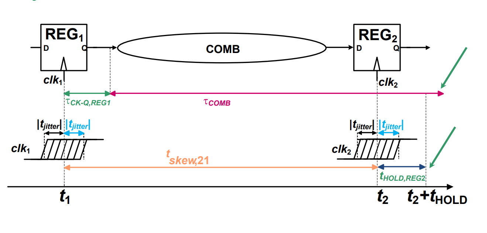<figcaption></figcaption></figure>

Rearrange it, we will get,

$$
\tau_{\text{COMB,cd}} \ge t_{\text{HOLD,REG2,eq}} - \tau_{\text{CK-Q,REG1}}
$$


Again, the R.H.S is denoted as $$\tau_{\text{COMB,min}}$$. And we define the difference between the contamination delay of the combinational logic $$\tau_{\text{COMB,cd}}$$ and $$\tau_{\text{COMB,MIN}}$$ as the **robustness margin against hold violations**. ( $$\text{margin}=\tau_{\text{COMB,cd}}-\tau_{\text{COMB,min}}$$)


So, we know for sure that

* larger $$t_{\text{HOLD,REG2,eq}}$$ will make $$\tau_{\text{COMB,min}}$$ larger, thus **decreasing** the robust margin **against** hold violations.
* Random skew always **decreases** the robustness as well.
* **Negative** deterministic skew can **improve** the robustness.



### Intentional Skew

As we have seen in DICADP, positive skew will improve **performance** but decrease hold robustness while negative skew will decrease **performance** but improve hold robustness.


The rule above always holds!


As positive skew can improve performance, but it might violate the hold time constraint of R2. So, we will find the **maximum positive skew** we can have for a **designed combinational logic** (meaning that $$\tau_{\text{COMB,cd}}$$ and $$\tau_{\text{COMB,pd}}$$ are fixed). From the Eq. (2) in [#min-delay-constraint](lec-01b-timing-synchronous.md#min-delay-constraint "mention"), we can derive the maximum positive skew as follows,

$$
t_{\text{skew,DET,max}}
=
\tau_{\text{COMB,cd}}
+
\tau_{\text{CK-Q,REG1}}
-
t_{\text{HOLD,REG2}}
-
\left| t_{\text{skew,RAND,21}} \right|
$$

Substitue the maximum skew into the Eq. (4) in [#max-delay-constraint](lec-01b-timing-synchronous.md#max-delay-constraint "mention"), the resulting clock cycle TCK will be,

$$
T_{\text{CK}}
=
\left(
\tau_{\text{COMB,pd}}
-
\tau_{\text{COMB,cd}}
\right)
+
\left(
t_{\text{SETUP,REG2}}
+
t_{\text{HOLD,REG2}}
\right)
+
2\left(
\left| t_{\text{skew,RAND,21}} \right|
+
\left| t_{\text{jitter}} \right|
\right)
$$


We can apply two worst case scenario analysis here to get the maximum tskew, DET and TCK. So, it's not necessary to change the $$\tau_{\text{COMB}}$$ to $$\tau_{\text{COMB,cd}}$$ in the **min-delay constraint** and $$\tau_{\text{COMB,pd}}$$ in the **max-delay constraint**.


The following compares the minimum clock period (TCK) we can achieve in two different design scenarios, which is either to use skew or not use it at all

| TCK=                  | zero (intentional skew)                                                        | max (intentional skew)                                                                      |
| --------------------- | ------------------------------------------------------------------------------ | ------------------------------------------------------------------------------------------- |
| **combinational +**   | $$\tau_{\text{COMB,pd}}$$                                                      | $$\tau_{\text{COMB,pd}} - \tau_{\text{COMB,cd}}$$                                           |
| **FF overhead +**     | $$t_{\text{SETUP,REG2}} + \tau_{\text{CK-Q,REG1}}$$                            | $$t_{\text{SETUP,REG2}} + t_{\text{HOLD,REG2}}$$                                            |
| **clocking overhead** | $$\left| t_{\text{skew,RAND,21}} \right| + 2\left| t_{\text{jitter}} \right|$$ | $$2\left(\left| t_{\text{skew,RAND,21}} \right| + \left| t_{\text{jitter}} \right|\right)$$ |

From the table, we can see that if we intentionally design to use a **positive skew** to improve **performance:**

* the impact of combinational delay drastically reduced
* FF overhead increased a bit
* doubled impact of random clock skew


In the "zero" column, $$t_{\text{skew,DET}} = 0$$. In the "max" column, $$t_{\text{skew,DET}} = t_{\text{skew,DET,max}}$$. The sum of the "max" column is **always smaller** than the sum of the "zero" column.


Sequencing vs. Timing Constraint

As we have talked about [#sequencing-in-synchronous-systems](lec-01b-timing-synchronous.md#sequencing-in-synchronous-systems "mention") before, now we may find an interesting interpretion that

> timing constraints <-> conditions for correct sequencing

| Sequencing                        | Meaning                                                    | Timing Constraint                                                                     |
| --------------------------------- | ---------------------------------------------------------- | ------------------------------------------------------------------------------------- |
| data moves by **one**             | COMB must complete computation within one cycle            | [#max-delay-constraint](lec-01b-timing-synchronous.md#max-delay-constraint "mention") |
| and **only one** stage each cycle | input of REG 1 does not affect output of REG2 at one event | [#min-delay-constraint](lec-01b-timing-synchronous.md#min-delay-constraint "mention") |

#### Add skew to clock

In a clock distribution network, we can intentionally add **clock skew** between [**two**](#user-content-fn-3)[^3] registers to improve timing.


The skew can be **positive** or **negative**, depending on whether we want to relax setup or hold constraints.


In a real chip, there are many register pairs, and different parts of the clock tree can be tuned to introduce **different skews** in different regions. This is done by **adjusting the delay of clock buffers or repeaters**, for example by:

* Using buffers of different sizes
* Inserting extra delay cells
* Adjusting the loading or wire length
* In some designs, slightly tuning the buffer supply or body bias

By increasing or decreasing the delay of a branch of the clock tree, the clock edge is shifted in time, which creates the desired **intentional skew** between registers.

## Performance Metrics

In Synchronous VLSI systems, **performance** is an application-dependent term.

### Throughput

**Throughput** is defined as the number of computations completed per unit of time.

$$
\text{Throughput} = \frac{\text{Number of Computations}}{\text{Time (seconds)}}
$$

Depending on the application, throughput is measured differently:

* **Generic Digital Logic**: Operations/sec (MOPS - Million Operations Per Second).
* **Microprocessors** ($$\mu$$P): Instructions/sec (MIPS, BIPS).
* **Arithmetic-Intensive (GPU)**: Floating-point ops/sec (FLOPS).
* **Signal Processing (DSP)**: Samples/sec (kSPS).


**Throughput** is the primary metric for continuous processing tasks like video streaming, DSP, or servers.&#x20;


#### Single Block Throughput Model

When analyzing a specific hardware block (e.g., an accelerator), we assume:

* **Conservation**: Data is not randomly created or lost; every input word generates a specific number of output words.
* **Ideal Flow**: Inputs are applied "just in time" (no stalling).
* **Functionality Factor** ($$X$$): Each input value generates $$X$$ sequential output values.

This leads to the relationship between Input Data Rate ($$\text{DR}_{\text{in}}$$) and Output Data Rate ($$\text{DR}_{\text{out}}$$):

$$
\text{DR}_{\text{out}} = X \cdot \text{DR}_{\text{in}}
$$

Where $$X$$ is the **Data Rate Gain** set by the function of the block

$$
X = \frac{\text{DR}_{\text{out}}}{\text{DR}_{\text{in}}} = \frac{\# \text{words}_{\text{out}}}{\# \text{words}_{\text{in}}}
$$

Example of Data Rate Gain

The value of $$X$$ tells us if the block is **compressing or expanding** data.

| Case                | Application Example      | Input                               | Output                            | Ratio (X) |
| ------------------- | ------------------------ | ----------------------------------- | --------------------------------- | --------- |
| Compression (X < 1) | 4K Video Compression     | 3840 × 2160 pixels (high bandwidth) | Compressed stream (3:1 reduction) | 1/3       |
| Reduction (X < 1)   | AlexNet (Neural Network) | 224 × 224 pixels (image)            | 1,000 classes (classification)    | 1/50      |
| Transform (X = 1)   | 1024-point FFT           | 1,024 audio samples                 | 1,024 frequency points            | 1         |
| Expansion (X > 1)   | 12-filter FIR Bank       | 6 samples                           | 12 filtered outputs per sample    | 12        |

#### Cascaded Blcoks & The Bottleneck

Real systems consist of multiple blocks chained together. To find the maximum performance of the entire chain, we must find the "bottleneck" (the **slowest block**).

However, the data rate may expand or compress at each stage, so we cannot directly compare the raw speeds of Block 1 and Block 2. Instead, we must normalize all blocks to a common metric: the **output-referred data rate**. That is, for each block, we ask:

> if this block operates at its maximum speed, what data rate would that correspond to at the final output of the chain?



#### Single Block Limit

The output of a single block is limited by either the **incoming data** or its own maximum internal speed ($$\max\text{DR}_{\text{out}}$$):

$$
\text{DR}_{\text{out}} = \min(X \cdot \text{DR}_{\text{in}}, \max\text{DR}_{\text{out}})
$$


This is true because if a block’s input data rate is low, its output data rate cannot reach the maximum.




#### Chain Limit (The Bottleneck Formula)

For a chain of blocks ($$1 \to 2 \to \dots \to N$$), the maximum system throughput is the [**minimum**](#user-content-fn-4)[^4] of all blocks' capacities[^5], **scaled to the output**:

$$
\max \text{DR}_{\text{out}} = \min \left( \underbrace{X_2 \cdot \dots \cdot X_N \cdot maxDR_{out,1}}_{\text{Block 1 limit reflected at output}}, \ \dots \ , \underbrace{\max\text{DR}_{\text{out,N}}}_{\text{Block N limit}} \right)
$$

1. **For the First Block 1**:
   1. Take its raw max speed ($$\max\text{DR}_{\text{out,1}}$$).
   2. Multiply it by the gain of Block 2 ($$X_2$$), then Block 3 ($$X_3$$), all the way to Block N.
   3. This result tells us: _"If Block 1 runs at 100%, how much final output is produced?"_
2. **For the Last Block N**: Its limit is just its own max speed ($$\max\text{DR}_{\text{out,N}}$$).



In a perfect design, no block should be faster than necessary. If Block 2 is 10x faster than the system bottleneck, it is "wasted" potential (and wasted silicon area/power). So



#### The Goal

Every term inside the min() function should be equal.



#### The Math

Ideally, the max speed of any specific block i ($$\max\text{DR}_{\text{out,i}}$$) should be exactly:

$$
\max\text{DR}_{\text{out,i}} = \frac{\text{Target System Throughput}}{\prod_{j=i+1}^{N} X_j}
$$

This basically means that a block's designed speed should equal the target final speed divided by all the gains that come after it.




#### Practical Bottlenecks

In real-world chips (like the Roofline Model), the bottleneck usually shifts between three areas:

* **Compute-Bound**: The arithmetic logic (ALU) is too slow.
* **Memory-Bound**: We cannot read/write data to RAM fast enough.
* **Communication-Bound**: We cannot move data between cores fast enough.


### Latency

> While throughput measures the "volume" of work (how many?), **Latency** measures the "speed" of a **single task** (how fast?).

**Latency** is the time/clock cycles required to complete a **single** computation from the moment inputs arrive until the final output is valid.

<figure>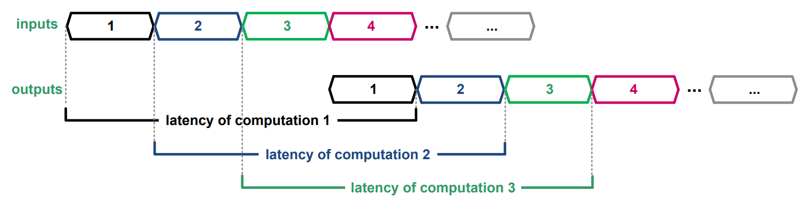<figcaption></figcaption></figure>

Latency is measured as:

* **Absolute Time**: Nanoseconds (ns), milliseconds (ms), or
* **Clock Cycles**: How many "ticks" it takes.

It is critical for real-time systems where a delay is unacceptable, such as autonomous vehicles braking or network packet switching.


Latency is the similar to the CPI (Clock cycles Per Instruction) we have learned in CG3207!


In Lec 02, when performing PPA analysis, we will encounter latency analysis again. Since latency can be expressed in two forms — clock cycles and absolute time — there are two corresponding methods to analyze it:

1. For latency measured in clock cycles, we simply count how many registers have been added, since each register introduces an additional pipeline stage and increases the latency by one clock cycle.
2. For latency measured in absolute time, we need to use mathematical formulas to derive the relationship between the number of registers added and the resulting change in latency. This analysis takes into account both the clock period and the number of pipeline stages to determine the overall time delay.

#### Throughput vs. Latency Relationship

There is a common misconception that throughput is just the inverse of latency ($$1/\text{Latency}$$). This is only true in the specific case.



#### Case A: No Overlap (Serial Execution)

If the system can only accept a new request _after_ the previous one is completely finished, then:

$$
\text{Throughput} = \frac{1}{\text{Latency}}
$$


Here, we use **absolute time** to measure **latency**. If **clock cycles** are used to measure the latency, then we should replace "latency" with "latency x cycle-time". Same for below.




#### Case B: Execution Overlap (Pipelining/Parallelism)

In most modern VLSI systems, we use **pipelining** (as we did in NUS CG3207!). We accept new inputs while the previous ones are still being processed in later stages.

$$
\text{Throughput} \gg \frac{1}{\text{Latency}}
$$


According to [De Micheli](https://wenbo-notes.gitbook.io/ee4218-hsd-notes/textbook-micheli/introduction/computer-aided-synthesis-and-optimization#throughput), the **maximum** throughput of a pipelined system is $$\frac{1}{\text{cycle-time}}$$, which holds under the assumption of a single-issue pipeline (CPI <i class="fa-greater-than-equal">:greater-than-equal:</i> 1). In some microarchitectures such as superscalar processors, where the effective CPI can be less than 1, the maximum throughput may be higher.




#### Calculating System Latency

Unlike throughput (which is limited by the _slowest_ block), latency is additive. We must sum up the time spent in every block along the path.



#### Block-Level Latency ($$\text{LAT}_i$$)

This is the time taken by a single block to finish its job.

**The Worst-Case Rule**: If the latency is **data-dependent** (e.g., a multiplier takes longer for large numbers than small ones), we must use the Upper Bound ($$\max(\text{LAT}_i)$$) to guarantee timing correctness.



#### System-Level Latency Formula

For a system with N blocks, the total latency is not just the simple sum. We must account for **loops** or repeated execution of specific blocks.

<figure>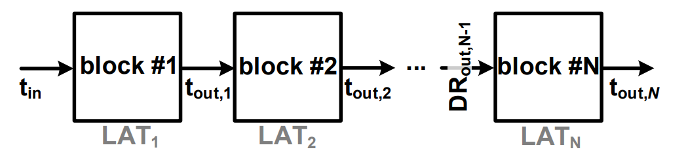<figcaption></figcaption></figure>

$$
\text{Total Latency} \le \sum_{i=1}^{N} (\text{\#execution}_i \cdot \max(\text{LAT}_i))
$$

* $$\text{\#execution}_i$$: The number of times Block i is executed to complete _one_ full system computation.
* $$\max(\text{LAT}_i)$$: The worst-case latency of Block i.



### Case Study: AlexNet CNN


Based on my seniors saying, this part won't appear in midterms or finals. It's just a FYI thing. Will see if this still holds in AY25/26 Sem2's EE4415 🤣.


To understand how throughput and latency principles apply to real-world hardware, we analyze the **AlexNet Convolutional Neural Network (CNN)**. This example demonstrates how data expansion/compression ($$X$$) and computational intensity vary dramatically across different stages of a system.

#### Architecture Overview

AlexNet is a classic CNN used for image classification (mapping a raw image to 1 of 1,000 classes). It consists of a pipeline of layers with distinct functions:

* **CONV (Convolutional Layers)**: The "Trainable" feature extractors. They use kernels ($$k \times k$$) to filter input images.
  * **Dominant Operation**: Multiply-Accumulate (MAC).
  * **Data Flow**: Input Frame ($$227 \times 227$$ RGB) -> Convolved Features.
* **ReLU (Rectified Linear Unit)**: Non-linear activation function ($$\text{output} = \max(0, \text{input})$$). Simple and fast.
* **POOL (Max Pooling)**: Down-sampling layer. Reduces data size by taking the maximum value in a patch.
* **FC (Fully Connected Layers)**: The final classification stage. Every input neuron connects to every output neuron (matrix-vector multiplication).

<figure>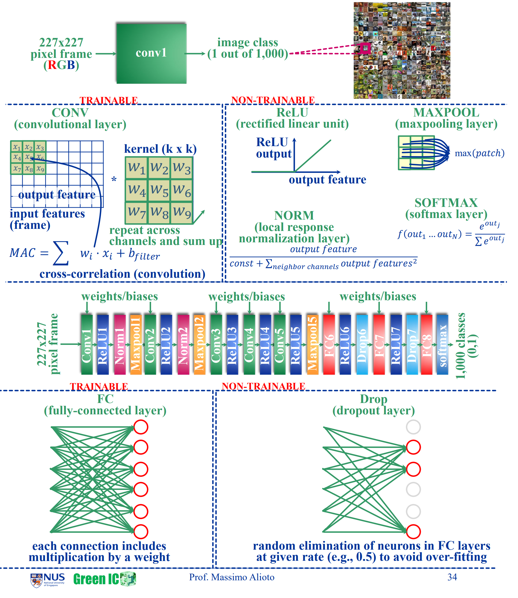<figcaption></figcaption></figure>

#### Throughput Analysis: "The Bottleneck Shift"



#### Data Volume vs. Operations

&#x20;($$\text{words}_{\text{out}}$$): The number of data words _decreases_ as we move deeper into the network.

* _Early Layers (Conv1-Conv2):_ High data volume (hundreds of thousands of words) due to large spatial maps.
* _Later Layers (FC6-FC8):_ Low data volume (thousands of words).

**Computational Load (MACs)**: The number of operations is massive in the middle layers.

* _Conv2:_ Requires 224 Million MACs (Peak Compute Load).
* _FC8:_ Requires only 4.1 Million MACs.

<figure>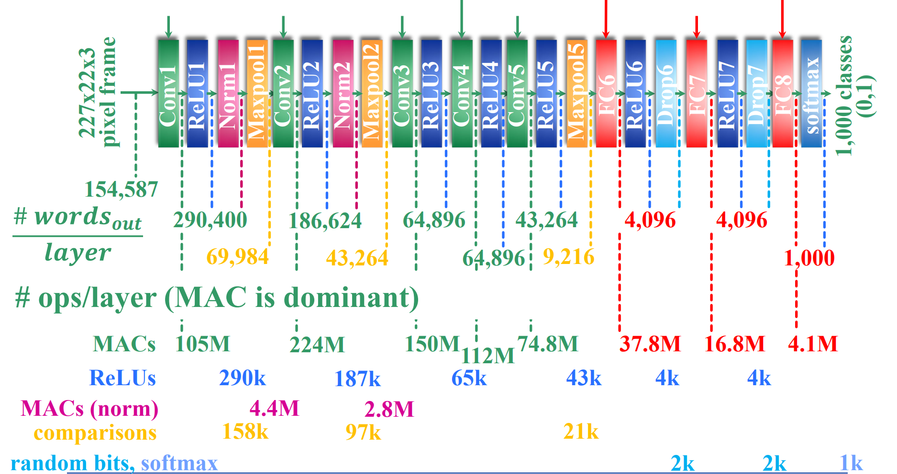<figcaption></figcaption></figure>



#### Target Throughput Calculation

To sustain a real-time performance of 30 frames per second (fps), each layer must meet a specific throughput target. This target depends on the layer's "Gain" ($$X$$):

$$
\text{Throughput(Layer } i) = \frac{\text{\#ops}}{\text{\#words}_{\text{out}}} \cdot \frac{\text{DR}_{\text{out, final}}}{\prod_{j=i+1}^{N} X_j}
$$

* Expansion ($$X > 1$$): Layers like Conv1 ($$X=1.89$$) and Conv2 ($$X=2.67$$) expand data, increasing the throughput burden on subsequent blocks.
* Compression ($$X < 1$$): Layers like MaxPool ($$X \approx 0.23$$) and FC6 ($$X=0.44$$) aggressively reduce data rates.

<figure>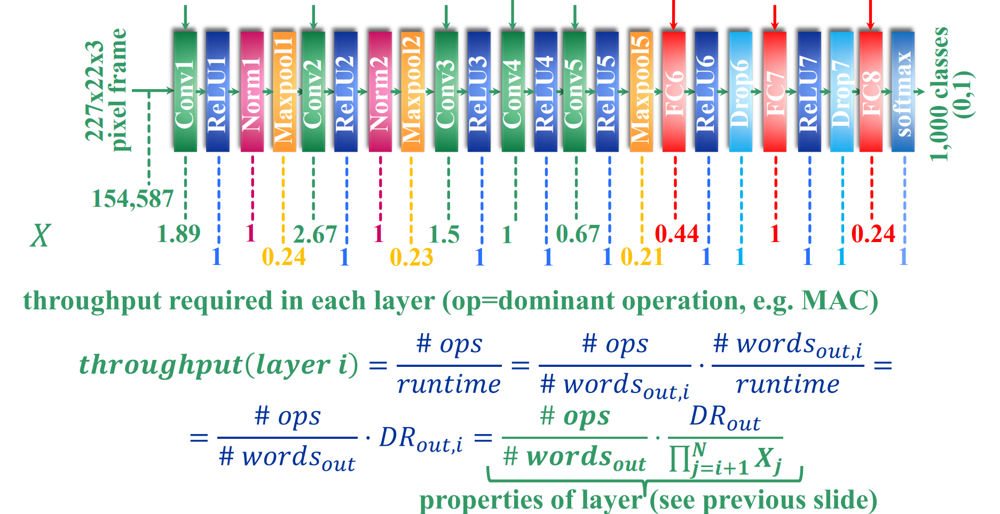<figcaption></figcaption></figure>



#### The "Roofline" Reality

When we map these requirements to hardware limits, we see distinct bottlenecks:

* **Compute-Bound**: The system is limited by how many MACs it can do per second.
  * _Dominant Layers:_ CONV Layers (require 215 MMACs/s to sustain 30fps).
  * _Implication:_ CNN accelerators are essentially huge arrays of MAC units.
* **Memory-Bound**: (See next section).

<figure>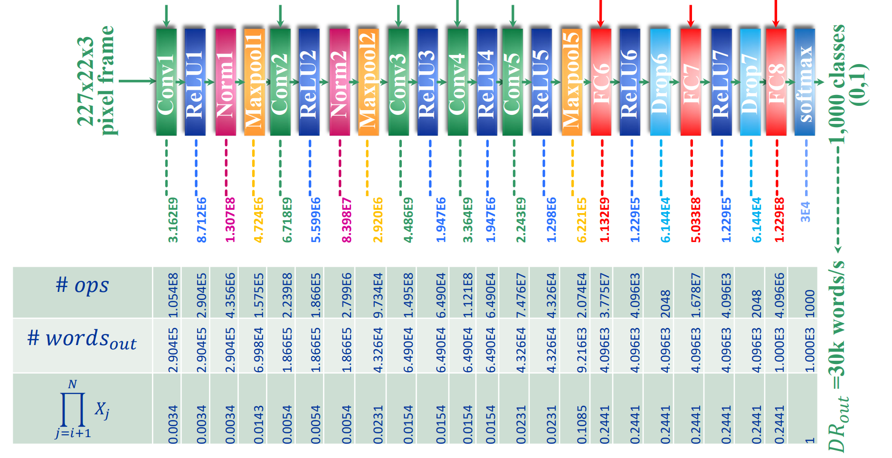<figcaption></figcaption></figure>



#### Memory Bandwidth and Capacity

Throughput is not just about computing; it is about moving data.



#### Memory Capacity (Storage)

* **Feature Memory (Intermediate Data)**: Largest at the _start_ (hundreds of KBs for Conv1/Conv2).
* **Weight Memory (Parameters)**: Dominant at the _end_ (FC Layers).
  * **FC6** alone requires **37.7 Million** parameters (Weights/Biases).
  * _Implication:_ FC layers are heavily memory-capacity constrained (often requiring off-chip DRAM).



#### Memory Bandwidth (Speed)

To feed the compute units for 30fps, we need high bandwidth:

* Peak Bandwidth: Occurs at FC6 ($$\approx$$ 1,100 MB/s).
* **Trend:**
  * _First Layers:_ Low bandwidth (compute-bound).
  * _Last Layers:_ Massive bandwidth spike (memory-bound) because FC layers read huge weight matrices for relatively few computations.

<figure>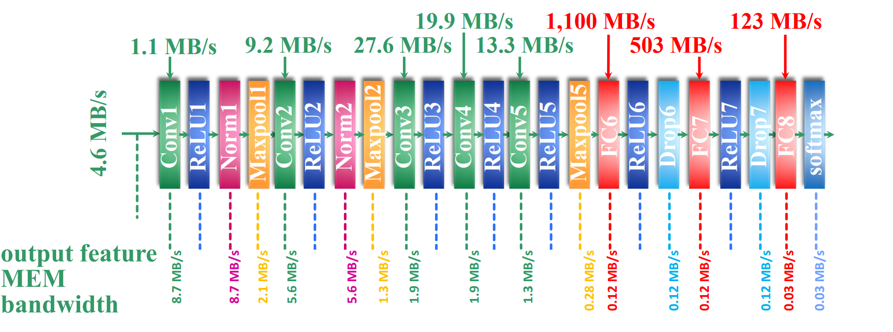<figcaption></figcaption></figure>



[^1]: means "immediately" here, not mean left or right

[^2]: The FF timing constraints imply the system timing constraints.

[^3]: Our focus is always **two** registsers.

[^4]: This minimum identifies the **bottleneck**, i.e., the block that limits the overall throughput of the system.

[^5]: "If this block operates at its maximum speed, what data rate would that correspond to at the final output of the chain?"
