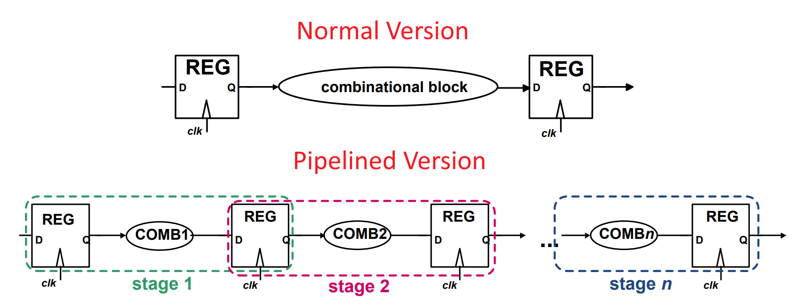
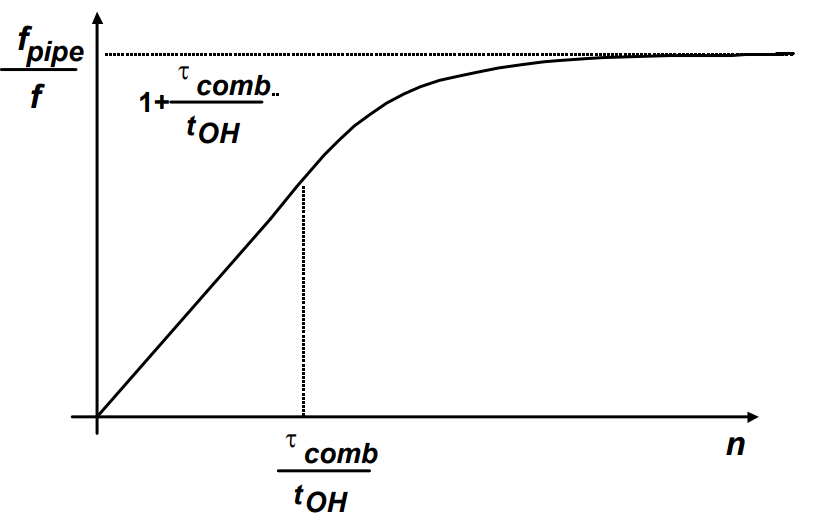
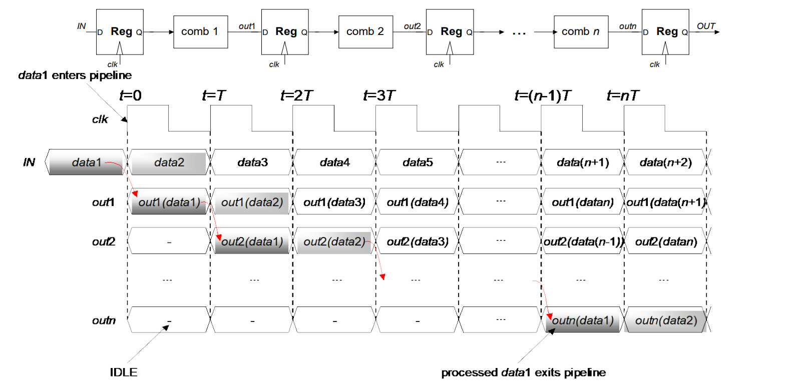

# Lec 02a - Pipelining

Pipelining involves inserting registers into a combinational block to divide it into n stages. This allows different gate levels to operate on different data in parallel, significantly improving throughput.


We have seen pipelining in [NUS CG3207](https://app.gitbook.com/s/jTJFBPtKk6NwweAooH53/lec/lec-05-the-pipelined-processor)!


The core idea of pipelining is that: to reduce the clock cycle time ($$T_{CK}$$), we reduce the combinational delay between registers by splitting the logic.

* **Throughput**: Increases because multiple stages process data simultaneously (parallelism).
* **Latency**: Worsens (increases) due to the added delay of the inserted registers.

<figure><figcaption></figcaption></figure>

## Performance Analysis

We assume a perfectly balanced logic design where the total combinational delay is split evenly among stages, such that $$\tau_{COMB,i} = \frac{\tau_{COMB}}{n}$$.


Treat $$\tau_{COMB}$$ as a constant.&#x20;


### Throughput

The minimum clock cycle time ($$T_{pipe}$$) is determined by the delay of a single stage plus the timing overhead ($$t_{OH}$$), which includes setup time and clock-to-Q delay:

$$
T_{pipe} = \max_{i}(\tau_{COMB,i} + t_{OH,i}) = \frac{\tau_{COMB}}{n} + t_{OH}
$$

$$n$$ is the pipeline depth. $$t_{OH}$$ is the overhead (setup time, clock-to-q, skew).


The $$T_{pipe}$$ here is equal to $$T_{CK}$$ and we assume that we have the **same overhead**.


#### Throughput Improvement

The ratio of the new frequency ($$f_{pipe}$$) to the original frequency ($$f$$) is:

$$
\frac{f_{pipe}}{f} = n \frac{\tau_{COMB} + t_{OH}}{\tau_{COMB} + n \cdot t_{OH}}
$$

<figure><figcaption></figcaption></figure>

* Case 1 ($$n \ll \frac{\tau_{COMB}}{t_{OH}}$$): Improvement is linear (factor of $$n$$). To verify, can neglect $$n\cdot t_{OH}$$.
* Case 2 ($$n > \frac{\tau_{COMB}}{t_{OH}}$$): Improvement saturates to a maximum of $$1 + \frac{\tau_{COMB}}{t_{OH}}$$. To verify, can neglect the term $$\tau_{COMB}$$ in the denominator. So as $$n\to +\infty$$, the ratio $$\to 1+\frac{\tau_{COMB}}{t_{OH}}$$.

How Throughput relates to Frequency here?

In Lec 1b, we have learned that throughput is

> **Throughput** is defined as the number of computations completed per unit of time.

\text{Throughput} = \frac{\text{Number of Computations}}{\text{Time (seconds)}}

Rewrite the equation,

\text{Throughput} = \frac{\text{Computations}}{\text{Second}} = \frac{\text{Computations}}{\text{Cycle}} \times \frac{\text{Cycles}}{\text{Second}}

As a pipelined processor completes one instruction (or one "computation") every single clock cycle.

\text{Throughput} = 1 \times \text{Frequency} = f

Therefore, when we say we are "improving throughput" in pipelining, we are doing so by increasing the clock frequency ($$ $f_{pipe}$ $$$$f_{pipe}$$). The faster the clock ticks, the more computations finish per second.

### Latency

Using the definition latency in lecture 1, if we divide our system into n stages, then one operation will take n stages to complete, thus,

$$
LAT_{pipe} = n \cdot T_{pipe} = \tau_{COMB} + n \cdot t_{OH}
$$

#### Latency Improvement

The ratio of the new latency($$LAT_{pipe}$$) to the original latency($$LAT=\tau_{COMB}+t_{OH}$$) is:

$$
\frac{LAT_{pipe}}{LAT} = \frac{n \cdot T_{pipe}}{T} = \frac{\tau_{COMB} + n \cdot t_{OH}}{\tau_{COMB} + t_{OH}}
$$

$$
\frac{LAT_{pipe}}{LAT} &= \frac{1 + n \cdot \frac{t_{OH}}{\tau_{COMB}}}{1 + \frac{t_{OH}}{\tau_{COMB}}} \\
&\approx \left( 1 + n \cdot \frac{t_{OH}}{\tau_{COMB}} \right) \cdot \left( 1 - \frac{t_{OH}}{\tau_{COMB}} \right)
\end{aligned}$
$$

After simplifying it, we can get,

$$
\begin{aligned}
\frac{LAT_{pipe}}{LAT} &= \frac{1 + n \cdot \frac{t_{OH}}{\tau_{COMB}}}{1 + \frac{t_{OH}}{\tau_{COMB}}} \\
&\approx \left( 1 + n \cdot \frac{t_{OH}}{\tau_{COMB}} \right) \cdot \left( 1 - \frac{t_{OH}}{\tau_{COMB}} \right)
\end{aligned}
$$


To do the simplification, we first divide both the nominator and the denominator with $$\tau_{COMB}$$. We then apply the geometric series approximation $$\frac{1}{1+x} \approx 1-x$$$$ $\frac{1}{1+x} \approx 1-x$ $$, which is valid when $$x \ll 1$$$$ $x \ll 1$ $$. In this context, we assume the timing overhead is small relative to the combinational delay ($$t_{OH} \ll \tau_{COMB}$$$$ $t_{OH} \ll \tau_{COMB}$ $$).


Expanding the product yields $$1 + (n-1)\frac{t_{OH}}{\tau_{COMB}} - n(\frac{t_{OH}}{\tau_{COMB}})^2$$$$ $1 + (n-1)\frac{t_{OH}}{\tau_{COMB}} - n(\frac{t_{OH}}{\tau_{COMB}})^2$ $$. By neglecting the second-order term (the squared component), we arrive at the final linear approximation:

$$
\frac{LAT_{pipe}}{LAT} \approx 1 + (n-1)\frac{t_{OH}}{\tau_{COMB}}
$$

* In terms of time, latency increases slightly due to overhead.
* In terms of clock cycles, latency increases significantly by $$(n-1)$$.

## Physical Costs: Area & Energy

### Silicon Area

The total silicon area is calculated as follow:

$$
A=\sum_{i=1}^{n}A_{comb,i}+\sum_{i=1}^{n+1}A_{reg,i}
$$

We assume area is gate-dominated ($$ $A_{comb}$ $$$$ $A_{comb}$ $$$$\sum_{i=1}^{n}A_{comb,i}=A_{comb}$$) and the register area ($$ $A_{reg,i}$ $$$$A_{reg,i}$$) is small ( $$A_{reg,i} \ll A_{comb}$$$$ $A_{reg,i} \ll A_{comb}$ $$).

$$
A_{pipe} = \sum A_{comb,i} + \sum_{i=1}^{n+1} A_{reg,i} = A_{comb} + (n+1)A_{reg,i}
$$


Assume that the area for all registers used is the same and it is $$A_{reg,i}$$.


#### Area Improvement

After that, the ratio of the pipelined version's area over the normal version's area will be as follow:

$$
\frac{A_{pipe}}{A} = \frac{A_{COMB} + (n+1)A_{reg,i}}{A_{COMB} + 2A_{reg,i}} \approx 1 + (n-1)\frac{A_{reg,i}}{A_{COMB}}
$$


The same techinique used in the [#latency-improvement](lec-02a-pipelining.md#latency-improvement "mention"), which is to divide both the nominators and denominators with $$A_{COMB}$$ and then use the geometric series approximation, is used here to get the final approximation.


Area overhead grows linearly as we increase the number of stages ($$n$$).

### Energy

The total energy in a system is calculated as follow:

$$
E=\sum_{i=1}^{n}E_{comb,i}+\sum_{i=1}^{n+1}E_{reg,i}
$$

#### Energy Improvement

We assume the same switching activity/glitching ($$ $A_{comb}$ $$$$ $A_{comb}$ $$$$\sum_{i=1}^{n}E_{comb,i}=E_{comb}$$) and the $$E_{reg,i} \ll E_{comb}$$$$ $A_{reg,i} \ll A_{comb}$ $$). We can use the similar or almost the same steps from the [area analysis](lec-02a-pipelining.md#silicon-area) above to get the following formula:

$$
\frac{E_{pipe}}{E} = \frac{E_{COMB} + (n+1)E_{reg,i}}{E_{COMB} + 2E_{reg,i}} \approx 1 + (n-1)\frac{E_{reg,i}}{E_{COMB}}
$$

Similar to the [area](lec-02a-pipelining.md#silicon-area), the energy grows **linearly** with the number of stage ($$n$$).

***

Pipelining improves throughput by roughly $$n$$, but at the cost of degraded latency and a linear increase in Area and Energy.

## Pipeline Operations & Stalls

### Filling the pipeline

The pipeline has two states:

1. **Transient (Filling)**: The pipeline is not yet full. It fills up stage-by-stage.
2. **Steady State**: Occurs when the last stage ($$n$$-th) activates. From this point on, one output is generated every clock period.

<figure><figcaption></figcaption></figure>

### Stalls

If the pipeline is not always filled, performance drops. A "stall" means a stage is not computing useful data during a cycle.

#### Throughput with Stalls

We assume that for each operation, there are $$\delta$$ stalled cycles on average. So, a computer is performed every $$T_{\text{pipe}}(1+\delta)$$ instead of $$T_{\text{pipe}}$$. Thus the throughput will result to,

$$
\text{Throughput} = \frac{1}{T_{\text{pipe}}(1+\delta)}
$$

Stalls effectively increase the CPI (in the [NUS CG3207 terminology](https://app.gitbook.com/s/jTJFBPtKk6NwweAooH53/lec/lec-01-history-technology-performance#instruction-count-ic-and-cpi)), reducing throughput.

## Logic Imbalance

In practical designs, it is rarely possible to split logic into perfectly equal stages. The pipeline speed is always limited by the bottleneck (the slowest stage). We define the imbalance of a stage $$ $i$ $$$$i$$$$ $i$ $$ as the difference between its actual delay and the ideal average delay:

$$
\Delta \tau_{COMB,i} = \tau_{COMB,i} - \frac{\tau_{COMB}}{n}
$$

The clock cycle (TCK$$ $T_{CK}$ $$) must be long enough to cover the delay of the slowest stage plus register overheads ($$\tau_{OH,REG} + \tau_{OH,clocking}$$$$ $\tau_{OH,REG} + \tau_{OH,clocking}$ $$).

$$
T_{CK} \ge \max_{i}(\tau_{COMB,i}) + \tau_{OH,FF} + \tau_{OH,clocking}
$$

By substituting the definition of imbalance ($$ $\tau_{COMB,i} = \frac{\tau_{COMB}}{n} + \Delta \tau_{COMB,i}$ $$$$\tau_{COMB,i} = \frac{\tau_{COMB}}{n} + \Delta \tau_{COMB,i}$$), we can rewrite the equation:

$$
T_{CK} \ge \left( \frac{\tau_{COMB}}{n} + \max_{i}(\Delta \tau_{COMB,i}) \right) + \tau_{OH,REG} + \tau_{OH,clocking}
$$

We can group the imbalance term with the hardware overheads to define a new effective overhead ($$ $t_{OH}$ $$tOH):

$$
t_{OH} = \underbrace{\max_{i}(\Delta \tau_{COMB,i})}_{\text{Imbalance}} + \underbrace{\tau_{OH,FF} + \tau_{OH,clocking}}_{\text{Hardware Costs}}
$$

Resulting in the simplified pipeline equation:

$$
T_{CK} = \frac{\tau_{COMB}}{n} + t_{OH}
$$

In conclusion, maximum imbalance behaves mathematically identical to hardware overhead. It acts as a constant penalty that prevents the pipeline from achieving the ideal linear speedup.
