# Lec 02b - RTL Transformations

## Foundations of Synchronous Systems

### Data-Flow Graphs

A **Data-Flow Graph** (DFG) is a mathematical map of our hardware circuit. It doesn't show _what_ the data is (like "5" or "10"), but _how_ the data moves and where it gets processed.

* Graph ($$G$$): The entire circuit.
* Vertices ($$V$$): The processing units (Combinational Logic).
* Edges ($$E$$): The wires connecting them.

For example, in the following diagram, we can see three distinct elements. Each has a specific hardware meaning.

<figure>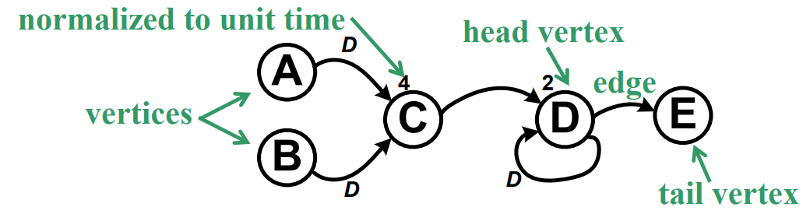<figcaption></figcaption></figure>

* **Nodes (Circles/Ovals)**:
  * **Meaning**: These are the operators (Adders, Multipliers, Logic Gates).
  * **Label** ($$d(v)$$): The number written next to or inside the node. This is the **Combinational Delay** (Calculation Time).
  * _Example:_ If a node has a "10" next to it, it takes 10ns to finish its job.
* **Edges (Arrows)**:
  * **Meaning**: These are the paths data travels.
  * **Direction**: Data always flows one way (**Unidirectional**).
* **The "D" (or "2D", "3D")**:
  * **Meaning**: This stands for Delay, but specifically Sequential Delay (Registers/Flip-Flops).
  * Weight ($$w(e)$$): The number of registers on a wire.
  * _Example:_ A box labeled "$$D$$" is 1 Register (1 clock cycle delay). A box labeled "$$2D$$" is 2 Registers in a series. A plain wire has $$0D$$.
* **Connected and Disconnected Graphs**
  * **Connected**: A graph is connected if there is at least one path between any pair of vertices.
  * **Disconnected**: A graph where vertices are isolated into separate groups with no connecting paths.


#### Two Delays

We have seen two delays up to now and don't confuse with them!

* **Node Delay** ($$d$$): Time is consumed here. This limits how fast our frequency can be (Critical Path). This is called **combinational delay**.
  * _Analogy:_ The time it takes a chef to cook a burger.
* **Edge Delay/Weight** ($$w$$): Time is "paused" here. The data stops and waits for the next clock tick. This is called the **sequential delay**.
  * _Analogy:_ The customer waiting in line.



#### DFG on Single Rate System

The systematic procedure to draw DFG on a single rate system is as follows:

1. **For each input**, create one node that generates such input (to avoid floating edges, being a graph)
2. **For each output**, create one node that absorbs such output (to avoid floating edges)
3. Replace each **operator** with **node** with related **combinational delay**
4. Replace each **connection** with edge and related **sequential delay**

For example,

<figure>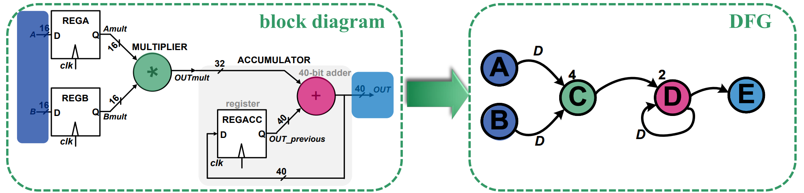<figcaption></figcaption></figure>

#### DFG on Multi-Rate System

In a multi-rate system, different signals are synchronized to clocks with different frequency. For example, in the following multi-rate system,

<figure>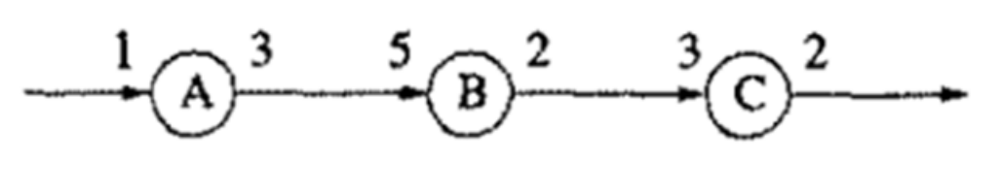<figcaption></figcaption></figure>

* A has input frequency f<sub>A</sub>, outputs frequency 3f<sub>A</sub>.
* B has input frequency 5f<sub>B</sub>, outputs frequency 2f<sub>B</sub>.
* C has input frequency 3f<sub>C</sub>, outputs frequency 2f<sub>C</sub>.

We can derive the relationship between f<sub>A</sub>, f<sub>B</sub> and f<sub>C</sub> from the two connection wires:

1. A -> B: 3f<sub>A</sub> = 5f<sub>B</sub>, so f<sub>B</sub> = (3/5) f<sub>A</sub>.
2. B -> C: 2f<sub>B</sub> = 3f<sub>C</sub>, so f<sub>C</sub> = (2/3)f<sub>B</sub> = (2/5) f<sub>A</sub>.

We can represent a multi-rate system as single-rate by using the following two techniques

1. Apply **unfolding** to each node of multi-rate system (See later)
2. Start from output and go backwards until inputs are reached.

<figure>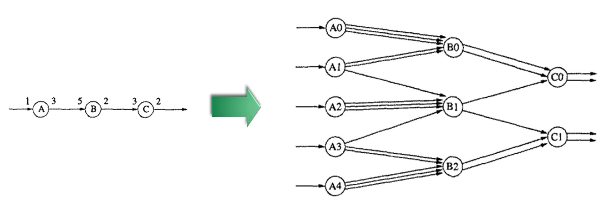<figcaption></figcaption></figure>

#### Assumptions

In our analysis, we made the following assumptions



#### Functionality vs. Latency

For any RTL transformation to be valid, it must preserve **Functionality**, but it does _not_ have to preserve Latency.

* **Functionality (Must Keep)**: For any input sequence, the output sequence values and order must remain exactly the same.
* **Latency (Can Change)**: The number of clock cycles it takes to produce the first valid output can increase.
  * _Example:_ Adding pipeline registers increases latency (results arrive later) but improves frequency (clock runs faster). This is a legal transformation.



#### Timing Model Simplifications

To perform mathematical optimization on the Data Flow Graph (DFG), we simplify the timing analysis:

* **Cycle-Based Timing**: We ignore sub-cycle analog behaviors. We only care that the signal is stable at the end of the clock cycle.
* **The Period Equation:** $$T_{CK} \approx \tau_{COMB,max}$$
  * We approximate the clock period as simply the **Maximum Combinational Delay** in the circuit, often ignoring small overheads like clock skew ($$t_{skew}$$) or setup time ($$ $_{setup} $$) during the initial algorithmic steps.



#### The "Ideal Hardware" Assumptions

All transformation algorithms (Retiming, Folding, Unfolding) rely on these four simplifications:

1. **Load Independence**: The delay of a logic gate (node) is constant, regardless of what it is connected to.
2. **Wire Delay is Negligible**: Rearranging the graph does not change the delay of the wires (edges).
3. **Input Independence**: A computation node takes the same amount of time regardless of the input values (e.g., adding $$0+0$$ takes the same time as $$123+456$$).
4. **No Stalls**: The pipeline flows continuously; we ignore complex control hazards or memory waits.



#### Summary of Trade-offs

We apply the following transformations to shift the design point on the **Area-Speed-Power** triangle:

| Transformation | Area               | Throughput (Speed) | Latency           |
| -------------- | ------------------ | ------------------ | ----------------- |
| Parallelism    | ⬆️ Increase        | ⬆️ Increase        | ➖ Same            |
| Pipelining     | ↗️ Slight Increase | ⬆️ Increase        | ⬆️ Increase       |
| Folding        | ⬇️ Decrease        | ⬇️ Decrease        | ➖ Same            |
| Retiming       | ➖ Same (≈)         | ⬆️ Increase        | ➖ Same / Variable |



#### Types of Synchronous Paths

A **Path** ($$p$$) is a sequence of connected nodes and edges starting from node $$ $u$ $$ and ending at node $$v$$. It can be denoted as $$u \to \dots \to v$$. We have the following three types of paths



#### Linear Pipeline

Data flows from one stage to the immediately next one.

<figure><figcaption></figcaption></figure>



#### Feedforward Path

Some data skips registers

<figure>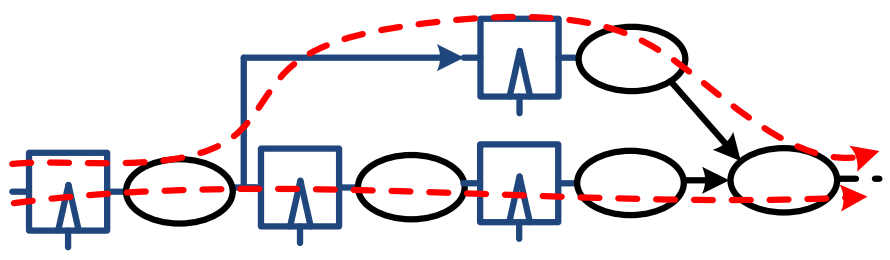<figcaption></figcaption></figure>



#### Feedback Path

Some data goes back to previous register.

<figure>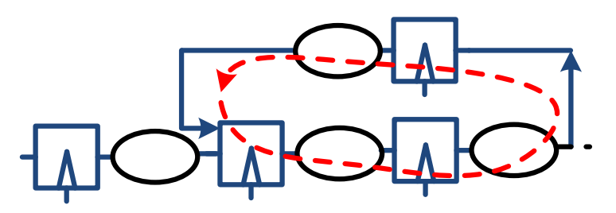<figcaption></figcaption></figure>



### Iteration Bound

There is a fundamental difference in how we optimize timing for recursive vs. non-recursive graphs (DFGs).



#### Non-recursive DFGs

In non-recursive DFGs, the data flows in one direction only, so we can achieve _any_ desired clock cycle time by inserting more pipeline registers (pipelining) and redistributing them (retiming).

The result is that speed is limited only by technology constraints (setup/hold times), not by the logic structure itself.



#### Recursive DFGs

Recursive DFGs contain feedback paths where outputs affect future inputs. For example, consider the following recurrence

```
y[n] = y[n−1] + x[n]
```

In this case, we typically cannot insert new registers into a loop without changing the algorithm's functionality. Remember that adding one register in the loop means "Wait **one clock cycle** before feeding the result back". So,

* **1 register** -> feedback after 1 cycle
* **2 registers** -> feedback after 2 cycles
* **k registers** -> feedback after k cycles

Let's say we insert **one register** in the loop with the recurrence relation above, our recurrence relation will become

```
y[n] = y[n−2] + x[n]
```

This is a **different algorithm**! In a nuthell, the result is that there is a fundamental "Speed Limit" (minimum cycle time) determined by the loops themselves. This speed limit is called **loop bound.**



#### Loop Bound

The **Loop Bound** represents the minimum cycle time imposed by a single, specific loop. It assumes the total logic delay in the loop is evenly distributed across the available registers. It can be calculated using the following formula:

$$
\text{LoopBound} = \frac{t_{loop}}{w_{loop}}
$$

* $$t_{loop}$$: The sum of all combinational logic delays in that specific loop (computation time).
* $$w_{loop}$$: The number of delay elements (registers) in that specific loop.

For example, in the following recursive DFG, we can calculate the loop bounds for two existing loops.

<figure>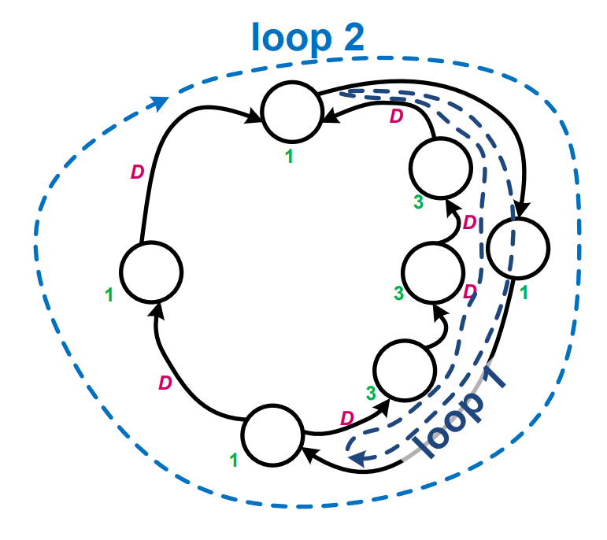<figcaption></figcaption></figure>

1. Loop 1 is the inner loop at the right side, containing 6 nodes and a total combinational delay of 12.
   1. Its loop bound is $$12\div(6-2)=3$$
2. Loop 2 is the big outer loop, containing 4 nodes and a total combinational delay of 4.
   1. Its loop bound is $$4\div(4-2)=2$$

After talking about the **loop bound**, we can see what the **iteration bound** is.

#### Iteration Bound

The Iteration Bound is the **critical path** of recursive systems. It defines the absolute minimum clock period achievable for the entire system, assuming ideal retiming (perfectly balanced stages). It is defined as:

$$
T_{\infty} = \max_{\text{all loops}} \left( \frac{t_{loop}}{w_{loop}} \right)
$$

* It is the **maximum** of all loop bounds in the DFG.
* If our target clock period $$T_{clk} < T_{\infty}$$, the design is impossible to implement without changing the algorithm itself.
* Formula for Minimum Cycle Time ($$T_{CK}$$): $$T_{CK} = \tau_{COMB, max} + t_{OH} \approx \frac{t_{loop}}{w_{loop}}$$
  * Assuming $$t_{OH}$$ is **negligible**

#### A Microprocessor Example

In Intel Itanium processor, the six loops limit the microprocessor's clock frequency.

<figure>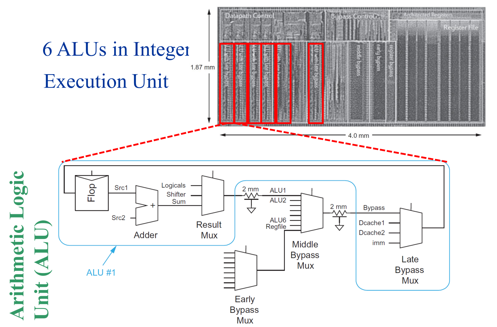<figcaption></figcaption></figure>

In each ALU, we can see there is a loop with one register. To calculate the iteration bound, we can use the extra information on the combinational delay give below:

<figure>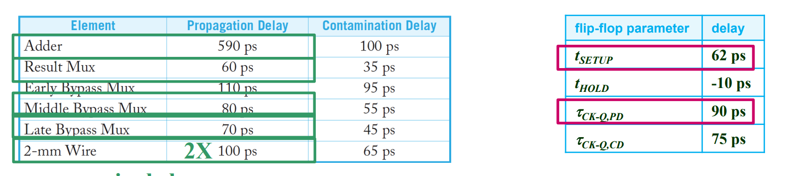<figcaption></figcaption></figure>

Using the formula we have seen above, we can know that the iteration bound is

$$
T_{\infty}=\text{loopbound}_{\text{loop}}=\frac{590+60+100+80+100+70+\textcolor{red}{62}+\textcolor{red}{90}}{1}=1152\text{ps}
$$


If you have **multiple registers** appearing in the loop, let's say n. Then you need to add $$n \times t_{OH}$$ in your $$t_{loop}$$ term.


## Pipelining

We first met pipelining in [CG3207](https://app.gitbook.com/s/jTJFBPtKk6NwweAooH53/lec/lec-05-the-pipelined-processor)! The primary goal of **pipelining** or **register insertion** is to add pipeline registers to a circuit to reduce the critical path (improving frequency) without altering the circuit's logical functionality.


**Trade-offs** of pipelining: Adding registers increases latency (signals must cross more registers to reach the output) and area, but it is necessary for enabling transformations like retiming or folding.


### Cutset

We cannot insert registers anywhere. That's why we need this tool called **cutset** to help us. A **cutset** is a tool used to isolate a specific section of the circuit graph. It is the _**minimal**_**&#x20;set of edges** (wires) whose removal would disconnect the graph into two separate parts ($$G_1$$ and $$G_2$$).

To find the **cut-set**, we can imagine drawing a closed "Gaussian surface" (a bubble) around a group of nodes. The edges that cross this boundary line form the cutset. Each edge must be crossed exactly once. For example, in the diagram below, the two <mark style="color:red;">red</mark> arrows form a cutset.

<figure>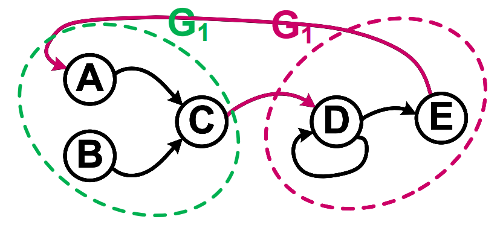<figcaption></figcaption></figure>

Once either of the above two red arrow is cut, no path exists between $$G_1$$ and $$G_2$$; they are completely mathematically independent.

#### Feedforward Cutset

Not all cutsets allow for safe register insertion. We must identify a **Feedforward** Cutset. A cutset is "feedforward" if **all** its edges point in the **same direction** which means they must all be incoming to the bubble or all outgoing from it.

<figure>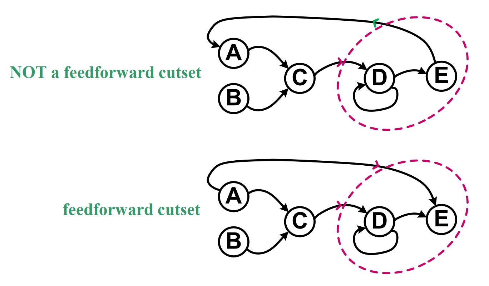<figcaption></figcaption></figure>

#### Feedforward Cutset Register Insertion

The **feedforward cutset register insertion rule** indicates that we can insert $$k$$ cascaded registers into every single edge of a feedforward cutset without breaking the circuit's functionality. The result is that the logic remains valid, but the processing latency increases by $$k$$ clock cycles at that edge.


This rule never holds in a loop! It is only valid in a feedforward cutset!


<details>

<summary>Proof of the feedforward cutset register insertion rule</summary>

Functionality is preserved because the relative timing between signals inside $$G_1$$ and $$G_2$$ stays constant. Since _all_ signals crossing the boundary are delayed by the exact same amount ($$k$$), the sub-circuits just see the same data sequence shifted in time.

This is generally impossible in loops because loops usually create bidirectional (non-feedforward) cutsets. As we have seen above in the "[recursive DFGs](https://wenbo-notes.gitbook.io/ee4415-icd-notes/lecture/lec-02/lec-02b-rtl-transformations#recursive-dfgs)", adding registers in a loop changes the recursion depth (e.g., changing $$x[i-1]$$ to $$x[i-3]$$), which alters the math.

</details>

> Add an example of using this rule!

From this rule, we have the following observations



#### I/O Insertion

Primary inputs and outputs are technically special cases of feedforward cutsets. Therefore, we can **always** safely insert pipeline registers at the very beginning or very end of a digital module.

<figure>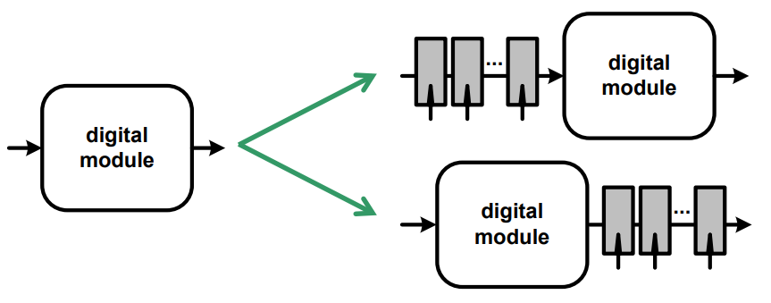<figcaption></figcaption></figure>



#### Register Removal

The rule works in reverse. If _every_ edge in a feedforward cutset already possesses at least $$k$$ registers, we can remove $$k$$ registers from all of them to reduce latency.



#### Non-Cutset Exception

In specific architectures like parallel/interleaved filters (e.g., 3-tap FIR filter), we can sometimes insert registers in **non-cutset patterns** (dashed paths) while still preserving functionality due to the parallel nature of the hardware.

<figure>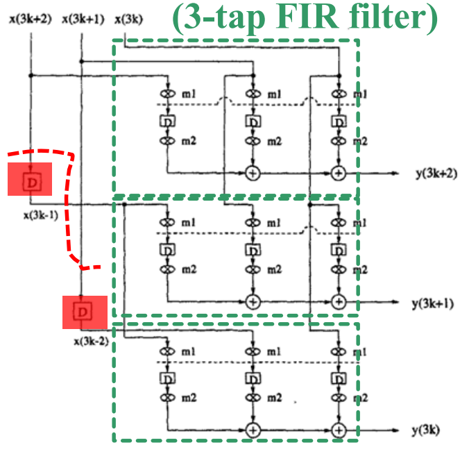<figcaption></figcaption></figure>



<details>

<summary>Example of adding registers on non-feedforward cutset fails</summary>

The counterexample has been introduced in the "[recursive DFGs](https://wenbo-notes.gitbook.io/ee4415-icd-notes/lecture/lec-02/lec-02b-rtl-transformations#recursive-dfgs)" already. Below is a diagram which makes it more intuitive

<figure>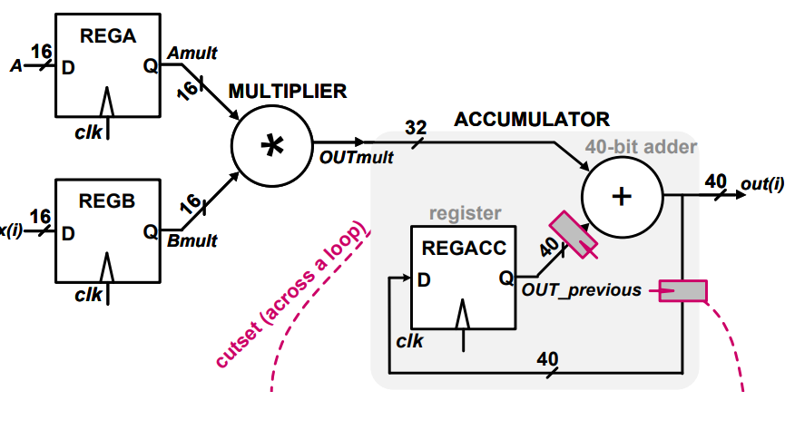<figcaption></figcaption></figure>

</details>

### N-Slowing and Time Interleaving



#### N-Slowing

**N-Slowing** is a global register insertion technique used to transform a circuit to handle multiple independent data streams simultaneously.

* **Procedure**: Replace every single register in the original circuit with $$N$$ cascaded registers.
* **Effect on Latency**: The input-to-output latency increases by a factor of $$N$$. The system effectively operates on a time scale dilated by $$N$$.
* **Functionality**: The logical functionality is strictly preserved, but the output appears $$N$$ times later relative to the original timeline ($$x_{N-slow}(N \cdot i) = x(i)$$).



#### Time Interleaving

The primary motivation for N-Slowing is to enable **Time Interleaving**, which allows a single hardware block to process $$N$$ parallel data streams (channels).

* **Periodicity**: In an N-slowed system, a signal at time $$t$$ depends only on signals from time $$t-N$$. The intermediate cycles ($$t-1, \dots, t-(N-1)$$) are mathematically independent.
* **Utilization**: We can inject $$N$$ distinct input streams (e.g., Channel 1, Channel 2... Channel N) into these independent time slots.
* **Hardware Efficiency**: A single physical circuit does the work of $$N$$ parallel circuits, saving area at the cost of running $$N$$ times faster.



One example of using N-slowing and time interleaving technique is the MAC example. In the MAC, the recursion formula is $$Out(i) = (A \cdot B) + Out(i-1)$$.

* If we process **one data stream,** it is always **invalid** to insert any number of registers in the loop.
* If we process **n different independent data stream**, it is **valid** to insert **n regsiters** into the feedback loop. This is what we called N-slowing and Time interleaving.

Suppose we are under the second situation, the dependency changes from $$i-1$$ to $$i-N$$. The MAC now adds the current product to the value calculated $$N$$ cycles ago. To see exactly how it works, let's imagine $$N=4$$ (4 registers in the loop) and 4 input channels (A, B, C, D).

* **State Storage**: The 4 registers act as a rotating buffer. When Stream A is processed, its result is stored in the first register.
* **The "Waiting Room"**: While the hardware processes Streams B, C, and D (cycles 2, 3, 4), Stream A's data shifts through the register chain, safe and isolated.
* **Reconnection**: Exactly at Cycle 5, Stream A returns. Stream A's old data falls out of the $$N^{th}$$ register at that exact moment, allowing the adder to correctly compute $$New\_A + Old\_A$$.

This will bring us the following benefits

* **Throughput**: The system processes $$N$$ channels using only 1 physical MAC unit (area efficient).
* **Frequency:** The $$N$$ registers inside the loop can be retimed (distributed) into the Multiplier/Adder logic to break critical paths, allowing the clock frequency to potentially increase by $$N$$ times.

Thanks to these advantages, this technique is usually used for [SIMD](https://app.gitbook.com/s/jTJFBPtKk6NwweAooH53/lec/lec-06-advanced-processor#single-instruction-stream-multiple-data-streams-simd) processors.


This technique is amazing and may be useful in my [Mach-V](https://github.com/mendax1234/Mach-V) project!


## Parallelism

**Parallelism** in digital integrated circuits is achieved by replicating a fundamental operator / processing unit $$n$$ times, where $$n$$ represents the _degree of parallelism_. By distributing sequential inputs across these $$n$$ replicas, the system maintains the external data rate ($$1/T_{CK}$$) while allowing each individual hardware unit to operate at a significantly reduced rate ($$1/(n \cdot T_{CK})$$). This relaxation in timing constraints allows the internal logic to complete computations over a duration of $$n$$ clock cycles rather than one, effectively trading silicon area for timing slack.

<figure>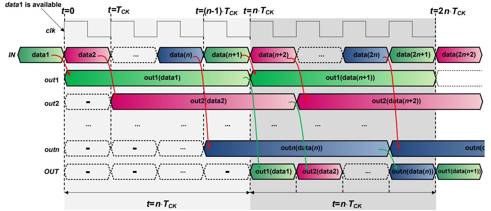<figcaption></figcaption></figure>


In the figure above, each "out" corresponds to a **separate processing unit.**


### Implementation

In this course, we will introduce two implementations of parallelism.

#### Shifted Clock Phase

One method to distribute inputs is to use shifted clock phases. In this architecture, $$n$$ hardware replicas are driven by $$n$$ distinct clock signals, each phase-shifted by $$T_{CK}$$ relative to the previous one. This effectively samples the input stream in a round-robin fashion without introducing buffering latency; processing for the $$i$$-th sample begins immediately upon arrival.

<figure>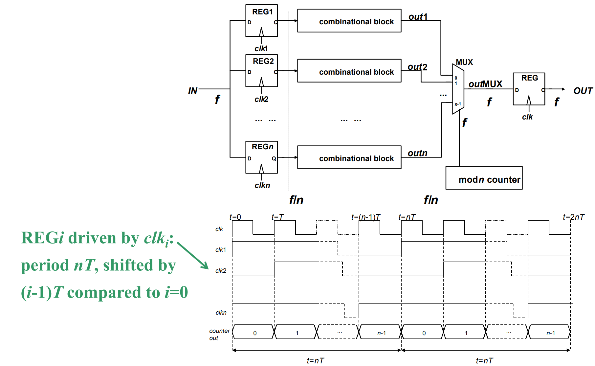<figcaption></figcaption></figure>

However, this approach requires complex clock generation circuitry, such as ring counters or glitch-free clock gating logic (using latches to synchronize enable signals), to ensure precise timing and prevent race conditions.

#### SIPO/PISO Converters

An alternative implementation utilizes Serial-In-Parallel-Out (SIPO) and Parallel-In-Serial-Out (PISO) converters.

<figure>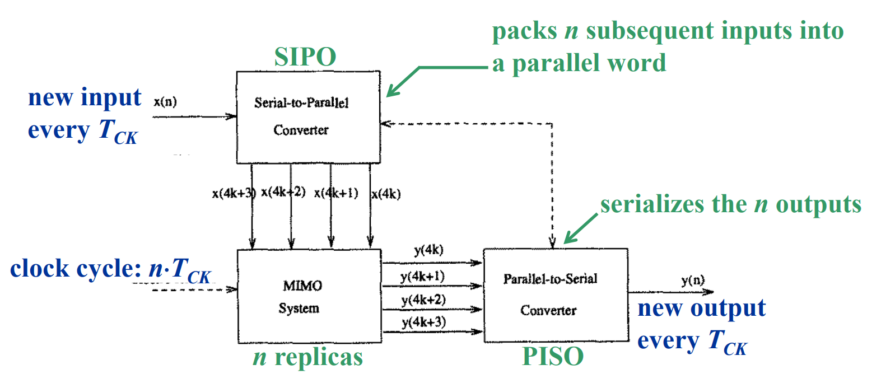<figcaption></figcaption></figure>



#### SIPO Converter

The SIPO converter accumulates $$n$$ consecutive inputs over $$n$$ cycles into a **block**. Essentially, the SIPO converter is a bank of n registers + control that collects n samples over n cycles and presents them as one parallel word.

```scss
x(k) → [REG0] → [REG1] → [REG2] → ... → [REG n−1]
// So SIPO converts:
x(0), x(1), x(2), x(3), x(4), ...
// into
[x(0),x(1),x(2),x(3)], then [x(4),x(5),x(6),x(7)], ...
// That’s why it creates block boundaries.
```



#### MMIO Block

This is n independent copies of the same combinational (or pipelined) hardware

```scss
// So if the original function is:
y = f(x)
// Then MMIO does
[y0,y1,...,y(n−1)] = [ f(x0), f(x1), ..., f(x(n−1)) ]
```



#### PISO Converter

Similar to the SPIO converter, the PISO takes in the block of output and uses n cycles to convert them into serial output.


SIPO/PISO converter operates in **block time**, not cycle time.




In short, the structure of the SIPO/PISO is shown as follows

```less
fast stream
   |
   v
[  SIPO  ]───(n parallel wires)───[  MIMO replicas  ]───(n wires)───[  PISO  ]
   |                                   |                                |
fast clock                          slow clock (n·TCK)              fast clock
```

Internally:

* SIPO is clocked at **T**<sub>**CK**</sub>
* MIMO is clocked at **n·T**<sub>**CK**</sub> (one block per n fast cycles)
* PISO is clocked at **T**<sub>**CK**</sub>

#### Comparison

| Feature                | Shifted Clock Phases                   | SIPO / PISO Converters                  |
| ---------------------- | -------------------------------------- | --------------------------------------- |
| Input Rate to Replicas | 1 / T<sub>CK</sub> (Sequential access) | 1 / (n · T<sub>CK</sub>) (Block access) |
| Steering Latency       | 0 cycles (Immediate processing)        | n cycles (Buffering delay)              |

If we insert register(s) **before** the replica or **after** the replica, we will get different effects for the two architectures introduced above:

<figure>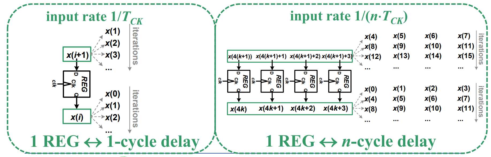<figcaption></figcaption></figure>



#### Shifted Clock Phase

A single register in this path introduces a standard 1-cycle delay. Each replica grabs its specific data point ($$x(i)$$) directly from the fast stream without waiting for others.



#### SIPO/PISO

If we insert registers before or after the replicas, the structure is shown as follows

```scss
SIPO → REG → MIMO
// or
MIMO → REG → PISO
```

Physically, we are inserting,

```scss
[x0  x1  x2  ...] → [REG REG REG ... REG] → replicas
// or
replicas → [REG REG REG ... REG → [x0  x1  x2  ...]
```

That is **n flip-flops**, one per lane. But architecturally, this is **one vector register**, or one **block registe**. This block register is clocked at 1 / (n · T<sub>CK</sub>). So delaying one block means delaying n · T<sub>CK</sub>.


The block register cannot be clocked at T<sub>CK</sub> because it needs to latch the block output, which is only ready after n · T<sub>CK</sub>.




### Timing Analysis

As we have seen above, parallelism relaxes the timing constraint on combinational logic by allowing operations to span multiple clock cycles ($$n$$ cycles) across replicated hardware units. So, the minimum clock period $$T_{CK}$$ is determined by the logic delay divided by the parallelism factor $$n$$, plus overheads.

$$
T_{CK} \ge \frac{T_{CK-Q} + T_{COMB} + T_{MUX} + T_{SETUP}}{n}
$$

### Performance Analysis

#### Performance

The performance analysis can be divided into throughput and latency analysis



#### Throughput ($$f_{parallel}$$)

Assume 1 operation per cycle in replicas and the replicas are independent (no stalls)

$$
\frac{f_{\text{parallel}}}{f}
=
\frac{T_{\text{CK}}}{T_{\text{parallel}}}
=
n \frac{\tau_{\text{COMB}} + t_{\text{OH}}}{\tau_{\text{COMB}} + (t_{\text{OH}} + \tau_{\text{MUX}})}
=
n \frac{1}{1 + \dfrac{\tau_{\text{MUX}}}{\tau_{\text{COMB}} + t_{\text{OH}}}}
\approx n
$$

* Improves by factor $$\approx n$$.
  * _Limitation:_ Slightly less than ideal $$n$$ due to MUX delay ($$\tau_{MUX}$$) affecting the critical path.
* $$\tau_{MUX}$$ usually scales logarithmically ($$\propto \log_2 n$$).



#### Latency ($$LAT_{parallel}$$)

The latency we are talking here is "How long does x(0) take to appear as y(0) at the output?"

$$
LAT_{\text{parallel}} = n T_{\text{parallel}} 
= \tau_{\text{COMB}} + t_{\text{OH}} + \tau_{\text{MUX}}
$$

So, we have the improvement factor of **latency in time** to be as follows

$$
\frac{LAT_{\text{parallel}}}{LAT}
= 1 + \frac{\tau_{\text{MUX}}}{\tau_{\text{COMB}} + t_{\text{OH}}}
$$

Notice that it is the **latency in time** that remains almost the same. But the latency in **clock cycles** are increased by n in parallelism (The [graph above](lec-02b-rtl-transformations.md#parallelism)) because

$$
\text{cycles}=LAT_{\text{parallel}}\div T_{\text{parallel}}
$$


In [SIPO/PISO architecture](lec-02b-rtl-transformations.md#sipo-piso-converters), the **latency in clock cycles** is increased by 2n because both SIPO and PISO will introduce n clock cycles delay!




#### Area Analysis

The area increases by a facotr \~n

$$
A_{parallel} \approx n (A_{comb} + A_{reg}) + A_{MUX}+A_{reg}\approx n(A_{comb}+A_{reg})
$$

#### Energy Analysis

The energy per computation **slightly increases**

$$
\begin{align*}
E_{\text{parallel}}
&= \frac{
     n(E_{\text{COMB}} + E_{\text{REG}}) 
     + E_{\text{MUX}} + E_{\text{REG,out}} + E_{\text{control}}
   }{n} \\
&= E_{\text{COMB}} + E_{\text{REG}} 
   + \frac{E_{\text{MUX}} + E_{\text{REG,out}} + E_{\text{control}}}{n}
\end{align*}
$$

### Pipelining vs. Parallelism

Pipelining is equally effective at improving throughput but consumes **much less area** than parallelism. The core design rule is that:

> Always use parallelism only after pipelining has been fully utilized.

However, pipelining has its own limitations

* **I/O Limits**: Off-chip communication speeds cannot exceed a few GHz.
* **Clock Issues**: Extremely small clock cycles cause issues with yield, clock skew, and jitter, requiring high energy costs to fix.
* **Hazards**: Stalls and hazards in deep pipelines can negate performance benefits (except in DSPs where data flow is continuous).
* **Latency**: Deep pipelining can increase latency beyond target requirements.
