# Lec 02b - RTL Transformations

## Foundations of Synchronous Systems

### Data-Flow Graphs

A **Data-Flow Graph** (DFG) is a mathematical map of our hardware circuit. It doesn't show _what_ the data is (like "5" or "10"), but _how_ the data moves and where it gets processed.

* Graph ($$G$$): The entire circuit.
* Vertices ($$V$$): The processing units (Combinational Logic).
* Edges ($$E$$): The wires connecting them.

For example, in the following diagram, we can see three distinct elements. Each has a specific hardware meaning.

<figure><figcaption></figcaption></figure>

* **Nodes (Circles/Ovals)**:
  * **Meaning**: These are the operators (Adders, Multipliers, Logic Gates).
  * **Label** ($$d(v)$$): The number written next to or inside the node. This is the **Combinational Delay** (Calculation Time).
  * _Example:_ If a node has a "10" next to it, it takes 10ns to finish its job.
* **Edges (Arrows)**:
  * **Meaning**: These are the paths data travels.
  * **Direction**: Data always flows one way (**Unidirectional**).
* **The "D" (or "2D", "3D")**:
  * **Meaning**: This stands for Delay, but specifically Sequential Delay (Registers/Flip-Flops).
  * Weight ($$w(e)$$): The number of registers on a wire.
  * _Example:_ A box labeled "$$D$$" is 1 Register (1 clock cycle delay). A box labeled "$$2D$$" is 2 Registers in a series. A plain wire has $$0D$$. So, for example, D at edge from A -> C means that the signal coming out from vertice A will be seen by vertice C in the **next cycle**.
* **Connected and Disconnected Graphs**
  * **Connected**: A graph is connected if there is at least one path between any pair of vertices.
  * **Disconnected**: A graph where vertices are isolated into separate groups with no connecting paths.


#### Two Delays

We have seen two delays up to now and don't confuse with them!

* **Node Delay** ($$d$$): Time is consumed here. This limits how fast our frequency can be (Critical Path). This is called **combinational delay**.
  * _Analogy:_ The time it takes a chef to cook a burger.
* **Edge Delay/Weight** ($$w$$): Time is "paused" here. The data stops and waits for the next clock tick. This is called the **sequential delay**.
  * _Analogy:_ The customer waiting in line.


#### DFG on Single Rate System

The systematic procedure to draw DFG on a single rate system is as follows:

1. **For each input**, create one node that generates such input (to avoid floating edges, being a graph)
2. **For each output**, create one node that absorbs such output (to avoid floating edges)
3. Replace each **operator** with **node** with related **combinational delay**
4. Replace each **connection** with edge and related **sequential delay**

For example,

<figure><figcaption></figcaption></figure>

#### DFG on Multi-Rate System

In a [multi-rate system](#user-content-fn-1)[^1], different signals are synchronized to clocks with different frequency. For example, in the following multi-rate system,

<figure><figcaption></figcaption></figure>

* A has input frequency f<sub>A</sub>, outputs frequency 3f<sub>A</sub>.
* B has input frequency 5f<sub>B</sub>, outputs frequency 2f<sub>B</sub>.
* C has input frequency 3f<sub>C</sub>, outputs frequency 2f<sub>C</sub>.

We can derive the relationship between f<sub>A</sub>, f<sub>B</sub> and f<sub>C</sub> from the two connection wires:

1. A -> B: 3f<sub>A</sub> = 5f<sub>B</sub>, so f<sub>B</sub> = (3/5) f<sub>A</sub>.
2. B -> C: 2f<sub>B</sub> = 3f<sub>C</sub>, so f<sub>C</sub> = (2/3)f<sub>B</sub> = (2/5) f<sub>A</sub>.

We can represent a multi-rate system as single-rate by using the following two techniques

1. Apply **unfolding** to each node of multi-rate system (Will see later)
2. Start from output and go backwards until inputs are reached.

<figure><figcaption></figcaption></figure>

#### Assumptions

In our analysis, we made the following assumptions



#### Functionality vs. Latency

For any RTL transformation to be valid, it must preserve **Functionality**, but it does _not_ have to preserve Latency.

* **Functionality (Must Keep)**: For any input sequence, the output sequence values and order must remain exactly the same.
* **Latency (Can Change)**: The number of clock cycles it takes to produce the first valid output can increase.
  * _Example:_ Adding pipeline registers increases "latency" (results arrive later) but improves frequency (clock runs faster). This is a legal transformation.


If we use the other definition of latency, which is **clock cycles** <i class="fa-xmark">:xmark:</i> **cycle-time**, we can find out that the latency will actually be similar or smaller.


<figure>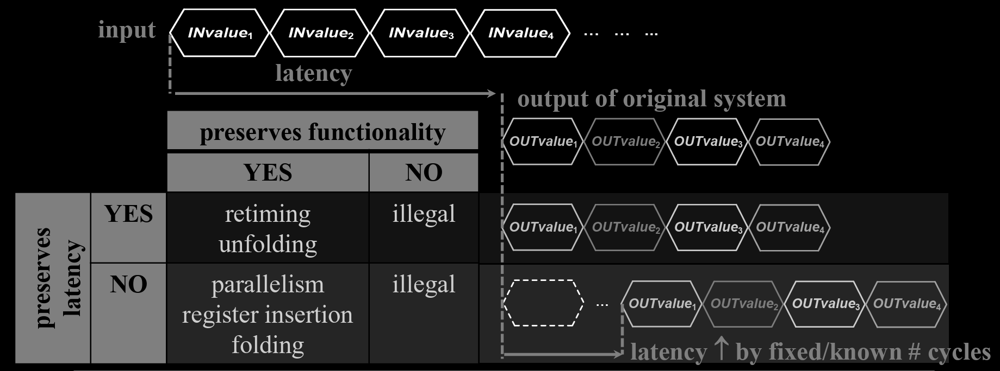<figcaption></figcaption></figure>

The image above entails 5 RTL transformations, we are going to learn 3 of them in this section. Some of them preserve the latency while the rest didn't. However, all of them preserve the functionality.



#### Timing Model Simplifications

To perform mathematical optimization on the Data Flow Graph (DFG), we simplify the timing analysis as:

* **Cycle-Based Timing**: We ignore sub-cycle analog behaviors. We only care that the signal is stable at the end of the clock cycle.
  * For example, we use OUT(i) to illustrate that the output is just a function of clock cycle i.
* **The Period Equation:** $$T_{CK} \approx \tau_{COMB,max}$$
  * We approximate the clock period as simply the **Maximum Combinational Delay** in the circuit, often ignoring small overheads like clock skew ($$t_{skew}$$) or setup time ($$t_{setup}$$) during the initial algorithmic steps.



#### The "Ideal Hardware" Assumptions

All transformation algorithms (Retiming, parallelism, repipelining, unfolding, and folding) rely on these four simplifications:

1. **Load Independence**: The delay of a logic gate (node) is constant, regardless of what it is connected to.
   1. In other words, the number beside each **node** is **constant.**
2. **Wire Delay is Negligible**: Rearranging the graph does not change the delay of the wires (edges).
3. **Input Independence**: A computation node takes the same amount of time regardless of the input values (e.g., adding $$0+0$$ takes the same time as $$123+456$$).
4. **No Stalls**: The pipeline flows continuously; we ignore complex control hazards or memory waits.
   1. This _no-stall_ assumption is achievable in AI accelerators. Unlike general-purpose microprocessors, AI accelerators operate on highly structured and predictable workloads, allowing data inputs and memory accesses to be carefully aligned at design time. As a result, pipeline hazards can be largely eliminated, avoiding the need for dynamic stalling.


Another explanation would be that, in microcroprocessor, we consider more about **instructions** while in AI accelerators, we consider more about **data**.




#### Summary of Trade-offs

The trade-offs between PPA analysis of the **5 RTL transformations** we are going to learn in this section are shown as follows:

<figure>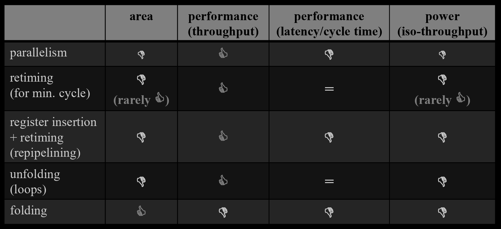<figcaption></figcaption></figure>


We will see a **much more detailed** version at the end of this section!




#### Types of Synchronous Paths

A **Path** ($$p$$) is a sequence of connected nodes and edges starting from node $$u$$ and ending at node $$v$$. It can be denoted as $$u \to \dots \to v$$. We have the following three types of paths



#### Linear Pipeline

Data flows from one stage to the immediately next one.

<figure><figcaption></figcaption></figure>



#### Feedforward Path

Some data skips registers.

<figure><figcaption></figcaption></figure>



#### Feedback Path

Some data goes back to previous register.

<figure><figcaption></figcaption></figure>


According to [DDCA](https://app.gitbook.com/s/jTJFBPtKk6NwweAooH53/textbook/sequential-logic-design/latches-and-flip-flops#register), an N-bit register is a bank of N flip-flops. Thus, the pipeline register here can have several inputs.




### Iteration Bound

There is a fundamental difference between how we optimize timing for **recursive** vs. **non-recursive** graphs (DFGs).



#### Non-recursive DFGs

In non-recursive DFGs, the data flows in one direction only, so we can achieve **any** desired clock cycle time by inserting more pipeline registers (pipelining) and redistributing them (retiming).


The method above is called [**repipelining**](lec-02b-rtl-transformations.md#repipelining).


The result is that the speed is limited only by technology constraints (setup/hold times), not by the logic structure itself.



#### Recursive DFGs

Recursive DFGs contain feedback paths where outputs affect future inputs. For example, consider the following recurrence:

```
y[n] = y[n−1] + x[n]
```

In this case, we typically cannot insert new registers into a loop without changing the algorithm's functionality. Remember that adding one register in the loop means "Wait **one clock cycle** before feeding the result back". So,

* **1 register** -> feedback after 1 cycle
* **2 registers** -> feedback after 2 cycles
* **k registers** -> feedback after k cycles

Let's say we insert **one register** in the loop with the recurrence relation above, our recurrence relation will become

```
y[n] = y[n−2] + x[n]
```

This is a **different algorithm**! In a nuthell, the result is that there is a fundamental "Speed Limit" (minimum cycle time) determined by the loops themselves. This speed limit is called **loop bound.**


The intuition behind “cannot add registers in a loop” is that inputs **coming into** the loop may arrive at different clock cycles, leading to timing misalignment.




#### Loop Bound

The **Loop Bound** represents the minimum cycle time imposed by a single, specific loop. It assumes that the total logic delay in the loop is evenly distributed across the available registers. It can be calculated using the following formula:

$$
\text{LoopBound} = \frac{t_{loop}}{w_{loop}}
$$

* $$t_{loop}$$: The sum of all **combinational logic delays** in that specific loop (computation time).
* $$w_{loop}$$: The number of **registers** in that specific loop.
* The unit of loop bound is **"seconds per pipeline stage"**.


The intuition behind the loop bound is that it [**highly likely**](#user-content-fn-2)[^2] indicates the critical path of the design, and therefore determines the maximum achievable clock frequency. In other words, in a design, the **loop part** will **highly likely** be the **bottleneck**.


For example, in the following recursive DFG, we can calculate the loop bounds for two existing loops.

<figure><figcaption></figcaption></figure>

1. Loop 1 is the inner loop at the right side, containing 4 registers (4 "D" in loop 1\_ and a total combinational delay of 12.
   1. Its loop bound is $$12\div4=3$$
2. Loop 2 is the big outer loop, containing 2 registers and a total combinational delay of 4.
   1. Its loop bound is $$4\div2=2$$

After talking about the **loop bound**, we can see what the **iteration bound** is.

#### Iteration Bound

The Iteration Bound is the **critical path** of recursive systems. It defines the [**absolute minimum clock period**](#user-content-fn-3)[^3] achievable for the entire system, assuming ideal retiming (perfectly balanced stages). It is defined as:

$$
T_{\infty} = \max_{\text{all loops}} \left( \frac{t_{loop}}{w_{loop}} \right)
$$

* It is the **maximum** of all loop bounds in the DFG.
* If our target clock period $$T_{clk} < T_{\infty}$$, the design is **impossible** to implement without changing the algorithm itself.
* Formula for Minimum Cycle Time ($$T_{CK}$$): $$T_{CK} = \tau_{COMB, max} + t_{OH} \approx \frac{t_{loop}}{w_{loop}}$$
  * Assuming $$t_{OH}$$ is **negligible**

<details>

<summary>How do we solve the loop bound bottleneck?</summary>

Indeed, we can use the **loop unrolling** technique, which is techically a compiler technique which we have had a glimpse of in [CG3207](https://app.gitbook.com/s/jTJFBPtKk6NwweAooH53/lec/lec-06-advanced-processor#loop-unrolling). This technique has also been practiced in the multiplier design in [Mach-V](https://mendax1234.github.io/Mach-V/uarch/mul-div-unit/#multiply-unit).


Prof. Massimo used the example of loop unrolling — originally a compiler optimization technique — to emphasize a broader lesson about research. Meaningful research rarely belongs to a single discipline; instead, it draws inspirations from the ability to connect ideas across fields. Techniques we consider novel today may have existed in other domains decades earlier. This is why, as emphasized in the very first lecture, we must keep learning continuously — not only to advance our research, but also to remain intellectually adaptable and avoid being outperformed by AI.


</details>

#### A Microprocessor Example

In Intel Itanium processor, the six loops limit the microprocessor's clock frequency.

<figure><figcaption></figcaption></figure>

In each ALU, we can see that there is a loop with one register. To calculate the iteration bound, we can use the extra information on the combinational delay give below:

<figure><figcaption></figcaption></figure>

Using the formula we have seen above, we can know that the iteration bound is

$$
T_{\infty}=\text{loopbound}_{\text{loop}}=\frac{590+60+100+80+100+70+\textcolor{red}{62}+\textcolor{red}{90}}{1}=1152\text{ps}
$$


We only add one $$t_{OH}$$ in our $$t_{loop}$$ term even if there are multiple registers in the loop.


<details>

<summary>Can we use skew/jitter to improve the performace of the loop above?</summary>

The loop existing in the Intel Intanium processor can be simpilifed to as follows:

<figure><figcaption></figcaption></figure>

In this case, we can clearly see that

1. **clock skew** provides no improvement for either setup or hold timing, since the same clock signal drives the same register.
   1. The launching and capturing register are the same.
2. However, **clock jitter** does affect performance — particularly setup timing — because jitter on clock edges in different cycles is not correlated and therefore need not be the same.
   1. More specifically, in the worst case, the T<sub>CK</sub> will be affected by 2t<sub>jitter</sub>.

</details>

## Register Insertion

> This is the part that is not covered in any textbook! It will be useful when we introduce **repipelining** ,which is basically **retiming + registration insertion**.

The primary goal of **register insertion** is to add registers to a circuit to reduce the critical path (improve frequency) without altering the circuit's logical functionality.


**Trade-offs** of register insertion: In a **non-pipelined** design, adding registers increases [latency in clock cycles](#user-content-fn-4)[^4] (signals must cross more registers to reach the output) and area, but it is useful for RTL transformations like retiming.


### Cutset Insertion

We cannot insert registers anywhere. That's why we need this tool called **cutset** to help us. A **cutset** is a tool used to isolate a specific section of the circuit graph. It is the _**minimal**_**&#x20;set of edges** (wires) whose removal would disconnect the graph into two separate parts ($$G_1$$ and $$G_2$$).


We must either remove **all** edges in the cutset or leave them all intact.


To find the **cutset**, we can imagine drawing a closed "Gaussian surface" (a bubble) around a group of nodes. The edges that cross this boundary line form the cutset. Each edge must be crossed exactly once. For example, in the diagram below, the two <mark style="color:red;">red</mark> arrows form a cutset.

<figure><figcaption></figcaption></figure>

Once **both of** the two red arrow are cut, no path exists between $$G_1$$ and $$G_2$$; they are completely mathematically independent.

<details>

<summary>How to find the gaussian surface?</summary>

The use of term _Gaussian surface_ may be confusing here, since it originates from electrostatics (the focus of FDP2021). But the underlying idea is simply **partition -> enclose -> identify boundary edges**.

1. **Choose a partition:** Select the set of nodes we want to isolate (the “inside” set).
   1. Example: To separate the left cluster from the right, choose `{A, B, C}`.
   2. Example: To isolate a single node, choose `{D}`.
2. **Enclose the partition:** Draw a continuous dashed line around the chosen nodes. This line is just a visual boundary.
3. **Identify the cutset:**
   1. Edges with both endpoints inside the boundary -> ignore.
   2. Edges with both endpoints outside the boundary -> ignore.
   3. Edges crossing the boundary (one endpoint inside, one outside) -> **cutset edges**.
   4. [The registers on the cutset edges](#user-content-fn-5)[^5] **shouldn't** be included in any one of the partition.
4. **Check loops crossing**:
   1. In **register insertion,** the gaussian surface **cannot** cross the loop.
   2. In **retiming,** the gaussian surface **can** cross the loop.


#### The principle of Min-cut

When selecting a partition (drawing a "Gaussian Surface"), aim to cross as **few edges as possible** because in pipelining and retiming, every edge crossing the cutset represents a potential location for a register. Minimizing cutset size directly minimizes the total number of registers required (Flip-Flop Area) and reduces interconnect complexity.


</details>

#### Feedforward Cutset

Not all cutsets allow for safe register insertion. We must identify a **Feedforward** Cutset. A cutset is "feedforward" if **all** its edges point in the **same direction**. In other words, the edges in the cutset must all be incoming to the bubble or all outgoing from it.

<figure><figcaption></figcaption></figure>

#### Feedforward Cutset Register Insertion

> The intuition behind this rule is that, once understood, it can be applied visually to any situation — no math and no calculation is required.

The **feedforward cutset register insertion rule** indicates that we can insert $$k$$ cascaded registers into **every single edge** of a feedforward **cutset** without breaking the circuit's functionality. The result is that the logic remains valid, but the processing latency in clock cycles increases by $$k$$ clock cycles at that edge.


This rule never holds in a **loop**! It is only valid in a feedforward cutset!


<details>

<summary>Proof of the feedforward cutset register insertion rule</summary>

Functionality is preserved because the **relative timing** between signals inside $$G_1$$ and $$G_2$$ stays constant. Since _all_ signals crossing the boundary are delayed by the exact same amount ($$k$$), the sub-circuits just see the same data sequence shifted in time.

<figure>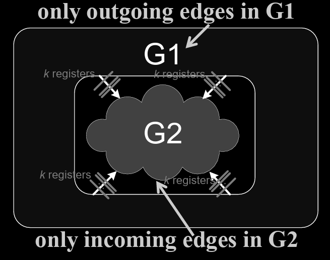<figcaption><p>Feedforward cutset</p></figcaption></figure>


In the figure above, this is a **feedforward cutset** and we can see clearly that as $$G_2$$ doesn't send any signal back to $$G_1$$, it is valid to add any number of registers to the **inputs** of $$G_2$$.


This is generally impossible in loops because loops usually create bidirectional (non-feedforward) cutsets. As we have seen above in the "[recursive DFGs](https://wenbo-notes.gitbook.io/ee4415-icd-notes/lecture/lec-02/lec-02b-rtl-transformations#recursive-dfgs)", adding registers in a loop changes the recursion depth (e.g., changing $$x[i-1]$$ to $$x[i-3]$$), which alters the math.

<figure>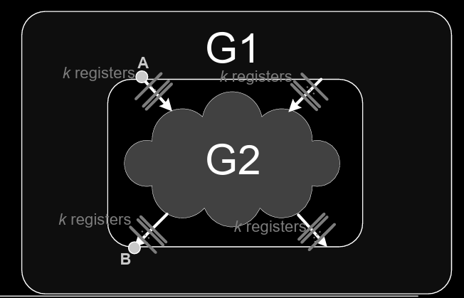<figcaption><p>Non-feedforward cutset</p></figcaption></figure>

</details>

From this rule, we have the following observations



#### I/O Insertion

Primary inputs and outputs are technically special cases of feedforward cutsets. Therefore, we can **always** safely insert registers at **all** inputs/outputs of a system without affecting its functionality.

<figure><figcaption></figcaption></figure>

The reason for the validaty of doing so is that we can easily partition the [whole system](#user-content-fn-6)[^6] into **one group** and the inputs and outputs as **two separate groups**. Through this partitioning can we achieve two feedforward cutset so that we can do the insertion.



#### Register Removal

The rule works in reverse. If _every_ edge in a feedforward cutset already possesses at least $$k$$ registers, we can remove $$k$$ registers from all of them to reduce latency.



#### Non-Cutset Exception

In specific architectures like parallel/interleaved filters (e.g., 3-tap FIR filter), we can sometimes insert registers in **non-cutset patterns** (dashed paths) while still preserving functionality due to the parallel nature of the hardware.

<figure><figcaption></figcaption></figure>


This is an example of the **block filter** and it won't be tested in AY25/26 Sem 2's EE4415 midterm!




<details>

<summary>Example of adding registers on non-feedforward cutset fails</summary>

The counterexample has been introduced in the "[recursive DFGs](https://wenbo-notes.gitbook.io/ee4415-icd-notes/lecture/lec-02/lec-02b-rtl-transformations#recursive-dfgs)" already. Below is a diagram which makes it (The MAC, which is the core of most modern NPUs) more intuitive

<figure><figcaption></figcaption></figure>


As this cutset is not a feedforward cutset, it is **not valid** to add registers at all the edges in this cutset!


</details>

### N-Slowing Insertion

As discussed above, **register insertion is only valid across a feedforward cutset**. In other words, **registers cannot be inserted directly into a loop**, since doing so would alter the circuit’s behavior.

To address this limitation, we use the **N-slowing technique**. The idea is to replace **every register in the entire system** (including the registers in the loop) with **N cascaded registers**.

<figure>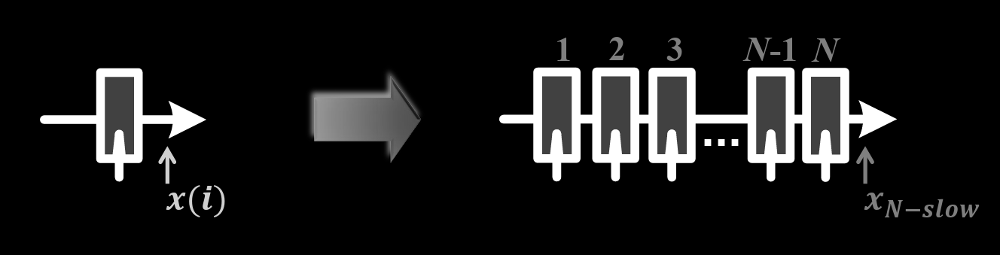<figcaption></figcaption></figure>

This transformation is equivalent to replacing each original register with a **single register that has an N-cycle delay**. As a result:

* The **I/O latency in clock cycle increases by a factor of N**, since signals must now pass through N additional registers.
* The **functional behavior is preserved**, but observed at different clock cycles.
* Equivalently, the system’s **time scale is dilated by a factor of N** ( $$x_{\text{N-slow}}(N\cdot i) = x(i)$$).

So, now the signal dependency and periodicity can be summarized as follows,

<figure>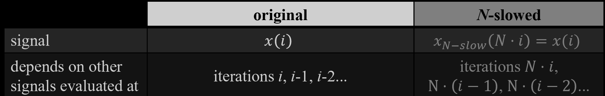<figcaption></figcaption></figure>

From this table, we observe that the "**step width" for processing a single data stream increases from 1 cycle to N cycles**. This means that the system’s functionality no longer depends on the intermediate cycles within each N-cycle window.

As a result, these intermediate cycles can be used to process **additional independent data streams**. In other words, the system can interleave **N independent data streams**, processing one stream per cycle over the N cycles. This forms the basics of the **time interleaving** technique we will see later.


Note that the second row means that "The system's functionality only depends on the **current** and **past** inputs".


#### Time Interleaving

> This is actually the third technique of retiming, which will be discussed in detail later. Thus, this section will just give you a taste of this technique.

The primary motivation for N-Slowing is to enable **Time Interleaving**, which allows a single hardware block to process $$N$$ parallel data streams (channels).

* **Periodicity**: In an N-slowed system, a signal at time $$t$$ depends only on signals from time $$t-N$$. The intermediate cycles ($$t-1, \dots, t-(N-1)$$) are mathematically independent.
* **Utilization**: We can inject $$N$$ distinct input streams (e.g., Channel 1, Channel 2... Channel N) into these independent time slots.
* **Hardware Efficiency**: A single physical circuit does the work of $$N$$ parallel circuits, saving area at the cost of running $$N$$ times faster.

#### Practical Example

One example of using N-slowing and time interleaving technique is the MAC example. In the MAC, the recursion formula is $$Out(i) = (A \cdot B) + Out(i-1)$$.

* If we process **one data stream,** it is always **invalid** to insert any number of registers in the loop.
* If we process **n different independent data stream**, we can use the N-slowing and Time interleaving technique.

Suppose we are under the second situation, the dependency changes from $$i-1$$ to $$i-N$$. The MAC now adds the current product to the value calculated $$N$$ cycles ago. To see exactly how it works, let's imagine $$N=4$$ (4 registers in the loop) and 4 input channels (A, B, C, D).

* **State Storage**: The 4 registers act as a rotating buffer. When Stream A is processed, its result is stored in the first register.
* **The "Waiting Room"**: While the hardware processes Streams B, C, and D (cycles 2, 3, 4), Stream A's data shifts through the register chain, safe and isolated.
* **Reconnection**: Exactly at Cycle 5, Stream A returns. Stream A's old data falls out of the $$N^{th}$$ register at that exact moment, allowing the adder to correctly compute $$New\_A + Old\_A$$.

<figure>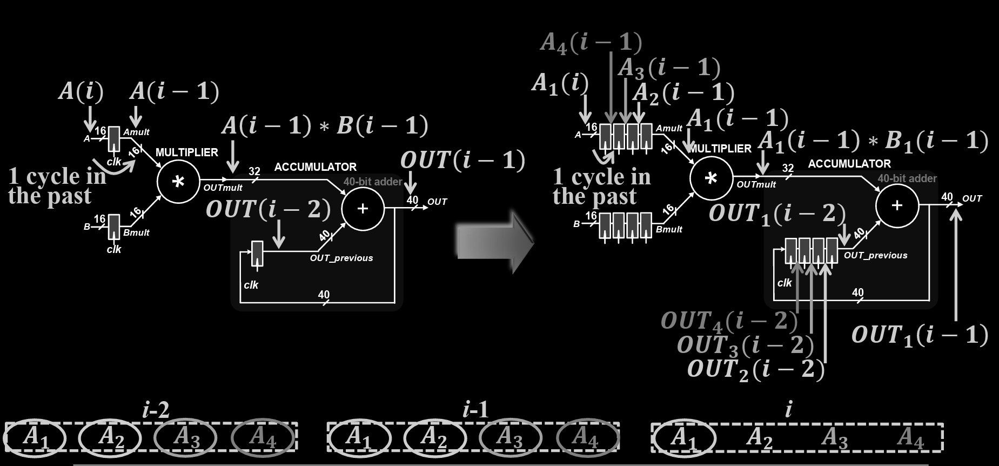<figcaption></figcaption></figure>

This will bring us the following benefits

* **Throughput**: The system processes $$N$$ channels using only 1 physical MAC unit (area efficient).
* **Frequency:** The $$N$$ registers inside the loop can be retimed (distributed) into the Multiplier/Adder logic to break critical paths, allowing the clock frequency to potentially increase by $$N$$ times.


For more on Timing Interleaving, you can refer to [below](lec-02b-rtl-transformations.md#time-interleaving-2).


## Parallelism

> As we have seen above, **N-slowing insertion** is one technique to allow SIMD (Single Instruction  Multiple Data stream) processing. Besides that, we can also use **parallelism** to achieve SIMD.

**Parallelism** in digital integrated circuits is achieved by replicating a fundamental operator / processing unit $$n$$ times, where $$n$$ represents the _degree of parallelism_. In parallelism, we have two forms:



#### Iso-performance parallelism

* The overall system **throughput** remains unchanged, but
* the hardware **area** increases due to resource duplication.
* Because the workload is distributed across parallel units, the **clock frequency** fed to the replicas will thus be reduced.
* However, the **latency** increases by a factor of $$n$$ (or $$2n$$, depending on whether a shifted clock-cycle approach or SIPO/PISO implementation is used).
* A key advantage of this method is reduced **power** consumption due to the lower operating frequency.

If we treat the normal fast clock `clk` as the baseline, the following design is an example of **iso-performance parallelism**. However, if we treat the $$\tau_{\text{COMB}}+t_{\text{OH}}+\tau_{\text{MUX}}$$ as the baseline clock period, we can easily derive that the normal clock cycle can be in fact $$n$$ times faster, then this will be an example of **high-performance parallelism** implemented by shifted clock phase.


Different starting point will give us different interpretations of the following design.


<figure><figcaption></figcaption></figure>


In the figure above, each "out" on the vertical column corresponds to a **separate processing unit.**




#### High-performance parallelism

* The system **throughput** increases proportionally to the level of parallelism (e.g., by a factor of $$n$$).
* The **clock frequency** to the replicas remains unchanged, and
* the **latency** per data item also remains the same.
* However, because more hardware resources operate simultaneously, **power** consumption increases.


This method will be quite efficient if both our **inputs** and **outputs** are **parallel** and we don't need to convert them into **serial**.





#### Parallelism assumption in EE4415

The understanding of parallelism may differ depending on what our **inputs** are and what we want our **outputs** to be. In EE4415, we assume that,

> we only have **sequential inputs** and we want the **output** to be **sequential** too.

This assumption will limit the fact that we are **not considering** the high-performance parallelim implemented with **parallel inputs** and **outputs**. Instead, we can only use the **following** two implementations which inevitably have an overhead of $$n$$ or $$2n$$.


### Implementation

In this course, we will introduce two methods to implement parallelism based on the assumption we mentioned above.


In this section, when we say "cycles", we are referring to the normal clock which has a clock period of $$T_{CK}$$.


#### Shifted Clock Phase

One method to distribute inputs is to use shifted clock phases. In this architecture, the $$n$$ **launching registers** are driven by $$n$$ distinct clock signals, each phase-shifted by $$T_{CK}$$ relative to the previous one and with a long clock period of $$n\cdot T_{CK}$$. The final **capturing register** is clocked at the normal clock with a period of $$T_{CK}$$.

<figure><figcaption></figcaption></figure>


In this design, we have an obvious overhead of $$n\cdot T_{CK}$$. After the overhead, the out of each input data will be available one $$T_{CK}$$ after another.


However, as you might notice, this approach requires complex clock generation circuitry for the $$n$$ **launching registers.** These techniques include ring counters or glitch-free clock gating logic (using latches to synchronize enable signals).



#### Ring Counter

<figure>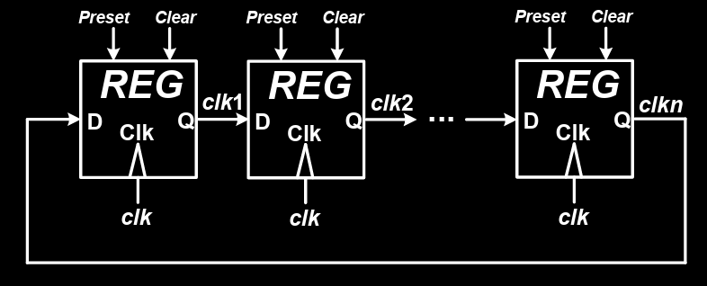<figcaption></figcaption></figure>


This is usually hard to implement because the synthesis tool will always give out warnings on this kind of design.




#### Clock Gating

This technique is highly **not recommended** in both CG3207 and EE4218. However, Prof Massimo introduces an elegant way to deal with the **glitch** that may occur during the clock gating.

<figure>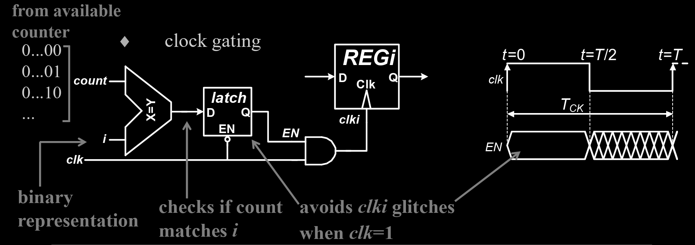<figcaption></figcaption></figure>

In this system, **glitches mainly originate from the comparator**, which compares the counter value with the target value $$i$$ to generate a slower, gated clock. Since the comparator is a **combinational circuit**, it can output a momentarily glitch.

To prevent these glitches from propagating to the gated clock, a **level-sensitive latch** is inserted after the comparator. The latch is **transparent only when** `clk = 0`, allowing the enable signal (`EN`) to update safely during the low phase of the clock. When `clk = 1`, the latch closes and **holds** `EN` **constant**, even if the comparator output glitches.

As a result, the slowered clk `clki` ticks high **once** every N ticks of the main clock `clk`.


**Clock gating can generate an N-slowed clock, but it is not a 50% duty cycle.** To obtain an N-slowed clock with a precise 50% duty cycle, a **clock divider** must be used instead.




#### SIPO/PISO Converters

An alternative implementation utilizes Serial-In-Parallel-Out (SIPO) and Parallel-In-Serial-Out (PISO) converters.

<figure><figcaption></figcaption></figure>

In this method, the spirit is to prepare $$n$$ **indepedent data inputs** simultaneously and then feed them into a **high-performance** MIMO system, then converts the $$n$$ outputs which are simultaneously ready into the serial output.



#### SIPO Converter

The SIPO converter accumulates $$n$$ consecutive inputs over $$n$$ cycles into a **block**. Essentially, the SIPO converter is a bank of $$n$$ registers + control that collects $$n$$ samples over $$n$$ cycles and presents them as one parallel word. In other words, this is implemented via [**shifted registers**](https://app.gitbook.com/s/jTJFBPtKk6NwweAooH53/textbook/digital-building-blocks/sequential-building-blocks#shift-registers).

```scss
x(k) → [REG0] → [REG1] → [REG2] → ... → [REG n−1]
// So SIPO converts:
x(0), x(1), x(2), x(3), x(4), ...
// into
[x(0),x(1),x(2),x(3)], then [x(4),x(5),x(6),x(7)], ...
// That’s why it creates block boundaries.
```


This is to prepare $$n$$ independent data inputs.




#### MIMO Block

This is $$n$$ independent copies of the same combinational (or pipelined) hardware


This is to utilize the **high-performance parallelism** to process the $$n$$ independent data inputs generated by the SIPO in one "cycle". (As we clock the MIMO at $$n\cdot T_{CK}$$, it takes $$n\cdot T_{CK}$$ to process the data)


```scss
// So if the original function is:
y = f(x)
// Then MMIO does
[y0,y1,...,y(n−1)] = [ f(x0), f(x1), ..., f(x(n−1)) ]
```



#### PISO Converter

Similar to the SPIO converter, the PISO takes in the block of output and uses $$n$$ cycles to convert them into serial output.


This is to convert the $$n$$ data outputs which are ready simultaneously into a **serial output**.




#### Comparison

| Feature                                    | Shifted Clock Phases                     | SIPO / PISO Converters                                        |
| ------------------------------------------ | ---------------------------------------- | ------------------------------------------------------------- |
| Input Rate to **Replicas**                 | $$\frac{1}{T_{CK}}$$ (Sequential access) | $$\frac{1}{n\cdot T_{CK}}$$ (Block access)                    |
| [Steering Latency](#user-content-fn-7)[^7] | 0 cycles (Immediate processing)          | $$n$$ cycles (Convert from serial to parallel and vice versa) |


In shifted clock phase design, the **replicas** are the combinational part after each capturing regsiter. In the SIPO/PISO design, the **replica** is the MIMO block.


If we insert register(s) **before** the replica or **after** the replica, we will get different effects for the two architectures introduced above:

<figure><figcaption></figcaption></figure>



#### Shifted Clock Phase

A single register in this path introduces a standard 1-cycle delay.



#### SIPO/PISO

If we insert registers before or after the replicas, the structure is shown as follows

```scss
SIPO → REG → MIMO
// or
MIMO → REG → PISO
```

Physically, we are inserting,

```scss
[x0  x1  x2  ...] → [REG REG REG ... REG] → replicas
// or
replicas → [REG REG REG ... REG] → [x0  x1  x2  ...]
```

That is **n flip-flops**, one per lane. But architecturally, this is **one vector register**, or one **block register**. This block register is clocked at $$\frac{1}{n\cdot T_{CK}}$$. So delaying one block means delaying $$n\cdot T_{CK}$$.


The block register **cannot** be clocked at $$T_{CK}$$ because it needs to latch the block output, which is only ready after $$n\cdot T_{CK}$$. Being "ready" can be thought of as either

* The input to the MIMO is only ready after $$n\cdot T_{CK}$$.
* The output of the MIMO is only ready after $$n\cdot T_{CK}$$.




### Timing Analysis

As we have seen above, parallelism relaxes the timing constraint on combinational logic by allowing operations to span multiple clock cycles ($$n$$ cycles) across replicated hardware units. So, the minimum clock period $$T_{CK}$$ is determined by the logic delay divided by the parallelism factor $$n$$, plus overheads. (Suppose that we are using the **shifted clock phases** design here)

$$
T_{CK} \ge \frac{T_{CK-Q} + T_{COMB} + T_{MUX} + T_{SETUP}}{n}
$$


Here, our starting point is to treat $$T_{CK-Q} + T_{COMB} + T_{MUX} + T_{SETUP}$$ as the **baseline** clock period. Thus, the output clock period time can be reduced by $$\approx n$$ times. This means we are talking about one implementation of the **high-performance parallelism**.


### PPA Analysis

Here, let's do the PPA analysis on **parallelism** vs. a **reference sequential** (non-pipelined) **design**.

#### Performance Analysis

The performance analysis can be divided into throughput and latency analysis



#### Throughput ($$f_{\text{parallel}}$$)

Assume 1 operation per cycle in replicas and the replicas are independent (no stalls)

$$
\frac{f_{\text{parallel}}}{f}
=
\frac{T_{\text{CK}}}{T_{\text{parallel}}}
=
n \frac{\tau_{\text{COMB}} + t_{\text{OH}}}{\tau_{\text{COMB}} + (t_{\text{OH}} + \tau_{\text{MUX}})}
=
n \frac{1}{1 + \dfrac{\tau_{\text{MUX}}}{\tau_{\text{COMB}} + t_{\text{OH}}}}
\approx n
$$

* Improves by factor $$\approx n$$.
  * _Limitation:_ Slightly less than ideal $$n$$ due to MUX delay ($$\tau_{\text{MUX}}$$) affecting the critical path.
* $$\tau_{\text{MUX}}$$ usually scales logarithmically ($$\propto \log_2 n$$). This is because a n-to-1 multiplexer is implemented using a bunch of 2-to-1 multiplexer in a tree manner shown as follows. And the delay is the height of the tree, which is $$\approx\log_2n$$.

<figure><figcaption><p>8-to-1 multiplexer implemented using 7 2-to-1 multiplexer, the tree height is 3</p></figcaption></figure>



#### Latency ($$LAT_{\text{parallel}}$$)

The latency we are talking here is "How long does x(0) take to appear as y(0) at the output?"

$$
LAT_{\text{parallel}} = n \cdot T_{\text{parallel}} 
= \tau_{\text{COMB}} + t_{\text{OH}} + \tau_{\text{MUX}}
$$

So, we have the improvement factor of **latency in time** to be as follows

$$
\frac{LAT_{\text{parallel}}}{LAT}
= 1 + \frac{\tau_{\text{MUX}}}{\tau_{\text{COMB}} + t_{\text{OH}}}
$$

Notice that it is the **latency in time** that remains almost the same. But the latency in **clock cycles** are increased by $$n$$ in parallelism (The [graph above](lec-02b-rtl-transformations.md#parallelism)) because

$$
\text{cycles}=LAT_{\text{parallel}}\div T_{\text{parallel}}
$$


In [SIPO/PISO architecture](lec-02b-rtl-transformations.md#sipo-piso-converters), the **latency in clock cycles** is increased by $$2n$$ because both SIPO and PISO will introduce $$n$$ clock cycles delay each!




#### Power Analysis

The energy per computation **slightly increases**

$$
\begin{align*}
E_{\text{parallel}}
&= \frac{
     n(E_{\text{COMB}} + E_{\text{REG}}) 
     + E_{\text{MUX}} + E_{\text{REG,out}} + E_{\text{control}}
   }{n} \\
&= E_{\text{COMB}} + E_{\text{REG}} 
   + \frac{E_{\text{MUX}} + E_{\text{REG,out}} + E_{\text{control}}}{n}
\end{align*}
$$

#### Area Analysis

The area increases by a factor $$\approx n$$

$$
A_{parallel} \approx n (A_{comb} + A_{reg}) + A_{MUX}+A_{reg}\approx n(A_{comb}+A_{reg})
$$

#### PPA Analysis Summary

The PPA analysis summary of the **high-performance parallelism** using the **shifted clock phase** method implementation is as follows:

| Metric                     | Sequential (baseline) | High-Performance Parallel implemented by shifted clock phase |
| -------------------------- | --------------------- | ------------------------------------------------------------ |
| **Throughput**             | 1                     | $$\approx n$$                                                |
| **Latency (Time)**         | 1                     | $$> 1$$ (slight increase due to MUX overhead)                |
| **Latency (Cycles)**       | 1                     | $$n$$                                                        |
| **System Clock Frequency** | $$f$$                 | $$\approx n\cdot f$$                                         |
| **Area**                   | 1                     | $$\approx n$$ (replicated datapath + MUX overhead)           |
| **Energy per Operation**   | 1                     | $$\approx 1$$ (slightly increases due to MUX/control)        |

### Pipelining vs. Parallelism

<table><thead><tr><th>Metric</th><th>Sequential (baseline)</th><th>n-stage Pipelined Design</th><th>High-Performance Parallel implemented by shifted clock phase</th><th data-hidden>Iso-Performance n-way Parallel</th></tr></thead><tbody><tr><td><strong>Throughput</strong></td><td>1</td><td><span class="math">\approx n</span></td><td><span class="math">\approx n</span></td><td><span class="math">1</span></td></tr><tr><td><strong>Latency (Time)</strong></td><td>1</td><td><span class="math">> 1</span> (slight increase due to overhead)</td><td><span class="math">> 1</span> (slight increase due to MUX overhead)</td><td><span class="math">\approx n</span> (takes <span class="math">n</span> times longer per operation)</td></tr><tr><td><strong>Latency (Cycles)</strong></td><td>1</td><td><span class="math">n</span></td><td><span class="math">n</span></td><td><span class="math">1</span></td></tr><tr><td><strong>Clock Frequency</strong></td><td><span class="math">f</span></td><td><span class="math">\approx n \cdot f</span></td><td><span class="math">\approx n\cdot f</span></td><td><span class="math">f / n</span></td></tr><tr><td><strong>Area</strong></td><td>1</td><td><span class="math">> 1</span> (linear growth due to registers)</td><td><span class="math">\approx n</span> (replicated datapath + MUX overhead)</td><td><span class="math">\approx n</span> (replicated datapath + MUX overhead)</td></tr><tr><td><strong>Energy per Operation</strong></td><td>1</td><td><span class="math">> 1</span> (linear growth due to registers)</td><td><span class="math">\approx 1</span> (slightly increases due to MUX/control)</td><td><span class="math">&#x3C;&#x3C; 1</span> (significant reduction via <span class="math">V_{dd}</span> scaling)</td></tr></tbody></table>

From the table above, we can see that pipelining is equally effective at improving throughput but consumes **much less area** than parallelism. So, the core design rule is that:

> Always use **parallelism** only after **pipelining** has been fully utilized.

However, **pipelining** has its own limitations

* **I/O Limits**: Off-chip communication speeds cannot exceed a few GHz.
* **Clock Issues**: Extremely small clock cycles cause issues with yield, clock skew, and jitter, requiring high energy costs to fix.
* **Hazards**: Stalls and hazards in deep pipelines can negate performance benefits (except in DSPs where data flow is continuous).
* **Latency**: Deep pipelining can increase latency in clock cycles beyond target requirements.

## Retiming

Retiming is a structural transformation that involves moving registers around combinational logic to achieve more **balanced** logic paths. This technique is particularly useful early in the design phase when logic depths are difficult to balance manually.

* **Preserves Latency**: Unlike pipelining (register insertion), retiming preserves the **I/O latency in clock cycles** (e.g., the number of cycles from each input to each output is kept the same).
* **Optimization Goals**:
  * **Reduce Clock Cycle**: By balancing the delay ($$\tau_{\text{COMB}}$$) between registers.
  * **Minimize Area**: By reducing the total count of registers required in the design. This can be done by brining the registers from the outputs of a vertice to its input or vice versa.

In this course, we will mainly introduce **cutset retiming**, while in EE4218, we will see another technique which is **more maths-heavy**.


Just a personal tip, **cutset retiming** is more powerful!


With the help of **cutset retiming**, we will see how they can be combined with other tools to perform the [**RTL Transformations**](lec-02b-rtl-transformations.md#rtl-transformation). These transformations can be used to practically move the register to a given microarchitecture (at iso-latency[^8] in terms of cycles), or even modifying the latency (by adding registers at the input or output and retime). Before that, let's see the assumptions and some math notations first.

#### Assumptions

To apply retiming algorithms formally, let's model the circuit as a [Data Flow Graph (DFG)](lec-02b-rtl-transformations.md#data-flow-graphs) with specific constraints to handle Input/Output boundaries correctly.

<figure>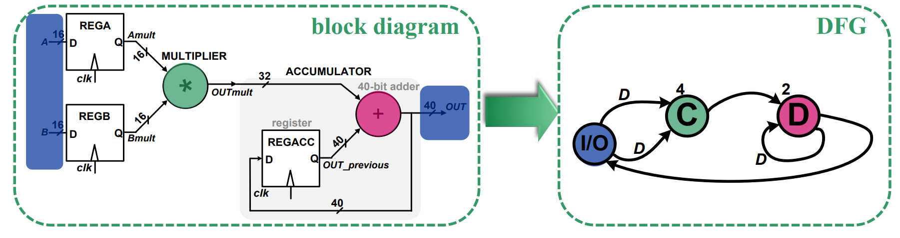<figcaption></figcaption></figure>



#### Environmental Model

* **No Sink/Source**: The DFG is assumed not to have any open sources or sinks.
* **Lumped I/O Node**: All system inputs and outputs are theoretically connected to a single "host" node. This allows the graph to be closed, ensuring that if a register is pushed off an output, it "wraps around" and reappears at the input, thereby **preserving total I/O latency**.



#### Register Moving

When moving registers, combinational operators at vertices through retiming cannot be broken up. (e.g., a register can only be either at their input vertices or their output). If operators need to be pipielined, just preliminarily break them into sub-stage and follow the same rules.

<figure>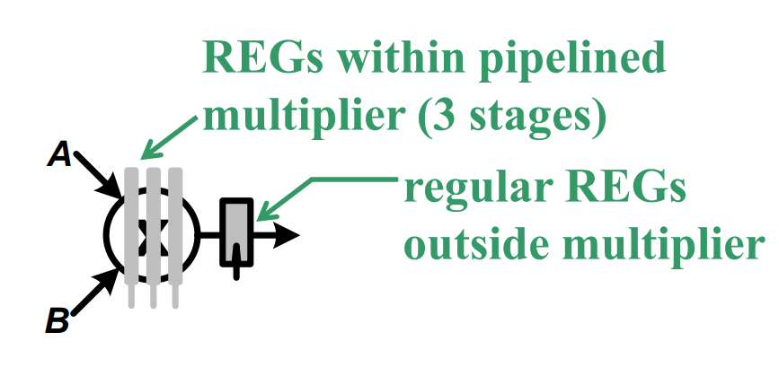<figcaption></figcaption></figure>



#### Fundamental Transformation

The core operation of retiming allows registers to be moved forward or backward across the inputs and outputs of an operator without changing the circuit's steady-state[^9] functional behavior.

<figure>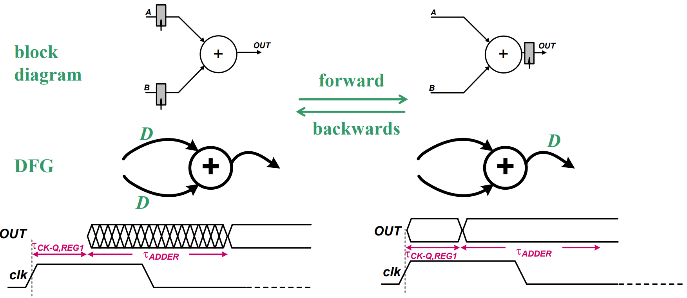<figcaption></figcaption></figure>

For example, in the diagram above

* LHS: We store the input A and B for one cycle and then use the stored value to calculate the output. Thus, in the timing diagram, T<sub>CK-Q,REG1</sub> is for the stored inputs A and B to be fed into the adder.
  * Analogy: Store A and B today. Tomorrow, take those stored values and add them.
* RHS: We add A and B first and then store the result for one cycle. In the timing diagram, as the final result is calculated before the CLK rises, T<sub>CK-Q,REG1</sub> is to launch the _previous_ sum to the world.
  * Analogy: Add A and B today immediately. Then store the result. Tomorrow, show me that stored result.

This rule applies to path branching as well, which can be seen from below

<figure>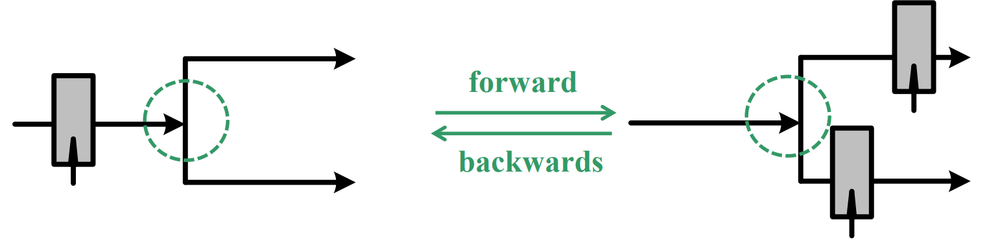<figcaption></figcaption></figure>

### Fundamental Definition

> This part has appeared in Micheli's book and EE4218 as well. Can refer to the notes [there](https://wenbo-notes.gitbook.io/ee4218-hsd-notes/textbook-micheli/sequential-logic-optimization/sequential-circuit-optimization-using-network-models#cycle-time-minimization).

To algorithmically optimize a circuit, we define retiming mathematically using a **Data Flow Graph (DFG)** where vertices ($$V$$) represent logic gates and edges ($$E$$) represent the wires connecting them, which is same as we have learned at the [beginning](lec-02b-rtl-transformations.md#data-flow-graphs) of this note.



#### The Retiming Vector $$r(V)$$

The "Retiming Vector" is an **integer** value assigned to every vertex $$V$$ in the graph. It tracks how many registers are moved across that vertex[^10].

* **Definition:** $$r(V) = \# \text{ Registers moved backwards}$$.
* **Directionality**:
  * $$r(V) > 0$$: Registers are moved **Backwards** (from Output -> Input).
  * $$r(V) < 0$$: Registers are moved **Forward** (from Input -> Output).
  * $$r(V) = 0$$: No movement occurred for this node.

<figure>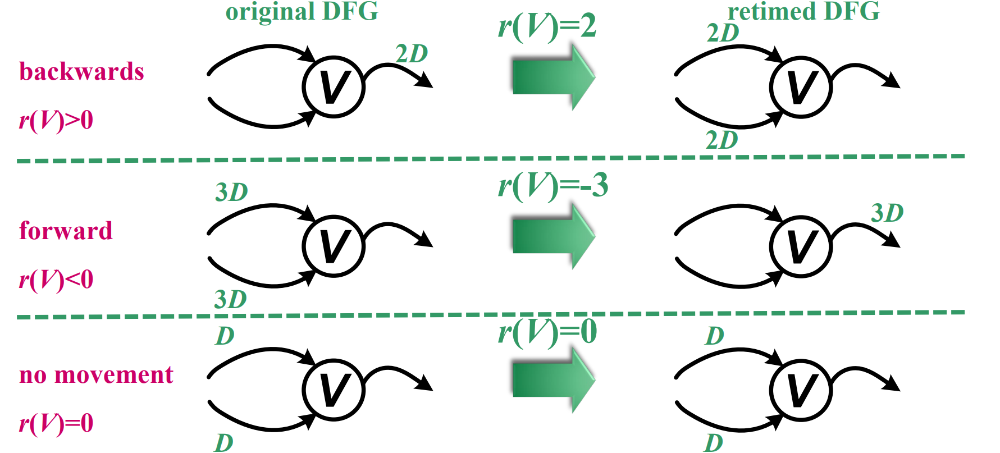<figcaption></figcaption></figure>



#### Calculating Edge Weights ($$w$$)

The "weight" ($$w$$) of an edge is simply the number of registers (flip-flops) currently sitting on that wire. When we retime, we calculate the new weight of the wire connecting Node $$U$$ to Node $$V$$. The formula is

$$
w_{retimed}(U, V) = w_{original}(U, V) + r(V) - r(U)
$$

The Intuition is:

* Moving registers backwards across the destination $$V$$ adds registers to the input wire ($$+r(V)$$).
* Moving registers backwards across the source $$U$$ removes registers from the output wire ($$-r(U)$$).

So, the term $$r(V)-r(U)$$ denotes the number of **registers change** on the edge[^11] from $$U$$ to $$V$$



#### Feasibility Condition

Retiming is only valid if the resulting circuit is physically realizable. We cannot have a wire with a "negative" number of registers.

* **Condition**: The retimed weight must be non-negative.

$$
w_{retimed}(U, V) \ge 0
$$

* **Constraint Equation**: Rearranging the formula above gives us the checking condition:

$$
w_{original}(U, V) \ge r(U)-r(V)
$$

If this inequality holds for all edges, the retiming is legal.


The intuition is that the [**decrease** ](#user-content-fn-12)[^12]of the number of **registers change** ($$r(V)-r(U)$$) cannot be larger than the number of registers in the original edge.




#### Practical Application

For example, let's do the retiming on the following DFG

<figure>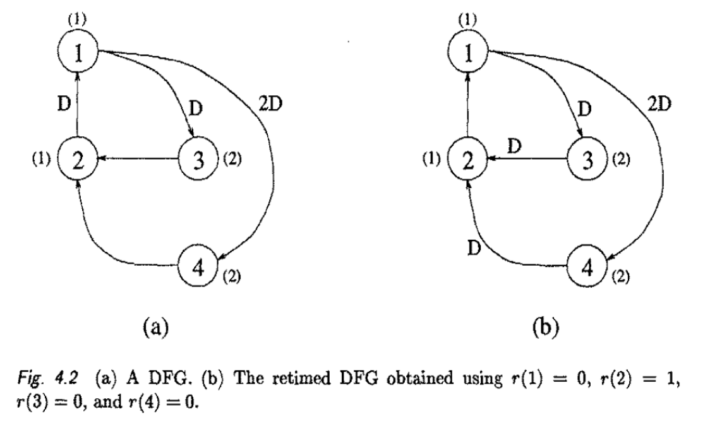<figcaption></figcaption></figure>

The retiming is to done on the operator 2 and we move the register from operator 2's output to two of its inputs.

* $$\omega(4,2)=0+1-0=1$$
* $$\omega(3,2)=0+1-0=1$$
* $$\omega(2,1)=1+0-1=0$$

All of the retimed edges on the operator 2 is bigger than or equal to 0, meaning that our retiming is valid!



#### Properties of Retimed Paths

Before defining properties, we generalize edge concepts to entire paths ($$U \rightarrow V$$).

* **Path Definition**: A sequence of consecutive edges from vertex $$U$$ to $$V$$.
* **Path Weight** $$W(U \rightarrow V)$$: The total number of registers along the path.
  * Calculated as the sum of all individual edge weights: $$\sum w(e)$$.
* **Path Combinational Delay** $$D(U \rightarrow V)$$: The total I/O delay along the path, ignoring registers.
  * Calculated as the sum of combinational delays of all vertices in the path: $$\sum t(e)$$.
* **Cycle**: A closed path where the start and end vertices are the same ($$U \rightarrow U$$).

Now, we introduce the four properties



#### Path Weight Dependence

The number of registers on a **path** changes based _only_ on the retiming of its **start** and **end** points, regardless of internal changes.

$$
w_{retimed}(V_1 \rightarrow V_N) = w_{original}(V_1 \rightarrow V_N) + r(V_N) - r(V_1)\tag{1}
$$

Internal node movements cancel out mathematically; only registers moved across the "head" ($$V_1$$) and "tail" ($$V_N$$) affect the total count.



#### Invariance of Registers in Loops

Retiming **never changes** the total number of registers in a closed loop (cycle). This is because the start and end vertex are the same ($$V_1 = V_N$$), the term $$r(V_N) - r(V_1)$$ becomes zero in Eq(1).



#### Invariance of [Iteration Bound](lec-02b-rtl-transformations.md#iteration-bound-1)

Because the number of **registers in loops** (Property 2) and the **logic delays** remains constant, the fundamental speed limit of the circuit (Iteration Bound) **does not change**.



#### Invariance to Constant Addition

Adding the same constant integer $$k$$ to the retiming vector $$r(V)$$ for _every_ node $$V$$ results in the exact same network. This is because the difference $$r(V) - r(U)$$ remains unchanged if both are shifted by the same amount.



### Cutset Retiming

Cutset retiming is a graphical technique used to rearrange registers across large sub-blocks of a circuit by visual inspection, rather than calculating individual node equations.

#### Definition

We have seen the definition of cutset from [above](lec-02b-rtl-transformations.md#cutset). To do the retiming, we apply a constant retiming shift ($$k$$) to the entire subgraph $$G2$$, while leaving $$G1$$ unchanged.

* $$r(V) = k$$ for all vertices in $$G2$$.
* $$r(V) = 0$$ for all vertices in $$G1$$.

<figure>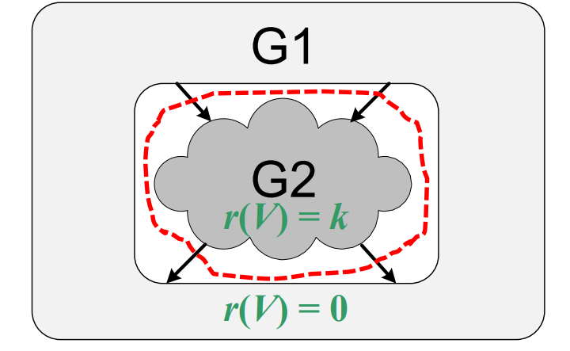<figcaption></figcaption></figure>

This operation only affects the weights of the **cutset edges** (edges connecting $$G1$$ and $$G2$$). Internal edges within $$G1$$ or $$G2$$ are unchanged.


Cutset retiming doesn't need the cutset to be **feedforward** because we are not doing **register insertion** here.


#### The Transformation Rules

Since we apply $$r(V)=k,\forall~V\in G_2$$, we can get the following two cases based on the **positivity** of $$k$$.



#### **Case A: Backwards Retiming** ($$k > 0$$)

To illustrate it clearly, we can see the following graph.

<figure><figcaption></figcaption></figure>

So, when k > 0, we can see that it is either we

1. Move the cutset register D from the cutset edge V3 -> V6 to the normal edge V2 -> V3, or
2. Move the <mark style="color:green;">green register D</mark> from the normal edge V1 -> V2 to the cutset edges V4 -> V1 and V5 -> V1.

This rule gives us a very powerful technique, which is that

> We can pull delays/registers from **G2**'s **output** to **input** without affecting the functionality.



#### **Case B: Forward Retiming (**$$k<0$$**)**

This will be just the reverse process of case A.

<figure><figcaption></figcaption></figure>

So, when k < 0, we can see that it is either we&#x20;

1. Move the two registers on the cutset edges V4 -> V1 and V5 -> V1 to normal edge V1 -> V2
2. Move the <mark style="color:green;">green register</mark> on normal edge V2 -> V3 to the cutset edge V3 -> V6.

This rule again gives us a very powerful technique, which is

> We can pull delays/registers from **G2**'s **input** to **output** without affecting the functionality.



#### Feasibility Condition

Retiming is only legal if we do not end up with a **negative number** of registers on any wire. Therefore, the number of registers we wish to move ($$k$$) is limited by the available registers on the edges we are removing from. The formula is

$$
-\min_{e \in G1 \rightarrow G2} w(e) \le k \le \min_{e \in G2 \rightarrow G1} w(e)
$$

The **intuition** is that:

* **Upper Bound** ($$k > 0$$): We cannot pull (remove) more registers from the outputs ($$G2 \rightarrow G1$$) than the minimum currently existing on any of those **output cutset** edges.
* **Lower Bound** ($$k < 0$$): We cannot push (remove) more registers from the inputs ($$G1 \rightarrow G2$$) than exist on the **input cutset** edges.

#### Practical Application

This generalizes the [basic node retiming rule](lec-02b-rtl-transformations.md#fundamental-transformation) we have seen from above. Instead of moving a register across a single operator, we treat the entire subgraph $$G2$$ as a "super-node" and move registers across its boundary.

<figure>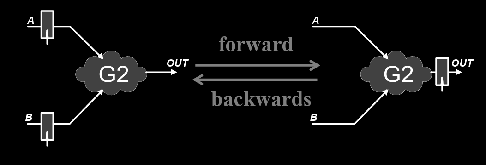<figcaption></figcaption></figure>


This is the **most important** application that we should take away from this whole section about **cutset** **retiming**! It will be pretty useful in the RTL transformations we are going to talk about later.


## RTL Transformation

Up till now, we are equipped with several skills

1. Feedforward Cutset Insertion
2. Cutset Retiming (The most important one is the [practical application](lec-02b-rtl-transformations.md#practical-application-1) above)
3. N-Slowing insertion

We will now use these skills to start getting our hands "dirty"!

### Repipelining

The first RTL Transformation technique that we will learn is **repipelining**. Repipelining is a technique to increase the clock frequency (performance) of a design by adding new pipeline stages, rather than just rearranging existing ones. It is equivalent to [**register insertion** at I/O + **retiming**](#user-content-fn-13)[^13].

* **Goal**: Reduce the minimum clock cycle ($$T_{CK}$$) by breaking up long combinational paths.
* **Trade-off**: Unlike standard retiming (which is iso-latency), repipelining increases the latency in clock cycles. The total latency (in clock cycles) from Input to Output increases by $$k$$ cycles.

#### Graph Theory View

Repipelining is considered a **special case of cutset retiming** where the cutset is **strictly feedforward**.

<figure>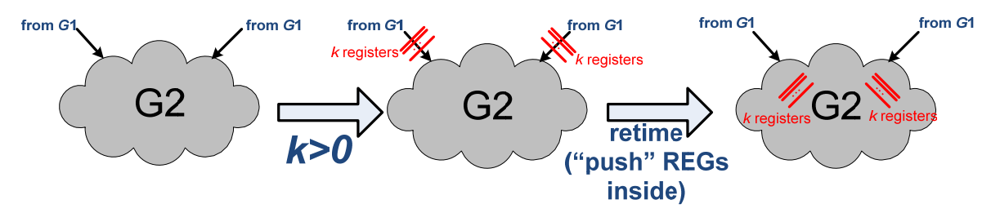<figcaption></figcaption></figure>

Edges exist from $$G1 \to G2$$, but no edges exist from $$G2 \to G1$$.


Loops can exist _internally_ within $$G1$$ or $$G2$$, but the gaussian surface itself **cannot** cross a loop because we are doing **register insertion** here. The existence of the  loop also **limits** the maximum clock frequency we can achieve (see more from the [#loop-bound](lec-02b-rtl-transformations.md#loop-bound "mention"))


#### The Transformation Procedure

In repipelining, we cannot **simply move** existing registers. We must **introduce new ones** and then distribute them.

* **Insertion**: Add $$k$$ registers at the boundary (e.g., at all inputs going from $$G1$$ to $$G2$$).
* **Retiming ("Pushing")**: Use retiming to move these new registers from the boundary into the internal logic of $$G2$$ to balance delays.
  * **Modeling:** To push registers forward (from Input -> Internal), we apply a negative retiming vector $$r(V) = -k$$ to the vertices in $$G2$$.
  * _**Logic Check:**_ A negative $$r(V)$$ removes registers from the node's input (absorbing the ones we just added) and pushes them to the node's output.

#### Constraints

We model Inputs and Outputs as absolute boundaries (Source/Sink). We cannot "borrow" registers from the external environment, nor can we "push" our registers into it. So the procedure is

* **Modify**: We deliberately break the latency preservation rule by adding $$k$$ new registers at the Input boundary.
* **Optimize**: We then use retiming to push these new registers inward (using $$r(V)=-k$$) to balance the internal logic delays.

#### Practical Application

Let's practice the repipelining on the gaussian filter.

<figure>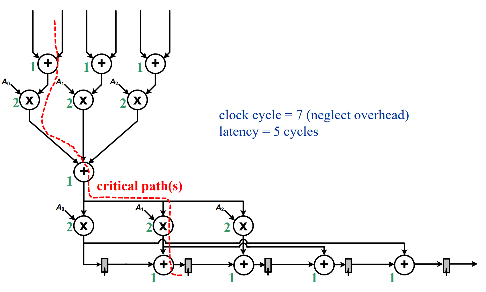<figcaption></figcaption></figure>

In this gaussian filter, the clock cycle = 1 + 2 + 1 + 2 + 1 = 7 while the latency is 5 cycles because there are 5 registers in total for the inputs to get the complete correct output.

1. **First optimization**: Reduce clock cycle by keeping only one operator per cycle, at the cost of increased latency in terms of clocked cycles.

We start by adding 4 registers at each input because we notice there are 4 operators.

<figure>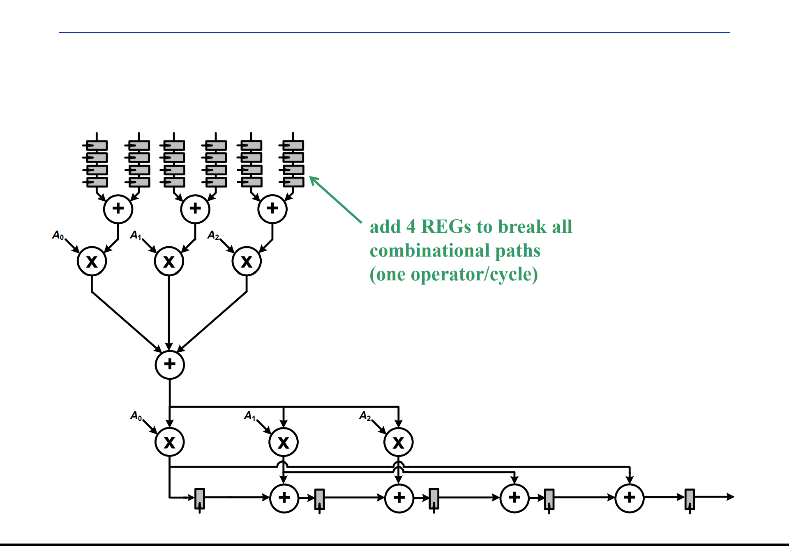<figcaption></figcaption></figure>

This is done by applying the [#cutset-retiming](lec-02b-rtl-transformations.md#cutset-retiming "mention") or simply the [#feedforward-cutset-register-insertion](lec-02b-rtl-transformations.md#feedforward-cutset-register-insertion "mention") technique we have learned, our final clock cycle is 2 because the critical path would be the multiplier which takes two cycles while the latency is 4+5=9 cycles.


The reason for only **one register** added above the second level of multipliers instead of 3 is because of [**register sharing**](https://app.gitbook.com/s/W45nwClYZdzz9MQG1dUb/textbook-micheli/sequential-logic-optimization/sequential-circuit-optimization-using-network-models#register-sharing) we have learned in EE4218.


2. **Second optimization**: As the critical path now is the multiplier, we have seen an obvious **imbalance** in the pipeline. Let's try further optimize the multiplier by adding two registers to break the multiplier into two stages. (The goal here is to **balance the pipeline design**)


Add two registers because we have two "groups" of multipliers.


<figure>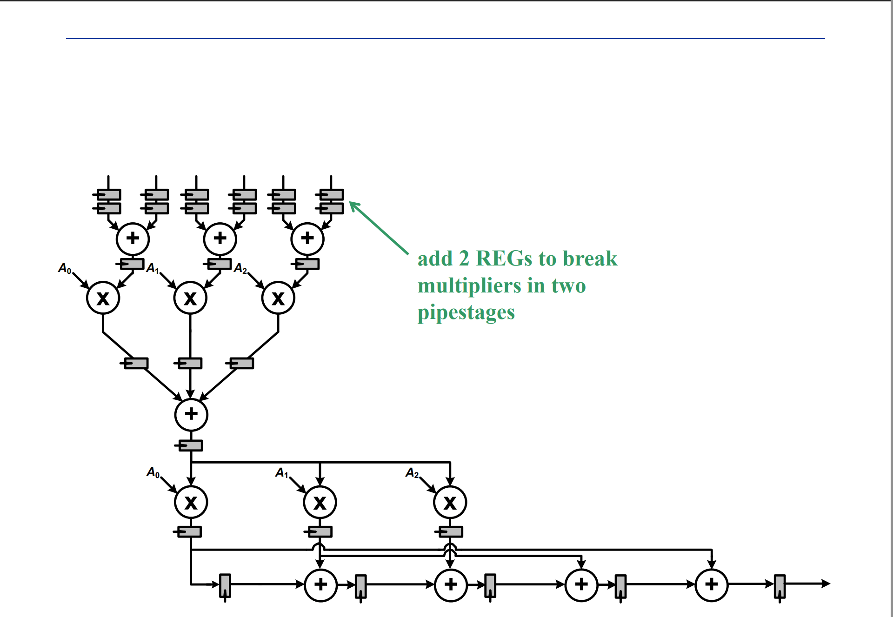<figcaption></figcaption></figure>

Now the clock cycle becomes 1, which is obvious and as we want. The latency becomes 9+2=11.

3. **Third optimization**: Further reduce clock cycle to 0.5. To do so,
   1. Adder (Both top and bottom) should be divided into 2 stages -> 1 register/adder (Add 1 register)
   2. Multiplier should be divided into 4 stages -> 3 registers/multiplier (Add 2 registers)

We first deal with the top adder and multiplier, as we have 2 "groups" of adder and multiplier at the top, we first add 2+2x2=6 registers.

<figure>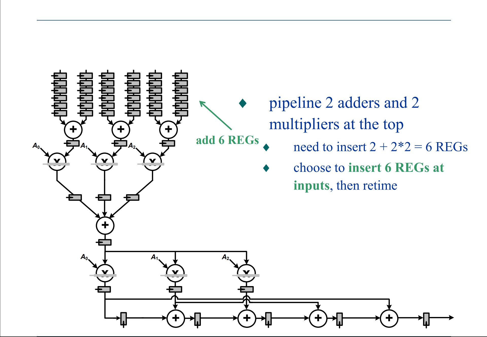<figcaption></figcaption></figure>

Then we deal with the bottom four adders. We add 4 registers at the output and then push it back because it is much easier.

<figure>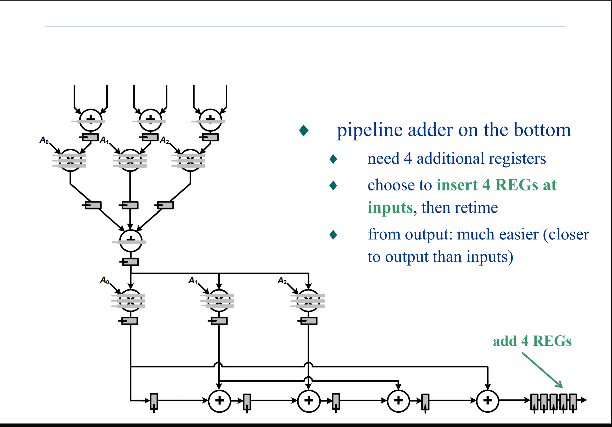<figcaption></figcaption></figure>

Lastly, we achieved the 0.5 clock cycle and as we have added 4+6=10 more registers, the latency becomes 11+10=21. One thing worht noting here is that the latency measured in **clock cycles** increase, but if we are interested in the latency measured in **seconds**, the result will be **smaller** as our clock cycle time **drops a lot**!


When drawing the **gaussian surface** here, notice that the **gaussian surface**

1. can **cross** the **operator**
2. should **cross** as **few** edges **as possible** according to the **min-cut rule** mentioned above.


> TODO: Add the DFG version to understand deeper on how to form the partition and find the cutset.

### Time Interleaving

Another RTL transformation skill is called **time interleaving**, which utilizes the [N-slowing](lec-02b-rtl-transformations.md#n-slowing-insertion) technique we have covered above to first replace each register with $$N$$ cascaded registers and then retime it.


Time interleaving is a technique to process $$N$$ independent data streams on a single hardware block at a $$N$$-time faster clock frequency (in ideal case) by utilizing pipeline "slots" created through register replacement.


#### The Transformation Procedure

**Step 1**: $$N$$**-Slowing**

* Replace every single register in the original design with $$N$$ **cascaded registers**.
* Result: This creates an "$$N$$-slow" version of the circuit. The system now takes $$N$$ clock cycles to do what the original system did in 1 cycle (time dilation).

**Step 2: Retiming**

* Use the newly added registers to perform **Retiming**. Distribute these extra registers into the combinational logic to break critical paths.
* Result: Optimally, after inserting $$N$$ registers and well-balance the logic, we will have a $$N$$-time faster **clock frequency**.


In the second step, we assume that the pipelined stages can be **well-balanced**, which is not practical in real world though.


#### Practical Example

Let's optimize our MAC to be a unit that is "2-slowed" to process two datasets simultaneously (e.g., audio left/right channels).

1. **Step 1:** The accumulator register is replaced by 2 registers.
2. **Step 2:** One of these registers is retimed (moved) into the middle of the multiplier/adder logic.

<figure>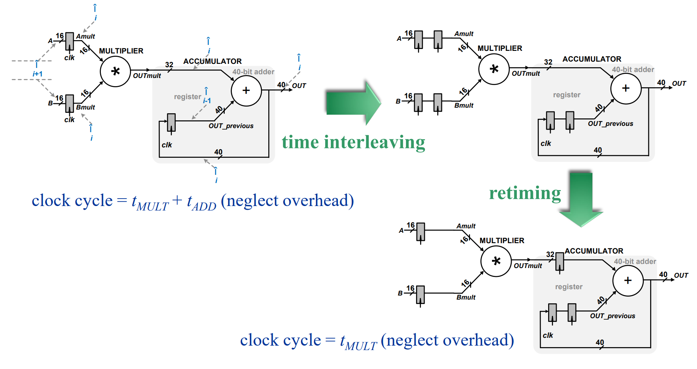<figcaption></figcaption></figure>

After applying the time interleaving technique, we achieve that:

* The critical path is cut significantly (from $$t_{\text{MULT}} + t_{\text{ADD}}$$ to just $$t_{\text{MULT}}$$).
* The system can now run at nearly double the frequency, processing two streams with the same hardware area footprint (plus a few flip-flops).


Another application is that in the microprocessor, time interleaving effectively implements the SIMD concept, as it performs the same operation on multiple independent data. The **commercial term** using for time interleaving on microprocessor is called **hyper-threading**.


#### PPA Analysis

After knowing what is **time interleaving** and how it works, we can now analyze its impact.



#### Performance (Throughput)

Time interleaving allows the clock frequency to increase by a factor of $$N$$ (optimistically), but each individual data stream (channel) can only use the hardware once every $$N$$ cycles.

$$
\frac{\text{Throughput}_{\text{interleaved}}}{\text{Throughput}_{\text{original}}} = \frac{\text{OPC}_{\text{interleaved}} \cdot f_{\text{CK, interleaved}}}{\text{OPC}_{\text{original}} \cdot f_{\text{CK, original}}} = \frac{1/N \cdot (N \cdot f)}{1 \cdot f} = 1
$$

, where OPC is **O**perations **P**er **C**ycle.


We are utilize the definition of throughput (opeartions per second) to get

<p align="center"><span class="math">\text{throughput}=\text{ops/s}=\text{ops/cycle}\times\text{cycle/s}=\text{OPC}\times\text{frequency}=\text{OPC}\div T_{CK}</span></p>


* **Throughput per Channel**: Remains unchanged.
  * The clock is $$N$$ times faster, but we wait $$N$$ cycles for each turn. These factors cancel out.
* **Overall System Throughput:** Increases by Factor $$N$$.
  * To make this concrete, consider a system without time interleaving, where a single channel is processed by the processor at a clock rate of 100 MHz. After applying time interleaving with a factor N=4, the effective clock rate increases to 400 MHz. As a result, within the same time, the processor can sequentially handle data from four different channels, effectively achieving four-channel throughput.



#### I/O Latency (Input-to-Output Delay)

Because every single register in the original design is replaced by a chain of $$N$$ registers, the time it takes for one piece of data to travel from input to output increases proportionally.

$$
\frac{LAT_{\text{interleaved}}}{LAT_{\text{original}}} = N
$$

* **Impact:** Latency degrades (increases) linearly with $$N$$.



#### Area

Unlike full parallelism (which copies the huge combinational logic blocks), Time Interleaving only copies the **Registers**. Therefore, the area penalty depends on how "register-heavy" the original design was.

$$
\frac{A_{\text{interleaved}}}{A_{\text{original}}} = \frac{A_{\text{COMB}}+N\cdot\sum A_{\text{REG,i}}}{A_{\text{COMB}}+\sum A_{\text{REG,i}}} =1 + (N-1) \cdot \frac{\sum A_{\text{REG},i}}{A_{\text{COMB}} + \sum A_{\text{REG},i}}
$$

* **Impact:** Area increases, but usually by much less than $$N$$ (since combinational logic $$A_{COMB}$$ dominates).
* The term on the right represents the **percentage** of total area used by registers in the **original design**. If registers take up small space, the area cost of $$N$$-slowing is negligible.



#### Energy

Similarly, the combinational logic energy is unchanged (shared across streams), but we burn extra power clocking the additional registers.

$$
\frac{E_{\text{interleaved}}}{E_{\text{original}}} = \frac{E_{\text{COMB}}+N\cdot\sum E_{\text{REG,i}}}{E_{\text{COMB}}+\sum E_{\text{REG,i}}}= 1 + (N-1) \cdot \frac{\sum E_{\text{REG},i}}{E_{\text{COMB}} + \sum E_{\text{REG},i}}
$$

* **Impact:** Energy per operation increases slightly due to the extra registers.
* The penalty depends on the **clocking power as a % of total power** in the original design. If the registers consume very little power compared to the math logic (e.g., complex multipliers), this technique is very energy efficient.



#### Time Interleaving vs. Parallelism

Now we compare time interleaving with parallelism. This comparison evaluates whether it is better to speed up a system by "stretching" time (Interleaving) or by simply copying the hardware (Parallelism).



#### Performance (Throughput)

Both techniques achieve the exact same **Total Throughput** (aggregate operations per second), assuming the logic is perfectly balanced.

$$
\frac{\text{Throughput}_{\text{interleaved}}}{\text{Throughput}_{\text{parallel}}} 
= 
\frac{T_{\text{CK,parallel}} \cdot \text{OPC}_{\text{interleaved}}}{T_{\text{CK,interleaved}} \cdot \text{OPC}_{\text{parallel}}} 
= 
\frac{T_{\text{CK,original}} \cdot \text{OPC}_{\text{original}}}{\left(T_{\text{CK,original}}/N\right) \cdot N \cdot \text{OPC}_{\text{original}}} 
= 1
$$

* **Interleaving:** The clock ($$T_{CK}$$) runs $$N$$ times faster, but it processes a single channel only once every $$N$$ cycles.
* **Parallelism:** The clock runs at the original slow speed, but there are $$N$$ hardware units working simultaneously ($$N \cdot \text{OPC}$$).
* **Result:** These factors cancel out, resulting in a ratio of 1. They provide the same total processing power.


#### Important Distinction

* **Interleaving:** We _must_ have $$N$$ **independent channels** to fill the slots. The throughput _per channel_ is the same as the original single unit.
* **Parallelism:** We have the flexibility to use the hardware to process one channel faster (splitting data) or $$N$$ channels at normal speed. This part notes that "throughput/channel is increased by $$N$$ only when we use all the $$N$$ parallel processing units to process that single channel" (assuming resources are dedicated to it).




#### I/O Latency

Parallelism is significantly superior for Latency. Time Interleaving degrades latency because the data path is longer (more registers).

$$
\frac{\text{LAT}_{\text{interleaved}}}{\text{LAT}_{\text{parallel}}} = N
$$

* **Parallel:** Latency is the same as the original design (1x). Data flows through the logic in 1 cycle (or original pipeline depth).
* **Interleaved:** We replaced every register with $$N$$ registers. Therefore, it takes $$N$$ times as many clock cycles for data to traverse from Input to Output.



#### Area

This is one reason to use Time Interleaving. It is **much smaller** than Parallelism.

$$
\begin{align*}
\frac{A_{\text{interleaved}}}{A_{\text{parallel}}}
&= 
\frac{A_{\text{COMB}} + N \cdot \sum A_{\text{REG},i}}{N \cdot (A_{\text{COMB}} + \sum A_{\text{REG},i})} \\
&\approx 
\left( 1 + N \cdot \frac{\sum A_{\text{REG},i}}{A_{\text{COMB}}} \right)
\cdot
\left( 1 - \frac{\sum A_{\text{REG},i}}{A_{\text{COMB}}} \right)
\cdot \frac{1}{N} \\
&\approx 
\frac{
  1 + (N-1) \cdot \dfrac{\sum A_{\text{REG},i}}{A_{\text{COMB}}}
}{N}
\end{align*}
$$


From the first line to the second line, we use the property that: If $$x\ll1$$

<p align="center"><span class="math">\frac{1}{1+x}\approx1-x</span></p>


* **Parallelism Cost**: We copy the entire circuit $$N$$ times (Logic + Registers). Area scales by $$N$$.
* **Interleaving Cost**: We only copy the Registers $$N$$ times. We share the single block of Combinational Logic ($$A_{COMB}$$).
* **Result:** The ratio is roughly $$1/N$$. If the combinational logic is large (e.g., a complex multiplier). Interleaving saves a massive amount of silicon area compared to parallelism.



#### Energy

Again, here we are considering **energy per operation**. **Parallelism** is **slightly better** for energy. **Interleaving** has an overhead due to the extra registers.

$$
\frac{E_{\text{interleaved}}}{E_{\text{parallel}}}
=
\frac{E_{\text{COMB}} + N \cdot \sum E_{\text{REG},i}}{E_{\text{COMB}} + \sum E_{\text{REG},i}}
\approx
1 + (N-1) \cdot \frac{\sum E_{\text{REG},i}}{E_{\text{COMB}}+\sum E_{\text{REG,i}}}
$$

* **Parallel:** Energy per operation is constant. We do $$N$$ ops on $$N$$ units, consuming $$N$$ energy, but per-op energy is unchanged.
* **Interleaved:** We still do the math ($$E_{COMB}$$), but we must power $$N$$ times more registers. The term $$(N-1)$$ represents the energy penalty from clocking those extra registers.



#### A Microprocessor Example

One real-world example is the Intel Atom. This real-world example demonstrates **Time Interleaving** ($$N=2$$) implemented as Simultaneous Multi-Threading.

<figure>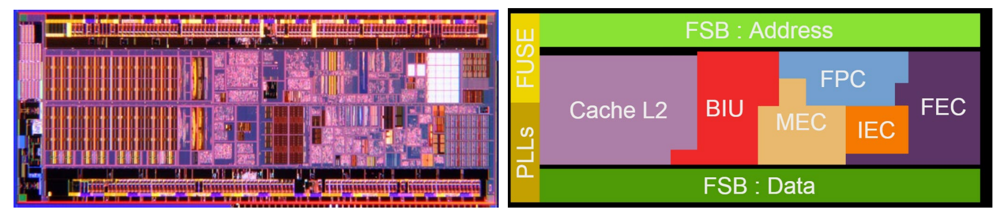<figcaption></figcaption></figure>

* **Implementation:**
  * Technique: 2-slowing with Register File replication ($$N=2$$) while sharing execution units.
  * Baseline: In a single core, registers consume only \~10% area and \~20% energy.
* **Results (Trade-offs):**
  * **Performance**: +49% (limited by [**structural hazards**](https://app.gitbook.com/s/jTJFBPtKk6NwweAooH53/lec/lec-05-the-pipelined-processor#structural-hazards) rather than perfect 100%).
    * The ideal case of performance improvement is 100% as the factor N=2 in this case.
  * **Area**: +8% (Minimal cost since only the register file is replicated).
    * The ideal case of area usage increase is $$1+0.1=1.1\times$$, so around 10% more usage.
  * **Energy**: +17-19% (At iso-throughput).
    * The ideal case of energy usage is $$1+0.2=1.2\times$$, so around 20% more usage.
* Key Insight: $$N$$-slowing provides significant speedup (\~1.5x) with very low area cost (<10%) when registers are a small fraction of the total design.

## General Procedure for RTL Rearrangement

This procedure outlines the systematic approach to optimizing an existing RTL design.



#### Define Modification Goals

* Determine exactly where registers need to be added, removed, or moved, or how many hardware replicas are required.
* These decisions are driven by the **specific target improvements** (or acceptable penalties) in **Performance (Throughput and latency), Power (Energy), Area** relative to the original RTL.



#### Select RTL Transformation

* Identify the correct transformation(s) to achieve the goal set in Step 1.
* Available techniques include **repipelining**, **retiming**, **parallelism**, and **time-interleaving**.


These techniques can also be applied in inverse (e.g., Register Removal, reducing the degree of Parallelism or Interleaving) to reduce area or power consumption.




#### Apply Transformation

Execute the chosen transformation on the original RTL structure.



### Combining RTL Transformations

**Normalization:** All metrics (Area, Throughput, Energy) are normalized to the [**Original RTL**](#user-content-fn-14)[^14] ($$=1$$).

<figure>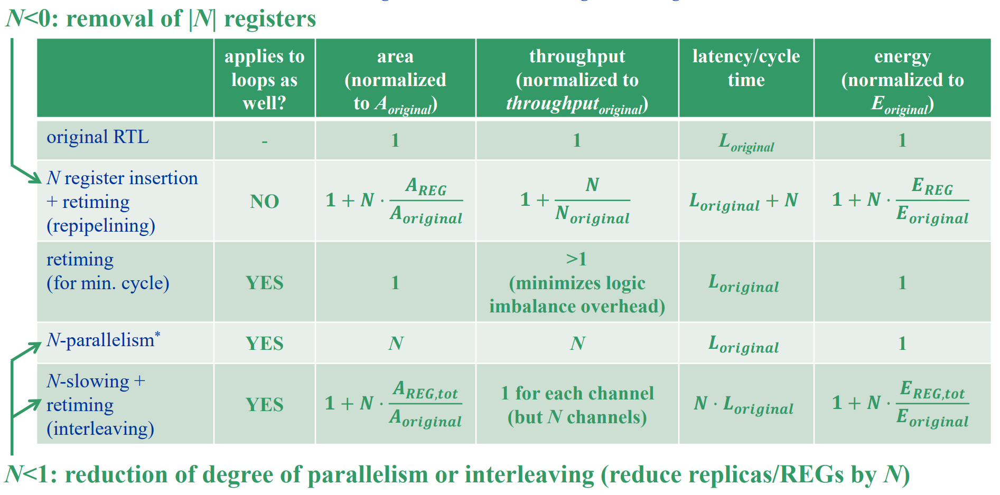<figcaption></figcaption></figure>


Repipelining **includes** pipelining and if the original RTL is pipelined, the N<sub>original</sub> is number of pipeline stages. If it is non-pipelined, the N<sub>original</sub> is just 1. And the PPA analysis for repipelining is the **same as** the [PPA analysis of pipelining](lec-02a-pipelining.md#performance-analysis).


* $$N > 0$$: Standard application (Insertion, Parallelism, Interleaving).
* $$N < 0$$ (for Repipelining): Represents the removal of $$|N|$$ registers.
* $$N < 1$$ (for Parallelism/Interleaving): Represents a reduction in the degree of parallelism or interleaving (reducing replicas or registers by factor $$N$$).

Assumptions we have made:

* Neglect timing overhead and logic steering overhead (for parallelism).
* Perfectly balanced logic (no stalls).
* $$A_{REG}$$ and $$E_{REG}$$ are consistent across all registers (zero latch growth).

### Tips for RTL Transformations

These tips are based on the tutorial questions done during the last lecture of EE4415.

#### Input/Output modeling

In a DFG given in this course (EE4218 might have a different version of DFG), we assume that there is always **one** register at the **input and output**.

<figure>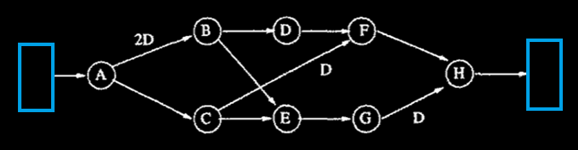<figcaption></figcaption></figure>

For example, in the DFG above, when looking at this problem, our first thing is to draw <mark style="color:blue;">**two registers**</mark> at the input and output.


#### Input and Output registers in N-slowing

In N-slowing, the registers at the input and output should **each** be replaced by **N-cascaded** registers. Don't forget this!


#### Steps to do RTL Transformation

When we do every RTL transformation problems, it is recommended to follow the three steps as follows,

1. Check the **iteration bound** to see if it is possible to reach the specification set in the problem.
2. **Know** where to put extra registers on our critical path to achieve that specification
   1. If these extra registers are put **in a loop**, we know for sure that **only retiming** can be done in the loop.
   2. This step is also known as **transforming** our **critical path** and it will give us some hint on what registers to move during the RTL transformations.
3. Do the RTL Transformation.

[^1]: We can think of a **multi-rate system** as one that operates with **more than one clock**, with different parts of the system running at different rates.

[^2]: This is based on the assumption that we have already squeezed out the performance of the design by **well balancing** the non-loop components of the system.

[^3]: or equivalently speaking, the **maximum clock frequency**.

[^4]: But for the actual latency, which is measured in **time**, adding registers and then well-balance the circuit usually will give similar or smaller latency.

[^5]: This is the **weight** of the cutset edge.

[^6]: the digital module in the figure above

[^7]: This is the latency introduced to steer inputs to replicas.

[^8]: This is because of the first property of retiming we mentioned above, which is to preserve the **I/O cycle-based** timing.

[^9]: 

    This means the same output at the end of the cycle. For example,

    * **Before Retiming**: Input A and B arrive -> Wait 1 cycle -> Add -> Output.
    * **After Retiming**: Input A and B arrive -> Add immediately -> Wait 1 cycle -> Output.

    Both approach will give us the same output.

[^10]: same as saying that specific logic block.

[^11]: Later we will generalize **edge** to **path**.

[^12]: It means that $$r(V)-r(U)$$ is **negative**, and $$r(U)-r(V)$$ is positive.

[^13]: You can do this even faster by just doing the feedforward cutset insertion. The only problem might be finding the correct cutset.

[^14]: Here, the original RTL can be any type, pipelined or non-pipelined. It doesn't matter.
