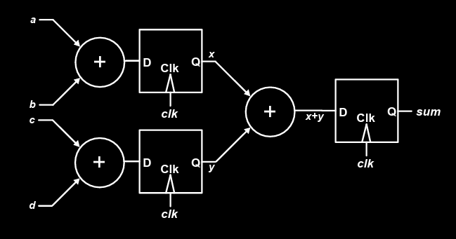

# Lec 03b - Verilog Fundamentals

At this point, we should be very familiar with the Verilog. So, the focus of this section will be

> Know how different statements written in Verilog are synthesized and how they are related to the powerful [RTL Transformation](../lec-02/lec-02b-rtl-transformations.md) skills we have learned.

## Verilog Coding

### Basic Verilog Concepts

### Comments

A small tip for coding comments style:

* Use single line comments (`//`) for comments.
* Reserve multi-line comments (`/* */`) for commenting out a section of code.

#### Identifiers

**Identifiers** are **names** assigned by the **user** to **Verilog objects**, such as **modules**, **variables**, and **tasks**.

#### Logic Values

**Verilog** has **four logic values**:

* **‘0’** represents **zero**, **low**, **false**, or **not asserted**.
* **‘1’** represents **one**, **high**, **true**, or **asserted**.
* **‘z’** or **‘Z’** represents a **high-impedance value**, often treated as an **unknown (‘x’)** in many contexts.
* **‘x’** or **‘X’** represents an **uninitialized** or **unknown logic value**, which may correspond to **‘0’**, **‘1’**, **‘z’**, or a value in **transition**.

#### Data Types

**Verilog** has **three data type classes**:

* **Nets** – represent **physical connections** between **devices**.
* **Registers** – represent **storage devices** or **variables**.
* **Parameters** – represent **constants**.



#### Nets

The `wire` data type in **Verilog** represents a **wire** in an **ASIC** and **cannot store or hold a value**. A **wire** must be **continuously driven** by an **assignment statement**, and its **default initial value** is **‘z’**. Most common net types are

* `wire` and `tri`
* `supply1`  and `supply0` (which are equivalent to the positive and negative power supplies respectively)



#### Registers

A **register** data type in **Verilog** is declared using the keyword **reg** and is comparable to a **variable** in a **programming language**.


Not all `reg` type variables are **always equivalent** to a hardware register, flip-flop or latch. (See when the physical registers will be inferred from [DDCA](https://app.gitbook.com/s/jTJFBPtKk6NwweAooH53/lec/lec-02-digital-system-design-and-verilog#when-are-physical-regs-inferred))


The default initial value for a reg is 'x'.



#### Parameters

Just the **constants** in Verilog.



#### Numbers

The number in verilog are represented using `<size>'<base><value>`.

* `<size>` is the number of **bits**.


One tricky example is that `2'ha5` will be truncated to `2'b01`.


### Code Structure

#### Design Entities

The **module** is the **basic unit of code** in the **Verilog language**. It should have the following structure


```verilog
module <name> (<port_names>);
    // Port declarations
    ...
    
    // Data type declarations
    ...
    
    // Functionality
    // Procedural blocks
    // Continuous assignments
    // User-defined tasks & functions
    // Primitive instances
    // Module instances
    // Specify blocks
    ...
endmodule
```




#### Basic Modeling Structure

The basic modeling structure is shown as follows:

<figure><figcaption></figcaption></figure>



#### Port Connection Rules

| Port Type | Parent Side (External Connection) | Child Side (Internal Port Declaration) |
| --------- | --------------------------------- | -------------------------------------- |
| Input     | Can be `reg` OR `wire`            | Must be `wire`                         |
| Output    | Must be `wire`                    | Can be `reg` OR `wire`                 |
| Inout     | Must be `wire`                    | Must be `wire`                         |

Think of the Parent side (external) as the place of verilog code where the **module** gets instantiated. And the Child side (internal) is the place of verilog code where the **module** is implemented.



#### User-Defined Primitives

We can define **primitive gates** (a **user-defined primitive** or **UDP**) using a **truth-table specification**. The **first port** of a UDP must be an **output port**, and it must be the **only output port**; **vector** or **inout ports** are not allowed. For example,


```verilog
primitive Adder(Sum, InA, InB);
    output Sum;
    input InA, InB;
    table
        // Inputs : Output
        00 : 0;
        01 : 1;
        10 : 1;
        11 : 0;
    endtable
endprimitive
```




#### User-Defined Functions

Similar to **functions in other programming languages**, **functions in Verilog are** useful for modeling **combinational logic** (like a **subroutine**). Its syntax is shown as follows:


```verilog
function [size or type] name_of_function;
    // Input declarations
    input [size-1:0] a, b, ...;
    
    // Local variable declarations
    reg [size-1:0] tmp;

    // Statements or statement group
    statement or statement_group;
endfunction
```


**Function calls** can occur:

* Within a **continuous assignment**, e.g., `assign b = func(a);`
* Indirectly within a **module instantiation**, e.g., `mod U1 (one, func(a, b));`
* Nested within another **function**

For example,


```verilog
`define FALSE 0
`define TRUE 1

module function_ex(clk);
    input clk;
    reg r1, r2, r3;

    // Function definition
    function error;
        input [7:0] a, b, c;
        if ((a != b) && (a != c))
            error = `FALSE;
        else
            error = `TRUE;
    endfunction

    always @(posedge clk)
        if (error(r1, r2, r3))
            $display("error in reg compare");

    reg d;
    always @(posedge clk)
        d = error(r1, r2, r3);
endmodule
```


The function **`error`** returns a **value** and can be used wherever a **value** is expected in the code.



## Procedures and Assignments

#### Procedures

A **Verilog procedure** is an **`always`** or **`initial`** statement, a **task**, or a **function**.

* The **statements** within a **sequential block** (i.e., statements between a **`begin`** and **`end`**) execute **sequentially** in the order in which they appear.
* However, the **procedure itself** executes **concurrently** with other **procedures** in the design.

#### Procedural Blocks

There are two types of procedural blocks:

* **`initial` blocks** – execute **only once** at the start of simulation (not synthesizable).
* **`always` blocks** – execute **repeatedly in a loop**.


Multiple procedural blocks may exist, and they execute **concurrently**.


**Contents of procedural blocks** may include:

* **Timing controls** – specify **delays** or conditions for statement execution.
* **Procedural assignments** – assign values to **variables or registers**.
* **Programming statements** – e.g., **if-else**, **case**, **loops**.

### Procedural Assignments

Assignments made within **procedural blocks** (`always` or `initial`) are called **procedural assignments**.

* **Data types**: The **LHS** must be a **register type** (`reg`, `integer`, `real`) and **cannot be a wire** (`net`).
* **RHS**: Can be **any valid expression or signal**; its value is **transferred** to the LHS.
* **Behavior**: Can be **blocking (`=`)** or **non-blocking (`<=`)**, which affects **simulation and synthesis**.

For example,


```verilog
always @(posedge clk) begin
    a = 5;               // procedural assignment
    c = 4 * 32 / 6;      // procedural assignment
    wake_up = $time;     // procedural assignment
end
```


#### Blocking Assignments (`=`)

The **next instruction** is executed **only after completing** the previous one.

* **RHS dependency**: The **RHS** is determined by the results of **previous instructions** in the same procedure.
* **Hardware implication**: Leads to **cascaded combinational logic**.

For example,


```verilog
module adder(clk, a, b, c, d, sum);
    input clk;
    input [63:0] a, b, c, d;
    output reg [64:0] sum;

    always @(posedge clk) begin
        sum = a + b + c + d;  // blocking procedural assignment
    end
endmodule
```


The synthesis of the above block of code will be:

<figure><figcaption></figcaption></figure>


There is a register before `sum` because `sum` is defined as a `reg` and it appears in an `always @(posedge)` block. But it is **not recommended** to do so, use **non-blocking assignment `<=`**  instead!


#### Non-Blocking Assignments (`<=`)

Instructions are executed **without waiting** for the previous one.

* **RHS dependency**: The **RHS** is taken from the **values available at the event** in the **sensitivity list** (`always @`).
* **Hardware implication**: **Registers** are inserted; all outputs are **updated together** at the **end of the procedure**, independent of input evaluation order.

For example,


```verilog
module adder(clk, a, b, c, d, sum);
    input clk;
    input [63:0] a, b, c, d;
    output reg [64:0] sum;
    reg [64:0] x, y;

    always @(posedge clk) begin
        x <= a + b;      // non-blocking assignment
        y <= c + d;      // non-blocking assignment
        sum <= x + y;    // sum uses x, y from beginning of cycle
    end
endmodule
```


The synthesis of the above block of code will be:

<figure><figcaption></figcaption></figure>
