---
metaLinks:
  alternates:
    - /broken/spaces/W45nwClYZdzz9MQG1dUb/pages/WA7y8Jhya2qTsf4M0Jmf
---

# Lec 08 - Technology Mapping

As we have seen in the previous lectures, technology mapping is done in the [**logic synthesis**](https://wenbo-notes.gitbook.io/ddca-notes/lec/lec-02-digital-system-design-and-verilog#substeps) step of the ASIC/FPGA Design Flow. **Technology mapping** converts the [**technology independent network**](#user-content-fn-1)[^1] resulting from [logic optimization](#user-content-fn-2)[^2] by matching pieces of the network with the **logic cells** that are available in a **technology-dependent cell library**.


In other words, technology mapping can be thought of as the process of [**binding**](#user-content-fn-3)[^3] nodes in the network to cells in the library.


Usually, technology mapping can be divided into two categories:

1. **Library Based** technology mapping: Standard-cell based.
2. **FPGA** Technology Mapping: Look-up Table/Multiplexer based.

## Library Based Technology Mapping

The library based technology mapping uses the **standard cells** available from the standard cell library.


In EE4415, we have seen this kind of standard cell library (called [Technology library](https://app.gitbook.com/s/GFmM0S0eSJLSE772wZne/textbook-synopsys/synopsys-technology-library/technology-libraries) by Synopsys).


For example, the following figure gives an example of available standard cells in the IBM standard-cell library used for the POWER4.

<figure><picture><source srcset="../.gitbook/assets/cell-library-example-dark.png" media="(prefers-color-scheme: dark)">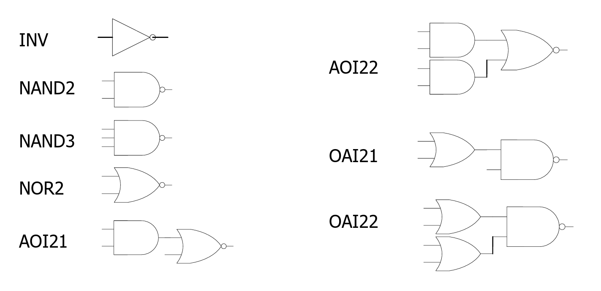</picture><figcaption></figcaption></figure>


**Basic gates and Patterns**

Inside a technology library, we can have both basic gates and patterns.

* **Basic gates**: `INV`, `NAND2`, `NAND3`, `NOR2` are the basic gates.
* **Patterns**: `AOI21`, `AOI22`, `OAI21`, `OAI22` are the patterns.


As we have seen at the very first beginning, the spirit of technology mapping is to translate logic equations into a **network** of **technology**/**standard cells**. This translation usually incorporates the following four steps:

1. **Decomposition**: Restructure the boolean function using the one or several basic functions only.
2. **Partitioning**: Partition the big network into sub-networks.
3. **Matching**: Find matches between patterns and regions of cells in the subject graph.
4. **Covering**: Use patterns to cover the subject graph and minimize the cost function


The third and fourth step might be combined together.


### Logic Decomposition

In the logic decomposition step, we must decompose the whole network using the basic gates or a.k.a primitives. Most common choices for the primitives are `NAND2` and `INV`.


The library cells must be decomposed into primitives as well!


<details>

<summary>Basic Functions vs. Pattern Trees</summary>

Inside a technology library, we can have both basic functions and pattern trees. For example,

<figure><picture><source srcset="../.gitbook/assets/base-function-pattern-dark.png" media="(prefers-color-scheme: dark)"></picture><figcaption></figcaption></figure>

</details>

For example, we can decompose a `NAND4` gate using the primitives `NAND2` and `INV` as follows.

<figure><picture><source srcset="../.gitbook/assets/decompose-nand4-dark.png" media="(prefers-color-scheme: dark)">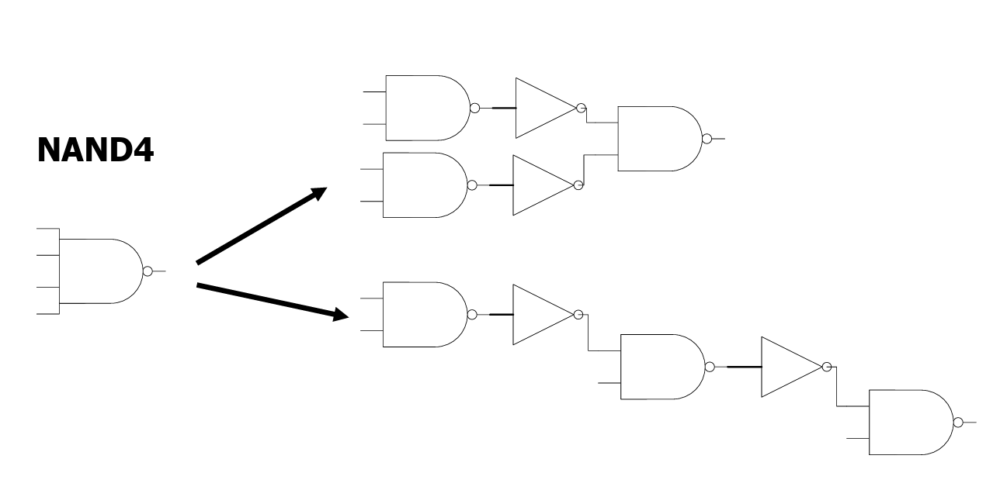</picture><figcaption></figcaption></figure>


Note that we might have more than 1 decompositions for one function!


### Partitioning

In the partitioning step, the goal is to divide the big netowrk into smaller sub-networks which are defined as **subject boolean graph**.


The restriction for the subject boolean graph is that it should be a **multiple-input, single-output** graph. Given that, when doing the partitioning, we usually separate the **high fanout** interconnection point.


For example, the following is a valid partitioning.

<figure><picture><source srcset="../.gitbook/assets/partitioning-dark.png" media="(prefers-color-scheme: dark)"></picture><figcaption></figcaption></figure>

In this partitioning, we call each one of the four partitions a **subject boolean network**.


Note that we partition based on the <i class="fa-circle-notch">:circle-notch:</i> which represents a high fanout interconnection in the network.


### Pattern Matching

Pattern matching is one of the crucial tasks for technology mapping as it determines which cells in the library **may** be used to implement a set of nodes in the subject boolean network.


We can think of **patterns** as what we have while **subject boolean networks** as what we want to achieve using the what we have — patterns.


There are two main types of matching:

1. Structural matching
2. Boolean matching

#### Structural Matching

In structural matching, we match the network with library cells **recursively** until the entire network is matched.

<figure><picture><source srcset="../.gitbook/assets/structural-mapping-example-dark.png" media="(prefers-color-scheme: dark)"></picture><figcaption></figcaption></figure>

In the structural matching algorithm, we assume and require that

* Logic decomposition is done using **only one** basic function. Assume it is the `NAND2` in our case.
* The **degree** of a node is used to indicate the number of **children** of that node.
* $$u$$ is the **root** of a **pattern graph** while $$v$$ is a vertex of the **subject graph**.

The pseudocode for the structural matching algorithm is shown below.


```c
Match (u,v){                        // Matches isomorphic graphs too
    if (u is a leaf)                // Leaf of pattern graph
        return (true);
    else {
        if (v is a leaf)            // Leaf of subject graph
            return (false);
        if (degree(v)≠degree(u))    // Different gate
            return (False);
        if (degree(v)==1) {
            uc = child of u;
            vc = child of v;
            return (Match(uc, vc)); // Recursive call
        }
        else {
            ul = left child of u;
            ur = right child of u;
            vl = left child of v;
            vr = right child of v;
            // The Pattern can be flipped
            return ((Match(ul, vl) AND Match(ur,vr)) OR (Match(ur,vl) AND Match(ul,vr)));
        }
    }
}
```



The whole spirit of this algorithm is that if the root of the pattern is a leaf, it is okay. If the root of the pattern is **not** a leaf, but the vertex is a leaf, that is **not okay**.&#x20;


And this recursive structural matching algorithm is run in an outer loop which traverses our giant unmapped network. At every **single gate**, it pauses, treats that gate as a temporary "root" (`v`), grabs a library cell (`u`), and fires off the recursive algorithm to see if the tree structure extending backward from `v` exactly matches the tree structure extending backward from `u`. And the pseudocode for the outer loop can be shown as follows:


```
For every node 'n' in the Entire Network:
    For every library cell 'c' in the Library:
        Let u = root of 'c'
        Let v = node 'n'
        
        If Match(u, v) is true:
            Record that cell 'c' can perfectly cover the logic ending at node 'n'
```


Below is an example of the structural pattern matching:

<figure>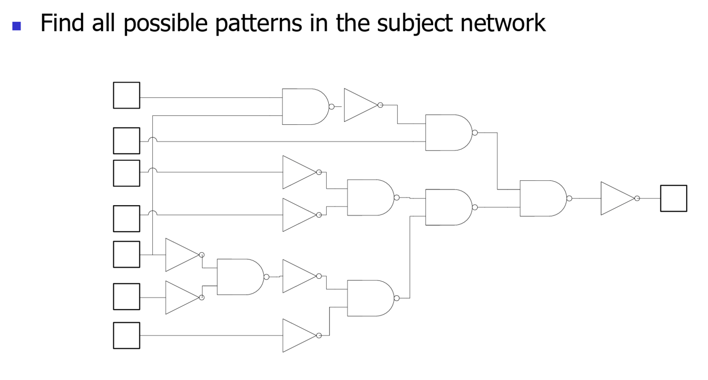<figcaption></figcaption></figure>

However, one of the biggest problems with structural pattern matching is that while structural matching definitely indicates that functional matching, functional matching doesn't necessarily indicate strucutral matching. For example, the following two expressions are functionally matched but they are not structurally matched.

<figure><picture><source srcset="../.gitbook/assets/problem-structural-matching-dark.png" media="(prefers-color-scheme: dark)">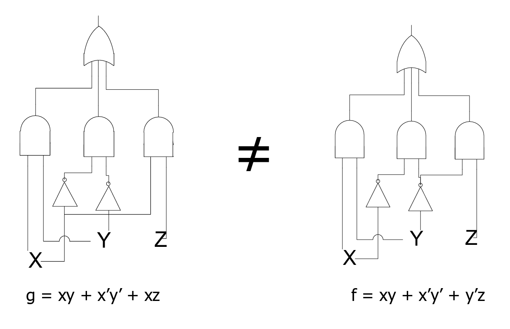</picture><figcaption></figcaption></figure>

This inspires us to look at the second matching algorithm, which is boolean matching.

#### Boolean Matching

Instead of relying on matching structurally, boolean matching relies on matching the pattern **logically**.


Boolean matching is **decomposition independent**.

* Structurally matched pattern are also logically equivalent.
* Two logically equivalent patterns may have different structures.


In boolean matching, let's consider a **cluster function** $$f$$ (our subject graph) with $$n$$ input variables and a **pattern function** $$g$$ with $$m$$ cell inputs.

<figure><picture><source srcset="../.gitbook/assets/cluster-vs-pattern-cell-dark.png" media="(prefers-color-scheme: dark)">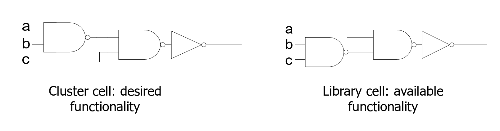</picture><figcaption><p>Example of Cluster Function (Cluster Cell) and Pattern Function (Library cell)</p></figcaption></figure>

Matching of two functions $$f$$ and $$g$$ involves **comparing two functions for equivalence** and **finding an assignment** of the cluster variables to pattern inputs. When doing the function equivalence check, we can have three methods:

1. Permutation of the Input Variables
2. Negation of Input Variables
3. Negation of Output

<details>

<summary>Examples of the function equivalence check</summary>

1. **Permutation of the Input Variables (P-equivalence)**: This means two functions compute the exact same logic if you simply cross or swap the input wires.
   * Library Cell (Pattern): `f(A, B) = A & ~B` _(An AND gate with the second input inverted)_
   * Network Logic (Subject): `g(X, Y) = ~X & Y`
   * The Match: These are P-equivalent. The tool doesn't need a custom cell for `g`; it just uses cell `f` and physically **routes** wire `Y` to pin `A`, and wire `X` to pin `B`.
2. **Negation of Input Variables**: This means the functions match if you insert an inverter on one or more input wires.
   * Library Cell (Pattern): `f(A, B) = A & B` _(A standard AND gate)_
   * Network Logic (Subject): `g(X, Y) = ~X & ~Y` _(Which evaluates to a NOR gate due to De Morgan's Law)_
   * The Match: These match under input negation. If the library has spare inverters, the tool can implement the NOR logic by routing inverted `X` and `Y` signals into the standard AND cell.
3. **Negation of Output**: This means the functions match if you invert the final output signal.
   * Library Cell (Pattern): `f(A, B) = A & B` _(A standard AND gate)_
   * Network Logic (Subject): `g(X, Y) = ~(X & Y)` _(A standard NAND gate)_
   * The Match: These match under output negation. The tool uses the AND cell and tacks an inverter onto its output pin to perfectly cover the NAND logic.

</details>

Thus, the functions in boolean matching can be equivalent in three ways:

1. NPN-equivalent: equivalent under input negation, input permutation, and output negation.
2. PN-equivalent: equivalent under input permutation and negation.
3. P-equivalent: equivalent under input permutation.


If we do the NPN-equivalent, we will have to check $$2^n\times n!\times2$$ possible checks. PN-equivalent needs $$2^n\times n !$$ checks and P-equivalent needs $$n!$$ check.


#### Boolean Signature

Having seen that the normal boolean matching equivalence check minimally needs $$n!$$ checks, how can we check fewer times? Here comes the idea of **boolean signatures**. Boolean signature of a boolean function is a compact representation that **characterizes** some of the properties of Boolean functions.


**Signature as Filters**

Signatures are used as filters to reduce computation. If signatures do not match, there is no match. Thus, using signature can reduce the search space.


Each boolean function has **unique** signatures. However a signature may be related to **more than 1** functions. This problem is called _aliasing_.


Signature match is necessary but not a sufficient condition, meaning that only if all signatures match, the equivalence is checked.


Some examples of the boolean signatures are:



#### **Symmetries of a function**

Formally speaking, this boolean signature is defined to be a set of variables that are pair-wise interchangeable without affecting the logic.


In other words, just treat it as the **number** of pair-wise interchangeable variables in a certain function[^4].


For example


```verilog
// Cluster function
xy + z'v

// Pattern function
ab + cd
```


From the [definition](lec-08-technology-mapping.md#boolean-matching) of boolean matching, our goal is to find an assignment of the cluster variables to pattern inputs. This will give us the some possibilities depending on which boolean matching equivalence we are using:

1. **P-equivalent**: In this case, we **cannot** invert the cluster variables. Thus, in the cluster function, only `xy` is pair-wise interchangeable. The boolean signature for the cluster function is 1. However, in the patter function, both `ab` and `cd` are pair-wise changeable, meaning that the boolean signature is 2. In that the boolean signature doesn't match, these two functions cannot be **p-equivalent** boolean matching.
2. **PN-equivalent**: In this case, we **can** invert the cluster variables. Thus, in the cluster function, both `xy` and `z'c` are pair-wise interchangeable. The boolean siganture for the cluster function is now 2. So, the two functions are **pn-equivalent** boolean matching.
3. **NPN-equivalent**: Same as **PN-equivalent**. These two functions are also **npn-equivalent** boolean matching.



#### **Unate/Binate variables**

**Unate variables** are variables with which a function monotonically "increases/decreases". Otherwise, we say that those variables are **binate variables**.

For example, in the expression below.


```verilog
ab + cb'
```


The variable `a` and `c` are **unate variables** because either one of them being TRUE will **tend** to make the final result to be TRUE. Conversely, the variable `b` is a **binate variable** becaue `b` being TRUE doesn't necessarily mean the final reulst will tend to be TRUE.



In summary, the boolean signature helps reduce the number of checks in booleam matching. This flow of checking is summarized below.

<figure><picture><source srcset="../.gitbook/assets/boolean-signature-flow-dark.png" media="(prefers-color-scheme: dark)">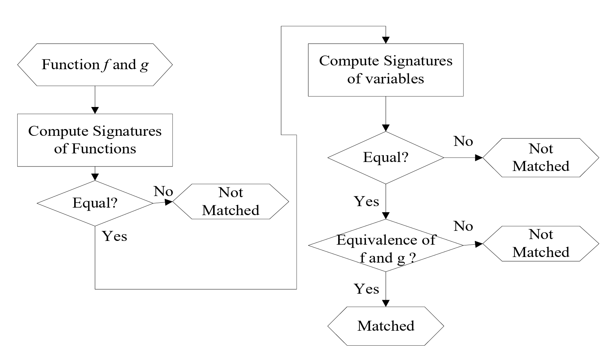</picture><figcaption></figcaption></figure>

### Covering

In the animation of the [#pattern-matching](lec-08-technology-mapping.md#pattern-matching "mention"), we have seen that one node can have many possible matched **patterns**. But which one shall we choose? Here comes the covering! A **covering** is collection of [pattern graphs](#user-content-fn-5)[^5] such that every node of the subject graph is contained in one (or more) of the pattern graphs.


The technology mapping is an optimization problem of finding a [**minimum cost**](#user-content-fn-6)[^6] covering of the subject graph by choosing from a collection of pattern graphs in the library.


For example, suppose the technology we have is shown below.

<figure><picture><source srcset="../.gitbook/assets/tech-lib-with-area-dark.png" media="(prefers-color-scheme: dark)">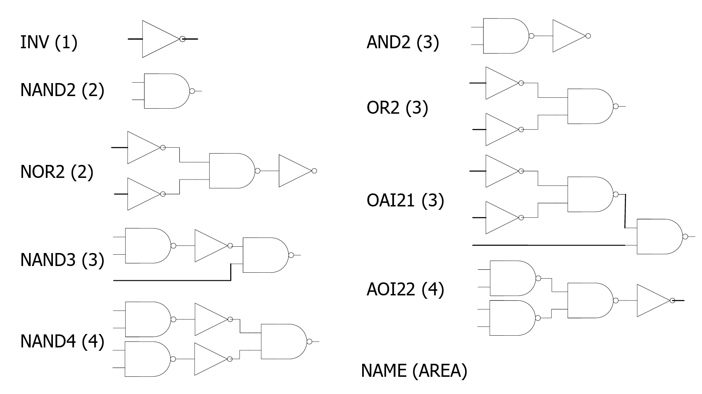</picture><figcaption></figcaption></figure>

The available coverings for the subject graph below are:

<figure>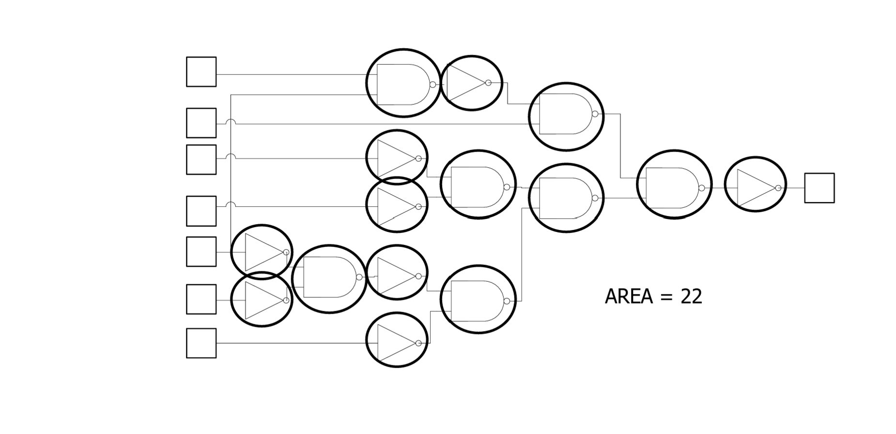<figcaption></figcaption></figure>

Obviously, in this case, the last covering is better as it uses the least area. So, the question comes, how do we determine the best — lowest area/delay covering? We may find out that most subject graphs are **trees**, and so are the pattern graphs. Thus, the problem gets simplified to **tree-covering-by-tree** problem. The optimal algorithms exist to solve this problem is to use **dynamic programming**.

<details>

<summary>DAG Covering</summary>

As we have said "most" subject graphs/pattern graphs can be represented by **trees**. In some cases, some of these graphs are **not** trees! Instead, they are directed acyclic graphs (DAG). So, the problem transits from tree-covering-by-tree problem to DAG-covering problem. However, DAG covering problem is **NP-hard**.

The common solution is to break the DAGs into trees (at the fanout point). This is shown below where the bottom-most leaf node has 2 fanouts and thus creating a DAG.

<figure><picture><source srcset="../.gitbook/assets/dag-solution-dark.png" media="(prefers-color-scheme: dark)">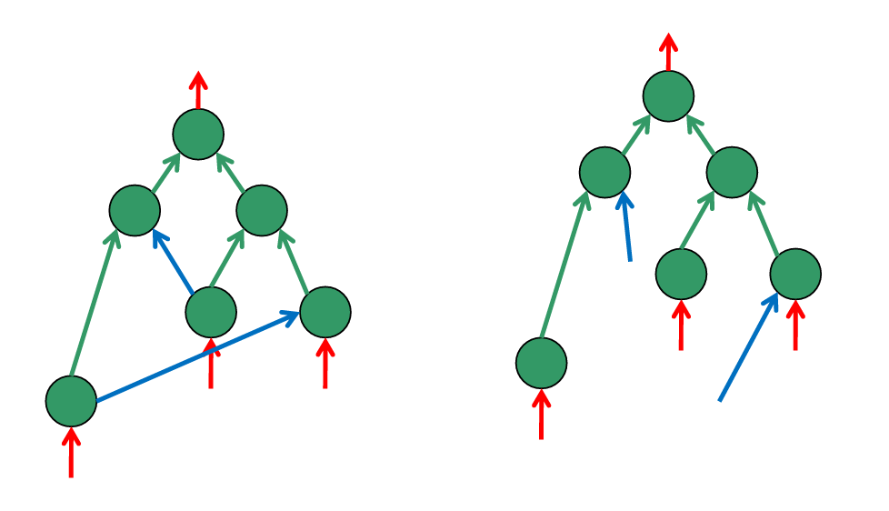</picture><figcaption></figcaption></figure>


However, this will require us to duplicate that node and thus increasing the area.


</details>

#### Dynamic Programming

This is the fundamental requirement of [CS2040S](https://app.gitbook.com/o/MnEKr5A4lYXtOfhoXGj5/s/B773B7eCfU4niGzmjn2a/)(C). By using the dynamic programming skill, we start visiting the subject tree bottom up. This bottom up search yields an optimal **covering**.

For example, we want to use dynamic programming to find the optimal covering of the following subject tree using the 4 avaiable pattern trees.

<figure><picture><source srcset="../.gitbook/assets/dp-example-dark.png" media="(prefers-color-scheme: dark)">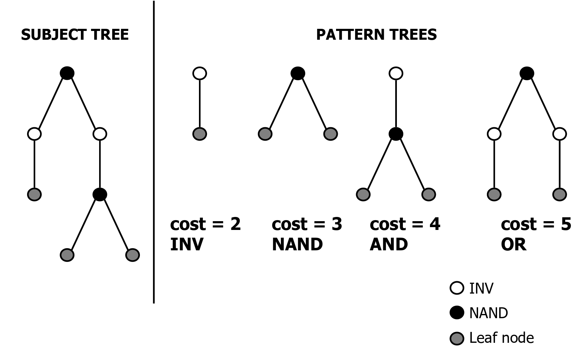</picture><figcaption></figcaption></figure>


The three leaf nodes are **input** nodes, they are not logic gates! This convention is used in EE4415 also! Basically, this is to ensure that the input to our subject graph is **synchronized**.


1. We start from the bottom two nodes (`s` and `u`)of the true logic gate. In this case, node `s` only has one option with cost of 2 and node `u` only has one option with the cost of 3. The total cost for now is 5. Thus, we record 2 for node `s` and 3 for node `u`.
2. Moving one level up, node `t` now has two options. It can be mapped with a big pattern graph or a small pattern graph. But, mapping with a big pattern graph gives us **smaller** area cost, which is 4 in this case. Thus we note 4 for node `t`.
3. Moving one level up again, we are now at the root node `r`. In this node, we have two options again. However, mapping it with a bigger pattern graph gives us a smaller area. Thus, we note 5 for the root node `r`.

<figure><picture><source srcset="../.gitbook/assets/dp-solution-dark.png" media="(prefers-color-scheme: dark)">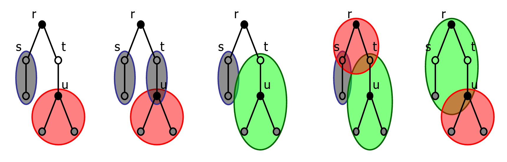</picture><figcaption></figcaption></figure>


From this example, we can also see that the **covering** problem can be thought of as a problem to **label** to node with the cost! And the total cost should be **minimum** for the optimal covering!


#### Inverter Pair Heuristic

For **structural covering** (the covering we introduce above), the optimal polarity assignment can be achieved using a clever trick. This trick is to replace all connections between base gates with **inverter pairs** (two consecutive inverters) and add one inverter for each input gate (the input signal now become the inverted version)!

This technique is useful when the library does not have any base gate into which the cells are decomposed. For example,

<figure><picture><source srcset="../.gitbook/assets/inverter-pari-heuristic-dark.png" media="(prefers-color-scheme: dark)">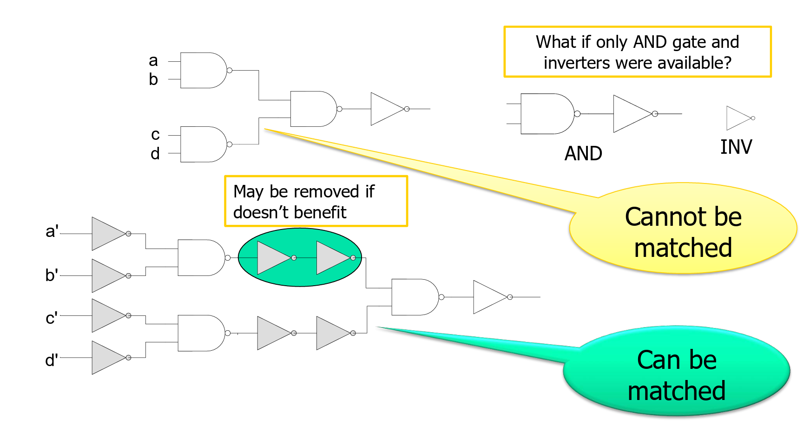</picture><figcaption></figcaption></figure>

By using the inverter pair heuristic, the decomposed design can now be matched using our existing technology library.

## FPGA Technology Mapping

In FPGA technology mapping, the decomposition and partitioning are still done to reduce the problem to a manageable size. However, matching and covering are done **differently**. Basically, there are two techniques involved:

1. Look-up table based
2. Multiplexer based

Both of these techniques are implemented using **multiplexers** wheras in the look-up table based implementation, only the **select inputs** can be used as the function inputs. In the multiplexer based implementation, all the inputs into the multiplexer can be used as the function inputs. This is also why a 4-to-1 multiplexer (with 2 select inputs) can implement **any 2-bit functions** and it can implement some 6-bit functions (but not all)!


The focus of this section will be using the **look-up table based** implementation.


### LUT Basics

An $$n$$-input LUT can implement any $$n$$-bit function and it is actually implemented by a $$2^n$$-to-1 multiplexer. For example, a 2-input LUT and 3-input LUT can be implemented as follows:

<figure>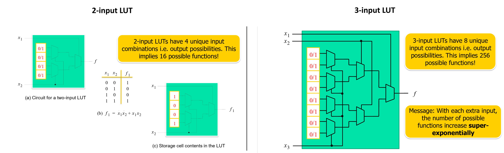<figcaption></figcaption></figure>

The data inputs to the multiplexer are called **configuration memory**. From the two example, we can also see that an $$n$$-input LUT can implement $$2^n$$ possible functions. This also informs us that with each extra input, the number of possible functions increase **super-exponentially**.

### LUT Functionality

Instead of using a bigger input LUT, we can use two smaller input LUT to compose one big input LUT. For example, a 5-input LUT can be implemented using **two** 4-input LUTs with the "fifth" signal used as the selection signal for a 2-to-1 multiplexer.

<figure>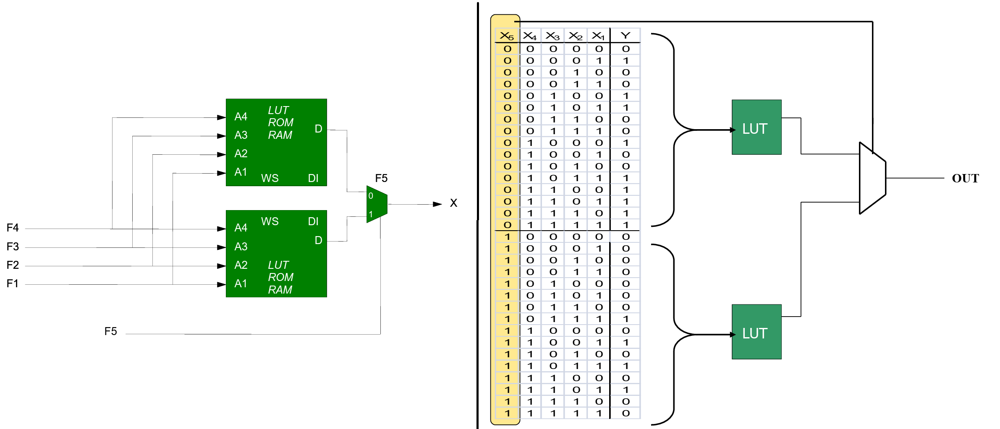<figcaption></figcaption></figure>

### LUT Technology Mapping

In the LUT Technology mapping, we still decompose and partition first. But after that, we will find the **minimum number** of LUTs we can used to mapped the decomposed graph using the LUTs. For example,

<figure><picture><source srcset="../.gitbook/assets/lut-technology-mapping-dark.png" media="(prefers-color-scheme: dark)">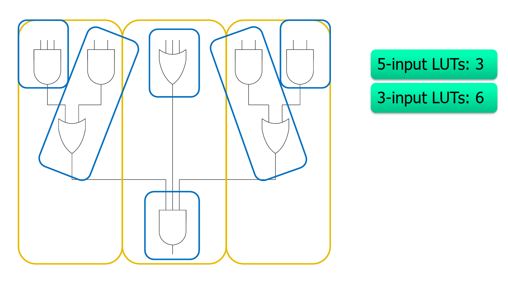</picture><figcaption></figcaption></figure>

#### Bin Packing

This technique helps us to minimize the **number** of LUTs we need to implement a function in [SOP](https://app.gitbook.com/s/jTJFBPtKk6NwweAooH53/textbook/combinational-logic-design/boolean-equations#sum-of-products-form) form. .


This is also the equivalent of the [**covering**](lec-08-technology-mapping.md#covering) problem in the library-based technology mapping


So the general steps are as follows:

1. Iterate the following steps until **all product term** are processed:
   1. Select the product term with most variables
   2. Place it into any table where it fits
   3. If no table has enough place, add a new table. e.g., a 3-bit function can be implemented using two 2-input LUT with an extra 2-to-1 multiplexer suppose we only have 2-input LUT available.
2. When all product terms are done, iterate the following steps:
   1. Declare the table with the **fewest** unused variables as final and associate a variable with the product term in that table.
   2. Assign this variable to the first table that can accept one more variable.

<details>

<summary>Bin Packing example</summary>

Let the LUT table size available to be 3 and the function in SOP form to be `f = ab + cd`.

1. 1 table is created for term `ab`.
2. Term `cd` doesn't fit in table 1, so table 2 created for `cd`.
3. All terms finished. Declare one of the tables final (both tables have exactly one unused input), say `ab` and associate a variable `z` with it.
4. Fit `z` into the other table with `cd` since 1 unused input.
5. Final output of the table: `f = z + cd`.

</details>

### Packing

After the covering ([#bin-packing](lec-08-technology-mapping.md#bin-packing "mention")) is done, we need to **pack** the LUTs and registers into [CLBs/LEs](https://app.gitbook.com/s/jTJFBPtKk6NwweAooH53/textbook/digital-building-blocks/logic-arrays#field-programmable-gate-array).

[^1]: This is the **combinational logic** between the registers.

[^2]: This represents the **combinational logic optimization** and it won't be covered in EE4218. FYI, the classic textbook from Giovanni covers this in much greater detail.

[^3]: This is **not** the binding that we have seen in the architectural synthesis step.

[^4]: The function here is either **cluster function** or **pattern function**.

[^5]: Pattern **graphs** are the same as pattern **trees**. These two terms will be used interchangeably in this section.

[^6]: Usually, the cost here is **area**, but it can be timing (latency), power as well.
