---
metaLinks:
  alternates:
    - /broken/spaces/W45nwClYZdzz9MQG1dUb/pages/c5VS2BQigrF7e8ovYAoQ
---

# Lec 09 - Physical Synthesis

In this section, we are going to talk about physical synthesis where

1. the **input** is a [**netlist**](#user-content-fn-1)[^1] of gates (or blcoks) and their interconnections[^2]
2. the **output** is a [geometrical layout](#user-content-fn-3)[^3] of the netlist within an area constraint.

In the physical synthesis stage, we are trying to minimize signal delays, inter-connection area, number of layers, power and cross-talk.

## Physical Design Styles


This part is covered in EE4415 [Lec 03 — ASIC Design Style](https://app.gitbook.com/s/Sp0XaarBjbEX3JIMrRaR/part-1-lec-digital-design-flow/lec-3a-digital-design-flow#design-styles).


## Physical Design Flow


This part is covered in EE4415 [Lec 03 — ASIC Design Flow](https://app.gitbook.com/s/Sp0XaarBjbEX3JIMrRaR/part-1-lec-digital-design-flow/lec-3a-digital-design-flow#design-styles). For the final, please print out Lec slides P26-32.


## Placement for FPGA

In the [ASIC design flow](https://app.gitbook.com/s/Sp0XaarBjbEX3JIMrRaR/part-1-lec-digital-design-flow/lec-3a-digital-design-flow#placement), we have had a rough idea what placement is in ASICs. Here, we will dicuss the placement for FPGAs, which is a bit different from ASICs. The main difference is that, in FPGA, the "standard cell" is the CLB. Thus, after floorplanning, we will have a big block containing many of smaller parts, what the placement algorithm does is to find the position of the CLB to put these smaller parts.

<figure><picture><source srcset="../.gitbook/assets/placement-fpga-dark.png" media="(prefers-color-scheme: dark)">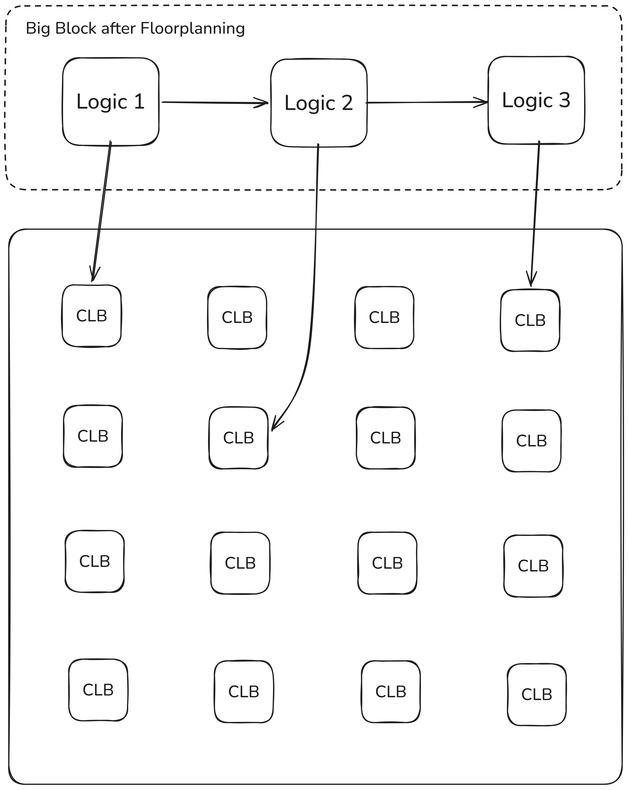</picture><figcaption></figcaption></figure>

In this section, we are going to see the following two main types of placement algorithms:

1. Constructive
2. Iterative Improvement

### Constructive

In the constructive placement algorithm, we start with one or a few "seed" cells/CLBs, meaning that we've already known the positions of these "seed" cells, so all what we need to do is to **determine the position** for the new incoming blocks. In the constructive placement alogrithm, we have two flavors:

1. Minimum-cut algorithm
2. Analytical algorithm

#### Minimum-cut Algorithm


This is not the focus. As this is not the focus of this section, just print out P35 of the slide for the finals


#### Analytical Algorithm

The basic idea of this algorithm is that we **analytically model** the wire-length, and minimize a particular objective function on that basis.

<figure>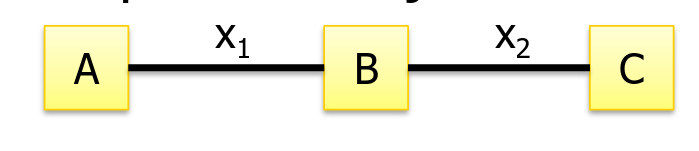<figcaption></figcaption></figure>

Usually, we set the objective function as the coarse approximation of the **wire length**. This again has two flavors:

1. **Linear cost**: we merely sum all wire-lengths, e.g., $$x_1+x_2$$
2. **Quadratic cost**: we sum the square of each wire, e.g., $$x_1^2+x_2^2$$


#### Implications of different cost functions

1. The **quadratic** cost function tends to minimize the **standard deviation** of wires, which will penalize long wires and might give us better timing performance. But the average wire length might go up compared to the linear cost function.
2. The **linear** cost function tends to minimize the **total wire length**, which tends to minimize the cost.


Given the position of the CLBs, the measure of the wire-length between two CLBs also have two flavours:

1. **Euclidean**: The distance is $$\sqrt{(y_2-y_1)^2+(x_2-x_1)^2}$$
2. **Manhattan**: The distance is $$|y_2-y_1|+|x_2-x_1|$$

For example, if the position of CLB A and C are fixed, what is the optimum position of the incoming new CLB B?

<figure>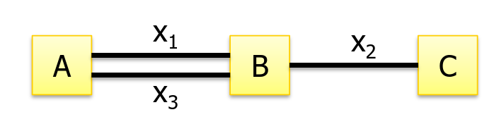<figcaption></figcaption></figure>



#### **Linear Cost**

As the position between CLB A and CLB C is fixed, meaning that $$x_1+x_2=x_3+x_2=c$$, where $$c$$ is a constant. Using the linear cost, we want to minimize $$x_1+x_2+x_3$$. Thus, replace $$x_2,x_3$$ with $$c-x_1,x_1$$ respecitvely, the total cost will be

$$
x_1+c
$$

To make the above smallest, we just let $$x_1=0=x_3$$, thus the ideal position should be as follows.

<figure>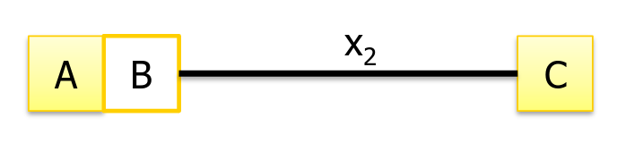<figcaption></figcaption></figure>



#### **Quadratic Cost**

Similar to the linear cost, the only different thing here is that our objective function becomes to minimize $$x_1^2+x_2^2+x_3^2$$. Again, replace $$x_2,x_3$$ with $$c-x_1,x_1$$ respecitvely, we will get

$$
x_1^2+(c-x_1)^2+x_1^2
$$

Solve this quadratic function, we can find that when $$x_1=x_3=\frac{1}{3}c$$, the objective function is minimum. Thus, the ideal position can be shown as follows:

<figure>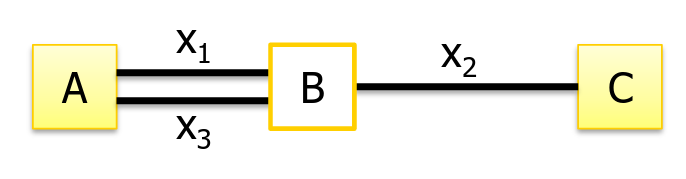<figcaption></figcaption></figure>



### Iterative

In the iterative approach, what we are essentially doing is to start from an initial position of all the blocks first, then rearranging small group of cells until no/little further improvement can be made.


Indeed, it is valid to start this process from **different initial placements**.


This process is **largely** inspired by how the nature optimizes certain stuff, which is what we called **simulation-based**/**meta-heuristic techniques**. We will discuss two different flavors of the simulation-based method here:

1. Simulated-annealing
2. Simulate evolution

#### Simulated-Annealing

As its name suggests, the motivation or inspiration of this method comes from [annealing in metal](#user-content-fn-4)[^4]. The overal idea is that:

1. An initial placement is created by assigning logic blocks randomly to the available CLBs in the FPGA.
2. A large number of moves, or local improvements are then made to gradually improve the placement.
3. Within the large number of moves, a logic block is selected at random, and a new location for it is also selected at random.
4. The change in **cost function** is computed
   1. When the cost decreases, change is always accepted.
   2. When it increases, it may be accepted with a probability of accecptance given by $$e^{-\Delta C/T}$$, where $$\Delta C$$ is the **positive change** in the cost and $$T$$ is the temperature.

The pseudo-code is shown below.


```
temp   = INIT_TEMP
place  = INIT_PLACEMENT
Rlimit = INIT_RLIMIT

while (exit_criterion == false):
    while (inner_loop_criterion == false):
        new_place = PERTURB(place, Rlimit)
        deltaC = COST(new_place) - COST(place)

        if (RANDOM(0, 1) < e^(-deltaC / temp)):
            place = new_place

    temp   = SCHEDULE(temp)
    Rlimit = UPDATE_RLIMIT()
```


Some observations we might have

1. The initial temperature `temp` is very high so that **almost all** moves are accepted.
2. As the placement is refined, the temperature `temp` drops slowly. `SCHEDULE` will update the temperature.
   1. Thus, the value of temperature represents **how well** we want to accept the change made under this temperature. Higher `temp` means that we are more likely to accept the refinement.
3. When $$\Delta C$$ is **negative**, meaning that the cost reduces, $$e^{-\Delta C/T}>1$$ always holds, thus we always accept the change.
4. When $$\Delta C$$ is **positive**, we see how and we might now accept the change if the cost function is too small.

The curve we can derive is shown below.

<figure>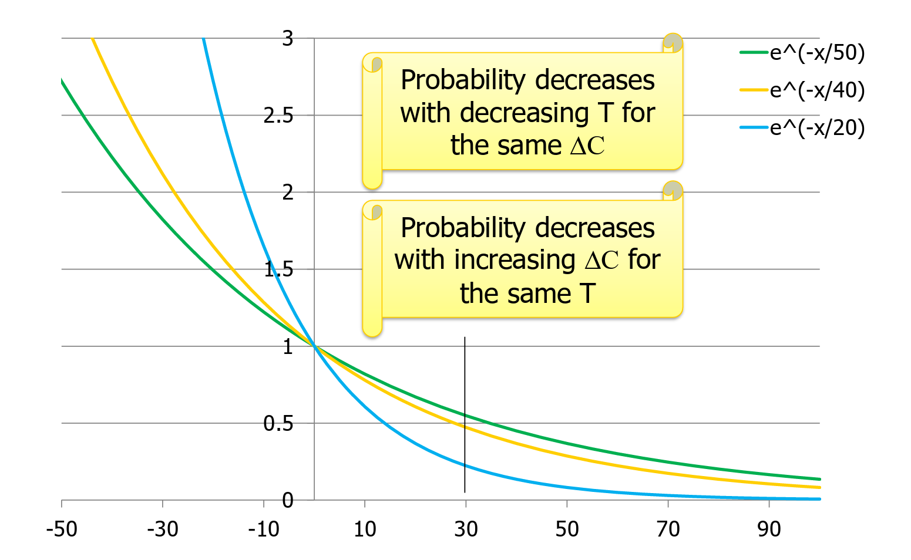<figcaption></figcaption></figure>

The y-axis denotes the **probability** that we accept the change while the x-axis denotes the cost.

1. From the black vertical line at $$x=30$$, we can see that probability decreases with decreasing $$T$$ for the same $$\Delta C$$.
2. From any one of the three curves, we can see that probability decreases with increasing $$\Delta C$$ for the same $$T$$.

In essence, what this algorithm really taught us is to **not be greedy**! Otherwise, we might easily reach a **local minimum** instead of reaching the **global minimum**.

<figure>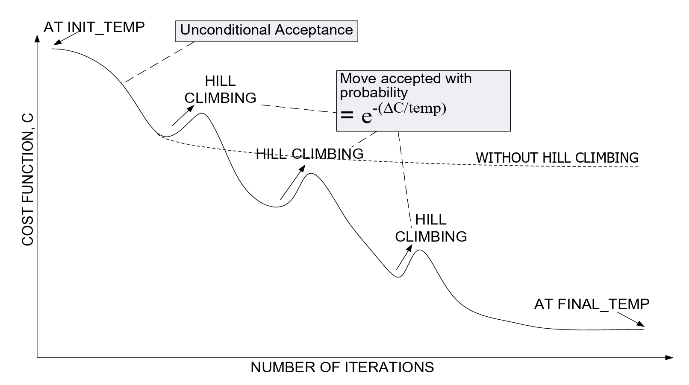<figcaption></figcaption></figure>

#### Simulated Evolution

As its name suggests, the motivation or inspiration of this algorithm comes from the genetic algorithm. In a FPGA, the layout plane is divided into $$S=\{S_1,S_2,\dots,S_r\}$$ slots. Each cell block $$B=\{B_1,B_2,\dots, B_n\}$$ needs to be placed in one of the available slots.

<figure><picture><source srcset="../.gitbook/assets/block-assignment-dark.png" media="(prefers-color-scheme: dark)">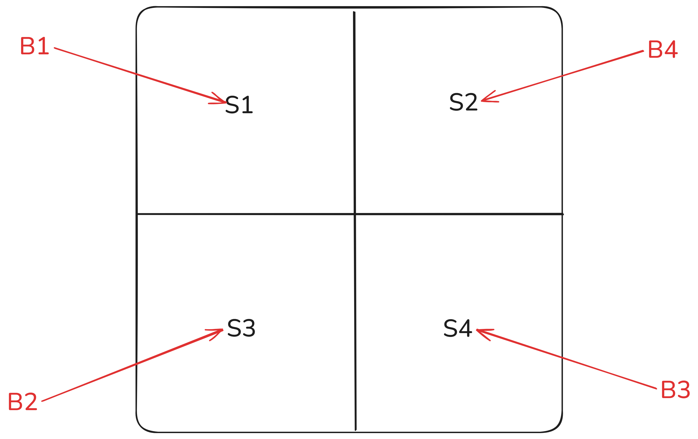</picture><figcaption></figcaption></figure>

The algorithm starts with a **number** of initiali placement configurations, called **population**. Each configuration represents a feasible solution to the problem and is represented by a string. The symbols, like $$B_1$$, etc, used in the string are called **genes**. A solution string made up of genes is a **chromosome**. e.g., $$\{B_1,B_4,B_2,B_3\}$$ is a chromosome in the figure above.

The general idea of this algorithm is that:

1. Each iteration is a **generation**. During each iteration, individuals are evaluated on the basis of certain fitness tests — quality.
2. Two individuals among the population are chosen as **parents** with probabilities based on their fitness.
3. New generation is formed by including some parents and some offsprings.
   1. High fitness individuals are selected to form offsprings and weak individuals are deleted so that the next generation tends to have high fitness. This implies overall placement quality improves over generations.
4. Some "bad" genes are inherited even though probability is low to ensure that the algorithm doesn't stuck at a local optimum.

## Routing for FPGA

> In this section, we will look at the FPGA routing architecture first and then have a glimpse of the routing algorithms used in FPGA.

The terminologies used in routing for FPGAs is shown below.

<figure>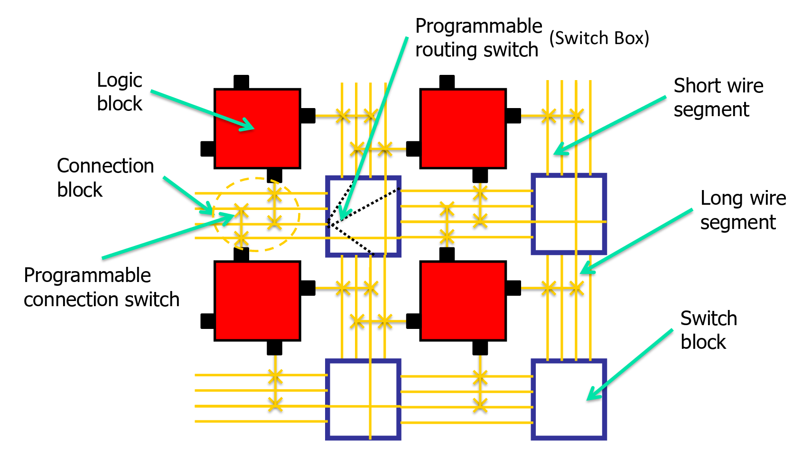<figcaption></figcaption></figure>

The FPGA routing channel architecture can be divided into three parts:

1. Channel
2. Track
3. Segment

<figure>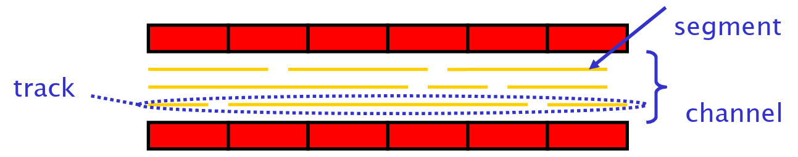<figcaption></figcaption></figure>


**Router**

Usually, there is a **router** that determines which programmable switch should be turned on to connect all the logic block input and output pins as required by the circuit. There are two groups of FPGA routers:

1. Combined global-detailed routers which determine a complete routing path in one step.
2. Two-step routing algorithms:
   1. First perform [global routing](https://app.gitbook.com/s/Sp0XaarBjbEX3JIMrRaR/part-1-lec-digital-design-flow/lec-3a-digital-design-flow#routing)
   2. Then peform [detailed routing](https://app.gitbook.com/s/Sp0XaarBjbEX3JIMrRaR/part-1-lec-digital-design-flow/lec-3a-digital-design-flow#routing)


### Maze Routing

Maze routing is originally developed for ASIC routing, but adapted for FPGA routing later. The first step of maze routing is to build the maze, or the so-called grid.

1. The grid graph is a representation of the **layout**
2. A layout is considered as a collection of unit side square cells arranged in a $$h\times w$$ array.
3. Each cell is represented by a **vertex** and there is an **edge** between two vertices if cells are adjacent.

<figure>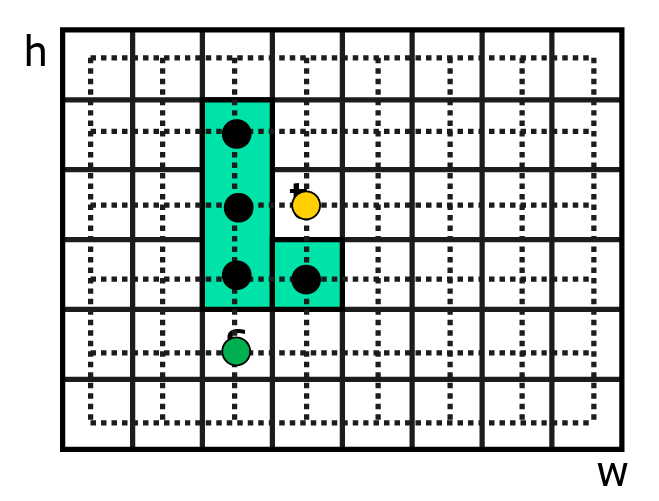<figcaption></figcaption></figure>

The objective of the algorithm is to find a **path** between source (S) and target (T) without using any **blocked vertex**.


The blocked vertices are represented as filled black circles in the grid above.


The algorithm is similar to **breadth-first search**. We work on a grid graph and the time complexity is thus $$O(h\times w)$$. The algorithm can be vividly thought of as propagating a "wave" from source until it hits the sink and then we trace back to find the path.

<figure>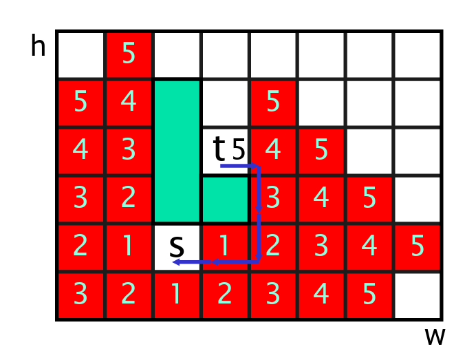<figcaption></figcaption></figure>

For example, the above image represents the maze routing for our example at the beginning of this section.


The value in the vertices represents the number of hops needed from the source vertex.


This algorithm is guaranteed to find the optimal solution.

<details>

<summary>Multiple Terminal Nets</summary>

In the maze routing, what if we have more than two terminals. In other words, we have more than two **targets**. The solution is that

> For the third terminal, we use the path between the first two as the **source** of the wave.

<figure>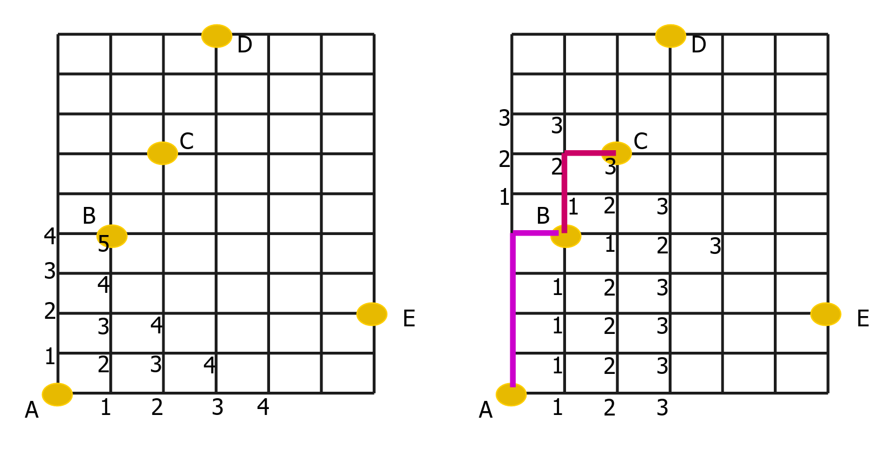<figcaption></figcaption></figure>

</details>

### FPGA Routing-Resource Graph

The second FPGA routing algorithm utilizes the FPGA routing-resource graph, which is nothing but another representation of the routing architecture where

1. Each wire and each logic block pin becomes a **node** and
2. Potential connections (switches) become **edges**

<figure>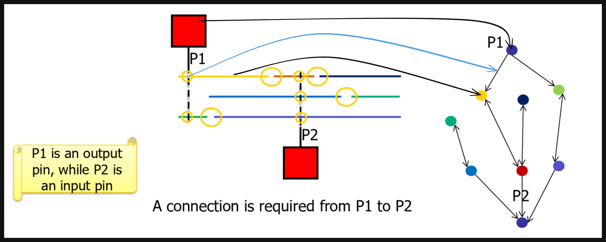<figcaption></figcaption></figure>


In this graph, **either** one of the three vertical switches turning on will connect the red wire to P2.


In the [#maze-routing](lec-09-physical-synthesis.md#maze-routing "mention") approach, we assume that each edge[^5] has a cost of 1. However, in a resource-routing graph, the cost of each [network resource](#user-content-fn-6)[^6] may be different and it depends on

1. how many other **nodes** want to use it.
2. long wires may cost more than a short wire.

Thus, multiple **iterations** may need to be performed before a valid solution is found. Some or all of the nets may be ripped-up and re-routed by different paths to

* Resolve competition for routing resources
* Improve circuit speed.

However, in the first iteration, every connection is routed for minimum delay, even if it leads to congestion (overuse of some resources).


#### Congestion

In a resource-routing grpah, the **congestion** happens when **one node** is used to more than 1 other nodes.



<figure>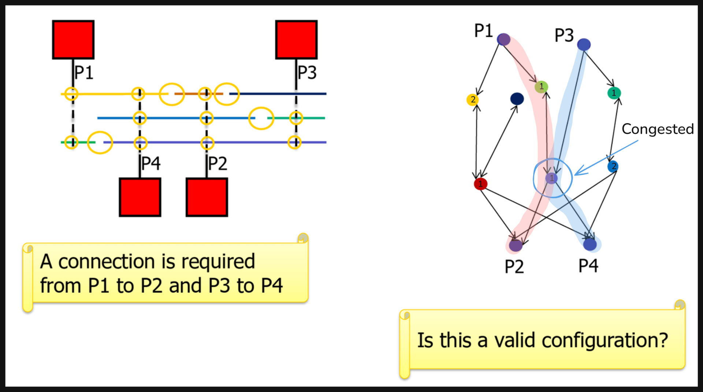<figcaption></figcaption></figure>

At the first iteration, we find the shortest cost path from P1 -> P2 and P3 -> P4. However, there is a congestion in the middle purple node. To solve this congestion, we increase the cost of the congestion node from 1 to 3.

#### Criticality of a path

The criticality of a path from the source of net (S) to its target (T) is given by:

$$
\text{Crit}(S,T)=1-\frac{\text{slack}(S,T)}{D_{\text{max}}}
$$

* $$D_{\text{max}}$$ is the total delay of the path from source to target.
* $$\text{Slack}(S,T)$$ is the amount of delay that could be added to this connection, before it affects the critical path delay. In other words, it is $$D_{\text{max}}$$ **minus** the logic gate delays of the source + target + the wire in between.
* $$\text{Crit}(S,T)$$ is between 0 and 1. The higher the value, the more critical the connection/path.

<figure>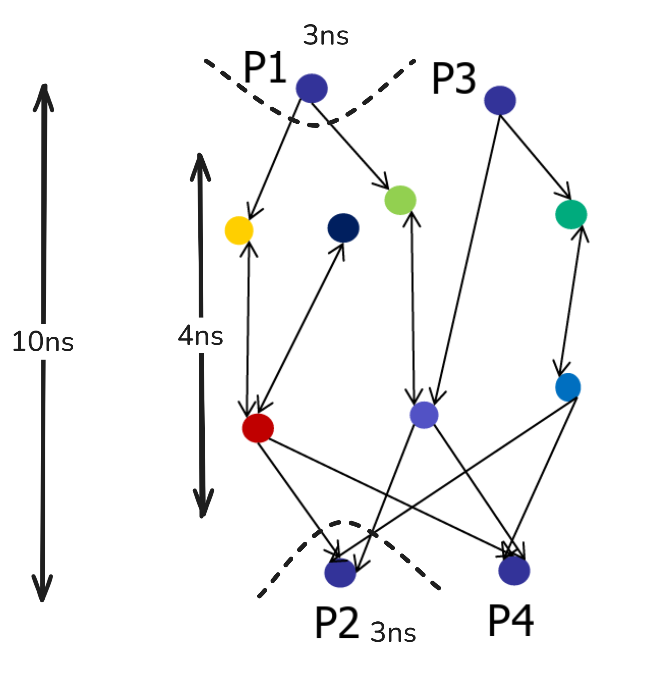<figcaption></figcaption></figure>

For example, in the resource graph above, $$D_{\text{max}}$$ is 10ns and $$\text{Slack}(S,T)$$ is 10-6-4=0ns.&#x20;

#### Cost of a node

The cost of using a routing resource **node,** $$n$$, as part of a **connection** $$(S,T)$$ is given by:

$$
\text{Cost}(n)=\text{Crit}(S,T)\cdot \text{delay}(n)+(1-\text{Crit}(S,T))\cdot(\text{delay}(n)+h(n))\cdot p(n)
$$

* The first term is a delay sensitive term — the criticality of the connection times the **delay of the node**.
* The second term is the congestion sensitive term
  * $$h(n)$$ is the historic congestion (previous iteraions)
  * $$p(n)$$ is the present congestion cost of the node: it is 1 if there is no overuse, and increases with overuse.

[^1]: This netlist is also in HDL and in EE4415 Lab 02, we can see that this netlist is nothing but the structural HDL using the standard cells in the technology library. But they are nothing but some HDL module instantiations.

[^2]: The interconnections here are more like how the instantiations in the netlist are **virtually connected**. The physical connection is done in routing.

[^3]: Can think of it as a rectangle canva with transistors organized into standard cells, and standard cells grouped into blocks and the wires connecting the standard cells.

[^4]: The process is that we heat the solid state metal to a high temperature and cool it down very slowly according to a specific schedule. If the heating temperature is sufficiently high to ensure random state and the cooling process is slow enough to ensure thermal equilibrium, then the atoms will place themselves in a pattern that corresponds to the global energy minimum of a perfect crystal.

[^5]: The edge in a grid approach is same as the wire in the routing thus it is same as the **node** in the FPGA routing-resource graph.

[^6]: Here, it means the **nodes** in the resource-routing graph.
