# Lec 2 - CMOS Inverter

## CMOS Inverter

This par requires a good understanding of what's been discussed in [CG2027 Lec 02](https://app.gitbook.com/s/6nPr3SObC3azazbFhfgF/lec/lec-02-cmos-inverter).

### Layout

The circuit symbol and layout of a CMOS Inverter can be shown as follows.

<figure><figcaption></figcaption></figure>

Note that the voltage at the output $$V_{\text{out}}$$ is always **smaller** than $$V_{\text{DD}}$$ and **bigger** than $$0$$, a.k.a, $$0<V_{\text{out}}<V_{\text{DD}}$$. Remember the **assumptions** we made in [NMOS](https://wenbo-notes.gitbook.io/ee4415-icd-notes/part-2-lec-analog-design-flow/lec-1-mosfet-and-cmos-process#assumptions) and [PMOS](https://wenbo-notes.gitbook.io/ee4415-icd-notes/part-2-lec-analog-design-flow/lec-1-mosfet-and-cmos-process#assumptions-1) source and drain in Lec 01? Basically they are

* In NMOS, the voltage at source is **lower** than the voltage at the drain.
* In PMOS, the voltage at source is **higher** than the voltage at the drain.

So, in the CMOS Invertor circuit symbol, it is obvious to figure out the source and drain position and this is shown in the figure above.

### Properties

In the CMOS inverter, we have the following properties



#### Full output swing

We have full rail-to-rail output swing.



#### Low-impedance path

There is always a **low-impedance path** which can be either

1. from the $$V_{\text{DD}}$$ to the $$V_{\text{out}}$$, or
2. from the $$V_{\text{out}}$$ to the $$\text{GND}$$



#### Direct path

There is **no** direct path between $$V_{\text{DD}}$$ and $$\text{GND}$$ in **steady state**. Thus, there is **no static power consumption**.


#### Steady State

In the steady state, the inputs and outputs are held steady.




## Static Analysis

In this part, we will mainly see if we change the gate voltage $$V_{\text{gate}}$$ or the input voltage $$V_{\text{in}}$$ (they are exactly the same in this case), what will happen to the CMOS Inverter.

### Voltage Transfer Characteristic

The voltage transfer characteristic is simply a diagram denoting the relationship between $$V_{\text{in}}$$ and $$V_{\text{out}}$$. One example is shown below.

<figure><figcaption></figcaption></figure>

1. When $$V_{\text{in}}$$ is low, $$V_{\text{out}}$$ is high. In this case
   1. For the NMOS, it is likely that $$V_{\text{GS}}<V_{\text{TN}}$$. Thus, NMOS is **Off**.
   2. For the PMOS, it is likely that $$V_{\text{GS}}<V_{\text{TP}}$$  (L.H.S. is around negative $$V_{\text{DD}}$$ while R.H.S is a small negative number) and $$V_{\text{DS}}>V_{\text{GS}}-V_{\text{TP}}$$ (L.H.S is around 0 while R.H.S is confirm negative). Thus, PMOS is in **Linear.**
2. When $$V_{\text{in}}$$ increases a bit but $$V_{\text{out}}$$ is still high, in this case
   1. For the NMOS, it is likely that $$V_{\text{GS}}>V_{\text{TN}}$$ and $$V_{\text{DS}}>V_{\text{GS}}-V_{\text{TN}}$$ (L.H.S is around $$V_{\text{DD}}$$ while R.H.S is around 0). Thus, NMOS is in **Saturation**.
   2. For the PMOS, it is likely that $$V_{\text{GS}}<V_{\text{TP}}$$ (L.H.S. is still around negative $$V_{\text{DD}}$$ while R.H.S is a small negative number) but $$V_{\text{DS}}>V_{\text{GS}}-V_{\text{TP}}$$ (L.H.S is around 0 while R.H.S is negative). Thus PMOS is in **Linear**.
3. When $$V_{\text{in}}=V_{\text{out}}=\frac{V_{\text{DD}}}{2}$$, in this case
   1. For the NMOS, it is likely that it will be in **Saturation**.
   2. For the PMOS, same likelihood that $$V_{\text{GS}}<V_{\text{TP}}$$ but $$V_{\text{DS}}<V_{\text{GS}}-V_{\text{TP}}$$ (as $$V_{\text{DS}}=V_{\text{GS}}$$ now, L.H.S is definitely **smaller** than R.H.S). Thus PMOS will be in **Saturation**.
4. When $$V_{\text{in}}$$ is a little higher, $$V_{\text{out}}$$ is low. In this case
   1. For the NMOS, it is definitely on. $$V_{\text{DS}}<V_{\text{GS}}-V_{\text{TN}}$$ (L.H.S is around 0 while R.H.S is definitely a **positive** number). Thus NMOS is in **Linear**.
   2. For the PMOS, it is likely that $$V_{\text{GS}}<V_{\text{TP}}$$ and $$V_{\text{DS}}<V_{\text{GS}}-V_{\text{TP}}$$ (L.H.S is around negative $$V_{\text{DD}}$$ while R.H.S is a less negative number). Thus PMOS is in **Saturation**.
5. When $$V_{\text{in}}$$ is a little higher, $$V_{\text{out}}$$ is low. In this case
   1. For the NMOS, it is likely that it will be in **Saturation**.
   2. For the PMOS, it is likely that $$V_{\text{GS}}>V_{\text{TP}}$$ (both negative here). Thus, PMOS is in **Off**.

In addition, the region between step 2 to step 4 is called **high-gain region** because the gain[^1] of the curve is **quite high** in terms of its magnitude.

Example of CMOS Inverter VTC


Read the termologies below before opening this example.


Using SPICE to generate an Inverter VTC for the circuit below,

<figure><figcaption></figcaption></figure>

we may get the following combined diagram of VTC and gain vs. $$V_{\text{in}}$$.

<figure>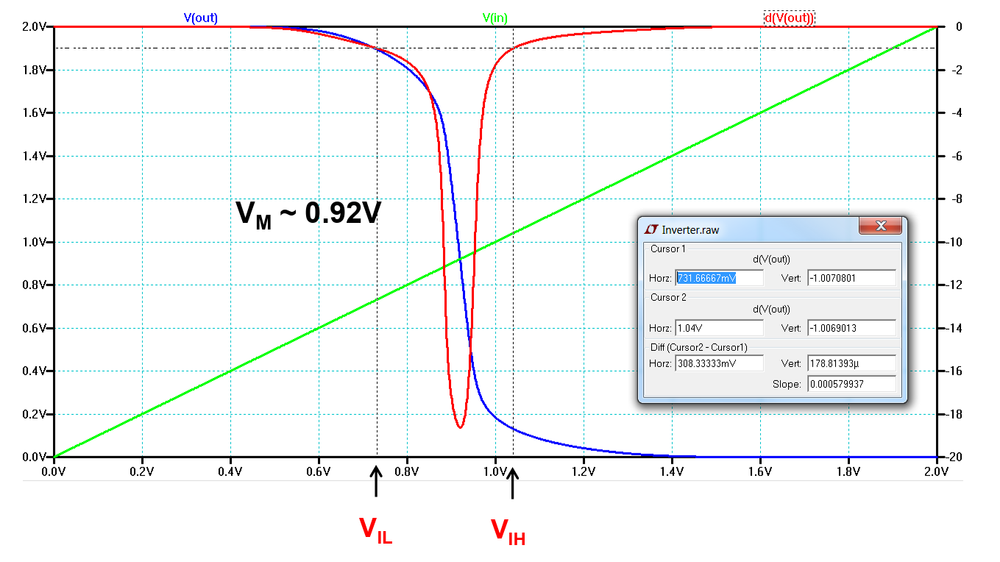<figcaption></figcaption></figure>

### Terminologies

It is good to utilize the VTC to review the following very important terminologies



#### $$V_{\text{OH}}$$ and $$V_{\text{OL}}$$

$$V_{\text{OH}}$$ and $$V_{\text{OL}}$$ are the output voltages when the **ideal input** low and high are applied to the CMOS Inverter respectively.


Usually, as the ideal input low and high are 0 and $$V_{\text{DD}}$$ respectively, $$V_{\text{OH}}$$ and $$V_{\text{OL}}$$ are thus $$V_{\text{DD}}$$ and 0.




#### Switching Threshold $$V_M$$

The switching threshold $$V_M$$ is when the input voltage is equal to the output voltage ($$V_{\text{in}}=V_{\text{out}}$$). The value can be found easily by drawing a line $$y=x$$ in the VTC graph and finding the x/y-coordinate of the intersection point.

If we want to find the value of $$V_M$$ analytically, we can do so by equating the currents through the transistors.

> WHy we can equate the current? Is it because the voltage drop is the same and we usually size the PMOS and NMOS to have the same resistance?

This will give us

$$
V_{\text{M}} =
\frac{
\left(V_{\text{THn}} + \frac{V_{\text{DSATn}}}{2}\right)
+ r\left(V_{\text{DD}} - |V_{\text{THp}}| - \frac{|V_{\text{DSATp}}|}{2}\right)
}{1 + r}
$$

where the ratio $$r$$ compares the **relative driving strengths** of the PMOS and NMOS transistors.

$$
r =
\frac{k_{\text{p}} V_{\text{DSATp}}}{k_{\text{n}} V_{\text{DSATn}}}
=
\frac{k'_{\text{p}} (W/L)_{\text{p}} V_{\text{DSATp}}}
{k'_{\text{n}} (W/L)_{\text{n}} V_{\text{DSATn}}}
$$

The intuition of the ratio $$r$$ is that: $$r$$ is bigger -> PMOS is stronger -> $$V_M$$ is bigger.


The ratio $$W/L$$ is the **size** of NMOS/PMOS.


Impact of r on V_M

Compare the switching threshold ($$V_M$$) of inverters with different $$\frac{(W/L)_p}{(W/L)n}$$.

<figure><figcaption></figcaption></figure>

The SPICE diagram we get is as follows.

<figure>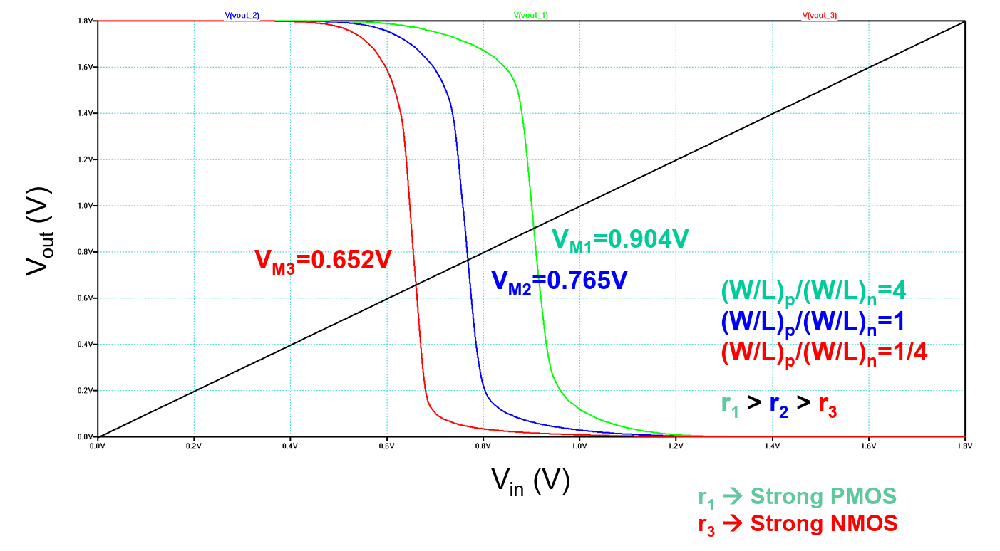<figcaption></figcaption></figure>

From this diagram, we can clearly see that it matches with our intuition on $$r$$.


#### PMOS is generally weaker than NMOS

In the blue curve, when the size of NMOS is the same as the size of PMOS, the threshold voltage is slightly lower than $$V_{\text{DD}}/2$$, this is because when the size of PMOS and NMOS is the same, PMOS is **weaker** than NMOS. This is because of the **mobility** of holes in p-type material is **smaller** than the mobility of electrons in the n-type material.





#### $$V_{\text{IH}}$$ and $$V_{\text{IL}}$$

$$V_{\text{IH}}$$ and $$V_{\text{IL}}$$ are the **minimum** and **maximum** input voltage $$V_{\text{in}}$$ that will cause the output voltage $$V_{\text{out}}$$ to be **low** and **high** respectively.


$$V_{\text{IH}}$$ and $$V_{\text{IL}}$$ are the points where $$d\frac{V_{\text{out}}}{V_{\text{in}}}=-1$$ on the VTC.




#### Noise Margin $$\text{NM}_H$$ and $$\text{NM}_L$$

* $$\text{NM}_H$$ defines how much the $$V_{\text{out}}$$ can **drop** from the **nominal high voltage** ($$V_{\text{OH}}$$) for it to be **read** correctly as logic HIGH by the following gate.
* $$\text{NM}_L$$ defines how much the $$V_{\text{out}}$$ can **go up** from the **nominal low voltage** ($$V_{\text{OL}}$$) for it to be **read** correctly as logic LOW by the following gate.

Mathematically, $$\text{NM}_H=V_{\text{OH}}-V_{\text{IH}}$$ and $$\text{NM}_L=V_{\text{IL}}-V_{\text{OL}}$$.


We want the noise margin to be **bigger**. Thus, the **gain** at the high-gain region should be as big as possible.


Gain of the inverter

Gain is nothing but the slope and it can be found easily in the VTC. Mathematically, it is defined as $$d\frac{V_{\text{out}}}{V_{\text{in}}}$$. Thus, an example of the gain vs. $$V_{\text{in}}$$ diagram can be shown as follows.

<figure><figcaption></figcaption></figure>




## Dynamic Analysis

In this part, we will mainly see what factors will affect the propagation delay of the CMOS Inverter.

### Propagation Delay

In the CMOS Inverter, the **propagation delay** is caused by the charge and discharge of the load capacitance.

<figure>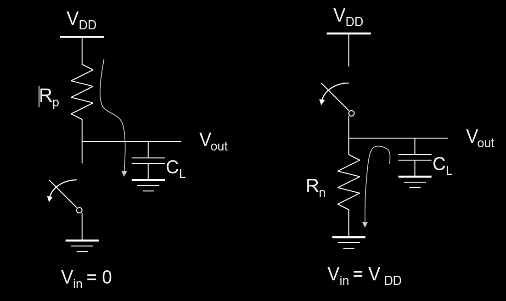<figcaption></figcaption></figure>

#### Rise/Fall Time

This will also give rise to the definition of **rise time**, **fall time**, high-to-low propagation delay and low-to-high propagation delay.

<figure>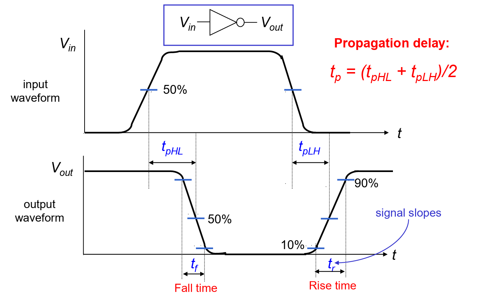<figcaption></figcaption></figure>

The overall propagation delay is the **average** of the $$t_{\text{pHL}}$$ and $$t_{\text{pLH}}$$.


Rise time and fall time are both used on $$V_{\text{out}}$$ and sometimes might be from 5% -> 95% or 20% -> 80% depending on the specific context.


#### Propagation Delay Calculation

To calculate the propagation delay $$t_p$$, as we have seen above, we need to know what $$t_{\text{pHL}}$$ and $$t_{\text{pLH}}$$ are. Also, we've seen that they are measured when $$V_{\text{out}}$$ dropped from $$V_{\text{DD}}$$ to $$\frac{V_{\text{DD}}}{2}$$ or rose from 0 to $$\frac{V_{\text{DD}}}{2}$$.

<figure><figcaption></figcaption></figure>

#### Equivalent On Resistance

As either NMOS or PMOS will be turned on stably when $$V_{\text{in}}$$ is equal to $$V_{\text{DD}}$$ or 0, it is good to know what's the **on resistance** of the NMOS and PMOS respectively.


In [NMOS](https://wenbo-notes.gitbook.io/ee4415-icd-notes/part-2-lec-analog-design-flow/lec-1-mosfet-and-cmos-process#linear-and-small), we assume that $$V_{\text{GS}}=V_{\text{DD}}$$ while in [PMOS](https://wenbo-notes.gitbook.io/ee4415-icd-notes/part-2-lec-analog-design-flow/lec-1-mosfet-and-cmos-process#linear-and-small-1), we assume that $$V_{\text{GS}}=-V_{\text{DD}}$$. In both cases, the formula to calcualte the on resistance is $$R_{\text{eq}}=V_{\text{DS}}\div I_{\text{DS}}$$.


Here, we will use NMOS as an example and PMOS will be left as an exercise for the interested readers. We will introduce two methods to get the on resistance.


In either one of the two methods, it is **not important** to understand the maths calculation, but **important** to know the final **approximation results**.




#### Integration

By integration, we have

$$
R_{\text{eq}} = -\frac{2}{V_{\text{DD}}} 
\int_{V_{\text{DD}}}^{V_{\text{DD}}/2} 
\frac{v}{I_{\text{Dsat}}(1+\lambda v)} \, dv 
\approx \frac{3V_{\text{DD}}}{4I_{\text{Dsat}}} 
\left(1 - \frac{7}{9}\lambda V_{\text{DD}}\right)
$$



#### Two endpoints

The method of two endpoints basically is to calculate the two resistance when $$V_{\text{DS}}$$ is $$V_{\text{DD}}$$ and $$V_{\text{DD}}/2$$. Then the final on resistance is just the average of the sum of these two resistances.

<figure>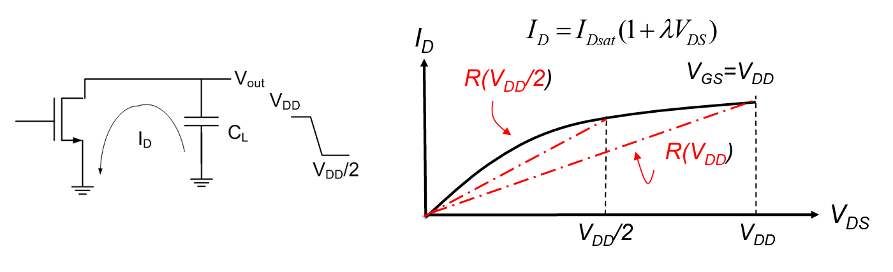<figcaption></figcaption></figure>

The on resistance at the two endpoints is just the **slope**, which is where we use the ohm's law.


We assume that when $$V_{\text{DS}}$$ is $$V_{\text{DD}}$$ and $$V_{\text{DD}}/2$$, the NMOS is in **saturation region**.


Thus, the final formula we can get is as below.

$$
R_{\text{eq}} = \frac{1}{2} \left(
\frac{V_{\text{DD}}}{I_{\text{Dsat}}(1+\lambda V_{\text{DD}})} 
+ 
\frac{V_{\text{DD}}/2}{I_{\text{Dsat}}(1+\lambda V_{\text{DD}}/2)}
\right)
\approx \frac{3V_{\text{DD}}}{4I_{\text{Dsat}}} 
\left(1 - \frac{5}{6}\lambda V_{\text{DD}}\right)
$$


The ohm's law applies in **saturation region** as well. It's just that in the saturation region, the resistance of the MOSFET will change, not like in the linear region, the resistance of the MOSFET remains uniform.




### Inverter Delay

This is just an example of calculating the inverter delay. Assume that the process is $$0.25\mu \text{m}$$, $$V_{\text{DD}}=2.5\text{V}$$, $$(W/L)_n=1.5$$, $$(W/L)_p=4.5$$ and $$C_{L}=6\text{fF}$$ and we are using the unified device model shown below. What is the propagation delay of this inverter?

<figure>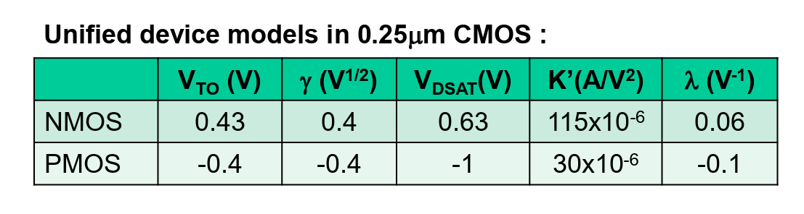<figcaption></figcaption></figure>

**Sol**: The idea is to separate into two parts first: NMOS and PMOS. And then find the $$I_{\text{DSAT}}$$ and thus $$R_{\text{eq}}$$ for each of the two part. Then use the $$\text{RC}$$ equation to get the $$t_{\text{pHL}}$$ and $$t_{\text{pLH}}$$. Finally we can get the $$t_p$$.

<figure>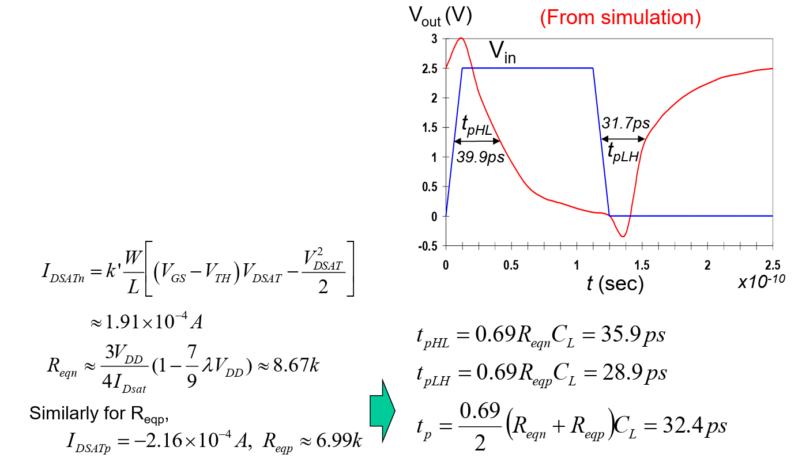<figcaption></figcaption></figure>

#### Design for Speed

From the equation we derive in [#propagation-delay-calculation](lec-2-cmos-inverter.md#propagation-delay-calculation "mention"), we can see that, in order to reduce the propagation delay, we can start from the following two aspects:

1. Reduce $$C_L$$
2. Increase $$W/L$$ ratio of the transistor: This is equivalent to reducing the **resistance** of the MOSFET as the size of the MOSFET is **inverse proportional** to the **resistance** of the MOSFET.

## Inverter Chain

Suppose we have an interter chain with a given $$C_L$$ as below. How many stages are needed to **minimize** the delay and how do we size the inverters?

<figure>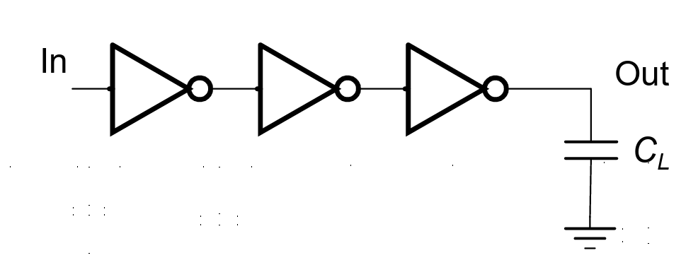<figcaption></figcaption></figure>

Intuitively, we might think that less gates means less propagation delay. However, we may soon find out this is **not true** in this case!

#### Inverter with a Load

In a real CMOS inverter, except for the external load $$C_L$$, it also has **internal load** which composes of two parts:

1. the gate capacitance $$C_{\text{gin}}$$, and
2. the intrinsic capacitance $$C_{\text{int}}$$

The location of these capacitance is shown clearly in the following figure.

<figure>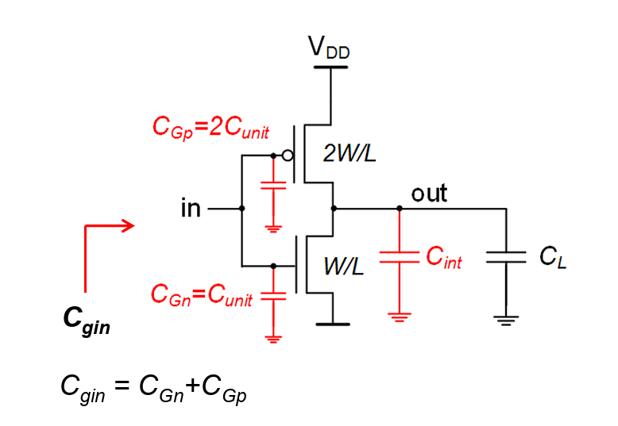<figcaption></figcaption></figure>

For the gate capacitance, it is **proportional** to the size of the MOSFET. In other words, **bigger** MOSFET size means

1. bigger drive strength
2. lower resistance
3. bigger capacitance

The reference capacitance $$C_{\text{unit}}$$ is the **gate capacitance** of a unit-sized NMOS.

Defining C_{\text{unit}} with exact values

What if in the Cadence tool, we have the exact value of $$W$$ and $$L$$ of our MOSFET, how are we going to use the $$C_{\text{unit}}$$ to get the gate capacitance $$C_{\text{gate}}$$ of the MOSFET?

***

The answer is that we don't use $$C_{\text{unit}}$$ anymore. Instead, we use the following formula:

C_{\text{gate}} = W \cdot L \cdot C_{\text{ox}}

$$W$$, $$L$$ and $$C_{\text{ox}}$$ will be given and we just need to plug in the numbers accordingly to get the $$C_{\text{gate}}$$ of the MOSFET.

The real inverter delay can thus be calculated using the following formula.

$$
t_p = 0.69 R_{\text{eq}} (C_{\text{int}} + C_L) 
= 0.69 R_{\text{eq}} C_{\text{int}} + 0.69 R_{\text{eq}} C_L 
= 0.69 R_{\text{eq}} C_{\text{int}} \left( 1 + \frac{C_L}{C_{\text{int}}} \right)
$$


$$C_{\text{int}}$$ is treated as a **constant** and it is completely determined by the process!


The plot of $$t_p-C_L$$ is shown below for reference.

<figure>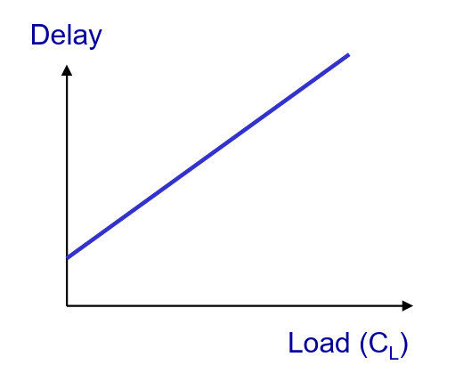<figcaption></figcaption></figure>

INV1x, INV2x, INV4x, what are they?

In the CMOS inverter, we usually size the PMOS to **twice** larger than the NMOS so that we can have roughly the same $$t_{\text{pLH}}$$ and $$t_{\text{pHL}}$$.


Remember that in CG2027, we've seen that to **size** the PMOS and NMOS, we are **only** changing its **width** but its length must remain the same.


So, when we see INV2x, INV4x, etc., it means the **size/drive strength** is being multiplied by scaling the width $$W$$ of _both_ transistors by that factor (2,4, etc).

* INV1x: NMOS = W, PMOS = 2W (Total gate capacitance $$\approx3C_{\text{unit}}$$)
* INV2x: NMOS = 2W , PMOS = 4W (Total gate capacitance $$\approx6C_{\text{unit}}$$ )
* INV4x: NMOS = 4W, PMOS = 8W (Total gate capacitance $$\approx12C_{\text{unit}}$$)


Again, as we have seen [above](lec-2-cmos-inverter.md#defining-with-exact-values), if in Cadence EDA tools, we have the exact value for $$W$$ and $$L$$, we can get the gate capacitance by just plugging in those numbers.


A bigger inverter directly implies the following three things:

1. **Bigger Drive Strength**: A wider channel allows more current ($$I_{\text{DS}}$$) to flow.
2. **Lower Resistance**: As the bigger size implies lower resistance of the MOSFET.
3. **Bigger Capacitance**: As the biiger size implies bigger capacitance of the MOSFET.

#### Inverter delay with the load

As we have seen in the [#inverter-with-a-load](lec-2-cmos-inverter.md#inverter-with-a-load "mention"), the propagation delay of an inverter should also take its **intrinsic capacitance** into account. Given that, we can also add the gate capacitance $$C_{\text{gin}}$$ for the sake of analysis later.

<figure>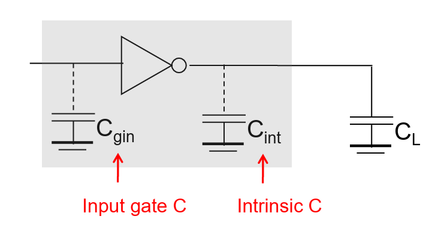<figcaption></figcaption></figure>

The formula for the propagation delay $$t_p$$ can be refactored to as follows by dividing both the nominator and the denominator with $$C_{\text{gin}}$$.

$$
t_p = 0.69 R C_{\text{int}} \left(1 + \frac{C_L}{C_{\text{int}}} \right)
= 0.69 R C_{\text{int}} \left( 1 + \frac{C_L / C_{\text{gin}}}{C_{\text{int}} / C_{\text{gin}}} \right)
= 0.69 R C_{\text{int}} \left( 1 + \frac{f}{\gamma} \right)
$$

where we define two new terms:

1. **Effective fanout** ($$f$$): $$C_L\div C_{\text{gin}}$$.
2. **Self loading factor** ($$\gamma$$): $$C_{\text{int}}\div C_{\text{gin}}$$


$$\gamma$$ is **independent** of the **gate size** since both $$C_{\text{int}}$$ and $$C_{\text{gin}}$$ increase with [gate size](#user-content-fn-2)[^2] and thus it is only a function of **technology**.


Let $$t_{p0}=0.69RC_{\text{int}}$$ be the **intrinsic delay**, the inverter delay can be expressed by

$$
t_p=t_{p0}\left(1+\frac{f}{\gamma}\right)
$$

Thus, let's take a relook at our inverter chain.

<figure>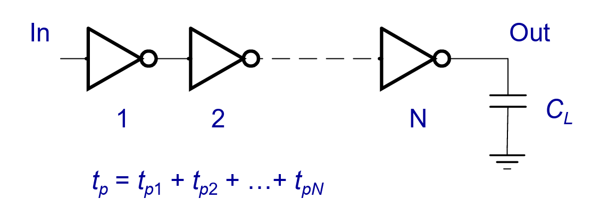<figcaption></figcaption></figure>

We can thus get the following two formulas:

$$
t_{p,j} = t_{p0}\left(1 + \frac{f_j}{\gamma}\right) = t_{p0}\left(1 + \frac{C_{\text{gin},j+1}}{\gamma C_{\text{gin},j}}\right) \qquad f_j = \frac{C_{\text{gin},j+1}}{C_{\text{gin},j}}
$$

$$
t_{p,\text{chain}} = \sum_{j=1}^{N} t_{p,j} = t_{p0} \sum_{j=1}^{N}\left(1 + \frac{C_{\text{gin},j+1}}{\gamma C_{\text{gin},j}}\right), \qquad C_{\text{gin},N+1} = C_L
$$

### Optimal Delay for Given N

In this section, we are going to if the number of stages in the inverter chain is given, what will be the optimal delay for that inverter chain. We also assume that we know the **load capacitance of the laster inverter** and the **gate capacitance of the first inverter** or in other words, we know the **ratio** of them.

#### Optimal Inverter Size for Given N

Look at the $$t_{\text{p,chain}}$$ formula above, we can find out this is nothing but an application of the [AM-GM inequality](https://en.wikipedia.org/wiki/AM%E2%80%93GM_inequality), which basically states that for two non-negative numbers, $$x$$ and $$y$$, we always have $$\frac{x+y}{2}\geq \sqrt{xy}$$. In our $$t_{\text{p,chain}}$$ formula, the only unknowns are $$C_{\text{gin,2}},\dots,C_{\text{gin,N}}$$. Thus, the minimum inverter delay is achieved when

$$
\frac{C_{\text{gin, j+1}}}{C_{\text{gin, j}}}=\frac{C_{\text{gin, j}}}{C_{\text{gin, j-1}}}
$$

which is equivalent to $$C_{\text{gin, j}}=\sqrt{C_{\text{gin, j+1}}C_{\text{gin, j-1}}}$$. This is equivalent to saying that each stage as the same **effective fanout** ($$f=C_{\text{gin, j+1}}\div C_{\text{gin, j}}$$) -> each stage has the **same delay**. Thus the total inverter chain delay can be simplified to as follows.

$$
t_{\text{p,chain}}=Nt_{p0}(1+\frac{f}{\gamma})
$$

As we have defined the gate size above, which is nothing but the sum of the width of NMOS and PMOS, it is obvious that the gate size is direct proportional to the gate capacitance! So, we can see that the effective fanout $$f$$ here sets the inverter size as well at each stage, but what is the **optimal value** of $$f$$?

#### Optimal $$f$$ for Given N

In the previous section, we know that to get the minimum inverter chain delay, each stage should have the **same effective fanout** $$f$$, but it didn't tell us the value of $$f$$. To get that value, we can calculate the product of the effective fanout for the $$N$$ stages.

$$
\begin{align*}f^N&=\frac{C_{\text{g,2}}}{C_{\text{g,1}}}\cdot\frac{C_{\text{g,3}}}{C_{\text{g,2}}}\cdots\frac{C_{\text{g,N-1}}}{C_{\text{g,N}}}\cdot\frac{C_{\text{L}}}{C_{\text{g,N}}}\\
&=\frac{C_L}{C_{\text{g,1}}}=F\end{align*}
$$

As per our assumption at the start, $$F$$ is a known value defined to be load capacitance of the last inverter $$\div$$ gate capacitance of the first inverter and it is called the **overall effective fanout**. Thus the effective fanout $$f$$ is

$$
f=\sqrt[N]{F}
$$

And the minimum inverter chain delay for given number of stages $$N$$ is finally simplifed to as follows:

$$
t_{\text{p,chain}}=Nt_{\text{p0}}\left( 1+\frac{\sqrt[n]{F}}{\gamma} \right)
$$


The $$f$$ here is optimal only for the given number of stages! We will see later that the $$f$$ may not be optimal if we can change the number of stages!


Example of Inverter chain delay

A 3-stage inverter chain needs to drive a $$C_L$$ of 8 times of its input gate capacitance, $$C_1$$. Assume that the input is driven by an inverter with minimum transistor size, (W/L)n=(W/L)p = 1.

1. What is the required fan-out for minimum delay?
2. Determine the transistor sizes in all inverters.

<figure>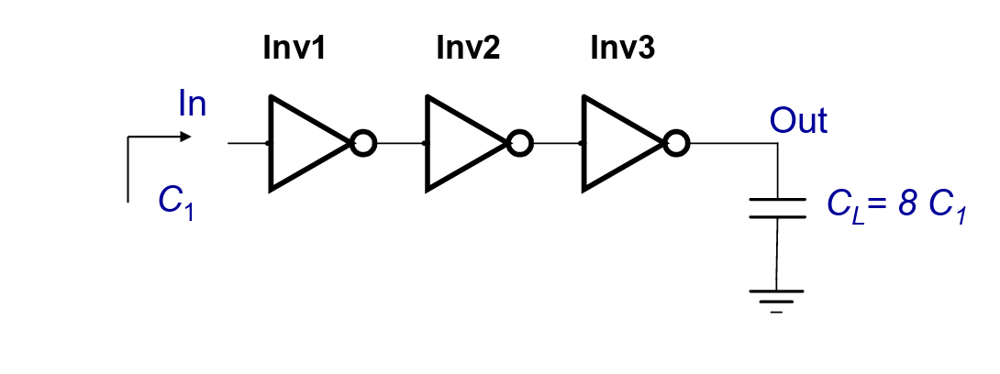<figcaption></figcaption></figure>

***

**Sol**. For the first question, it is obvious and we just need to plug the numbers into the formula. Our overall effective fanout $$F=8C_L\div C_L=8$$. Thus, the optimal effective fanout for each stage is $$f=\sqrt[3]{8}=2$$.

For the second question, the size of the transistor is direct proportional to the gate capacitance and thus we can use the effective fanout $$f$$ to help us.

(W/L)_{1\text{n}} = (W/L)_{1\text{p}} = (W/L)_{0\text{n}} \cdot f = 2

(W/L)_{2\text{n}} = (W/L)_{2\text{p}} = (W/L)_{1\text{n}} \cdot f = 4

(W/L)_{3\text{n}} = (W/L)_{3\text{p}} = (W/L)_{2\text{n}} \cdot f = 8\begin{align*} (W/L)_{1n} &#x26;= (W/L)_{1p} = (W/L)_{0n} \cdot f = 2 \\ (W/L)_{2n} &#x26;= (W/L)_{2p} = (W/L)_{1n} \cdot f = 4 \\ (W/L)_{3n} &#x26;= (W/L)_{3p} = (W/L)_{2n} \cdot f = 8 \end{align*}

### Optimal Delay for unknown N

The previous analysis assumes that the number of stages $$N$$ is given. But the arbitrarily chosen $$N$$ may not produce the minimum inverter delay. Now if $$N$$ is not given at first, we try to find the optimal $$f$$ and thus find the number of stages $$N$$.

We start from the formula $$f=\sqrt[N]{F}$$ that always holds. We can use the basic [change of base in logarithm](https://en.wikipedia.org/wiki/Logarithm#Change_of_base) to rewrite this formula to be

$$
N=\log_fF=\frac{\ln F}{\ln f}
$$

Then, out inverter chain delay will become

$$
t_{\text{p,chain}}=t_{\text{t0}}\frac{\ln F}{\ln f}\left(1+\frac{f}{\gamma} \right)
$$

The minimu value of this formula confirms to appear at the point when its derivative is 0. After the differentiation, we can get

$$
f=e^{1+\gamma/f}
$$

And thus, the number of stages $$N$$ can be rewritten as

$$
N=\frac{\ln F}{\ln f}=\frac{\ln F}{1+\gamma/f}
$$

Now, we can draw the diagrams of $$f-\gamma$$, $$t_{\text{p,chain}}/t_{\text{p,chain,opt}}-f$$. They may look like below.

<figure>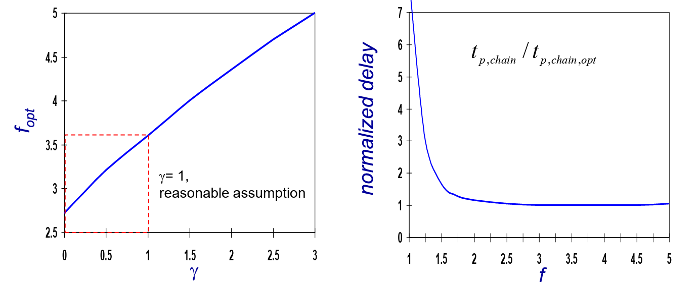<figcaption></figcaption></figure>

From this diagram, the common industry practice is that:

1. First choose $$f$$ to be around 4.
2. Calculate the number of stages using $$N=\frac{\ln F}{\ln f}=\frac{\ln F}{1+\gamma/f}$$.

#### Summary

* If $$N$$ is given, $$f=\sqrt[N]{F}$$
* Otherwise, choose $$f_{\text{opt}}=4$$, use $$N=\frac{\ln F}{\ln f_{\text{opt}}}=\frac{\ln F}{1+\gamma/f_{\text{opt}}}$$ to find the number of stages $$N$$.$$N=\fra$$

Clock Tree Design Example

As we have seen in the first part of EE4415, inside the clock tree, there are a lot of buffers and repeaters. The inverter chain we have learned here is actually applied to the clock tree a lot!

## Power Consumption

Power consumption is a major design specification of digital IC. Normally, we want low power consumption for an IC. In this section, we are going to see what factors will affect the power consumption of a CMOS inverter.

The CMOS power consumption/dissipation can be divided into three parts:

1. **Dynamic power consumption**: This comes from **charging** the capacitors.
2. **Short circuit currents**: This comes from the short circuit path betwen poewr supply rails during switching. The fact taht we have rise and fall time also explains the existence of the short circuit when switching.
3. **Leakage**: This comes from the leaking diodes and transistors.

### Dynamic Power Consumption

The dynamic power consumption only comes from **charging** the capacitor. In other words, there is **no power consumption** when NMOS is open!

<figure>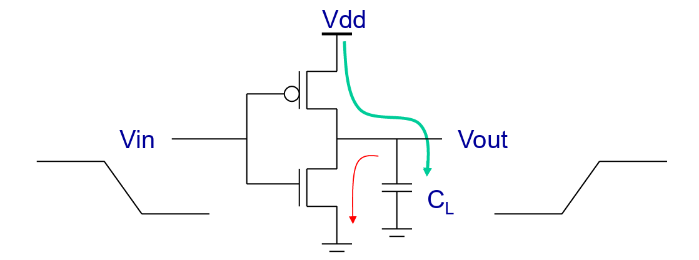<figcaption></figcaption></figure>

Thus, the formula to calculate the power consumption will be

$$
P_{\text{dyn}}=\frac{\text{Energy}}{\text{Transition}}\cdot f=C_LV_{\text{DD}}^2f_{0\to1}
$$

where $$f_{0\to1}$$ is the frequency of transition from 0 to 1 and it can be defined as $$p_{\text{sw}}\cdot f_{\text{clk}}$$. Thus the formula can be refactored to be as follows.

$$
P_{\text{dyn}}=C_LV_{\text{DD}}^2f_{0\to1}=C_LV_{\text{DD}}^2p_{\text{sw}}f_{\text{clk}}
$$

where

1. $$p_{\text{sw}}$$ is the activity factor representing how often, on average, the gates switch.
2. $$f_{\text{clk}}$$ is the clock frequency.

Example of dynamic power consumption calculation

Consider a $$0.25\mu \text{m}$$ chip with 2 million gates, an average load capacitance of 15 fF/gate (fanout of 4), 2.5V supply and 1GHz clock. Compute the dynamic Power consumption per gate, as well as for the whole chip (assuming one transition per clock cycle).

***

**Sol**. For the single gate,&#x20;

P = V_{\text{DD}}^2 \cdot C_L \cdot f  = (2.5)^2 \times 15 \times 10^{-15} \times 10^9  \approx 93.7\,\mu\text{W}

For the whole chip,

P_{\text{total}} = 93.7 \times 10^{-6} \times 2 \times 10^6  \approx 187.4\,\text{W}   Uploaded image give me the latex code for these two formulas.  Here are the LaTeX codes for the two formulas:  1. By integration R_{eq} = -\frac{2}{V_{DD}} \int_{V_{DD}}^{V_{DD}/2} \frac{v}{I_{Dsat}(1+\lambda v)} \, dv  \approx \frac{3V_{DD}}{4I_{Dsat}} \left(1 - \frac{7}{9}\lambda V_{DD}\right) 2. Using the two endpoints R_{eq} = \frac{1}{2} \left( \frac{V_{DD}}{I_{Dsat}(1+\lambda V_{DD})}  +  \frac{V_{DD}/2}{I_{Dsat}(1+\lambda V_{DD}/2)} \right) \approx \frac{3V_{DD}}{4I_{Dsat}} \left(1 - \frac{5}{6}\lambda V_{DD}\right) If you want, I can also align them nicely using align or equation environments for your report.   all the subscript use \text{} except for the one character subscript  Got it — here is the corrected LaTeX with multi-character subscripts wrapped in \text{} (and single-character ones like v kept normal):  1. By integration R_{\text{eq}} = -\frac{2}{V_{\text{DD}}}  \int_{V_{\text{DD}}}^{V_{\text{DD}}/2}  \frac{v}{I_{\text{Dsat}}(1+\lambda v)} \, dv  \approx \frac{3V_{\text{DD}}}{4I_{\text{Dsat}}}  \left(1 - \frac{7}{9}\lambda V_{\text{DD}}\right) 2. Using the two endpoints R_{\text{eq}} = \frac{1}{2} \left( \frac{V_{\text{DD}}}{I_{\text{Dsat}}(1+\lambda V_{\text{DD}})}  +  \frac{V_{\text{DD}}/2}{I_{\text{Dsat}}(1+\lambda V_{\text{DD}}/2)} \right) \approx \frac{3V_{\text{DD}}}{4I_{\text{Dsat}}}  \left(1 - \frac{5}{6}\lambda V_{\text{DD}}\right) If you want a cleaner typeset version (e.g., aligned equations), I can format them into an align block too.   Uploaded image Latex code for this formula also! same requreiemt nfro the subscript.  Here’s the LaTeX code with the same subscript rule applied (\text{} for multi-character subscripts):  t_p = 0.69 R_{\text{eq}} (C_{\text{int}} + C_L)  = 0.69 R_{\text{eq}} C_{\text{int}} + 0.69 R_{\text{eq}} C_L  = 0.69 R_{\text{eq}} C_{\text{int}} \left( 1 + \frac{C_L}{C_{\text{int}}} \right) Let me know if you want it in an align environment for better formatting 👍   Uploaded image This formula also, with the same requirement on the subscript.  Here’s the LaTeX code with the same subscript rule applied (\text{} for multi-character subscripts, single-character like  L L kept normal):  t_p = 0.69 R C_{\text{int}} \left(1 + \frac{C_L}{C_{\text{int}}} \right) = 0.69 R C_{\text{int}} \left( 1 + \frac{C_L / C_{\text{gin}}}{C_{\text{int}} / C_{\text{gin}}} \right) = 0.69 R C_{\text{int}} \left( 1 + \frac{f}{\gamma} \right) If you want consistency across your whole document (e.g., always treating “gin” as text), this format is exactly what you should stick with.   Uploaded image Same requiremnt, for these equations, can use block like begin{aligns*} if it is suitable in this case.  Yes, this is a good case for an align* block. Here’s the LaTeX with your subscript requirement applied (multi-character subscripts in \text{}):  \begin{align*} (W/L)_{1n} &#x26;= (W/L)_{1p} = (W/L)_{0n} \cdot f = 2 \\ (W/L)_{2n} &#x26;= (W/L)_{2p} = (W/L)_{1n} \cdot f = 4 \\ (W/L)_{3n} &#x26;= (W/L)_{3p} = (W/L)_{2n} \cdot f = 8 \end{align*} Note: n and p are single-character subscripts, so they correctly remain without \text{}.   ohh, I think need to separate  Yep — if you want to strictly follow your rule, the subscripts like 1n, 2p, 0n are multi-character, so they should be split into number + \text{}.  Here’s the corrected version:  \begin{align*} (W/L)_{1\text{n}} &#x26;= (W/L)_{1\text{p}} = (W/L)_{0\text{n}} \cdot f = 2 \\ (W/L)_{2\text{n}} &#x26;= (W/L)_{2\text{p}} = (W/L)_{1\text{n}} \cdot f = 4 \\ (W/L)_{3\text{n}} &#x26;= (W/L)_{3\text{p}} = (W/L)_{2\text{n}} \cdot f = 8 \end{align*} This way:  1, 2, 3, 0 → normal (single character)  n, p → wrapped in \text{} when combined → 1\text{n}  If you want even cleaner typography, another option is _{\scriptsize \text{n}}, but your current format is already standard 👍   Uploaded image give me the latex code for tehse two equations, each use align*  Here are the two parts, each formatted using align* and following your subscript rule:  Single gate \begin{align*} P &#x26;= V_{\text{DD}}^2 \cdot C_L \cdot f \\   &#x26;= (2.5)^2 \times 15 \times 10^{-15} \times 10^9 \\   &#x26;\approx 93.7\,\mu\text{W} \end{align*} The whole chip \begin{align*} P_{\text{total}} &#x26;= 93.7 \times 10^{-6} \times 2 \times 10^6 \\                  &#x26;\approx 187.4\,\text{W} \end{align*} If you want, I can also wrap the headings (“Single gate”, “The whole chip”) into proper LaTeX sectioning or formatting.

### Short Circuit Power Consumption

As we have seen in the [VTC](lec-2-cmos-inverter.md#voltage-transfer-characteristic), when $$V_{\text{in}}$$ switches from $$0\to 1$$ or $$1\to0$$, there is a region when both NMOS and PMOS are turned on, this is the source of the short circuit power consumption.

<figure>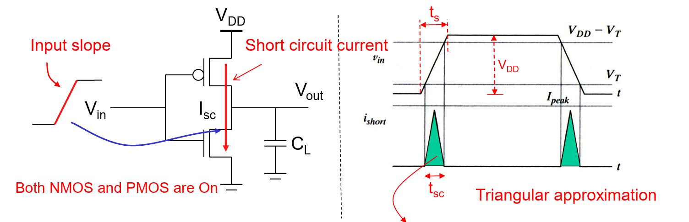<figcaption></figcaption></figure>

To calculate the short circuit power consumption, we have two methods.



#### Integration

$$
\begin{align*}
E_{\text{sc}} &= V_{\text{DD}} \cdot \int_0^{t_{\text{sc}}} I_{\text{sc}}(t)\,dt 
\;\Rightarrow\; 
P_{\text{sc}} = V_{\text{DD}} \cdot f \cdot \int_0^{t_{\text{sc}}} I_{\text{sc}}(t)\,dt \\
E_{\text{sc}} &\approx 2V_{\text{DD}} \cdot \frac{I_{\text{peak}} t_{\text{sc}}}{2} 
= V_{\text{DD}} I_{\text{peak}} t_{\text{sc}} \\
P_{\text{sc}} &= V_{\text{DD}} I_{\text{peak}} t_{\text{sc}} f
\end{align*}
$$



#### Triangular Approximation

$$
\begin{align*}
Q_{\text{sc}} &= \frac{I_{\text{peak}} t_{\text{sc}}}{2} \\
E_{\text{sc}} &= 2V_{\text{DD}} Q 
= 2V_{\text{DD}} \cdot \frac{I_{\text{peak}} t_{\text{sc}}}{2} 
= V_{\text{DD}} I_{\text{peak}} t_{\text{sc}}
\end{align*}
$$



### Leakage Power Consumption

This is also called the **static power consumption** and it is caused by the **leakages** from $$V_{\text{DD}}$$ to GND.

<figure>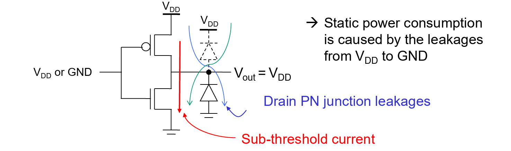<figcaption></figcaption></figure>

As you can see from the figure above, the leakage current has two parts

1. sub-threshold current: This is what we've seen in [Lec 01](lec-1-mosfet-and-cmos-process.md#sub-threshold-leakage).
2. drain PN junction leakages.

In summary, the formula for the static power consumption is

$$
P_{\text{static}}=I_{\text{stat}}V_{\text{DD}}=(I_{\text{junc}}+I_{\text{sub}})V_{\text{DD}}
$$

### Summary

In summary, the power dissipation of the CMOS invertor can be summarized as follows:

$$
\begin{align*}
P_{\text{total}} &= P_{\text{dyn}} + P_{\text{sc}} + P_{\text{stat}} \\
&= C_L V_{DD}^2 f_{0 \rightarrow 1} + I_{\text{peak}} V_{DD} t_s f_{0 \rightarrow 1} + I_{\text{leak}} V_{DD}
\end{align*}
$$

To reduce the power dissipation of the CMOS inverter, we have the following table where "Dev size" represents the device size.

<figure>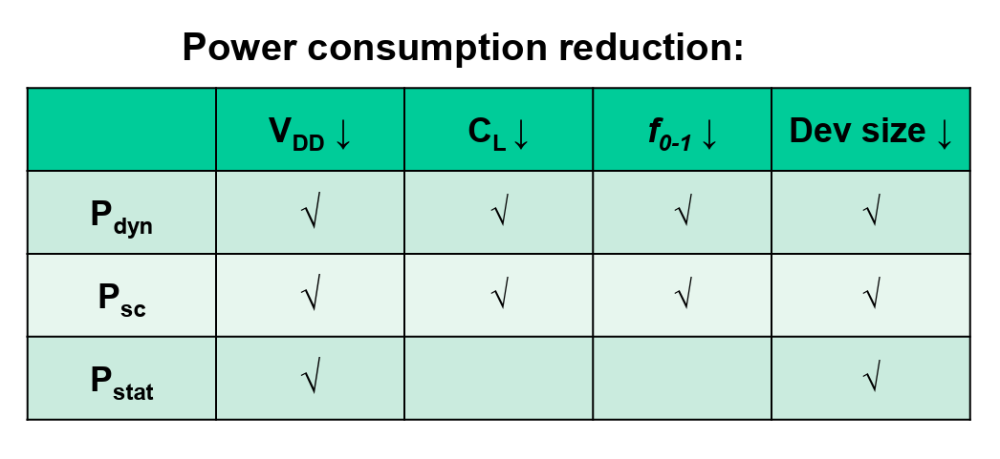<figcaption></figcaption></figure>


The device size will directly affect $$C_L$$, $$I_{\text{peak}}$$ and $$I_{\text{leak}}$$ becasue device size bigger -> width bigger -> more current can pass through.


[^1]: Can be thought of as the slope.

[^2]: Gate size is nothing but the sum of the width of NMOS and the width of PMOS.
