# Lec 3 - Combinational Logic Circuits

In this section, we will be mainly talking about the combinational logic circuits.


The difference between combinational logic circuits and sequential logic circuits has been covered in great detail in my [DDCA notes](https://app.gitbook.com/s/jTJFBPtKk6NwweAooH53/textbook/combinational-logic-design#combinational-vs.-sequential-circuits). It's highly recommended to go through that again. Again, going through [Lec 3 in CG2027](https://app.gitbook.com/s/6nPr3SObC3azazbFhfgF/lec/lec-03-cmos-logic) is also highly recommended!


## Types of Logic Gates

These are also known as the **schemes**. Basically, we have four schemes (2 big schemes plus 2 small schemes actually) for building logic gates:

1. CMOS static logic
2. Ratioed Logic
   1. Pseudo-NMOS Inverter
   2. Dynamic Gate

### CMOS Static Logic

The basic of CMOS static logic is to use the Pull-Up Network (PUN) implemented by PMOS to pull the output to 1 and Pull-Down Network (PDN) implemented by NMOS to pull the output down to 0.

<figure>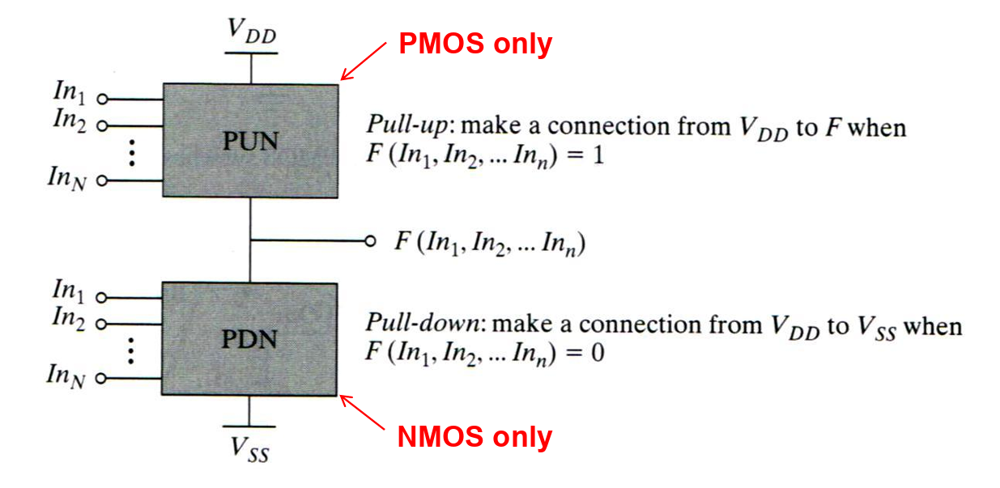<figcaption></figcaption></figure>


We must design the PUN and PDN to be **mutually exclusive** thus only one network is conducting in steady state.


PUN and PDN are dual networks (De Morgan's Theorems), meaning that **parallel connection** of transistors in the PUN corresponds to a **series** connection of the PDN.

* Parallel connection of NMOS and serial connection of PMOS implements OR. (Be careful, the output is complemented!)
* Serial connection of NMOS and parallel connection of PMOS implements AND. (Same, be careful that the output is complemented!)

Complementary CMOS gate naturally implements the **inverting logic** (NAND, NOR).


The number of transistors for an $$N$$-input CMOS logic gate is $$2N$$.


Why PMOS for PUN and NMOS for PDN?

We have seen in CG2027 that PMOS is good at passing a **strong 1** but weak 0 while NMOS is good at passing a **strong 1** but weak 1.

<figure><figcaption></figcaption></figure>

The main reason lies in the $$V_{\text{GS}}$$ that will turn the MOSFET on and off. For the interested readers, it is not hard to derive this conclusion using the knowledge learned in [Lec 01](lec-1-mosfet-and-cmos-process.md#i-v-characteristic).

#### Construct a Complex Gate


This part just uses the notes I have summarized in [CG2027](https://app.gitbook.com/s/6nPr3SObC3azazbFhfgF/lec/lec-03-cmos-logic#deriving-boolean-functions)!


One more thing to notice that, this procedure to construct a complex gate is all based on the **active high** inputs. If our inputs are **active low**, the solution will be to add an **inverter** to every one of the inputs in the module.


The [CG2027 Lec 04 — Inversion Properpty of a Full adder](https://app.gitbook.com/s/6nPr3SObC3azazbFhfgF/lec/lec-04-alu#inversion-property-of-full-adder) is a very good example for this idea.


### Ratioed Logic

The goal of using ratioed logic is to reduce the **number of** [**devices**](#user-content-fn-1)[^1] in the complementary CMOS. Normally, we have the following three types of ratioed logic.

<figure>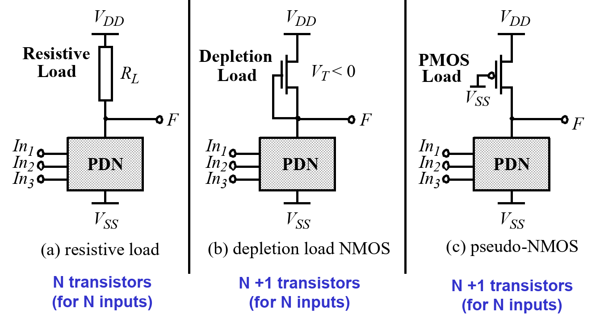<figcaption></figcaption></figure>

#### Resistive Load

In this method, we are just utilizing the [voltage divider](#user-content-fn-2)[^2] we have learned in high school physics and our $$V_{\text{OH}}$$ and $$V_{\text{OL}}$$ will be as follows:

$$
V_{\text{OH}}=V_{\text{DD}},~ V_{\text{OL}}=\frac{R_{\text{PDN}}}{R_{\text{PDN}}+R_L}\cdot V_{\text{DD}}
$$


The usage of voltage divider is where the term **ratioed** comes from in this case.


The $$t_{\text{pLH}}$$ and $$t_{\text{pHL}}$$ will thus be

$$
t_{\text{pLH}}=0.69R_LC_L,~t_{\text{pHL}}\approx 0.69R_{\text{PDN}}C_L
$$

In this method, we can find the following three observations:

1. Asymmetrical response ($$V_{\text{OH}}$$ and $$V_{\text{OL}}$$)
2. Static power dissipation when PDN is on as there will be a closed circuit from $$V_{\text{DD}}$$ to $$V_{\text{SS}}$$ in this case.

#### Pseudo-NMOS

> TODO: Add more on that if got more free time.

## CMOS Static Gates

In this part, we will focus mainly on the CMOS static gates, which utilizes both PUN and PDN to control the output. Thus, the minimum number of transistors required is $$2n$$.

Static vs Dynamic CMOS gates

In static CMOS gates, at every point of time, each gate output is connected to either $$V_{\text{DD}}$$ or $$V_{\text{SS}}$$ via a low-resistance path.

<figure>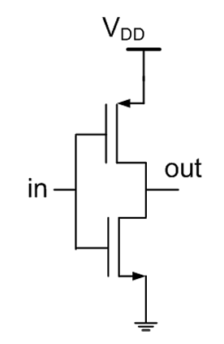<figcaption></figcaption></figure>

While in dynamic CMOS gates, the signal is stored on a parasitic capacitance. The output depends on reading the voltage on that parasitic capacitance. For example,

<figure>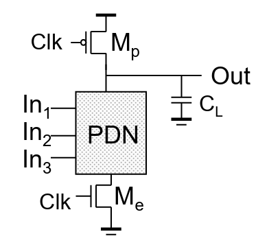<figcaption></figcaption></figure>

In the dynamic CMOS gate above, $$C_L$$ is the parasitic capacitance and $$M_p$$ is called the header PMOS, $$M_e$$ is called the footer NMOS. The Clk signal will determine when the output will be dependent on the inputs. In short, when `Clk == 1`, the output will depend on the inputs.


As the dynamic CMOS gate is analogous to the [DRAM](https://app.gitbook.com/s/6nPr3SObC3azazbFhfgF/lec/lec-05-memory#dram), we have the issue that the signal may be lost due to leakage. Therefore, the signal needs to be refreshed periodically.


As in the dynamic CMOS gates, we only need to implement the PDN, it might save us the number of transistors used.

### VTC

The static properties such as VTC and noise margin of a CMOS static logic depends on which transistor turns on or off. Thus, we say it's **input data dependent**.

<figure>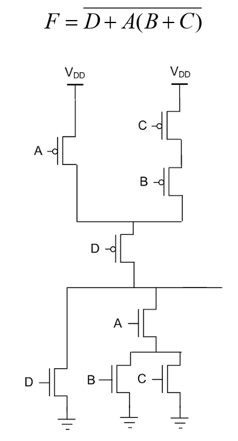<figcaption></figcaption></figure>

Because of this, we say the analysis is difficult.

### Propagation Delay

> This part is essentially the [sizing](https://app.gitbook.com/s/6nPr3SObC3azazbFhfgF/lec/lec-03-cmos-logic#sizing-for-symmetry) part in CG2027, but presented in more details using a more systematic way.

As we might have seen above, in the CMOS logic gates, there are a bunch of available low-resistance paths, all these paths will give us different delays if we didn't size the transistors properly. Thus, to make our life easier,

1. We use the delay of an inverter[^3] as a benchmark.
2. We choose the transistor sizes (in logic gate) in such a way that the **worst-case** gate delay is same as that of the benchmark inverter.


In other words, we should size the logic gates to have the same $$t_{\text{pLH}}$$ and $$t_{\text{pHL}}$$!


#### Build the benchmark

Assume that the mobility constant $$k_n'\div k_p'=-3$$, meaning that the mobility of electrons is 3 times faster than the mobility of holes or more intuitively, it means that NMOS is 3 times stronger than PMOS. We denote that $$R_{\text{eqn}}$$ and $$R_{\text{eqp}}$$ as the **on resistance** of NMOS and PMOS transistor when $$(W/L)_{n/p}=1$$, which are nothing but two **constants**. We also denote $$R_p$$ and $$R_n$$ as the **current on resistance** of each **one** of the NMOS and PMOS transistors in the CMOS logic gates, thus we can change their values by sizing the transistors.



#### Find the relationship between $$R_{\text{eqn}}$$ and $$R_{\text{eqp}}$$

Using the on resistance in the linear region of the CMOS transistors that we've learned in Lec 01, which basically are:

$$
\begin{align*}\text{NMOS: }R_{\text{DS}}&=\frac{1}{k_n'(W/L)(V_{\text{DD}}-V_{\text{TN}})}\\
\text{PMOS: }R_{\text{DS}}&=\frac{1}{k_p'(W/L)(-V_{\text{DD}}-V_{\text{TP}})}\end{align*}
$$

When $$(W/L)_{n/p}=1$$, it is obvious to find out that $$R_{\text{eqn}}\div R_{\text{eqp}}=k_p'\div k_n'$$. Thus, in our settings, $$R_{\text{eqn}}=\frac{1}{3}R_{\text{eqp}}$$.


This is the relationship between the two constants that we've set!




#### Size the CMOS transistor&#x20;

Using the $$RC$$ formula, we can easily write out the equations for $$t_{\text{pLH}}$$ and $$t_{\text{pHL}}$$, which is nothing but below,

$$
\begin{align*}t_{\text{pLH}}&=0.69R_{p}C\\
t_{\text{pHL}}&=0.69R_{n}C
\end{align*}
$$

Now, if the size of our PMOS and NMOS is $$(W/L)_{n/p}=1$$, we will have $$R_p=R_{\text{eqp}}$$ and $$R_n=R_{\text{eqn}}$$. Thus, $$t_{\text{pLH}}=\frac{1}{3}t_{\text{pHL}}$$. This is **not our goal**! To solve this, we need to size the PMOS to 3 times larger so that $$R_p=\frac{1}{3}R_{\text{eqp}}=R_{\text{eqn}}$$.


This is our 1x Inverter, which is also our benchmark. In Inv 1x, we assume that we size the PUN and PDN to have a worst case equivalent **resistance** same as $$R_{\text{eqn}}$$. That's why we size the PMOS to match the NMOS just now instead of sizing the NMOS to match the PMOS.





#### Tips

1. &#x20;$$R_{n/p}=R_{\text{eqn/p}}\div (W/L)_{n/p}$$
2. If our reference is INV1X, we also size both PUN and PDN to have a worst-case on resistance of $$R_{\text{eqn}}$$. If it is INV4X, we size them to have $$\frac{1}{4}R_{\text{eqn}}$$.


The recommended steps/flow to do this kind of sizing problem:

1. Use the mobility settings to find the relationship between the two constants $$R_{\text{eqn}}$$ and $$R_{\text{eqp}}$$.
2. Find the longest path for worst-case analysis, use $$R_p$$ and $$R_n$$ in this step.
3. Use the initial information about the width of the PMOS/NMOS and the formula $$R_{n/p}=R_{\text{eqn/p}}\div (W/L)_{n/p}$$ to replace $$R_p$$ and $$R_n$$ both with $$R_{\text{eqn}}$$.
4. Size the PMOS and NMOS accordingly.

#### Sizing Example

Using the same assumption we made in [above](lec-3-combinational-logic-circuits.md#build-the-benchmark), size the following CMOS logic gates.

<figure>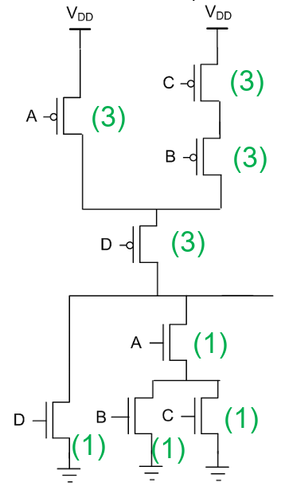<figcaption></figcaption></figure>

Start from the longest path for worst-case, so the longest path in the PUN is from C->B->D. The delay is

$$
t_{\text{pLH}}=0.69\times3R_pC=0.69\times3R_{\text{eqn}}C
$$

To size the PUN to have the worst-case on resistance of $$R_{\text{eqn}}$$, we should make $$R_p=\frac{1}{3}R_{\text{eqn}}=\frac{1}{9}R_{\text{eqp}}$$. Thus, the width for the PMOS transistor on the path should have size of 9.

Now, to make the path from A->D **not the worst-case**, we also need to size the PMOS A given that the size of PMOS D is already 9!

To do so, $$R_{\text{pa}}=\frac{2}{3}R_{\text{eqn}}=\frac{2}{9}R_{\text{eqp}}$$, thus the size of PMOS A should be 4.5.


To mimize the area, which is nothing but the sum of all the width of all the CMOS transistors, we size the PMOS A to be 4.5 instead of something higher.


The longest path in the PDN is from B/C->A. The delay is

$$
t_{\text{pLH}}=0.69\times2R_nC=0.69\times2R_{\text{eqn}}C
$$

TO make the PDN have the worst-case on resistance of $$R_{\text{eqn}}$$, we just need to make the width of NMOS A, B, C to be 2. Thus $$R_n=\frac{1}{2}R_{\text{eqn}}$$.


We don't need to size the NMOS D, can just leave it as 1 as it won't cause a worst case situation.


Why not start from a shorter path

It is definitely valid to start from a shorter path. But experience tells us that starting from a shorter path will usually give us **more area usage**!

### Fan-in

In a gate with large fan-in, the circuit schematic may look like below.

<figure>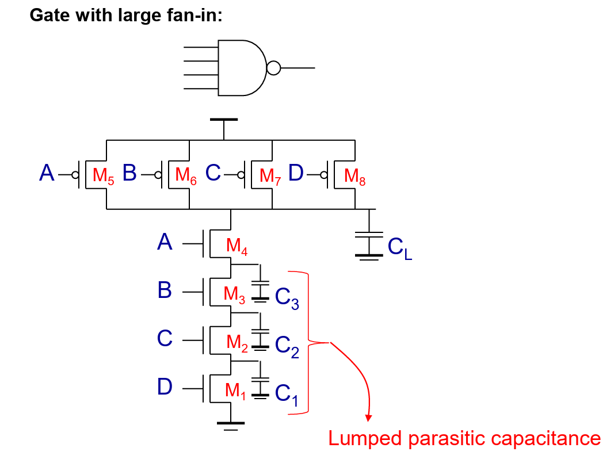<figcaption></figcaption></figure>

The bottom four NMOS are called "4 high-stack". And in the **worst-case**, $$t_{\text{pHL}}$$ is

$$
t_{\text{pHL}} = 0.69 \left[ 
R_1 C_1 
+ (R_1 + R_2) C_2 
+ (R_1 + R_2 + R_3) C_3 
+ (R_1 + R_2 + R_3 + R_4) C_L 
\right]
$$


We notice that $$R_1$$ appears in every term and is important in minimizing the delay!


Assume that all NMOS have an equal size and have an equivalent resistance of $$R_N$$, we have&#x20;

$$
t_{\text{pHL}} = 0.69 R_N \left( C_1 + 2C_2 + 3C_3 + 4C_L \right)
$$

Drawing the $$t_p$$ vs. fan-in diagram, we might have the following

<figure>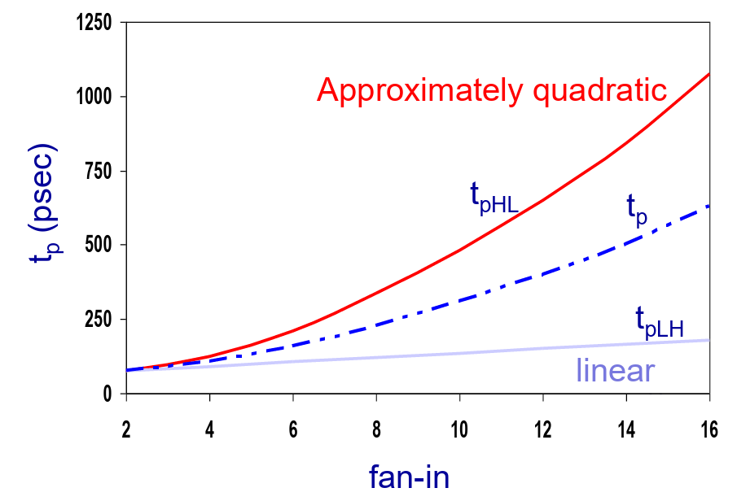<figcaption></figcaption></figure>

This tells us the propagation deteriorates quickly as a function of fan-in. Thus, we should avoid **high fan-in** circuits. Usually, gates with a fan-in greater than 4 should be avoided.

To minimize this effect of high fan-in gates, we can do

1. **Transistor sizing**
2. **Input reordering**
3. **Logic restructuring**

#### Transistor sizing

As we have seen from above, $$R_1$$ appears in every term of the $$t_{\text{pHL}}$$ calculation. Thus, we can size the M1 NMOS to be larger so that it has a smaller on resistance and thus $$t_{\text{pHL}}$$ can be reduced.

#### Input reordering

We can put the late arrived signal, which is our critical path signal, near the output so that when it arrives, the other capacitors are discharged already. In this case, the delay is only determined by the time to discharge $$C_L$$.

<figure>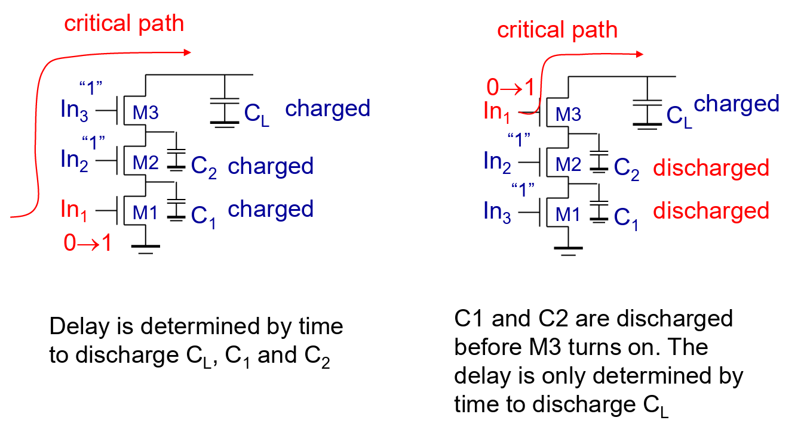<figcaption></figcaption></figure>

#### Logic restructuring

We can use De Morgan's law to restructure the high fan-in gate into the combination of some smaller fan-in gates.

<figure>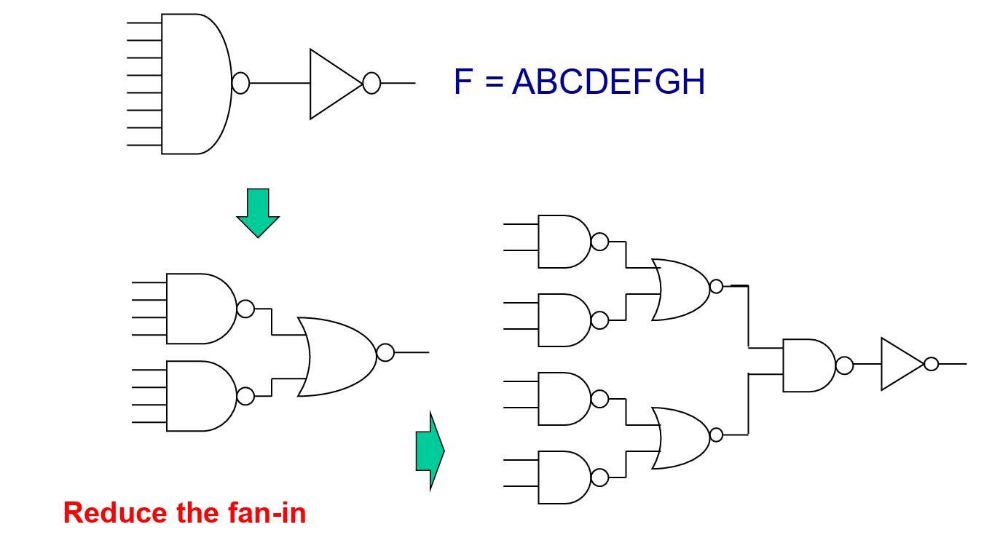<figcaption></figcaption></figure>

## CMOS Dynamic Gates

We have briefly seen the CMOS dynamic gates previously, the overall structure of the CMOS Dynamic Gates is shown below.

<figure>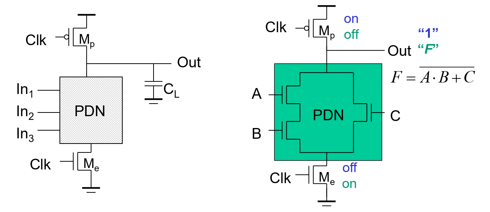<figcaption></figcaption></figure>

In CMOS Dynamic Gates, we observe that

1. There are two phase operation:
   1. **Pre-charge** (`Clk == 0`)
   2. **Evaluate** (`Clk == 1`)
2. It requires only PDN
3. The basic version of CMOS Dynamic Gates only need $$n+2$$ transistors (1 more NMOS and PMOS) for $$n$$-input logic
4. No static power consumption (leakage) as the Clock signal controls the header PMOS and footer NMOS and they are mutually exclusive.


#### Notes on CMOS Dynamic Gates

1. Once the output of a dynamic gate is **discharged**, it cannot be charged until the **next pre-charge** operation.
2. Inputs to the gate can make at most **one transition** during evaluation. Otherwise, the point 1 is violated.
3. Output **can be** in the high impedance state during and after evaluation (when PDN is open), the state is stored on $$C_L$$.
4. In CMOS Dynamic Gates, we focus only on **evaluation**, not on pre-charge.


### Static Analysis

The CMOS dynamic gates have full swing outputs, $$V_{\text{OL}}=\text{GND}$$ and $$V_{\text{OH}}=V_{\text{DD}}$$. And as the PDN starts to work as soon as the input signals exceed $$V_{\text{tn}}$$, so $$V_m,V_{\text{IH}}$$ and $$V_{\text{IL}}$$ are all equal to $$V_{\text{TN}}$$.

<figure><figcaption></figcaption></figure>

### Dynamic Analysis

The propagation delay of the CMOS dynamic gates only depends on $$t_{\text{pHL}}$$ because the output is pre-charged, we take $$t_{\text{pLH}}=0$$.

Compared with the static CMOS gates, the dynamic CMOS gates have

1. Reduced load capacitance because of the less number of transistors used. This can be seen from
   1. Lower input capacitance $$C_{\text{in}}$$
   2. Smaller output capacitance $$C_{\text{out}}$$ (This is when we connect two dynamic gate together)
2. No short-circuit current so all the current provided by PDN goes into discharging $$C_L$$.

### Power Dissipation

There is no static current path betwen $$V_{\text{DD}}$$ and $$\text{GND}$$. There is also no glitch. But there might be extra load on CLK and higher transition possibilities. Thus, the overall power of dynamic CMOS gates are usually higher than static CMOS.

### Issues

There are three issues related to the Dynamic Gate Design

1. Charge Leakage
2. Charge Sharing
3. Cascade Dynamic Gates and Domino Logic

#### Charge Leakage

Analogous to the DRAM, during the evaluation stage, the charge stored in the $$C_L$$ might leak away due to the leakage current. The leakage sources can be

1. [Sub-threshold leakage](lec-1-mosfet-and-cmos-process.md#sub-threshold-leakage) (Dominant)
2. Reverse biased D/B junction leakage

This can be illustrated in the figure below.

<figure>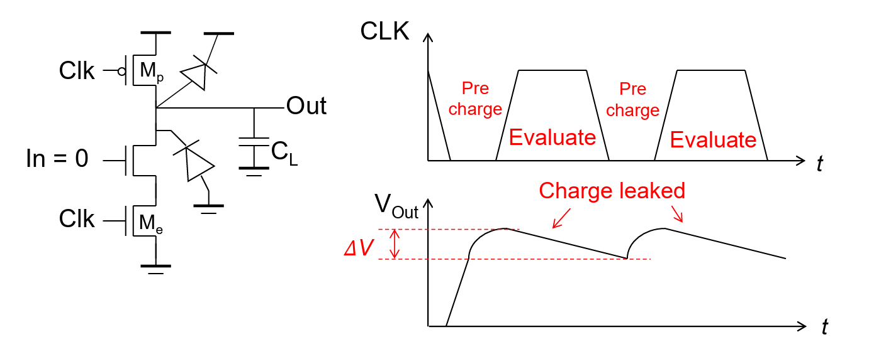<figcaption></figcaption></figure>

The circuit will fail if $$\Delta V>NM_H$$ because in this case the output can be read as High by the next component correctly! This will give us the lower bound of $$f_{\text{clk}}$$ assuming 50% duty cycle. Assume that we have constant leakage current $$I_{\text{leak}}$$, using the wo definitions of charges $$Q=CV=It$$.

$$
\Delta V=\frac{I_{\text{leak}}t_{\text{eval}}}{C_L}<NM_H
$$

This will give us

$$
t_{\text{eval}}<\frac{NM_HC_L}{I_{\text{leak}}}
$$


The duty cycle for the dynamic CMOS gates can be changed and we will explore this in Homework 2.


To solve the charge leakage problem, we can borrow the idea of [Level-Restoration Circuit](https://app.gitbook.com/s/6nPr3SObC3azazbFhfgF/lec/lec-03-cmos-logic#level-restoration-circuit) from CG2027! We can add a weak PMOS to pull the voltage at the $$C_L$$ up when the output is 1 and this can be shown as follows.

<figure>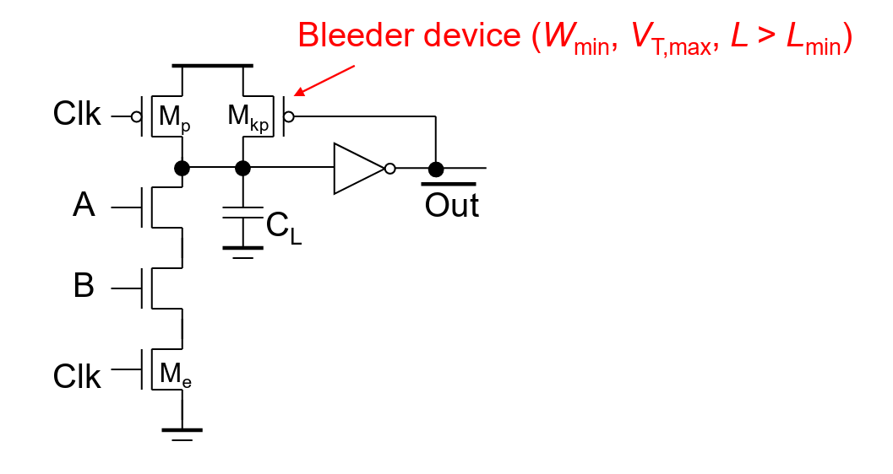<figcaption></figcaption></figure>

The requirement for for the transistors added and the inverter added is that

1. The $$M_{\text{kp}}$$ transistor should be weak enough or the NMOS A, B and $$M_e$$ should be stronger enough so that when A=B=1 and the output (not the output bar) transits from 1 to 0, the NMOS can pull the voltage down to 0.
2. Inside the inverter, the PMOS should be stronger so that the **switching threshold** $$V_M$$ is bigger so that the NMOS can pull down the voltage at $$C_L$$ easier.


The analysis above is a classic interview question. The spirit is that the PMOS we add will compete with the NMOS when the NMOS wants to pull the output down to 0. What we want to achieve is to make NMOS easier to pull down the output to 0.


#### Charge Sharing

Another problem on the dynamic CMOS gates is the charge sharing.

<figure>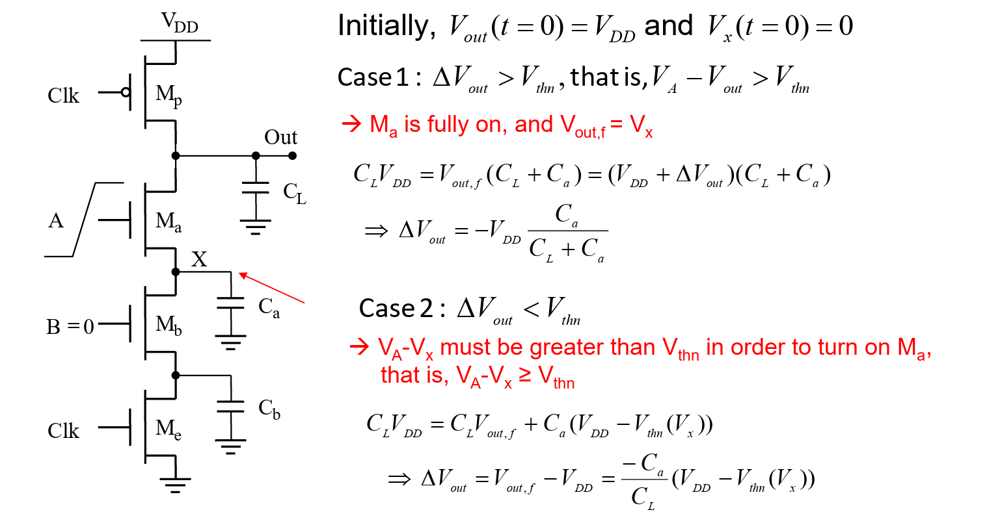<figcaption></figcaption></figure>

In other words, what we need to know about this problem

1. This problem is caused by $$C_a$$ and $$C_b$$ is not charged!
2. Ideally, we want $$C_L\gg C_a$$.

To solve this problem, we just need to tweak our device to pre-charge the $$C_a$$ as well.

<figure>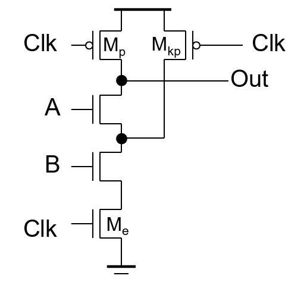<figcaption></figcaption></figure>

#### Cascading Dynamic Gates

The third problem of cascading dynamic gates is that we **cannot** straight cascade the dynamic gates like below.

<figure>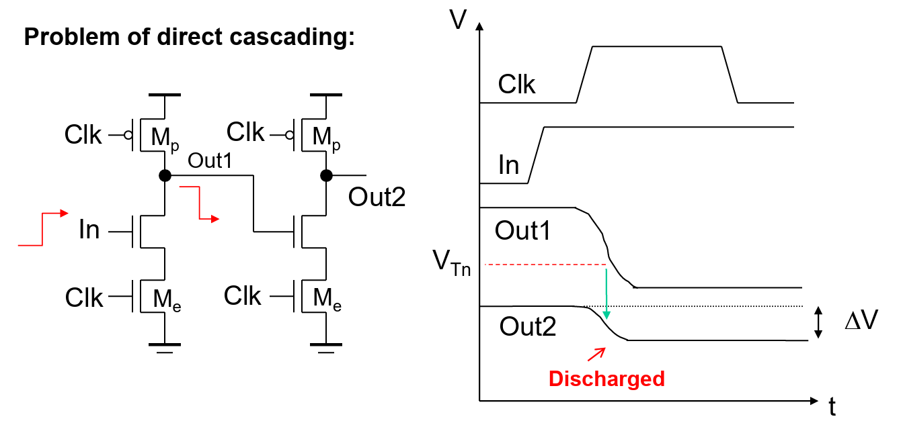<figcaption></figcaption></figure>


This is an inverter implemented using the CMOS Dynamic gates.


The problem occors when `In` make 0-to-1 transition. This is because during the evaluation stage, `OUT1` takes some time to drop and thus in the second-stage inverter, it violates our notes that "Inputs to the gate can make at most **one transition** during evaluation."

To solve this issue, we insert the registers at `OUT1` and `OUT2` to make a domino effect.

<figure>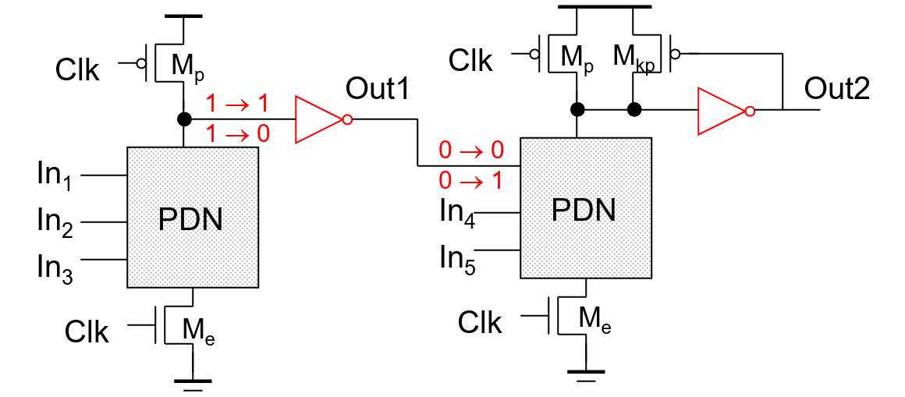<figcaption></figcaption></figure>

The 0-to-1 transition triggers the evaluation of the following stage to also make 0-to-1 transition, like a line of domino falling.


#### Limitations

The limitation of this solution is that it can only implement **non-inverting logic**, which breaks the universalty of the **inverting logic** which states that we can implement any boolean logic using NAND/NOR.


High speed circuits with large fan-ins (np-CMOS)

With the help of the dynamic CMOS gates, we can build high speed circuits with even high fan-in, which is quite counter-intuitive as we might have seen [previously](lec-3-combinational-logic-circuits.md#fan-in).

The idea is that, in dynamic CMOS gates, we can **not only** take PDN only, we can also take PUN only! This kind of circuit is called **np-CMOS**!

<figure>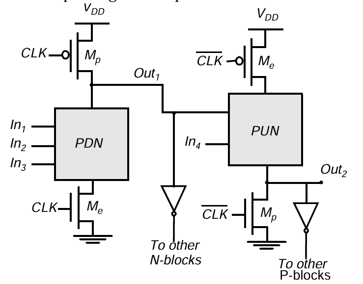<figcaption></figcaption></figure>

[^1]: This is nothing but the **transistors**.

[^2]: 

[^3]: This inverter can be 1x, 4x, etc, but the spirit is that tpLH and tpHL are the **same**.
