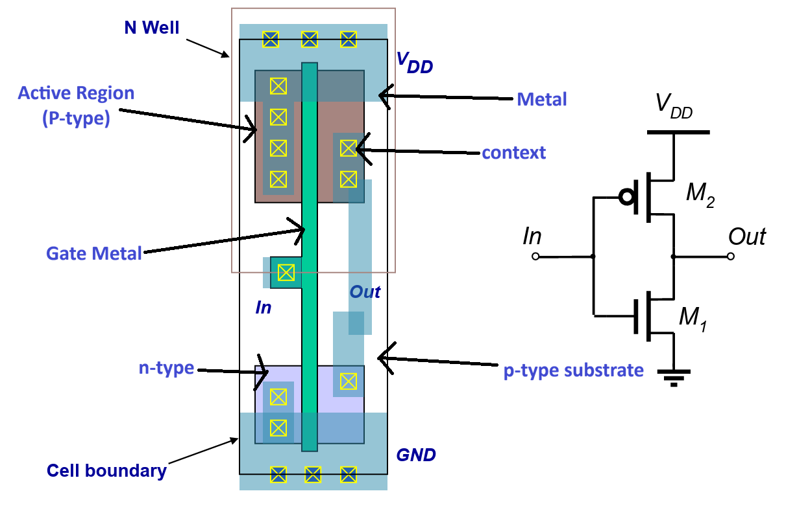
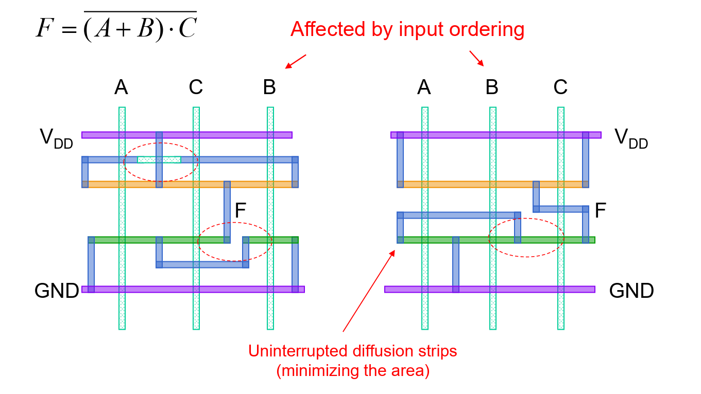

# Lec 4 - Layout & Parasitics

## Layout

In this section, we will introduce two layout techniques for logic gates:

1. Standard cell approach
2. Macro Cell

Then we will see how the layout can be represented by a stick diagram and how we can use our discrete maths knowledge: consistent euler path to minimize the area in a certain layout.

### Standard Cell

The standard cell approach is basically to put the standard cells (logic gates) with **same height** but varying width on a blanket. In this approach, the basic unit is the **standard cell**. One example can be shown below.

<figure><figcaption></figcaption></figure>

Intuitively, we can think of laying as the **breadboard** we've used in EPP1. We have two $$V_{\text{DD}}$$ rows and two $$\text{GND}$$ rows. In between these rows is the region where we put our logic, in this case, the standard cells.


#### Mirrored Cell

The mirrored cells in the top and bottom rows are flipped vertically to share the N-well


For example, the following image is the top-down layout for a static CMOS inverter.

<figure><figcaption></figcaption></figure>

The context is used to allow the **metal** to be connected.

Macro Cell Design

In the macro cell design approach, we use the macro cells, which are also known as the IPs, as the unit.

### Stick Diagram

As the CMOS diagram might be a bit too complex, we have the so-called **stick diagrams** to make our life easier. Stick diagrams are nothing but a simplifed layout diagram with the most important information captured. Stick diagrams contain no dimensions and represent relative positions of transistors.

<figure><figcaption></figcaption></figure>

#### Stick Layout

Similarly, as the real layout is quite complex, we usually draw the two **stick layouts** to make our life simpler. The steps to draw a stick layout are as follows:

1. Make sure you have or draw the static CMOS circuit with the labeling of transistors, like A, B, C, D, etc.
2. Draw the long vertical line to represent the gates and label them as A, B, C, D, etc, exactly match with the number of labelled transistors in the first step.
3. Draw the transistor diffusion stripes (the horizontal N-type and P-type stripes).
4. Draw the $$V_{\text{DD}}$$ and $$\text{GND}$$
5. Draw the wirings **according** to the circuits
   1. Whichever transistor is connected to $$V_{\text{DD}}$$ should be connected to $$V_{\text{DD}}$$ in the layout, same for $$\text{GND}$$ and the output.
   2. If two transistors are in **parallel**, short-circuit them.

For example,

<figure><figcaption></figcaption></figure>

The first red dashed circle is to denote that transistor A and B are short circuit but are not connected with the metal coming from the $$V_{\text{DD}}$$ PMOS A and C.

#### Logic Graph

To graphically show the transistor location, we can use the **undirected** logic graph which utilises the following definitions:

1. The **nodes/vertices** in the graph is either $$V_{\text{DD}}$$, $$\text{GND}$$, output, or the intermediate point between the **serial connection** transistors.
2. The **edges** represent the transistors in between the nodes.

For example, with the same static CMOS diagram, its logic graph is shown below.

<figure><figcaption></figcaption></figure>

### Euler Path

Actually, the example we've seen [above](lec-4-layout-and-parasitics.md#stick-layout) is not optimal, we can further reduce the metal used by changing the order of the **input gate** so tha we can have uninterrupted diffusion strips and thus having less area used.

<figure><figcaption></figcaption></figure>

To achive this **uninterrupted diffusion stripe**, we need to use the concept of Euler path with the help of the [#logic-graph](lec-4-layout-and-parasitics.md#logic-graph "mention") we've seen above.

> A **Euler path** is a path that passes through all nodes in the graph such that each **edge** is visited  **once** and **only once**.

An uninterrupted diffusion strip is possible only if there exists a **consistant** Euler path.

Consistent Euler Path

More specifically, the Euler paths in the PUN and PDN must be **consistent**, which means sharing the **same ordering**.

<figure><figcaption></figcaption></figure>

The Euler path will determine how we order the input gates. For example,

<figure><figcaption></figcaption></figure>
