# Lec 5 - Sequential Circuits

In this lecture, we will first review the timing metrics of registers covered in EE4415 Part 1 [Lec 1b](../part-1-lec-digital-design-flow/lec-1b-timing-synchronous.md). And then, we will focus on the static vs. dynamic storage. In summary, the difference between static storage and dynamic storage is shown below

* **Static storage** (Latches, Flip-flop)
  * Preserve state as long as the power is on
  * Have positive feedback (regeneration) with an internal connection between the output and input
  * Useful when updates are infrequent
* **Dynamic Storage**
  * Store state on parasitic capacitors (**gate capacitances**)
  * Only hold state for **short periods** of time (milliseconds)
  * Require periodic refresh
  * Usually simpler, higher speed and lower power

## Static Latches and Registers

In this section, we fill first talk about the bistatbility principle, the 3 different flavors of latches and then how we can use these 3 different flavors to build the registers.

### Bistability Principle

The basic element of a latch is 2 inverters connected in a feedback loop manner, which can be shown as follows.

<figure>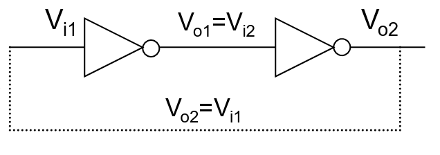<figcaption></figcaption></figure>

For this element, we can draw the VTC of the two inverters and put them together in one VTC diagram.

<figure>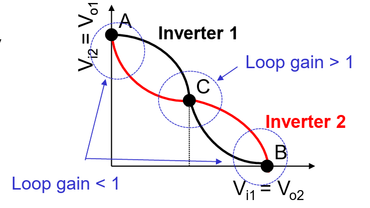<figcaption></figcaption></figure>

In this loop, the black curve is the VTC of the inverter 1 whose input is $$V_{i1}$$ and output is $$V_{o1}$$. In this case, the VTC's y-axis is $$V_{o1}$$ while the x-axis is $$V_{i1}$$. Similarly, the <mark style="color:red;">red curve</mark> is the VTC of the inverter 2 whose input is $$V_{i2}$$ and output is $$V_{o2}$$. And in this VTC, the y-axis is $$V_{i2}$$ and the y-axis is $$V_{o2}$$.

The 3 intersection points represent the 3 **stable states** of this inverter chain.

* State A means that $$V_{o1}=V_{i2}=1$$
* State B means that $$V_{o1}=V_{i2}=0$$
* State C means that $$V_{o1}=V_{i2}=V_M$$, this state is called the meta-stable state

Another fact about the state C is that the loop gain here is bigger than 1 so any small noises happening near this state will push the circuit to either A or B depending on the direction of the noise.

### Latches

To be able to write to the latch (change state), we can mainly do the following two things:

1. Cut the feedback loop (mux based latch)
2. Overpowering the feedback loop (reduced load latch)

#### MUX Based Latches

The idea of a basic mux based latch can be shown as follows.

<figure>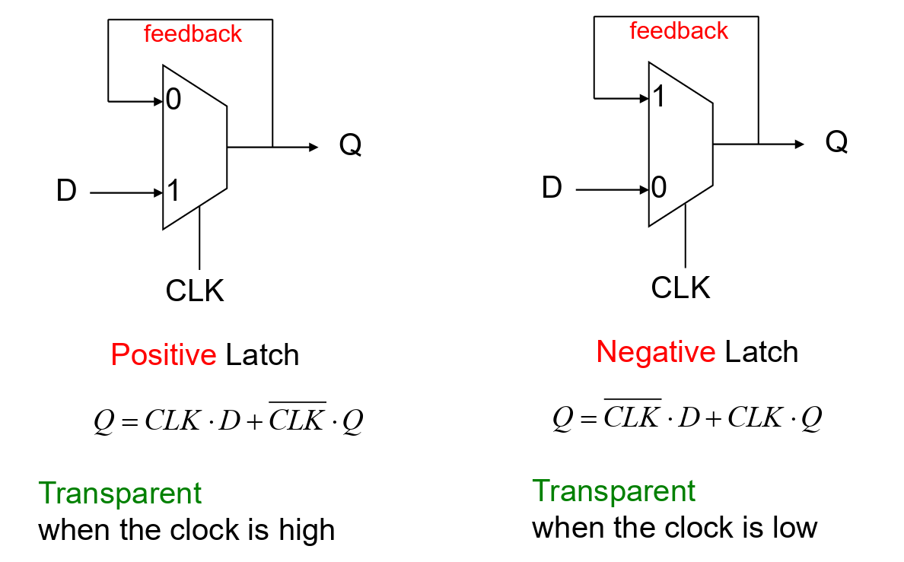<figcaption></figcaption></figure>

And the mux can be implemented using different styles:

1. Transmission Gate Mux
2. Pass Transistor MUX



#### Transmission Gate Mux

<figure>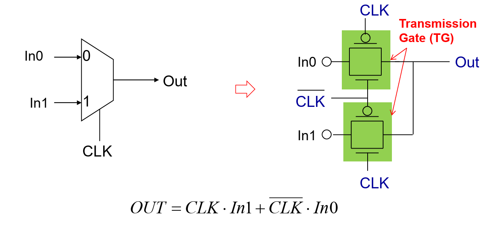<figcaption></figcaption></figure>

When CLK=1, the bottom PMOS and NMOS will be turned on together. And the usage of the PMOS is to pull the out to Full $$V_{\text{DD}}$$ when In 1 is equal to $$V_{\text{DD}}$$. And to use this to implement a mux-based latch, we can draw the diagram as follows.

<figure>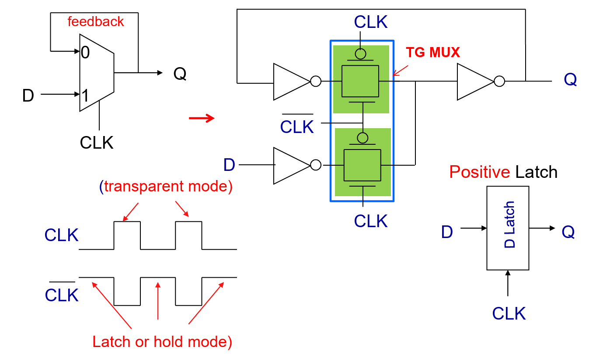<figcaption></figcaption></figure>

The reason for the 3 inverters added here is because we want the input into the 2 transmission gates to be not floating.


In this design, the clock signal will drive 4 transistors. Thus, we say that the clock load is 4 transistors.




#### Pass Transistor MUX

We can also use the pass transistor mux to build the latch, which can be shown as follows.

<figure>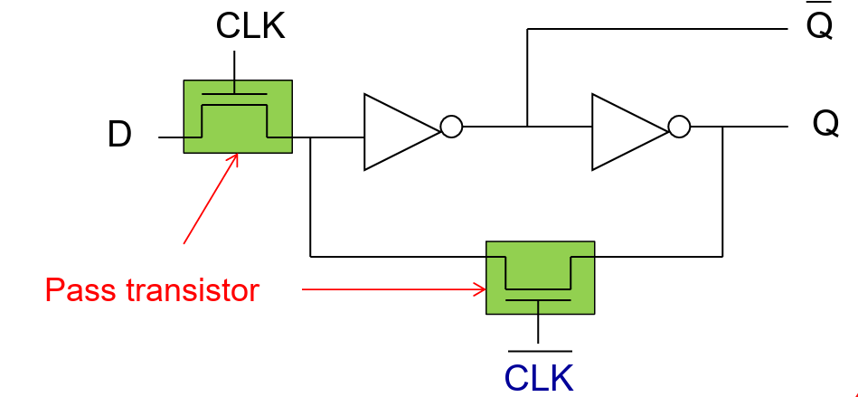<figcaption></figcaption></figure>


In this design, the clock signal will drive 2 NMOS transistors. Thus, we say that the clock load is 2 transistors.




#### Reduced clock load latch

This implementation corresponds to the second way to write to a latch. In this way, instead of using the mux to cut the feedback loop, we add a transmission gate to the cross-coupled inverters and design the cross-coupled inverters in such a way that

* The feed-forward path is a **strong inverter**, let's say 1x
* The feed-back path is a **weak inverter**, it will be smaller the 1x, maybe 0.5x or 0.25x

<figure>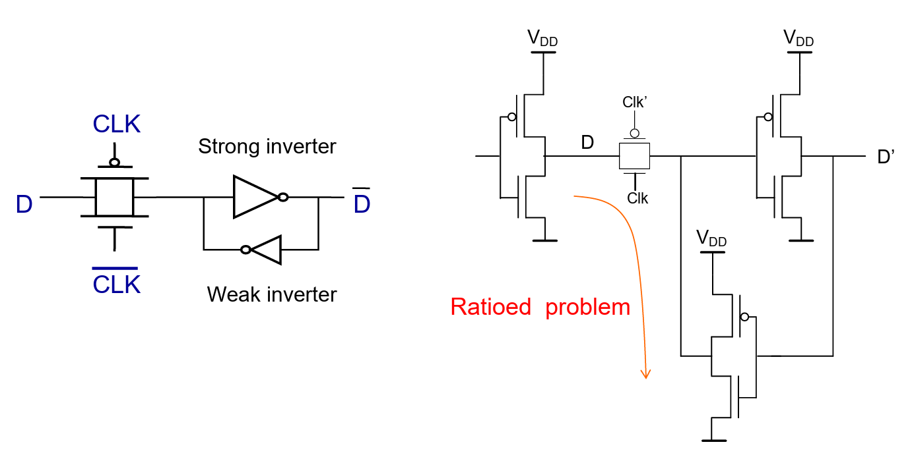<figcaption></figcaption></figure>

The output of the transmission gate must over-performs that weak inverter's output so that it can set the input of the strong inverter thus setting output coming out from the latch.

### Registers

The register/flip-flop can be made easily but cascading two latches (negative latch + positive latch) and this can be shown as follows.

<figure>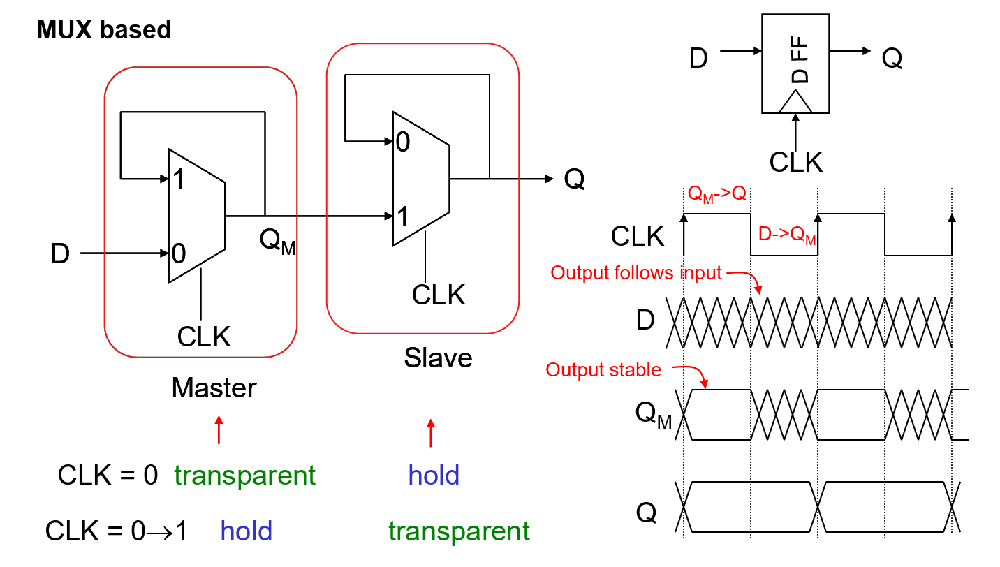<figcaption></figcaption></figure>

How this register actually works is that

1. When the CLK 0->1, the master latch will capture the D and **hold** it while the slave latch will pass the $$Q_M$$ to $$Q$$. This state will continue until CLK becomes 0.
2. When CLK=0, the master latch is in transparent state but the slave latch will be in hold state, which will hold the previous $$Q_M$$ until the next rising clock edge comes.


This is called master-slave edge triggered register and we assume that our focus is the D flip-flop in this section.


Now, we can use the different latches implementation to build different flavors of registers

#### Transmission Gate based

In this flavor, we will have the register looks like below:

<figure>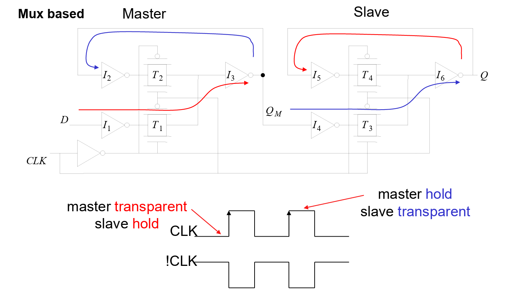<figcaption></figcaption></figure>

In this diagram, what we are interested in is how to read the **timing properties** from this diagram.

<figure>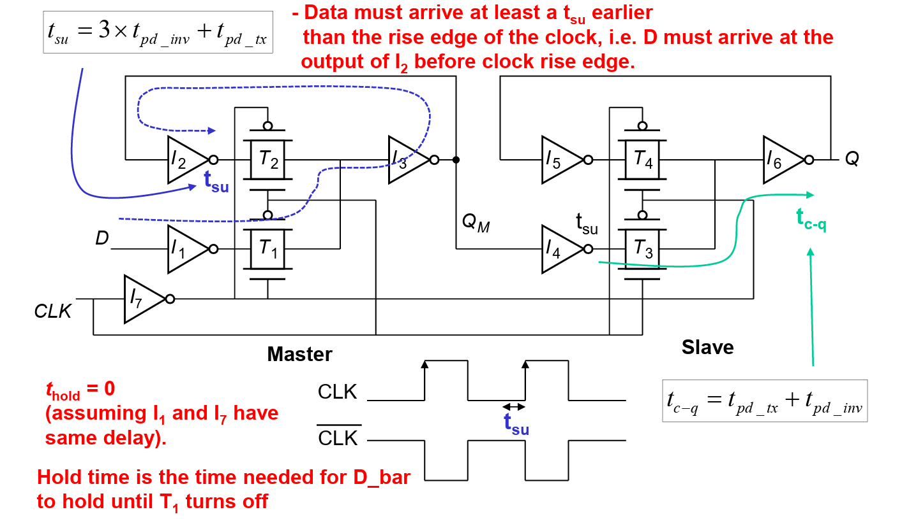<figcaption></figcaption></figure>



#### Setup Time

The setup time indicates that the input D must be $$t_{\text{su}}$$ before it rising clock edge, meaning that  the input D must arrive at the output of $$I_2$$ $$t_{\text{su}}$$ time before the clock's rising edge. Thus,

$$
t_{\text{su}}=3\times t_{\text{pd\_inv}}+t_{\text{pd\_tx}}
$$

Setup Time Simulation

The following diagram shows a valid setup time in a circuit.

<figure>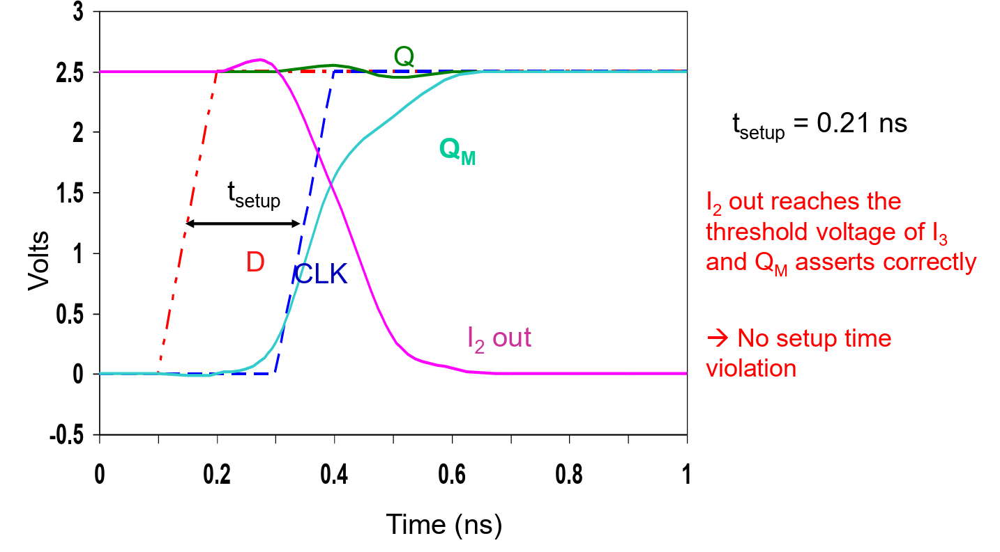<figcaption></figcaption></figure>

However, in the following diagram, there is a setup time violation because the master latch cannot capture the input changes correctly.

<figure>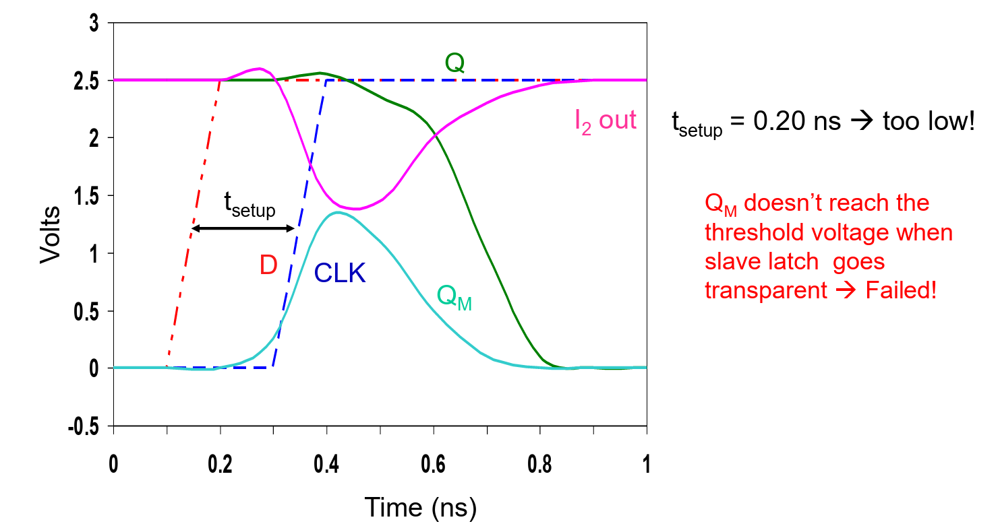<figcaption></figcaption></figure>




#### Hold Time

The hold time indicates that the input D must be held for $$t_{\text{hold}}$$ before it can change. In this case, assuming that $$I_1$$ and $$I_7$$ has the same delay, the hold tims is 0.



#### Clock-to-q Delay

This is the time between the clock's rising edge and the output $$Q$$. Thus,

$$
t_{\text{c-q}}=t_{\text{pd\_tx}}+t_{\text{pd\_inv}}
$$



#### Reduced Load Based

The master-slaved edge triggered register can also be built using the reduced load based latches.

<figure>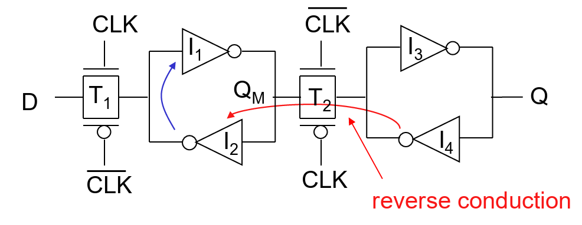<figcaption></figcaption></figure>

Similarly, to switch the state of the master, $$T_1$$ must be sized to overpower $$I_2$$ and force the state change.

Clock Skew Problem

Suppose we we the pass transistor to build a master-slave edge triggered register as follows and we assume that our clock signal isn't ideal.

<figure>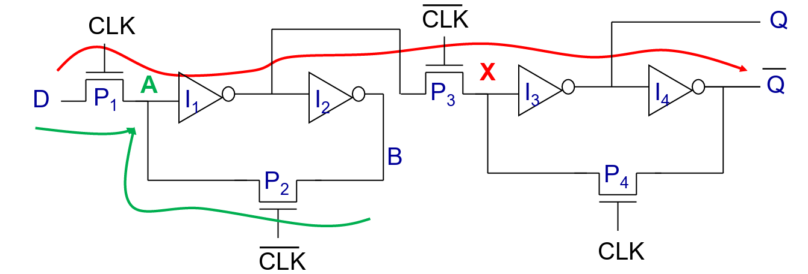<figcaption></figcaption></figure>

We will have a race problem (1-1 overlap), which happens when both CLK and $$\overline{\text{CLK}}$$ are 1. In this case, poth $$P_1$$ and $$P_3$$ are turned on so there is a direct path from input D to the output Q.

To solve this problem, we have two methods

1. Set the hold time to be non-zero.
2. Use non-overlapping clock.

The following diagram illustrates the use of non-overlapping clock method.

<figure>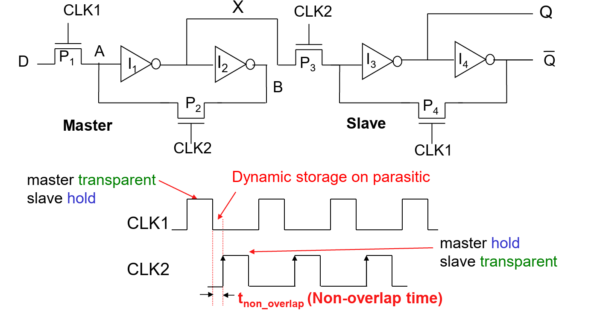<figcaption></figcaption></figure>

## Dynamic Latches and Registers

In the static latches, we use the **feedback path** to hold a state. While in the dynamic latches and registers, we use the **capacitors** to hold the state/charge.

### Register

The dynamic register can be built as follows.

<figure>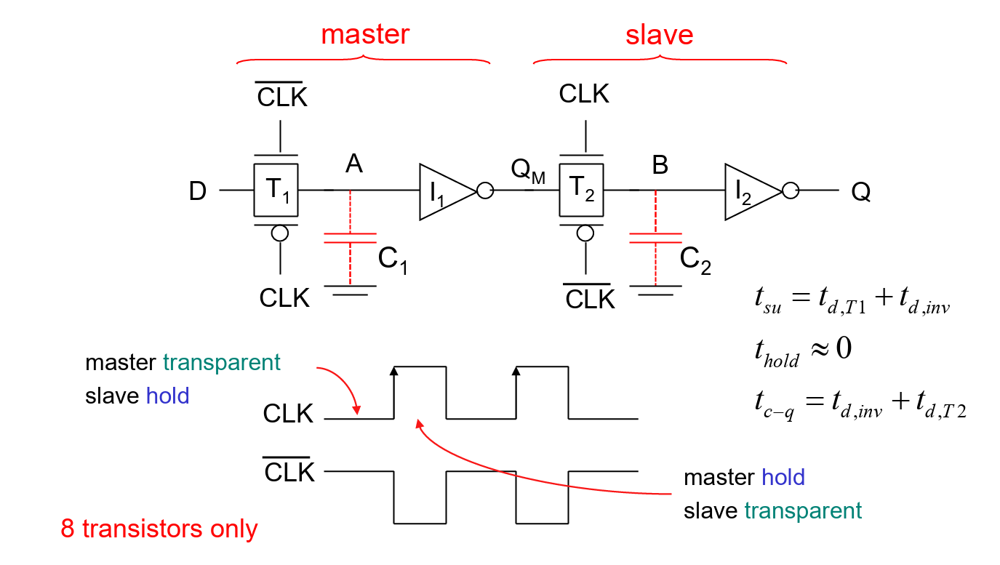<figcaption></figcaption></figure>

Similarly, we should pay attention to how to read the timing properties from this diagram.

#### Race problems

Similarly, we will also encounter the race problems in the dynamic registers. To solve it using the non-overlapping clocks, the illustration can be shown as follows:

<figure>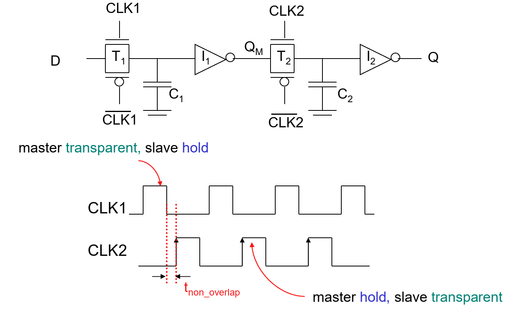<figcaption></figcaption></figure>
