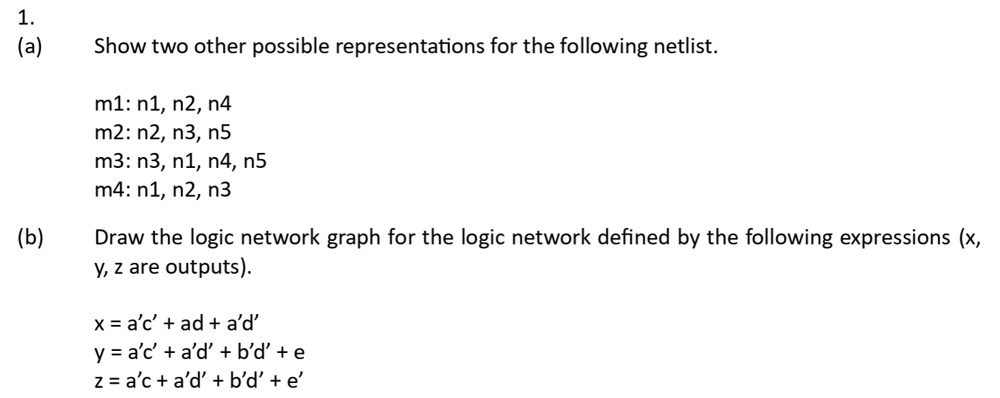
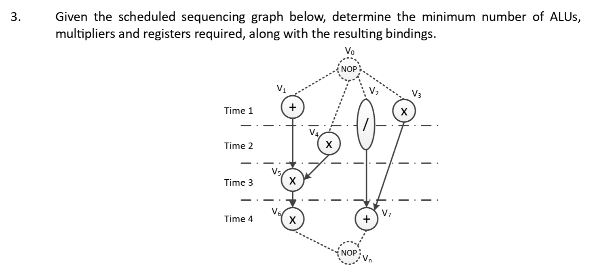
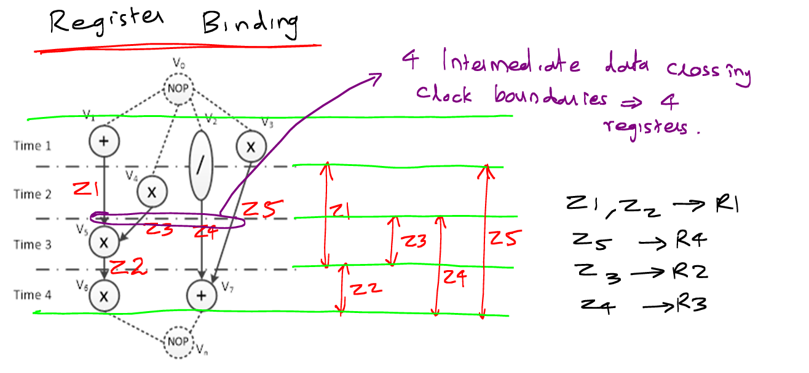

---
metaLinks:
  alternates:
    - /broken/spaces/W45nwClYZdzz9MQG1dUb/pages/Bs5pn2autAi2VruUo8aL
---

# Problem Set 1

## Problems

### 01. Netlist and Logic Network

<figure><figcaption></figcaption></figure>

#### Structural Netlist

> **Netlist** is used to represent a **structure** which is nothing but a bunch of blocks[^1] and their interconnections.

This question is a classic [**structure**](https://app.gitbook.com/s/W45nwClYZdzz9MQG1dUb/micheli/hardware-modeling/abstract-models#structure) hardware model question, where we have three choices to model the structural netlist:

1. Incidence netlist/matrix, where the netlist can have two flavors:
   1. module-oriented netlist.
   2. net-oriented netlist.
2. Hypergraph
3. Bipartite graph

#### Logic Network

> A [**logic network**](https://app.gitbook.com/s/W45nwClYZdzz9MQG1dUb/micheli/hardware-modeling/abstract-models#logic-networks) is nothing but **one block**, which has **multiple/one inputs** and **only one output**. While a **logic network graph**, is to implement that **logic network** with one big block using [smaller blocks](#user-content-fn-2)[^2].
>
> * A **synchronous logic network graph** would be just to add the **registers** on the **edges** of a normal logic network graph.

The detailed logic network and logic network graph is shown as follows.

<figure><figcaption></figcaption></figure>

However, for the logic network (not logic network graph), we can just draw three big black box shown as follows.

<figure><figcaption></figcaption></figure>

### 02. Scheduling

<figure><figcaption></figcaption></figure>

This is a classic scheduling problem and one good way to do the scheduling problem is to draw a table whose column represents the clock cycle and the row represents the resouces. For example,

| Cycle | Multiplier1 | Multiplier2 | ALU |
| ----- | ----------- | ----------- | --- |
| 1     | V1          | —           | V2  |
| 2     | V1          | —           | V3  |
| 3     | V4          | V5          | —   |
| 4     | V4          | V5          | —   |
| 5     | —           | —           | V6  |
| 6     | V7          | —           | —   |
| 7     | V7          | —           | —   |

### 03. Binding

<figure><figcaption></figcaption></figure>

In this question, we need to do two bindings:

1. Resource Binding
2. Register Binding

#### Resource Binding

This is just to come up with a table summarizing the resource binding function $$\beta$$ to each resource type. For example, my binding for this problem is shown in the following table with the following conventions used:

* Resource type: 1 means multiplier and 2 means ALU
* Resource instance: Followed by the resource type

| Operation | Binding Function |
| --------- | ---------------- |
| V1        | (2, 1)           |
| V2        | (1, 2)           |
| V3        | (1, 1)           |
| V4        | (1, 1)           |
| V5        | (1, 1)           |
| V6        | (1, 1)           |
| V7        | (2, 1)           |

#### Register Binding

The register binding is more complex here. But as long as we get the trick, it won't be that hard. To do the register binding, we need to draw the non-register sharing diagram from the **scheduled** sequencing graph, which may look like something below:

<figure><figcaption></figcaption></figure>

The <mark style="color:red;">red</mark> vertical arrows are the key in the problem! It starts at the next cycle of the starting node and ends at the end of the cycle of the ending node! After drawing this kind of diagram, we can easily which register can be shared.

### 04. Combine Everything

In short, all the things we have seen here covers most of the [lec-05-microarchitecture-design.md](../lec/lec-05-microarchitecture-design.md "mention") content. This thing can only be done either by HLS tolls or by humans.


Unlike the HLS synthesis used in the question, the logic synthesis will only do the boolean algebra optimization.


#### Draw the CDFG

The vertice represents the operator type, and the inputs coming to the vertices are the signals. For complex CDFGs like conditional, loops and function calling, the drawing might become more complex.

#### Scheduling

When we have two vertices which we are not sure whether which one can be issued first, look at their distance to the sink node, whichever has a shorter distance should be issued first.

> TODO: check the above point with prof.

In scheduling, if the constraint is resources, we should aim for **lowest latency**. If the constraint is **latency**, we should aim for **minimum resources** used.

#### Binding

To illustrate the binding function for the function units. Just draw a binding function and vertice table.

#### Register Sharing

1. Think about each register should be kept for how long.
2. The output signals **automatically** has a register that can be shared with others if possible.
3. The intuition is that we are **labeling** the intermediate signals in the CDFG with the shared registers.

#### Control Unit Synthesis

If an operator, like multiplier, expands for two cycles, the multiplexer selection unit should be don't care for the first cycle and technically the write enable signal can also be don't care in the first cycle.

#### Control Unit Optimization

Some techniques available reduce the row width, a.k.a, control-store word size, of the controlled unit implemented using microprogramming.

1. Combine the identical columns.
2. Combine the mutually exclusively columns and remember to reserve a binary representation for the NOP.
3. Combine the columns with an explicit shifted pattern and by doing rewiring on the other multiplexer(s).
4. Simplify the available ALU controls.

[^1]: If you think of them as **logic gates**, life will be a lot easier. But, just keep in mind, a block doesn't need to be exactly **one** logic gate. Later you will see that a **block** is nothing but an operator with **multiple/one input** and **only one output.**

[^2]: The smaller blocks can be the fundamental logic gates.
