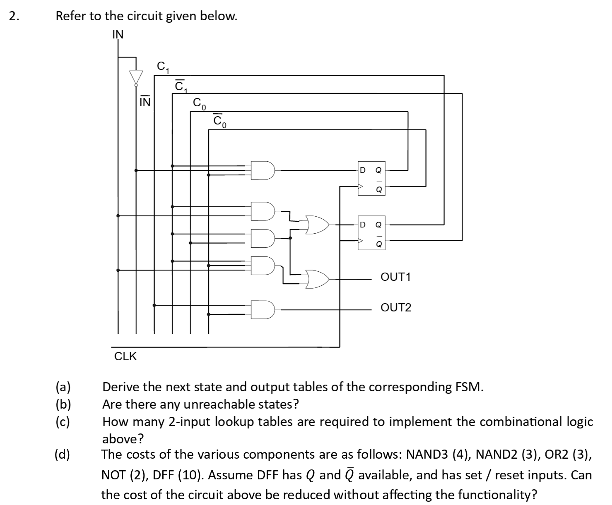
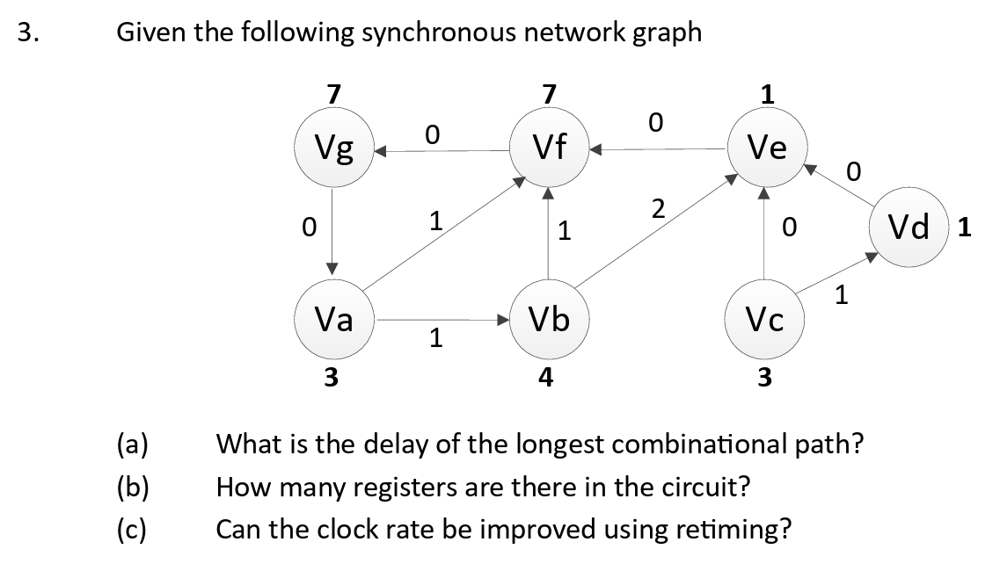

# Problem Set 2

## Problems

### 1. FSM State Minimization

<figure><figcaption></figcaption></figure>

This problem is a classic state minimization problem. We need to master two techniques from this problem:

1. Do the proper state minimization from the state transition table
2. Draw the state transition graph from the state transition table

#### State Minimization

According to the three steps we mentioned in the [lecture](https://app.gitbook.com/s/W45nwClYZdzz9MQG1dUb/micheli/sequential-logic-optimization/synchronous-circuit-optimization-using-state-based-models#normal-method), which is

> * **Initial partition (**$$\Pi_1$$**):** States are placed in the same block if they produce identical **outputs** for every input.
> * **Refinement step (**$$\Pi_k\to\Pi_{k+1}$$**):** States remain in the same block if they were in the same block in  $$\Pi_k$$ **and** their next states fall in the same block of $$\Pi_k$$ for all inputs.
> * **Convergence:** The refinement process terminates when $$\Pi_{k+1}=\Pi_{k}$$.

The steps to solve this problem can be summarized as follows:



#### Do the initial partition based on the outputs

Based purely on the outputs, our initial partition will be

$$
\{A,B,C,D,E,F,H\},\{G\}
$$



#### Refine the initial partition

We first check each pair in the first block and see if their **next states** are in the same partition.


There is no need to check for the outputs as the initial partition is derived from the outputs! So, the states in the same block confirm will have the same outputs.


After checking, we find out that the states in the pair $$\{A,D\}$$  not **equivalent**. Thus, we need to separate state $$D$$ out from the first block to form the third block.


When separating the state $$D$$ out, we must also check if there are other states which are equivalent to $$D$$, meaning that they should have the **same outputs** and the **same next states**. Here, there is no such state, so $$D$$ itself will form the third block.


Now, our partition becomes

$$
\{A,B,C,E,F,H\},\{G\},\{D\}
$$

Start from scratch to check the first block, we find out that the states in the pair $$\{A,B\}$$ are not **equivalent**! Thus, $$B$$ needs to be separated out.


Pay attention, this time, there exists another state which is equivalent to state $$B$$ and this state is state $$F$$. Thus, both of the states $$B$$ and $$F$$ must be separated out to form the fourth block in our partition.


Now, our partition becomes

$$
\{A,C,E,H\},\{G\},\{D\},\{B,F\}
$$

Start from scratch again to do the pair-wise checking, we find out that the states in the pair $$\{A,H\}$$ doesn't match. Thus, state $$H$$ should be taken out and since there is no other state that is equivalent to $$H$$, our partition becomes

$$
\{A,C,E\},\{G\},\{D\},\{B,F\},\{H\}
$$

This is our final partition as all the pairs in the first block match! Thus, after doing state minimizations, we have 4 states.



After doing the state minimization, our new state transition table now becomes as follows:

| Input | Current | Next | Output |
| ----- | ------- | ---- | ------ |
| 0     | A       | B    | 0      |
| 1     | A       | A    | 0      |
| 0     | B       | D    | 0      |
| 1     | B       | A    | 0      |
| 0     | D       | H    | 0      |
| 1     | D       | G    | 0      |
| 0     | G       | B    | 1      |
| 1     | G       | A    | 0      |
| 0     | H       | H    | 0      |
| 1     | H       | A    | 0      |


The trick here is that I replace state $$C$$ and $$E$$ with state $$A$$ as well as replace state $$F$$ with state $$B$$.


#### State Transition Graph Drawing

As state transition graph drawing is **always** based on the state transition table, after we get the state transition table after the state minimization above, the drawing of the state transition graph will become trivial, which can be shown as follows:

<figure><figcaption></figcaption></figure>


As we are dealing with a mealy machine here, so we will use the [mealy-machine drawing convention](https://app.gitbook.com/s/jTJFBPtKk6NwweAooH53/lec/lec-02-digital-system-design-and-verilog#finite-state-machines) in our state transition graph!


### 2. FSM Reverse Engineering

<figure><figcaption></figcaption></figure>

This is a classic problem regarding the FSM reverse engineering, where we need to reverse engineer the state transition table from the structural network!.

#### Reverse Engineering

From the structural network diagram, the most important thing is to find the number of **registers** as it indicates the number of **state bits** $$n_b$$ that are used in the FSM and the total number of states $$n_s=2^{n_b}$$ if the problem didn't specify it uses the one-hot state encoding.

Thus, in this problem, as we have two registesr, we have 4 states in total and we can use $$C_1C_0$$ to denote the current state and $$C_1^+C_0^+$$ to denote the next states first. Then we write down the boolean equation for $$C_1^+,C_0^+$$, Out1 and Out2:

$$
\begin{align*}
C_0^+ &= \text{IN}\,\overline{C_1}\,\overline{C_0} \\
C_1^+ &= \text{IN}\,\overline{C_1} + \overline{C_1}\,C_0 \\
\text{Out1} &= \overline{C_1}\,C_0 +\text{IN}\,\overline{C_1}\,\overline{C_0} \\
\text{Out2} &= \,C_1\,\overline{C_0}
\end{align*}
$$

Based on these four equations, we can quickly find the position where $$C_1^+,C_0^+$$, Out1 and Out2 are 1. Thus, our state transition table will look like as follows:

| IN | C1 | C0 | C1⁺ | C0⁺ | out1 | out2 |
| -- | -- | -- | --- | --- | ---- | ---- |
| 0  | 0  | 0  | 0   | 1   | 0    | 0    |
| 0  | 0  | 1  | 1   | 0   | 1    | 0    |
| 0  | 1  | 0  | 0   | 0   | 0    | 1    |
| 0  | 1  | 1  | 0   | 0   | 0    | 0    |
| 1  | 0  | 0  | 1   | 0   | 1    | 0    |
| 1  | 0  | 1  | 1   | 0   | 1    | 0    |
| 1  | 1  | 0  | 0   | 0   | 0    | 1    |
| 1  | 1  | 1  | 0   | 0   | 0    | 0    |

After getting the state transition table, suppose that we use the encoding as follows:

$$
S_0=00,S_1=01,S_2=10,S_3=11
$$

We can get the state transition table that we are familiar with as follows:

| IN | Current State | Next State | out1 | out2 |
| -- | ------------- | ---------- | ---- | ---- |
| 0  | S0            | S1         | 0    | 0    |
| 1  | S0            | S2         | 1    | 0    |
| 0  | S1            | S2         | 1    | 0    |
| 1  | S1            | S2         | 1    | 0    |
| 0  | S2            | S0         | 0    | 1    |
| 1  | S2            | S0         | 0    | 1    |
| 0  | S3            | S0         | 0    | 0    |
| 1  | S3            | S0         | 0    | 0    |

#### Unreachable State

Based on the state transition table above, it is obvious that state $$S_3$$ is unreachable.


Finding the unreachable state is part of the application of our [state extraction](https://app.gitbook.com/s/W45nwClYZdzz9MQG1dUb/micheli/sequential-logic-optimization/implicit-fsm-traversal-methods#state-extraction) techinique.


#### The use of LUT to implement combinational logic

> TODO: Complete this after reviewing for the Chapter 8 and 9.

#### Decomposition

To minimize the area of a circuit, we should think of the skills like dynamic programming learned in [lec-08-technology-mapping.md](../lec/lec-08-technology-mapping.md "mention"). So, the systemetic approach is

1. Decomposition the circuit using the standard cells
2. Partitioning
3. Do the pattern matching
4. Do the covering and use dynamic programming to find the minimum cost of area.

### 3. Retiming

<figure><figcaption></figcaption></figure>

This is a very classic problem of retiming and for those who are taking EE4415 together with EE4218, I believe at this point of time, you must be very familiar with this kind of synchronous logic network!

#### Critical Path

The critical path is the path with the longest propagation delay between two registers. Thus, one trick is to "erase" all the edges with non-zero weights. The critical path in the question is

V_c->V_e->V_f->V_g->V_a

And the critical path length is $$3+1+7+7=3=21$$.

#### Area Estimation in synchronous logic graph

In the "[Area Minimization](https://app.gitbook.com/s/W45nwClYZdzz9MQG1dUb/micheli/sequential-logic-optimization/sequential-circuit-optimization-using-network-models#area-minimization)" section in our lecture, we have seen that the registers can be shared, so when there are two registers coming out from a node, in reality only **one register** is needed (We can add one more wire!)

Thus, the total number of registers needed here is **4**!

#### Retiming

This will be very easy if you are from EE4415! As the iteration bound in this circuit is the loop from $$V_a$$->$$V_f$$->$$V_g$$ with the loop bound of 17. Thus, the optimum critical path length in this circuit is 17 if we are not doing the timing interleaving!
