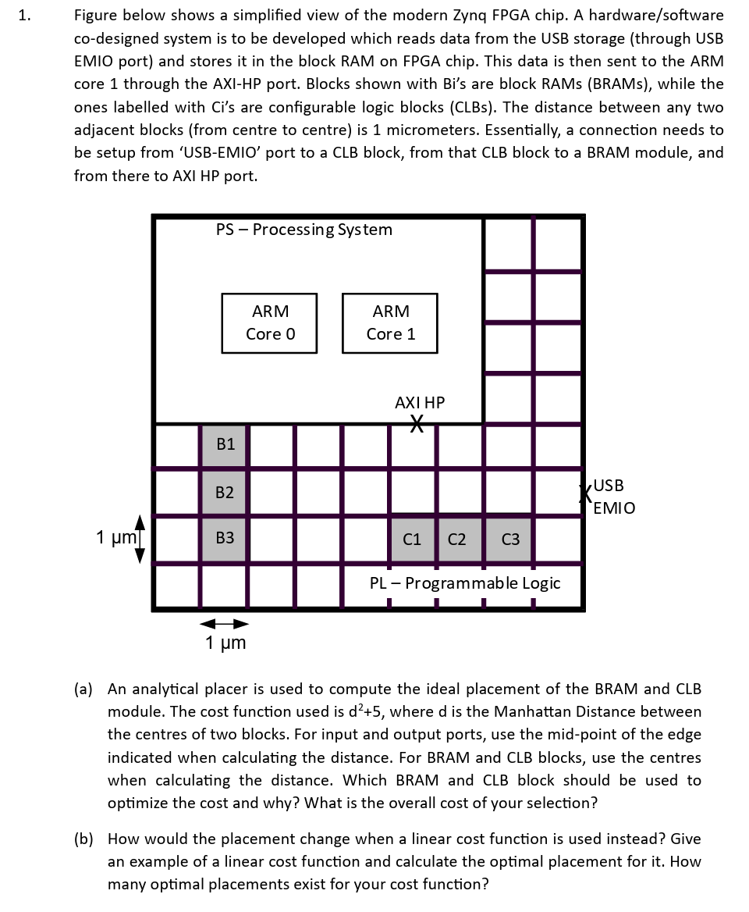
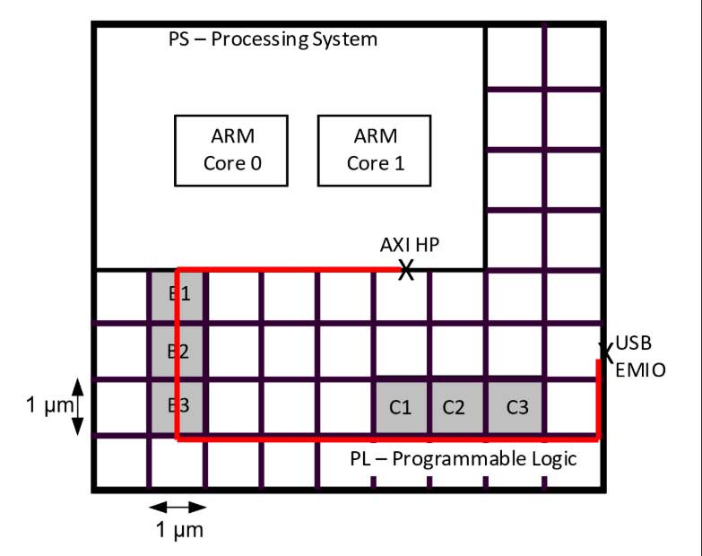
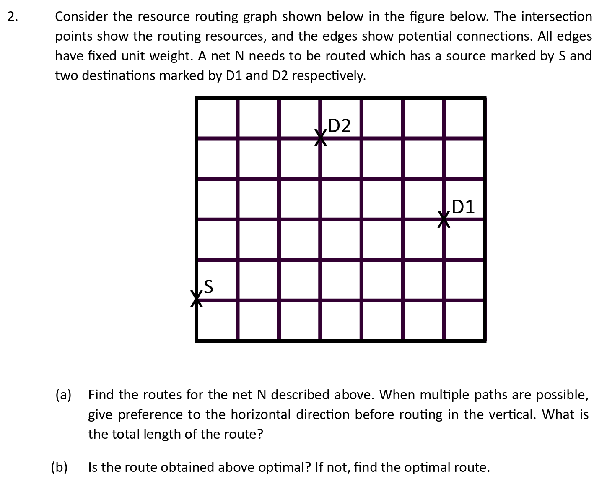

# Problem Set 3

## Problems

### 1. Placement

<figure><figcaption></figcaption></figure>

This is a classic placement question and it consists of two parts of the analytical placer:

1. Quadratic Cost Function
2. Linear Cost Function

#### Quadratic Cost

We've seen in the lecture that the quadratic cost function tends to minimize the **standard deviation** of wires, which will penalize long wires and might give us better timing performance. In other words, we want the wiring from the following three parts to be around the **same**:

1. USB -> Ci
2. Ci -> Bi
3. Bi -> AXI HP

This will give us the answer for this question, which is to choose **C1** and **B2**. And the total cost is thus,

$$
4.5^2+5^2+5.5^2+5\times3=90.5
$$

#### Linear Cost

The linear cost function tends to minimize the **total wire length**, which tends to minimize the cost. In this question, it is obvious that if we use a linear cost function, whatever BRAM and CLB block we choose, the total wire length remains the **same**!

<figure><figcaption></figcaption></figure>

### Routing

<figure><figcaption></figcaption></figure>

This is a classic routing problem. And it mainly tests the application of using BFS to find the optimal routing with some constraints and without any constraint.

#### With Constraints

In the part (a), the constraint lies in the choice of routing path. In this question, it says:

> give preference to the horizontal direction before routing in the vertical

This means that **starting from the target**, we should route horizontally first!

#### Without Constraint

It is trivial and left it as an exercise for the interested readers.
