# Lec 3a - Digital Design Flow

## ASIC Fundamentals

### What is an ASIC

ASIC design, or Application-Specific Integrated Circuit design, is the specialized process of developing integrated circuits (ICs) that are custom-built for a specific application, product, or use case. Unlike general-purpose chips, such as microprocessors or FPGAs (Field Programmable Gate Arrays), ASICs are optimized to perform a predefined function with maximum efficiency, high performance, and low power consumption.

In modern practice, most ASICs are **not designed at the transistor level**. Instead, they are built by assembling **pre-designed and pre-characterized logic cells** from a **standard-cell library**. These cells include gates, flip-flops, multiplexers, memories, and other functional blocks, each with known area, timing, and power properties.

Therefore, a more practical way to define an ASIC is by its **design style** rather than by its application:

> An ASIC is a VLSI design that is implemented using a **cell library-based methodology**, where a digital system is synthesized, placed, and routed using standard cells provided by a semiconductor foundry or IP vendor.

### Design Styles

ASICs can be classified by **how much of the silicon is customized** and **when the functionality is fixed**.

<figure>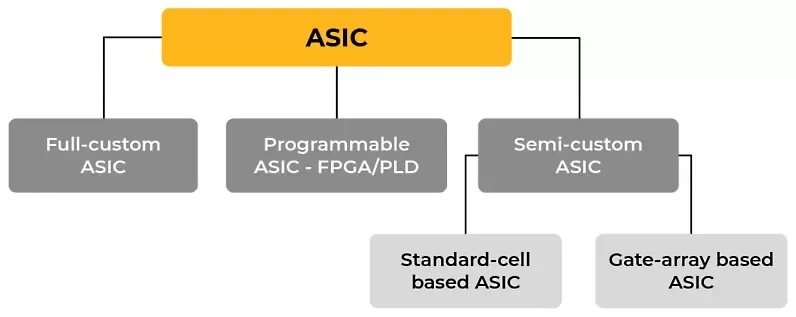<figcaption></figcaption></figure>

#### Full-Custom ASIC

In a **full-custom** design, the entire chip is designed at the **transistor and layout level**.

* All [mask layers](#user-content-fn-1)[^1] are customized
* Digital logic, analog circuits, memories, and I/O are fully hand-designed
* Allows **maximum performance, lowest power, and smallest area**
* Extremely expensive and time-consuming

The full-custom method is more complex and costly, but it can do much more than the gate array method (or called "[programmable](lec-3a-digital-design-flow.md#programmable-asic)" method). The size of the ASIC decreases significantly as the design incorporates only the necessary gates and electronics, and unused gates are deleted. These ASICs are designed for a specific purpose and support a particular function in the end product.


This style is used for high-end CPUs, GPUs, RF circuits, analog/mixed-signal ICs, high-speed interfaces.


An example of the full-custom layout is shown below.

<figure>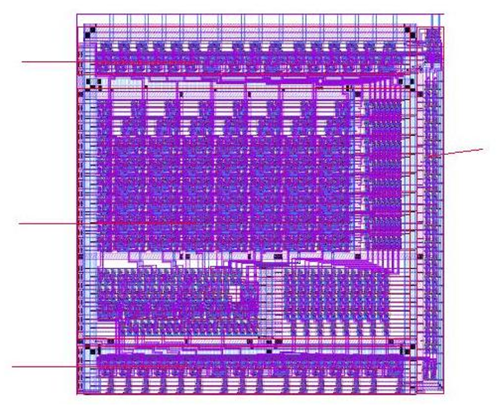<figcaption></figcaption></figure>

#### Semi-Custom ASIC

> This approach involves **predefining** diffused layers, transistors, and other active devices to minimize initial design efforts, which reduces non-recurring engineering costs. The production cycles are significantly shorter because the metallization process is utilized, which is a relatively swift process compared to full custom design. During the final design phase, engineers manipulate specific switches, opening and closing them to guide the chip's behavior according to the desired specifications.

In **semi-custom** design, the chip is built from **pre-designed logic cells**, but the **interconnections are customized**.



#### Cell-Based ASIC

This type of ASIC uses predesigned logic cells called **standard cells**, such as gates, multiplexers, and flip-flops. **Standard cells** are made using **full-custom** design methodology and serve as basic building blocks for ASIC design, ensuring the same performance and flexibility but reducing time and risk.

In reality, these standard cells will be placed in a **row** so we have a row of cells.

* Each row corresponds to a macroscopic block created by the **partitioning**.
* And the location of the row is determined by **floor planning**.
* Within that specific row, the location of the standard cell is decided by the **placement** algorithm.
* After the placement, **routing** is done **globally first** to determine which channel that the wire can be put into and **then locally** to decide the exact wire connections between standard cells and the macroscopic rows.

<figure>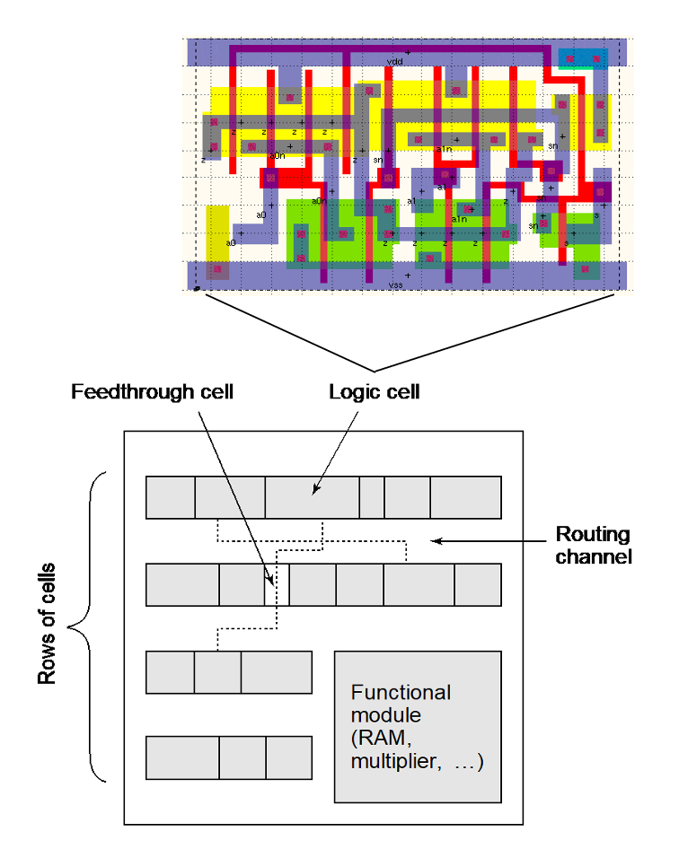<figcaption></figcaption></figure>

In the image above, the big square block actually represents another flavor of the standard-cell design called **macro-cell**. In our layout, instead of the standard cells, we can also have **macro-cell**, also called the IP blocks, like CPUs, RAM, etc.



#### Gate-array Based ASIC

In this category of ASIC, transistors, logic gates, and other active devices are created and manufactured on a silicon wafer, while **interconnects** are not formed during fabrication. The pre-established arrangement of transistors on the gate array is referred to as the base array, and the smallest repetitive element forming the gate array is called the **base cell**. Several advantages accompany this approach, including a shorter turnaround time, higher logic density, and customization of contact layers.



An example of the standard cell layout is given below.

<figure>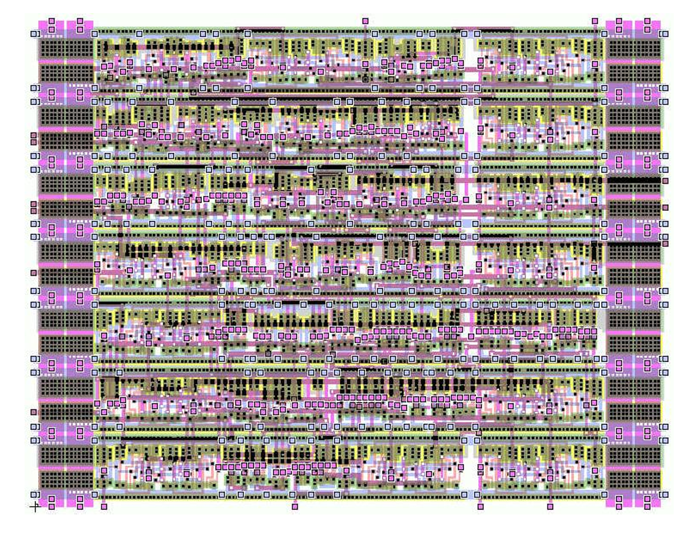<figcaption></figcaption></figure>

Compared to the full custom design layout, we can clearly see the flavour or **rows** used in the standard cell layout.

#### Programmable ASIC

This type of ASIC can be programmed at the hardware level after manufacturing. Unlike traditional ASICs, which are custom-designed and fabricated for specific applications, programmable ASICs offer a degree of flexibility and reprogramming. Programmable logic devices (PLDs) and [field-programmable gate arrays (FPGAs)](https://app.gitbook.com/s/jTJFBPtKk6NwweAooH53/textbook/digital-building-blocks/logic-arrays#field-programmable-gate-array) are perfect examples of programmable ASICs.

In the Programmable ASIC, we also have two flavors



#### Island FPGAs

In this flavor, we have arrays of configurable logic blocks (CLBs) as well as horizontal and vertical routing channels. This can be illustrated as below.

<figure>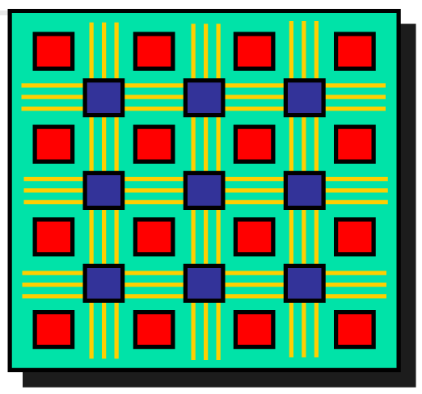<figcaption></figcaption></figure>



#### Row-based FPGAs

This flavor is more like the standard-cell design where we have **rows** of CLBs and routing channels with fixed width between these rows of logic. This can be shown as follows.

<figure>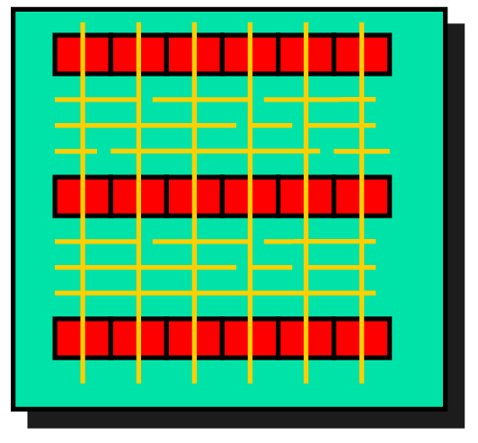<figcaption></figcaption></figure>



## The Design Flow Lifecycle


Ths ASIC Design Flow of this part is combined together with the EE4218 Lec 09 — Physical Design.


### ASIC Design Flow

The ASIC design flow describes the sequence of steps used to transform a **high-level system idea** into a **manufacturable integrated circuit**. Each step progressively adds more implementation detail, moving from abstract functionality to physical silicon.

<figure>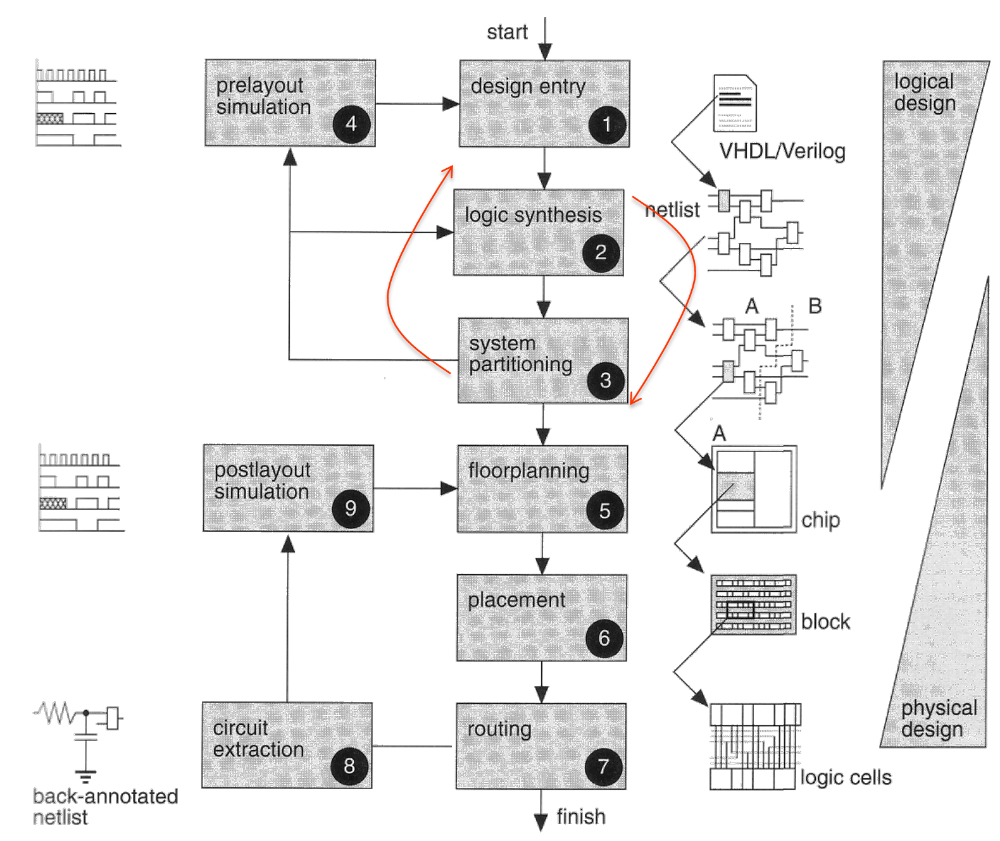<figcaption></figcaption></figure>


Sometimes the **system partitioning** can be moved before the logic synthesis to help us write hierarchical HDL code. But if it is placed after the logic synthesis, it means that we are partitioning the netlist to get the macroscopic block that will be used in the upcoming floor planning stage.


#### Design Entry

> Describe what the chip should do.

The designer enters the circuit into an ASIC design system. Historically, this was done using **schematics**, but modern designs use **Hardware Description Languages (HDLs)** such as Verilog or VHDL, or even higher-level models such as **SystemC**.

This stage defines:

* The functionality of the chip
* The data paths and control logic
* Clocking and reset behavior


**Output:** RTL or high-level behavioral description of the system.


#### System Partitioning (Before)

> Break a large system into manageable blocks.

A complex chip is divided into smaller **subsystems or modules**, arranged hierarchically. Each block is designed to be small enough to fit within the limits of current ASIC technology and tools.

This step decides:

* Which functions go into which block
* How blocks communicate (interfaces, buses, clocks)
* What is hardware vs software (if applicable)


**Output:** Block-level architecture and interface definitions or a more hierarchical **RTL code**.


#### Logic Synthesis

> Convert abstract logic into real hardware.

The HDL description is converted into a **gate-level netlist** using a logic synthesis tool. This netlist is nothing but a HDL file containing:

* Standard cells module instantiations (AND, OR, flip-flops, multiplexers, etc.)
* Their logical connections

The synthesis tool optimizes the design for:

* Performance/Speed (timing)
* Power
* Area


**Output:** Technology-mapped gate-level netlist.


#### System Partitioning (After)

> Break a **netlist** into smaller and manageable blocks.

The idea is similar to the system partitioning mentioned in step 2 excepted that the partitioning here is done at the **netlist** instead of the complex chip. For example, we can partition the following netlist into three partitions.

<figure>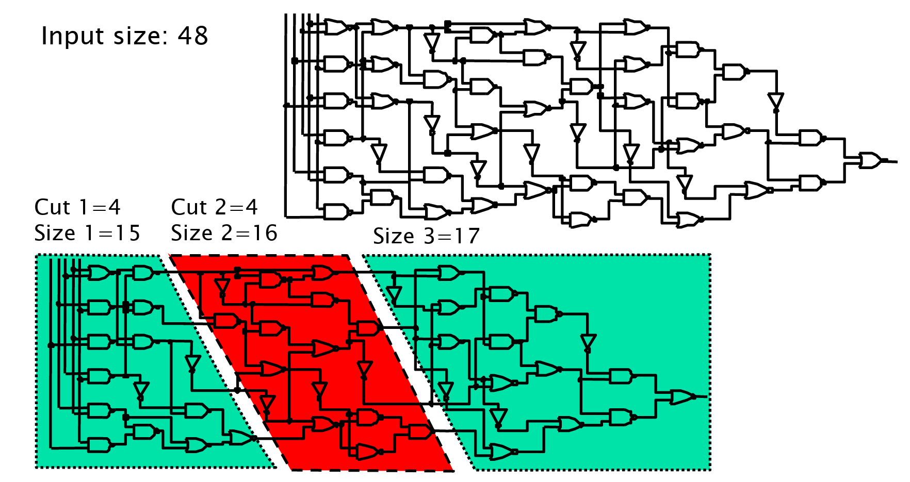<figcaption></figcaption></figure>

To make the partition, we must ensure the the **cut** will cross the **minimum number of edges**.


**Output**: A netlist with several **macroscopic blocks**.


Subgraph Replication to reduce the crossed edges

Sometimes we can do some circuit manipulations such as the **subgraph replication** to minimize the crossed edges by the partition algorithm.

<figure>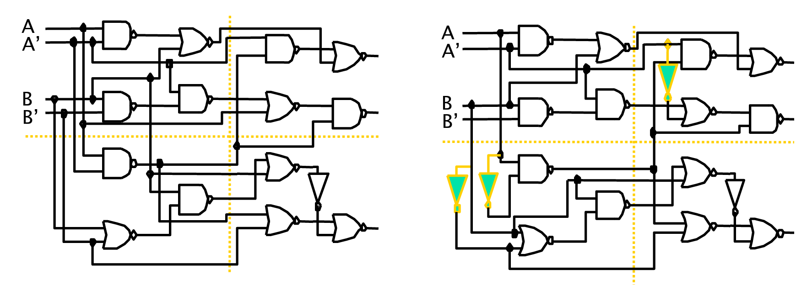<figcaption></figcaption></figure>

As seen in the graph above, by using extra NOT gates at the inputs A and A' in the specific partitions, we reduce the number of crossed edges by the partition algorithm.

#### Pre-layout simulation

> Verify functional correctness before physical design.

The synthesized netlist is simulated to ensure the design still behaves correctly after synthesis. At this stage:

* Only logic delays are considered
* Wire delays are not yet included

**Output:** **Functionally** verified gate-level design.


This catches logic errors introduced during synthesis.


#### Floor Planning

> **Floor planning** is a physical design step in which a topology of a complete chip is planned on a (usually) rectangular area so that the final area, interconnects, and possibly power consumption can be minimized by strategically budgeting **areas** for functional modules and their **physical locations** along the I/O pads, clock and power/ground rails.

In other words, **floor planning** is nothing but to determine the **approximate** location of the **macroscopic blocks** from Step 4 (System partitioning used on the netlist).


**Output:** A circuit layout with the **rows** and maybe other IP blocks placed.


#### Placement

> **Placement** is a physical design step in which various functional modules, after being planned, will be placed to achieve routability so that the final area, interconnects, timing/congestions and possibly power consumption can be minimized.

In other words, **placement** is nothing but decide the approximate location of the **standard cells** within each row in the layout. An example of a bad placement vs. a good placement.

<figure>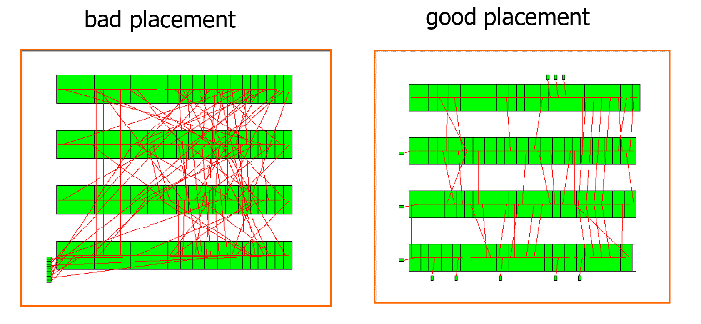<figcaption></figcaption></figure>


**Output:** Physically placed cells, but not yet wired.



#### Floor planning vs. Placement

Floor planning is coarse/macroscopic/large-block level, as opposed to placement, which is fine/microscopic/cell-level.


#### Routing

> **Routing** is a physical design step in which various functional modules, after being placed, are connected so that the final area, delay, number of layers, and vias can be minimized by performing **global** (coarse) routing followed by **detailed** (fine) routing of modules according to some micro-electronic governing issues.

In other words, **routing** is when wires are created to connect:

* standard cells inside rows[^2]
* Different rows

While the routing has two flavors:

1. **Global routing**: It decides which channel[^3] the wires can go into.
2. **Detailed routing**: It decides the exact route for each wire.


**Output:** Fully routed chip layout which is nothing but the full **physical layout** of the chip.


#### Circuit Extraction

> Find the real electrical behavior of wires.

From the physical layout, tools calculate:

* Resistance (R)
* Capacitance (C)

of every wire and interconnect. These parasitic values affect:

* Delay
* Power
* Signal integrity


**Output:** An extracted RC model of the chip.


#### Post-layout Simulation

> Verify that the real chip still works.

The design is simulated again using:

* Gate delays
* Extracted wire delays and capacitances

This checks whether:

* Timing constraints are still met
* The chip operates correctly at its target speed

If problems are found, the design may need to go back to placement or routing for fixes.


**Output:** A design that is ready for fabrication.


Cell-Based Design Flow.

The cell-based flow is a standard industry methodology for taking a design from concept to physical silicon.

1. **Front-End (Logical Design)**
   1. **Spec Development:** Defining the requirements of the chip. e.g., the throughput, power etc.
   2. **HDL (RTL) Coding & Simulation:** Writing the design in a HDL and verifying its logical behavior.
   3. **Preliminary Synthesis:** Converting the code into a generic gate-level netlist.
   4. **Preliminary Floorplanning:** Estimating the area and initial placement to refine the synthesis.
   5. **Design for Testability (DFT):** Adding hardware to allow the chip to be tested after manufacturing; involves Test Pattern Generation.
   6. **Pre-layout Simulation:** Verifying the logic again before physical layout begins.
2. **Back-End Physical Design**
   1. **Layout:** Involves Floorplanning (area allocation), Placement (fixing cell locations), and Routing (connecting wires).
   2. **Post-layout Simulation & Static Timing Analysis (STA):** Verifying the design with real wire delays to ensure it meets speed requirements. (This will be done in the second half of EE4415)
   3. **ECO (Engineering Change Order):** Making small, late-stage manual fixes to the design.
   4. **Layout Verification:** Ensuring the physical file is error-free. This includes:
      * **DRC:** Design Rule Checking (physical spacing rules).
      * **ERC:** Electrical Rule Checking (power/ground rules).
      * **LVS:** Layout vs. Schematic (ensuring the layout matches the logic).
      * **Antenna & Metal Density:** Checks for manufacturing reliability.


This is the industry version of the ASIC Design Flow we introduce below/later.

* In **Synopsys**, this flow is introduced in the [textbook 2: AACS](../../textbook-2-synopsys/asic-design-methodology/traditional-design-flow.md).


### Levels of Abstraction

The levels of abstraction is ASIC Design Flow can be summarized as follows

<figure>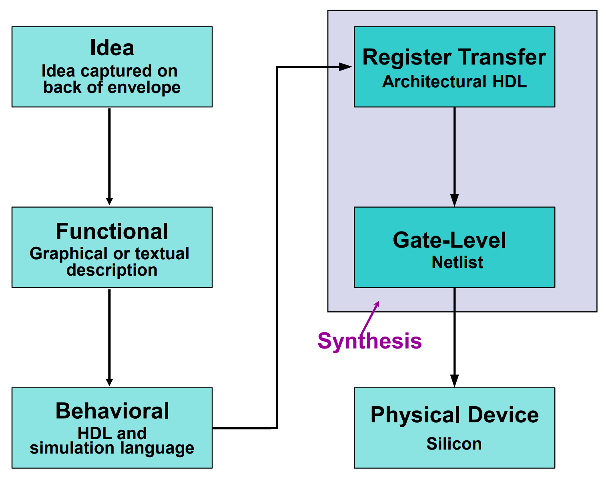<figcaption></figcaption></figure>

### Logic Design Approaches

There are two primary ways to approach the creation and verification of digital logic:



#### Capture-and-Simulation

* **Method:** This involves manually drawing the schematic representation of gates and flip-flops.
* **Verification:** The design is debugged and verified through simulation to ensure the logic gates behave as intended.
* **Context:** This is a more traditional, visual approach to circuit design.



#### Describe-and-Synthesis

* **Method:** The designer writes the logic using high-level descriptions such as:
  * Boolean equations
  * Finite State Machines (FSM)
  * Hardware Description Languages (HDL) like Verilog or VHDL
* **Automation:** A software tool called a synthesizer performs the transformation and compilation.
* **Outcome:** The synthesizer automatically converts the high-level description into a gate-level netlist.



### Simulation Levels

#### Behavioral Level Simulation

The highest level of abstraction in the design process, focusing on what the system does rather than how it is physically built.

* **Purposes:**
  * **Functionality:** Verifying that the logic performs the intended task.
  * **Algorithmic Correctness:** Ensuring the underlying mathematical or logical algorithms are sound before hardware details are added.
* **Ways to implement:**
  * **System Tools:** System Studio (Synopsys SystemC), MatLab, or SDL (Specification and Description Language).
  * **High-Level Languages:** C, C++, or Java.
  * **HDLs:** SystemVerilog, Verilog, or VHDL.
* **Key Drawback:** No Cycle-Accuracy. It does not necessarily capture the exact clock cycle counts or precise hardware timing of the final product.

#### RTL-Level Simulation

**RTL (Register-Transfer Level)** is the most common level for synthesis, representing the design in terms of registers and the data moving between them.

* **Purposes:**
  * **Validation Model for Structural Code:** Acts as a bridge between high-level algorithms and gate-level implementation.
  * **Full Functionality:** Provides a complete functional description of the hardware.
* **Key Characteristics:**
  * **Register Transfer Operations:** Specifically details how data is stored in and moved between registers (e.g., flip-flops).
  * **Cycle Accurate:** Unlike behavioral simulation, RTL is synchronized with clock cycles, ensuring the design produces results at the correct time.
  * **Synchronous Logic:** Highly dependent on clock signals to guide operations.

#### Logic Synthesis

Logic synthesis is the process that provides a link between a high-level HDL (Verilog or VHDL) and a gate-level netlist.

* **Techniques used:** Two-level/multi-level logic minimization, FSM encoding, and various heuristics.
* **Common Tools:** Design Compiler (Synopsys) and BuildGates (Cadence).



#### The Synthesis Process

Synthesis is defined by the formula: **Translation + Optimization + Mapping.**

1. **Translate:** Converts the HDL source code into a "Generic Boolean" format (often called GTECH).
2. **Optimize + Map:** Refines the logic and maps it to the specific gates available in the Target Technology library.

<figure>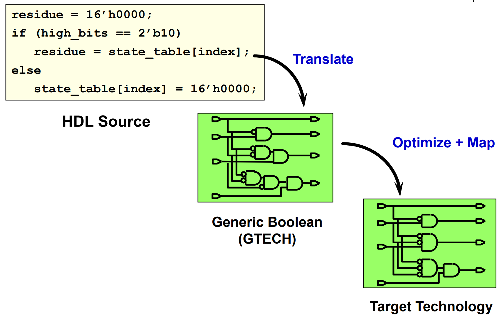<figcaption></figcaption></figure>


The figure above is **very very important**! This is what logic synthesis does in Synopsys design compiler!




#### Benefits of Using Synthesis

* **Efficiency**: Greatly improves **productivity** (handling millions of gates in months) and provides "**Design Tricks**" by automatically managing loads, fanouts, and library limits.
* **Quality**: Higher **abstraction** allows designers to focus on high-level issues while the tool handles the "dirty work" of meeting constraints.
* **Flexibility**: Promotes **reusability** (parameterized code) and **portability** across different tools and technology-independent designs.
* **Reliability:** The design is more **verifiable** and less error-prone since it is validated and implemented in the same language.



## Design Guidelines

Logic synthesis is an **NP-Hard** problem, meaning that as a circuit gets larger, the time and complexity required to find the "perfect" solution grow exponentially.

* **Heuristics:** Because it's too hard to find a perfect solution, tools use "heuristics" (educated guesses/rules of thumb) to find a "near-optimal" result.
* **Optimization vs. Guarantee**: Modern synthesis algorithms do not guarantee the best possible circuit; they simply improve the **starting circuit** we provided.

Two different pieces of code might do the exact same thing (functionally equivalent), but they will yield different synthesis results.

* **Coding Style Matters:** If we write messy or inefficient code, the tool will have a "Poor Start Point" and likely produce a slower or larger chip.
* **The "Fix-it" Myth**: We cannot rely solely on the synthesis tool to "fix" or optimize a poorly designed or poorly coded circuit.

To get the best result, the designer must:

* Deeply understand the circuit being described before writing the code.
* Provide a "Best Start Point" by writing clean, efficient, and hardware-aware HDL to give the tool the best chance at a high-quality final result.

<figure>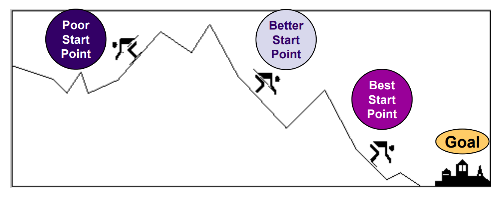<figcaption></figcaption></figure>

And below are the two guidelines recommended to follow when designing ASIC.

### Think Hardware

Synthesis tools are designed to create physical circuits, so our HDL code must describe actual physical structures rather than abstract software behaviors.

* **Write HDL Hardware Descriptions:**
  * Always think of the **topology** (the physical arrangement of components) that our code implies.
  * Our goal is to describe a network of registers, muxes, and gates.
* **Do Not Write HDL Simulation Models:**
  * Avoid using code intended only for software-style testing.
  * **No Explicit Delays**: Commands like "after 20 ns" or "wait 20 ns" cannot be manufactured into hardware gates.
  * **No File I/O**: Hardware cannot "read" or "write" text files the way a computer program does; keep these commands out of synthesizable code.


One essential skill we must master after taking EE4415 is the ability to understand what hardware is inferred from one or more lines of HDL after synthesis.


### Think Synchronous

The reliability and ease of manufacturing a chip depend heavily on how the timing is managed.

* **Benefits of Synchronous Designs:**
  * Synchronous designs (where everything is timed to a clock) run smoothly through the entire lifecycle: **synthesis, test, simulation, and layout.**
  * These designs are easier for tools to analyze for timing errors.
* **Challenges of Asynchronous Designs:**
  * Asynchronous logic (logic not tied to a common clock) is much harder to verify and often requires **hand-instantiation**.
  * They require extensive, complex simulations to ensure they work correctly.
* **Design Strategy**: If we must use asynchronous logic, isolate it into separately compiled blocks to prevent it from complicating the rest of the synchronous system.

## References

1. [Synopsys — What is ASIC Design?](https://www.synopsys.com/glossary/what-is-asic-design.html)

[^1]: A mask layer in VLSI is a photolithographic template (photomask) used during fabrication to define specific geometric patterns of materials — such as silicon, polysilicon, or metal — onto a silicon wafer

[^2]: each row is nothing but a macroscopic block.

[^3]: The channel is the gap between the rows in the layout.
