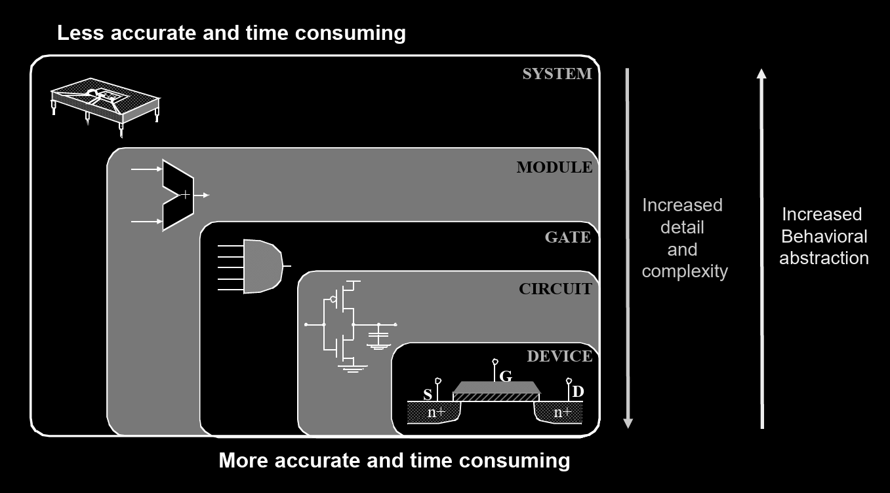
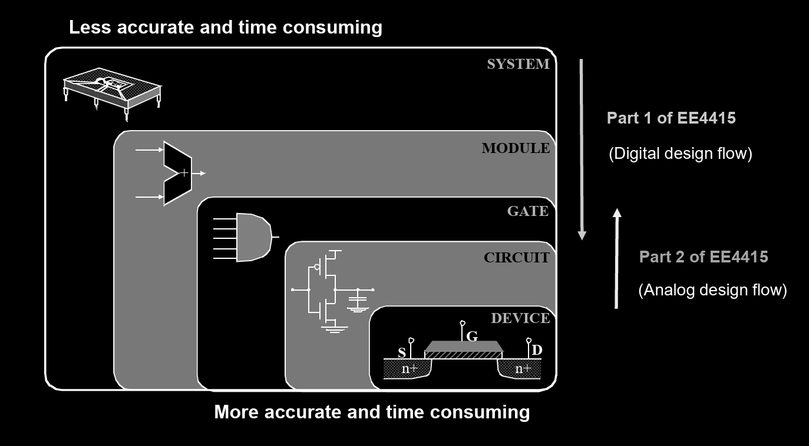
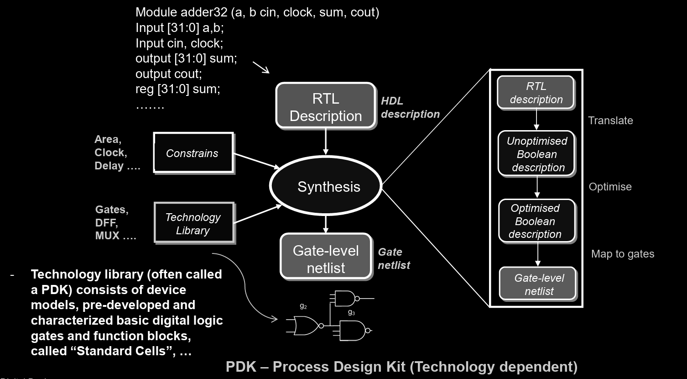
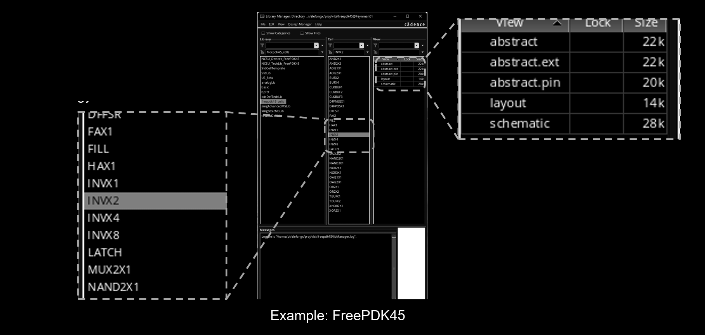
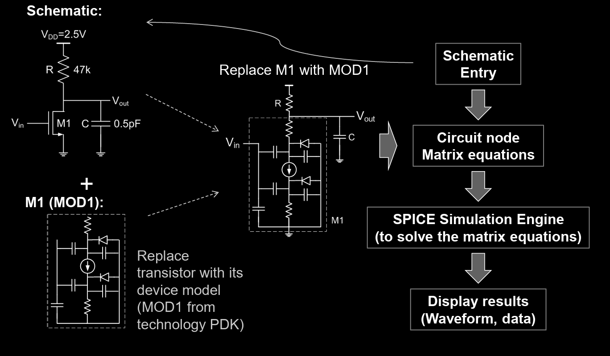
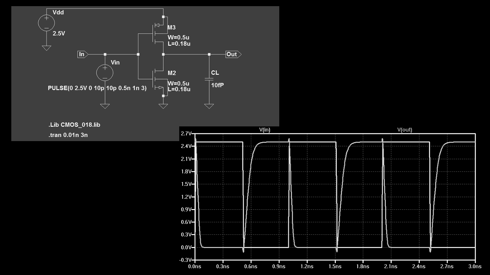

# Lec 0 - Introduction

## Logistics

### Module Introduction

Basically, in the part 2 of EE4415, we are going to learn the **transistor-level design**. If we want to link it to the part 1, what we will learn in part 2 is to know how the **delays** of logic gates are calculated.

### Assessment

The assessment structure for the whole EE4415 is shown as below:

1. Part 1 Mid-term Test: 35%
2. Part 2 Homework 1: 15%
3. Part 2 Homework 2: 20%
4. Part 1 two projects: 30%

## High-Level Picture

### Design Methodology

In CG2027, we have seen the following famous and classic design methodology diagram, and yes in EE4415, we are going to use that again but we will introduce some more interesting stuff!

<figure><figcaption></figcaption></figure>

Some history about this diagram is that:

1. At Intel, they were very good at the **device** and **circuit** level in the past. Thus, they can tune their devices specifically for their microprocessors. This makes Intel put **less effort** on the **module** and **gate** level. However, nowadays those two levels became more and more complex and TSMC is now the lead.
2. At AMD, at first they were not good at **circuit** and **device** level, thus they put more effort on the **system, module** and **gate** level. Now, they can just use TSMC to deal with the two low levels!


That's why at the point of time this note is written, AMD is much better than Intel.


Now, using this design methodology diagram to see EE4415, our findings can be seen from below.

<figure><figcaption></figcaption></figure>

### Digital Design Flow

The digital design flow can be summarized very well in the following diagram.

<figure><figcaption></figcaption></figure>

The smaller box coming out from "synthesis" is pretty similar to the **logic synthesis** part we have learned in synopsys toolchain and [EE4415 Part 1 Lec 03](../part-1-lec-digital-design-flow/lec-3/lec-3a-digital-design-flow.md#logic-synthesis-1).

#### Technology Library

We have seen the technology library in [synopsys tool chain](../textbook-2-synopsys/synopsys-technology-library/technology-libraries.md), EE4218 and CG3207. In Part 2 of EE4415, we are going to use `FreePDK45` in Cadence. So, basically, in the technology library we will have the **design models** for the following elements:

1. Basic logic gates,
2. Registers,
3. Multiplexers,
4. I/O pads

The above are called **standard cells**.


These standard cells are very **technology dependent**, meaning that they are designed and characterized for specific technology.


In Cadence, we our technology looks like below.

<figure><figcaption></figcaption></figure>

While in Synopsys (EE4415 Part 1), our technology library is a `saed32rvt_tt1p05v125c.db` file (this is a logic library and a technology library may have physical library as well). In this `.db` file, we can see a lot of **standard cells** as well.

### SPICE

SPICE stands for **S**imulation **P**rogram with **I**ntegrated **C**ircuit **E**mphasis and it was developed by UC Berkeley in 1971. SPICE is basically a **transistor-level simulator**. An example of the SPICE based analog design flow is shown below.

<figure><figcaption></figcaption></figure>

So, what is really useful about the SPICE is that we can read the **delay information** from the **display results** coming out from the SPICE simulation engine. For example, below is the SPICE waveform for a CMOS Inverter Simulation with LTSpice.

<figure><figcaption></figcaption></figure>

From the waveform, we can easily read the $$t_{\text{PHL}}$$ and $$t_{\text{PLH}}$$ which we have learned in [CG2027](https://app.gitbook.com/s/6nPr3SObC3azazbFhfgF/lec/lec-01-the-devices#timing-diagram).
