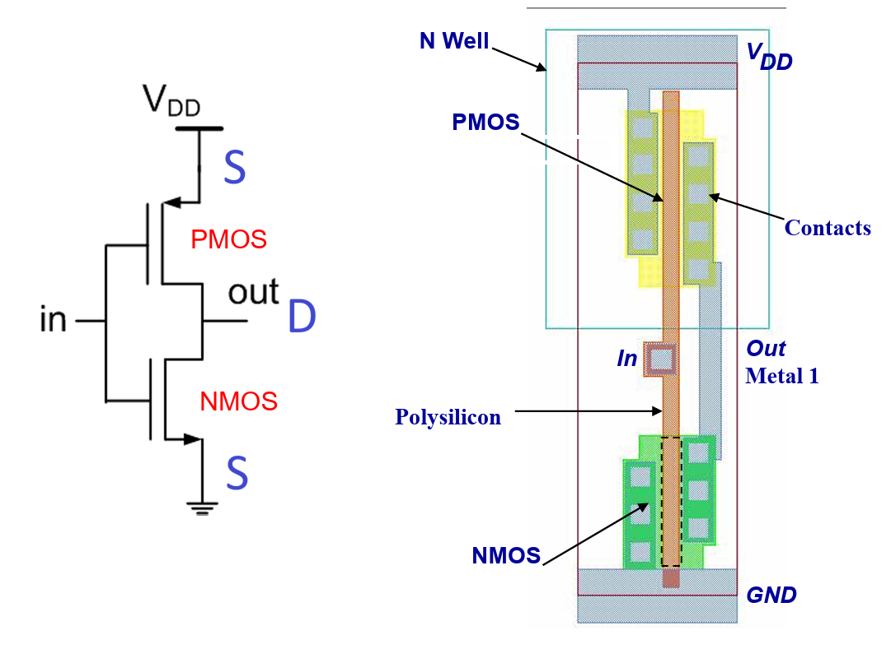
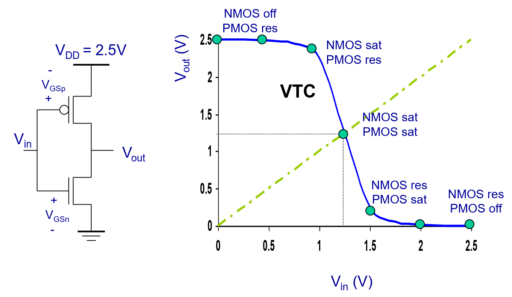
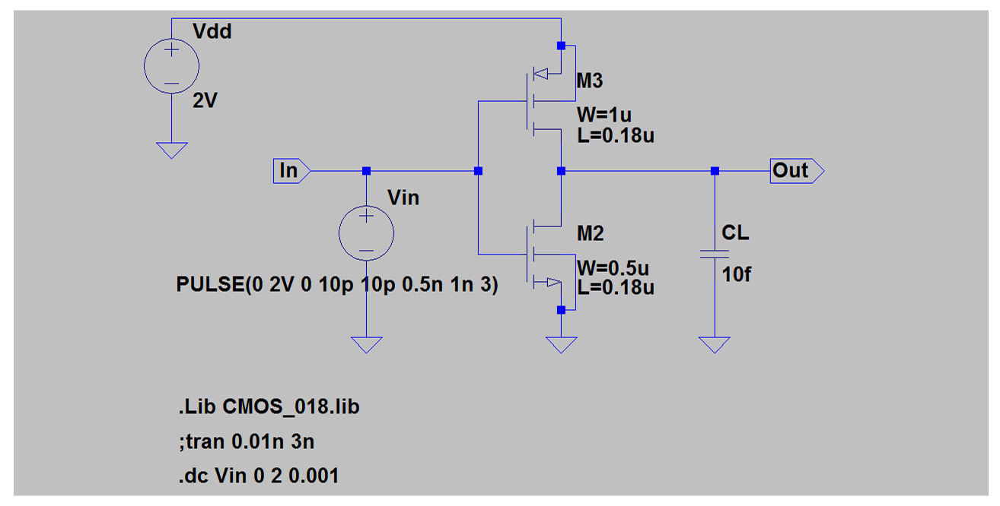
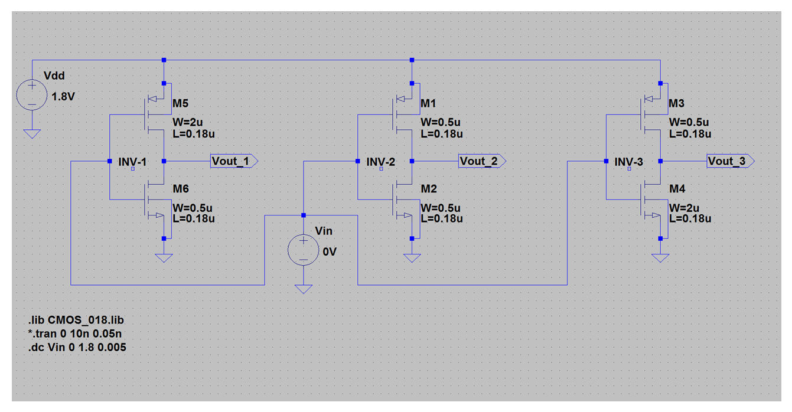
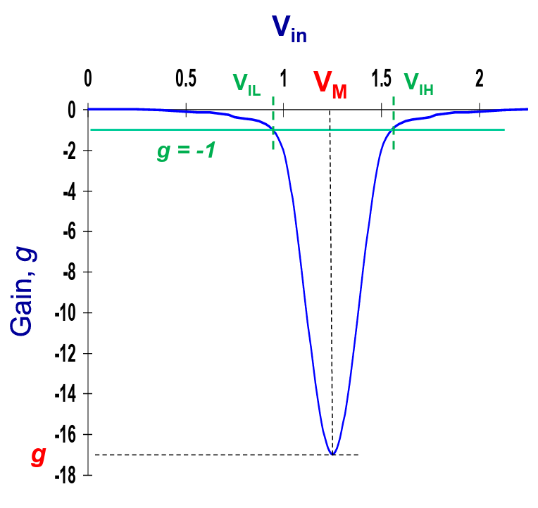

# Lec 2 - CMOS Inverter

## CMOS Inverter

This par requires a good understanding of what's been discussed in [CG2027 Lec 02](https://app.gitbook.com/s/6nPr3SObC3azazbFhfgF/lec/lec-02-cmos-inverter).

### Layout

The circuit symbol and layout of a CMOS Inverter can be shown as follows.

<figure><figcaption></figcaption></figure>

Note that the voltage at the output $$V_{\text{out}}$$ is always **smaller** than $$V_{\text{DD}}$$ and **bigger** than $$0$$, a.k.a, $$0<V_{\text{out}}<V_{\text{DD}}$$. Remember the **assumptions** we made in [NMOS](https://wenbo-notes.gitbook.io/ee4415-icd-notes/part-2-lec-analog-design-flow/lec-1-mosfet-and-cmos-process#assumptions) and [PMOS](https://wenbo-notes.gitbook.io/ee4415-icd-notes/part-2-lec-analog-design-flow/lec-1-mosfet-and-cmos-process#assumptions-1) source and drain in Lec 01? Basically they are

* In NMOS, the voltage at source is **lower** than the voltage at the drain.
* In PMOS, the voltage at source is **higher** than the voltage at the drain.

So, in the CMOS Invertor circuit symbol, it is obvious to figure out the source and drain position and this is shown in the figure above.

### Properties

In the CMOS inverter, we have the following properties



#### Full output swing

We have full rail-to-rail output swing.



#### Low-impedance path

There is always a **low-impedance path** which can be either

1. from the $$V_{\text{DD}}$$ to the $$V_{\text{out}}$$, or
2. from the $$V_{\text{out}}$$ to the $$\text{GND}$$



#### Direct path

There is **no** direct path between $$V_{\text{DD}}$$ and $$\text{GND}$$ in **steady state**. Thus, there is **no static power consumption**.


#### Steady State

In the steady state, the inputs and outputs are held steady.




## Static Analysis

In this part, we will mainly see if we change the gate voltage $$V_{\text{gate}}$$ or the input voltage $$V_{\text{in}}$$ (they are exactly the same in this case), what will happen to the CMOS Inverter.

### Voltage Transfer Characteristic

The voltage transfer characteristic is simply a diagram denoting the relationship between $$V_{\text{in}}$$ and $$V_{\text{out}}$$. One example is shown below.

<figure><figcaption></figcaption></figure>

1. When $$V_{\text{in}}$$ is low, $$V_{\text{out}}$$ is high. In this case
   1. For the NMOS, it is likely that $$V_{\text{GS}}<V_{\text{TN}}$$. Thus, NMOS is **Off**.
   2. For the PMOS, it is likely that $$V_{\text{GS}}<V_{\text{TP}}$$  (L.H.S. is around negative $$V_{\text{DD}}$$ while R.H.S is a small negative number) and $$V_{\text{DS}}>V_{\text{GS}}-V_{\text{TP}}$$ (L.H.S is around 0 while R.H.S is confirm negative). Thus, PMOS is in **Linear.**
2. When $$V_{\text{in}}$$ increases a bit but $$V_{\text{out}}$$ is still high, in this case
   1. For the NMOS, it is likely that $$V_{\text{GS}}>V_{\text{TN}}$$ and $$V_{\text{DS}}>V_{\text{GS}}-V_{\text{TN}}$$ (L.H.S is around $$V_{\text{DD}}$$ while R.H.S is around 0). Thus, NMOS is in **Saturation**.
   2. For the PMOS, it is likely that $$V_{\text{GS}}<V_{\text{TP}}$$ (L.H.S. is still around negative $$V_{\text{DD}}$$ while R.H.S is a small negative number) but $$V_{\text{DS}}>V_{\text{GS}}-V_{\text{TP}}$$ (L.H.S is around 0 while R.H.S is negative). Thus PMOS is in **Linear**.
3. When $$V_{\text{in}}=V_{\text{out}}=\frac{V_{\text{DD}}}{2}$$, in this case
   1. For the NMOS, it is likely that it will be in **Saturation**.
   2. For the PMOS, same likelihood that $$V_{\text{GS}}<V_{\text{TP}}$$ but $$V_{\text{DS}}<V_{\text{GS}}-V_{\text{TP}}$$ (as $$V_{\text{DS}}=V_{\text{GS}}$$ now, L.H.S is definitely **smaller** than R.H.S). Thus PMOS will be in **Saturation**.
4. When $$V_{\text{in}}$$ is a little higher, $$V_{\text{out}}$$ is low. In this case
   1. For the NMOS, it is definitely on. $$V_{\text{DS}}<V_{\text{GS}}-V_{\text{TN}}$$ (L.H.S is around 0 while R.H.S is definitely a **positive** number). Thus NMOS is in **Linear**.
   2. For the PMOS, it is likely that $$V_{\text{GS}}<V_{\text{TP}}$$ and $$V_{\text{DS}}<V_{\text{GS}}-V_{\text{TP}}$$ (L.H.S is around negative $$V_{\text{DD}}$$ while R.H.S is a kind of more negative number)
5. When $$V_{\text{in}}$$ is a little higher, $$V_{\text{out}}$$ is low. In this case
   1. For the NMOS, it is likely that it will be in **Saturation**.
   2. For the PMOS, it is likely that $$V_{\text{GS}}>V_{\text{TP}}$$ (both negative here). Thus, PMOS is in **Off**.

In addition, the region between step 2 to step 4 is called **high-gain region** because the gain[^1] of the curve is **quite high** in its magnitude.

Example of CMOS Inverter VTC.


Read the termologies below before opening this example.


Using SPICE to generate an Inverter VTC for the circuit below,

<figure><figcaption></figcaption></figure>

we may get the following combined diagram of VTC and gain vs. $$V_{\text{in}}$$.

<figure><figcaption></figcaption></figure>

### Terminologies

It is good to utilize the VTC to review the following very important terminologies



#### $$V_{\text{OH}}$$ and $$V_{\text{OL}}$$

$$V_{\text{OH}}$$ and $$V_{\text{OL}}$$ are the output voltages when the **ideal input** low and high are applied to the CMOS Inverter respectively.


Usually, as the ideal input low and high are 0 and $$V_{\text{DD}}$$ respectively, $$V_{\text{OH}}$$ and $$V_{\text{OL}}$$ are thus $$V_{\text{DD}}$$ and 0.




#### Switching Threshold $$V_M$$

The switching threshold $$V_M$$ is when the input voltage is equal to the output voltage ($$V_{\text{in}}=V_{\text{out}}$$). The value can be found easily by drawing a line $$y=x$$ in the VTC graph and finding the x/y-coordinate of the intersection point.

If we want to find the value of $$V_M$$ analytically, we can do so by equating the currents through the transistors.  (TODO, why?) This will give us

$$
V_{\text{M}} =
\frac{
\left(V_{\text{THn}} + \frac{V_{\text{DSATn}}}{2}\right)
+ r\left(V_{\text{DD}} - |V_{\text{THp}}| - \frac{|V_{\text{DSATp}}|}{2}\right)
}{1 + r}
$$

where the ratio $$r$$ compares the **relative driving strengths** of the PMOS and NMOS transistors.

$$
r =
\frac{k_{\text{p}} V_{\text{DSATp}}}{k_{\text{n}} V_{\text{DSATn}}}
=
\frac{k'_{\text{p}} (W/L)_{\text{p}} V_{\text{DSATp}}}
{k'_{\text{n}} (W/L)_{\text{n}} V_{\text{DSATn}}}
$$

The intuition of the ratio $$r$$ is that: $$r$$ is bigger -> PMOS is stronger -> $$V_M$$ is bigger.


The ratio $$W/L$$ is the **size** of NMOS/PMOS.


Impact of r on V_M

Compare the switching threshold ($$V_M$$) of inverters with different $$\frac{(W/L)_p}{(W/L)n}$$.

<figure><figcaption></figcaption></figure>

The SPICE diagram we get is as follows.

<figure><figcaption></figcaption></figure>

From this diagram, we can clearly see that it matches with our intuition on $$r$$.


#### PMOS is generally weaker than NMOS

In the blue curve, when the size of NMOS is the same as the size of PMOS, the threshold voltage is slightly lower than $$V_{\text{DD}}/2$$, this is because when the size of PMOS and NMOS is the same, PMOS is **weaker** than NMOS. This is because of the **mobility** of holes in p-type material is **smaller** than the mobility of electrons in the n-type material.





#### $$V_{\text{IH}}$$ and $$V_{\text{IL}}$$

$$V_{\text{IH}}$$ and $$V_{\text{IL}}$$ are the **minimum** and **maximum** input voltage $$V_{\text{in}}$$ that will cause the output voltage $$V_{\text{out}}$$ to be **low** and **high** respectively.


$$V_{\text{IH}}$$ and $$V_{\text{IL}}$$ are the points where $$d\frac{V_{\text{out}}}{V_{\text{in}}}=-1$$ on the VTC.




#### Noise Margin $$\text{NM}_H$$ and $$\text{NM}_L$$

* $$\text{NM}_H$$ defines how much the $$V_{\text{out}}$$ can **drop** from the **nominal high voltage** ($$V_{\text{OH}}$$) for it to be **read** correctly as logic HIGH by the following gate.
* $$\text{NM}_L$$ defines how much the $$V_{\text{out}}$$ can **go up** from the **nominal low voltage** ($$V_{\text{OL}}$$) for it to be **read** correctly as logic LOW by the following gate.

Mathematically, $$\text{NM}_H=V_{\text{OH}}-V_{\text{IH}}$$ and $$\text{NM}_L=V_{\text{IL}}-V_{\text{OL}}$$.


We want the noise margin to be **bigger**. Thus, the **gain** at the high-gain region should be as big as possible.


Gain of the inverter

Gain is nothing but the slope and it can be found easily in the VTC. Mathematically, it is defined as $$d\frac{V_{\text{out}}}{V_{\text{in}}}$$. Thus, an example of the gain vs. $$V_{\text{in}}$$ diagram can be shown as follows.

<figure><figcaption></figcaption></figure>




[^1]: Can be thought of as the slope.
