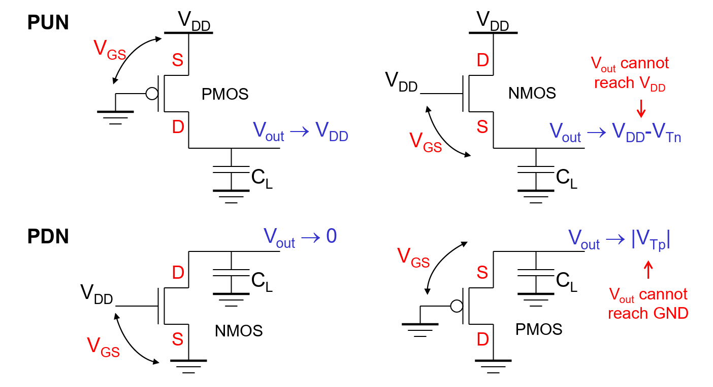

# Lec 3 - Combinational Logic Circuits

In this section, we will be mainly talking about the combinational logic circuits.


The difference between combinational logic circuits and sequential logic circuits has been covered in great detail in my [DDCA notes](https://app.gitbook.com/s/jTJFBPtKk6NwweAooH53/textbook/combinational-logic-design#combinational-vs.-sequential-circuits). It's highly recommended to go through that again. Again, going through [Lec 3 in CG2027](https://app.gitbook.com/s/6nPr3SObC3azazbFhfgF/lec/lec-03-cmos-logic) is also highly recommended!


## Types of Logic Gates

These are also known as the **schemes**. Basically, we have four schemes (2 big schemes plus 2 small schemes actually) for building logic gates:

1. CMOS static logic
2. Ratioed Logic
   1. Pseudo-NMOS Inverter
   2. Dynamic Gate

### CMOS Static Logic

The basic of CMOS static logic is to use the Pull-Up Network (PUN) implemented by PMOS to pull the output to 1 and Pull-Down Network (PDN) implemented by NMOS to pull the output down to 0.

<figure><figcaption></figcaption></figure>


We must design the PUN and PDN to be **mutually exclusive** thus only one network is conducting in steady state.


PUN and PDN are dual networks (De Morgan's Theorems), meaning that **parallel connection** of transistors in the PUN corresponds to a **series** connection of the PDN.

* Parallel connection of NMOS and serial connection of PMOS implements OR. (Be careful, the output is complemented!)
* Serial connection of NMOS and parallel connection of PMOS implements AND. (Same, be careful that the output is complemented!)

Complementary CMOS gate naturally implements the **inverting logic** (NAND, NOR).


The number of transistors for an $$N$$-input CMOS logic gate is $$2N$$.


Why PMOS for PUN and NMOS for PDN?

We have seen in CG2027 that PMOS is good at passing a **strong 1** but weak 0 while NMOS is good at passing a **strong 1** but weak 1.

<figure><figcaption></figcaption></figure>

The main reason lies in the $$V_{\text{GS}}$$ that will turn the MOSFET on and off. For the interested readers, it is not hard to derive this conclusion using the knowledge learned in [Lec 01](lec-1-mosfet-and-cmos-process.md#i-v-characteristic).

#### Construct a Complex Gate


This part just uses the notes I have summarized in [CG2027](https://app.gitbook.com/s/6nPr3SObC3azazbFhfgF/lec/lec-03-cmos-logic#deriving-boolean-functions)!


One more thing to notice that, this procedure to construct a complex gate is all based on the **active high** inputs. If our inputs are **active low**, the solution will be to add an **inverter** to every one of the inputs in the module.


The [CG2027 Lec 04 — Inversion Properpty of a Full adder](https://app.gitbook.com/s/6nPr3SObC3azazbFhfgF/lec/lec-04-alu#inversion-property-of-full-adder) is a very good example for this idea.


### Ratioed Logic

The goal of using ratioed logic is to reduce the **number of** [**devices**](#user-content-fn-1)[^1] in the complementary CMOS. Normally, we have the following three types of ratioed logic.

<figure><figcaption></figcaption></figure>

#### Resistive Load

In this method, we are just utilizing the [voltage divider](#user-content-fn-2)[^2] we have learned in high school physics and our $$V_{\text{OH}}$$ and $$V_{\text{OL}}$$ will be as follows:

$$
V_{\text{OH}}=V_{\text{DD}},~ V_{\text{OL}}=\frac{R_{\text{PDN}}}{R_{\text{PDN}}+R_L}\cdot V_{\text{DD}}
$$


The usage of voltage divider is where the term **ratioed** comes from in this case.


The $$t_{\text{pLH}}$$ and $$t_{\text{pHL}}$$ will thus be

$$
t_{\text{pLH}}=0.69R_LC_L,~t_{\text{pHL}}\approx 0.69R_{\text{PDN}}C_L
$$

In this method, we can find the following three observations:

1. Asymmetrical response ($$V_{\text{OH}}$$ and $$V_{\text{OL}}$$)
2. Static power dissipation when PDN is on as there will be a closed circuit from $$V_{\text{DD}}$$ to $$V_{\text{SS}}$$ in this case.

#### Pseudo-NMOS

> TODO: Add more on that if got more free time.

[^1]: This is nothing but the **transistors**.

[^2]: 
