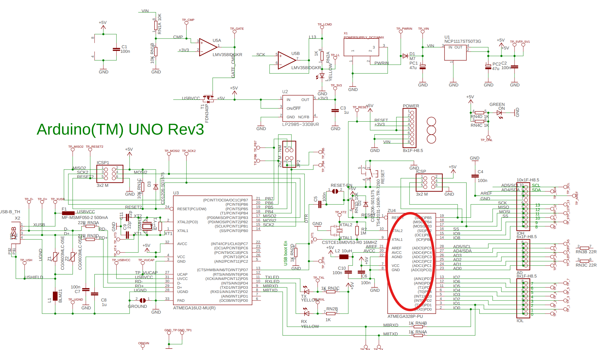
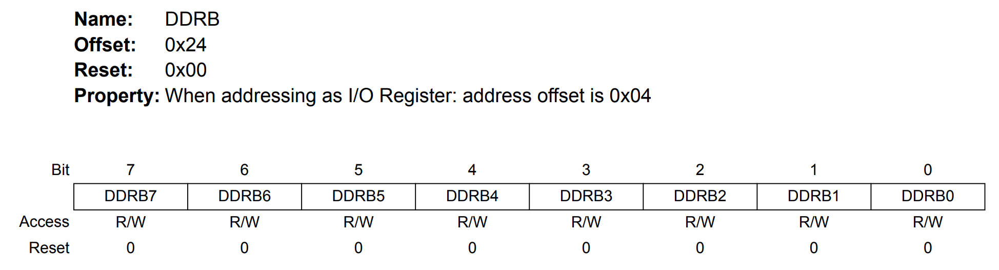
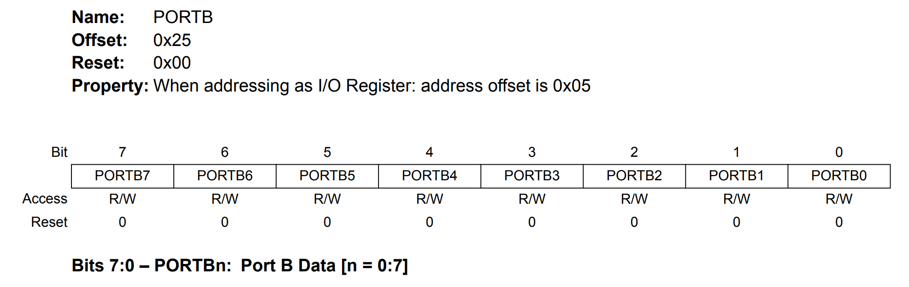
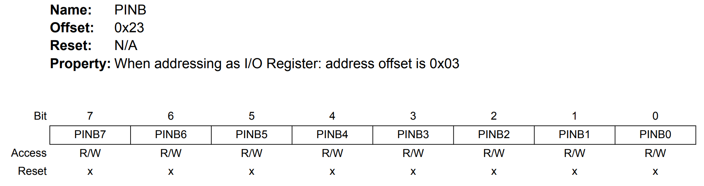
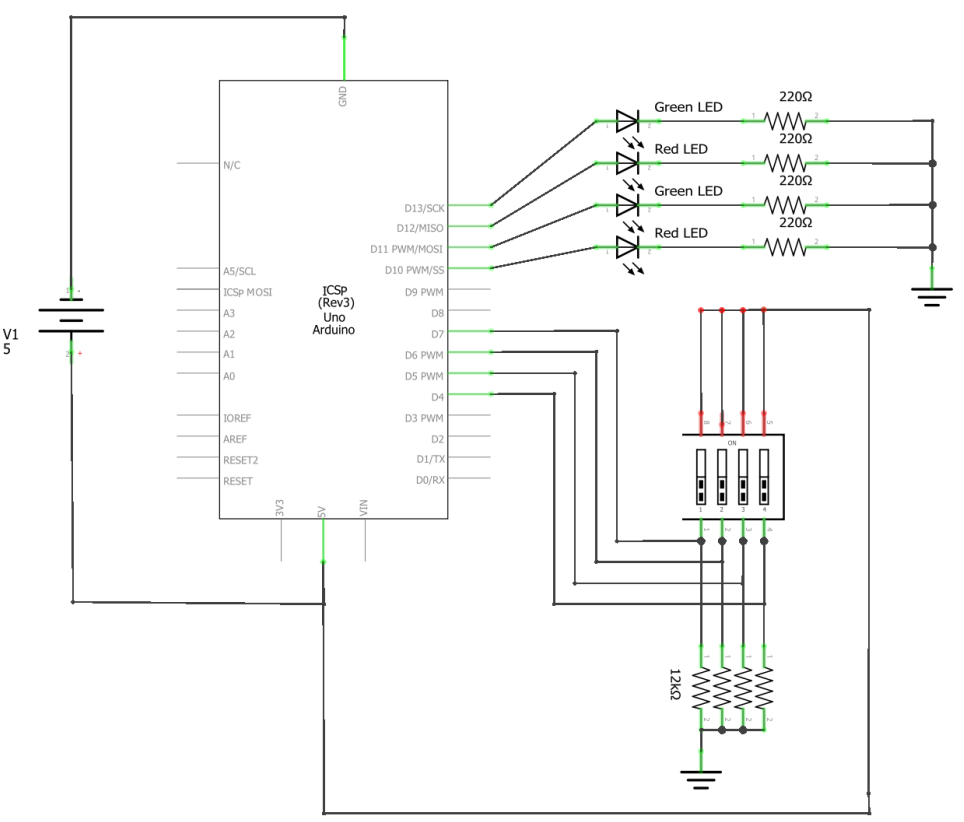
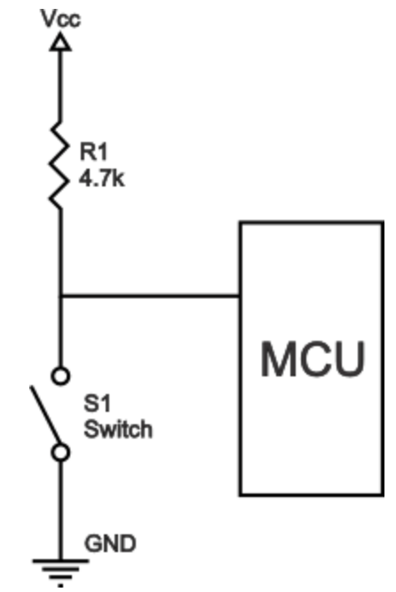
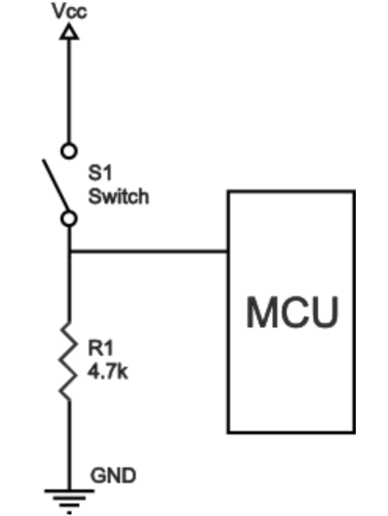
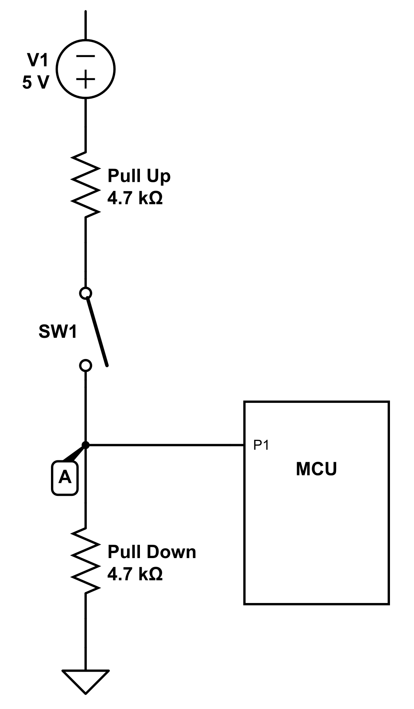
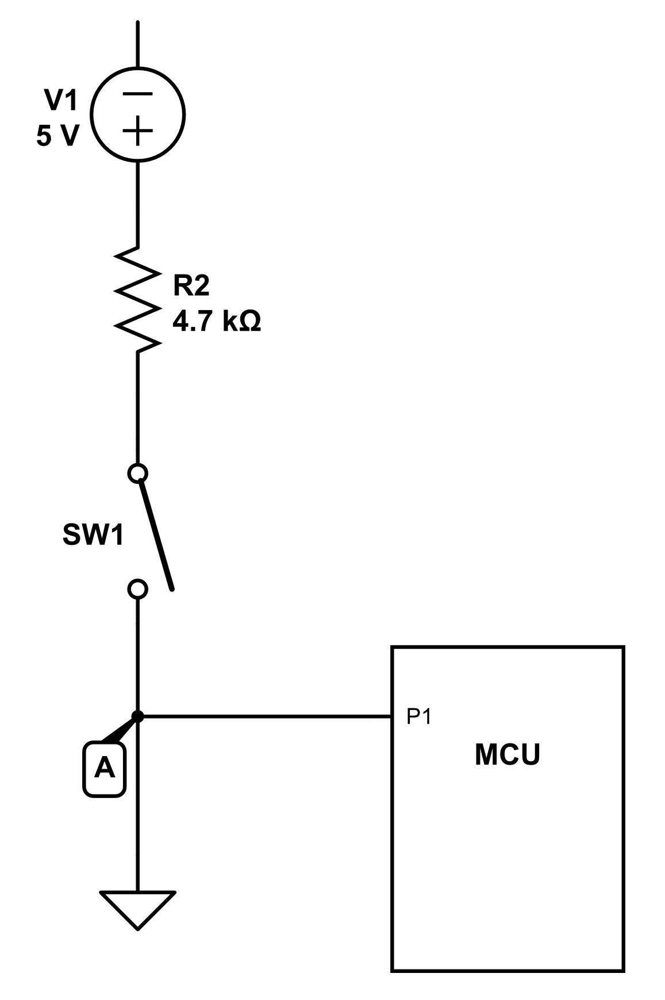
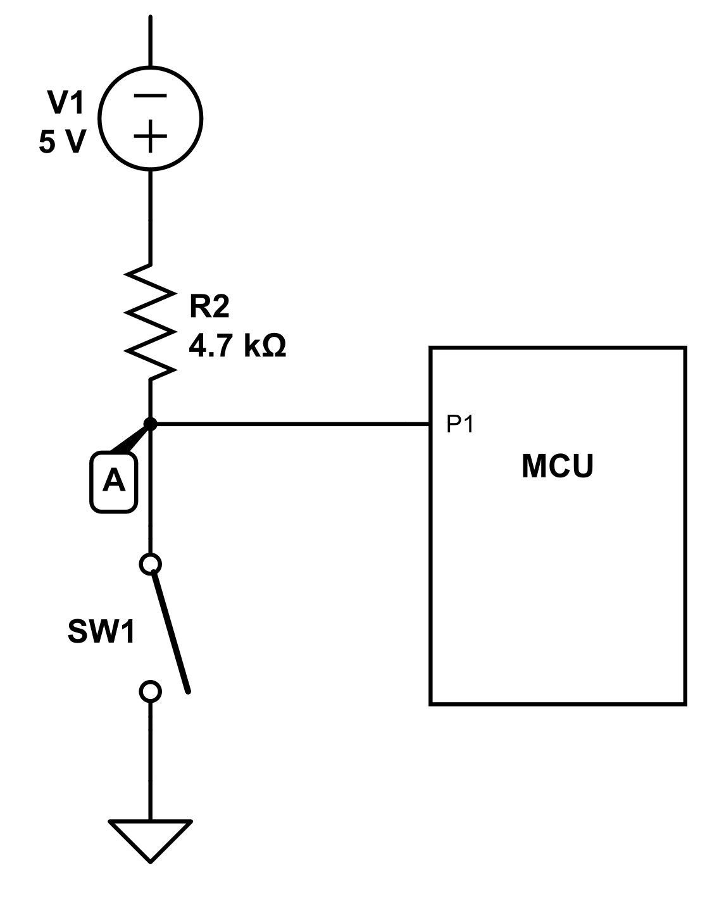

# Studio 1 - GPIO Programming

## Bit masking

Bit masking is a technique used in programming and computer science to **focus on and** **manipulate specific bits** in a **binary number**. In CG2111A, the manipulation includes:

1. [#set-certain-bits](studio-1-gpio-programming.md#set-certain-bits "mention")
2. [#clear-certain-bits](studio-1-gpio-programming.md#clear-certain-bits "mention")
3. [#extract-certain-bits](studio-1-gpio-programming.md#extract-certain-bits "mention")
4. [#check-certain-bits](studio-1-gpio-programming.md#check-certain-bits "mention")

This technique is done by doing **bitwise logical operation** on the **source binary number** `storage` using another **binary number** called `mask`. So, for the above four manipulations, the most important part should lie in:

1. which **logical bitwise operation** to use;
2. how to form our `mask`.

Before delving into these four manipulations, let's make some clarification on the vairables we will be used in this part first:

1. `storage` : this is our **source** binary number.
2. `mask` : this is the binary number we will use to do bit-masking.

After that, the following step is to know **which bits** we shall manipulate on. And based on this information, we shall create a "pre-mask", **with "1" indicating the bits we are interested in, "0" for the remaining.**

For example, in an 8-bit long binary number, we are interested in bit 3, bit 5 and bit 7, then the "pre-mask" we shall use is:

<pre><code><strong>Binary number : 1 0 1 0 1 0 0 0
</strong><strong>Position      : 7 6 5 4 3 2 1 0
</strong></code></pre>


Note that in CG2111A, we treat the **L**east **S**ignificant **B**it (The right-most bit) as bit 0 and start increasing **from right to left**.


In CG2111A, to create the pre-mask. We will use the **left-shift operator** `<<` and the **bitwise OR operator** `|`. For example, the code for creating our above example is as follows:


```arduino
#define BIT3 (1 << 3)
#define BIT5 (1 << 5)
#define BIT7 (1 << 7)

void setup()
{
    Serial.println(BIT3 | BIT5 | BIT7);
}
```


### Set certain bits

To set certain bits, we will need to form our `mask` and use the bitwise OR operator `|`.



**Form the `mask`**

When we **set certain bits**, our `mask` will be the **same** as our "pre-mask".


```arduino
#define BIT3 (1 << 3)
#define BIT5 (1 << 5)
#define BIT7 (1 << 7)
#define MASK (BIT3 | BIT5 | BIT7)
```




**Do the bitwise logical OR operation**

```arduino
storage |= MASK;
```



**Example**


```arduino
#define BIT3 (1 << 3)
#define BIT5 (1 << 5)
#define BIT7 (1 << 7)
#define MASK (BIT3 | BIT5 | BIT7)

void loop() {
    storage |= MASK;
}
```




### Clear certain bits

To clear certain bits/set ceratin bits to 0, we still need to form our `mask` and then use the bitwise AND oeprator `&`.



**Form the `mask`**

When we **clear certain bits**, our `mask` will be the **negation** of our "pre-mask". This is done by using bitwise NOT operator `~`.


```arduino
#define BIT3 (1 << 3)
#define BIT5 (1 << 5)
#define BIT7 (1 << 7)
#define MASK ~(BIT3 | BIT5 | BIT7)
```




**Do the bitwise logical AND operation**

```arduino
storage &= MASK;
```



**Example**

```arduino
#define BIT3 (1 << 3)
#define BIT5 (1 << 5)
#define BIT7 (1 << 7)
#define MASK ~(BIT3 | BIT5 | BIT7)

void loop() {
    storage &= MASK;
}
```



### Extract certain bits

This is a very useful manipulation and as usual, we will need our `mask` and the bitwise logical AND operator `&`.



**Form the `mask`**

When we **set certain bits**, our `mask` will be the **same** as our "pre-mask".


```arduino
#define BIT3 (1 << 3)
#define BIT5 (1 << 5)
#define BIT7 (1 << 7)
#define MASK (BIT3 | BIT5 | BIT7)
```




**Do the bitwise logical AND operation**

```
storage &= MASK;
```



**Example**

```arduino
#define BIT3 (1 << 3)
#define BIT5 (1 << 5)
#define BIT7 (1 << 7)
#define MASK (BIT3 | BIT5 | BIT7)

void loop() {
    storage &= MASK;
}
```



### Check certain bits

First, let's define the third binary number as `bits`, which is the binary number we want our source binary number `storage` to be.

Now, to check certain bits, we still need to form our `mask` and then use the bitwise logical AND operator `&`.



**Form the `mask`**

When we **set certain bits**, our `mask` will be the **same** as our "pre-mask".


```arduino
#define BIT3 (1 << 3)
#define BIT5 (1 << 5)
#define BIT7 (1 << 7)
#define MASK (BIT3 | BIT5 | BIT7)
```




**Do the "check" operation**


```arduino
(storage & MASK) == bits;
```


Notice that this is similar to [#extract-certain-bits](studio-1-gpio-programming.md#extract-certain-bits "mention"), the steps here are basically:

1. Extract the certain bits in `storage`
2. Compare it with the desired `bits`



**Example**

Check if certain bits are what you want.


```arduino
#define BIT3 (1 << 3)
#define BIT5 (1 << 5)
#define BIT7 (1 << 7)
#define MASK (BIT3 | BIT5 | BIT7)

void loop() {
    if ((storage & MASK) == bits) {
        // After extracting, the bits are what you want
        // Then do ...
    } else {
        // After extracting, the btis are not what you what
        // Then do...
}
```


In the code above, the conditions in the `else` structure may have the following two situations:

1. The [_extracted bits_](#user-content-fn-1)[^1] are **not all** 0.
2. The _extracted bits_ are **all** 0.

For the second condition, we may want to do something else, so the following code can be used:

```arduino
#define BIT3 (1 << 3)
#define BIT5 (1 << 5)
#define BIT7 (1 << 7)
#define MASK (BIT3 | BIT5 | BIT7)

void loop() {
    if ((storage & MASK) == 0) {
        // ...
    }
    // or
    if (!(storage & MASK)) {
        // ...
    }
}
```



## Bare Metal Programming

In CG1111A, to set the specific pins to logic HIGH and LOW or read from the specific pins, we will use the functions provided in the library, like `digitalRead()` and `digitalWrite()`. However, as a CEG undergraduate at NUS, we should **not stop** at this level. That's why we should know [_bare metal programming_](#user-content-fn-2)[^2] for Arduino UNO.

### Arduion UNO Schematic

<figure><figcaption><p>Arduino Uno Board Schematic</p></figcaption></figure>

Above is the schematic for the Arduino Board. The circled one is the Atmel Atmega Microcontroller we need to do our _bare metal prorgamming_ on.

As we noticed in the schematic above, the 13 Arduino Pins (0-13) are mapped to the Atmega microcontroller. This mapping is very important and is shown as follows:

| Arduino Pin | Atmega 328 port and pin number |
| :---------: | :----------------------------: |
|      0      |          Port D, pin 0         |
|      1      |          Port D, pin 1         |
|      2      |          Port D, pin 2         |
|      3      |          Port D, pin 3         |
|      4      |          Port D, pin 4         |
|      5      |          Port D, pin 5         |
|      6      |          Port D, pin 6         |
|      7      |          Port D, pin 7         |
|      8      |          Port B, pin 0         |
|      9      |          Port B, pin 1         |
|      10     |          Port B, pin 2         |
|      11     |          Port B, pin 3         |
|      12     |          Port B, pin 4         |
|      13     |          Port B, pin 5         |

### GPIO Programming



**Find the GPIO Port and Pin**

In the Atmega microcontroller we used, there are three GPIO Ports labelled,

1. `PORTB`
2. `PORTC`
3. `PORTD`

Within these three ports, we have 23 pins in total:

1. Pins are labeled `PB0-7` (8 lines), `PC0-6` (7 lines), and `PD0-7` (8 lines), totaling 23 pins.
2. These pins are also shared with other functions. e.g., `PD0` and `PD1` are also used by the receive `RXD` and transmit `TXD` lines for the USART.

For example, we want to use Pin 8 on the Arduino, by using the mapping table, we should first find out that it is mapped to `PORTB Pin 0`.



**Configure the GPIO Port and Pin**

This is done using the `DDRX` register, **"1" configures that Pin to output and "0" configures it to  input**.&#x20;

<figure><figcaption></figcaption></figure>


The Bit number is an **alias** for the Pin number in the GPIO Port. Also, for `DDRC` and `DDRD`, everything is the same except that we change `B` to `C` / `D`.


For example, in arduino, to set Pin 8, Pin 9 as output and Pin 10, Pin 11 as input,


```arduino
#define PIN8 (1 << 0)
#define PIN9 (1 << 1)
#define PIN10 (1 << 2)
#define PIN11 (1 << 3)

void setup() {
    DDRB |= (PIN8 | PIN9) & ~(PIN10 | PIN11);
    // This is same as
    DDRB |= 0b00001100; // a safer method
    // Or we can do
    DDRB |= PIN8 | PIN9;
    DDRB &= ~(PIN10 | PIN11);
}
```


To summarize, if you don't want use the pure binary method number:

1. Define the PIN constants using left shift operator `<<`.
2. Combine the **output/input** Pins using bitwise logical OR operator `|`
   1. For **output** Pins combination, leave it as it is
   2. For **input** Pins combination, take the **negation** for the whole (`~`)
3. Use the bitwise logical AND operator `&` to combine **output** Pins and **input** Pins if they are within **the same** `DDRx` register. Otherwise, we need to use the method covered in [set ceratin bits to 1](studio-1-gpio-programming.md#set-certain-bits), followed by then [set certain bits to 0](studio-1-gpio-programming.md#clear-certain-bits).


The `|=` we use here has the purpose of **set certain bits** while not affecting the others. More information can be found [here](studio-1-gpio-programming.md#set-certain-bits).




**Write the GPIO Port and Pin**

This is done by using the `PORTx` registers. Similarly, "1" means writing Logic HIGH to the certain Pin and "0" means writing Logic LOW to the certain Pin.

<figure><figcaption></figcaption></figure>


Similarly as `DDRb`,  for `PORTC` and `PORTD`, everything is the same except that we change `B` to `C` / `D`.


For example, if we want to **write/set** Pin8, Pin9 to Logic HIGH and then **erase/clear** them after a certain duration,


```arduino
void loop() {
    PORTD |= (PIN8 | PIN9);
    PORTD &= ~(PIN8 | PIN9);
    // These are same as
    PORTD |= 0b00000011;
    PORTD &= 0b11111100;
}
```



For `|=`, it is used to [#set-certain-bits](studio-1-gpio-programming.md#set-certain-bits "mention"), while for `&=`, it is used to [#clear-certain-bits](studio-1-gpio-programming.md#clear-certain-bits "mention").




#### Read from the GPIO Port and Pin

This mainly will use the technology we have seen in Bit Masking - [#check-certain-bits](studio-1-gpio-programming.md#check-certain-bits "mention"). And `PINx` register will store all the 8 bits we read, so it will serve the same purpose as `storage`.

<figure><figcaption></figcaption></figure>


Similarly as `DDRb`,  for `PINB` and `PIND`, everything is the same except that we change `B` to `C` / `D`.


For example, we want to read the value from Pin 8, Pin 9, Pin 10, Pin 11 and check whether they are **all** "1", and whether they are **all** "0"


```arduino
void loop() {
    if (PINB & (PIN8 | PIN9 | PIN10 | PIN11) == 0b00001111) {
        // ...
    } else if (PINB & (PIN8 | PIN9 | PIN10 | PIN11) == 0) {
        // ...
    } else {
        // ...
    }
}
```




## Studio

### Studio Report



### Interesting Questions



**In the circuit below, do we still need pull-up resistors?**

<figure><figcaption></figcaption></figure>

This is a question involving pull-up/pull-down resistors and before delving into this question, I think it will be good to review the knowledge about the pull-up/pull-down resistors and three logic states for a digital logic circuit.

#### Three Logic states for a digital logic circuit

1. **High**: This is when the circuit is connected to Vcc, a.k.a pulled to a HIGH logic level.
2. **Low**: This is when the circuit is connected to Ground, a.k.a pulled to a LOW logic level.
3. **Floating**: This is a physical state where a pin or node has **no direct connection to either power (Vcc) or ground**. It's like having a wire that's not connected to anything - it's literally "floating" in air. This is the physical condition.
   1. **Undefined**: it usually describes **electrical/logical behavior** that results from _floating_.

#### Pull-Up resistor

_Pull-Up resistors_ are simply fixed-value resistors connected **between the voltage supply** (typically +5 V, +3.3 V, or +2.5 V) **and the appropriate pin of a digital logic circuit**, which results in **pulling the input of the digital circuit to logic HIGH** [in the absence of a driving signal.](#user-content-fn-3)[^3]

<figure><figcaption><p>Pull-up resistor circuit</p></figcaption></figure>

In the circuit above, if the pull-up resistor $$R_1$$ is **absent**, which means **between Vcc and MCU there is an "open circuit"**, then when the switch is **open** ,the MCU is "floating".

Otherwise, if the pull-up resistor is there:

1. If the switch is **open**, the MCU input will be pulled up to Vcc.
2. If the switch is **closed**, by voltage divider, the MCU input will be pulled to 0V, a.k.a `GND`.

#### Pull-down resistor

Similarly, _Pull-Down resistors_ are simply fixed-value resistors connected **between the** `GND` **and the appropriate pin of a digital logic circuit**, which results in **pulling the input of the digital circuit to logic LOW** [in the absence of a driving signal.](#user-content-fn-3)[^3]

<figure><figcaption><p>Pull-Down resistor circuit</p></figcaption></figure>

In the circuit above, if the pull-down resistor $$R_1$$ is **absent**, which means **between** `GND` **and MCU there is an "open circuit"**, then when the switch is **open** ,the MCU is "floating".

Otherwise, if the pull-down resistor is there:

1. If the switch is **open**, the MCU input will be pulled down to `GND`.
2. If the switch is **closed**, by voltage divider, the MCU input will be pulled up to Vcc.

***

So, going back to our problem, the reason why we **don't need pull-up resistors** here is because:

1. Pull-up resistors are redundant
2. When the switch is **closed**, we may not pull the Pin to Vcc, it will be some value a bit smaller than Vcc, this may cause the input cannot reach the voltage to be recognized as HIGH.

<figure><figcaption></figcaption></figure>

**How about we move the pull-down resistors up directly and now it will be a circuit with only pull-up resistors?**

This is not acceptable since it won't become the classic pull-up resistors circuit we have seen above. Instead, it will be something looks as follows:

<figure><figcaption></figcaption></figure>

And we will find out that no matter what the state of the switch is (open or closed), the input at P1 will always be 0.

***

**How to modify the circuit to use pull-up resistors only?**

Ths method is to move the position of the Pin to be above the switches to form the classic pull-up resistors circuit as we have seen above.

<figure><figcaption></figcaption></figure>



[^1]: The result of `storage &= mask`.

[^2]: **Bare metal programming** is a programming technique that allows programmers to write software that runs directly on a computer's hardware, without an operating system.

[^3]: Here, the "driving signal" is the **switch**. So, "in the absence of a driving signal" means there is **no** switch.
