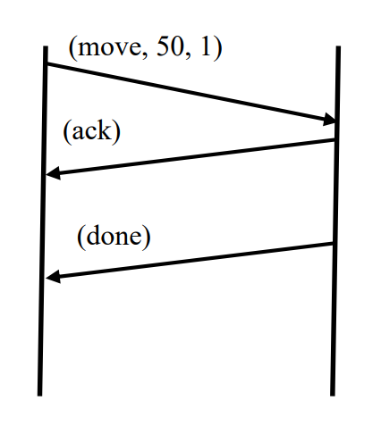
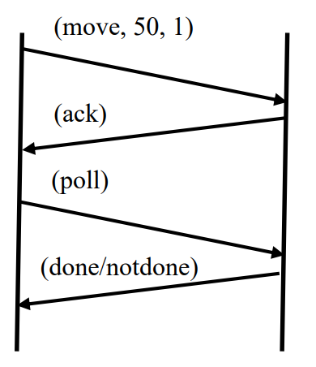
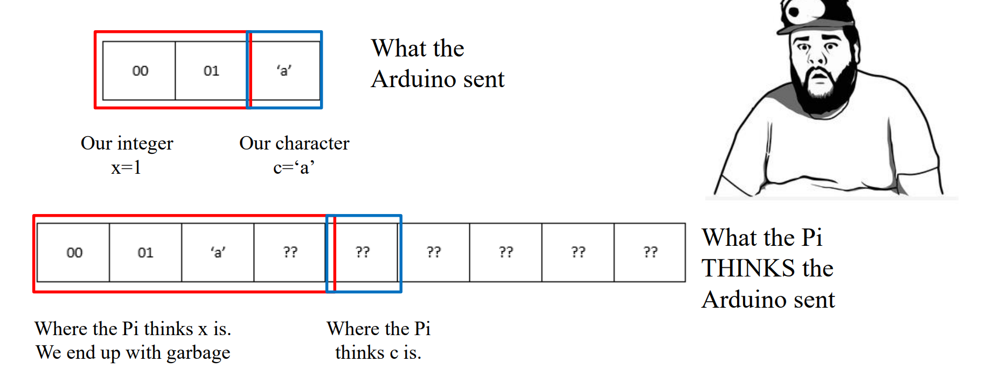

# Studio 13 - Communication Protocol

## Communication Protocol

Protocols, packets, and communication methods are the invisible glue enabling devices to collaborate. By defining **rules** (protocols), structuring **data** (packets), and choosing **interaction styles** (event-driven or polling), systems like the Arduino-RPi duo achieve precise, reliable control—mirroring how the entire digital world operates.

### Protocols: **The Rules of Engagement**

A **protocol** is a standardized "language" that devices agree to use for interaction. It defines:

* **What** to communicate (e.g., commands, sensor data).
* **How** to format and structure the data.
* **When** and **how** to respond (e.g., acknowledgments, error handling).

#### Protocol Suite/Stack

A protocol suite or stack is a **collection of protocols**, each operating at a **different layer** of the communication process.

For example, in the OSI model, the network communication is divided into seven layers:

* **Physical Layer:** Deals with the hardware transmission of raw bits.
  * e.g. agreement on voltage levels, number of wires to use, how wires are to be connected, etc.
* **Data Link Layer:** Organizes bits into frames and handles error detection.
* **Network Layer:** Manages addressing and routing (similar to IP).
* **Transport Layer:** Provides end-to-end communication services (similar to TCP/UDP).
* **Session Layer:** Manages sessions or connections between applications.
* **Presentation Layer:** Translates data formats and encrypts/decrypts data.
* **Application Layer:** Focuses on _meaningful data exchange_ (e.g., `(move, 50, 1)`).
  * This is where custom protocols (like the Arduino-RPi protocol) operate.


Each layer may have its own **protocol**, and the collection of all these 7 layer's protocols is called a **protocol suite/stack**.


#### **Why Protocols Matter**

* Without protocols, devices would send raw, unstructured data, leading to misinterpretation and chaos.
* Protocols ensure **interoperability**, **reliability**, and **scalability**.

### **Packets: The Envelopes of Data**

A **packet** is a structured unit of data that adheres to protocol rules. Think of it as a "digital envelope" containing:

* **Header**: Metadata (e.g., sender/receiver IDs, packet type, sequence numbers).
* **Payload**: The actual data (e.g., `move` command, sensor readings).
* **Footer**: Error-checking bits (e.g., checksums) to detect corruption.

#### **Types of Packets in Embedded Systems**

1. **Command Packets**
   * Sent from RPi to Arduino
   * Example: `(move, 50, 1)` → Move at 50% speed for 1 meter.
2. **Acknowledgment (ACK) Packets**
   * Sent from Arduino to RPi.
   * Confirm receipt of a command (e.g., `(ack)`).
3. **Data Packets**
   * Sent from Arduino to RPi.
   * Carry sensor data (e.g., `(compass, 180)`).
4. **Status Packets**
   * Sent from Arduino to RPi.
   * Signal task completion (`(done)`) or errors (`(error, motor_stuck)`).

#### **Key Role of Packets**

* Break data into manageable chunks.
* Enable error detection and retransmission.
* Ensure data arrives in a structured, interpretable format.

### &#x20;**Communication Methods: The Conversation Styles**

How devices initiate and manage data flow depends on the **communication method** used. There are two primary approaches exist

#### **Method 1: Event-Driven (Interrupt-Based)**

So, basically it works as follows:

* The Arduino _proactively_ sends data when an event occurs (e.g., task completion, sensor threshold reached).
* Example: Sending a `(done)` packet after moving 1 meter.

| Pros                                                           | Cons                                                 |
| -------------------------------------------------------------- | ---------------------------------------------------- |
| Efficient for time-sensitive data (e.g., collision detection). | Requires robust error handling (e.g., lost packets). |
| Reduces unnecessary network traffic.                           | May overwhelm the RPi if events occur frequently.    |

The following is a demo picture, the LHS is RPI and the RHS is Arduino.

<figure><figcaption></figcaption></figure>

#### **Method 2: Polling (Request-Response)**

So, basically it works as follows,

* The RPi _actively queries_ the Arduino for data/status (e.g., `(poll, compass)`).
* Example: Checking wheel rotations every 2 seconds.

| Pros                                                | Cons                                                     |
| --------------------------------------------------- | -------------------------------------------------------- |
| RPi controls timing and prioritization.             | Higher latency (data is only as fresh as the last poll). |
| Simplifies synchronization in multi-device systems. | Increased overhead with frequent polling.                |

The following is a demo picture, the LHS is RPI and the RHS is Arduino.

<figure><figcaption></figcaption></figure>

## Transfer Packets

Now, let's take a deeper look at the **packets** and some potential issues that may occur during packet transmission.

### Checksum

**Checksum** is used to check that data is received correctly. In CG2111A, the **checksum** is stored in one byte. (By nature of the XOR Operation).

#### Find Checksum

In CG2111A, we use thte **XOR** operation to compute the check sum

```
checksum = b1 XOR b2 XOR ...
```

where, `b1, b2, ...` are the bytes within the packet.

***

For example, we want to calculate the checksum of `FF EE`



**Organize the packet using bytes and change to binary**

So, our packet will become `11111111 11101110`.



`XOR` **each bit**

```
    11111111  (current checksum: FF in hex)
XOR 11101110  (b2: EE in hex)
------------
    00010001  (result: 11 in hex)
```

So, the checksum is `11`.



#### Verify Checksum

Checksum is usually included in the packet to be sent out. The **receiver** will use the data and the [#find-checksum](studio-13-communication-protocol.md#find-checksum "mention") method to calculate the checksum and compare with the checksum it receives, if they match, we have verified the validity of our data.

### Serialize Structures

To implement a packet, the easiest way is to use strctures. For example,

```cpp
typedef tc {
    int command;
    int speed;
    int distanceInMeters;
} TCommand;
```

But, when transferring this packet to other devices, we need to **serialize** this packet.

> **Serialization** means converting data into a **platform-agnostic byte stream**, ensuring reliable transmission. This is because when communicating between devices like a **Raspberry Pi (RPi)** and an **Arduino**, data must traverse a **serial interface** (e.g., USB/UART), which only understands **streams of bytes**.

The common steps to do serialize is to:

1. Get a pointer to the structure
2. Copy into an array of char
3. May want to include information on packet length and checksum

With this idea, the following is an example code to **serialize**


```cpp
unsigned int serialize(char *buf, void *p, size_t size)
{
    char checksum = 0;
    buf[0] = size;
    memcpy(buf + 1, p, size);
    for (int i = 1; i <= size; i++)
    {
        checksum ^= buf[i];
    }
    buf[size + 1] = checksum;
    return size + 2;
}

void sendSerialData(char *buffer, int len)
{
    for (int i = 0; i < len; i++)
    {
        Serial.write(buffer[i]);
    }
}
```


<details>

<summary>Why a buffer is needed (or why can't we just use the struct pointer and send bytes from that address?)</summary>

Although you can technically do that. But it will have some issues:

1. Your Raw structs **lack** headers, checksums, or packet delimiters, making error detection impossible. (a.k.a you need add more fields explicitly in your data structure)

So, TLDR, always serialize the packet into a byte stream, which is stored in buffer, and then send them out.

</details>

### **Deserialize Structures**

Similarly, **deserialize** means converting a stream of bytes back to structures. This can be done using the following steps:

1. Get a pointer to the structure
2. Copy buffer of bytes to that pointer
   1. May need to remove packet length and compute checksum first

For example, the following is a demo code to deserialize.


```cpp
unsigned int deserialize(void *p, char *buf)
{
    size_t size = buf[0];
    char checksum = 0;

    for (int i = 1; i <= size; i++)
    {
        checksum ^= buf[i];
    }

    if (checksum == buf[size + 1])
    {
        memcpy(p, buf + 1, size);
        return PACKET_OK;
    }
    else
    {
        printf("CHECKSUM ERROR\n");
        return PACKET_BAD_CHECKSUM;
    }
}
```


## Issues

In real-world, our serialization/deserialization may not work as we expected due to the following three issues:

1. Endianness
2. Differing sizes used for the same data type between sender and receiver
3. Data Padding

### Endianness

#### Big and Little Endianness

Endianness affects how multi-byte values (e.g., integers, floating-point numbers) are stored in memory.

***

For example, if we have a multi-byte data `0x87654321`.



**Big Endian**

Higher order bytes at lower addresses.

```
data   : 87   65   43   21
Address: a    a+1  a+2  a+3
```



**Little Endian**

Lower order bytes at lower addresses.

```
data   : 21   43   65   87
Address: a    a+1  a+2  a+3
```


Note the the sequence within **each byte** will not change!




#### What happens if sending between machines using different endianness?

First, the general rule to decide the bytes received is as follows:

* **Sending:** Always send the data **starting from the lower memory address** first.
* **Receiving:** Always store the first byte received **at the lower memory address** and reconstruct the value based on the system's endianness.

***

For example, we want to send `0x87654321` from a little endianness machine to a big endianness machine. We expected the receiver to receive `0x87654321`.



**Data sent**

```
data sent: 21   43   65   87
Address  : a    a+1  a+2  a+3
```

By using the general rule, `21` is sent first, then `43` and so on.



**Data received**

By using the general rule again, `21` is received first and stored at the lower address. Then `43` so on and so forth.

```
data received: 21   43   65   87
Address      : a    a+1  a+2  a+3
```

So, we realize that our received receives `0x21436587` instead of the what we expect, which is `0x87654321`. Thus, here is where the error comes from.



#### Industry Solution to the endianness Issue

This can be done by using the following two methods

1. **Use Network Byte Order (Big-Endian)**
   * Convert values before sending:
     * In C/C++: `htonl(value)` (Host to Network Long)
     * Convert back on the receiver: `ntohl(value)` (Network to Host Long)
   * Many networking protocols (e.g., TCP/IP) already use big-endian by default.
2. **Use Serialization Libraries**
   * Protocol Buffers, MessagePack, or CBOR handle endianness automatically.

### Different Data Sizes

This issue is actually because our sender and receiver may use **different size** to store the same data type. For example, `int` on RPi is 4-byte, but on Arduino is 2-byte.

<figure><figcaption></figcaption></figure>


In CG2111A, this issue only happens on `int` or `long`. For **floats** (`float` and `double`), this issue doesn't exist because they use 32-bit IEEE 754 format.


#### Solution

Use **standardized** integer types.

* Replace `int` with `in32_t`.
* Replace `unsigned int` with `uint32_t`.
* Replace `long` with `int64_t`.
* Replace `unsigned long` with `uint64_t`.


To use the standardized integer types, must `#include <stdint.h>`.


### Data Padding

Data padding is the process of adding extra bytes to align data structures in memory according to the system’s architecture. Compilers do this to optimize access speed and prevent misalignment issues.

***

For example, a struct like this:

```c
struct Data {
    int x;      // 4 bytes
    char c;     // 1 byte
    float z;    // 4 bytes
};
```

On a **32-bit system**, `x` is naturally aligned (4 bytes), but `c` is only 1 byte. To keep `z` correctly aligned (4-byte boundary), the compiler **adds 3 padding bytes** after `c`:

```css
[ x x x x ][ c _ _ _ ][ z z z z ]
```


Here, `_` represents padding bytes.


#### Misalignment

Misalignment happens when a variable is not stored at a memory address that is a multiple of its required alignment.

***

The table below summarizes the difference between the alignment rules on 32-bit and 64-bit machines.

| Data Type   | Size                                                           | 32-bit x86 Alignment                                      | 64-bit Alignment                                          |
| ----------- | -------------------------------------------------------------- | --------------------------------------------------------- | --------------------------------------------------------- |
| `char`      | 1 byte                                                         | 1-byte aligned                                            | 1-byte aligned                                            |
| `short`     | 2 bytes                                                        | 2-byte aligned                                            | 2-byte aligned                                            |
| `int`       | 4 bytes                                                        | 4-byte aligned                                            | 4-byte aligned                                            |
| `long`      | <p>4 bytes on 32-bit machine,<br>8 bytes on 64-bit machine</p> | 4-byte aligned                                            | 8-byte aligned                                            |
| `float`     | 4 bytes                                                        | 4-byte aligned                                            | 4-byte aligned                                            |
| `double`    | 8 bytes                                                        | <p>4-byte aligned (Linux)<br>8-byte aligned (Windows)</p> | <p>8-byte aligned (Windows)<br>8-byte aligned (Linux)</p> |
| `long long` | 8 bytes                                                        | <p>4-byte aligned (Linux)<br>8-byte aligned (Windows)</p> | <p>8-byte aligned (Windows)<br>8-byte aligned (Linux)</p> |
| `pointer`   | 4 bytes                                                        | 4-byte aligned                                            | 8-byte aligned                                            |

<details>

<summary>What's the use of CPU Bit-Width here? (32-bit, 64-bit, etc)</summary>

The CPU Bit-Width is not the root cause of misalignment, it is because the CPU Bit-Width will affect the size of the data type first, then this will cause new rules for data alignment.

</details>

#### Padding Example

Here is a structure with members of various types, totaling 8 bytes before compilation:


```c
struct MixedData
{
    char Data1;
    short Data2;
    int Data3;
    char Data4;
};
```


After compilation the data structure will be supplemented with padding bytes to ensure a proper alignment for each of its members:


```c
struct MixedData  /* After compilation in 32-bit x86 machine */
{
    char Data1; /* 1 byte */
    char Padding1[1]; /* 1 byte for the following 'short' to be aligned on a 2-byte boundary
assuming that the address where structure begins is an even number */
    short Data2; /* 2 bytes */
    int Data3;  /* 4 bytes - largest structure member */
    char Data4; /* 1 byte */
    char Padding2[3]; /* 3 bytes to make total size of the structure 12 bytes */
};
```

