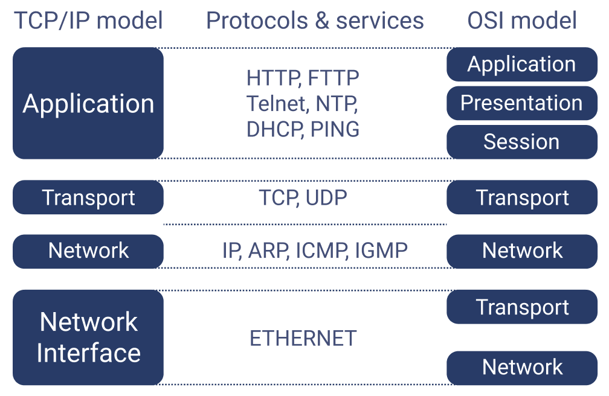
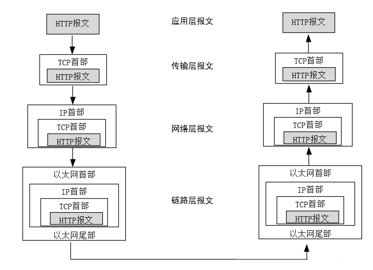
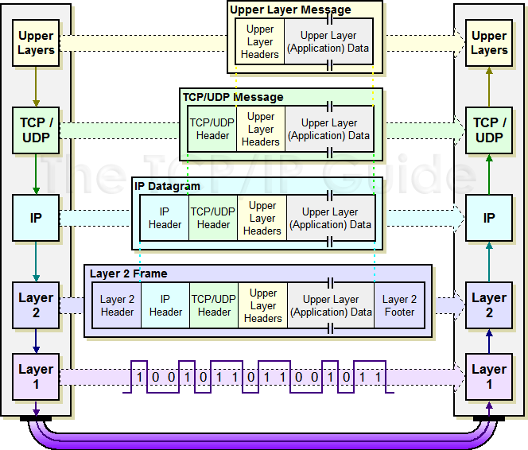

# Studio 15 - Secure Networking

## TCP/IP

The TCP/IP protocol includes a series of protocols, also known as the TCP/IP [protocol suite](studio-13-communication-protocol.md#protocol-suite-stack). It provides a point-to-point connection mechanism and standardizes the encapsulation, addressing, transmission, routing, and reception of data frames.

#### TCP/IP vs. OSI

Unlike OSI Model, which has 7 layers, TCP/IP usually has four layers:

1. Application
2. Transport
3. Network
4. Network Interface: Sometimes this layer is divided into two layers
   1. Physical Layer
   2. Link Layer

<figure><figcaption></figcaption></figure>

### Application Layer

The **Application Layer** of the TCP/IP protocol handles protocols that enable communication between applications. For example, **HTTP** (Hypertext Transfer Protocol) is used for web browsing, allowing clients to request web pages from servers and receive the corresponding data.

### Transport Layer

The **Transport Layer** of the TCP/IP protocol handles end-to-end communication and ensures **reliable data delivery** between devices. Its main functions include:

1. Providing transport services for end-to-end connections.
2. Offering both reliable (TCP) and unreliable (UDP) transport services.
3. Managing flow control, error control, and Quality of Service (QoS).

There are two main protocols in the Transport Layer:

* **TCP** (Transmission Control Protocol) is a connection-oriented, **reliable protocol** that ensures data arrives intact, in order, and without errors. It provides flow control and congestion management to avoid network overload and guarantees data delivery.
* **UDP** (User Datagram Protocol) is a connectionless, unreliable protocol. It does not guarantee delivery or order, making it **faster but less reliable**. It's typically used for applications where speed is critical and some data loss is acceptable (e.g., video streaming or chat applications).

In summary, **TCP** offers **high reliability but lower efficiency**, while **UDP** offers **higher efficiency but lower reliability,** making it suitable for real-time applications with less stringent reliability requirements.

### Network Layer

The **Network Layer** of the TCP/IP protocol is responsible for **finding an appropriate path for transmitting data packets** across complex network environments. In simple terms, the Network Layer ensures that **data is delivered to the correct destination address**, which may be connected through multiple networks and routers.

Key protocols at the Network Layer include:

* **ICMP** (Internet Control Message Protocol)
* **IP** (Internet Protocol)

These protocols help with routing, error reporting, and managing network traffic between different networks.


The Network Layer can find the path both in local network and the Internet. This may include some knowledge like routers, etc. See [#reference](studio-15-secure-networking.md#reference "mention") 1 for more information.


### Network Interface Layer

The Network Interface Layer, which includes the **Link Layer** and **Physical Layer**, handles the hardware connections in a network. This layer includes device drivers, Network Interface Cards (NICs), optical fibers, and all physical transmission media. At this layer, the unit of data transmission is a **bit**.

Key protocols at the Link Layer include:

* **ARP** (Address Resolution Protocol)
* **RARP** (Reverse Address Resolution Protocol)

These protocols are responsible for mapping IP addresses to MAC addresses and vice versa, enabling devices on a local network to communicate effectively.

### Example

When using TCP/IP for network communication, data packets are transmitted according to the layered model.

* The sender transmits from the **application layer downwards**,&#x20;
* the receiver processes from the **network interface layer upwards**.

The order of data transmission for each frame from the client to the server is as follows: Application Layer → Transport Layer → Network Layer → Network Interface Layer → Network Interface Layer → Network Layer → Transport Layer → Application Layer.

<figure><figcaption></figcaption></figure>

#### **Data Encapsulation and Decapsulation**

When data is transmitted over the internet, it cannot be sent without any identifiers, as that would lead to chaos.

* Therefore, when sending data, specific identifiers need to be added. This process is known as data **encapsulation**.&#x20;
* When the data is used, these identifiers are removed, and this process is called **decapsulation**.

The data encapsulation and decapsulation process in the TCP/IP protocol is generally as shown in the figure below:

<figure><figcaption></figcaption></figure>

## Cryptography

Before we begin, let's take a look at the basic jargons in Cryptography

<table><thead><tr><th width="194">Term</th><th>Definition</th></tr></thead><tbody><tr><td>Plaintext</td><td>"Clear" data that can be intercepted and understood by anyone.</td></tr><tr><td>Ciphertext</td><td>"Scrambled" data that is generated from "encryption" algorithms to prevent plaintext from being understood.</td></tr><tr><td>Encryption</td><td>Converting from plaintext to ciphertext.</td></tr><tr><td>Decryption</td><td>Converting from ciphertext to plaintext.</td></tr><tr><td>Key</td><td>A particular value or string that is used to encrypt/decrypt messages.</td></tr><tr><td>Cipher, cryptosystems</td><td>Other names for encryption/decryption algorithms.</td></tr><tr><td>Symmetric Cipher</td><td>The same key is used to encrypt and decrypt. Also known as private key cryptosystems.</td></tr><tr><td>Asymmetric Cipher</td><td>A different key is used for encryption (the "public" key) than for decryption (the "private" key).</td></tr></tbody></table>

### Private Key Cryptosystem

This is also known as **symmetric cryptosystem**. The key idea here is that we use **private key** to both encrypt the plaintext and decrypt the cipher.

***

A good example is **substution cipher**. In a this cryptosystem, the **private key** is typically a **substitution alphabet** or a **permutation of the alphabet** that is used to map each character of the plaintext to a corresponding character in the ciphertext.

### Public Key Cryptosystem

This is also known as **assymetric cryptosystem**, or **PKC.** The key idea here is that we use **public key** to encrpty and **private key** to decrypt.

* A **public key** can be sent to everyone.
* A **private key** must be kept to oneself.


We can also use **private key** to encrypt and **public key** to decrypt!


***

An example for PKC is the **R**ivest-**S**hamir-**A**ddleman (RSA) algorithm. Now, suppose that Alice wants to send $$t=12$$ (her hair strands) to Bob securely. Bob generates his RSA keys.



**(Bob) Choose private primes** $$p, q$$ **and modulus** $$n$$

Bob picks primes $$p=3,q=5$$. Then compute $$n=p\times q=15$$.


Bob must keep these two prime numbers private!




**(Bob) Compute Totient** $$t(n)$$

$$
t(n)=t(15)=(p-1)\times(q-1)=(3-1)\times(5-1)=8
$$



**(Bob) Select Public Exponent** $$e$$

Use the requirement that

$$
\text{gcd}(e,t(n))=1
$$

, Bob chooses $$e=7$$. ($$\text{gcd}(7,8)=1$$)



**(Bob) Generate Public Key** $$(e,n)$$

As $$e=7,n=15$$, Bob's **public key** is $$(7,15)$$


This public key will be sent to Alice for her to encrypt the message she's going to send to Bob.




**(Bob) Compute Private Exponent** $$d$$

Bob solves $$d$$ in this equation: $$d\times e=1+k\times t(n)$$

$$
d\times e=1+k\times t(n)
$$

, where $$k$$  is chosen arbitrary. Here, we let $$k=20$$. So, we get

$$
d\times 7=1+20\times t(15)\equiv1+20\times8
$$

$$d\times 7=1+20\times t(15)\equiv1+20\times8$$, thus $$d=23$$



**(Bob) Generate Private Key** $$(d,n)$$

As $$d=23,n=15$$, Bob's **private key** is $$(23,15)$$


Bob must keep the private key private!




**(Alice) Encrpty the message using Bob's Public Key**

Denote the **ciphertext** as $$c$$, the **plaintext** as $$a$$. To get $$c$$ using Bob's **public key** $$(e,n)=(7,15)$$, we use this formula,

$$
c=a^e\mod n=12^7\mod 15=3
$$

Then Alice will send $$c$$, which is 3 to Bob.



**(Bob) Decrypt the message using Bob's Own Private Key**

Denote plaintext as $$a$$ again, with Bob's **private key** $$(d,n)=(23,15)$$ and use the following formula

$$
a=c^d\mod n=3^{23}\mod 15=12
$$

Bob gets the message 12!



As a sum up, denote your cipher text as $$c$$, plaintext as $$a$$, and your key as $$(x,n), (y,n)$$ (no matter public or private, so the order doesn't matter), we always have:

1. Encrypt using whichever key, we use the following formula,

$$
c=a^x\mod n
$$

2. Decrypt using whichever key (must be different from the one you choose in 1), we use the following formula,

$$
a=c^y\mod n
$$

Why it is hard for the third person to decrypt?

If the third person wants to decrypt, he needs to know

1. $$d$$, as $$n$$ is part of Bob's public key, which is known by everyone.
2. To know $$d$$, he needs to know $$t(n)$$, a.k.a the totient function
3. To know $$t(n)$$, he needs to know the two private prime numbers $$p,q$$
4. This is impossible because in reality, when Bob chooses $$p,q$$, they are always between 1024 to 8192 bits!

### Digital Signature

The use of **digital signature** is to ensure that a message is legit sent by someone, not anyone else! This is done by a neat feature of PKC, which is:

> If we encrypt using the private key, we can **also** decrypt using the public key!

Still use the example of Bob and Alice above, with Bob's **public key** $$(7,15)$$ and Bob's private key $$(23,15)$$. Bob sends 3 to Alice and Alice wants to know this message is sent from Bob.



**(Bob) Encrypt message** $$m$$ **using Bob's private key**

This step is to get the ciphertext $$c$$,

$$
c=3^{23}\mod15=2
$$



**(Bob) Sends message pair** $$(m,c)$$ **to Alice**

Bobs sends the **message** and the **ciphertext** to Alice.



**(Alice) Decrypt Bob's ciphertext** $$c$$ **to get** $$m'$$

To decrypt to get $$m'$$, we use

$$
m'=2^{7}\mod15=3
$$

If $$m'==m$$, Alice can make sure the message is sent by Bob.



However, in real-world, the raw message $$m$$ can be quite large, which makes it harder to compute the ciphertext $$c$$. To solve this, computer scientists introduce the **hash function** (like SHA256), so now the steps become as follows:

1. Bob uses the hash function to generate $$h(m)$$, where $$h(m)$$ is sa much shorter summary of $$m$$.
2. Bob encrypts $$h(m)$$ (instead of $$m$$) using his private key to get the ciphertext $$c$$.
3. Bob sends $$(m,c)$$ as usual to Alice.
4. Alice receives $$(m,c)$$, then computes $$h(m)$$.
5. Alice decryptes $$c$$ using Bob's public key, and if the result **is equal to** $$h(m)$$, she knows that Bob sent her that message.


c is called the **digital signature**.&#x20;


#### Hash Function

Below are some important properties of hash functions

* Given $$h(m)$$, it must be **impossible** to derive $$m$$.
* Given even the tiniest change to $$m$$, $$h(m)$$ must change drastically.
* It must be non-trivial to produce $$h(m)$$ from $$m$$.
* No matter how big $$m$$ is, $$h(m)$$ always produces a hash of exactly the same size.
* The "gold standard" in hash functions is SHA256.

#### Real-world Applications of Digital Signature

As public keys are public, how does others know this public key is legit sent by someone? We can use **digital signature**!

***

For example, Bob wants to send his public key to Alice, and Alice wants to verify that this public key does come from Bob.

1. **(Bob)** Compute $$h(\text{PUB})$$ given Bob's public key $$\text{PUB}$$
2. **(Bob)** Encrypt $$h(\text{PUB})$$ using Bob's private key $$\text{PRV}$$, giving the ciphertext $$c$$
3. **(Bob)** Bob then distributes $$(\text{PUB}, h(\text{PUB}), c)$$ to everyone (This pair is called a **certificate**)
4. **(Alice)** Compute $$h(\text{PUB})$$, then decrypt $$c$$ using Bob's public key, if the result is equal to $$h(\text{PUB})$$, then this public key is legit sent by Bob!

#### Sign and Digital Signature

* **Sign** is the process (the act of creating the signature).
* **Signature** is the value (the output of the signing process).

The sender (e.g., Bob) takes a message, creates a **hash** of it (using a hash function like SHA-256), and then **encrypts** that hash with their **private key**. This **encrypted hash** is the **digital signature**.

The receiver (e.g., Alice) can use the **public key** to **decrypt** the digital signature, to get the **hash** and compare it with the hash sent by the sender. If they are the same, then the receiver can be sure that it's the sender that sends the message.

### Certificate

A **certificate** in cryptography is a signed statement that binds an **identity** (like Bob) to a **public key**. A **certificate** is usually signed by a **certificate authority (CA)**


**Digital certificates** are used to **validate the identity of the sender**, and **digital signatures** are used to **validate the sent data**.


***

Differences between Digital Signature and Certificate

<table><thead><tr><th width="140">Aspect</th><th>Digital Signature</th><th>Certificate</th></tr></thead><tbody><tr><td><strong>Definition</strong></td><td>A cryptographic proof that a message/document is authentic and unchanged.</td><td>A signed document that binds an identity (e.g., a person or website) to a public key.</td></tr><tr><td><strong>Purpose</strong></td><td>Ensures data integrity, authenticity, and non-repudiation.</td><td>Confirms the authenticity of a public key.</td></tr><tr><td><strong>What is Signed?</strong></td><td>A hash of a document or message.</td><td>A public key (along with identity information).</td></tr><tr><td><strong>Who Signs It?</strong></td><td>The owner of the private key uses his private key to sign it.</td><td>A trusted authority (e.g., a Certificate Authority, CA) uses his private key to sign it.</td></tr><tr><td><strong>Verification</strong></td><td>Anyone with the public key can verify the signature.</td><td>Anyone with the CA’s public key can verify the certificate.</td></tr><tr><td><strong>Real-World Example</strong></td><td>A contract signed digitally to prevent forgery.</td><td>An SSL certificate proving a website's authenticity.</td></tr></tbody></table>

## Reference

1. [Real-World Application of Network Layer and Network Interface Layer](https://blog.csdn.net/sunyctf/article/details/128975665)
