# Studio 4 - PWM Programming

## PWM Concepts

In previous studios, we learnt how to generate digital signals using the GPIO pins. This studio will introduce _Pulse-Width Modulation_ (PWM), a digital technique used to simulate an analog signal by rapidly toggling a signal between a HIGH (1) and a LOW (0) state at a controlled frequency. By adjusting the proportion of time the signal remains HIGH versus LOW, we can approximate different analog voltages.

The PWM signal has two key parameters:

1. Period
2. Duty Cycle

<figure>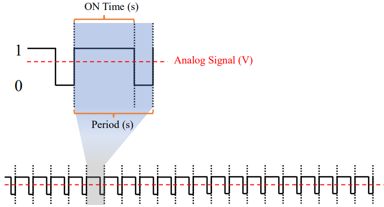<figcaption><p>A typical PWM waveform with one period zoom in</p></figcaption></figure>

### Period

**Period** is the total duration of one cycle.

The **period** of the PWM signal (measured in seconds) indicates the amount of time it takes for the signal to complete **one cycle**. The **frequency** of the PWM signal is $$\frac{1}{\text{period(s)}}$$.


Note the unit for **period** is **seconds**!


### Duty Cycle

The **Duty Cycle** represents the percentage of time the signal is HIGH (ON Time, a.k.a _pulse width_) **during a cycle**. The relationship between duty cycle and ON Time is characterized by the Equation below:

When observing a PWM signal closely, the ON and OFF states within a single period appear distinct and separate. However, as the PWM signal's frequency increases, it becomes more difficult to distinguish between these states, making the signal appear more continuous and averaged over time. A peripheral, such as a servo motor, interprets the PWM signal as an effective analog voltage between 0 V and VCC, depending on the duty cycle. The value of this average analog signal can be determined by the Duty Cycle in the PWM waveform:

### PWM vs. DAC

We have already seen how PWM works above. Now, let's take a look at how modern DAC (**D**igital **A**nalog **C**onverter) works.

#### **How Modern DAC Works**

A Digital-to-Analog Converter (DAC) converts a digital value (e.g., an 8-bit or 16-bit number) directly into a corresponding analog voltage or current. Modern DACs employ techniques such as:

* **Resistor Ladder (R-2R)**: Uses a network of resistors to produce an analog voltage proportional to the binary input.
* **Sigma-Delta Modulation**: Employs oversampling and noise shaping for high-precision output.

Unlike PWM, a DAC generates a smooth, continuous analog signal without relying on time-averaging. The output voltage scales linearly with the digital input, offering fine control and high resolution depending on the bit depth (e.g., 12-bit or 16-bit).

#### **Key Differences**

Here are the primary distinctions between PWM and DAC, with additional context integrated:

* **Signal Nature**:
  * **PWM**: Produces a **digital square wave**. The analog effect arises from **averaging the signal over time**, making it an **approximation** rather than a true analog output.
  * **DAC**: Outputs a genuine analog signal with **continuous voltage levels**, requiring no averaging.
* **Hardware Complexity**:
  * **PWM**: Requires minimal hardware—just a digital pin on a microcontroller or a simple timer circuit—making it cost-effective and easy to implement.
  * **DAC**: Involves dedicated analog circuitry, which is more complex and typically more expensive.
* **Precision and Smoothness**:
  * **PWM**: The perceived smoothness depends on the switching frequency and the device’s response. At lower frequencies, the digital pulses may cause noticeable effects (e.g., flickering in LEDs). Adding a low-pass filter can smooth the signal into a near-continuous voltage, but it’s still not as seamless as a DAC.
  * **DAC**: Delivers a smooth, stable analog output with no inherent switching, providing higher precision and consistency.
* **Applications**:
  * **PWM**: Commonly used for power control in devices like motors, LEDs, and heaters, where the averaging effect suffices and cost is a concern.
  * **DAC**: Suited for applications needing precise analog signals, such as audio reproduction, scientific instrumentation, or communication systems.

#### Why PWM Is Considered Analog-Like

Despite being a digital signal, PWM is often described as simulating an analog output because:

* Devices respond to the _average voltage_ rather than the individual pulses.
* At high frequencies, the switching occurs too quickly for many systems to detect, mimicking a continuous voltage.
* With a low-pass filter, the PWM signal can be physically smoothed into a nearly continuous analog waveform.

However, PWM remains a **digital approximation**—its effectiveness as an "analog" signal depends on the frequency and the connected device’s characteristics. In contrast, a DAC provides a true analog output without such dependencies.

> PWM is considered "analog" in this context because of its _output effect,_ not its waveform.

This is also why we mentioned this sentence above because the role of **frequency** in PWM signal generation,

> However, as the PWM signal's frequency increases, it becomes more difficult to distinguish between these states, making the signal appear more continuous and averaged over time.&#x20;

## Timer/Counter

In ATmega328p, the core concept to generate a PWM waveform involves utilizing the 8-bit Timer/Counter to precisely control the duration of the signal’s high and low states, enabling us to achieve **the specified period** and **duty cycle** for the PWM waveform.

<div align="center"><figure>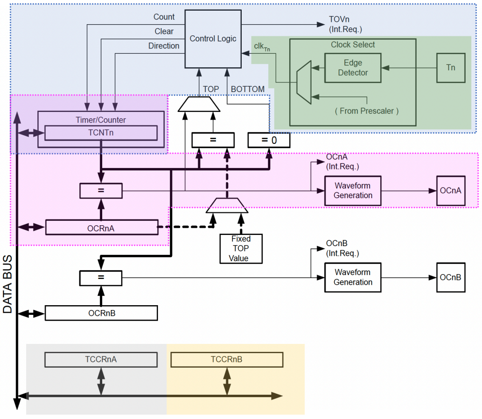<figcaption><p>Timer/Counter Block Diagram (P126)</p></figcaption></figure></div>


Note that many register and bit references are presented in a generalized form: `n` represents the Timer/Counter number, `x` = `A`, `B` denotes Unit `A` or `B`.


### Some Useful Terms

<table><thead><tr><th width="79">Constant</th><th>Description</th></tr></thead><tbody><tr><td>BOTTOM</td><td>The counter reaches the BOTTOM when it becomes zero (<code>0x00</code> for 8-bit counters, or <code>0x0000</code> for 16-bit counters).</td></tr><tr><td>MAX</td><td>The counter reaches its Maximum when it becomes <code>0xFF</code> (decimal 255, for 8-bit counters) or <code>0xFFFF</code> (decimal 65535, for 16-bit counters).</td></tr><tr><td>TOP</td><td>The counter reaches the TOP when it becomes equal to the <strong>highest value in the count sequence</strong>. The TOP value can be assigned to be the fixed value MAX or the value stored in the <code>OCR0A</code> Register. The assignment is dependent on the mode of operation.</td></tr></tbody></table>

### Timer/Counter Clock Sources

The Timer/Counter can be clocked by an internal or an external clock source. The clock source is selected by writing to the Clock Select Bit (`CS0[2:0]`) bits in the `TCCRnB`.


Selecting the clock source and prescaler **determines** the **frequency** of the timer/counter.


### Counter Unit

The Counter Unit block diagram (Figure 1.3) is shown as follows for reference:

<figure>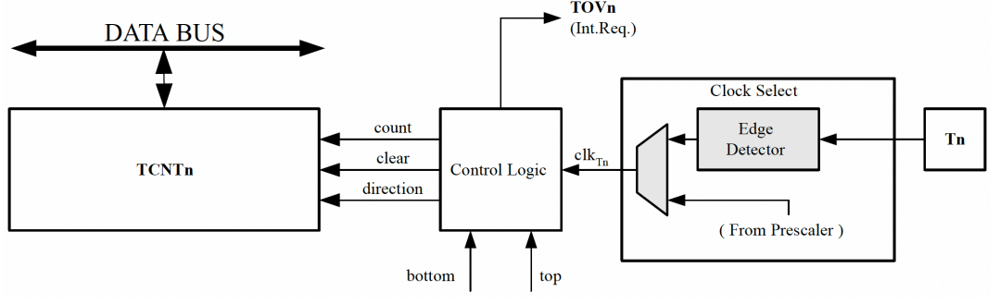<figcaption><p>Couter Unit Block Diagram (P127)</p></figcaption></figure>


Once the clock is set, the `TCNTn` register **increments at a certain frequency which is determined** [**above**](studio-4-pwm-programming.md#timer-counter-clock-sources).


Initialize the counter value to 0 if you are generating a phase-correct PWM waveform.


### Output Compare Unit

The Output Compare Unit block diagram is shown as follows,

<figure>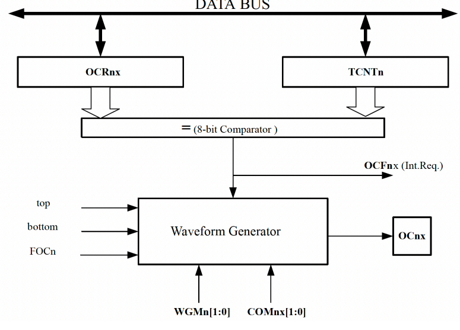<figcaption><p>Output Compare Unit Block Diagram (P129)</p></figcaption></figure>

The comparator **continuously compares** `TCNTn` with the Output Compare Registers (`OCR0A` and `OCR0B`). Whenever `TCNTn` equals `OCR0A` or `OCR0B`, the **comparator signals a match**. A match will be used in **2** ways:

1. it will be used to set the **Output Compare Flag** (`OCF0A` or `OCF0B`) at the next timer clock cycle. If the corresponding interrupt is [**enabled**](#user-content-fn-1)[^1], the Output Compare Flag generates an Output Compare interrupt.
2. it will be used by the **Waveform Generator** to generate an output on the **Output Compare pins** (`OCnA` or `OCnB`) according to **operating mode** set by `WGMx[2:0]` and **Compare Output mode** (`COMnx[1:0]`)

### Modes of Operation

There are four modes of operation on for the timer/counter unit on ATmega328p, they are

1. Normal mode (Not discussed)
2. Clear Timer on Compare Match (CTC) Mode
3. Fast PWM Mode (Not discussed for now)
4. Phase Correct PWM Mode

#### CTC Mode

> This is **not** a **PWM** mod&#x65;**!**

In CTC Mode, the counter is cleared to ZERO when the counter value (`TCNT0`) matches the `OCR0A`.  An example timing diagram for the CTC mode is shown below.

<figure>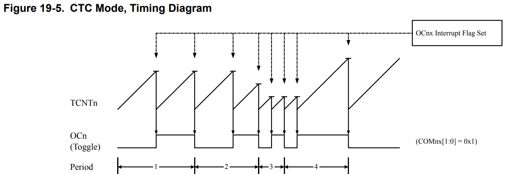<figcaption><p>CTC Mode Timing Diagram (P132)</p></figcaption></figure>

In this example, the **Compare Output Mode** of `OC0A`  is set to **toggle mode**, and it will toggle its logical level on each compare match.


1. An interrupt can be generated each time the counter value reaches the **TOP** value by setting the `OCF0A` Flag. If the interrupt is enabled, the interrupt handler routine can be used for updating the **TOP** value.
2. The `OCRnx` value is **always** updated **immediately!**


#### Phase Correct PWM Mode

The Phase Correct PWM Mode is based on **dual-slope operation**: The counter counts repeatedly from BOTTOM to TOP, and then from TOP to BOTTOM. The **dual-slope opeartion** has a **lower maximum operation frequency** than **single-slope operation.** An example timing diagram for the Phase-Correct PWM Mode is shown below (The small horizontal line marks on the `TCNT0` slopes represent compare matches between `OCR0x` and `TCNT0`):

<figure>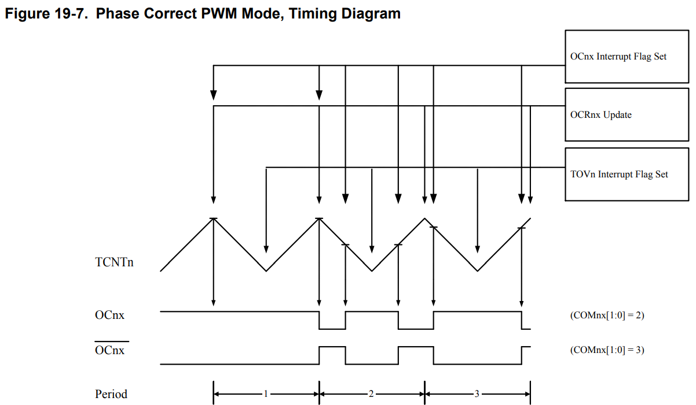<figcaption><p>Phase Correct  Mode Timing Diagram (P132)</p></figcaption></figure>

In this example, the **Compare Output Mode** of `OC0A` is set to either **inverting mode** (`COMnx[1:0]=0x10`) or **non-inverting mode** (`COMnx[1:0]=0x11`). The PWM waveform is generated by[^2]

1. clearing (or setting) the `OC0x` Register at the compare match between `OCR0x` and `TCNT0` **when the counter increments**, and
2. setting (or clearing) the `OC0x` Register at compare match between `OCR0x` and `TCNT0` **when the counter decrements**.


1) The Timer/Counter Overflow Flag (TOV0) is set each time the counter reaches BOTTOM
2) The `OCRnx` Update is **always** done at **TOP**!


At the very start of period 2 in the timing diagram above, `OC0x` has a transition from high to low even though there is no Compare Match. This transition serves to **guarantee** [**symmetry** around **BOTTOM**](#user-content-fn-3)[^3].&#x20;

## Bare Metal Programming

### Set Period

The **period** of the PWM signal depends on 3 factors here:

1. the frequency of the clock source (internal or external)
2. the prescaler $$N$$
3. the $$\text{TOP}$$ value

***



**Clock source**

> This is done by setting `CSx[2:0]` in `TCCRnB` register.

In CG2111A, at most times, we will use the **internal clock source,** whose frequency is denoted by $$\text{clk}_{\text{I/O}}$$ and the frequency value is $$16\text{Mhz}$$.



**Prescaler**

> This is done by setting `CSx[2:0]` in `TCCRnB` register also.

The prescaler is used to **slow down** your clock source. For example, if your prescaler is $$N$$, then your timer/counter's frequency will become $$\frac{\text{clk}_{\text{I/O}}}{N}$$, meaning that your timer/counter will update by 1 in every $$\frac{N}{\text{clk}_{\text{I/O}}}$$ seconds.



**TOP**

> This is done by setting the `WGMn[2:0]` bits (`WGM[1:0]` are in `TCCR0A`, `WGM02` is in `TCCR0B`)

The **TOP** value defines the maximum value the counter [**will** count to](#user-content-fn-4)[^4]. Why it affects the **period** of PWM?

In Phase-Correct PWM Mode, the **period** of the PWM signal is equal to the time when the counter counts from **BOTTOM** to **TOP** and then from **TOP** to **BOTTOM**. Thus, the **period** will be

$$
T=\frac{N}{\text{clk}_{\text{I/O}}}\times 2\times \text{TOP}
$$

Since $$f=\frac{1}{T}$$, we will get the following formula for Phase-Correct PWM Mode from the ATmega328p data sheet

$$
f_{\text{OCnxPCPWM}}=\frac{f_{\text{clk_I/O}}}{\text{N}\cdot 2\cdot \text{TOP}}
$$

where $$f_{\text{OCnxPCPWM}}$$ refers to the frequency of the **P**hase-**C**orrect **PWM**.



### Set Duty Cycle

The **duty cycle** is determined by the value stored in the `OCRnA` register, based on the following formula.

$$
\text{Duty Cycle (%)}=\frac{\text{OCR0A}}{\text{TOP}}\times 100\%
$$

For generating the desired PWM waveform with 75% duty cycle, we have:

$$
\text{Duty Cycle (%)}=\frac{\text{OCR0A}}{255}\times 100\%=75\%
$$

Thus, the value we want to write to `OCR0A` is 191.

### Set Interrupts

The timer can be configured to generate interrupts:

1. **whenever there is an output compare match** (`OCFx` Interrupt Flag)
2. timer overflow flag (`TOVn`), this depends on which PWM we are using.

All interrupt request signals are visible in the Timer Interrupt Flag Register (`TIFRn`). (We don't need to configure this register since the flag will be set automatically based on compare match and overflow)

<figure>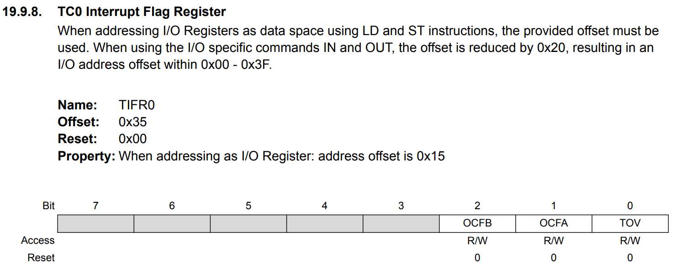<figcaption></figcaption></figure>

And all interrupts are individually **masked** with the Timer Interrupt Mask Register (`TIMSKn`). (We need to configure this register because this **mask** can enable or disable the three interrupt flags above)

<figure>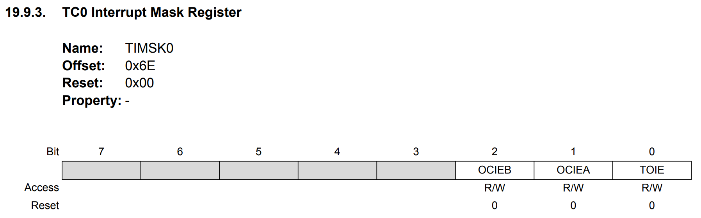<figcaption><p>TIMSK0 register (P143)</p></figcaption></figure>

Here, we want to enable the `OCFA` output compare flag, which basically means when there is a output compare match between `TCNT0` and `OCR0A`. So, we will set `OCIEA` to 1. Thus, we should write `0b10` to `TIMSK0`.

### Set Desired PWM Mode

Here, we need to determine **2** modes:

1.  **Waveform Generation Mode** (`WGMn[2:0]`): these bits will control the following accroding to the Table 19-9 below

    1. Timer/Counter [**Operating Mode**](studio-4-pwm-programming.md#modes-of-operation)
    2. the **TOP** counter value
    3. the time to update `OCRnx`
    4. the time to set `TOV` Flag

    <figure>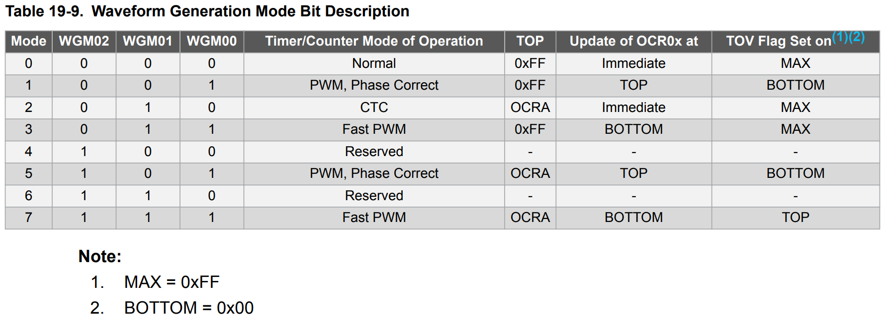<figcaption><p>Waveform Generation Mode Bit Representation (P140)</p></figcaption></figure>


2.  **Compare Output Mode** (`COMnx[1:0]`): These bits will control the **Output Compare Pin** (`OCnx`) behavior. (Below is an example if we use Phase Correct PWM Mode)

    <figure>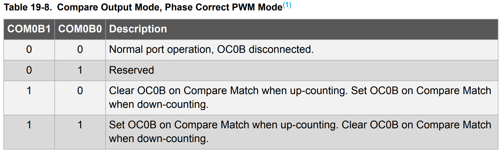<figcaption><p>Compare Output Mode, Phase Correct PWM Mode (P140)</p></figcaption></figure>

### Summary



#### **Control Register A (**`TCCR0A`**)**

1. Select Compare Output Mode in `COM0A/B[1:0]`. See [#compare-output-mode-timer-0](studio-4-pwm-programming.md#compare-output-mode-timer-0 "mention")
2. Set `WGM01` and `WGM00`. See [#wave-generation-mode-timer-0](studio-4-pwm-programming.md#wave-generation-mode-timer-0 "mention")


COM0A for Output Pin `OC0A` and COM0B for Output Pint `OC0B`


<figure>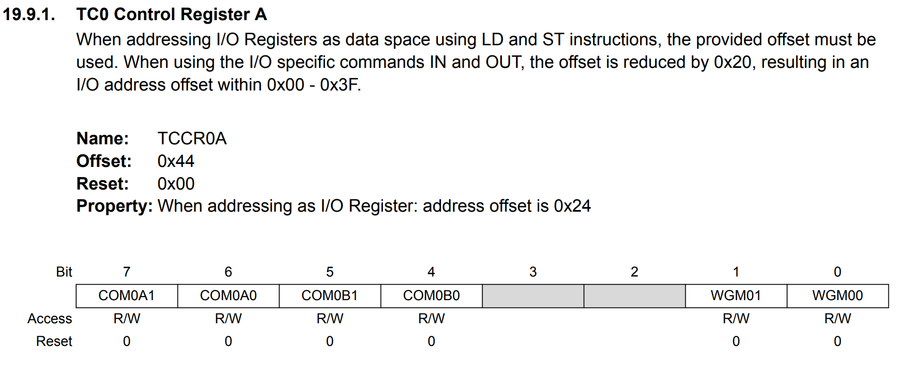<figcaption></figcaption></figure>

#### **Control Register B (`TCCR0B`)**

1. Set `WGM02`. See [#wave-generation-mode-timer-0](studio-4-pwm-programming.md#wave-generation-mode-timer-0 "mention")
2. Select clock source via `CS0[2:0]`.  See [#configure-clock-source-timer-0](studio-4-pwm-programming.md#configure-clock-source-timer-0 "mention")

<figure>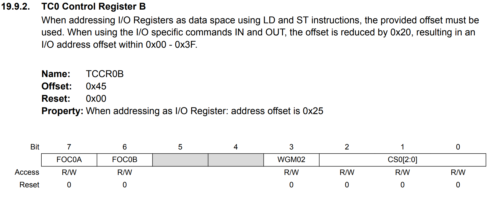<figcaption></figcaption></figure>

#### **Counter Register (`TCNT0`)**

Nothing but an 8-bit register.

<figure>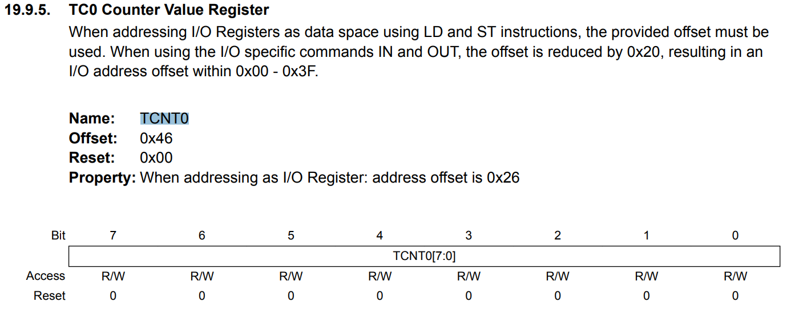<figcaption></figcaption></figure>

#### **Output Compare A (Duty Cycle, `OCR0A`)**

Nothing but an 8-bit register.

<figure>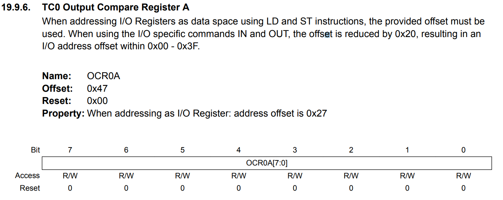<figcaption></figcaption></figure>

#### **Interrupt Mask Register (`TIMSK0`)**

Enable the Output Pin Interrupt (`OCIEA` for `OC0A` and `OCIEB` for `OC0B`)

<figure><figcaption></figcaption></figure>

#### **Output Pin**

1. `OC0A`: PD6, Arduino Pin 6
2. `OC0B`: PD5, Arduino Pin 5

#### Compare Output Mode (Timer 0)

<figure><figcaption></figcaption></figure>

#### Wave Generation Mode (Timer 0)

<figure><figcaption></figcaption></figure>

#### Configure Clock source (Timer 0)

<figure>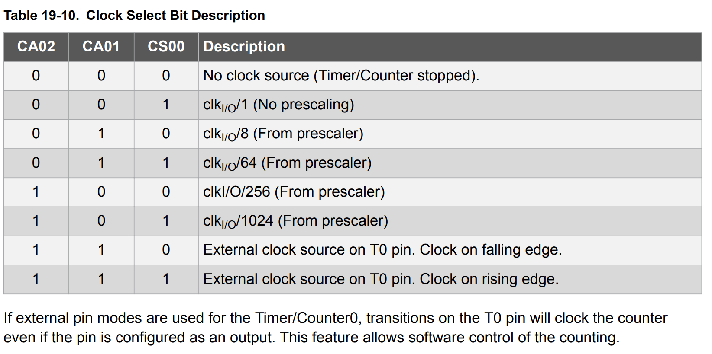<figcaption></figcaption></figure>

#### Demo setup Code


```cpp
void setup() {
	TCNT0 = 0;
	TCCR0A = 0b10000001; // Set OCOM0A to 10 and WGM to 01, Phase-Correct Mode and certain behavior in COMA
	TIMSK0 |= 0b10; // Enable Int for Output Compare Match, OCFA Flag
	OCR0A = 191; // This is used to change the duty cycle
	TCCR0B = 0b00000011; // Set clk source to clk/64, this is used to change the frequency/period
	//Set PORTD Pin 6 (Arduino Pin 6) as Output
	DDRD |= PIN6;
	sei();
}
```




Exactly the same as Timer 0, but change all the "0" with "2".

#### **Output Pin**

1. `OC2A` (PB3, Arduino Pin 11)
2. `OC2B` (PD3, Arduino Pin 3)

#### Demo setup code


```cpp
void setup() {
    TCNT2 = 0;                    // Initialize counter to 0
    TCCR2A = 0b10000001;          // COM2A[1:0] = 10 (clear on up, set on down), WGM2[1:0] = 01 (Phase-Correct PWM)
    TIMSK2 |= 0b10;               // Enable interrupt on OCR2A compare match (OCIE2A = 1)
    OCR2A = 191;                  // Set 75% duty cycle (0.75 * 255 = 191)
    TCCR2B = 0b00000011;          // CS2[2:0] = 011 (prescaler = 64), WGM2[2] = 0 (Phase-Correct PWM)
    DDRB |= (1 << PB3);           // Set PB3 (Arduino Pin 11, OC2A) as output
    sei();                        // Enable global interrupts
}
```




#### **Control Register A (`TCCR1A`)**

1. Select compare output mode in `COM1A/B[1:0]`. See [#compare-output-mode-timer-1](studio-4-pwm-programming.md#compare-output-mode-timer-1 "mention")
2. Set `WGM11` and `WGM00`. See [#wave-generation-mode-timer-1](studio-4-pwm-programming.md#wave-generation-mode-timer-1 "mention")

<figure>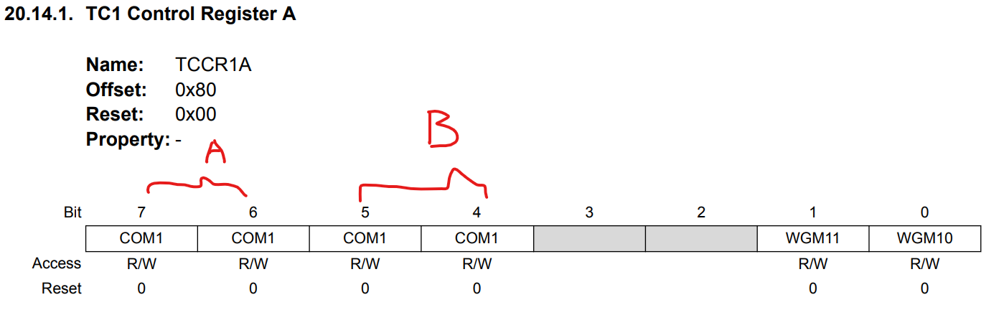<figcaption></figcaption></figure>

#### **Control Register B (`TCCR1B`)**

1. Set `WGM13` and `WGM12`. See [#wave-generation-mode-timer-1](studio-4-pwm-programming.md#wave-generation-mode-timer-1 "mention")
2. Select `CS1[2:0]`. See [#configure-clock-source-timer-1](studio-4-pwm-programming.md#configure-clock-source-timer-1 "mention")

<figure>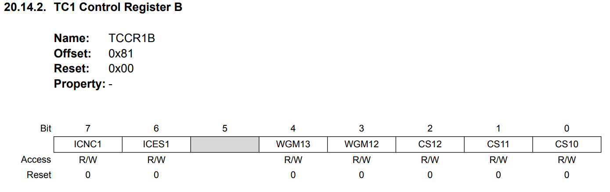<figcaption></figcaption></figure>

#### **Counter Register (**`TCNT1L` **and** `TCNT1H`**)**

1. `TCNT1L`: an 8-bit register for low byte
2. `TCNT1H`: an 8-bit register for high byte

#### **Output Compare Register (**`OCR1AL` **and** `OCR1AH`**)**

#### **Input Capture Register 1** (`ICR1L` and `ICR1H`)

This is to **customize the** $$\text{TOP}$$ value.

#### **Interrupt Mask Register** (`TIMSK1`)

<figure>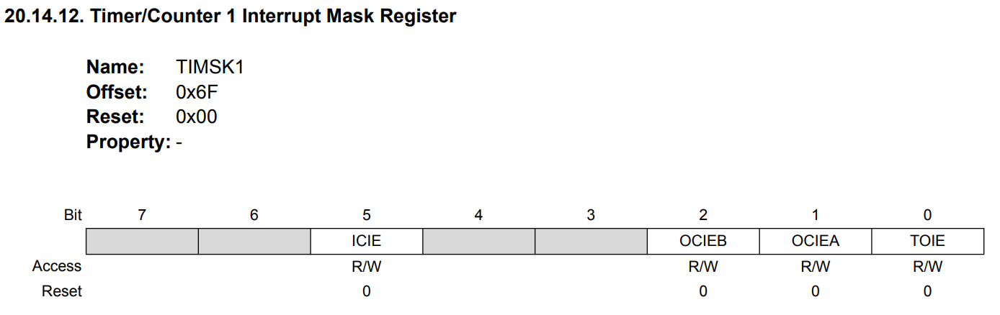<figcaption></figcaption></figure>

#### **Output Pin**

1. `OC1A` (PB1, Arduino Pin 9)
2. `OC1B` (PB2, Arduino Pin 10)

#### Compare Output Mode (Timer 1)

<figure>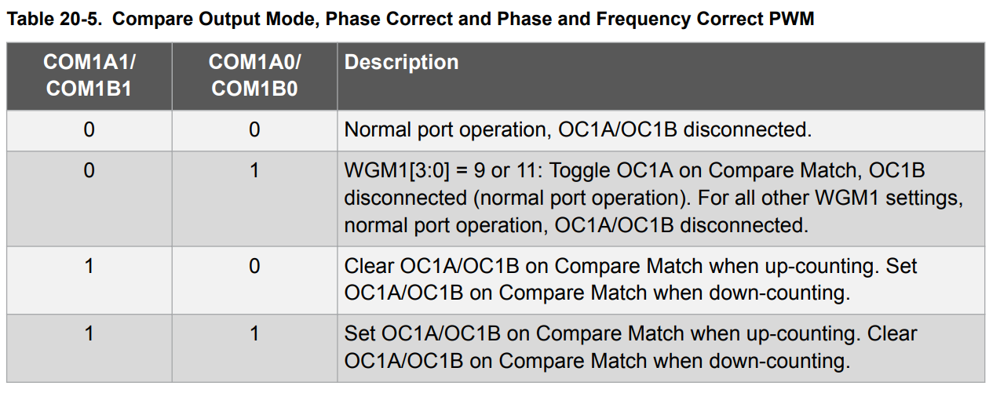<figcaption></figcaption></figure>

#### Wave Generation Mode (Timer 1)

<figure>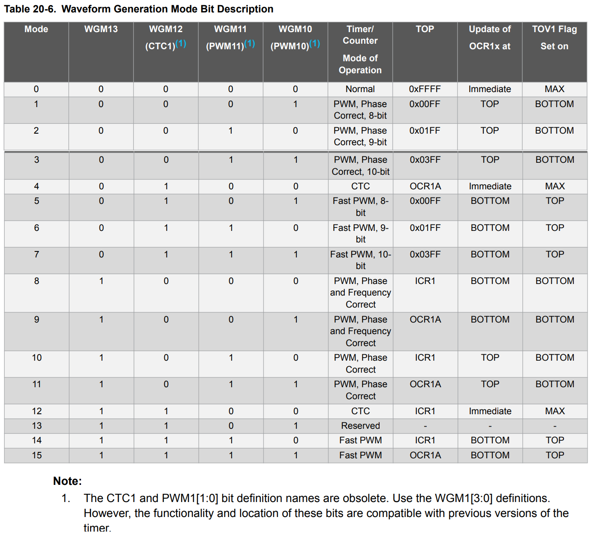<figcaption></figcaption></figure>

#### Configure Clock Source (Timer 1)

<figure>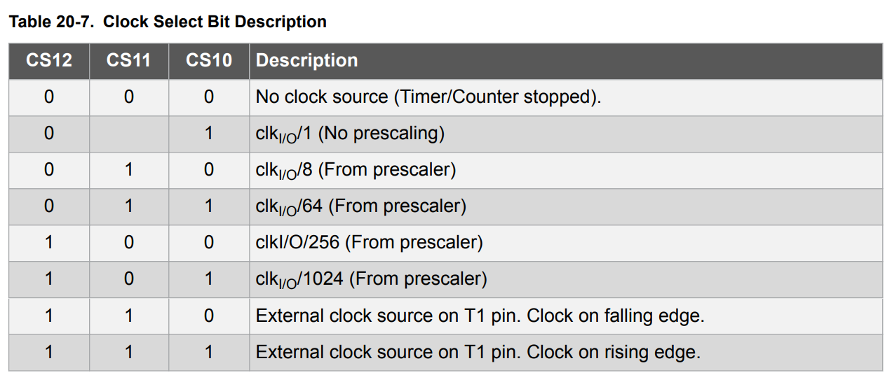<figcaption></figcaption></figure>

#### Demo setup code


```cpp
void setup() {
  // 1. Set PB1 (Pin 9 on Arduino) as output (OC1A it is)
  DDRB |= (1 << PB1);

  // 2. Set Phase Correct PWM mode with ICR1 as TOP
  TCCR1A = 0b00000010; // ICR1 as TOP, Mode 10
  TCCR1B = 0b00010010; // (1 << WGM13) | (1 << CS10) = 0b00010000 | 0b00000010 = 0b00010010

  // 3. Set ICR1
  ICR1 = 20000;

  // 5. Enable Non-Inverting Mode on OC1A (PB1)
  TCCR1A |= (1 << COM1A1);
}
```




[^1]: via Timer Interrupt Mask Register `TIMSKx`.

[^2]: the words inside "()" represents the inverting mode

[^3]: This means that we should see kind of symmetry of the signal around the **BOTTOM**. So, you think about it. If at the start of period 2, there is no such transition, we won't the the symmetry at the BOTTOM in period 2.

[^4]: "will" is different from "can".
