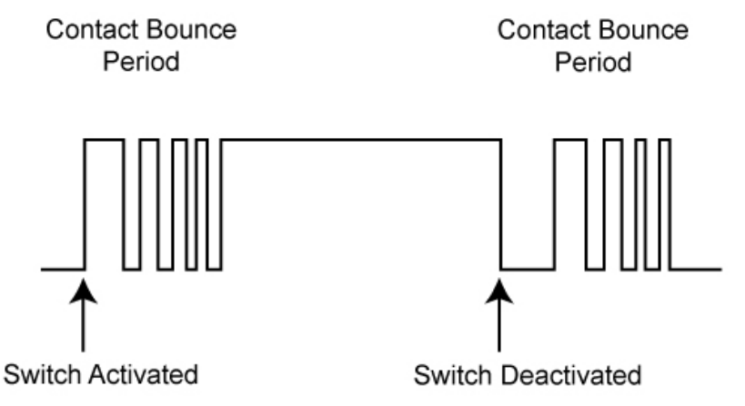

# Studio 5 - Timers

> In EPP2 Quiz, whenever you see **Timer**, it is by default using **CTC Mode**.

## Timer Concepts

Timer/Counter(TC) is one module in ATmega328p, in this studio and the previous studio, we are just using different modes of this TC module to achieve different things. In the last studio, we use the **Phase-Correct Mode** to generate a **PWM waveform** on the Output Compare pin. Now, in this studio, we mainly want to use the **CTC** **Mode** to generate an interrupt at **fixed time interval.**


In CTC Mode, the `OCnx` interrupt Flag is set every time the counter reaches the TOP value.&#x20;


### Time resolution

In this studio, the **resolution** we are referring to is **timer resolution**, which means how much time each increment takes.

#### Resolution[^1] vs. Frequency

* The **timer frequency** ($$\frac{\text{F}_\text{clk}}{\text{P}}$$) tells you **how many times the counter increments per second.** Its unit is **Hertz** (Hz).
* The **timer resolution** ($$\frac{1}{\text{Timer Frequency}}$$) tells you **how much time each increment takes**. Its unit is **seconds** (s).

#### Steps to calculate resolution



**Select the Clock source and prescaler (Get the timer frequency)**

By default, our clock source is the internal clock with a frequency of 16Mhz.

The formula to get the **timer frequency** is as follows:

$$
\text{Timer Frequency}=\frac{\text{F}_\text{clk}}{\text{P}}
$$

Where $$\text{F}_\text{clk}$$ is the **frequency of the internal clock** and $$P$$ is the value of **prescaler**.



**Get the timer resolution**

$$
\text{res}=\frac{1}{\text{Timer Frequency}}
$$



Below is the table summarizes all the available timer 0 resolutions on ATmega328p.

| CS02 | CS01 | CS00 | Prescalar P                                  | Resolution (F\_clk=16 MHz) |
| ---- | ---- | ---- | -------------------------------------------- | -------------------------- |
| 0    | 0    | 0    | Stops the timer                              | -                          |
| 0    | 0    | 1    | 1                                            | 0.0625 microseconds        |
| 0    | 1    | 0    | 8                                            | 0.5 microseconds           |
| 0    | 1    | 1    | 64                                           | 4 microseconds             |
| 1    | 0    | 0    | 256                                          | 16 microseconds            |
| 1    | 0    | 1    | 1024                                         | 64 microseconds            |
| 1    | 1    | 0    | External clock on T0. Clock on falling edge. | -                          |
| 1    | 1    | 1    | External clock on T0. Clock on rising edge   | -                          |

### CTC Mode

This mode is introduced in [studio 4](studio-4-pwm-programming.md#ctc-mode) already. Here, the real-world application of **CTC** mode is to generate an interrupt at a **fixed time period.** To do so, we need to follow the following steps in general



**Determine the Time Interval**

> This should be decided by **humans** (a.k.a by you!)

Choose a time interval, denote it as $$\text{T}_{\text{cycle}}$$. For example, we want our interrupt to be triggered every 1ms.



**Set the** `OCR0A` **Value**

In the preivous PWM studio, we have seen that under the **Phase-Correct PWM Mode**, the `OCR0A` value can be used to determine **the duty cycle**. Also, under teh **Phase-Correct Mode**, we have learned that the timer's **TOP** value will affect the **period** of the PWM waveform.

But in **CTC** Mode, since the **TOP** value is **always** `OCR0A`, meaning that the **period** we want is  determined by `OCR0A`. So, we can use the following formula to determine the value of `OCR0A`

$$
\text{OCR0A}=\frac{\text{T}_{\text{cycle}}}{\text{res}}-1
$$


The minus 1 here is because our timer/counter starts counting from 0, meaning that it will take 1 clock cycle to count 0 also.


For example, for $$\text{T}_{\text{cycle}}=1\text{ms}$$, the following table summarizes all the possible `OCR0A` value.

| Prescaler | Resolution (16 MHz Clock) | OCR0A Value (for 1 ms or 1000 microseconds) |
| --------- | ------------------------- | ------------------------------------------- |
| 1         | 0.0625 microseconds       | 16000-1=15999                               |
| 8         | 0.5 microseconds          | 2000-1=1999                                 |
| 64        | 4 microseconds            | 250-1=249                                   |
| 256       | 16 microseconds           | 62.5-1=52.5                                 |
| 1024      | 64 microseconds           | 15.63-1=14.63                               |



## Debouncing

**Bouncing** refers to the electrical phenomenon that occurs when a **mechanical switch** or **button is pressed**. The effect happens because the internal metal contacts d**on't make a clean, immediate connection** but instead "bounce" against each other, rapidly connecting and disconnecting multiple times before settling into a stable state.

For example, when you press a button, the electrical signal doesn't immediately switch from OFF to ON in a single clean transition. Instead, it oscillates between states for a brief period (typically milliseconds) until it stabilizes. A similar bouncing effect occurs when releasing the button. This oscillation creates a "waveform" of rapid ON-OFF-ON transitions before finally settling.

<figure><figcaption><p>Bouncing demo of a mechanical switch</p></figcaption></figure>

This phenomenon is important to understand in electronics design because these rapid transitions can be misinterpreted as multiple button presses by digital systems, requiring software or hardware **debouncing** solutions to filter out the unwanted signals.

***

The way to **solve** the bouncing issue is called **debouncing**. In this studio, we will mainly introduce the **SW** approach.


The whole idea of **debouncing** is to **decrease the times of doing the thing we want to do.** e.g. changing the state of the LED.


```cpp
currTime = millis();
if (currTime – lastTime > THRESHOLD) {
    lastTime = currTime;
    /* DO WHATEVER WE NEED TO DO WHEN WE PRESS THE SWITCH */
    function();
}
```

We place this algorithm in the ISR that is triggered when the button is pressed. Each time the ISR is triggered, this algorithm checks the current “time” as returned by `millis()`, and subtracts away the last time we recognized a switch press (tracked by `lastTime`). If the difference is more than a certain number of milliseconds given by `THRESHOLD`, we **recognize this as a switch press**, and save the time in `lastTime`.

The `THRESHOLD` is usually chosen to be **long enough** via **trial-and-error** so that it may cover the whole range and the times we **mis-called** the `function()` **can be minimized**.


The idea of `THRESHOLD` can also be used to implement in the SW approach to generate a PWM signal with a very long period that is not achieveable by TC Module on ATmega328p. (See more [#id-01.-understanding-the-pwm-module](../tutorial/tut-2-pwm-and-timers.md#id-01.-understanding-the-pwm-module "mention"))


***

The seemingly true approach should be


```cpp
currentBtnState = digitalRead(btnPin);

if (currentBtnState != previousBtnState) {
        lastDebounceTime = millis();
        // every time the button state changes, get the time of that change
}

if ((millis() - lastDebounceTime) > debounceDelay) {
        /*
        *if the difference between the last time the button changed is greater
                *than the delay period, it is safe to say
                *the button is in the final steady state, so set the LED state to
                *button state.
        */
        currentLedState = currentBtnState;
}
```


## Bare Metal Programming

The steps here are very similar to [studio 4's PWM generation](studio-4-pwm-programming.md#bare-metal-programming). It's just we will use our newly calculated `OCR0A` value instead.&#x20;

However, notice the the sequence you set up the register matters! Follow the following demo,


```cpp
// Timer set up function. 
void setupTimer()
{
  // Set timer 2 to produce 100 microsecond (100us) ticks 
  // But do no start the timer here.
  // The sequence matters
  TCNT2 = 0;
  TCCR2A = 0b00000010;
  TIMSK2 |= (1 << OCIE2A);
  OCR2A = 199; // 200 - 1
}

// Timer start function
void startTimer()
{
  // Start timer 2 here.
  TCCR2B = 0b00000010;
}
```


[^1]: Here, we use the **timer resolution**
