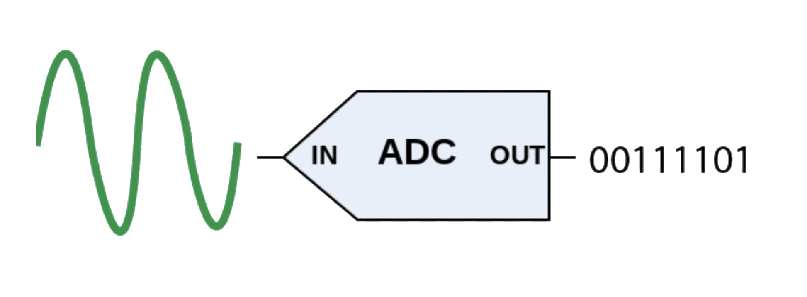
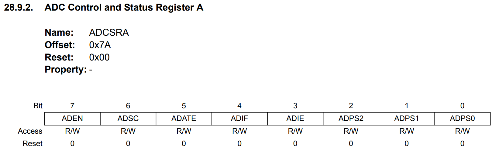
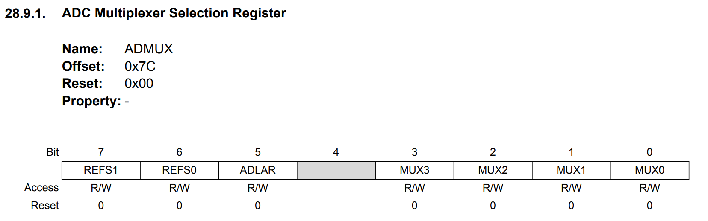
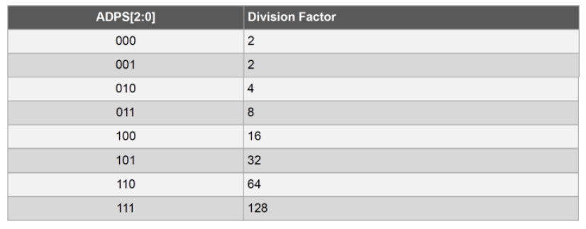
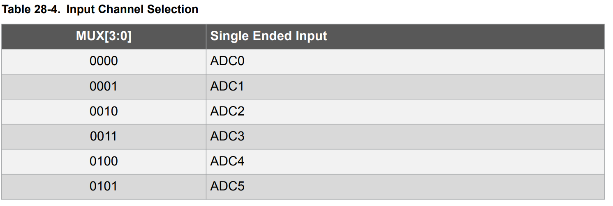
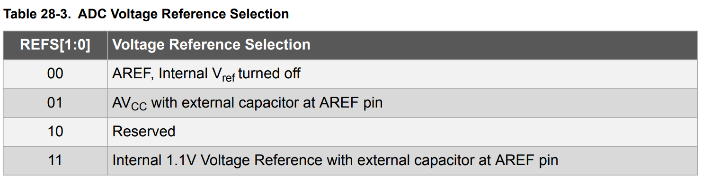

# Studio 8 - ADC Module

## ADC Concepts

**A**nalog-to-**D**igital **C**onverter (ADC), as its name suggests, is mainly used to **convert** the **continuously varying** input voltage (**analog signal**) into a **discrete digital representation** that the microcontroller can store and manipulate.

<figure><figcaption><p>ADC Demo</p></figcaption></figure>

In this studio, we will explore an interesting between ADC and PWM. While ADC converts **an analog voltag**e into a **digital number**, PWM performs the inverse operation by generating an **analog-like effect** from a **digital signal**. To illustrate this relationship, consider a scenario where a flex sensor is used to control an LED. A flex sensor is a type of variable resistor whose resistance changes when bent. The resistance changes result in a varying voltage when placed in a voltage divider circuit. Since this voltage is an analog signal, it must be digitized before the microcontroller can process it. The ADC module accomplishes this by **sampling the voltage** and **mapping it to a corresponding digital value**.

Once the digital value is obtained from the ADC, it can be used to adjust the brightness of an LED through PWM. For example, if the ADC **measures a higher voltage**, this might correspond to a greater degree of bending in the flex sensor. The microcontroller can then **increase the duty cycle** of the PWM signal, causing the LED to glow more brightly. Conversely, if the sensor produces **a lower voltage**, the microcontroller **reduces the duty cycle**, dimming the LED.

***

The two most important characteristics to look for in the selection of ADC are **sampling rate** and **resolution**. We will introduce them as follows:

### Sampling

The continuous real-world analog signals are **sampled** for conversion into digital. The **sampling process** can be considered analogous to taking a screenshot of the continuous analog signal at regular intervals.


The analog signal values between two sampling instants will be lost.


#### Nyquist Sampling Theorem

**Motivation:** Even when a real analog signal is converted into digital for fast processing, we cannot accommodate any **loss of data**, values, or information. Improper or unscientific sampling can lead to the kind of scenario where a lot of crucial data may get lost.

To better tackle this issue, Nyquist has come up with the following theorem

> signals should be sampled with **at least twice the** [**bandwidth**](#user-content-fn-1)[^1] of the signal to prevent loss of data.


Somtimes, for simplicity, we just say "signals should be sampled with at least **twice as fast as the highest frequency content of the signal**".


The Nyquist Theorem theoretically **sets the minimum limit** for the ADC **sampling rate**.

<details>

<summary>What is sampling rate?</summary>

The **ADC sampling rate** refers to the **number of samples per second**. It is also called the **sample rate**. The unit of sampling rate is **samples per second** or **Hertz**. However, we know that **Hertz is the unit of frequency**. Therefore, the **sampling rate** can be also referred to as **sampling frequency**.


ADC Sampling rate = ADC Sampling frequency


</details>

### Resolution

During the Analog-to-Digital Conversion process, we need to **quantize** and then **encode** the anlog signal. To do so, we need to determine:

1. the number of **quantization** bits
2. the voltage span

So, with these two values, we can calculate our **resolution** as

$$
\text{resolution}=\frac{\text{voltage span}}{2^\text{b}}
$$

For example, $$b$$ bits allows to divide the input signal range into $$2^\text{b}$$ **different quantization levels**, and each quantization level is represented as a **binary number,** thus allowing the quantized signal to be **encoded**.

Now, we give the formal definition of **resolution**,

> **Resolution** is the **voltage difference** between **two adjacent quantization levels**.


In the modern EE industry, **resolution** is defined to be the **number of quantization bits** of the ADC.


## Bare Metal Programming

The ADC on ATmega328p converts an **analog input voltage** to a **10-bit** **digital value**. This means that the **quantization bits** of the ADC are 10. Thus, we have decided **one** of the **two** important characteristics of the ADC Module. The other characteristic — **sampling rate**, will be determined in the following procedure.

### The Programming Procedure



**Activate power to the ADC**

Write a `0` to bit 0 (`PRADC`) of the Power Reduction Register (`PRR`)



**Switch on the ADC**

Write a `1` to bit 7 (`ADEN`) of the ADC Control and Status Register (`ADCSRA`)


Voltage reference and input channel selection **will not** take effect until `ADEN` is set.




**Configure the** [**sampling frequency**](#user-content-fn-2)[^2]

This is done by setting the `ADPS[2:0]` in `ADCSRA`.

The **ADC Clock frequency** ($$f_{\text{ADC}}$$) is determined by the prescaler $$N$$ as well as the **system clock frequency** $$f_{\text{clk}}$$. The relationship is as follows (which is similar to what we have seen in PWM)

$$
f_{\text{ADC}}=\frac{f_{\text{clk}}}{N}
$$

Since a typical conversion takes **13** clock cycles. Thus, we have our **sampling frequency** ($$f_{\text{s}}$$) to be

$$
f_{\text{s}}=\frac{f_{\text{ADC}}}{13}
$$


The number of clock cycles taken for one ADC conversion **won't change** as you change the prescaler. Because this 13 is derived by a fixed characteristic of the ATmega328p’s ADC.




**Configure ADC**

This is done in the ADC Multiplexer Register `ADMUX`. It determines two critical settings for the ADC:

1. **Selection of the input channel**: This specifies which **analog input pin** will be used for coversion. This is done by configuring `MUX[3:0]`(Bit 0-3).
2. **Selection of the reference voltage**: This defines the **voltage range** against which the analog signal will be converted into a digital value. This is done by configuring `REFS[1:0]`(Bit 6-7).


Why do we need **an input channel?** This is because we need some place to **get the input analog voltage signal!**




**Start the conversion**

Write a `1` to bit 6 (`ADSC`) of `ADCSRA`.



**Wait for the conversion to complete**

There are **two** ways to wait for the conversion to complete:

1. Polling
2. Interrupt

***

**Polling**

In this approach, we continuously check whether the `ADSC` bit has returned to 0.

```cpp
while (ADCSRA & 0b01000000);
```

**Interrupt**

This is allowed thanks to the fact that the ADC Module on ATmega328p provides a status flag called `ADIF` (ADC Interrupt Flag) in the `ADCSRA` register (bit 4). It will be set to 1 when the conversion is complete.

To **enable** ADC interrupts, set the `ADIE` (ADC Interrupt Enable) bit in the `ADCSRA` register (bit 3) by writing a `1`. So, once the conversion is complete, the `ADC_vect` interrupt is triggered automatically.

So, we can define an ISR for the `ADC_vect` interrupt, which will read the values from output value from the ADC.



**Read in the converted value**

Since the ATmega328p ADC is a 10-bit converter, it produces a **10-bit** result, but the ATmega328p only has 8-bit registers. Therefore, the result is split across **two** registers:

1. The **lower 8 bits** are stored in `ADCL`
2. The **upper 2 bits** are stored in `ADCH`


```cpp
loval = ADCL;
hival = ADCH;
adcval = (hival << 8) + loval;
```



Always read `ADCL` first! Otherwise, you will lose the data




**GOTO step 5 until desired number of values are converted**



### Register

#### Power Reduction Register (`PRR`)

<figure><figcaption></figcaption></figure>

#### ADC Control and Status Register A (`ADCSRA`)

<figure><figcaption></figcaption></figure>

#### ADC Multiplexer Selection Register (`ADMUX`)

<figure><figcaption></figcaption></figure>

#### `ADCL` and `ADCH`

Two 8-bit registers, nothing special.

#### Prescaler Selection

> These bits are in [#adc-control-and-status-register-a-adcsra](studio-8-adc-module.md#adc-control-and-status-register-a-adcsra "mention")

<figure><figcaption></figcaption></figure>

#### Input Channel Selection

> These bits are in [#adc-multiplexer-selection-register-admux](studio-8-adc-module.md#adc-multiplexer-selection-register-admux "mention")

The ATmega328P microcontroller has multiple ADC input channels, numbered `ADC0` to `ADC7`. However, on the Arduino Uno board (which uses the PDIP package), only `ADC0` to `ADC5` are accessible as `A0` to `A5`. These channels correspond to the physical analog input pins on the board.

<figure><figcaption></figcaption></figure>

#### Reference Voltage Selection

> These bits are in [#adc-multiplexer-selection-register-admux](studio-8-adc-module.md#adc-multiplexer-selection-register-admux "mention")

<figure><figcaption></figcaption></figure>

### Sample Code

Below are the sample code to illustrate the difference between Polling and Interrupt with ADC Module during the lab.




```cpp
#include "Arduino.h"
unsigned int adcvalue, loval, hival;
void setup() {
  // Clear Bit 0 (PRADC) to turn on power for the ADC module
  PRR &= ~(1 << PRADC);
  //ADEN = 1, ADPS[2:0] = 111 (Prescale = 128)
  ADCSRA |= ((1 << ADEN) | (1 << ADPS2) | (1 << ADPS1) | (1 << ADPS0));
  //REFS[1:0] = 01 (AVcc as reference), MUX[2:0] = 000 (Channel 0)
  ADMUX |= ((1 << REFS0));
  // Set PortB Pin 5 as output
  DDRB |= (1 << DDB5);
}

void loop() {
  // ADSC = 1 (Start Conversion)
  ADCSRA |= (1 << ADSC);
  /*Wait for ADSC to go change to '0' to indicate that conversion is complete*/
  while(ADCSRA & (1 << ADSC));
  loval = ADCL;
  hival = ADCH;
  adcvalue = (hival << 8) | loval;

  ledToggle();
  _delay_loop_2(adcvalue); // it freezes here
}

void ledToggle()
{
  PORTB ^= (1 << PORTB5);
}
```





```cpp
#include "Arduino.h"
unsigned int adcvalue, loval, hival;

void setup() {
  // Clear Bit 0 (PRADC) to turn on power for the ADC module
  PRR &= ~(1 << PRADC);
  //ADEN = 1, ADPS[2:0] = 111 (Prescale = 128), ADIE = 1
  ADCSRA |= ((1 << ADEN) | (1 << ADPS2) | (1 << ADPS1) | (1 << ADPS0) | (1 <<
  ADIE));
  //REFS[1:0] = 01 (AVcc as reference), MUX[2:0] = 000 (Channel 0)
  ADMUX |= ((1 << REFS0));
  // Set PortB Pin 5 as output
  DDRB |= (1 << DDB5);
  sei();
  // ADSC = 1 (Start Conversion)
  ADCSRA |= (1 << ADSC);
}

void loop() {
  ledToggle();
  _delay_loop_2(adcvalue);
}

void ledToggle() {
  PORTB ^= (1 << PORTB5); 
}

ISR(ADC_vect) {
  // Read low and high bytes of the ADC result
  loval = ADCL;
  hival = ADCH;
  adcvalue = (hival << 8) | loval;
  // Start the next ADC conversion
  ADCSRA |= (1 << ADSC);
}
```




Now, the following code **may** achieve the interesting example we have mentioned at the very beginning.


```cpp
#include "Arduino.h"
#include <avr/interrupt.h>
unsigned int adcvalue;
unsigned int remapped_adc;

void InitPWM() {
  TCNT0 = 0;
  OCR0A = 0;
  TCCR0A = 0b10000001;
  TIMSK0 |= 0b10;
}

void startPWM() {
  // Set prescaler to be 64
  TCCR0B = 0b00000011;
}

// --- TIMER0 Compare Match A ISR ---
ISR(TIMER0_COMPA_vect) {
  // No code needed here for PWM operation.
}

// ADC Conversion Complete ISR
ISR(ADC_vect) {
  unsigned char low = ADCL;
  unsigned char high = ADCH;
  adcvalue = (high << 8) | low;
  
  // Remap ADC value to 8-bit range (0-255)
  remapped_adc = (adcvalue * 255) / 1023;
  OCR0A = remapped_adc; // Update PWM duty cycle
  
  ADCSRA |= (1 << ADSC); // Start next conversion
}

void setup() {
  // put your setup code here, to run once:
  PRR &= 0b11111110;
  ADCSRA = 0b10001111;
  ADMUX = 0b01000000;
  // Change to OC0A, which is Pin 6
  DDRD |= 0b01000000;

  InitPWM();
  startPWM();
  sei();
  ADCSRA |= 0b01000000;
  Serial.begin(9600);
}

void loop() {
  Serial.println(remapped_adc);
}
```


[^1]: **Bandwidth** of a signal is defined as the **difference between the highest and the lowest frequency** of a particular type of electromagnetic wave signal. Its unit is "Hertz".

[^2]: or sampling rate
