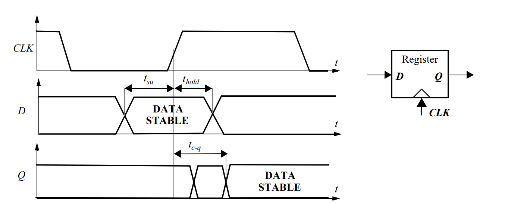

# Designing Sequential Logic Circuits

## Introduction

Combinational logic circuits, described earlier, have the property that the output of a logic block is only a function of the current input values, assuming that enough time has elapsed for the logic gates to settle. Yet virtually all useful systems require storage of state information, leading to another class of circuits called sequential logic circuits. In these circuits, the output not only depends upon the current values of the inputs, but also upon preceding input values. In other words, a sequential circuit remembers some of the past history of the system — it has memory.

### Timing Metrics for Sequential Circuits

There are three important timing parameters associated with a register as illustrated in the Figure below

1. The **set-up** time (tsu) is the time that the data inputs (D input) must be valid before the clock transition (this is, the 0 to 1 transition for a positive edge-triggered register).
2. The **hold time** (thold) is the time the data input must remain valid after the clock edge.
3. Assuming that the set-up and hold-times are met, the data at the D input is copied to the Q output after a worst-case propagation delay (with reference to the clock edge) denoted by **t****c-q**.

<figure><figcaption>
Definition of set-up time, hold time and propagation delay of a synchronous register
</figcaption></figure>

Given the timing information for the registers and the combination logic, some **system-level timing constraints** can be derived. Assume that the worst-case propagation delay of the logic equals tplogic, while its minimum delay (also called the contamination delay) is tcd. The minimum clock period T, required for proper operation of the sequential circuit is given by

$$
T\geq t_{\text{c-q}}+t_{\text{plogic}}+t_{\text{su}}
$$

The **hold time** of the register imposes an extra constraint for proper operation,

$$
t_{\text{cdregister}}+t_{\text{cdlogic}}\geq t_{\text{hold}} \text{ ,or}\\t_{\text{c-q, min}}+t_{\text{cd}}\geq t_{\text{hold}}
$$

where tcdregister / tc-q,min is the minimum propagation delay (or contamination delay) of the register and tcdlogic / tcd is the minimum propagation delay (or contamination delay) of the combinational logic.
