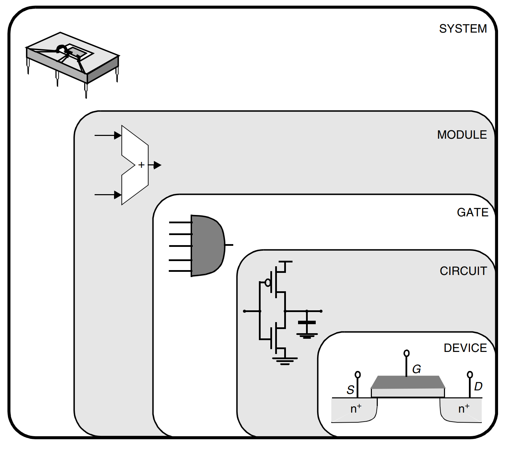
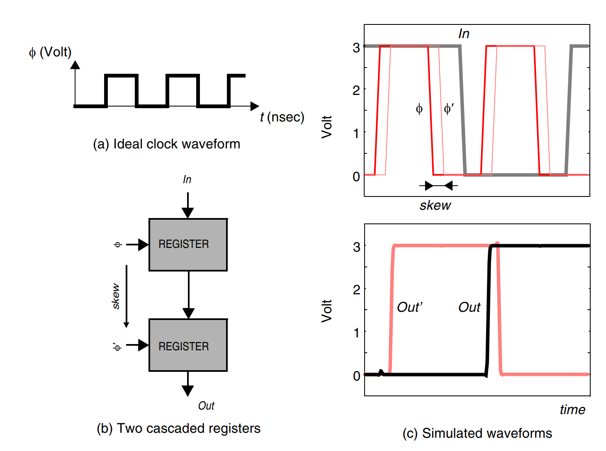

# Issues in Digital IC Design

Early designs were truly hand-crafted. Every transistor was laid out and optimized individually and carefully fitted into its environment. This approach is, obviously, not appropriate when more than a million devices have to be created and assembled.

Designers have, therefore, increasingly adhered to rigid design methodologies and strategies that are more amenable to **design automation**. Instead of the individualized approach of the earlier designs, a circuit is constructed in a **hierarchical way**: a processor is a collection of **modules**, each of which consists of a number of **cells** on its own. Cells are reused as much as possible to reduce the design effort and to enhance the chances for a first-time-right implementation. The fact that this hierarchical approach is at all possible is the key ingredient for the success of digital circuit design and also explains why, for instance, very large scale analog design has never caught on.

The obvious next question is why such an approach is feasible in the digital world and not (or to a lesser degree) in analog designs. The crucial concept here, and the most important one in dealing with the complexity issue, is **abstraction**. At each design level, the internal details of a complex module can be abstracted away and replaced by a black box view or model. This model contains virtually all the information needed to deal with the block at the next level of hierarchy. For instance, once a designer has implemented a multiplier module, its performance can be defined very accurately and can be captured in a model. The performance of this multiplier is in general only marginally influenced by the way it is utilized in a larger system. For all purposes, it can hence be considered a black box with known characteristics. As there exists no compelling need for the system designer to look inside this box, design complexity is substantially reduced. The impact of this divide and conquer approach is dramatic. Instead of having to deal with a myriad of elements, the designer has to consider only a handful of components, each of which are characterized in performance and cost by a small number of parameters.

Typically used abstraction levels in digital circuit design are, in order of increasing abstraction, the device, circuit, gate, functional module (e.g., adder) and system levels (e.g., processor), as illustrated in the following figure. A semiconductor device is an entity with a very complex behavior.

<figure><figcaption>
Design abstraction levels in digital circuits
</figcaption></figure>

This design philosophy has been the enabler for the emergence of elaborate computer-aided design (CAD) frameworks for digital integrated circuits; without it the current design complexity would not have been achievable. Design tools include simulation at the various complexity levels, design verification, layout generation, and design synthesis.

But here comes a problem:

> If design automation solves all our design problems, why should we be concerned with digital circuit design at all? Will the next-generation digital designer ever have to worry about transistors or parasitics, or is the smallest design entity he will ever consider the gate and the module?

The truth is that the reality is more complex, and various reasons exist as to why an insight into digital circuits and their intricacies will still be an important asset for a long time to come.

* First of all, someone still has to design and implement the module libraries. Semiconductor technologies continue to advance from year to year. Until one has developed a fool-proof approach towards “porting” a cell from one technology to another, each change in technology — which happens approximately every two years — requires a redesign of the library.
* Creating an adequate model of a cell or module requires an in-depth understanding of its internal operation. For instance, to identify the dominant performance parameters of a given design, one has to recognize the critical timing path first.
* The library-based approach works fine when the design constraints (speed, cost or power) are not stringent. This is the case for a large number of application-specific designs, where the main goal is to provide a more integrated system solution, and performance requirements are easily within the capabilities of the technology. Unfortunately for a large number of other products such as microprocessors, success hinges on high performance, and designers therefore tend to push technology to its limits. At that point, the hierarchical approach tends to become somewhat less attractive. To resort to our previous analogy to software methodologies, a programmer tends to “customize” software routines when execution speed is crucial; compilers — or design tools — are not yet to the level of what human sweat or ingenuity can deliver.
* Even more important is the observation that the abstraction-based approach is only correct to a certain degree. The performance of, for instance, an adder can be substantially influenced by the way it is connected to its environment. The interconnection wires themselves contribute to delay as they introduce parasitic capacitances, resistances and even inductances. The impact of the interconnect parasitics is bound to increase in the years to come with the scaling of the technology.
* Scaling tends to emphasize some other deficiencies of the abstraction-based model. Some design entities tend to be global or external (to resort anew to the software analogy). Examples of global factors are the clock signals, used for synchronization in a digital design, and the supply lines. Increasing the size of a digital design has a profound effect on these global signals. For instance, connecting more cells to a supply line can cause a voltage drop over the wire, which, in its turn, can slow down all the connected cells. Issues such as clock distribution, circuit synchronization, and supply-voltage distribution are becoming more and more critical. Coping with them requires a profound understanding of the intricacies of digital circuit design.

Example 1: Clocks Defy Hierarchy

The **clock** is one of the most important global signals in a design. The function of the clock signal in a digital design is to order the multitude of events happening in the circuit. This task can be compared to the function of a traffic light that determines which cars are allowed to move. It also makes sure that all operations are completed before the next one starts — a traffic light should be green long enough to allow a car or a pedestrian to cross the road.

Under ideal circumstances, the clock signal is a periodic step waveform with transitions **synchronized** throughout the designed circuit (in the following figure(a)). In light of our analogy, changes in the traffic lights should be **synchronized** to maximize throughput while avoiding accidents.

<figure><figcaption>
Impact of clock misalignment
</figcaption></figure>


Here, "synchronized" means that ideally there shouldn't be any delay when you apply the same clock on different modules.


The importance of the clock alignment concept is illustrated with the example of two cascaded registers, both operating on the rising edge of the clock $$\phi$$. Under normal operating conditions, the input In gets sampled into the first register on the rising edge of $$\phi$$ and appears at the output exactly one clock period later.

Due to delays associated with routing the clock wires, it may happen that the clocks become misaligned with respect to each other. Consider the case that the clock signal for the second register is delayed — or skewed — by a value $$\delta$$. The rising edge of the delayed clock $$\phi'$$ will postpone the sampling of the input of the second register. If the time it takes to propagate the output of the first register to the input of the second is **smaller** than the clock delay, the latter will sample the wrong value. This causes the output to change prematurely, as clearly illustrated in the simulation, where the signal Out' goes high at the first rising edge of $$\phi'$$ instead of the second one. In terms of our traffic analogy, cars of a first traffic light hit the cars of the next light that have not left yet.


Ideally, the sampling of two registers should happen simultaneously. However, in reality, due to clock skew, the sampling doesn't happen simultaneously. This is the simplified explanation for this example.


