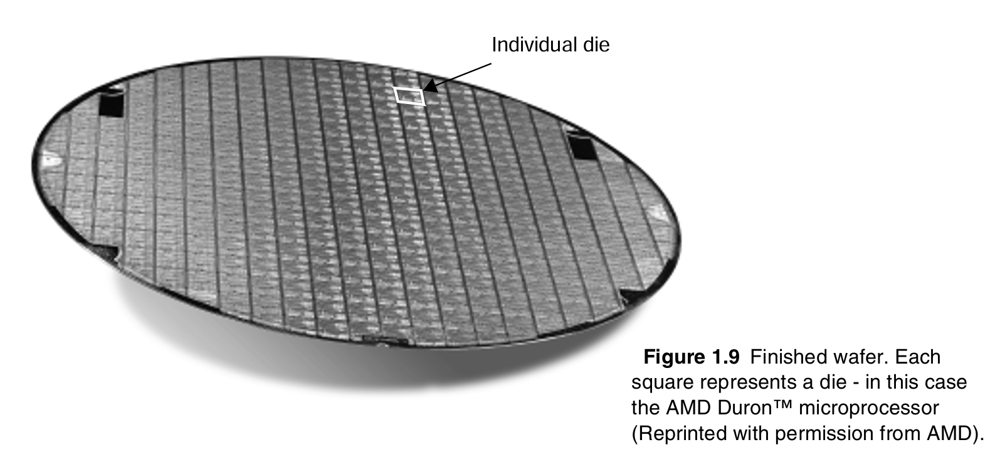

# Quality Metrics of a Digital Design

This section defines a set of **basic properties** of a digital design. These properties help to quantify the quality of a design from different perspectives: cost, functionality, robustness, performance, and energy consumption.


The introduced properties are relevant at **all levels** of the design hierarchy, be it system, chip, module, and gate.


To ensure consistency in the definitions throughout the design hierarchy stack, we propose a **bottom-up** approach: we start with defining the basic quality metrics of a simple inverter, and gradually expand these to the more complex functions such as gate, module, and chip.

## Cost of an IC

The total cost of any product can be separated into two components:

1. the recurring expenses or the **variable cost**, and
2. the non-recurring expenses or the **fixed cost**.

### Fixed Cost

The fixed cost is **independent** of the sales volume, the number of products sold. An important component of the fixed cost of an integrated circuit is the effort in time and manpower it takes to produce the design which is called the **design cost**.

### Variable Cost

This accounts for the cost that is directly attributable to a manufactured product, and is hence proportional to the product volume. Variable costs include the costs of the parts used in the product, assembly costs, and testing costs. The total cost of an integrated circuit is now

$$
\text{cost per IC} = \text{variable cost per IC} + \left( \frac{\text{fixed cost}}{\text{volume}} \right)\tag{1.1}
$$

While the cost of producing a single transistor has dropped exponentially over the past decades, the basic variable-cost equation has not changed:

$$
\text{variable cost} = \frac{\text{cost of die} + \text{cost of die test} + \text{cost of packaging}}{\text{final test yield}} \tag{1.2}
$$

As will be elaborated on in Chapter 2, the IC manufacturing process groups a number of identical circuits onto a single wafer (Figure 1.9).

<figure><picture><source srcset="../../.gitbook/assets/wafer-die-dark.png" media="(prefers-color-scheme: dark)"></picture><figcaption>
Figure 1.9
</figcaption></figure>

Upon completion of the fabrication, the wafer is chopped into dies, which are then individually packaged after being tested. We will focus on the cost of the dies in this discussion. The cost of packaging and test is the topic of later chapters.

The die cost depends upon the number of good die on a wafer, and the percentage of those that are functional. The latter factor is called the _die yield_.

$$
\text{cost of die} = \frac{\text{cost of wafer}}{\text{dies per wafer} \times \text{die yield}} \tag{1.3}
$$

The number of dies per wafer is, in essence, the area of the wafer divided by the die area.


The actual situation is somewhat more complicated as wafers are round, and chips are square. Dies around the perimeter of the wafer are therefore lost.


Eq. (1.3) also presents the first indication that the cost of a circuit is dependent upon the chip area — increasing the chip area simply means that fewer dies fit on a wafer.

The actual relation between cost and area is more complex, and depends upon the _die yield_. Both the substrate material and the manufacturing process introduce **faults** that can cause a chip to fail. Assuming that the defects are randomly distributed over the wafer, and that the yield is inversely proportional to the complexity of the fabrication process, we obtain the following expression of the die yield:

$$
\text{die yield} = \left( 1 + \frac{\text{defects per unit area} \times \text{die area}}{\alpha} \right)^{-\alpha} \tag{1.4}
$$

where $$\alpha$$ is a parameter that depends upon the complexity of the manufacturing process, and is roughly proportional to the number of masks. $$\alpha=3$$ is a good estimate for today’s complex CMOS processes. The defects per unit area is a measure of the material and process induced faults. A value between 0.5 and 1 defects/cm2 is typical these days, but depends strongly upon the maturity of the process.

The bottom line is that the number of functional of _dies per wafer_, and hence the _cost per die_ is a strong function of the die area.


While the yield tends to be excellent for the smaller designs, it drops rapidly once a certain threshold is exceeded.


Bearing in mind the equations derived above and the typical parameter values, we can conclude that die costs are proportional to the fourth power of the area:

$$
\text{cost of die}=f(\text{die area})^4
$$

The area is a function that is directly controllable by the designer(s), and is the prime metric for cost. **Small area** is hence a desirable property for a digital gate.


The _number of transistors_ in a gate is indicative for the expected implementation area. Other parameters may have an impact, though. For instance, a complex interconnect pattern between the transistors can cause the wiring area to dominate.


Example of Die Yield

Assume a wafer size of 12 inch, a die size of 2.5 cm2, 1 defects/cm2, and $$\alpha=3$$. Determine the die yield of this CMOS process run.

***

**Sol**. The number of dies per wafer can be estimated with the following expression, which takes into account the lost dies around the perimeter of the wafer.

\text{dies per wafer} = \frac{\pi \times (\text{wafer diameter} / 2)^2}{\text{die area}} - \frac{\pi \times \text{wafer diameter}}{\sqrt{2 \times \text{die area}}}

This means 252 (= 296 - 44) potentially operational dies for this particular example. The die yield can be computed with the aid of Eq. (1.4), and equals 16%! This means that on the average only 40 of the dies will be fully functional.

> TODO: Plug in the numbers into the exact formula mentioned before.

