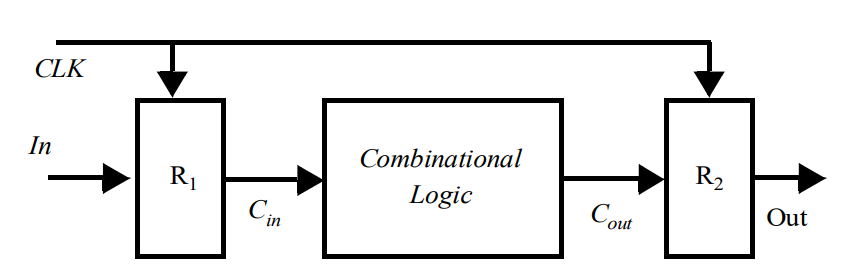
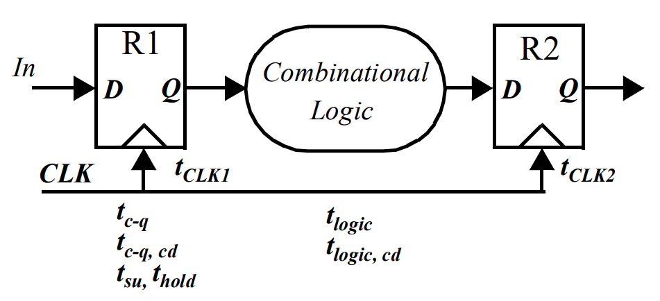
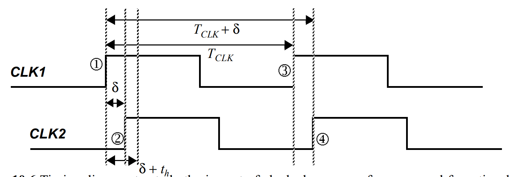
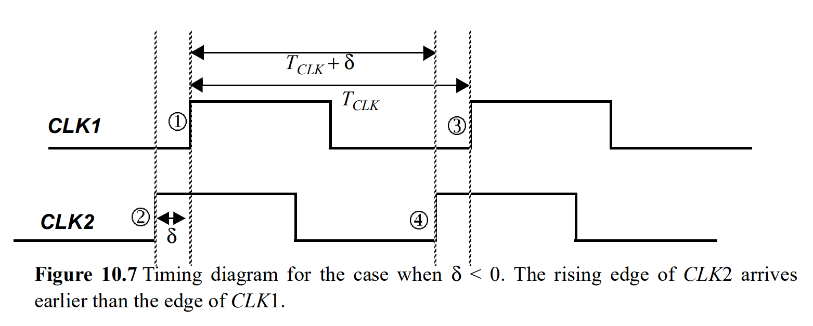
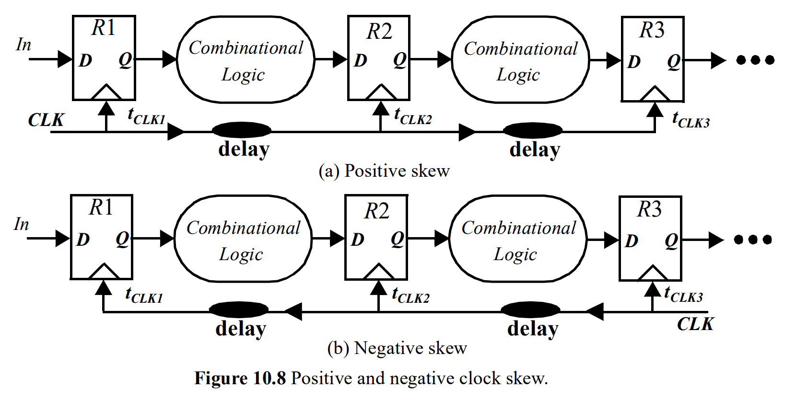
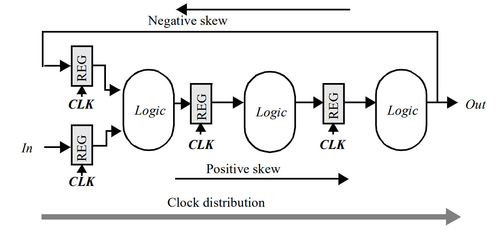
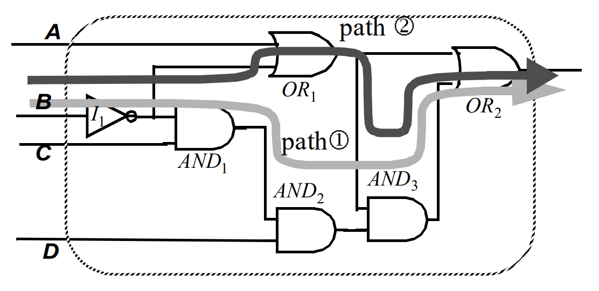
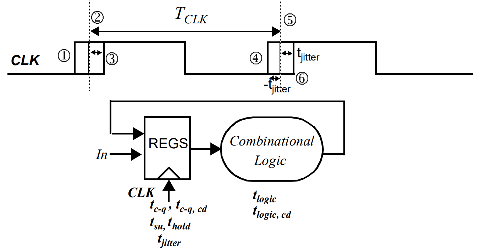
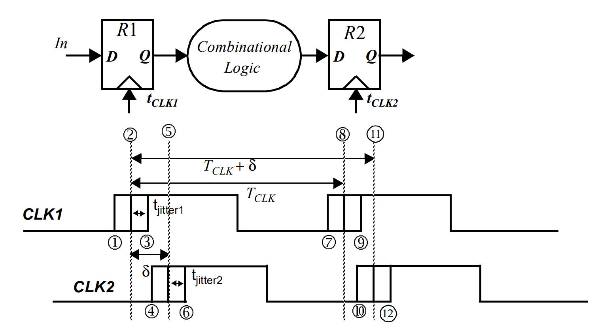
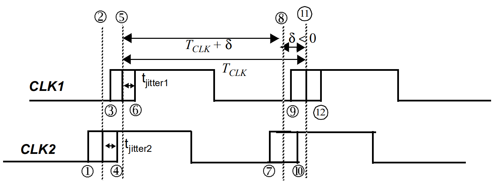

# Timing Issues in Digital Circuits

## Classification of Digital Systems

In digital systems, signals can be classified depending on how they are related to a local clock.

1. Signals that transition only at predetermined periods in time can be classified as synchronous, mesochronous, or plesiochronous with respect to a system clock.
2. A signal that can transition at arbitrary times is considered asynchronous.

### Synchronous Interconnect

In digital systems, a **synchronous signal** is one that has the exact same [frequency](timing-issues-in-digital-circuits.md#whats-the-frequency-of-a-signal-that-is-not-a-clk-signal) and a known fixed phase offset with respect to the local clock. In such a timing methodology, the signal is “synchronized” with the clock, and the data can be sampled directly without any uncertainty. In digital logic design, synchronous systems are the most straightforward type of interconnect, where the flow of data in a circuit proceeds in lockstep with the system clock as shown below.

<figure><figcaption></figcaption></figure>

Here, the input data signal `In` is sampled with register R1 to give signal Cin, which is synchronous with the system clock and then passed along to the combinational logic block. After a [suitable setting period](#user-content-fn-1)[^1], the output Cout becomes valid and can be sampled by R2 which synchronizes the output with the clock. In a sense, the "certainty period" of signal Cout, or the period where data is valid is synchronized with the system clock, which allows register R2 to sample the data with complete confidence. The length of the “uncertainty period,” or the period where data is not valid, places an _upper bound on how fast a synchronous interconnect system can be clocked_.

In short, in digital logic, **synchronization** turns "random arrival" into "scheduled arrival".

1. The input `In` might arrive at any random time. It is "asynchronous." However, once `In` goes into R1, the output Cin is now synchronized. Cin is _only_ allowed to change its value immediately after the rising edge of the `CLK`.
2. However, there is another problem, which is with the _combination logic_ in between. When Cin changes, the logic gates inside take time to calculate. During this calculation, the signal Cout might glitch, toggle randomly, or be invalid for a few nanoseconds. This is the "uncertainty." To solve this problem, we use "synchronization"
   1. The system ignores everything happening in the middle of the clock cycle (the messy part).
   2. R2 is trained to only look at the data at the _very end_ of the cycle (the next clock edge).
   3. By that time, the "messy" calculation must be finished, and the data must be stable ("valid").
3. So, when we say a signal is synchronized, we are effectively saying: "I guarantee that this signal will be stable and valid setuptime before the next clock edge arrives." This also explains why the data can be sampled directly without any uncertainty if the timing constraint it met.

What's the frequency of a signal that is not a CLK signal?

In the context of that definition, the "frequency of the signal" actually refers to the **frequency of the clock domain that generates/launches that signal.**

For example, if you have a signal called `valid_flag`. And `valid_flag` is output by a register triggered by a 100 MHz clock. Then, for the purpose of synchronization and timing analysis, `valid_flag` is considered a 100 MHz signal.

## Synchronous Design — An In-depth Perspective

### Synchronous Timing Basic

For a **positive edge-triggered system**, the **rising edge** of the **clock** is used to denote the beginning and completion of a **clock cycle**. In the ideal world, assuming the **clock paths** from a central distribution point to each **register** are perfectly balanced, the **phase** of the **clock** (i.e., the position of the **clock edge** relative to a reference) at various points in the system is going to be exactly equal. However, the **clock** is neither perfectly periodic nor perfectly simultaneous. This results in performance degradation and/or circuit malfunction. The following figure shows the basic structure of a **synchronous pipelined datapath**.

<figure><figcaption>
Pipelined Datapath Circuit and timing parameters
</figcaption></figure>

In the ideal scenario, the **clock** at **registers 1** and **2** have the same **clock period** and transition at the exact same time. The following **timing parameters** characterize the **timing** of the **sequential circuit**.

* The **contamination (minimum) delay** tc-q,cd, and **maximum propagation delay** of the register tc-q.
* The **set-up** (tsu) and **hold time** (thold) for the registers.
* The **contamination delay** tlogic,cd and **maximum delay** tlogic of the **combinational logic**.
* tclk1 and tclk2, corresponding to the position of the **rising edge** of the **clock** relative to a global reference.

Under ideal conditions (tclk1 = tclk2), the **worst case propagation delays** determine the **minimum clock period** required for this **sequential circuit**. The period must be long enough for the data to propagate through the **registers** and **logic** and be set-up at the destination **register** before the next **rising edge** of the **clock**. This constraint is given by (as derived in [designing-sequential-logic-circuits.md](designing-sequential-logic-circuits.md "mention")):

$$
T\geq t_{\text{c-q}}+t_{\text{plogic}}+t_{\text{su}}\tag{10.1}
$$

At the same time, the **hold time** of the destination **register** must be shorter than the **minimum propagation delay** through the **logic network**, so that the new data won't affect the old data in register 2.

$$
t_{\text{hold}}<t_{\text{(c-q, cd)}}+t_{\text{(logic, cd)}} \tag{10.2}
$$

The above analysis is simplistic since the **clock** is never ideal. As a result of **process** and **environmental variations**, the **clock signal** can have **spatial** and **temporal variations**.

#### Clock Skew

The **spatial variation** in arrival time of a **clock transition** on an integrated circuit is commonly referred to as **clock skew**. The **clock skew** between two points i and j on an IC is given by $$\delta(i, j)=t_i-t_j$$, where ti and tj are the position of the rising edge of the clock **with respect to a reference**.


$$\delta$$, ti and tj are all scalars! Treat them just as a signed number!


Consider the transfer of data between registers R1 and R2 in **Figure 10.5**. The **clock skew** can be **positive or negative** depending upon the routing direction and position of the **clock source**. The **timing diagram** for the case with **positive skew** is shown in **Figure 10.6**. As the figure illustrates, the **rising clock edge** is delayed by a positive $$\delta$$ at the second register.

<figure><figcaption>
<strong>Figure 10.6</strong> Timing diagram to study the impact of clock skew on performance and functionality. In this sample timing diagram, \delta>0
</figcaption></figure>

**Clock skew** is caused by static path-length mismatches in the **clock** load and by definition **skew** is constant from cycle to cycle. That is, if in one cycle **CLK****2** lagged **CLK****1** by $$\delta$$, then on the next cycle it will lag it by the same amount.


It is important to note that **clock skew** does not result in **clock period** variation, but rather **phase shift**.


**Skew** has strong implications on **performance** and **functionality** of a **sequential system**. In the following part, we will see how **positive** and **negative skew** will affect the **performance** and **functionality** of a sequential system.


Performance depends on the **setup time constraint** and functionality depends on the **hold time constraint**.




#### Positive Skew ($$\delta>0$$)

First consider the impact of **positive clock skew** on **performance**. From **Figure 10.6**, a new input **In** sampled by R1 at edge <i class="fa-circle-1">:circle-1:</i> will propagate through the **combinational logic** and be sampled by R2 on edge <i class="fa-circle-4">:circle-4:</i>. If the **clock skew** is positive, the time available for signal to propagate from R1 to R2 is **increased** by the skew $$\delta$$. Thus, our **effective allowable computing range** will be (TCLK + $$\delta$$). The output of the **combinational logic** must be valid one **set-up time** before the **rising edge** of **CLK****2** (point <i class="fa-circle-4">:circle-4:</i>). The constraint on the **minimum clock period** can then be derived as:

$$
T + \delta \geq t_{c-q} + t_{logic} + t_{su} \quad \text{or} \quad T \geq t_{c-q} + t_{logic} + t_{su} - \delta \tag{10.3}
$$

The above equation suggests that **clock skew** actually has the potential to improve the **performance** of the circuit. That is, the **minimum clock period** required to operate the circuit reliably reduces with increasing **clock skew**! This is indeed correct, but unfortunately, increasing **skew** makes the circuit more susceptible to **race conditions** and may harm the correct operation (functionality) of **sequential systems**.

As above, assume that input **In** is sampled on the **rising edge** of **CLK****1** at edge <i class="fa-circle-1">:circle-1:</i> into R1. The new values at the output of R1 propagates through the **combinational logic** and should be valid before edge <i class="fa-circle-2">:circle-2:</i> at CLK2. However, if the **minimum delay** of the **combinational logic** block is small, the inputs to R2 may change before the **clock edge**, resulting in incorrect evaluation. To avoid **races**, we must ensure that the **minimum propagation delay** through the **register** and **logic** must be long enough such that the inputs to R2 are valid for a **hold time** after edge <i class="fa-circle-2">:circle-2:</i>. Thus, our **effective hold range** will be (thold + $$\delta$$)The constraint can be formally stated as

$$
\begin{gathered}
\delta + t_{hold} < t_{(c-q, \, cd)} + t_{(logic, \, cd)} \\
\text{or} \\
\delta < t_{(c-q, \, cd)} + t_{(logic, \, cd)} - t_{hold}
\end{gathered}
\tag{10.4}
$$



#### Negative Skew ($$\delta<0$$)

Figure 10.7 shows the timing diagram for the case when $$\delta<0$$.

<figure><figcaption>
<strong>Figure 10.7</strong> Timing diagram to study the impact of clock skew on performance and functionality. In this sample timing diagram, \delta&#x3C;0
</figcaption></figure>

For its impact on performance, the **rising edge** of CLK2 happens before the **rising edge** of **CLK1**. On the **rising edge** of CLK1, a new input is sampled by R1. The new sampled data propagates through the **combinational logic** and is sampled by R2 on the **rising edge** of CLK2, which corresponds to edge <i class="fa-circle-2">:circle-2:</i>. As can be seen from **Figure 10.7** and Eq. (10.3), a **negative skew** directly impacts the **performance** of **sequential system**, making the **minimum clock period** for the system to be larger.

However, a **negative skew** implies that the system never fails, since edge <i class="fa-circle-2">:circle-2:</i> happens before edge <i class="fa-circle-1">:circle-1:</i>! This can also be seen from Eq. (10.4), which is always satisfied since $$\delta<0$$. This is because in an ideal clock situation, we have Eq. (10.2), which is

$$
t_{\text{hold}}<t_{\text{(c-q, cd)}}+t_{\text{(logic, cd)}}
$$

And in this case, our $$\delta<0$$, which means adding a negative to the L.H.S of the inequality above will make it always hold!


In whichever case, the newly derived two time constraints (setup and hold) are the same for both positive and negative skew. Recall that we treat $$\delta$$ as a **scalar**! So the equation doesn't change, it's just the value of $$\delta$$ might change!




Example scenarios for positive and negative clock skew are shown in Figure 10.8.

<figure><figcaption>
<strong>Figure 10.8</strong> Positive and egative clock skew
</figcaption></figure>



#### Positive Skew ($$\delta>0$$)

This corresponds to a clock routed in the **same direction** **as the flow of the data** through the pipeline (Figure 10.8a). In this case, the **skew** has to be strictly controlled and satisfy Eq. (10.4). If this constraint is not met, the circuit does malfunction independent of the **clock period**.Reducing the **clock frequency** of an **edge-triggered circuit** does not help get around **skew** problems!

On the other hand, **positive skew** increases the **throughput** of the circuit as expressed by Eq. (10.3), because the **clock period** can be shortened by $$\delta$$. The extent of this improvement is limited as large values of $$\delta$$ soon provoke violations of Eq. (10.4).



#### Negative Skew ($$\delta<0$$)

When the clock is routed in the **opposite direction of the data** (Figure 10.8b), the **skew** is **negative** and condition (10.4) is unconditionally met.

The circuit operates correctly independent of the **skew**. The **skew** reduces the time available for actual computation so that the **clock period** has to be increased by $$\left|\delta\right|$$. In summary, routing the clock in the **opposite direction** of the data avoids disasters but hampers the circuit **performance**.



Unfortunately, since a general **logic circuit** can have data flowing in **both direction**s (for example, circuits with **feedback**), this solution to eliminate **races** will not always work (**Figure 10.9**).

<figure><figcaption>
<strong>Figure 10.9</strong> Datapath structure with feedback
</figcaption></figure>

The **skew** can assume both **positive** and **negative** values depending on the direction of the **data transfer**. Under these circumstances, the designer has to account for the **worst-case skew** condition. In general, routing the **clock** so that only **negative skew** occurs is not feasible. Therefore, the design of a **low-skew clock network** is essential.

<strong>Example</strong>: <strong>Propagation and Contamination Delay Estimation</strong>


This is a very classic question!


Consider the logic network shown in Figure 10.10. Determine the propagation and contamination delay of the network, assuming that the worst case gate delay is tgate. The maximum and minimum delays of the gates is made, as they are assumed to be identical.

<figure><figcaption>
<strong>Figure 10.10</strong> Logic network for computation of performance
</figcaption></figure>

**Sol:** The **contamination delay** is given by **2 t****gate** (the delay through **OR****1** and **OR****2**). On the other hand, computation of the **worst case propagation delay** is not as simple as it appears. At first glance, it would appear that the **worst case** corresponds to path <i class="fa-circle-1">:circle-1:</i> and the delay is **5 t****gate**. However, when analyzing the data dependencies, it becomes obvious that path <i class="fa-circle-1">:circle-1:</i> is **never exercised**. Path <i class="fa-circle-1">:circle-1:</i> is called a **false path**.

1. If **A = 1**, the **critical path** goes through **OR****1** and **OR****2**.
2. If **A = 0** and **B = 0**, the **critical path** is through **I****1**, **OR****1** and **OR****2** (corresponding to a delay of **3 t****gate**).
3. For the case when **A = 0** and **B = 1**, the **critical path** is through **I****1**, **OR****1**, **AND****3** and **OR****2**. OR1 will output 0 to OR2, but 0 is a "non-controlling" value for an OR gate, so OR2 needs to wait for the output from AND3.

In other words, for this simple (but contrived) **logic circuit**, the output does not even depend on inputs **C** and **D** (that is, there is redundancy). Therefore, the **propagation delay** is **4 t****gate**. Given the **propagation** and **contamination delay**, the **minimum** and **maximum allowable skew** can be easily computed.

In this problem, we also see a very familiar concept — [**short circuiting**](https://wenbo-notes.gitbook.io/cs1010-notes/lec-tut-lab-exes/lecture/lec-04-conditionals#short-circuiting) (NUS CS1010 Knowledge comes back)! We now rephrase it using the concept of controlling value. A gate has a **controlling value** if one input alone can determine the output regardless of other inputs:

* **OR Gate**: Controlling value is 1. (If any input is 1, output is 1).
* **AND Gate**: Controlling value is 0. (If any input is 0, output is 0).

If one of the inputs of a gate is a noncontrolling value, the gate needs to wait for the other input.


The computation of the **worst-case propagation delay** for **combinational logic**, due to the existence of **false paths**, **cannot** be obtained by simply adding the **propagation delay** of individual **logic gates**. The **critical path** is strongly dependent on **circuit topology** and **data dependencies**.


#### Clock Jitter

**Clock jitter** refers to the **temporal variation** of the **clock period** at a given point —  that is, the **clock period** can reduce or expand on a **cycle-by-cycle** basis. It is strictly a **temporal uncertainty** measure and is often specified at a given point on the chip. **Jitter** can be measured and cited in one of many ways.

* **Absolute jitter** (tjitter) refers to the worst-case variation (absolute value) of a clock edge at a given location relative to the edge of an ideal periodic reference clock.
* **Cycle-to-cycle jitter** (Tjitter) refers to time varying deviation of a single **clock period** and for a given spatial location i is given as $$T^i_{\text{jitter}}(n)=t^i_{\text{clk, n+1}}-t^i_{\text{clk, n}}-T_{\text{CLK}}$$, where $$t^i_{\text{clk, n+1}}$$ is the **clock period** for period (n+1), $$t^i_{\text{clk, n}}$$ is **clock period** for period n, and TCLK is the **nominal clock period**.

In the worst-case scenario, the value of **cycle-to-cycle jitter** is equal to twice the **absolute jitter** (2tjitter).

**Jitter** directly impacts the **performance** of a **sequential system**. **Figure 10.11** shows the **nominal clock period** as well as variation in period. Ideally the **clock period** starts at edge <i class="fa-circle-2">:circle-2:</i> and ends at edge <i class="fa-circle-5">:circle-5:</i> and with a **nominal clock period** of TCLK. However, as a result of **jitter**, the **worst case** scenario happens when the **leading edge** of the **current** clock period is **delayed** (edge <i class="fa-circle-3">:circle-3:</i>), and the **leading** edge of the **next** clock period occurs **early** (edge <i class="fa-circle-5">:circle-5:</i>). As a result, the total time available to complete the operation is reduced by **2t****jitter** in the **worst case** and is given by,

$$
T_{\text{CLK}} - 2t_{\text{jitter}} \geq t_{\text{c-q}} + t_{\text{logic}} + t_{\text{su}} \quad \text{or} \quad T \geq t_{\text{c-q}} + t_{\text{logic}} + t_{\text{su}} + 2t_{\text{jitter}} \tag{10.5}
$$

<figure><figcaption>
<strong>Figure 10.11</strong> Circuit for studying the impact of jitter on performance
</figcaption></figure>


Worst case is to make the total time available **smaller** so that the TCLK has to become larger to compensate the effect casued by tjitter.


#### Impace of Skew and Jitter on Performance

In this section, the **combined impact** of **skew** and **jitter** is studied with respect to **conventional edge-triggered clocking**. Consider the **sequential circuit** shown in **Figure 10.12**.

<figure><figcaption>
<strong>Figure 10.12 Sequential circuit</strong> to study the impact of <strong>skew</strong> and <strong>jitter</strong> on <strong>edge-triggered systems</strong>. In this example, a <strong>positive skew</strong> (\delta) is assumed.
</figcaption></figure>

Assume that nominally ideal clocks are distributed to both registers (the **clock period** is identical every cycle and the **skew** is 0). In reality, there is static **skew** $$\delta$$ between the two **clock signals** (assume that $$\delta>0$$). Assume that **CLK****1** has a **jitter** of **t****jitter1** and **CLK****2** has a **jitter** of **t****jitter2**.&#x20;



#### Performance Analysis

To determine the constraint on the **minimum clock period**, we must look at the minimum available time to perform the required computation. The **worst case** happens when the leading edge of the current **clock period** on **CLK****1** happens late (edge <i class="fa-circle-3">:circle-3:</i>) and the leading edge of the next cycle of **CLK****2** happens early (edge 10). This results in the following constraint

$$
T_{\text{CLK}} + \delta - t_{\text{jitter}1} - t_{\text{jitter}2} \geq t_{\text{c-q}} + t_{\text{logic}} + t_{\text{su}} 
\\ \text{or} \quad T \geq t_{\text{c-q}} + t_{\text{logic}} + t_{\text{su}} - \delta + t_{\text{jitter}1} + t_{\text{jitter}2} \tag{10.6}
$$

As the above equation illustrates, while **positive skew** can provide potential **performance** advantage, **jitter** has a **negative impact** on the **minimum clock period**.



#### Functionality Analysis

To formulate the **minimum delay constraint**, consider the case when the leading edge of the **CLK****1** cycle arrives early (edge <i class="fa-circle-1">:circle-1:</i>) and the leading edge of the current cycle of **CLK****2** arrives late (edge <i class="fa-circle-6">:circle-6:</i>). The separation between edge <i class="fa-circle-1">:circle-1:</i> and <i class="fa-circle-6">:circle-6:</i> should be smaller than the **minimum delay** through the network. This results in,

$$
\delta + t_{\text{hold}} + t_{\text{jitter}1} + t_{\text{jitter}2} < t_{(\text{c-q, cd})} + t_{(\text{logic, cd})} \\
\text{or} \\
\delta < t_{(\text{c-q, cd})} + t_{(\text{logic, cd})} - t_{\text{hold}} - t_{\text{jitter}1} - t_{\text{jitter}2} \tag{10.7}
$$

The above relation indicates that the **acceptable skew** is reduced by the **jitter** of the two signals.



Now consider the case when the **skew** is **negative** ($$\delta<0$$) as shown in **Figure 10.13**. For the timing shown, $$\left|\delta\right|>t_{\text{jitter2}}$$. It can be easily verified that the **worst case** timing is exactly the same as the previous analysis, with $$\delta$$ taking a **negative** value. That is, **negative skew** reduces **performance**.

<figure><figcaption>
<strong>Figure 10.13</strong> Consider a negative clock skew (\delta) and the skew is assumed to be larger than the jitter.
</figcaption></figure>



#### Performance Analysis

T



###




[^1]: This is the **propagation delay**!
