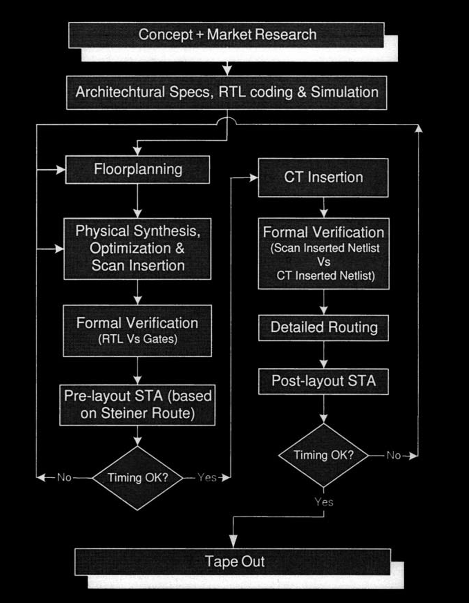

# Physical Compiler Flow

With shrinking [semiconductor geometries](#user-content-fn-1)[^1], synthesis results based on wireload models are getting too inaccurate and unpredictable. **Physical Compiler**, a new tool from Synopsys, bypasses this issue by i**ntegrating synthesis and placement** within one common engine, thus avoiding the delay computation based on wire-load models.

The basic Physical Compiler design flow contains the steps outlined below.

1. **Design environment setting**. This includes both the **technology library** and the **physical library** to be used, along with other environmental attributes.
2. **Floorplan** the design.
3. **Constrain, synthesize (with scan insertion)** and generate **placement** of the design using **Physical Compiler**.
4. **Pre-layout static timing analysis** using **PrimeTime** (delay numbers based on placement rather than wire-load models).
5. **Formal verification** of the design.
6. **RTL against the synthesized netlist**, using **Formality**.
7. Port the **netlist** and the **placement information** over to the **layout tool**.
8. Insert **clock tree** in the design using the layout tool.
9. **Formal verification** between clock tree inserted netlist and the original scan inserted netlist.
10. Perform **detailed routing** using the layout tool.
11. Extract **real timing delays** from the detailed routed design.
12. **Back-annotate** the real extracted data to **PrimeTime**.
13. **Post-layout static timing analysis** using **PrimeTime**.
14. **Functional gate-level simulation** of the design with post-layout timing (if desired). **Tape out** after **LVS** and **DRC** verification.

Figure 1-4 illustrates the flow chart relating to the design flow described above.

<figure><figcaption>
Figure 1-4 Physical Compiler Flow
</figcaption></figure>

## Physical Synthesis

Traditionally synthesis methods are based on using the **wire-load models**. The basic nature of the wire-load models is such that they are fanout based. In other words, the delay computation of cells is performed based on the number of fanouts a cell drives. While this method was ideal for larger geometries (>0.35um), it is not suitable for smaller geometries. The **resistance of wires** is dominating the cell delays causing the fanout based delay computation to be unreliable and totally unpredictable.

The concept of **physical synthesis** was recently introduced by Synopsys in the form of **Physical Compiler** (henceforth, called PhyC) as a solution to the above problem.


The previous capability of DC is retained and the PhyC enhancements have been added on top of DC thus making PhyC a superset of DC.


PhyC does not use the wire-load models; instead the delay computation is based on the **placement** rather than fanout. In other words, the synthesis and optimization is based on the placement of cells. Figure 1-4 illustrates this approach in a very generic form.

### Physical Compiler Modes

PhyC can be used in two modes:

1. RTL-to-placed-gates (rtl2pg), or
2. Gates-to-placed-gates (g2pg)

#### RTL to Placed Gates

In this mode, the **input** to PhyC is

1. the RTL,
2. the floorplan information,
3. along with the necessary setup to include logical and physical libraries.

The **output** produced by PhyC is a **structural netlist** and the placed gates information in PDEF3.0 format.

#### Gates to Placed Gates

This mode of g2pg is provided for optimizing an **existing gate level netlist** based on the **floorplan** information. In this case, instead of the RTL, the input to PhyC is the gate level netlist.

[^1]: An example is the technology node used in the desig, like 28nm, 14nm, 7nm etc.
