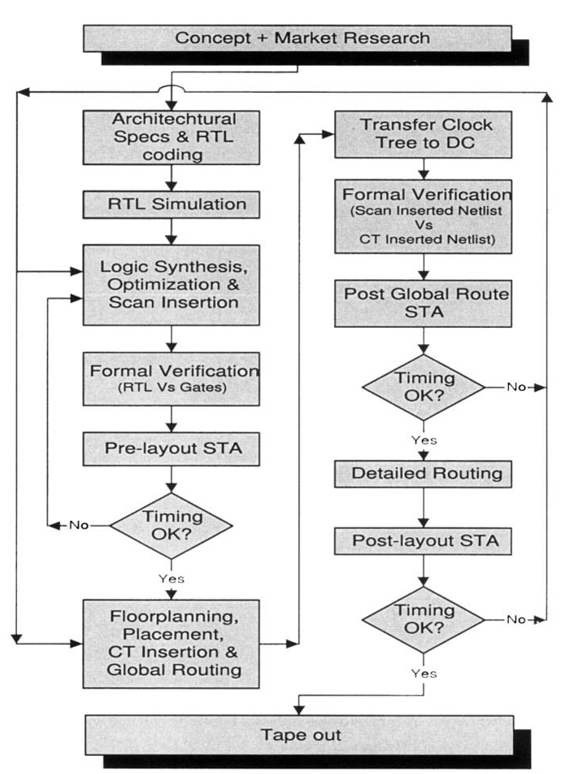

# Traditional Design Flow

The traditional ASIC design flow contains the steps outlined below:

1. **Architectural and electrical specification**
2. **RTL coding in HDL**
3. **DFT memory BIST insertion**, for designs containing memory elements
4. **Exhaustive dynamic simulation** of the design, in order to verify the functionality of the design
5. **Design environment setting.** This includes the **technology library** to be used, along with other environmental attributes
6. **Constraining and synthesizing** the design with **scan insertion** (and optional **JTAG**) using **Design Compiler**
7. Block level **static timing analysis**, using **Design Compiler’s built-in static timing analysis engine**
8. **Formal verification** of the design. RTL compared against the synthesized netlist, using **Formality**
9. Pre-layout **static timing analysis** on the full design through **PrimeTime**
10. Forward annotation of **timing constraints** to the layout tool
11. Initial **floorplanning** with **timing driven placement** of cells, **clock tree insertion** and **global routing**
12. Transfer of **clock tree** to the original design (netlist) residing in **Design Compiler**
13. **In-place optimization** of the design in **Design Compiler**
14. **Formal verification** between the synthesized netlist and clock tree inserted netlist, using **Formality**
15. Extraction of **estimated timing delays** from the layout after the **global routing** step (step 11)
16. Back annotation of **estimated timing data** from the global routed design, to **PrimeTime**
17. **Static timing analysis** in **PrimeTime**, using the estimated delays extracted after performing global route
18. **Detailed routing** of the design
19. Extraction of **real timing delays** from the detailed routed design
20. Back annotation of the **real extracted timing data** to **PrimeTime**
21. Post-layout **static timing analysis** using **PrimeTime**
22. Functional **gate-level simulation** of the design with post-layout timing (if desired)
23. **Tape out** after **LVS** and **DRC verification**

Figure 1-1, graphically illustrates the typical ASIC design flow discussed above.

<figure><picture><source srcset="../../.gitbook/assets/traditional-asic-design-flow-dark.png" media="(prefers-color-scheme: dark)"></picture><figcaption>
Figure 1-1 Traditional ASIC Design Flow
</figcaption></figure>


The acronyms STA and CT represent static timing analysis and clock tree respectively. DC represents Design Compiler.

