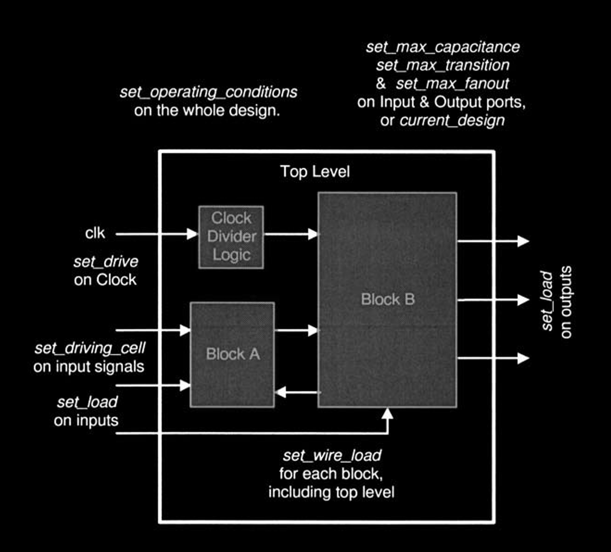
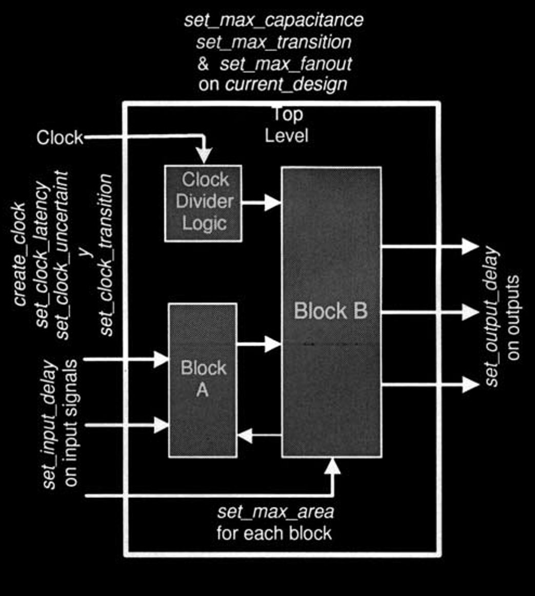

# Environment and Constraints

In order to obtain optimum results from DC, designers have to methodically **constrain** their designs by describing

* the design environment,
* target objectives and
* design rules.

The **constraints** may contain **timing** and/or **area** information, usually derived from design specifications. DC uses these constraints to perform synthesis and tries to optimize the design with the aim of meeting target objectives.

## Design Environment

> Up until now, the assumption has been that the design has been partitioned, coded and simulated. In other words, we are doing with the RTL coding.

The next step is to describe the **design environment**. This procedure entails defining for the design, the process parameters, I/O port attributes, and statistical wire load models. Figure 6-1 illustrates the essential DC commands used to describe the design environment.

<figure><figcaption></figcaption></figure>

### `set_min_library`

The command allows users to simultaneously specify the **worst-case** and the **best-case** libraries. This may be useful during initial compiles, preventing DC from violating the setup-time violations while fixing the hold-time violations.


```tcl
set_min_library <max library filename> –min_version <min library filename>
```


For example,


```tcl
set_min_library "ex25_worst.db" –min_version "ex25_best.db"
```



#### Helpful Ideas

The above command may be used for fixing **hold-time** violations during incremental compile or for in place optimization. In this case, the user should set both minimum and maximum values for the operating conditions.


### `set_operating_conditions`

This command describes the process, voltage, and temperature conditions of the design.


The Synopsys library contains the description of these conditions, usually described as WORST, TYPICAL and BEST case. The names of operating conditions are library dependent. Users should check with their library vendor for correct setting.


By changing the value of the operating condition command, full ranges of process variations are covered.

* The WORST case operating condition is generally used during pre-layout synthesis phase, thereby optimizing the design for maximum setup-time.
* The BEST case condition is commonly used to fix the hold-time violations.
* The TYPICAL case is mostly ignored, since analysis at WORST and BEST case also covers the TYPICAL case.


```tcl
set_operating_conditions <name of operating conditions>
```


For example,


```tcl
set_operating_conditions WORST
```



#### Helpful Ideas

It is possible to optimize the design both with the WORST and the BEST case, simultaneously. The optimization is achieved by using the `-min` and `-max` options in the above command, as illustrated below. This is very useful for fixing the design for possible hold-time violations.


```tcl
set_operating_conditions -min BEST -max WORST
```



### `set_wire_load_model`

This command is used to provide estimated statistical wire-load information to DC, which in turn, uses the wire-load information to model net delays as a function of loading.


Generally, a number of wire-load models are present in the Synopsys technology library, each representing a particular size block. In addition, designers may also choose to create their own custom wire-load models to accurately model the net loading of their blocks.



```tcl
set_wire_load_model -name <wire-load model>
```


For example,


```tcl
 set_wire_load_model -name MEDIUM
```


### `set_wire_load_mode`

This command defines the three modes associated for modeling wire loads. These are top, enclosed, and segmented.


Generally, only the first two modes are in common use. The segmented wire load mode is not prevalent, since it relies on the wire-load models that are specific to the net segments.



```tcl
set_wire_load_mode < top | enclosed | segmented >
```


For example,


```tcl
set_wire_load_mode top
```



#### Helpful Ideas

It is extremely important that designers accurately model the wire loads of their design. Too optimistic or too pessimistic wire-load models result in increased synthesis iterations, in an effort to achieve timing convergence after post-layout. In general, during the prelayout phase, **slightly pessimistic wire-load models are used**. This is done to provide extra timing margin that may get absorbed, by the routed design.


#### `top` mode

The mode `top` defines that all nets in the hierarchy will inherit the **same** wireload model as the top-level block. One may choose to use this wire-load model for sub-blocks, if planning to flatten them later for layout. This mode may also be chosen, if the user is synthesizing the design using the bottomup compile method.

#### `enclosed` mode

The second mode, `enclosed` specifies that all nets (of the sub-blocks) will inherit the wire load model of the block that completely encloses the subblocks.

For example, if the designer is synthesizing sub-blocks B and C that are completely enveloped by block A (which in turn is completely enclosed by the top-level), then sub-blocks B and C will inherit the wire-load models defined for block A.

#### `segmented` mode

The last mode, `segmented` is used for wires crossing hierarchical boundaries. In the above example, sub-blocks B and C will inherit the wireload models specific to them, while the nets between sub-block B and C (but, within block A) will inherit the wire-load model specified for block A.

### `set_drive` and `set_driving_cell`

These commands are used at the **input** ports of the block.

#### `set_drive` command

`set_drive` command is used to specify the **drive strength** at the input port. It is typically used to model the external drive resistance to the ports of the block or chip.


The value of 0 signifies highest drive strength and is commonly utilized for **clock** ports.



```tcl
set_drive <value> <object list>
```


For example,


```tcl
set_drive 0 {CLK RST}
```


#### `set_drive_cell` command

Conversely, `set_driving_cell` is used to model the **drive resistance** of the driving cell to the **input** ports. This command takes the name of the driving cell as its argument and applies all design rule constraints of the driving cell to the input ports of the block.


```tcl
set_driving_cell -cell <cell name> -pin <pin name> <object list>
```


For example,


```tcl
set_driving_cell -cell BUFF1 -pin X [all_inputs]
```


### `set_load`

This command sets the **capacitive load** in the units defined in the technology library (usually pico farads, or pf), to the specified nets or ports of the design. It typically sets capacitive loading on **output** ports of the blocks during pre-layout synthesis, and on nets, for back-annotating the extracted post-layout capacitive information.


```tcl
set_load <value> <object list>
```


For example


```tcl
set_load 1.5 [all_outputs]
set_load 0.3 [get_nets blockA/n1234]
```


### Design Rule Constraints

**Design Rule Constraints** or DRCs consist of `set_max_transition`, `set_max_fanout` and `set_max_capacitance` commands. These rules are generally set in the technology library and are determined by the process parameters. These rules should not be violated in order to achieve working silicon.

The DRC commands can be applied to **input** ports, **output** ports or on the `current_design`. Furthermore, if the value set in the technology library is not adequate or is too optimistic, then these commands may also be used at the command line, to control the buffering in the design.


```tcl
set_max_transition <value> <object list>
set_max_capacitance <value> <object list>
set_max_fanout <value> <object list>
```


For example,


```tcl
set_max_transition 0.3 current_design
set_max_capacitance 1.5 [get_ports out1]
set_max_fanout 3.0 [all_outputs]
```


## Design Constraints

**Design constraints** describe the **goals** for the design. They may consist of **timing** or **area** constraints. Depending on how the design is constrained, DC tries to meet the set objectives. The basic commands to constrain a design are shown in Figure 6-2.

<figure><figcaption><p>Figure 6-2. Design Constraints for Synthesis</p></figcaption></figure>

### `creat_clock`

The `create-clock` command is used to define a clock object with a **particular period** and **waveform**.

* The `-period` option defines the **clock period**, while
* the `-waveform` option controls the **duty cycle** and the starting edge of the clock.

This command is applied to a pin or port, object types. For example,


```tcl
create_clock–period 40 –waveform [list 0 20] CLK
```


The example above specifies that the port named `CLK` is of type "clock" that has a period of 40ns, with 50% duty cycle. The positive edge of the clock starts at time, 0 ns, with the falling edge occurring at 20 ns. By changing the falling edge value, the duty cycle of the clock may be altered.

### `create_generated_clock`

The `create_generated_clock` is used to describe **frequency divided/multiplied** clocks as a function of the **primary clock**.


```tcl
create_generated_clock -name <clock_name> \
                       -source <clock_source> \
                       -divide_by <factor> | -multiply_by <factor>
                       ...
```


### `set_dont_touch_network`

This command is used to set a `dout_touch` property on a port, or on the net.


Note setting this property will also prevent DC from buffering the net, in order to meet DRCs.


For example,


```tcl
set_dont_touch_network {CLK, RST}
```


### `set_dont_touch`

This command is used to set a `dont_touch` property on the `current_design`, cells, references or nets. It can also be used for preventing DC from inferring certain types of cells present in the technology library.


```tcl
set_dont_touch current_design
set_dont_touch [get_cells sub1]
set_dont_touch [get_nets gated_rst]
```



#### Helpful Ideas

For example, this command may be used on the block containing spare gates. The command will then instruct DC not to disturb (or optimize) the instantiation of the spare gates block.


### `set_dont_use`

This command is generally set in the `.synopsys_dc.setup` environment file. The command is instrumental in **eliminating certain types of cells** from the **technology library** that the user would not want DC to infer.

For instance, by using the above command, you can filter out the flip-flops in your technology library whose name start with "SDFF" or "RSFF" as illustrated below.


```tcl
set_dont_use [list mylib/SDFF* mylib/RSFF*]
```

