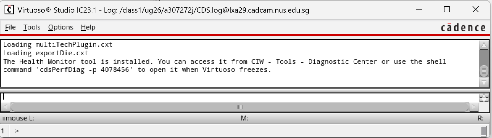
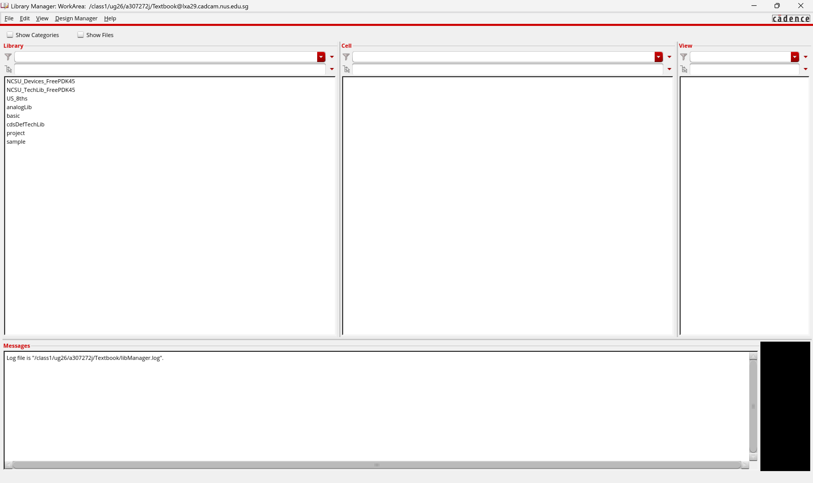

# Cadence DFII and ICFB

**Cadence** CAD software is generally The custom design targeted at the design of electrical circuits, both digital and analog, and extending from extremely low-level VLSI design to the design of circuit boards for large systems. This book is primarily interested in digital integrated circuit (IC) design so we’ll look primarily at those tools from the **Cadence suite**.

## Cadence Design Framework

Many of the digital IC design tools from Cadence are grouped under a framework called **Design Framework II** (_DFII_). The _DFII_ environment integrates a variety of design activities including

* schematic capture (_Composer_),
* simulation (_Verilog-XL_ or _NC\_Verilog_),
* layout design (_Virtuoso_ and _Virtuoso-XL_)
* design rule checking (DRC) (_Diva_ and _Assura_),
* layout versus schematic checking (LVS) (_Diva_ and _Assura_), and
* abstract generation for standard cell generation (_Abstract_).

These are all **individual programs** that perform a piece of the digital IC design process, but are all accessible (to a greater or lesser extent) through the _DFII_ framework and the _DFII_ user interface.


Note that many of these programs were developed by separate companies that have been acquired by Cadence and folded into the _DFII_ framework after that acquisition. Thus, some integrate better than others.


As we’ll see, though, there are some pieces of the Cadence tool flow that are not linked into the _DFII_ framework.

* Most notably place and route of standard cells with _SOC Encounter_,
* connection of large blocks with _ICC Chip Assembly Router_ (_ccar_) and
* Verilog synthesis with _RTL Compiler_

are done in separate programs with separate interfaces.

### Process Design Kit

Having the tool framework is only half the battle. We also need detailed technology information about the devices we want to use for our design. This detailed design information includes technology information about the IC process that we are using and libraries of transistors, gates, or larger modules that we can use to build our circuits. This information includes many files of detailed (and somewhat inscrutable) information, and does not come from Cadence.

This collection of design information is typically called a "**Cadence Design Kit**" (CDK) or "**Process Design Kit**" (PDK).


In EE4415, we will use

* Virtuoso by Cadence
* FreePDK45 by North Carolina State University


## Starting Cadence

In EE4415, follow the setup steps conducted during the hands-on workshop. After that, run the command `virtuoso &` to start the Cadence.


Even though Virtuoso is just one part of the cadence design framework II, after we run the command `virtuoso`, the whole cadence design framework II will be started!


### Command Interpreter Window

Once we start the Cadence, we will see two windows popped up. The first is the **Command Interpreter Window (CIW)** shown below.

<figure><figcaption></figcaption></figure>

The **CIW** is the main command interface for all the _DFII_ tools. Because most of the tools put their diagnostic log information into the **CIW**, we will refer back to it often.

### Library Manager

The second window popped up is the **Library Manager** shown below.

<figure><figcaption></figcaption></figure>

Inside the library manager, we will see three main big sections:

1. Library
2. Cell
3. View

The **Library Manager** is a general interface to all the libraries and cell views that we will use in _DFII_.

#### Library

A **library** is a collection of cells that are grouped together for some reason (for example being part of the same project or part of the same set of standard cells).


Think of libraries as **directories** that **collect design data together** for a specific design. We could throw all our stuff into one directory, but it would be easier to find and use if we separate different designs into different libraries.


We should see a bunch of libraries listed in the Library Manager.



#### NCSU\_TechLib\_xxx

These are **technology libraries** for each of the MOSIS processes. The "xxx" will be filled in with information about which MOSIS process is being described.



#### basic

This is the Cadence built-in library, which we won't use directly. It has basic components from which other parts are built.



#### cdsDefTechLib

A generic Cadence technology library that we won't use directly.



### Cell and View

**Cells** in _DFII_ are individual circuits that we want to design separately. In _DFII_ there is a notion of "cell view", which means that we can look at a cell in a number of different ways (in different **views**). For example, we might have

* a **schematic view** that shows the cell in terms of its components in a graphical schematic, or we might have
* a **Verilog** description of the cell as behavioral Verilog code.

Both of these cell views can exist at the same time and are just alternate ways of looking at the same cell. The **cell** **views** that we’ll eventually end up using in this tool flow are the following:



#### schematic

This view is a **graphical** schematic showing a cell as an interconnection of basic components, or as hierarchically defined components.



#### Symbol

This view is a **symbolic** view of the cell that can be used to place an **instance** of this cell in another schematic. This is the primary mechanism for generaing hierarchy in a schematic.



#### cmos\_sch

A **schematic** that consists of CMOS transistors.



#### behavioral

Verilog code that describes the bahavior of the cell.


