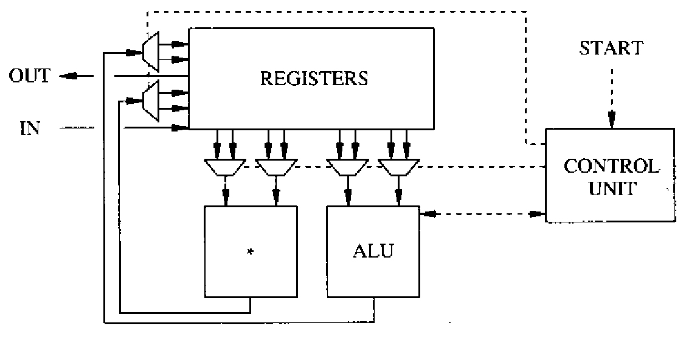

# Architectural Synthesis

This part focuses on the synthesis and optimization of circuits at the architectural level. It describes techniques for transforming an abstract behavioral model into a **data path** and a **control unit**.

* The data path consists of interconnected resources, while
* the control unit determines their execution timing and input/output operations according to a defined schedule.

**Architectural synthesis** is the process of constructing the **macroscopic structure** of a digital circuit from behavioral models, which can be represented using [data-flow or sequencing graphs](../hardware-modeling/abstract-models.md#data-flow-and-sequencing-graphs). The result of architectural synthesis includes:

* a structural description of the circuit, particularly its **data path**
* and a logic-level specification of its **control unit**.


We've seen this structure in the RISC-V processor design in [CG3207](https://app.gitbook.com/s/jTJFBPtKk6NwweAooH53/lec/lec-03-risc-v-isa-and-microarchitecture#risc-v-microarchitecture)!




#### Datapath

The data path consists of

1. **interconnected resources** that implement arithmetic or logic functions,
2. **steering logic** such as multiplexers and buses that route data to the correct destination at the appropriate time, and
3. **registers** or **memory arrays** for data storage.



#### Control Unit

The control unit includes

1. Mux selects
2. Functional unit activation/enable signals and operation selection signals (e.g., to specify whether ALU should do addition/subtraction, etc)
3. Register write enables, memory control signals

The control unit is usually a **FSM** of some sort. And the control unit has two types depending on how it is implemented:

* **Hardwired**: Implemented as an usual state machine.
* **Microprogrammed**: Implemented as a counter + ROM.



An example of such a macroscopic structure is the differential equation integrator shown in Figure 4.1.

<figure><picture><source srcset="../../.gitbook/assets/control-unit-datapath-dark.png" media="(prefers-color-scheme: dark)"></picture><figcaption>
Figure 4.1 Structural view of the differential equation integrator with one multiplier and one ALU
</figcaption></figure>


Basically, the architectural synthesis "converts" our behavioral model into RTL(HDL) code. This "conversion" can be done **manually** or **automatically**:

* If done **manually**, this is called **microarchitecture design**.
* If done **automatically**, this is called **High Level Synthesis (HLS)**.


Circuit implementations are evaluated based on several key metrics:

1. **area**,
2. **cycle time** (i.e., the clock period), and
3. **latency** (i.e., the number of cycles required to complete all operations).


For pipelined circuits, **throughput** (i.e., the rate at which computations are completed) is also an important performance metric.


The [**design space**](../introduction/computer-aided-synthesis-and-optimization.md#design-space), introduced in Chapter 1, is the set of all feasible structures that satisfy a given circuit specification. [**Pareto points**](../introduction/computer-aided-synthesis-and-optimization.md#pareto-point) are the design points that are not dominated by any other point across all objectives of interest.

**Architectural exploration** involves traversing this design space to identify a range of feasible, non-inferior solutions, from which the designer can select the preferred implementation. This exploration requires solving constrained optimization problems. **Architectural synthesis tools** assist by selecting an appropriate design point based on user-specified criteria and constructing the corresponding **data path** and **control unit**.

In this section, we first examine circuit modeling in greater detail, followed by architectural optimization for non-pipelined circuits, including **scheduling** and **resource sharing** techniques.


In this part, we will see how the [**back-end**](../hardware-modeling/compilation-and-behavioral-optimization.md) works!


> TODO: The architectural synthesis is basically to draw the anotated sequencing graph so that the scheduling and binding are done, and based on this information, we can do the data-path and control-unit synthesis manually, which will give us a structural view and state-transition diagram, and then we can write our own HDL code!
