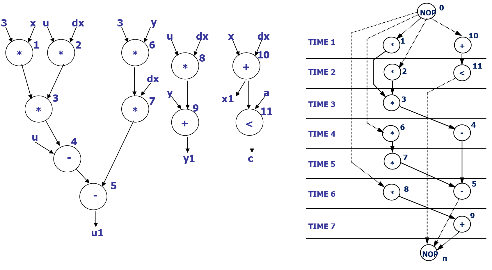
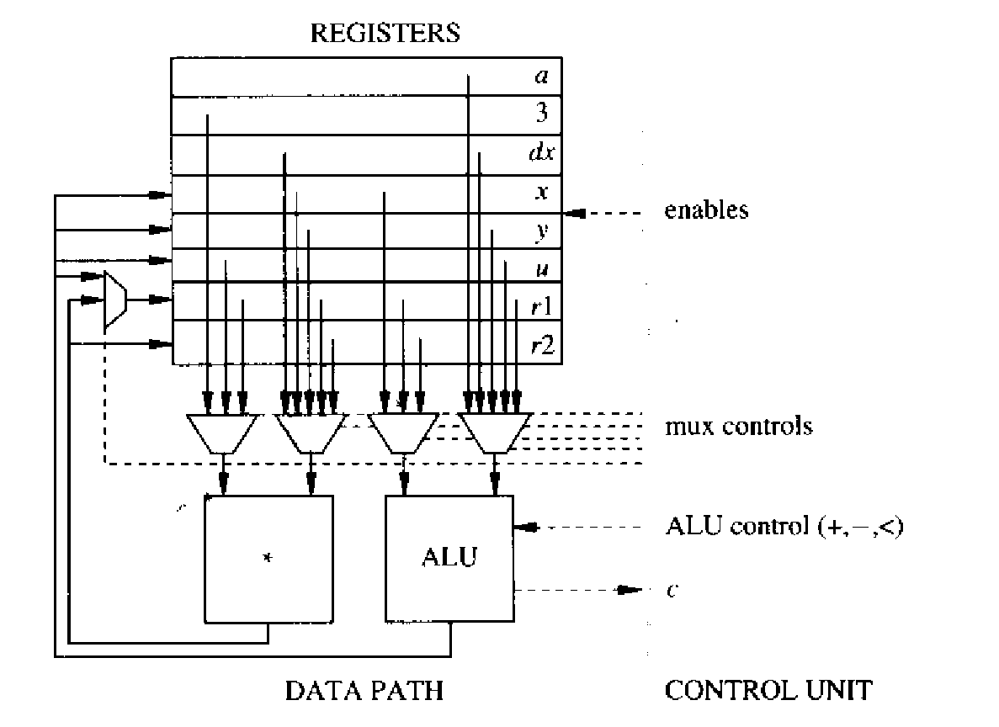

# Data-Path Synthesis

**Data-path synthesis** is a generic term that has often been **abused**. We distinguish here **data-path synthesis techniques** at the **physical level** from those at the **architectural level**.

* **Physical-level data-path synthesis** exploits the **regularity** of **data-path structures** and is specific to **data-path layout**.
* **Architectural-level data-path synthesis** involves the complete definition of the **structural view** of the **data path**, that is, refining the **binding information** into the specification of all **interconnections**.

To avoid confusion, we refer to this architectural-level task as **connectivity synthesis**.

## Connectivity Synthesis

**Data-path connectivity synthesis** consists of defining the **interconnections** among **resources**, **steering logic circuits** (**multiplexers** or **buses**), **memory resources** (**registers** and **memory arrays**), **input/output ports**, and the **control unit**. Therefore, a complete **binding** is required.

**Connectivity synthesis** refines the **binding information** by providing the detailed **interconnections** among the **blocks**. For example, the **inputs**, **outputs**, and **control signals** of the **multiplexers** must be specified and properly **connected**.

Example of Connectivity Synthesis (or Data-path Synthesis)

Suppose that we are doing the data-path synthesis for the collowing data flow and sequencing graph with complete scheduling and binding.

<figure><picture><source srcset="../../.gitbook/assets/data-path-synthesis-example-dark.png" media="(prefers-color-scheme: dark)"></picture><figcaption></figcaption></figure>

Here, we are using [**constrained scheduling**](the-fundamental-architectural-synthesis-problems.md#example-of-contrained-scheduling), which is to use exactly **one multiplier** and **one adder** in our whole design. Also, as we have seen in the [area and performance estimation](area-and-performance-estimation.md#registers) section,&#x20;

> All **data** transferred from one **resource** to another across a **cycle boundary** must be stored in some **register/flip-flops**.

Thus, here we need **two flip-flops** here to store the data because we have only 2 intermediate variables at any given time, stored in register r1 and r2. **Figure 4.12** shows a refined view of the **data path** of this system. It explicitly shows the **interconnections** of the **multiplexers**.

<figure><picture><source srcset="../../.gitbook/assets/data-path-synthesis-example-1-dark.png" media="(prefers-color-scheme: dark)"></picture><figcaption>
Figure 4.12 Structural view of the differential equationa integrator with one multiplier and one ALU
</figcaption></figure>

Here, we can easily see that r1 should be on the **right side** of the sequencing graph and r1 should be on the **left side**. This is because from the data-path synthesis diagram,

* r2 only accepts inputs from the multiplier while
* r1 can accept inputs from either the adder or the multiplier.

The connections to the **control unit** include the **enable signals** for all **registers**, the **select signals** of the **multiplexers**, and a **control signal** for the **ALU** that selects the operation to be performed among (**+**, **−**, **<**). The **data path** returns a signal **c** to the **control unit**, indicating the **completion of the iteration**.

**Data-path connectivity synthesis** also specifies the **interconnections** between the **data path** and its **environment** through the **input/output ports**. **Interfacing problems** arise when the **environment** is not **synchronous** with the **data path** being synthesized. Notable examples include interfaces to **asynchronous circuits** and to **synchronous circuits** with different **cycle times**.

### Memory Arrays

The **data path** may include **multi-port memory arrays**, also called **register files**. Such arrays are treated as **macro-cells**, characterized by the **word size** and by the number of **ports** for **reading** and **writing**.

**Connectivity synthesis** consists of specifying the **interconnections** between the **ports** of the **memory array** and the other **data-path elements**, such as **resources** and **multiplexers**. **External memories** are accessed through the **circuit ports**, and the specific nature of the **memory chip** being used dictates the type of **interface circuit** required.

### Interface Circuits

The **interface** to the **control unit** is provided by the **signals** that **enable the registers** and that control the **steering circuits** (i.e., **multiplexers** and **buses**). **Sequential resources** require a **start signal** (and sometimes a **reset signal**). Hence, the execution of each **operation** requires a set of **activation signals**.

In addition, the **control unit** receives **condition signals** from the **data path** that evaluate the clauses of **branching** and **iterative constructs**. **Condition signals** provided by **data-dependent operations** are called **completion signals**. The ensemble of these **control points** must be identified during **data-path synthesis**.

Example of the Interface Circuits

**Figure 4.12** shows the **interconnections** between the **data path** and the **control unit**. Specifically, the **activation signals** include the **register enable signals**, the **ALU control signal**, and the **multiplexer control signals**. The **completion signal** **c** is provided by the **ALU**.

Consider, for example, the execution of **operation** $$v_{10}$$ in the **sequencing graph** of Figure 4.2, which computes $$x + dx$$ and stores the result in **register r****1**. This requires:

* Controlling the **multiplexers** feeding the **ALU** and **register r****1**,
* Setting the **ALU control signal** to perform an **addition**, and
* Enabling **register r****1** to store the result.

The ensemble of these **signals** constitutes the **activation signals** for **operation** $$v_{10}$$.

